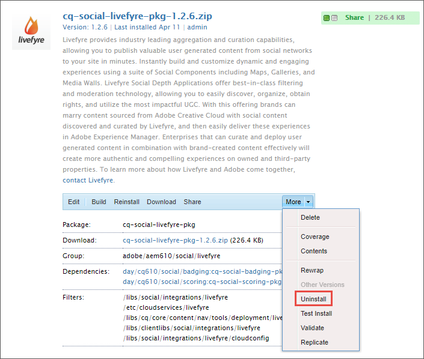
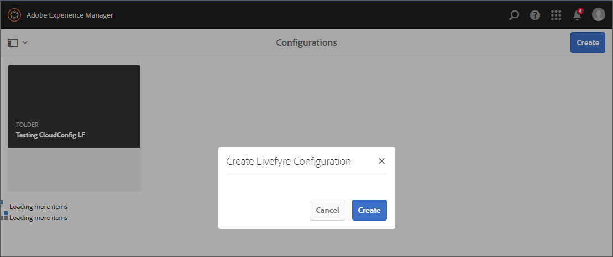

# 與 Livefyre 整合{#integrating-with-livefyre}

了解如何將Livefyre領先業界的組織功能與您的AEM 6.5執行個體整合，讓您在數分鐘內將寶貴的使用者產生內容(UGC)從社交網路發佈至您的網站。

## 快速入門 {#getting-started}

### 安裝適用於AEM的Livefyre套件 {#install-livefyre-package-for-aem}

AEM 6.5隨附預先安裝的Livefyre功能套件1.2.6。 此套件僅包含與AEM Sites的有限Livefyre整合，且必須先解除安裝，才能安裝更新的套件。 透過最新套件，您可體驗Livefyre與AEM的完整整合，包括網站、資產和商務。

>[!NOTE]
>
>AEM-LF套件的某些功能取決於社交元件架構(SCF)。 如果您使用Livefyre功能套件作為非社群網站的一部分，您必須宣告 *cq.social.scf* 作為網站之作者用戶端清單中的相依性。 如果您使用LF功能套件作為社群網站的一部分，則應已宣告此相依性。

1. 從AEM首頁，按一下 **工具** 圖示。
1. 導覽至 **部署>包**.
1. 在套件管理器中，捲動直到您看到預先安裝的Livefyre功能套件為止，然後按一下套件標題 **cq-social-livefyre-pkg-1.2.6.zip** 以展開選項。
1. 按一下 **更多>卸載**.

   

1. 從下載Livefyre套件 [Software Distribution](https://experience.adobe.com/#/downloads/content/software-distribution/en/aem.html).

1. 從套件管理器，安裝下載的套件。 請參閱 [如何使用套件](/help/sites-administering/package-manager.md) 有關在AEM中使用Software Distribution和套件的詳細資訊

   

   您的Livefyre-AEM套件現已安裝。 您必須先設定AEM以使用Livefyre，才能開始使用整合功能。

   如需Feature Pack的詳細資訊和發行說明，請參閱 [Feature Pack](https://experienceleague.adobe.com/docs/experience-manager-65/release-notes/home.html).

### 設定AEM以使用Livefyre:建立配置資料夾 {#configure-aem-to-use-livefyre-create-a-configuration-folder}

1. 從AEM首頁，按一下 **工具** 圖示，然後導覽至 **一般>設定瀏覽器**.
   * 請參閱 [配置瀏覽器](/help/sites-administering/configurations.md) 檔案以取得詳細資訊。
1. 按一下 **建立** 開啟「建立配置」對話框。
1. 為您的設定命名，並檢查 **雲端設定** 核取方塊。

   這會在下方建立資料夾 **Tools > Deployment > Livefyre Configuration** 提供的名稱。

   

### 設定AEM以使用Livefyre:建立Livefyre設定 {#configure-aem-to-use-livefyre-create-a-livefyre-configuration}

設定AEM以使用貴組織的Livefyre授權憑證，以便Livefyre與AEM之間通訊。

1. 從AEM首頁，按一下 **工具** 圖示，然後導覽至 **部署> Livefyre設定**.
1. 選取您要建立新Livefyre設定的設定資料夾，然後按一下 **建立**.

   

   >[!NOTE]
   >
   >資料夾的屬性必須啟用雲端設定，才能將Livefyre設定新增至資料夾。 配置資料夾是在 [配置瀏覽器。](/help/sites-administering/configurations.md)
   >
   >無法為配置建立名稱 — 該名稱由其所在資料夾的路徑引用。 每個資料夾只能有一個配置。

1. 選取新建立的Livefyre設定卡，然後按一下 **屬性**.

   

1. 輸入貴組織的Livefyre認證，然後按一下 **確定**.

   

   若要存取此資訊，請開啟Livefyre Studio並導覽至 **設定>整合設定>憑證**.

   您的AEM例項現已設定為使用Livefyre，而且您可以使用整合功能。

### 自訂單一登入整合 {#customize-single-sign-on-integration}

Livefyre for AEM套件包含AEM Communities設定檔與Livefyre SSO服務之間的現成整合。

使用者登入您的AEM網站時，也會登入Livefyre社交元件。 當登出的使用者嘗試使用需要驗證的Livefyre元件功能（例如上傳像片）時，Livefyre元件會起始使用者驗證。

預設驗證整合可能並非每個網站都最理想。 為了最符合網站範本中的驗證流程，您可以覆寫預設的Livefyre驗證委派，以符合您的需求。 使用下列步驟：

1. 使用CRXDE Lite，複製 */libs/social/integrations/livefyre/components/authorizablecomponent/authclientlib* to */apps/social/integrations/livefyre/components/authorizablecomponent/authclientlib*.
1. 編輯和儲存 */apps/social/integrations/livefyre/components/authorizablecomponent/authclientlib/auth.js* 實作符合您需求的Livefyre驗證委派。

   如需自訂驗證委派的詳細資訊，請參閱 [身分整合](https://answers.livefyre.com/developers/identity-integration/).

   如需AEM Clientlibs的詳細資訊，請參閱 [使用用戶端程式庫](https://experienceleague.adobe.com/docs/experience-manager-65/developing/introduction/clientlibs.html).

## 搭配AEM Sites使用Livefyre {#use-livefyre-with-aem-sites}

### 將Livefyre元件新增至頁面 {#add-livefyre-components-to-a-page}

在將Livefyre元件新增至Sites內的頁面之前，您必須從上層頁面繼承Livefyre雲端組態，或直接將組態新增至頁面，才能為頁面啟用Livefyre。 如需在網站上納入雲端服務，請參閱您的實作。

為頁面啟用Livefyre後，容器必須設定為允許Livefyre元件。 請參閱 [在設計模式中配置元件](https://experienceleague.adobe.com/docs/experience-manager-65/authoring/siteandpage/default-components-designmode.html) 以取得如何啟用不同元件的說明。

>[!NOTE]
>
>在自訂單一登入整合中設定驗證之前，需要驗證才能張貼的應用程式無法運作。

1. 從 **元件** 在設計模式下的側面板，選擇 **Livefyre** 從功能表將清單限制為可用的Livefyre元件。

   

1. 選取Livefyre元件，並將其拖曳至頁面上的位置。
1. 選取要建立新的Livefyre應用程式，還是內嵌現有應用程式。

   如果內嵌現有應用程式，AEM會要求您選取應用程式。 如果建立新應用程式，則必須先填入應用程式，才會顯示任何內容。 當頁面啟用Livefyre雲端設定時，應用程式將會建立在Livefyre網站和選取的網路中。

   有關插入元件的詳細資訊，請參見 [編輯頁面內容](https://experienceleague.adobe.com/docs/experience-manager-65/authoring/authoring/editing-content.html).

### 編輯AEM頁面的Livefyre元件。 {#edit-a-livefyre-component-for-an-aem-page}

您只能在Livefyre Studio中設定和編輯Livefyre元件。 從AEM:

1. 按一下Livefyre元件以進行設定。
1. 按一下 **設定** 圖示（扳手）以開啟設定對話方塊。
1. 按一下 **若要編輯此元件，請前往Livefyre Studio**.
1. 在Livefyre Studio中編輯應用程式。

## 搭配AEM Assets使用Livefyre {#use-livefyre-with-aem-assets}

### 要求權限並將UGC匯入AEM Assets {#request-rights-and-import-ugc-into-aem-assets}

您可以使用UGC匯入工具，將Twitter和Instagram使用者產生的內容(UGC)從Livefyre Studio匯入AEM Assets。 選取要匯入的內容後，您必須先要求內容的權限，才能完成匯入。

>[!NOTE]
>
>在使用Assets匯入UGC之前，您必須先在Livefyre Studio中設定Social帳戶和權限要求帳戶。 請參閱 [設定：權限要求](https://docs.adobe.com/content/help/en/livefyre/using/rights-requests/c-how-requesting-rights-works.html) 以取得更多資訊。

若要將UGC匯入AEM Assets:

1. 從AEM首頁，導覽至 **資產>檔案**.
1. 按一下 **建立**，然後按一下 **導入UGC。**

   

1. 查找內容：

   * 按一下UGC資料庫標籤即可從Livefyre取得。 使用篩選和搜尋，從UGC資料庫尋找內容。
   * 按一下「Twitter」或「Instagram」標籤，即可從「Twitter」和「Instagram」取得。 使用搜尋或篩選器來尋找內容。

1. 選取您要匯入的資產。 您選取的資產會自動計算，並儲存在 **已選取** 標籤。
1. **可選**:按一下 **已選取** 標籤，並檢閱您要匯入的所選UGC內容。
1. 按一下&#x200B;**下一步**。

   

1. 對於權限請求，請為每個資產選擇下列其中一個選項：

   若為Instagram:

   * **手動要求權限** 以取得可複製並貼上的訊息，並透過Instagram手動傳送給內容擁有者。
   * **手動歸因內容權限** 覆寫個別資產的權限。

   >[!NOTE]
   >
   >由於更新會影響來自非業務使用者帳戶的內容匯總，因此我們無法再代表您張貼意見，或自動檢查作者的回覆。 [按一下這裡以了解更多資訊](https://developers.facebook.com/blog/post/2018/04/04/facebook-api-platform-product-changes/).

   

   若為Twitter:

   * **訊息作者** 傳送訊息給內容擁有者，要求資產的權限。
   * **手動歸因內容權限** 覆寫個別資產的權限。

1. 按一下 **匯入**.

   如果您傳送Twitter權限請求，內容擁有者將會在其帳戶中看到權限請求訊息：

   

   >[!NOTE]
   >
   >Twitter對來自相同帳戶的相同請求有限制。 匯入多個資產時，請個別修改訊息，以避免遭到標籤。

1. 按一下 **完成** ，以完成「權限請求」工作流程。

   您可以在Livefyre Studio中查看資產的待定權利要求狀態。 如果內容擱置中的權限請求，在授予權限之前，資產不會顯示在AEM Assets中。 授予權限請求時，資產會自動顯示在AEM Assets中。

   針對Instagram，您必須追蹤內容擁有者的回應，並在指定內容權限時手動授予權限。

## 搭配AEM Commerce使用Livefyre {#use-livefyre-with-aem-commerce}

### 透過AEM Commerce將產品目錄匯入Livefyre {#import-product-catalogs-into-livefyre-with-aem-commerce}

AEM Commerce使用者可將其現有產品目錄流暢整合至Livefyre，以促進使用者參與Livefyre的視覺化應用程式。

匯入產品目錄後，產品會即時顯示在您的Livefyre例項中。 如果您編輯或刪除AEM Commerce產品目錄中的項目，變更會在Livefry中自動更新。

1. 確認AEM執行個體上已安裝最新的AEM適用的Livefyre套件。
1. 從AEM首頁，導覽至 **AEM Commerce**.
1. 建立新集合或使用現有集合。
1. 將滑鼠指標暫留在集合上，然後按一下 **集合屬性** （鉛筆圖示）。
1. 檢查 **同步至Livefyre**.
1. 填寫 **Livefyre頁面前置詞** 將此集合連結至AEM中的特定頁面。

   頁面首碼會定義環境中開始搜尋產品頁面的根路徑。 Livefyre會選擇與其相關聯之對應產品的第一個頁面。 若要針對不同的產品取得不同的頁面，需要多個集合。

## Livefyre應用程式的AEM支援對照表 {#aem-support-matrix-for-livefyre-apps}

| Livefyre應用程式 | AEM 6.1 | AEM 6.2 | AEM 6.3 | AEM 6.4 |
|---|---|---|---|---|
| 傳送 | X | X | X | X |
| 聊天 | X | X | X | X |
| 評論 | X | X | X | X |
| 膠片 |  | X | X | X |
| LiveBlog | X | X | X | X |
| 地圖 | X | X | X | X |
| 媒體牆 | X | X | X | X |
| 馬賽克 | X | X | X | X |
| 輪詢 |  | X | X | X |
| 評論 |  | X | X | X |
| 單卡 | X | X | X | X |
| Storify 2 |  | X | X | X |
| 趨勢 |  | X | X | X |
| 上傳按鈕 |  | X | X | X |
