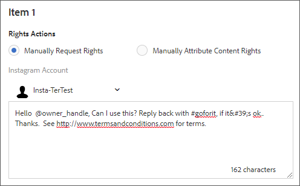

# 與Livefyre整合{#integrating-with-livefyre}

瞭解如何將Livefyre領先業界的組織功能與AEM 6.5執行個體整合，讓您在幾分鐘內將重要的使用者產生內容(UGC)從社交網路發佈至您的網站。

## 快速入門 {#getting-started}

### 安裝Livefyre Package for AEM {#install-livefyre-package-for-aem}

AEM 6.5隨附預先安裝的Livefyre功能套件1.2.6。 此套件僅包含與AEM Sites的有限Livefyre整合，且必須先解除安裝，才能安裝更新的套件。 透過最新套件，您可體驗Livefyre與AEM的完整整合，包括網站、資產和商務。

>[!NOTE]
>
>AEM-LF套件的某些功能取決於Social元件架構(SCF)。 如果您將Livefyre功能套件用作非社群網站的一部分，您必須在網站的作者clientlibs中將 *cq.social.scf* 宣告為相依性。 如果您將LF功能包用作社群網站的一部分，應已聲明此相依性。

1. 從AEM首頁，按一下左 **側邊欄上** 「工具」圖示。
1. 導覽至「部 **署>封裝」**。
1. 在「套件管理員」中，捲動直到您看到預先安裝的Livefyre功能套件，然後按一下套件標題 **cq-social-livefyre-pkg-1.2.6.zip** ，以展開選項。
1. 按一 **下「更多>解除安裝**」。

   

1. 返回AEM首頁，按一下「工具」，然後導覽至「部 **署>套件共用**」。

   此時會顯示功能套件和可下載的修補程式清單。

1. 在關鍵字搜尋中，搜尋「Livefyre」，然後選取與AEM版本對應的Livefyre功能套件。

   

1. 在功能套件資訊頁面上，按一下「 **下載**」，然後閱讀「套件授權合約」並按一下「 **接受」**。
1. 返回「包管理器」，找到新下載的包，然後按一下「安 **裝」**。

   

   您的Livefyre-AEM套件現已安裝。 您必須先設定AEM，才能開始使用整合功能。

   有關包的詳細資訊，請參 [閱How to Work With Packages](https://helpx.adobe.com/experience-manager/6-3/sites/administering/using/package-manager.html)。

   如需功能套件的詳細資訊和版本注意事項，請參閱 [功能套件](https://helpx.adobe.com/experience-manager/6-3/release-notes/feature-packs-release-notes.html)。

### 設定AEM以使用Livefyre:建立配置資料夾 {#configure-aem-to-use-livefyre-create-a-configuration-folder}

1. 在AEM首頁中，按一下左側邊 **欄的** 「工具」圖示，然後導覽至「一般> **設定瀏覽器」**。
1. 按一下 **建立** ，開啟建立配置對話框。
1. 命名您的設定，並勾選「雲端 **設定」核取方塊** 。

   這會在「工具>部 **署> Livefyre設定」下建立資料夾** ，並提供名稱。

   

### 設定AEM以使用Livefyre:建立Livefyre設定 {#configure-aem-to-use-livefyre-create-a-livefyre-configuration}

設定AEM以使用您組織的Livefyre授權認證，允許Livefyre與AEM之間通訊。

1. 從AEM首頁，按一下左側導軌中的「 **工具** 」圖示，然後導覽至「部 **署> Livefyre設定」**。
1. 選取您要建立新Livefyre設定的設定資料夾，然後按一下「建 **立**」。

   

   >[!NOTE]
   >
   >資料夾的屬性必須啟用雲端設定，才能將Livefyre設定新增至資料夾。 配置資料夾是在配置瀏覽器中建立和管理的。
   >
   >不能為配置建立名稱——該名稱由配置所在資料夾的路徑引用。 每個資料夾只能有一個配置。

1. 選取新建立的Livefyre設定卡，然後按一下「 **屬性**」。

   

1. 輸入您組織的Livefyre認證，然後按一下「 **確定**」。

   

   若要存取此資訊，請開啟Livefyre Studio，並導覽至「 **設定>整合設定>認證」**。

   您的AEM例項現在已設定為使用Livefyre，而且您可以使用整合功能。

### 自訂單一登入整合 {#customize-single-sign-on-integration}

Livefyre for AEM套件包含AEM Communities設定檔與Livefyre的SSO服務之間的現成可用整合。

當使用者登入您的AEM網站時，也會登入Livefyre社交元件。 當登出的使用者嘗試使用需要驗證的Livefyre元件功能（例如上傳像片）時，Livefyre元件會啟動使用者驗證。

預設驗證整合未必適合每個網站。 為了最符合網站範本中的驗證流程，您可以覆寫預設的Livefyre驗證委派，以符合您的需求。 使用下列步驟：

1. 使用CRXDE Lite，將copy */libs/social/integrations/livefyre/components/authorizablecomponent/authclientlib* to */apps/social/integrations/livefyre/components/authorizablecomponent/authclientlib*。
1. 編輯並儲 *存/apps/social/integrations/livefyre/components/authorizablecomponent/authclientlib/auth.js* ，以建置符合您需求的Livefyre Auth Delegate。

   如需自訂驗證委派的詳細資訊，請參閱 [身分整合](https://answers.livefyre.com/developers/identity-integration/)。

   如需AEM Clientlibs的詳細資訊，請參 [閱「使用用戶端程式庫」](https://helpx.adobe.com/experience-manager/6-3/sites/developing/using/clientlibs.html)。

## 搭配AEM Sites使用Livefyre {#use-livefyre-with-aem-sites}

### 將Livefyre元件新增至頁面 {#add-livefyre-components-to-a-page}

在將Livefyre元件新增至網站內的頁面之前，您必須從父頁面繼承Livefyre雲端設定，或直接將設定新增至頁面，以啟用頁面的Livefyre。 請參閱您的實作，瞭解如何在您的網站上包含雲端服務。

在為頁面啟用Livefyre後，必須將容器設定為允許Livefyre元件。 如需 [如何啟用不同元件的說明](https://helpx.adobe.com/experience-manager/6-3/sites/authoring/using/default-components-designmode.html) ，請參閱在設計模式中設定元件。

>[!NOTE]
>
>在「自訂單一登入整合」中設定驗證後，要求發佈驗證的應用程式才會運作。

1. 在設計模 **式中** ，從「元件」側面板中，從選單選取「 **Livefyre** 」，將清單限制為可用的Livefyre元件。

   

1. 選取Livefyre元件，並將其拖曳至頁面上的位置。
1. 選取要建立新的Livefyre應用程式或內嵌現有應用程式。

   如果內嵌現有應用程式，AEM會要求您選取「應用程式」。 如果建立新的應用程式，則應用程式必須先填入，才會顯示任何內容。 當頁面啟用Livefyre雲端設定時，應用程式將會在Livefyre網站和網路中選取。

   如需插入元件的詳細資訊，請參閱 [編輯頁面內容](https://helpx.adobe.com/experience-manager/6-3/sites/authoring/using/editing-content.html)。

### 編輯AEM頁面的Livefyre元件。 {#edit-a-livefyre-component-for-an-aem-page}

您只能在Livefyre studio中設定和編輯Livefyre元件。 來自AEM:

1. 按一下Livefyre元件以進行設定。
1. 按一下「 **設定** 」圖示（扳手）以開啟設定對話方塊。
1. Click **To edit this component, go to Livefyre Studio**.
1. 在Livefyre studio中編輯應用程式。

## 搭配AEM資產使用Livefyre {#use-livefyre-with-aem-assets}

### 請求權限並將UGC匯入AEM資產 {#request-rights-and-import-ugc-into-aem-assets}

您可以使用UGC匯入工具，將Twitter和Instagram使用者產生的內容(UGC)從Livefyre studio匯入至AEM資產。 在選取要匯入的內容後，您必須先要求內容的權限，才能完成匯入。

>[!NOTE]
>
>在使用「資產」匯入UGC之前，您必須先在Livefyre studio中設定「Social帳戶」和「Rights Requests」帳戶。 請參閱 [設定：權限要求](https://marketing.adobe.com/resources/help/en_US/livefyre/c_how_requesting_rights_works.html) ，以取得詳細資訊。

若要將UGC匯入AEM資產：

1. 從AEM首頁，導覽至「資產> **檔案」**。
1. 按一 **下「建立**」，然後按一 **下「匯入UGC」。**

   

1. 尋找內容：

   * 從Livefyre按一下「UGC程式庫」標籤。 使用篩選器和搜尋，從UGC程式庫尋找內容。
   * 按一下Twitter或Instagram標籤，即可從Twitter和Instagram取得。 使用搜尋或篩選器來尋找內容。

1. 選取您要匯入的資產。 您選取的資產會自動計算並儲存在「選取的」標 **簽下** 。
1. **可選**:按一下「 **選取** 」標籤，並檢視選取的UGC內容以匯入。
1. 按一 **下「下一步**」。

   

1. 對於權限請求，請為每個資產選擇下列其中一個選項：

   對於Instagram:

   * **手動請求權限** ，以取得可複製並貼上的訊息，並透過Instagram手動傳送給內容擁有者。
   * **手動屬性內容權限** ，以覆寫個別資產的權限。
   >[!NOTE]
   >
   >由於更新會影響非商業使用者帳戶的內容匯總，因此我們無法再代表您張貼意見或自動檢查作者的回覆。 [按一下這裡以進一步瞭解](https://developers.facebook.com/blog/post/2018/04/04/facebook-api-platform-product-changes/)。

   

   針對Twitter:

   * **訊息作者** ：傳送訊息給內容擁有者，要求資產的權限。
   * **手動屬性內容權限** ，以覆寫個別資產的權限。

1. 按一 **下匯入**。

   如果您傳送Twitter的權限要求，內容擁有者會在其帳戶中看到權限要求訊息：

   

   >[!NOTE]
   >
   >Twitter對來自相同帳戶的相同請求有限制。 匯入多個資產時，請個別修改訊息以避免被標幟。

1. 按一 **下右上角的** 「完成」，以完成「權限請求」工作流程。

   您可在Livefyre studio中查看資產的待定權利要求狀態。 如果內容擱置中是權限請求，在授予權限之前，資產不會顯示在AEM資產中。 當授與「權限請求」時，資產會自動出現在AEM Assets中。

   若是Instagram，您必須追蹤內容擁有者的回應，並手動授與內容的權限。

## 搭配AEM Commerce使用Livefyre {#use-livefyre-with-aem-commerce}

### 使用AEM Commerce將產品目錄匯入Livefyre {#import-product-catalogs-into-livefyre-with-aem-commerce}

AEM Commerce使用者可將現有的產品目錄完美整合至Livefyre，以推動使用者參與Livefyre的視覺化應用程式。

匯入產品目錄後，產品即時顯示在您的Livefyre實例中。 如果您編輯或刪除AEM Commerce產品目錄中的項目，這些變更會自動在Livefrye中更新。

1. 請確定您的AEM例項上已安裝最新的Livefyre for AEM套件。
1. 從AEM首頁，導覽至 **AEM Commerce**。
1. 建立新系列或使用現有的系列。
1. 將滑鼠指標暫留在系列上，然後按一 **下「系列屬性** 」（鉛筆圖示）。
1. 勾選「 **同步至Livefyre**」。
1. 填寫 **Livefyre頁面首碼** ，將此系列連結至AEM中的特定頁面。

   頁面首碼定義環境中開始搜尋產品頁面的根路徑。 Livefyre會選擇第一個具有與其相關聯之對應產品的頁面。 若要針對不同的產品取得不同的頁面，需要多個系列。

## Livefyre應用程式的AEM支援矩陣 {#aem-support-matrix-for-livefyre-apps}

| Livefyre應用程式 | AEM 6.1 | AEM 6.2 | AEM 6.3 | AEM 6.4 |
|---|---|---|---|---|
| 傳送 | X | X | X | X |
| 聊天 | X | X | X | X |
| 評論 | X | X | X | X |
| 幻燈片 |  | X | X | X |
| LiveBlog | X | X | X | X |
| 地圖 | X | X | X | X |
| 媒體牆 | X | X | X | X |
| 馬賽克 | X | X | X | X |
| 輪詢 |  | X | X | X |
| 評論 |  | X | X | X |
| 單張卡 | X | X | X | X |
| Storify 2 |  | X | X | X |
| 趨勢 |  | X | X | X |
| 上傳按鈕 |  | X | X | X |

