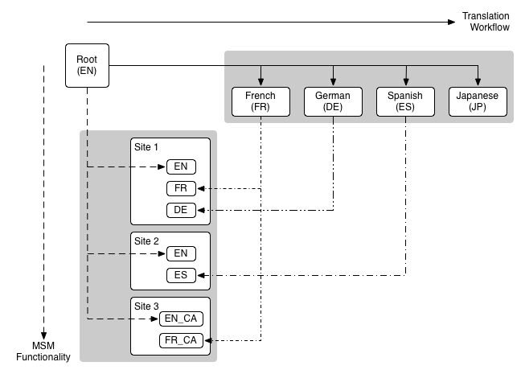

# 網站管理{#website-administration}

以下管理工具可用於管理網站和頁面：

* Multi Site Manager(MSM)可讓您在多個位置使用相同的網站內容，同時允許變化：

   * [重複使用內容：多網站管理員和即時副本](/help/sites-administering/msm.md)

* 翻譯可讓您自動翻譯頁面內容、資產和使用者產生的內容，以建立和維護多語言網站：

   * [翻譯多語言網站的內容](/help/sites-administering/translation.md)

* 這兩項功能可結合為多語系和多語系網 [站提供](#multinational-and-multilingual-sites)。

## 跨國和多語言網站 {#multinational-and-multilingual-sites}

您可以透過結合使用「多網站管理員」和翻譯工作流程，為跨國網站和多語言網站有效率地建立內容。 以一種語言為特定國家／地區建立主體網站，然後將該內容作為其他網站的基礎，視需要使用翻譯：

* [將主版網站](/help/sites-administering/translation.md) (master site)翻譯成不同的語言。

* 使用 [多網站管理員](/help/sites-administering/msm.md) ，您可以：

   * 重複使用主版網站的內容及翻譯，為其他國家和文化建立網站。
   * 請務必將「多網站管理員」的使用限制在一種語言的內容中，例如：國家網站的英文主版->英文分支、法文主版->國家網站的法文分支。
   * 視需要分離即時副本的元素，以新增本地化詳細資訊。

下圖說明主要概念的交集方式（但不顯示涉及的所有級別／元素）:

>[!NOTE]
>
>在這種情況下，MSM不會管理不同的語言版本。
>
>* [MSM](/help/sites-administering/msm.md) 管理從藍圖（如全域主版）到即時副本（如本地站點）的語言邊界內的翻譯內容的部署。
>* AEM [的翻譯整合](/help/sites-administering/translation.md) 功能與協力廠商的翻譯管理服務搭配使用，可管理語言並將內容翻譯成這些不同的語言。
>
>
若是更進階的使用案例，MSM也可跨語言母版使用。

>[!NOTE]
>
>針對所有使用案例，建議您閱讀下列最佳實務：
>
>* [MSM的最佳實務](/help/sites-administering/msm-best-practices.md);特別是：
>
>  * [建立網站](/help/sites-administering/msm-best-practices.md#create-site)
>  * [MSM與多語言網站](/help/sites-administering/msm-best-practices.md#msm-and-multilingual-websites)
>
>* [翻譯的最佳做法](/help/sites-administering/tc-bp.md)
