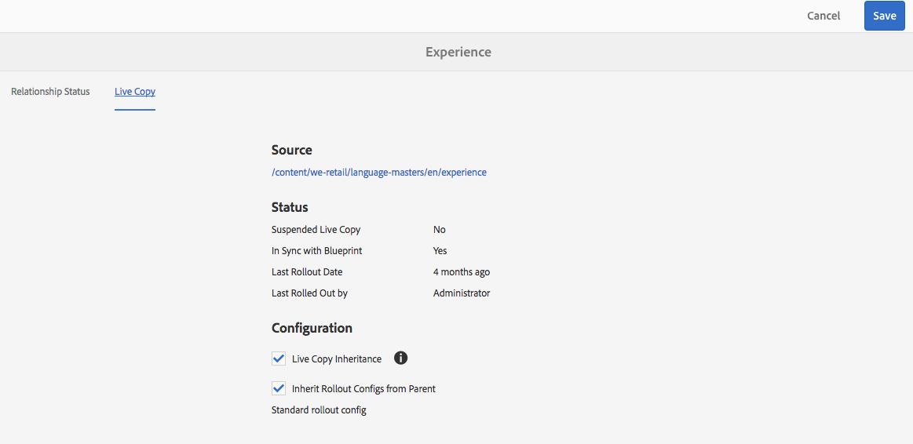

# Live Copy概述主控台{#live-copy-overview-console}

**即時副本概述**&#x200B;可讓您：

* 檢視/管理整個網站的繼承：

   * 檢視Blueprint樹狀結構和對應的Live Copy結構，及其繼承狀態
   * 更改繼承狀態；例如，暫停，繼續
   * 檢視Blueprint和Live Copy屬性

* 執行轉出動作

## 開啟即時副本概述{#opening-the-live-copy-overview}

您可以從以下位置開啟「即時副本概述」：

* [參考Blueprint頁面的側面板（網站主控台）](#opening-live-copy-overview-references-for-a-blueprint-page)
* [Blueprint頁面的屬性](#opening-live-copy-overview-properties-of-a-blueprint-page)

### 開啟即時副本概述 — Blueprint頁面{#opening-live-copy-overview-references-for-a-blueprint-page}的參考

您可以從&#x200B;**Sites**&#x200B;控制台的&#x200B;**References**&#x200B;側面板開啟&#x200B;**Live Copy概述**:

1. 在&#x200B;**Sites**&#x200B;控制台中，[導覽至您的Blueprint頁面並選取它](/help/sites-authoring/basic-handling.md#viewing-and-selecting-resources)。
1. 開啟&#x200B;**[References](/help/sites-authoring/basic-handling.md#references)**&#x200B;面板，然後選取&#x200B;**Live Copys**。

   

   >[!NOTE]
   >
   >您也可以先開啟「參考」，然後選取Blueprint。

1. 選擇「即時副本概述」(**Live Copy Overview**)以顯示並使用與所選藍圖相關的所有即時副本的概述。
1. 使用&#x200B;**關閉**&#x200B;退出並返回&#x200B;**Sites**&#x200B;控制台。

### 開啟即時副本概述 — Blueprint頁面{#opening-live-copy-overview-properties-of-a-blueprint-page}的屬性

檢視Blueprint頁面的屬性時，可以開啟&#x200B;**即時副本概述**:

1. 開啟適當Blueprint頁面的&#x200B;**屬性**。
1. 開啟&#x200B;**Blueprint**&#x200B;標籤 — 頂端工具列會顯示&#x200B;**即時副本概述**&#x200B;選項：

   

1. 選擇「即時副本概述」(**Live Copy Overview**)以顯示並使用與當前Blueprint相關的所有即時副本的概述。

   >[!NOTE]
   >
   >有關詳細資訊，另請參閱知識庫文章[Livecopy狀態消息 — 最新/綠色/同步](https://helpx.adobe.com/experience-manager/kb/livecopy-status-message---up-to-date-green-in-sync.html)。

1. 使用&#x200B;**關閉**&#x200B;退出並返回&#x200B;**Sites**&#x200B;控制台。

## 使用即時副本概述{#using-the-live-copy-overview}

**即時副本概述**&#x200B;也可用於在即時副本上執行動作：

1. 開啟&#x200B;**即時副本概述**。
1. 選取所需的Blueprint或即時副本頁面 — 工具列將會更新，以顯示可用的動作。 可用的[actions](/help/sites-administering/msm.md#terms-used)取決於您選取的是[blueprint](#actions-for-a-blueprint-page)或[即時副本](#actions-for-a-live-copy-page)頁面：

### Blueprint頁面{#actions-for-a-blueprint-page}的動作

選取Blueprint頁面時，可執行下列動作：

* 編輯

   * 開啟Blueprint頁面進行編輯。

* [轉出](/help/sites-administering/msm.md#rollout-and-synchronize)

   * 執行轉出以將變更從來源推送至LiveCopy。

### 即時副本頁面{#actions-for-a-live-copy-page}的動作

選取即時副本頁面時，可使用下列動作：

* 編輯

   * 開啟即時副本頁面進行編輯。

* [關係狀態](#relationship-status)

   * 檢視狀態和繼承的相關資訊。

* [同步](/help/sites-administering/msm.md#rollout-and-synchronize)

   * 同步即時副本，以從來源提取變更至即時副本。

* [重設](/help/sites-administering/msm-livecopy.md#resetting-a-live-copy-page)

   * 重設即時副本頁面以移除所有繼承取消，並將頁面傳回與來源頁面相同的狀態。

* [擱置](/help/sites-administering/msm.md#suspending-and-cancelling-inheritance-and-synchronization)

   * 暫時停用即時副本與其Blueprint頁面之間的即時關係。

* [繼續](/help/sites-administering/msm-livecopy.md#resuming-inheritance-for-a-page)

   * 「恢復」允許您恢復已暫停的關係。

* [分離](/help/sites-administering/msm.md#detaching-a-live-copy)

   * 永久移除即時副本與其Blueprint頁面之間的即時關係。

## 關係狀態 {#relationship-status}

**關係狀態**&#x200B;控制台有兩個頁簽，提供一系列功能：

* [關係狀態資訊](#relationship-status-information)
* [即時副本資訊](#live-copy-information)

### 關係狀態資訊{#relationship-status-information}

此索引標籤提供Blueprint與Live Copy之間關係狀態的詳細資訊：

### 即時副本資訊{#live-copy-information}

此索引標籤可讓您檢視和編輯即時副本設定：

