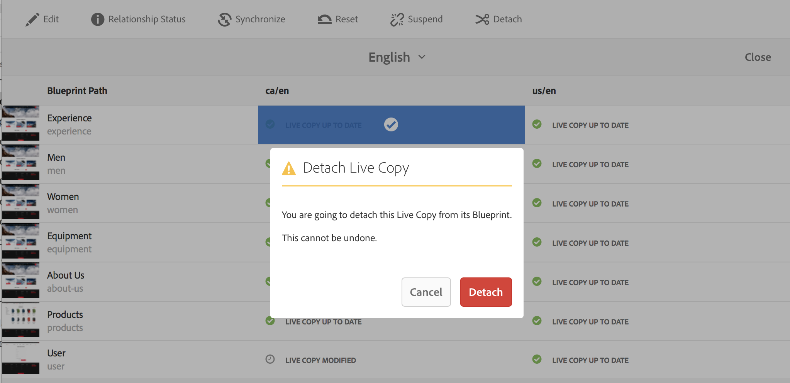

# 建立並同步Live Copy{#creating-and-synchronizing-live-copies}

您可以從頁面或Blueprint設定建立即時副本，然後可以管理繼承和同步。

## 管理Blueprint配置{#managing-blueprint-configurations}

Blueprint設定可識別您要用作一個或多個即時副本頁面源的現有網站。

>[!NOTE]
>
>Blueprint設定可讓您推送內容變更至即時副本。 請參閱[即時副本 — 源、藍圖和Blueprint配置](/help/sites-administering/msm.md#source-blueprints-and-blueprint-configurations)。

建立Blueprint設定時，您會選取定義Blueprint內部結構的範本。 預設的Blueprint範本假設來源網站具有下列特性：

* 網站有根頁面。
* 根目錄的直接子頁面是網站的語言分支。 建立即時副本時，會將語言顯示為要納入副本中的選用內容。
* 每個語言分支的根具有一個或多個子頁。 建立即時副本時，子頁面會顯示為您可納入即時副本的章節。

>[!NOTE]
>
>不同的結構需要另一個Blueprint範本。

建立Blueprint設定後，請設定下列屬性：

* **名稱**:Blueprint配置的名稱。
* **源路徑**:您用作來源(Blueprint)之網站的根頁面路徑。
* **說明**. （選用）Blueprint設定的說明。 說明會顯示在建立網站時要選擇的Blueprint設定清單中。

使用Blueprint設定時，您可將其與轉出設定建立關聯，此設定可決定來源/Blueprint的即時副本同步方式。 請參閱[指定要使用的轉出組態](/help/sites-administering/msm-sync.md#specifying-the-rollout-configurations-to-use)。

### 建立Blueprint配置{#creating-a-blueprint-configuration}

要建立Blueprint配置：

1.  導覽至「工 **** 具」功能表，然後選取「網 **** 站」功能表。
1. 選擇&#x200B;**Blueprint**&#x200B;以開啟&#x200B;**Blueprint配置**&#x200B;控制台：

   

1. 選擇 **建立**。
1. 選取Blueprint範本，然後選取&#x200B;**Next**&#x200B;以繼續。
1. 選擇要用作Blueprint的源頁面；然後&#x200B;**Next**&#x200B;繼續。
1. 定義：

   * **標題**:blueprint的強制標題
   * **說明**:可選的說明，以提供詳細資訊。

1. **** Create將根據您的規範建立Blueprint配置。

### 編輯或刪除Blueprint配置{#editing-or-deleting-a-blueprint-configuration}

您可以編輯或刪除現有的Blueprint設定：

1.  導覽至「工 **** 具」功能表，然後選取「網 **** 站」功能表。
1. 選擇&#x200B;**Blueprint**&#x200B;以開啟&#x200B;**Blueprint配置**&#x200B;控制台：

   

1. 選取所需的Blueprint設定 — 工具列中會提供適當的動作：

   * **屬性**;您可以使用它來檢視，然後編輯設定的屬性。
   * **刪除**

## 建立即時副本{#creating-a-live-copy}

### 建立頁面的即時副本{#creating-a-live-copy-of-a-page}

您可以建立任何頁面或分支的即時副本。 當您建立即時副本時，您可以指定用於同步內容的轉出設定：

* 選取的轉出設定會套用至即時副本頁面及其子頁面。
* 如果您未指定任何轉出設定，MSM會決定要使用的轉出設定。 請參閱[指定要使用的轉出設定](/help/sites-administering/msm-sync.md#specifying-the-rollout-configurations-to-use)。

您可以建立任何頁面的即時副本：

* 由[blueprint設定](#creating-a-blueprint-configuration)參考的頁面。
* 和與配置無連接的頁。
* AEM也支援在其他即時副本的頁面中建立即時副本。

唯一的差異是，源/Blueprint頁面上的&#x200B;**Rollout**&#x200B;命令是否可用取決於Blueprint配置是否引用源：

* 如果您從Blueprint設定中參照&#x200B;**為**&#x200B;的來源頁面建立Live Copy，則Rollout命令將可在來源/Blueprint頁面上使用。
* 如果您從Blueprint設定中&#x200B;**未**&#x200B;參考的來源頁面建立Live Copy，則來源/Blueprint頁面上將無法使用Rollout命令。

若要建立即時副本：

1. 在&#x200B;**Sites**&#x200B;控制台中，選擇&#x200B;**Create**，然後選擇&#x200B;**Live Copy**。

   

1. 選取來源頁面，然後按一下或點選&#x200B;**Next**。 例如：

   

1. 指定即時副本的目標路徑（開啟即時副本的父資料夾/頁面），然後按一下或點選&#x200B;**Next**。

   

   >[!NOTE]
   >
   >目標路徑不能在源路徑內。

1. 輸入：

   * a **頁面的標題**。
   * a **名稱**，用於URL。

   

1. 使用&#x200B;**排除子頁面**&#x200B;核取方塊：

   * 已選取：僅建立所選頁面的即時副本（淺層即時副本）
   * 未選擇：建立包含所選頁面所有子系的即時副本（深層即時副本）

1. （選用）若要指定要用於Live Copy的一或多個轉出設定，請使用&#x200B;**轉出設定**&#x200B;下拉式清單來選取它們；選取的設定會顯示在下拉式選取器下方。
1. 按一下或點選&#x200B;**建立**。 將顯示確認消息，從此處，您可以選擇&#x200B;**Open**&#x200B;或&#x200B;**Done**。

### 從Blueprint配置{#creating-a-live-copy-of-a-site-from-a-blueprint-configuration}建立網站的即時副本

使用Blueprint設定建立即時副本，以根據Blueprint（來源）內容建立網站。 當您從Blueprint設定建立即時副本時，請選取要複製的Blueprint來源的一或多個語言分支，然後選取要從語言分支複製的章節。 請參閱[建立Blueprint配置](/help/sites-administering/msm-livecopy.md#creating-a-blueprint-configuration)。

如果您從即時副本中忽略某些語言分支或章節，稍後可以新增它們；請參閱[在即時副本內建立即時副本（Blueprint設定）](#creating-a-live-copy-inside-a-live-copy-blueprint-configuration)。

>[!CAUTION]
>
>當Blueprint來源包含以不同分支中某個段落為目標的連結和參考時，即時副本頁面不會更新目標，但目標仍會指向原始目標。

建立網站時，請提供下列屬性的值：

* **初始語言**:要包含在即時副本中的Blueprint來源的語言分支。
* **初始章節**:要包含在即時副本中的Blueprint語言分支的子頁面。
* **目標路徑**:即時副本網站的根頁面位置。
* **標題**:即時副本網站的根頁面標題。
* **名稱**:（選用）儲存即時副本根頁面的JCR節點名稱。預設值以標題為基礎。
* **網站擁有者**:（可選）
* **即時副本**:選擇此選項可與源站點建立即時關係。如果未選擇此選項，則將建立Blueprint的副本，但隨後不會與源同步。
* **轉出設定**:（選用）選取一或多個轉出設定，以用於同步即時副本。依預設，轉出設定繼承自Blueprint;如需詳細資訊，請參閱[指定要使用的轉出組態。](/help/sites-administering/msm-sync.md#specifying-the-rollout-configurations-to-use)

若要從Blueprint設定建立網站的即時副本：

1. 在&#x200B;**Sites**&#x200B;控制台中，從下拉選擇器中選擇&#x200B;**Create**，然後選擇&#x200B;**Site**。
1. 選取要作為即時副本來源的Blueprint設定，然後繼續&#x200B;**Next**:

   

1. 使用&#x200B;**初始語言**&#x200B;選擇器指定用於即時副本的Blueprint網站的語言。

   預設會選取所有可用語言。 若要移除語言，請按一下或點選語言旁出現的&#x200B;**X**。

   例如：

   

1. 使用&#x200B;**初始章節**&#x200B;下拉式清單，選取要包含在即時副本中的Blueprint區段。 依預設，所有可用的章節都包含在內，但可移除。
1. 提供其餘屬性的值，然後選擇&#x200B;**Create**。 在確認對話框中，選擇&#x200B;**Done**&#x200B;以返回&#x200B;**Sites**&#x200B;控制台，或選擇&#x200B;**Open Site**&#x200B;以開啟站點的根頁。

### 在即時副本內建立即時副本（Blueprint設定）{#creating-a-live-copy-inside-a-live-copy-blueprint-configuration}

當您在現有即時副本內建立即時副本時（使用Blueprint設定建立），您可以插入任何語言副本或最初建立即時副本時未包含的章節。

## 監控您的Live Copy {#monitoring-your-live-copy}

### 查看即時副本的狀態{#seeing-the-status-of-a-live-copy}

即時副本頁面的屬性會顯示有關即時副本的下列資訊：

* **來源**:即時副本頁面的來源頁面。
* **狀態**:即時副本的同步狀態。狀態包括Live Copy是否與源更新，以及上次同步發生的時間以及執行同步的人員。
* **設定**:

   * 頁面是否仍受即時副本繼承的限制。
   * 設定是否繼承自上層頁面。
   * 即時副本使用的任何轉出設定。

要查看屬性，請執行以下操作：

1. 在&#x200B;**Sites**&#x200B;控制台中，選取即時副本頁面並開啟屬性。
1. 選擇&#x200B;**Live Copy**&#x200B;頁簽。

   例如：

   

   >[!NOTE]
   >
   >有關詳細資訊，另請參閱知識庫文章[Livecopy狀態消息 — 最新/綠色/同步](https://helpx.adobe.com/experience-manager/kb/livecopy-status-message---up-to-date-green-in-sync.html)。

### 查看Blueprint頁面的即時副本{#seeing-the-live-copies-of-a-blueprint-page}

Blueprint頁面（在Blueprint設定中參照）提供您一份即時副本頁面清單，該清單會使用目前(Blueprint)頁面作為來源。 使用此清單來追蹤即時副本。 清單會顯示在[頁面屬性](/help/sites-authoring/editing-page-properties.md)的&#x200B;**Blueprint**&#x200B;標籤上。

## 同步即時副本{#synchronizing-your-live-copy}

### 展開Blueprint {#rolling-out-a-blueprint}

展開Blueprint頁面，將內容變更推送至Live Copy。 **轉出**&#x200B;動作會執行使用[轉出時](/help/sites-administering/msm-sync.md#rollout-triggers)觸發器的轉出設定。

>[!NOTE]
>
>如果在Blueprint分支和相依的即時副本分支中建立了具有相同頁面名稱的新頁面，則可能會發生衝突。
>
>這類[衝突需要在轉出時處理和解決](/help/sites-administering/msm-rollout-conflicts.md)。

#### 從頁面屬性{#rolling-out-a-blueprint-from-page-properties}轉出Blueprint

1. 在&#x200B;**Sites**&#x200B;控制台中，選取Blueprint中的頁面並開啟屬性。
1. 開啟&#x200B;**Blueprint**&#x200B;標籤。
1. 選擇&#x200B;**轉出**。

   

1. 指定頁面和任何子頁面，然後使用勾號確認：

   

1. 指定轉出工作是否應立即執行(**Now**)或在其他日期/時間執行(**Later**)。

   

轉出會以非同步作業處理，並可以在&#x200B;[**非同步作業狀態**&#x200B;控制面板](asynchronous-jobs.md#monitor-the-status-of-asynchronous-operations)中的&#x200B;**全域導覽** -> **工具** -> **操作** -> **作業**&#x200B;檢查

>[!NOTE]
>
>非同步轉出處理需要AEM 6.5.3.0或更新版本。 在舊版中，會立即同步處理頁面。

#### 從參考邊欄{#roll-out-a-blueprint-from-the-reference-rail}轉出Blueprint

1. 在&#x200B;**Sites**&#x200B;控制台中，選取即時副本中的頁面，並開啟&#x200B;**[References](/help/sites-authoring/basic-handling.md#references)**&#x200B;面板（從工具列）。
1. 從清單中選擇&#x200B;**Blueprint**&#x200B;選項，以顯示與此頁面關聯的藍圖。
1. 從清單中選取所需的Blueprint。
1. 按一下或點選&#x200B;**轉出**。
1. 系統會要求您確認轉出的詳細資訊：

   * **轉出範圍**:

      指定範圍是僅針對所選頁面，還是應包含子頁面。

   * **計劃**:

      指定轉出工作是否應立即執行(**Now**)或在稍後的日期/時間執行(**Later**)。

      

1. 確認這些詳細資料後，請選取&#x200B;**轉出**&#x200B;以執行動作。

轉出會以非同步作業處理，並可以在&#x200B;[**非同步作業狀態**&#x200B;控制面板](asynchronous-jobs.md#monitor-the-status-of-asynchronous-operations)中的&#x200B;**全域導覽** -> **工具** -> **操作** -> **作業**&#x200B;檢查

>[!NOTE]
>
>非同步轉出處理需要AEM 6.5.3.0或更新版本。 在舊版中，會立即同步處理頁面，除非已勾選&#x200B;**背景轉出**&#x200B;選項。

#### 從即時副本概述{#roll-out-a-blueprint-from-the-live-copy-overview}推出Blueprint

選取Blueprint頁面時，也可從Live Copy概述](/help/sites-administering/msm-livecopy-overview.md#using-the-live-copy-overview)中使用[轉出動作。

1. 開啟[即時副本概述](/help/sites-administering/msm-livecopy-overview.md#using-the-live-copy-overview)並選取Blueprint頁面。
1. 從工具列選取&#x200B;**轉出**。
1. 指定頁面和任何子頁面，然後使用勾號確認：

   

1. 指定轉出工作是否應立即執行(**Now**)或在其他日期/時間執行(**Later**)。

   

轉出會以非同步作業處理，並可以在&#x200B;[**非同步作業狀態**&#x200B;控制面板](asynchronous-jobs.md#monitor-the-status-of-asynchronous-operations)中的&#x200B;**全域導覽** -> **工具** -> **操作** -> **作業**&#x200B;檢查

>[!NOTE]
>
>非同步轉出處理需要AEM 6.5.3.0或更新版本。 在舊版中，會立即同步處理頁面。

### 同步即時副本{#synchronizing-a-live-copy}

同步即時副本頁面，以從來源提取內容變更至即時副本。

#### 從頁面屬性同步即時副本{#synchronize-a-live-copy-from-page-properties}

同步即時副本，以從來源提取變更至即時副本。

>[!NOTE]
>
>同步會執行使用[轉出時](/help/sites-administering/msm-sync.md#rollout-triggers)觸發器的轉出設定。

1. 在&#x200B;**Sites**&#x200B;控制台中，選取即時副本頁面並開啟屬性。
1. 開啟&#x200B;**Live Copy**&#x200B;標籤。
1. 按一下或點選「**同步**」。

   

   將請求確認，請使用&#x200B;**Sync**&#x200B;繼續。

#### 從即時副本概述{#synchronize-a-live-copy-from-the-live-copy-overview}同步即時副本

選取「即時副本」頁面時，「即時副本概述」](/help/sites-administering/msm-livecopy-overview.md#using-the-live-copy-overview)中也提供「同步」動作。[

1. 開啟[即時副本概述](/help/sites-administering/msm-livecopy-overview.md#using-the-live-copy-overview)並選取即時副本頁面。
1. 從工具欄中選擇&#x200B;**同步**。
1. 指定是否要包含之後，在對話方塊中確認&#x200B;**轉出**&#x200B;動作：

   * **頁面和子頁面**
   * **僅頁面**

   

## 變更即時副本內容{#changing-live-copy-content}

若要變更即時副本內容，您可以：

* 將段落新增至頁面。
* 中斷任何頁面或元件的即時副本繼承，以更新現有內容。

>[!NOTE]
>
>如果您在即時副本中手動建立新頁面，則此頁面是即時副本的本機頁面，這表示它沒有要附加的對應來源頁面。
>
>建立屬於關係一部分的本機頁面的最佳實務是在來源中建立，然後進行（深層）轉出。 這會將頁面在本機建立為即時副本。

>[!NOTE]
>
>如果在Blueprint分支和相依的即時副本分支中建立了具有相同頁面名稱的新頁面，則可能會發生衝突。
>
>這類[衝突需要在轉出時處理和解決](/help/sites-administering/msm-rollout-conflicts.md)。

### 將元件新增至即時副本頁面{#adding-components-to-a-live-copy-page}

隨時將元件新增至即時副本頁面。 即時副本及其段落系統的繼承狀態無法控制您新增元件的能力。

將即時副本頁面與來源頁面同步時，新增的元件維持不變。 另請參閱[變更即時副本頁面上的元件順序](#changing-the-order-of-components-on-a-live-copy-page)。

>[!NOTE]
>
>在本機對標示為容器的元件所做的變更，將不會由轉出時的Blueprint內容覆寫。 如需詳細資訊，請參閱[MSM最佳實務](/help/sites-administering/msm-best-practices.md#components-and-container-synchronization) 。

### 暫停頁面{#suspending-inheritance-for-a-page}的繼承

建立即時副本時，即時副本設定會儲存在複製頁面的根頁面上。 根頁面的所有子頁面都會繼承即時副本設定。 livecopy頁面上的元件也會繼承即時副本設定。

您可以暫停即時副本頁面的即時副本繼承，以便變更頁面屬性和元件。 暫停繼承時，頁面屬性和元件不再與源同步。

>[!NOTE]
>
>您也可以從Blueprint中[分離即時副本](#detaching-a-live-copy)以移除所有連線。 「分離」(Detach)操作是永久的且不可逆的。

>[!NOTE]
>
>如果元件被標籤為容器，取消和掛起操作不適用於其子元件。 如需詳細資訊，請參閱[MSM最佳實務](/help/sites-administering/msm-best-practices.md#components-and-container-synchronization) 。

#### 暫停頁面屬性的繼承{#suspending-inheritance-from-page-properties}

暫停頁面上的繼承：

1. 使用&#x200B;**Sites**&#x200B;控制台的&#x200B;**View Properties**&#x200B;命令或使用頁面工具列上的&#x200B;**Page Information**&#x200B;開啟Live Copy頁面的屬性。
1. 按一下或點選「**即時副本**」標籤。
1. 從工具欄中選擇&#x200B;**掛起**。 然後，您可以選取以下任一項：

   * **暫停**:僅限目前頁面
   * **帶子項暫停**:當前頁以及任何子頁

1. 在確認對話框中選擇&#x200B;**掛起**。

#### 暫停即時副本概述{#suspending-inheritance-from-the-live-copy-overview}中的繼承

選取「即時副本」頁面時，也可從「即時副本概述」](/help/sites-administering/msm-livecopy-overview.md#using-the-live-copy-overview)使用「暫停」動作。[

1. 開啟[即時副本概述](/help/sites-administering/msm-livecopy-overview.md#using-the-live-copy-overview)並選取即時副本頁面。
1. 從工具欄中選擇&#x200B;**掛起**。
1. 從以下項目中選取適當的選項：

   * **擱置**
   * **暫停子項**

   

1. 在&#x200B;**暫停即時副本**&#x200B;對話方塊中確認&#x200B;**暫停**&#x200B;動作：

   

### 繼續頁面{#resuming-inheritance-for-a-page}的繼承

暫停頁面的即時副本繼承是暫時動作。 暫停後，**Resume**&#x200B;動作就可用，允許您恢復即時關係。

當您重新啟用繼承時，頁面不會自動與來源同步。 如果需要，您可以請求同步，可以：

* 在&#x200B;**Resume**/**Revert**&#x200B;對話方塊中；例如：

   

* 稍後階段，手動選取同步動作。

>[!CAUTION]
>
>當您重新啟用繼承時，頁面不會自動與來源同步。 如果需要，可以手動請求同步；在繼續或更新版本時執行。

#### 繼續從頁面屬性{#resuming-inheritance-from-page-properties}繼承

一旦[暫停](#suspending-inheritance-from-page-properties),**Resume**&#x200B;動作就會變成頁面屬性的工具列中：

選取後，會顯示對話方塊。 您可以視需要選取同步，然後確認動作。

#### 從即時副本概述{#resume-a-live-copy-page-from-the-live-copy-overview}繼續即時副本頁面

選取「即時副本」頁面時，也可從「即時副本概述」](/help/sites-administering/msm-livecopy-overview.md#using-the-live-copy-overview)使用[恢復動作。

1. 開啟[即時副本概述](/help/sites-administering/msm-livecopy-overview.md#using-the-live-copy-overview)並選取已暫停的即時副本頁面；將顯示為&#x200B;**INHERITANCE CANCELLED**。
1. 從工具欄中選擇&#x200B;**Resume**。
1. 指出您是否要在還原繼承後同步頁面，然後在&#x200B;**Resume Live Copy**&#x200B;對話方塊中確認&#x200B;**Resume**&#x200B;動作。

### 更改繼承深度（淺層/深層）{#changing-inheritance-depth-shallow-deep}

在現有的即時副本上，您可以變更頁面的深度；即是否包含子頁面。

* 切換為淺層即時副本：

   * 會立即生效，而且是不可逆的。

      * 子頁面會明確與即時副本分離。 如果撤消，則無法保留對子項的進一步修改。

      * 將刪除任何子體`LiveRelationships`，即使嵌套`LiveCopies`亦然。

* 切換至深層即時副本：

   * 子頁面仍未變更。
   * 若要查看切換的效果，您可以進行轉出，任何內容修改都會根據轉出設定套用。

* 切換為淺層即時副本，然後切換回深層：

   * （以前）淺層即時副本的所有子項都被視為已手動建立，因此會使用`[oldname]_msm_moved name`移走。

要指定或更改深度：

1. 使用&#x200B;**Sites**&#x200B;控制台的&#x200B;**View Properties**&#x200B;命令或使用頁面工具列上的&#x200B;**Page Information**&#x200B;開啟Live Copy頁面的屬性。
1. 按一下或點選「**即時副本**」標籤。
1. 在&#x200B;**Configuration**&#x200B;區段中，根據是否包含子頁面，設定或清除&#x200B;**Live Copy繼承**&#x200B;選項：

   * 已勾選 — 深層即時副本（包含子頁面）
   * 清除 — 淺層即時副本（排除子頁面）

   >[!CAUTION]
   >
   >切換為淺層即時副本會立即生效，且不可逆。
   >
   >如需詳細資訊，請參閱[即時副本 — 組成](/help/sites-administering/msm.md#live-copies-composition)。

1. 按一下或點選&#x200B;**儲存**&#x200B;以保存更新。

### 取消元件{#cancelling-inheritance-for-a-component}的繼承

取消元件的即時副本繼承，使元件不再與源元件同步。 您可以在稍後視需要啟用繼承。

>[!NOTE]
>
>如果元件被標籤為容器，取消和掛起操作不適用於其子元件。 如需詳細資訊，請參閱[MSM最佳實務](/help/sites-administering/msm-best-practices.md#components-and-container-synchronization) 。

>[!NOTE]
>
>當您重新啟用繼承時，元件不會自動與源同步。 如果需要，可以手動請求同步。

取消繼承以更改元件內容或刪除元件：

1. 按一下或點選您要取消繼承的元件。

   

1. 在元件工具列上，按一下或點選&#x200B;**取消繼承**&#x200B;圖示。

   

1. 在取消繼承對話框中，使用&#x200B;**Yes**&#x200B;確認操作。

   元件工具列會更新為包含所有（適當）的編輯命令。

### 重新啟用元件{#re-enabling-inheritance-for-a-component}的繼承

若要啟用元件的繼承，請按一下或點選元件工具列上的&#x200B;**重新啟用繼承**&#x200B;圖示。

### 變更即時副本頁面上的元件順序{#changing-the-order-of-components-on-a-live-copy-page}

如果即時副本包含屬於段落系統的元件，則該段落系統的繼承遵循以下規則：

* 可修改繼承段落系統中的元件順序，即使建立繼承。
* 轉出時，元件的順序將從Blueprint中還原。 如果在轉出前將新元件新增至即時副本，則會重新排序這些元件以及上方新增的元件。
* 如果取消段落系統的繼承，轉出時不會還原元件順序，且會維持即時副本中的順序。

>[!NOTE]
>
>在還原段落系統上取消的繼承時，元件&#x200B;**的順序將不會從Blueprint中自動還原**。 如果需要，可以手動請求同步。

使用以下過程取消段落系統的繼承。

1. 開啟即時副本頁面。
1. 將現有元件拖曳至頁面上的新位置。
1. 在&#x200B;**取消繼承**&#x200B;對話方塊中，使用&#x200B;**Yes**&#x200B;確認動作。

### 覆寫即時副本頁面{#overriding-properties-of-a-live-copy-page}的屬性

依預設，Live Copy頁面的頁面屬性會從來源頁面繼承（且無法編輯）。

當您需要變更即時副本的屬性值時，可以取消屬性的繼承。 連結圖示表示已為屬性啟用繼承。

取消繼承時，可以更改屬性值。 斷開連結表徵圖表示繼承被取消。

您稍後可以視需要重新啟用屬性的繼承。

>[!NOTE]
>
>當您重新啟用繼承時，即時副本頁面屬性不會自動與來源屬性同步。 如果需要，可以手動請求同步。

1. 使用&#x200B;**Sites**&#x200B;控制台的&#x200B;**查看屬性**&#x200B;選項或頁面工具列上的&#x200B;**頁面資訊**&#x200B;圖示，開啟Live Copy頁面的屬性。
1. 若要取消屬性的繼承，請按一下或點選屬性右側的連結圖示。

   

1. 在&#x200B;**取消繼承**&#x200B;確認對話方塊中，按一下或點選&#x200B;**是**。

### 還原即時副本頁面{#revert-properties-of-a-live-copy-page}的屬性

若要啟用屬性的繼承，請按一下或點選屬性旁出現的&#x200B;**還原繼承**&#x200B;圖示。

### 重設即時副本頁面{#resetting-a-live-copy-page}

將即時副本頁面重設為：

* 刪除所有繼承取消和
* 將頁面傳回與來源頁面相同的狀態。

重置會影響您對頁面屬性、段落系統和元件所做的更改。

#### 從頁面屬性{#reset-a-live-copy-page-from-the-page-properties}重設即時副本頁面

1. 在&#x200B;**Sites**&#x200B;控制台中，選擇Live Copy頁，然後選擇&#x200B;**View Properties**。
1. 開啟&#x200B;**Live Copy**&#x200B;標籤。
1. 從工具欄中選擇&#x200B;**重置**。

   

1. 在&#x200B;**重設即時副本**&#x200B;對話方塊中，使用&#x200B;**重設**&#x200B;確認。

#### 從Live Copy概述{#reset-a-live-copy-page-from-the-live-copy-overview}重設Live Copy頁面

選取「即時副本」頁面時，「即時副本概述」中也提供「[重設」動作。](/help/sites-administering/msm-livecopy-overview.md#using-the-live-copy-overview)

1. 開啟[即時副本概述](/help/sites-administering/msm-livecopy-overview.md#using-the-live-copy-overview)並選取即時副本頁面。
1. 從工具欄中選擇&#x200B;**重置**。
1. 在&#x200B;**重設即時副本**&#x200B;對話方塊中確認&#x200B;**重設**&#x200B;動作：

   

## 比較即時副本頁面與Blueprint頁面{#comparing-a-live-copy-page-with-a-blueprint-page}

若要追蹤您所做的變更，您可以在&#x200B;**參考**&#x200B;中檢視Blueprint頁面，並與其即時副本頁面比較：

1. 在&#x200B;**Sites**&#x200B;控制台中，[導覽至Blueprint或Live Copy頁面並選取它](/help/sites-authoring/basic-handling.md#viewing-and-selecting-resources)。
1. 開啟&#x200B;**[References](/help/sites-authoring/basic-handling.md#references)**&#x200B;面板並選取：

   * **Blueprint** （選取即時副本頁面時）
   * **即時副本** （當選取Blueprint頁面時）

1. 選取您的特定即時副本，然後：

   * **與Blueprint比較** （選取即時副本頁面時）
   * **與即時副本比較** （當選取Blueprint頁面時）

   例如：

   

1. 兩個頁面（即時副本和Blueprint）將並排開啟。

   有關使用此功能的完整資訊，請參閱[頁面差異](/help/sites-authoring/page-diff.md)。

## 分離即時副本{#detaching-a-live-copy}

「分離」會永久移除即時副本與其來源/藍圖頁面之間的即時關係。 所有與MSM相關的屬性會從Live Copy中移除，而Live Copy頁面會變成獨立Copy。

>[!CAUTION]
>
>分離即時副本後，無法恢復即時關係。
>
>若要移除與稍後恢復的選項的即時關係，您可以為頁面取消即時副本繼承](#suspending-inheritance-for-a-page)。[

使用&#x200B;**Detach**&#x200B;的樹內的哪個位置可能有問題：

* **在LiveCopy的根頁上分離**

   在即時副本的根頁面上執行此操作時，會移除Blueprint的所有頁面與其即時副本之間的即時關係。

   Blueprint中頁面的進一步變更（原樣）**不會**&#x200B;影響LiveCopy（原樣）。

* **在LiveCopy的子頁上分離**

   在即時副本的子頁面（或分支）上執行此操作時：

   * 該子頁面（或分支）的即時關係將被移除
   * 而即時副本分支中的（子）頁面則視為已手動建立。

   *不過*，子頁面仍受上層分支的即時關係所限制，因此Blueprint頁面的進一步推出將會同時進行：

   1. 重新命名分離的頁面：

      * 這是因為MSM會將它們視為手動建立的頁面，而造成衝突，因為這些頁面的名稱與它嘗試建立的LiveCopy頁面相同。
   1. 以原始名稱建立新(LiveCopy)頁面，其中包含轉出的變更。

   >[!NOTE]
   >
   >如需此類情況的詳細資訊，請參閱[MSM轉出衝突](/help/sites-administering/msm-rollout-conflicts.md)。

### 從「頁面屬性」 {#detach-a-live-copy-page-from-the-page-properties}中分離「即時副本」頁

分離即時副本：

1. 在&#x200B;**Sites**&#x200B;主控台中，選取即時副本頁面，然後按一下或點選&#x200B;**View Properties**。
1. 開啟&#x200B;**Live Copy**&#x200B;標籤。
1. 在工具欄上，選擇&#x200B;**Detach**。

   

1. 將顯示確認對話框，請選擇&#x200B;**Detach**&#x200B;以完成操作。

### 從Live Copy概述{#detach-a-live-copy-page-from-the-live-copy-overview}中分離Live Copy頁

選取「即時副本」頁面時，「即時副本概述」](/help/sites-administering/msm-livecopy-overview.md#using-the-live-copy-overview)中也提供「分離」動作。[

1. 開啟[即時副本概述](/help/sites-administering/msm-livecopy-overview.md#using-the-live-copy-overview)並選取即時副本頁面。
1. 從工具欄中選擇&#x200B;**分離**。
1. 在&#x200B;**分離即時副本**&#x200B;對話框中確認&#x200B;**分離**&#x200B;操作：

   
