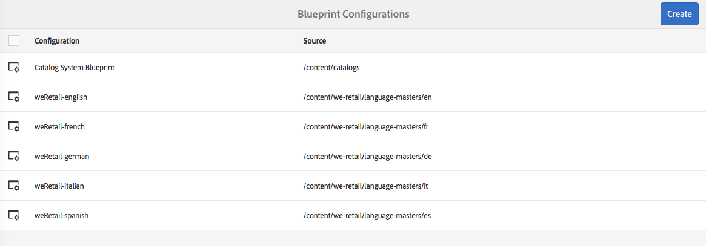

# 建立和同步即時副本{#creating-and-synchronizing-live-copies}

您可以從頁面或Blueprint設定建立即時副本，然後管理繼承和同步。

## 管理Blueprint配置 {#managing-blueprint-configurations}

Blueprint設定可識別您要用作一或多個即時副本頁面來源的現有網站。

>[!NOTE]
>
>Blueprint設定可讓您將內容變更推送至即時副本。 請參 [閱即時拷貝——源、藍圖和藍圖配置](/help/sites-administering/msm.md#source-blueprints-and-blueprint-configurations)。

當您建立Blueprint設定時，您會選取範本，以定義Blueprint的內部結構。 預設的Blueprint範本假設來源網站具有下列特性：

* 網站有根頁面。
* 根目錄的直接子頁面是網站的語言分支。 當建立即時副本時，這些語言會顯示為要包含在副本中的選用內容。
* 每個語言分支的根目錄有一個或多個子頁。 建立即時副本時，子頁面會顯示為您可加入即時副本的章節。

>[!NOTE]
>
>不同的結構需要另一個藍圖範本。

建立Blueprint設定後，請設定下列屬性：

* **名稱**:Blueprint設定的名稱。
* **源路徑**:您用作來源(Blueprint)之網站的根頁面路徑。
* **說明**. （可選）藍圖設定的說明。 描述會顯示在建立網站時要選擇的Blueprint組態清單中。

當您的Blueprint設定被使用時，您可將它與轉出設定建立關聯，此設定可決定來源/Blueprint的即時副本的同步方式。 請參 [閱指定要使用的轉出配置](/help/sites-administering/msm-sync.md#specifying-the-rollout-configurations-to-use)。

### 建立Blueprint設定 {#creating-a-blueprint-configuration}

要建立Blueprint配置：

1. [導覽至](/help/sites-authoring/basic-handling.md#global-navigation) 「工 **具」功能表** ，然後選取「網 **站** 」功能表。
1. 選擇「 **Blueprint** 」(藍圖 **)以開啟「** Blueprint配置控制台」:

   

1. 選擇 **建立**。
1. 選擇Blueprint範本，然後 **選擇** 「下一步」繼續。
1. 選取要用作藍圖的來源頁面；下 **一步** ，繼續。
1. 定義：

   * **標題**:藍圖的必備標題
   * **說明**:提供詳細資訊的選用說明。

1. **Create** will create the blueprint configuration based on your specification.

### 編輯或刪除Blueprint配置 {#editing-or-deleting-a-blueprint-configuration}

您可以編輯或刪除現有的Blueprint設定：

1. [導覽至](/help/sites-authoring/basic-handling.md#global-navigation) 「工 **具」功能表** ，然後選取「網 **站** 」功能表。
1. 選擇「 **Blueprint** 」(藍圖 **)以開啟「** Blueprint配置控制台」:

   

1. 選擇所需的Blueprint配置——工具欄中將提供相應的操作：

   * **屬性**;您可以使用它來查看，然後編輯配置的屬性。
   * **刪除**
   

## 建立即時副本 {#creating-a-live-copy}

### 建立頁面的即時副本 {#creating-a-live-copy-of-a-page}

您可以建立任何頁面或分支的即時副本。 當您建立即時副本時，可以指定轉出設定，以用於同步內容：

* 選取的轉出設定會套用至即時副本頁面及其子頁面。
* 如果您未指定任何轉出設定，MSM會決定要使用哪些轉出設定。 請參 [閱指定要使用的轉出設定](/help/sites-administering/msm-sync.md#specifying-the-rollout-configurations-to-use)。

您可以建立任何頁面的即時副本：

* 頁面是藍圖設定所 [參考的](#creating-a-blueprint-configuration),
* 和與配置無連接的頁面。
* AEM也支援在其他即時副本的頁面內建立即時副本。

唯一的區別是，源/ **Blueprint頁面上的** Rovolt（轉出）命令是否可用取決於Blueprint配置是否引用源：

* 如果您從Blueprint設定中參 **考的來源頁面** ，建立即時副本，則「轉出」命令將可在來源/Blueprint頁面上使用。
* 如果您從Blueprint設定中未參 **考的來源頁面** ，則Rolovate命令將無法在來源/Blueprint頁面上使用。

若要建立即時副本：

1. 在Sites控制 **台中** ，依序選 **擇「建立**」、「即時 **複製」**。

   

1. 選取來源頁面，然後按一下或點選「下 **一步**」。 例如：

   

1. 指定即時副本的目標路徑（開啟即時副本的父資料夾／頁面），然後按一下或點選「下 **一步」**。

   

   >[!NOTE]
   >
   >目標路徑不能位於源路徑中。

1. 輸入：

   * 頁面 **的標題** 。
   * 名 **稱**，用於URL中。
   

1. 使用「排 **除子頁面」核取方** 塊：

   * 已選取：僅建立所選頁面的即時副本（淺層即時副本）
   * 未選取：建立包含所選頁面所有子系的即時副本（即時深度副本）

1. （可選）若要指定一或多個轉出組態以用於livecopy，請使用「轉出組態 **** 」下拉式清單來選取它們；選取的組態會顯示在下拉式選取器下方。
1. 按一下或點選「 **建立**」。 將會顯示確認訊息，您可從此處選擇「開 **啟** 」或 **「完成**」。

### 從Blueprint設定建立網站的即時副本 {#creating-a-live-copy-of-a-site-from-a-blueprint-configuration}

使用Blueprint設定建立即時副本，以根據Blueprint（來源）內容建立網站。 當您從Blueprint設定建立即時副本時，請選取要複製之Blueprint來源的一或多個語言分支，然後選取要從語言分支複製的章節。 請參 [閱建立Blueprint設定](/help/sites-administering/msm-livecopy.md#creating-a-blueprint-configuration)。

如果您在即時副本中遺漏了某些語言分支或章節，您稍後可以加入；請參 [閱在即時副本中建立即時副本（Blueprint設定）](#creating-a-live-copy-inside-a-live-copy-blueprint-configuration)。

>[!CAUTION]
>
>當藍圖來源包含指向不同分支中某個段落的連結和參考時，即時副本頁面中的目標不會更新，但仍會指向原始目標。

建立網站時，請提供下列屬性的值：

* **初始語言**:要包含在即時副本中的Blueprint來源的語言分支。
* **初始章節**:藍圖語言分支的子頁面，要包含在即時副本中。
* **目標路徑**:即時副本網站的根頁面位置。
* **標題**:即時副本網站的根頁面標題。
* **名稱**:（可選）儲存即時副本之根頁面的JCR節點名稱。 預設值是以標題為基礎。
* **網站擁有者**:（可選）
* **即時副本**:選擇此選項可建立與來源網站的即時關係。 如果未選擇此選項，則會建立Blueprint的副本，但隨後不會與源同步。
* **轉出設定**:（可選）選取一或多個轉出設定，以用於同步即時副本。 依預設，轉出組態會繼承自藍圖；如需詳 [細資訊，請參閱指定要使用的轉出](/help/sites-administering/msm-sync.md#specifying-the-rollout-configurations-to-use) 設定。

要從Blueprint配置建立站點的即時副本，請執行以下操作：

1. 在「網 **站** 」主控台中，選 **擇「建立**」, **然後從下拉選取器選擇「網站** 」。
1. 選擇要用作即時副本源的Blueprint配置，然後繼續下 **一步**:

   

1. 使用「 **初始語言** 」選擇器，指定要用於即時副本的Blueprint網站語言。

   預設會選取所有可用語言。 若要移除語言，請按一下或點選 **出現在** 「語言」旁邊的X。

   例如：

   

1. 使用「 **初始章節** 」下拉式清單，選取要包含在即時副本中的藍圖章節。 依預設，所有可用章節都會包含在內，但可以移除。
1. 提供其餘屬性的值，然後選擇「創 **建」**。 在確認對話方塊中，選 **取「完成** 」以返回 **Sites** Console，或 **「開啟網站** 」以開啟網站的根頁面。

### 在即時副本中建立即時副本（Blueprint設定） {#creating-a-live-copy-inside-a-live-copy-blueprint-configuration}

當您在現有即時副本中建立即時副本（使用Blueprint設定建立）時，可以插入原始建立即時副本時未包含的任何語言副本或章節。

## 監控即時副本 {#monitoring-your-live-copy}

### 查看即時副本的狀態 {#seeing-the-status-of-a-live-copy}

即時副本頁面的屬性會顯示有關即時副本的下列資訊：

* **來源**:即時副本頁面的來源頁面。
* **狀態**:即時副本的同步狀態。 狀態包括活動副本是否與源同步為最新，以及上次同步發生的時間以及執行同步的人員。
* **設定**:

   * 頁面是否仍受即時副本繼承的約束。
   * 配置是否繼承自父頁。
   * 即時副本使用的任何轉出設定。

要查看屬性：

1. 在Sites控 **制台中** ，選取即時副本頁面並開啟屬性。
1. 選取「即 **時副本** 」標籤。

   例如：

   

   >[!NOTE]
   >
   >如需詳細資訊，另請參閱知識文 [庫文章Livecopy狀態訊息——最新／綠色／同步](https://helpx.adobe.com/experience-manager/kb/livecopy-status-message---up-to-date-green-in-sync.html)。

### 檢視Blueprint頁面的即時副本 {#seeing-the-live-copies-of-a-blueprint-page}

Blueprint頁面（在Blueprint設定中參考）提供您使用目前(Blueprint)頁面做為來源的即時副本頁面清單。 使用此清單來追蹤即時副本。 清單會顯示在頁 **面屬性的** 「Blueprint [」標籤上](/help/sites-authoring/editing-page-properties.md)。

## 同步即時副本 {#synchronizing-your-live-copy}

### 展示藍圖 {#rolling-out-a-blueprint}

展開藍圖頁面，將內容變更推播至即時副本。 轉出 **動作** ，會執行使用「轉出時」觸發 [器的轉出設定](/help/sites-administering/msm-sync.md#rollout-triggers) 。

>[!NOTE]
>
>如果在Blueprint分支和相依即時副本分支中建立具有相同頁面名稱的新頁面，則可能會發生衝突。
>
>這些 [衝突需要在推出時處理並解決](/help/sites-administering/msm-rollout-conflicts.md)。

#### 從頁面屬性展開Blueprint {#rolling-out-a-blueprint-from-page-properties}

1. 在Sites控 **制台中** ，選取Blueprint中的頁面並開啟屬性。
1. 開啟「 **Blueprint** 」標籤。
1. 選擇 **轉出**。

   

1. 指定頁面和任何子頁面，然後使用勾號進行確認：

   

#### 從參考邊欄展開藍圖 {#roll-out-a-blueprint-from-the-reference-rail}

1. 在 **Sites** 主控台中，選取Blueprint中的頁面，並開啟「 **[References](/help/sites-authoring/basic-handling.md#references)**」（參考）面板（從工具列）。
1. 從清單中選擇 **Blueprint** （藍圖）選項，以顯示與此頁關聯的藍圖。
1. 從清單中選取所需的藍圖。
1. 按一下或點選「 **轉出**」。
1. 系統會要求您確認推出的詳細資訊：

   * **轉出範圍**:

      指定範圍是僅針對所選頁面，還是應包含子頁面。

   * **背景轉出**:

      如果涉及許多頁面／子頁面，您可以將轉出作為背景任務執行。
   

1. 確認這些詳細資訊後，請選 **取Rovolt** 以執行動作。

#### 從即時副本概觀推出Blueprint {#roll-out-a-blueprint-from-the-live-copy-overview}

當選 [取「藍圖」頁面時，「即時副本概述](/help/sites-administering/msm-livecopy-overview.md#using-the-live-copy-overview)」也會提供「轉出」動作。

1. 開啟即 [時副本概述](/help/sites-administering/msm-livecopy-overview.md#using-the-live-copy-overview) ，並選取Blueprint頁面。
1. 從工 **具列選擇** 「轉出」。
1. 指定頁面和任何子頁面，然後使用勾號進行確認：

   

### 同步即時副本 {#synchronizing-a-live-copy}

同步即時副本頁面，從來源提取內容變更至即時副本。

#### 從頁面屬性同步即時副本 {#synchronize-a-live-copy-from-page-properties}

同步即時副本，將更改從源位置提取到即時副本。

>[!NOTE]
>
>同步化會執行使用「轉出時」觸發 [器的轉出](/help/sites-administering/msm-sync.md#rollout-triggers) 設定。

1. 在Sites控 **制台中** ，選取即時副本頁面並開啟屬性。
1. 開啟「即 **時副本** 」標籤。
1. 按一下或點選「 **同步**」。

   

   將請求確認，請使用 **同步** 繼續。

#### 從即時副本概觀同步即時副本 {#synchronize-a-live-copy-from-the-live-copy-overview}

當選 [取「即時副本」頁面時，「即時副本概述」(Live Copy Overview](/help/sites-administering/msm-livecopy-overview.md#using-the-live-copy-overview))中也會提供「同步化」(Synchronize)動作。

1. 開啟「即 [時副本概述](/help/sites-administering/msm-livecopy-overview.md#using-the-live-copy-overview) 」，然後選取「即時副本頁面」。
1. 從工 **具欄中** ，選擇「同步」。
1. 指定是 **否要包含** :

   * **頁面和子頁面**
   * **僅頁面**
   

## 變更即時副本內容 {#changing-live-copy-content}

若要變更即時副本內容，您可以：

* 新增防撞欄至頁面。
* 中斷任何頁面或元件的即時副本繼承，以更新現有內容。

>[!NOTE]
>
>如果您在即時副本中手動建立新頁面，則該頁面是即時副本的本機頁面，這表示它沒有要附加的對應來源頁面。
>
>建立屬於關係一部分的本機頁面的最佳實務是在來源中建立頁面，並進行（深入）推展。 這會將頁面建立為即時副本。

>[!NOTE]
>
>如果在Blueprint分支和相依即時副本分支中建立具有相同頁面名稱的新頁面，則可能會發生衝突。
>
>這些 [衝突需要在推出時處理並解決](/help/sites-administering/msm-rollout-conflicts.md)。

### 新增元件至即時副本頁面 {#adding-components-to-a-live-copy-page}

隨時將元件新增至即時副本頁面。 即時副本及其段落系統的繼承狀態無法控制您新增元件的能力。

當即時副本頁面與來源頁面同步時，新增的元件仍維持不變。 另請參 [閱變更即時副本頁面上的元件順序](#changing-the-order-of-components-on-a-live-copy-page)。

>[!NOTE]
>
>轉出時，對標示為容器的元件進行的本機變更不會被Blueprint的內容覆寫。 如需詳 [細資訊，請參閱MSM最佳實務](/help/sites-administering/msm-best-practices.md#components-and-container-synchronization) 。

### 暫停頁面的繼承 {#suspending-inheritance-for-a-page}

當您建立即時副本時，即時副本設定會儲存在複製頁面的根頁面上。 根頁面的所有子頁面都繼承即時副本配置。 livecopy頁面上的元件也會繼承即時副本設定。

您可以暫停即時副本頁面的即時副本繼承，以便變更頁面屬性和元件。 暫停繼承時，頁面屬性和元件不再與源同步。

>[!NOTE]
>
>您也可以 [將即時副本從Blueprint中分離](#detaching-a-live-copy) ，以移除所有連線。 「分離」(Detach)操作是永久的和不可逆的。

#### 暫停頁面屬性的繼承 {#suspending-inheritance-from-page-properties}

要暫停頁面上的繼承：

1. 使用Sites控制台的「檢視屬性」命令，或使用頁面工具列上的「頁面資訊」, **開啟即時** 複製頁面的屬性 ******** 。
1. 按一下或點選「即 **時副本** 」標籤。
1. 從工 **具列選擇** 「暫停」。 然後，您可以選擇以下任一選項：

   * **暫停**:僅限目前頁面
   * **暫停(含子項**):目前頁面與任何子頁面

1. 在確 **認對話框** ，選擇「暫停」。

#### 暫停從即時副本概述的繼承 {#suspending-inheritance-from-the-live-copy-overview}

當選 [取「即時副本」頁面時](/help/sites-administering/msm-livecopy-overview.md#using-the-live-copy-overview),「即時副本概述」中也會提供「暫停」動作。

1. 開啟「即 [時副本概述](/help/sites-administering/msm-livecopy-overview.md#using-the-live-copy-overview) 」，然後選取「即時副本頁面」。
1. 從工 **具列選擇** 「暫停」。
1. 從以下位置選擇適當的選項：

   * **擱置**
   * **暫停子項**
   

1. 在**Suspend Live Copy ** **對話方塊中確認** 「暫停」動作：

   

### 繼續繼承頁面 {#resuming-inheritance-for-a-page}

暫停頁面的即時副本繼承是暫時動作。 暫停後，「繼 **續** 」動作就可使用，讓您重新建立即時關係。

當您重新啟用繼承時，頁面不會自動與來源同步。 如果需要，可以請求同步：

* 在「恢 **復**/**恢復** 」對話框中；例如：

   

* 在稍後階段，手動選擇同步操作。

>[!CAUTION]
>
>當您重新啟用繼承時，頁面不會自動與來源同步。 如果需要，可以手動請求同步；在恢復時或以後恢復時。

#### 繼續從頁面屬性繼承 {#resuming-inheritance-from-page-properties}

暫停 [後](#suspending-inheritance-from-page-properties) ,「繼 **續** 」動作會出現在頁面屬性的工具列中：

選中後，將顯示該對話框。 如果需要，可以選擇同步，然後確認操作。

#### 從即時副本概觀繼續即時副本頁面 {#resume-a-live-copy-page-from-the-live-copy-overview}

當選 [取「即時副本」頁面時，「即時副本概述」(Live Copy Overview](/help/sites-administering/msm-livecopy-overview.md#using-the-live-copy-overview))也會提供「繼續」(Resume)動作。

1. 開啟即 [時副本概述](/help/sites-administering/msm-livecopy-overview.md#using-the-live-copy-overview) ，並選取已暫停的即時副本頁面；將顯示為「已取 **消繼承」**。
1. 從工 **具欄中** ，選擇「繼續」。
1. 指出在回復繼承後是否要同步頁面，然後在**「繼續即時副本」( **Resume Live Copy)** **對話框中確認「繼續」(Resume)操作。

### 更改繼承深度（淺／深） {#changing-inheritance-depth-shallow-deep}

在現有的即時文案中，您可以變更頁面的深度；即是否包含子頁面。

* 切換為淺層即時副本：

   * 將會立即生效，且不可逆。

      * 子頁面會與即時副本明確分離。 如果撤消，則無法保留對子代的進一步修改。
   * 即使有嵌套， `LiveRelationships` 也會移除任何子體 `LiveCopies`。

* 切換為深度即時副本：

   * 子頁面仍保持不變。
   * 若要查看切換的效果，您可以進行推廣，任何內容修改都會根據推廣配置來套用。

* 切換為淺層即時副本，然後回到深層：

   * （先前）淺層即時副本的所有子項都會視為已手動建立，因此會使用移走 `[oldname]_msm_moved name`。

要指定或更改深度：

1. 使用Sites控制台的「檢視屬性」命令或使用頁面工具列上的「頁面資訊」, **開啟即時復本頁面的屬性** ，您可以使用Sites ******** Console的「檢視屬性」命令來開啟即時復本頁面的屬性。
1. 按一下或點選「即 **時副本** 」標籤。
1. 在「配 **置** 」部分中，根據是否包含子頁，設定或清除 **** 「即時複製繼承」選項：

   * 勾選——深入即時副本（包含子頁面）
   * clear —— 淺層即時副本（排除子頁面）
   >[!CAUTION]
   >
   >切換為淺層即時副本會立即生效，而且無法回復。
   >
   >如需詳 [細資訊，請參閱即時副本](/help/sites-administering/msm.md#live-copies-composition) -構圖。

1. 按一下或點選「 **儲存** 」以保存更新。

### 取消元件的繼承 {#cancelling-inheritance-for-a-component}

取消元件的即時副本繼承，使元件不再與源元件同步。 如有需要，您可以在稍後啟用繼承。

>[!NOTE]
>
>當您重新啟用繼承時，元件不會自動與來源同步。 如果需要，可以手動請求同步。

取消繼承以更改元件內容或刪除元件：

1. 按一下或點選要取消繼承的元件。

   

1. 在元件工具列上，按一下或點選「取消繼 **承** 」圖示。

   

1. 在「取消繼承」對話框中，使用「是」確認 **操作**。

   元件工具列會更新為包含所有（適當）編輯命令。

### 為元件重新啟用繼承 {#re-enabling-inheritance-for-a-component}

要為元件啟用繼承，請按一下或點選元件工 **具欄上的「重新啟用繼承** 」表徵圖。

### 變更即時副本頁面上的元件順序 {#changing-the-order-of-components-on-a-live-copy-page}

如果即時副本包含屬於段落系統一部分的元件，該段落系統的繼承將遵守下列規則：

* 可修改繼承段落系統中的元件順序，即使已建立繼承。
* 在推出時，元件順序將從Blueprint中還原。 如果新元件在轉出之前已新增至即時副本，則會重新排序這些元件，並加入上述元件。
* 如果取消段落系統的繼承，在轉出時，元件順序將不會復原，而且會維持在即時副本中的狀態。

>[!NOTE]
>
>當回復段落系統上取消的繼承時，元件順 **序不會自動從藍圖中** 恢復。 如果需要，可以手動請求同步。

請按下列步驟取消段落系統的繼承。

1. 開啟即時副本頁面。
1. 將現有元件拖曳至頁面上的新位置。
1. 在「取 **消繼承** 」對話框中，使用「是」確 **認操作**。

### 覆寫即時副本頁面的屬性 {#overriding-properties-of-a-live-copy-page}

依預設，「即時副本」頁面的頁面屬性會繼承（且不可編輯）自來源頁面。

當您需要變更即時副本的屬性值時，可以取消屬性的繼承。 連結表徵圖表示已為屬性啟用繼承。

取消繼承時，可以更改屬性值。 斷開連結表徵圖表示繼承已取消。

您稍後可以視需要重新啟用屬性的繼承。

>[!NOTE]
>
>當您重新啟用繼承時，即時副本頁面屬性不會自動與source屬性同步。 如果需要，可以手動請求同步。

1. 使用Sites控制台的「檢視屬性 **」選項或頁面工具列上的「頁面資** 訊」圖示 ******** ，開啟即時復本頁面的屬性。
1. 若要取消屬性的繼承，請按一下或點選出現在屬性右側的連結圖示。

   

1. 在「取消繼 **承確認** 」對話方塊中，按一下或點選「 **是」**。

### 還原即時副本頁面的屬性 {#revert-properties-of-a-live-copy-page}

要為屬性啟用繼承，請按一下或點選屬性旁 **邊的「恢復繼承** 」表徵圖。

### 重設即時副本頁面 {#resetting-a-live-copy-page}

將即時複製頁面重設為：

* 刪除所有繼承取消和
* 將頁面傳回與來源頁面相同的狀態。

重設會影響您對頁面屬性、段落系統和元件所做的變更。

#### 從頁面屬性重設即時副本頁面 {#reset-a-live-copy-page-from-the-page-properties}

1. 在Sites控 **制台中** ，選取即時複製頁面並選取「檢視 **屬性」**。
1. 開啟「即 **時副本** 」標籤。
1. 從工 **具列選擇** 「重設」。

   

1. 在「重設 **即時副本** 」對話方塊中，使用「重設 **」確認**。

#### 從即時副本概述重設即時副本頁面 {#reset-a-live-copy-page-from-the-live-copy-overview}

當選 [取「即時副本」頁面時，「即時副本概述](/help/sites-administering/msm-livecopy-overview.md#using-the-live-copy-overview)」也會提供「重設」動作。

1. 開啟「即 [時副本概述](/help/sites-administering/msm-livecopy-overview.md#using-the-live-copy-overview) 」，然後選取「即時副本頁面」。
1. 從工 **具列選擇** 「重設」。
1. 在「重設 **即時副本** 」對話方 **塊中確認「重設** 」動作：

   

## 比較即時副本頁面與Blueprint頁面 {#comparing-a-live-copy-page-with-a-blueprint-page}

若要追蹤您所做的變更，您可以在「參考」中檢視Blueprint頁面，並 **將其與** 「即時副本」頁面進行比較：

1. 在Sites控 **制台** ，導 [覽至Blueprint或即時副本頁面並加以選取](/help/sites-authoring/basic-handling.md#viewing-and-selecting-resources)。
1. 開啟「參 **[照](/help/sites-authoring/basic-handling.md#references)**」(References)面板並選擇：

   * **Blueprint** （選取即時復本頁面時）
   * **即時副本** （當選取藍圖頁面時）

1. 選擇您的特定即時副本，然後：

   * **與Blueprint比較** （選取即時復本頁面時）
   * **與即時副本比較** （當選取藍圖頁面時）
   例如：

   

1. 兩個頁面（即時副本和藍圖）將並排開啟。

   有關使用此功能的完整資訊，請參 [閱頁面差異](/help/sites-authoring/page-diff.md)。

## 分離即時副本 {#detaching-a-live-copy}

分離會永久移除即時副本與其來源／藍圖頁面之間的即時關係。 所有與MSM相關的屬性都會從即時副本中移除，而即時副本頁面會變成獨立副本。

>[!CAUTION]
>
>分離即時副本後，您無法重新建立即時關係。
>
>若要移除即時關係並選擇稍後重新安裝，您可以取 [消頁面的即時副本繼承](#suspending-inheritance-for-a-page) 。

使用「分離」( **Detach)的樹中的哪些位置有含義**:

* **在LiveCopy的根頁面上分離**

   在即時副本的根頁面上執行此操作時，它會移除Blueprint的所有頁面與其即時副本之間的即時關係。

   藍圖中頁面的進一步變更（原樣） **不會影響** 「即時副本」（原樣）。

* **在LiveCopy的子頁面上分離**

   在即時副本的子頁（或分支）上執行此操作時：

   * 該子頁面（或分支）的即時關係已移除
   * 而即時副本分支中的（子）頁面則被視為已手動建立。
   *但是*，子頁面仍受父分支的即時關係所約束，因此藍圖頁面的進一步推出將同時：

   1. 重新命名已分離的頁面：

      * 這是因為MSM會將它們視為手動建立的頁面，而這些頁面會造成衝突，因為它們的名稱與它嘗試建立的livecopy頁面相同。
   1. 使用原始名稱建立新的(livecopy)頁面，其中包含轉出的變更。
   >[!NOTE]
   >
   >如需 [此類情況的詳細資訊](/help/sites-administering/msm-rollout-conflicts.md) ，請參閱MSM Ploot Conflicts。

### 從頁面屬性中分離即時副本頁面 {#detach-a-live-copy-page-from-the-page-properties}

要分離即時副本：

1. 在Sites控 **制台中** ，選取即時副本頁面，然後按一下或點選「 **檢視屬性」**。
1. 開啟「即 **時副本** 」標籤。
1. 在工具欄上，選擇「分 **離」**。

   

1. 將顯示確認對話框，選擇「 **分離** 」以完成操作。

### 從即時副本概述中分離即時副本頁面 {#detach-a-live-copy-page-from-the-live-copy-overview}

當選 [取「即時副本」頁面時，「即時副本概述」(Live Copy Overview](/help/sites-administering/msm-livecopy-overview.md#using-the-live-copy-overview))中也提供「分離」(Detach)動作。

1. 開啟即 [時副本概述](/help/sites-administering/msm-livecopy-overview.md#using-the-live-copy-overview) ，並選取即時副本頁面。
1. 從工 **具欄中** ，選擇「分離」。
1. 在「分離 **即時** 」對話框中確 **認「分離」操作** :

   

