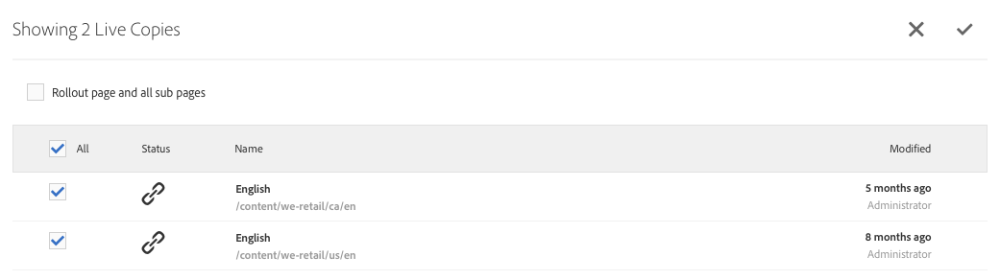

# 建立和同步 Live Copy{#creating-and-synchronizing-live-copies}

您可以從頁面或藍圖配置中建立即時副本，然後可以管理繼承和同步。

## 管理藍圖配置 {#managing-blueprint-configurations}

藍圖配置標識要用作一個或多個即時拷貝頁面源的現有網站。

>[!NOTE]
>
>藍圖配置使您能夠將內容更改推送到即時拷貝。 請參閱 [即時拷貝 — 源、藍圖和藍圖配置](/help/sites-administering/msm.md#source-blueprints-and-blueprint-configurations)。

建立藍圖配置時，將選擇一個模板來定義藍圖的內部結構。 預設藍圖模板假定源網站具有以下特徵：

* 網站有根頁。
* 根的直接子頁是網站的語言分支。 建立即時副本時，這些語言將作為可選內容顯示在副本中。
* 每個語言分支的根具有一個或多個子頁。 建立即時副本時，子頁面會顯示為可包含在即時副本中的章節。

>[!NOTE]
>
>不同的結構需要另一個藍圖模板。

建立藍圖配置後，可配置以下屬性：

* **名稱**:藍圖配置的名稱。
* **源路徑**:用作源（藍圖）的站點的根頁的路徑。
* **說明**. （可選）藍圖配置的說明。 描述顯示在建立站點時要從中選擇的藍圖配置清單中。

使用藍圖配置時，可以將其與部署配置關聯，該配置確定如何同步源/藍圖的即時副本。 請參閱 [指定要使用的推廣配置](/help/sites-administering/msm-sync.md#specifying-the-rollout-configurations-to-use)。

### 建立藍圖配置 {#creating-a-blueprint-configuration}

要建立藍圖配置：

1. [導航](/help/sites-authoring/basic-handling.md#global-navigation) 到 **工具** ，然後選擇 **站點** 的子菜單。
1. 選擇 **藍圖** 開啟 **藍圖配置** 控制台：

   

1. 選擇 **建立**。
1. 選擇藍圖模板，然後 **下一個** 繼續。
1. 選擇要用作藍圖的源頁面；然後 **下一個** 繼續。
1. 定義：

   * **標題**:藍圖的強制標題
   * **說明**:提供詳細資訊的可選說明。

1. **建立** 將根據規範建立藍圖配置。

### 編輯或刪除藍圖配置 {#editing-or-deleting-a-blueprint-configuration}

您可以編輯或刪除現有藍圖配置：

1. [導航](/help/sites-authoring/basic-handling.md#global-navigation) 到 **工具** ，然後選擇 **站點** 的子菜單。
1. 選擇 **藍圖** 開啟 **藍圖配置** 控制台：

   

1. 選擇所需的藍圖配置 — 工具欄中將提供相應的操作：

   * **屬性**;可以使用此選項查看和編輯配置的屬性。
   * **刪除**

## 建立即時副本 {#creating-a-live-copy}

### 建立頁面的即時副本 {#creating-a-live-copy-of-a-page}

您可以建立任何頁面或分支的即時副本。 建立即時拷貝時，可以指定用於同步內容的展示配置：

* 選定的推廣配置應用於即時拷貝頁面及其子頁面。
* 如果未指定任何部署配置，MSM將確定要使用哪些部署配置。 請參閱 [指定要使用的展示配置](/help/sites-administering/msm-sync.md#specifying-the-rollout-configurations-to-use)。

您可以建立任何頁面的即時副本：

* 由 [藍圖配置](#creating-a-blueprint-configuration)。
* 和與配置沒有連接的頁面。
* 還AEM支援在另一個即時副本的頁面中建立即時副本。

唯一的區別是 **推廣** 源/藍圖頁上的命令取決於藍圖配置是否引用了源：

* 如果從源頁面建立即時副本， **是** 在藍圖配置中引用，則源/藍圖頁上將提供「展示」命令。
* 如果從源頁面建立即時副本， **不是** 在藍圖配置中引用，則源/藍圖頁上將不提供「展示」命令。

要建立即時副本，請執行以下操作：

1. 在 **站點** 控制台選擇 **建立**，則 **即時拷貝**。

   

1. 選擇源頁面，然後按一下或點擊 **下一個**。 例如：

   

1. 指定即時副本的目標路徑（開啟即時副本的父資料夾/頁面），然後按一下或點擊 **下一個**。

   

   >[!NOTE]
   >
   >目標路徑不能位於源路徑中。

1. 輸入：

   * a **標題** 的雙曲餘切值。
   * a **名稱**，在URL中使用。

   

1. 使用 **排除子頁** 複選框：

   * 選定：僅建立所選頁面的即時副本（淺即時副本）
   * 未選擇：建立包含所選頁面的所有子體的即時副本（深度即時副本）

1. （可選）要指定一個或多個用於livecopy的部署配置，請使用 **部署配置** 下拉清單以選擇它們；選定的配置將顯示在下拉選擇器下面。
1. 按一下或點擊 **建立**。 將顯示一條確認消息，您可以從此處選擇 **開啟** 或 **完成**。

### 從藍圖配置建立站點的即時副本 {#creating-a-live-copy-of-a-site-from-a-blueprint-configuration}

使用藍圖配置建立即時副本，以基於藍圖（源）內容建立站點。 從藍圖配置建立即時副本時，請選擇要複製的藍圖源的一個或多個語言分支，然後從語言分支中選擇要複製的章節。 請參閱 [建立藍圖配置](/help/sites-administering/msm-livecopy.md#creating-a-blueprint-configuration)。

如果在即時副本中省略了一些語言分支或章節，可以稍後添加；見 [在即時拷貝內建立即時拷貝（藍圖配置）](#creating-a-live-copy-inside-a-live-copy-blueprint-configuration)。

>[!CAUTION]
>
>當藍圖源包含針對不同分支中某個段落的連結和引用時，這些目標不會在即時複製頁中更新，而會一直指向原始目標。

建立站點時，請提供以下屬性的值：

* **初始語言**:要包含在即時副本中的藍圖源的語言分支。
* **初始章節**:藍圖語言分支的子頁面，要包括在即時副本中。
* **目標路徑**:即時複製站點的根頁面的位置。
* **標題**:即時複製站點的根頁的標題。
* **名稱**:（可選）儲存即時副本的根頁的JCR節點的名稱。 預設值基於標題。
* **站點所有者**:（可選）
* **即時拷貝**:選擇此選項可與源站點建立即時關係。 如果未選擇此選項，則將建立藍圖的副本，但隨後不會與源同步。
* **部署配置**:（可選）選擇一個或多個用於同步即時副本的部署配置。 預設情況下，部署配置從藍圖中繼承；見 [指定要使用的展示配置](/help/sites-administering/msm-sync.md#specifying-the-rollout-configurations-to-use) 的子菜單。

要從藍圖配置中建立站點的即時副本：

1. 在 **站點** 控制台，選擇 **建立**，則 **站點** 從下拉選擇器。
1. 選擇要用作即時副本源的藍圖配置並繼續 **下一個**:

   

1. 使用 **初始語言** 選擇器，指定藍圖站點用於即時副本的語言。

   預設情況下，所有可用語言都處於選中狀態。 要刪除語言，請按一下或點擊 **X** 顯示在語言旁邊。

   例如：

   

1. 使用 **初始章節** 下拉框，以選擇要包含在即時副本中的藍圖的部分。 預設情況下，所有可用章節都包括在內，但可以刪除。
1. 為其餘屬性提供值，然後選擇 **建立**。 在確認對話框中，選擇 **完成** 返回 **站點** 控制台或 **開啟網站** 開啟網站的根頁。

### 在即時拷貝內建立即時拷貝（藍圖配置） {#creating-a-live-copy-inside-a-live-copy-blueprint-configuration}

在現有即時副本內建立即時副本（使用藍圖配置建立）時，可以插入最初建立即時副本時未包括的任何語言副本或章節。

## 監視即時拷貝 {#monitoring-your-live-copy}

### 查看即時副本的狀態 {#seeing-the-status-of-a-live-copy}

即時副本頁面的屬性顯示有關即時副本的以下資訊：

* **源**:即時複製頁的源頁。
* **狀態**:即時副本的同步狀態。 狀態包括即時拷貝是否與源更新，以及上次同步發生的時間和執行同步的人。
* **設定**:

   * 頁面是否仍受即時複製繼承的約束。
   * 是否從父頁繼承配置。
   * 即時拷貝使用的任何部署配置。

要查看屬性，請執行以下操作：

1. 在 **站點** 控制台，選擇即時複製頁並開啟屬性。
1. 選擇 **即時拷貝** 頁籤。

   例如：

   

   >[!NOTE]
   >
   >有關詳細資訊，另請參閱知識庫文章 [Livecopy狀態消息 — 最新/綠色/同步](https://helpx.adobe.com/experience-manager/kb/livecopy-status-message---up-to-date-green-in-sync.html)。

### 查看藍圖頁面的即時副本 {#seeing-the-live-copies-of-a-blueprint-page}

藍圖頁（在藍圖配置中引用）為您提供了使用當前（藍圖）頁作為源的即時副本頁的清單。 使用此清單跟蹤即時副本。 清單將出現在 **藍圖** 頁籤 [頁屬性](/help/sites-authoring/editing-page-properties.md)。

## 同步即時副本 {#synchronizing-your-live-copy}

### 展示藍圖 {#rolling-out-a-blueprint}

展開藍圖頁面，將內容更改推送到即時副本。 A **推廣** 操作執行使用 [推出時](/help/sites-administering/msm-sync.md#rollout-triggers) 觸發器。

>[!NOTE]
>
>如果在藍圖分支和從屬即時副本分支中都建立了具有相同頁名的新頁，則可能會發生衝突。
>
>此類 [部署時需要處理和解決衝突](/help/sites-administering/msm-rollout-conflicts.md)。

#### 從頁面屬性中滾動藍圖 {#rolling-out-a-blueprint-from-page-properties}

1. 在 **站點** 控制台，在藍圖中選擇頁面並開啟屬性。
1. 開啟 **藍圖** 頁籤。
1. 選擇 **推廣**。

   

1. 指定頁和任何子頁，然後使用複選標籤進行確認：

   

1. 指定是否應立即執行推廣作業(**現在**)或其他日期/時間(**稍後**)。

   

部署將作為非同步作業處理，並可以在 [**非同步作業狀態** 儀表板](asynchronous-jobs.md#monitor-the-status-of-asynchronous-operations) 在 **全局導航** -> **工具** -> **操作** -> **作業**

>[!NOTE]
>
>非同步部署處理AEM需要6.5.3.0或更高版本。 在以前的版本中，頁面被立即和同步地處理。

#### 從參考滑軌展開藍圖 {#roll-out-a-blueprint-from-the-reference-rail}

1. 在 **站點** 控制台，選擇即時副本中的頁面並開啟 **[引用](/help/sites-authoring/basic-handling.md#references)** 的子菜單。
1. 選擇 **藍圖** 的子菜單。
1. 從清單中選擇所需的藍圖。
1. 按一下或點擊 **推廣**。
1. 系統將要求您確認部署的詳細資訊：

   * **轉出範圍**:

      指定範圍是僅針對所選頁還是應包括子頁。

   * **計劃**:

      指定是否應立即執行推廣作業(**現在**)或稍後的日期/時間(**稍後**)。

      

1. 確認這些詳細資訊後，選擇 **推廣** 來修改標籤元素的屬性。

部署將作為非同步作業處理，並可以在 [**非同步作業狀態** 儀表板](asynchronous-jobs.md#monitor-the-status-of-asynchronous-operations) 在 **全局導航** -> **工具** -> **操作** -> **作業**

>[!NOTE]
>
>非同步部署處理AEM需要6.5.3.0或更高版本。 在以前的版本中，頁面會立即和同步處理，除非 **後台部署** 選項。

#### 從即時複製概述中推出藍圖 {#roll-out-a-blueprint-from-the-live-copy-overview}

的 [Live Copy概述中也提供了部署操作](/help/sites-administering/msm-livecopy-overview.md#using-the-live-copy-overview)，選擇「藍圖」頁面時。

1. 開啟 [即時複製概述](/help/sites-administering/msm-livecopy-overview.md#using-the-live-copy-overview) 並選擇藍圖頁面。
1. 選擇 **推廣** 的子菜單。
1. 指定頁和任何子頁，然後使用複選標籤進行確認：

   

1. 指定是否應立即執行推廣作業(**現在**)或其他日期/時間(**稍後**)。

   

部署將作為非同步作業處理，並可以在 [**非同步作業狀態** 儀表板](asynchronous-jobs.md#monitor-the-status-of-asynchronous-operations) 在 **全局導航** -> **工具** -> **操作** -> **作業**

>[!NOTE]
>
>非同步部署處理AEM需要6.5.3.0或更高版本。 在以前的版本中，頁面被立即和同步地處理。

### 同步即時拷貝 {#synchronizing-a-live-copy}

同步即時拷貝頁面以將內容更改從源拉入即時拷貝。

#### 從頁面屬性同步即時副本 {#synchronize-a-live-copy-from-page-properties}

同步即時副本以將更改從源拉到livecopy。

>[!NOTE]
>
>同步執行使用 [推出時](/help/sites-administering/msm-sync.md#rollout-triggers) 觸發器。

1. 在 **站點** 控制台，選擇即時複製頁並開啟屬性。
1. 開啟 **即時拷貝** 頁籤。
1. 按一下或點擊 **同步**。

   

   將請求確認，使用 **同步** 繼續。

#### 從即時拷貝概述同步即時拷貝 {#synchronize-a-live-copy-from-the-live-copy-overview}

的 [同步操作也可從「即時複製概述」中獲得](/help/sites-administering/msm-livecopy-overview.md#using-the-live-copy-overview)，選擇「即時複製」頁面時。

1. 開啟 [即時複製概述](/help/sites-administering/msm-livecopy-overview.md#using-the-live-copy-overview) 並選擇「即時複製」頁。
1. 選擇 **同步** 的子菜單。
1. 確認 **推廣** 指定是否要包括後，在對話框中執行操作：

   * **頁面和子頁面**
   * **僅頁面**

   

## 更改即時拷貝內容 {#changing-live-copy-content}

要更改即時拷貝內容，您可以：

* 將段落添加到頁面。
* 通過斷開任何頁面或元件的即時複製繼承來更新現有內容。

>[!NOTE]
>
>如果您在即時副本中手動建立新頁，則它是即時副本的本地頁面，這意味著它沒有要附加到的相應源頁面。
>
>建立屬於關係一部分的本地頁面的最佳做法是在源中建立它，並進行（深度）部署。 這將在本地建立該頁面作為即時副本。

>[!NOTE]
>
>如果在藍圖分支和從屬即時副本分支中都建立了具有相同頁名的新頁，則可能會發生衝突。
>
>此類 [部署時需要處理和解決衝突](/help/sites-administering/msm-rollout-conflicts.md)。

### 將元件添加到即時複製頁 {#adding-components-to-a-live-copy-page}

隨時將元件添加到即時複製頁面。 即時副本及其段落系統的繼承狀態無法控制您添加元件的能力。

當即時複製頁與源頁同步時，添加的元件保持不變。 另請參閱 [更改即時複製頁上元件的順序](#changing-the-order-of-components-on-a-live-copy-page)。

>[!NOTE]
>
>本地對標籤為容器的元件所做的更改將不會被部署時藍圖的內容覆蓋。 請參閱 [MSM最佳實踐](/help/sites-administering/msm-best-practices.md#components-and-container-synchronization) 的子菜單。

### 掛起頁面的繼承 {#suspending-inheritance-for-a-page}

建立即時副本時，即時副本配置將保存在複製頁面的根頁面上。 根頁的所有子頁都繼承即時複製配置。 livecopy頁上的元件也繼承即時複製配置。

您可以暫停即時複製頁的即時複製繼承，以便更改頁面屬性和元件。 當您暫停繼承時，頁面屬性和元件將不再與來源同步。

>[!NOTE]
>
>您也可以 [分離即時副本](#detaching-a-live-copy) 從藍圖中移除所有連接。 分離動作是永久性且無法復原。

>[!NOTE]
>
>如果元件標籤為容器，則取消和掛起操作不適用於其子元件。 另請參閱 [MSM最佳實踐](/help/sites-administering/msm-best-practices.md#components-and-container-synchronization) 的雙曲餘切值。

#### 掛起從頁面屬性的繼承 {#suspending-inheritance-from-page-properties}

要掛起頁面上的繼承：

1. 使用 **查看屬性** 命令 **站點** 控制台或使用 **頁面資訊** 的子菜單。
1. 按一下或點擊 **即時拷貝** 頁籤。
1. 選擇 **掛起** 的子菜單。 然後可以選擇以下任一選項：

   * **掛起**:僅當前頁
   * **帶子項暫停**:當前頁以及任何子頁

1. 選擇 **掛起** 對話框。

#### 暫停Live Copy的繼承概述 {#suspending-inheritance-from-the-live-copy-overview}

的 [Live Copy概述中也提供了掛起操作](/help/sites-administering/msm-livecopy-overview.md#using-the-live-copy-overview)，選擇「即時複製」頁面時。

1. 開啟 [即時複製概述](/help/sites-administering/msm-livecopy-overview.md#using-the-live-copy-overview) 並選擇「即時複製」頁。
1. 選擇 **掛起** 的子菜單。
1. 從以下位置選擇相應的選項：

   * **暫停**
   * **暫停子項**

   

1. 確認 **掛起** 操作 **掛起即時拷貝** 對話框：

   

### 恢復頁面的繼承 {#resuming-inheritance-for-a-page}

暫停頁面的即時複製繼承是臨時操作。 暫停 **繼續** 操作變為可用，允許您恢復即時關係。

重新啟用繼承時，頁面不會自動與源同步。 如果需要，可以請求同步：

* 在 **繼續**/**還原** 對話；例如：

   

* 在稍後階段，通過手動選擇同步操作。

>[!CAUTION]
>
>重新啟用繼承時，頁面不會自動與源同步。 如果需要，可手動請求同步；在恢復時或稍後。

#### 從頁面屬性恢復繼承 {#resuming-inheritance-from-page-properties}

一次 [暫停](#suspending-inheritance-from-page-properties) 這樣 **繼續** 操作將出現在頁面屬性的工具欄中：

選中後，將顯示對話框。 如果需要，您可以選擇同步，然後確認操作。

#### 從即時複製概述中恢復即時複製頁 {#resume-a-live-copy-page-from-the-live-copy-overview}

的 [Live Copy概述中也提供了恢復操作](/help/sites-administering/msm-livecopy-overview.md#using-the-live-copy-overview)，選擇「即時複製」頁面時。

1. 開啟 [即時複製概述](/help/sites-administering/msm-livecopy-overview.md#using-the-live-copy-overview) 並選擇已暫停的即時複製頁面；將顯示為 **已取消繼承**。
1. 選擇 **繼續** 的子菜單。
1. 指示是否要在恢復繼承後同步頁，然後確認 **繼續** 操作 **恢復即時拷貝** 對話框。

### 更改繼承深度（淺/深） {#changing-inheritance-depth-shallow-deep}

在現有即時拷貝上，您可以更改頁面的深度；即是否包括子頁。

* 切換到淺即時副本：

   * 將立即生效，且不可逆。

      * 子頁面與即時副本顯式分離。 如果撤消，則無法保留對子項的進一步修改。

      * 將刪除任何子體 `LiveRelationships` 即使有嵌套 `LiveCopies`。

* 切換到深度即時拷貝：

   * 子頁未被觸碰。
   * 要查看交換機的效果，可以進行滾出，任何內容修改都會根據滾出配置進行。

* 切換到淺即時拷貝，然後返回深度：

   * （以前）淺即時副本的所有子項都被視為已手動建立，因此使用 `[oldname]_msm_moved name`。

要指定或更改深度：

1. 使用 **查看屬性** 命令 **站點** 控制台或使用 **頁面資訊** 的子菜單。
1. 按一下或點擊 **即時拷貝** 頁籤。
1. 在 **配置** ，設定或清除 **即時複製繼承** 選項，具體取決於是否包括子頁：

   * 選中 — 深度即時副本（包括子頁）
   * clear — 淺即時副本（排除子頁）

   >[!CAUTION]
   >
   >切換到淺即時副本將立即生效，且不可逆。
   >
   >請參閱 [即時拷貝 — 合成](/help/sites-administering/msm.md#live-copies-composition) 的子菜單。

1. 按一下或點擊 **保存** 來保留更新。

### 取消元件的繼承 {#cancelling-inheritance-for-a-component}

取消元件的即時複製繼承，以便不再與源元件同步該元件。 如果需要，可在以後啟用繼承。

>[!NOTE]
>
>如果元件標籤為容器，則取消和掛起操作不適用於其子元件。 另請參閱 [MSM最佳實踐](/help/sites-administering/msm-best-practices.md#components-and-container-synchronization) 的雙曲餘切值。

>[!NOTE]
>
>重新啟用繼承時，元件不會自動與源同步。 如果需要，可手動請求同步。

取消繼承以更改元件內容或刪除元件：

1. 按一下或點擊要取消繼承的元件。

   

1. 在元件工具欄上，按一下或點擊 **取消繼承** 表徵圖

   

1. 在「取消繼承」(Cancel Inheritance)對話框中，使用 **是**。

   元件工具欄將更新，以包含所有（適當）編輯命令。

### 為元件重新啟用繼承 {#re-enabling-inheritance-for-a-component}

要為元件啟用繼承，請按一下或點擊 **重新啟用繼承** 表徵圖。

### 更改即時複製頁上元件的順序 {#changing-the-order-of-components-on-a-live-copy-page}

如果即時副本包含屬於段落系統的元件，則該段落系統的繼承遵循以下規則：

* 即使在建立繼承後，也可以修改繼承段落系統中元件的順序。
* 部署後，將從藍圖中恢復元件的順序。 如果在部署前將新元件添加到即時拷貝中，則將重新訂購這些元件以及上面添加的元件。
* 如果取消段落系統的繼承，將不會在部署時恢復元件順序，並且將保持即時副本中的順序。

>[!NOTE]
>
>當恢復段落系統上已取消的繼承時，元件的順序 **不會自動恢復** 從藍圖中。 如果需要，可手動請求同步。

請按下列步驟取消段落系統的繼承。

1. 開啟即時複製頁面。
1. 將現有元件拖到頁面上的新位置。
1. 在 **取消繼承** 的子菜單。 **是**。

### 覆蓋即時複製頁的屬性 {#overriding-properties-of-a-live-copy-page}

預設情況下，Live Copy頁的頁屬性是從源頁繼承（且不可編輯）的。

當需要更改即時副本的屬性值時，可以取消屬性的繼承。 連結表徵圖指示已為屬性啟用繼承。

取消繼承時，可以更改屬性值。 斷開連結表徵圖表示繼承已取消。

如果需要，以後可以重新啟用屬性的繼承。

>[!NOTE]
>
>重新啟用繼承時，即時複製頁屬性不會自動與source屬性同步。 如果需要，可手動請求同步。

1. 使用 **查看屬性** 選項 **站點** 控制台或 **頁面資訊** 表徵圖
1. 要取消屬性的繼承，請按一下或點擊顯示在屬性右側的連結表徵圖。

   

1. 在 **取消繼承** 確認對話框，按一下或點擊 **是**。

### 還原即時複製頁的屬性 {#revert-properties-of-a-live-copy-page}

要啟用屬性的繼承，請按一下或點擊 **還原繼承** 表徵圖。

### 重置即時複製頁 {#resetting-a-live-copy-page}

將即時複製頁重置為：

* 刪除所有繼承取消和
* 將頁面返回到與源頁面相同的狀態。

重置會影響您對頁面屬性、段落系統和元件所做的更改。

#### 從「頁面屬性」重置即時複製頁面 {#reset-a-live-copy-page-from-the-page-properties}

1. 在 **站點** 控制台，選擇即時複製頁並選擇 **查看屬性**。
1. 開啟 **即時拷貝** 頁籤。
1. 選擇 **重置** 的子菜單。

   

1. 在 **重置即時副本** 對話框，確認 **重置**。

#### 從即時複製概述重置即時複製頁 {#reset-a-live-copy-page-from-the-live-copy-overview}

的 [Live Copy概述中也提供了重置操作](/help/sites-administering/msm-livecopy-overview.md#using-the-live-copy-overview)，選擇「即時複製」頁面時。

1. 開啟 [即時複製概述](/help/sites-administering/msm-livecopy-overview.md#using-the-live-copy-overview) 並選擇「即時複製」頁。
1. 選擇 **重置** 的子菜單。
1. 確認 **重置** 操作 **重置即時副本** 對話框：

   

## 將即時複製頁與藍圖頁進行比較 {#comparing-a-live-copy-page-with-a-blueprint-page}

要跟蹤您所做的更改，可以在中查看藍圖頁面 **引用** 並與其即時拷貝頁面進行比較。

1. 在 **站點** 控制台， [導航到藍圖或即時複製頁，然後選擇](/help/sites-authoring/basic-handling.md#viewing-and-selecting-resources)。
1. 開啟 **[引用](/help/sites-authoring/basic-handling.md#references)** 並選擇：

   * **藍圖** （當選擇即時拷貝頁面時）
   * **即時拷貝** （當選中藍圖頁面時）

1. 選擇您的特定即時拷貝，然後：

   * **與藍圖比較** （當選擇即時拷貝頁面時）
   * **比較即時拷貝** （當選中藍圖頁面時）

   例如：

   

1. 兩頁（即時拷貝和藍圖）將並排開啟。

   有關使用此功能的完整資訊，請參見 [頁面差異](/help/sites-authoring/page-diff.md)。

## 分離 Live Copy {#detaching-a-live-copy}

「分離」將永久刪除即時副本與其源/藍圖頁面之間的即時關係。 所有與MSM相關的屬性都從即時拷貝中刪除，而即時拷貝頁面則變成獨立拷貝。

>[!CAUTION]
>
>分離即時副本後，無法恢復即時關係。
>
>若要刪除即時關係，並選擇稍後重新安裝它，您可以 [取消即時複製繼承](#suspending-inheritance-for-a-page) 的雙曲餘切值。

在您使用的樹內的位置有一些含義 **分離**:

* **在LiveCopy的根頁上分離**

   在即時副本的根頁上執行此操作時，它將刪除藍圖的所有頁與其livecopy之間的即時關係。

   藍圖中頁面的進一步更改（原樣） **不會** 影響livecopy（原樣）。

* **在LiveCopy的子頁上分離**

   在即時副本中的子頁（或分支）上執行此操作時：

   * 該子頁（或分支）的即時關係將被刪除
   * 而即時拷貝分支中的（子）頁面則被視為是手動建立的。

   *但是*，子頁仍受父分支的即時關係的制約，因此藍圖頁的進一步部署將同時進行：

   1. 更名已分離的頁面：

      * 這是因為MSM將它們視為導致衝突的手動建立的頁面，因為它們與它嘗試建立的livecopy頁面具有相同的名稱。
   1. 使用原始名稱建立新(livecopy)頁，其中包含從展開中進行的更改。

   >[!NOTE]
   >
   >請參閱 [MSM部署衝突](/help/sites-administering/msm-rollout-conflicts.md) 詳細瞭解情況。

### 從「頁面屬性」中分離即時複製頁面 {#detach-a-live-copy-page-from-the-page-properties}

分離即時副本：

1. 在 **站點** 控制台，選擇「即時複製」頁，然後按一下或點擊 **查看屬性**。
1. 開啟 **即時拷貝** 頁籤。
1. 在工具欄上，選擇 **分離**。

   

1. 將顯示確認對話框，選擇 **分離** 完成操作。

### 從即時複製概述中分離即時複製頁 {#detach-a-live-copy-page-from-the-live-copy-overview}

的 [Live Copy概述中也提供了分離操作](/help/sites-administering/msm-livecopy-overview.md#using-the-live-copy-overview)，選擇「即時複製」頁面時。

1. 開啟 [即時複製概述](/help/sites-administering/msm-livecopy-overview.md#using-the-live-copy-overview) 並選擇「即時複製」頁。
1. 選擇 **分離** 的子菜單。
1. 確認 **分離** 操作 **分離即時副本** 對話框：

   
