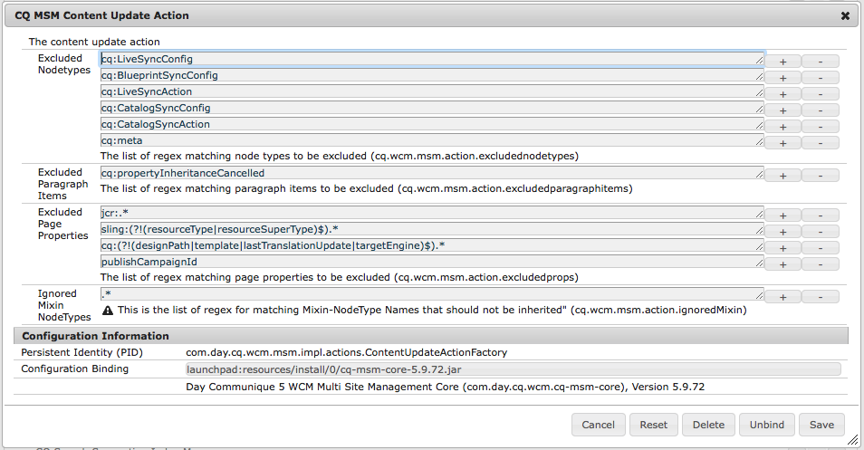

# 設定 Live Copy 同步{#configuring-live-copy-synchronization}

執行下列工作，控制即時副本與其來源內容同步化的方式與時間。

* 決定現有轉出設定是否符合您的需求，或您是否需要建立一個或多個轉出設定。
* 指定用於即時副本的轉出設定。

## 已安裝及自訂轉出設定 {#installed-and-custom-rollout-configurations}

本節提供有關已安裝轉出設定及其使用的同步化動作，以及如何視需要建立自訂設定的資訊。

>[!CAUTION]
>
>更新或變更立即可用（已安裝）轉出設定為 **not** 建議使用。 如果需要自訂即時動作，則應將其新增到自訂轉出設定中。

### 轉出觸發器 {#rollout-triggers}

每個轉出設定都會使用轉出觸發器，導致轉出發生。 轉出設定可以使用下列其中一個觸發程式：

* **轉出時**：此 **轉出** 命令用於blue print頁面，或 **同步** 命令用於「即時副本」頁面。

* **修改**：來源頁面已修改。

* **啟動時**：來源頁面已啟動。

* **停用**：來源頁面已停用。

>[!NOTE]
>
>使用「修改」觸發程式可能會影響效能。 另請參閱 [MSM最佳作法](/help/sites-administering/msm-best-practices.md#onmodify) 以取得詳細資訊。

### 已安裝的轉出設定 {#installed-rollout-configurations}

下表列出與AEM一起安裝的轉出設定。 此表格包含每個轉出設定的觸發器和同步化動作。 如果安裝的轉出設定動作不符合您的需求，您可以 [建立新的轉出設定](#creating-a-rollout-configuration).

<table>
 <tbody>
  <tr>
   <th>名稱</th>
   <th>說明</th>
   <th>觸發器</th>
   <th>同步化動作    另請參閱 <a href="#installed-synchronization-actions">已安裝的同步化動作</a></th>
  </tr>
  <tr>
   <td>標準轉出設定</td>
   <td>標準轉出設定，允許於轉出觸發時開始轉出程序，並執行下列動作: 建立、更新、刪除內容以及排序子節點。</td>
   <td>於轉出</td>
   <td>contentupdate  contentcopy  contentDelete  referencesupdate  產品更新  orderchildren</td>
  </tr>
  <tr>
   <td>在 Blueprint 啟動時啟動</td>
   <td>發佈來源時發佈即時副本。</td>
   <td>啟動時</td>
   <td>targetActivate</td>
  </tr>
  <tr>
   <td>在 Blueprint 停用時停用</td>
   <td>停用來源時停用即時副本。</td>
   <td>停用</td>
   <td>targetDeactivate  </td>
  </tr>
  <tr>
   <td>在發生修改時推送</td>
   <td>
修改來源時將內容推送至即時副本。
 
謹慎使用此轉出設定，因為它使用「修改」觸發器。
 </td>
   <td>於修改</td>
   <td>contentupdate  contentcopy  contentDelete  referencesupdate  orderchildren  </td>
  </tr>
  <tr>
   <td>在發生修改時推送 (淺層)</td>
   <td>
修改Blueprint頁面時將內容推送至即時副本，而不更新引用（例如淺層副本）。
 
謹慎使用此轉出設定，因為它使用「修改」觸發器。
 </td>
   <td>於修改</td>
   <td>contentupdate  contentcopy  contentDelete  orderchildren</td>
  </tr>
  <tr>
   <td>提升啟動</td>
   <td>提升啟動頁面的標準轉出設定。</td>
   <td>於轉出</td>
   <td>contentupdate  contentcopy  contentDelete  referencesupdate  orderchildren  markLiveRelationship</td>
  </tr>
  <tr>
   <td>目錄頁面內容轉出設定</td>
   <td>從目錄 Blueprint 套用頁面範本。</td>
   <td>於轉出</td>
   <td>contentupdate  contentcopy  contentDelete  referencesupdate  productCreateUpdate  orderchildren</td>
  </tr>
  <tr>
   <td>目錄頁面更新轉出設定</td>
   <td>從目錄Blueprint套用目標屬性。 必須在目錄頁面內容轉出設定之後執行。</td>
   <td>於轉出</td>
   <td>catalogRolloutHooks</td>
  </tr>
  <tr>
   <td>DPS 發佈轉出設定</td>
   <td>DPS發佈轉出設定，允許在初始轉出排除FolioProducer繫結屬性時，在轉出觸發器中開始轉出程式</td>
   <td>於轉出</td>
   <td>contentupdate  contentcopy  contentDelete  referencesupdate  orderchildren  dpsMetadataFilter</td>
  </tr>
  <tr>
   <td>舊版(5.6.0)目錄轉出設定</td>
   <td>已棄用。轉出目錄時不使用 MSM，並改用 Catalog Generator。</td>
   <td>於轉出</td>
   <td>editProperties</td>
  </tr>
 </tbody>
</table>

### 已安裝的同步化動作 {#installed-synchronization-actions}

下表列出與AEM一起安裝的同步化動作。 如果安裝的動作不符合您的需求，您可以 [建立新的同步化動作](/help/sites-developing/extending-msm.md#creating-a-new-synchronization-action).

<table>
 <tbody>
  <tr>
   <th>動作名稱</th>
   <th>說明</th>
   <th>屬性  </th>
  </tr>
  <tr>
   <td>contentcopy</td>
   <td>當即時副本上不存在來源的節點時，會將節點複製到即時副本。 <a href="#excluding-properties-and-node-types-from-synchronization">設定CQ MSM內容複製動作服務</a> 以指定要排除的節點型別、段落專案和頁面屬性。   </td>
   <td> </td>
  </tr>
  <tr>
   <td>contentDelete</td>
   <td>
刪除不在來源上的即時副本節點。 <a href="#excluding-properties-and-node-types-from-synchronization">設定CQ MSM內容刪除動作服務</a> 以指定要排除的節點型別、段落專案和頁面屬性。 
 </td>
   <td> </td>
  </tr>
  <tr>
   <td>contentupdate</td>
   <td>使用來源的變更來更新即時副本內容。 <a href="#excluding-properties-and-node-types-from-synchronization">設定CQ MSM內容更新動作服務</a> 以指定要排除的節點型別、段落專案和頁面屬性。   </td>
   <td> </td>
  </tr>
  <tr>
   <td>editProperties</td>
   <td>
編輯即時副本的屬性。 editMap屬性決定要編輯哪些屬性及其值。 editMap屬性的值必須使用下列格式：
 
<code>[property_name_1]#[current_value]#</code>[new_value]，  <code>[property_name_2]#[current_value]#</code>[new_value]，  ... ，  <code>[property_name_n]#[current_value]#</code>[new_value]
 
此 <code>current_value</code> 和 <code>new_value</code> 專案是規則運算式。   
 
例如，請考慮editMap的下列值：
 
<code>sling:resourceType#/</code>(contentpage|homepage)#/  mobilecontentpage，  cq：template#/contentpage#/mobilecontentpage
 
此值會編輯即時副本節點的屬性，如下所示：

    <ul>
     <li>此 <code>sling:resourceType</code> 屬性已設定為 <code>contentpage</code> 或 <code>homepage</code> 設為 <code>mobilecontentpage.</code></li>
     <li>此 <code>cq:template</code> 屬性已設定為 <code>contentpage</code> 設為 <code>mobilecontentpage.</code></li>
    </ul> </td>
   <td>
 
 
editMap： （字串）識別屬性、目前值和新值。 如需詳細資訊，請參閱說明。  
 </td>
  </tr>
  <tr>
   <td>notify</td>
   <td>傳送已轉出頁面的頁面事件。 若要接收通知，必須先訂閱轉出事件。</td>
   <td> </td>
  </tr>
  <tr>
   <td>orderchildren</td>
   <td>在即時副本上，它會根據Blueprint上的順序來排序子項（節點）  </td>
   <td> </td>
  </tr>
  <tr>
   <td>referencesupdate</td>
   <td>
在即時副本上，此同步動作會更新參照，例如連結。  它會搜尋即時副本頁面中指向Blueprint內資源的路徑。 找到後，它會更新路徑以指向即時副本內的相關資源（而不是Blueprint）。 具有Blueprint外部目標的參考不會變更。
 
<a href="#excluding-properties-and-node-types-from-synchronization">設定CQ MSM參考更新動作服務</a> 以指定要排除的節點型別、段落專案和頁面屬性。 
 </td>
   <td> </td>
  </tr>
  <tr>
   <td>targetVersion</td>
   <td>
建立即時副本的版本。
 
此動作必須是轉出設定中包含的唯一同步化動作。
 </td>
   <td> </td>
  </tr>
  <tr>
   <td>targetActivate</td>
   <td>
啟動即時副本。
 
此動作必須是轉出設定中包含的唯一同步化動作。
 </td>
   <td> </td>
  </tr>
  <tr>
   <td>targetDeactivate</td>
   <td>
停用即時副本。
 
此動作必須是轉出設定中包含的唯一同步化動作。
 </td>
   <td> </td>
  </tr>
  <tr>
   <td>工作流程</td>
   <td>
啟動目標屬性定義的工作流程（僅適用於頁面），並將即時副本視為裝載。
 
目標路徑是模型節點的路徑。
 </td>
   <td>target： （字串）工作流程模型的路徑。  </td>
  </tr>
  <tr>
   <td>強制</td>
   <td>
將即時副本頁面上若干ACL的許可權，設為特定使用者群組的唯讀。 已設定下列ACL：

    <ul>
     <li>ActionSet.ACTION_NAME_REMOVE</li>
     <li>ActionSet.ACTION_NAME_SET_PROPERTY</li>
     <li>ActionSet.ACTION_NAME_ACL_MODIFY</li>
    </ul> 
僅對頁面使用此動作。
 </td>
   <td>target： （字串）您為其設定許可權的群組識別碼。   </td>
  </tr>
  <tr>
   <td>mandatoryContent</td>
   <td>
將即時副本頁面上若干ACL的許可權，設為特定使用者群組的唯讀。 已設定下列ACL：

    <ul>
     <li>ActionSet.ACTION_NAME_SET_PROPERTY</li>
     <li>ActionSet.ACTION_NAME_ACL_MODIFY</li>
    </ul> 
僅對頁面使用此動作。
 </td>
   <td>target： （字串）您為其設定許可權的群組識別碼。 </td>
  </tr>
  <tr>
   <td>mandatoryStructure</td>
   <td>針對特定使用者群組，將即時副本頁面上ActionSet.ACTION_NAME_REMOVE ACL的許可權設為唯讀。 僅對頁面使用此動作。</td>
   <td>target： （字串）您為其設定許可權的群組識別碼。 </td>
  </tr>
  <tr>
   <td>VersionCopyaction</td>
   <td>如果Blueprint/來源頁面已發佈至少一次，會使用發佈的版本建立即時副本頁面。 注意：此動作僅適用於根據已發佈的來源頁面建立即時副本頁面，不適用於更新現有的即時副本頁面。 </td>
   <td> </td>
  </tr>
  <tr>
   <td>PageMoveAction</td>
   <td>
頁面在Blueprint中移動時會套用PageMoveAction 。
 
動作會將（相關的） LiveCopy頁面從移動前的位置複製到移動後的位置，而不是移動頁面。
 
PageMoveAction不會變更位於移動前位置的LiveCopy頁面。 因此，對於連續RolloutConfigurations，它具有不含Blueprint的LiveRelationship狀態。
 
<a href="#excluding-properties-and-node-types-from-synchronization">設定CQ MSM頁面移動動作服務</a> 以指定要排除的節點型別、段落專案和頁面屬性。 
 
此動作必須是轉出設定中包含的唯一同步化動作。
 </td>
   <td>
prop_referenceUpdate： （布林值）設為true可更新參照。 預設值為true。
 
 
 </td>
  </tr>
  <tr>
   <td>productCreateUpdate</td>
   <td>建立或更新目錄中的產品資源。 此動作旨在用於下列其中一種情況：
    <ul>
     <li>產生或轉出目錄（或目錄區段）</li>
     <li>使用者恢復產品元件的同步繼承。</li>
    </ul> </td>
   <td> </td>
  </tr>
  <tr>
   <td>markLiveRelationship</td>
   <td>表示啟動項建立的內容存在即時關係。</td>
   <td> </td>
  </tr>
  <tr>
   <td>catalogRolloutHooks</td>
   <td>執行目錄產生特定的轉出掛接。 呼叫CatalogGenerator的executePageRolloutHooks和executeProductRolloutHooks方法。  請參閱AEM Javadocs中的com.adobe.cq.commerce.pim.api.CatalogGenerator 。</td>
   <td> </td>
  </tr>
  <tr>
   <td>產品更新</td>
   <td>更新產品目錄即時副本中的產品頁面</td>
   <td> </td>
  </tr>
 </tbody>
</table>

### 建立轉出設定 {#creating-a-rollout-configuration}

您可以 [建立轉出設定](/help/sites-developing/extending-msm.md#creating-a-new-rollout-configuration) 當安裝的轉出設定不符合您的應用程式需求時：

* [建立轉出設定](/help/sites-developing/extending-msm.md#create-the-rollout-configuration).
* [將同步化動作新增至轉出設定](/help/sites-developing/extending-msm.md#add-synchronization-actions-to-the-rollout-configuration).

然後，當您在Blueprint或即時副本頁面上設定轉出設定時，即可使用新的轉出設定。

### 從同步中排除屬性和節點型別 {#excluding-properties-and-node-types-from-synchronization}

您可以設定支援對應同步化動作的數個OSGi服務，使其不會影響特定節點型別和屬性。 例如，與AEM內部功能相關的許多屬性和子節點不應包含在即時副本中。 僅應複製與頁面使用者相關的內容。

使用AEM時，有數種方法可管理此類服務的組態設定；請參閱 [設定OSGi](/help/sites-deploying/configuring-osgi.md) 以取得詳細資訊和建議作法。

下表列出您可以指定要排除的節點的同步化動作。 此表格提供要使用「Web主控台」設定的服務名稱，以及使用存放庫節點進行設定的PID。

| 同步化動作 | Web主控台中的服務名稱 | 服務PID |
|---|---|---|
| contentcopy | CQ MSM內容複製動作 | com.day.cq.wcm.msm.impl.actions.ContentCopyActionFactory |
| contentDelete | CQ MSM內容刪除動作 | com.day.cq.wcm.msm.impl.actions.ContentDeleteActionFactory |
| contentupdate | CQ MSM內容更新動作 | com.day.cq.wcm.msm.impl.actions.ContentUpdateActionFactory |
| PageMoveAction | CQ MSM頁面移動動作 | com.day.cq.wcm.msm.impl.actions.PageMoveActionFactory |
| referencesupdate | CQ MSM參考更新動作 | com.day.cq.wcm.msm.impl.actions.ReferencesUpdateActionFactory |

下表說明您可以設定的特性：

<table>
 <tbody>
  <tr>
   <th>Web主控台屬性/ OSGi屬性</th>
   <th>說明</th>
  </tr>
  <tr>
   <td>
排除的節點型別
 
cq.wcm.msm.action.excludednodetypes
 </td>
   <td>符合要從同步化動作中排除的節點型別的規則運算式。</td>
  </tr>
  <tr>
   <td>
排除的段落專案
 
cq.wcm.msm.action.excludedparagraphitems
 </td>
   <td>符合要從同步化動作中排除的段落專案的規則運算式。</td>
  </tr>
  <tr>
   <td>
排除的頁面屬性
 
cq.wcm.msm.action.excludedprops
 </td>
   <td>符合要從同步化動作中排除之頁面屬性的規則運算式。</td>
  </tr>
  <tr>
   <td>
忽略的Mixin節點型別
 
cq.wcm.msm.action.ignoredMixin
 </td>
   <td>僅適用於CQ MSM內容更新動作。 符合要從同步化動作中排除的mixin節點型別名稱的規則運算式。</td>
  </tr>
 </tbody>
</table>

>[!NOTE]
>
>在Classic UI中，LiveCopy頁面的「頁面屬性」對話方塊中顯示的鎖定圖示不反映「排除的頁面屬性」屬性的設定。 鎖定圖示甚至會針對從同步化動作中排除的屬性而顯示。

>[!NOTE]
>
>在觸控最佳化的UI中，另請參閱 [在頁面屬性上設定MSM鎖定（觸控最佳化UI）](/help/sites-developing/extending-msm.md#configuring-msm-locks-on-pagep-roperties-touch-optimized-ui).

#### CQ MSM內容更新動作 — 排除 {#cq-msm-content-update-action-exclusions}

預設會排除數個屬性和節點型別，這些屬性和節點型別會在的OSGi設定中定義 **CQ MSM內容更新動作**，下 **排除的頁面屬性**.

依預設，轉出時排除符合下列規則運算式的屬性（即未更新）：

您可以視需要變更定義排除清單的運算式。

例如，如果您想要頁面 **標題** 若要包含在要轉出的變更中，請移除 `jcr:title` 從排除專案。 例如，使用規則運算式：

`jcr:(?!(title)$).*`

### 設定同步以更新參照 {#configuring-synchronization-for-updating-references}

您可以設定多個OSGi服務，以支援與更新參考相關的對應同步化動作。

使用AEM時，有數種方法可管理此類服務的組態設定；請參閱 [設定OSGi](/help/sites-deploying/configuring-osgi.md) 以取得詳細資訊和建議作法。

下表列出您可以為其指定參照更新的同步化動作。 此表格提供要使用「Web主控台」設定的服務名稱，以及使用存放庫節點進行設定的PID。

<table>
 <tbody>
  <tr>
   <th>Web主控台屬性/ OSGi屬性</th>
   <th>說明</th>
  </tr>
  <tr>
   <td>
更新巢狀即時副本間的引用
 
cq.wcm.msm.impl.action.referencesupdate.prop_updateNested
 </td>
   <td>僅適用於CQ MSM參考更新動作。 選取此選項（Web主控台）或將此布林值屬性設為true （存放庫設定）可取代以位於最頂端LiveCopy分支內之任何資源為目標的參照。</td>
  </tr>
  <tr>
   <td>
更新引用頁面
 
cq.wcm.msm.impl.actions.pagemove.prop_referenceUpdate
 </td>
   <td>僅適用於CQ MSM頁面移動動作。 選取此選項（Web主控台）或將此布林值屬性設為 <code>true</code> （存放庫設定）更新任何參照，以使用原始頁面來參照LiveCopy頁面。</td>
  </tr>
 </tbody>
</table>

## 指定要使用的轉出設定 {#specifying-the-rollout-configurations-to-use}

MSM可讓您指定一般使用的轉出設定集，並視需要覆寫特定即時副本的轉出設定。 MSM提供數個位置來指定要使用的轉出設定。 位置會決定設定是否套用至特定的即時副本。

以下是可指定要使用的轉出設定的位置清單，說明MSM如何決定要將哪些轉出設定用於即時副本：

* **[即時副本頁面屬性](/help/sites-administering/msm-sync.md#setting-the-rollout-configurations-for-a-live-copy-page)：** 當即時副本頁面設定為使用一個或多個轉出設定時，MSM會使用這些轉出設定。
* **[Blueprint頁面屬性](/help/sites-administering/msm-sync.md#setting-the-rollout-configuration-for-a-blueprint-page)：** 當即時副本以Blueprint為基礎，且即時副本頁面未設定轉出設定時，將使用與Blueprint來源頁面關聯的轉出設定。
* **即時副本父頁面屬性：** 當即時副本頁面和Blueprint來源頁面均未設定轉出設定時，將使用套用至即時副本頁面父頁面的轉出設定。
* **[系統預設值](/help/sites-administering/msm-sync.md#setting-the-system-default-rollout-configuration)：** 當無法確定即時副本父頁面的轉出設定時，將使用系統預設轉出設定。

例如，藍圖使用We.Retail參考網站作為來源內容。 從Blueprint建立網站。 下列清單中的每個專案都說明關於轉出設定的使用不同情境：

* 所有Blueprint頁面或即時副本頁面均未設定為使用轉出設定。 MSM會對所有即時副本頁面使用系統預設轉出設定。
* We.Retail參考網站的根頁面已設定好數個轉出設定。 MSM會對所有即時副本頁面使用這些轉出設定。
* We.Retail參考網站的根頁面已設定好數個轉出設定，而即時副本網站的根頁面已設定好不同的轉出設定。 MSM會使用在即時副本網站的根頁面上設定的轉出設定。

### 設定即時副本頁面的轉出設定 {#setting-the-rollout-configurations-for-a-live-copy-page}

使用轉出設定來設定即時副本頁面，以便在來源頁面轉出時使用。 子頁面預設會繼承設定。 當您設定要使用的轉出設定時，將會覆寫即時副本頁面從其父頁面繼承的設定。

您也可以在以下情況下為即時副本頁面設定轉出設定： [建立即時副本](/help/sites-administering/msm-livecopy.md#creating-a-live-copy-of-a-page).

1. 使用 **網站** 控制檯以選取即時副本頁面。
1. 選取 **屬性** （從工具列）。
1. 開啟 **即時副本** 標籤。

   此 **設定** 區段會顯示頁面繼承的轉出設定。

   

1. 如有需要，請調整 **即時副本繼承** 標幟。 如果勾選，即時副本設定將在所有子項上都有效。

1. 清除 **從父項繼承轉出設定** 屬性，然後從清單中選取一或多個轉出設定。

   選取的轉出設定會顯示在下拉式清單下方。

   

1. 按一下或點選 **儲存**.

### 設定Blueprint頁面的轉出設定 {#setting-the-rollout-configuration-for-a-blueprint-page}

使用轉出設定來設定Blueprint頁面，以便在轉出Blueprint頁面時使用。

請注意，Blueprint頁面的子頁面會繼承設定。 當您設定要使用的轉出設定時，可能會覆寫頁面從其父項繼承的設定。

1. 使用 **網站** 控制檯以選取Blueprint的根頁面。
1. 選取 **屬性** （從工具列）。
1. 開啟 **Blueprint** 標籤。
1. 選取一或多個 **轉出設定** 使用下拉式選擇器。
1. 儲存您的更新，透過 **儲存**.

### 設定系統預設轉出設定 {#setting-the-system-default-rollout-configuration}

指定要作為系統預設值的轉出組態。 若要指定預設值，請設定OSGi服務：

* **Day CQ WCM即時關係管理員**
服務PID為 `com.day.cq.wcm.msm.impl.LiveRelationshipManagerImpl`

使用下列任一專案設定服務： [網頁主控台](/help/sites-deploying/configuring-osgi.md#osgi-configuration-with-the-web-console) 或 [存放庫節點](/help/sites-deploying/configuring-osgi.md#osgi-configuration-in-the-repository).

* 在Web主控台中，要設定的屬性名稱為Default rollout config。
* 使用存放庫節點，要設定的屬性名稱是 `liverelationshipmgr.relationsconfig.default`.

將此屬性值設定為轉出設定的路徑，以作為系統預設值。 預設值為 `/libs/msm/wcm/rolloutconfigs/default`，也就是 **標準轉出設定**.
