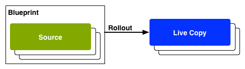

# 重複使用內容：多網站管理員和即時副本{#reusing-content-multi-site-manager-and-live-copy}

Multi Site Manager(MSM)可讓您在多個位置使用相同的網站內容。 MSM使用其即時副本功能來達成此目的：

* 有了MSM，您可以：

   * 只要建立內容一次，
   * 將此內容複製至相同或其他網站的其他區域(即[時復本](#live-copies))，並重複使用此內容。

* 然後，MSM會維持來源內容與其即時副本之間的（即時）關係，以便：

   * 當您變更來源內容時，會同步來源和即時副本（以將這些變更套用至即時副本）。
   * 您可以透過中斷個別子頁面和／或元件的即時關係，來調整即時副本的內容。 執行此操作後，對源的更改將不再應用於即時副本。

本頁及下列各頁涵蓋相關問題：

* [建立和同步即時副本](/help/sites-administering/msm-livecopy.md)
* [即時副本概述主控台](/help/sites-administering/msm-livecopy-overview.md)
* [配置即時拷貝同步](/help/sites-administering/msm-sync.md)
* [MSM推出衝突](/help/sites-administering/msm-rollout-conflicts.md)
* [MSM最佳實務](/help/sites-administering/msm-best-practices.md)

## 可能的藍本 {#possible-scenarios}

MSM和即時副本有許多使用案例，其中一些案例包括：

* **跨國公司——全球對本地公司**

   MSM支援的一個典型使用案例是，在多個跨國同文網站中重複使用內容。 這允許重新使用核心內容，同時允許國家變化。

   例如，We.Retail參考網站範例的英文部分是為美國客戶建立的。 本網站的大部分內容也可用於其他We.Retail網站，以迎合不同國家和文化的英文客戶。 所有網站的核心內容都維持不變，而且可進行區域調整。

   以下結構可用於美國、英國、加拿大和澳洲的網站：

   ```xml
   /content
       |- we.retail
           |- language-masters
               |- en
       |- we.retail
           |- us
               |- en
       |- we.retail
           |- gb
               |- en
       |- we.retail
           |- ca
               |- en
       |- we.retail
           |- au
               |- en
   ```

   >[!NOTE]
   >
   >MSM不會翻譯內容。 它可用來建立所需的結構並部署內容。
   >
   >
   >如果 [您想要延伸此範例，請參閱多語言網站的翻譯內容](/help/sites-administering/translation.md) 。

* **國家——總部至區域分支機構**

   或者，擁有經銷商網路的公司可能希望為其個別經銷商單獨建立網站，每個網站都是總部提供的主要網站。 可能是單一公司有多個地區辦事處，或是由中央加盟商和多個地方加盟商組成的全國加盟系統。

   總部可以提供核心資訊，而區域實體可以添加當地資訊，如聯絡詳情、開業時間和活動。

   ```xml
   /content
       |- head-office-Berlin
       |- branch-Hamburg
       |- branch-Stuttgart
       |- branch-Munich
       |- branch-Frankfurt
   ```

* **多個版本**

   或者，您可以使用MSM來建立特定子分支的版本。例如，支援子網站會保留特定產品不同版本的詳細資訊，其中基本資訊保持不變，而只需變更更新的功能：

   ```xml
   /content
       |- support
           |- product X
               |- v5.0
               |- v4.0
               |- v3.0
               |- v2.0
               |- v1.0
   ```

   >[!NOTE]
   >
   >在這種情況下，總會有一個問題：是製作直接副本還是使用即時副本。
   >
   >在以下方面存在平衡：
   >
   >  * 在多個版本上，需要更新多少核心內容。
   >
   >反對：
   >
   >  * 需要調整的個別復本數量。


## 從UI進行MSM {#msm-from-the-ui}

MSM可直接在UI中使用適當主控台的各種選項存取。 要提供介紹，請列出以下主要位置：

* **建立網站** (**網站**)

   * MSM可協助您管理多個共用內容的網站；例如，網站通常提供給國際觀眾，讓大部分內容在所有國家／地區都很常見，而且每個國家／地區都有特定內容的子集。 MSM可讓您建立 [即時副本，以根據您的來源網站自動更新一或多個網站](/help/sites-administering/msm-livecopy.md#creating-a-live-copy-of-a-site-from-a-blueprint-configuration)。 這也可協助您強制建立共同的基本結構、跨多個網站使用共同內容、維持共同的外觀和感覺，並集中精力管理實際不同網站的內容。
   * 需要預先定義的Blueprint設定來指定來源。
   * 建立（預定義）源的即時副本。
   * 為使用者提供「轉 **出** 」按鈕。

* **建立即時副本** (**網站**)

   * MSM可讓您 [建立網站個別頁面或子分支的臨機（一次性）即時副本](/help/sites-administering/msm-livecopy.md#creating-a-live-copy-of-a-page);例如，複製子分支以提供有關產品新版／更新版本的資訊。
   * 建立臨機即時副本（不需要藍圖設定）。
   * 可用來（立即）建立任何頁面／分支的即時副本。
   * 需要 **同步** (不提供 **Rovolt** 按鈕)。

* **檢視屬性** (**網站**)

   * 在適當的情況下，此選項可協 [助您提供相關即時副本或Blueprint的相關資訊](/help/sites-administering/msm-livecopy.md#monitoring-your-live-copy) ，以協助您監 **控即時**&#x200B;副本 ****。

* **參考** (**網站**)

   * 「參 [考](/help/sites-authoring/basic-handling.md#references) 」邊欄提供「即時副本 **** 」的相關資訊，並可存取適當的動作。

* **即時副本概觀** (**網站**)

   * 此主控台可讓您檢 [視並管理藍圖及其即時副本](/help/sites-administering/msm-livecopy-overview.md)。

* **Blueprint** (工&#x200B;**具** -站 **點**)

   * 此主控台可讓您 [建立和管理藍圖設定](/help/sites-administering/msm-livecopy.md#creating-a-blueprint-configuration)。

>[!NOTE]
>
>MSM功能的各個方面，皆用於數種其他AEM功能（例如Launches、Catalog）;在這些情況下，即時副本由該功能管理。

### 使用的詞語 {#terms-used}

作為導言，下表概述MSM使用的主要術語；以下各節和頁面將提供更多詳細資訊：

<table>
 <tbody>
  <tr>
   <td><strong>期限</strong></td>
   <td><strong>定義</strong></td>
   <td><strong>詳細資訊</strong></td>
  </tr>
  <tr>
   <td><strong>來源</strong></td>
   <td>原始頁面。</td>
   <td>與「藍圖」和／或「藍圖」頁面同義。</td>
  </tr>
  <tr>
   <td><strong>即時副本</strong></td>
   <td>由同步操作維護的源副本（源副本），如轉出配置所定義。 </td>
   <td> </td>
  </tr>
  <tr>
   <td><strong>即時副本設定</strong></td>
   <td>即時副本的設定詳細資訊定義。</td>
   <td> </td>
  </tr>
  <tr>
   <td><strong>即時關係</strong><br /> </td>
   <td>對給定資源的繼承進行有效定義；源副本和即時副本之間的連接。<br /> </td>
   <td>確保對源的更改可以與即時副本同步。</td>
  </tr>
  <tr>
   <td><strong>Blueprint</strong></td>
   <td>與來源同義。</td>
   <td>可由Blueprint設定定義。</td>
  </tr>
  <tr>
   <td><strong>Blueprint設定</strong></td>
   <td>指定源路徑的預定義配置。</td>
   <td>當藍圖設定中參考藍圖頁面時，「轉出」命令便可使用。</td>
  </tr>
  <tr>
   <td><strong>同步</strong></td>
   <td>用於同步源副本和即時副本之間內容的通用術語(由 <strong>Rovolt</strong> 和 <strong>Synchronize</strong>)。</td>
   <td> </td>
  </tr>
  <tr>
   <td><strong>轉出</strong><br /> </td>
   <td>從源位置同步到livecopy。<br /> 可由作者（在藍圖頁面上）或系統事件（由轉出設定定義）觸發。</td>
   <td> </td>
  </tr>
  <tr>
   <td><strong>轉出設定</strong></td>
   <td>決定要同步哪些屬性、方式和時間的規則。</td>
   <td> </td>
  </tr>
  <tr>
   <td><strong>同步</strong></td>
   <td>從livecopy頁面手動請求同步。</td>
   <td> </td>
  </tr>
  <tr>
   <td><strong>繼承</strong></td>
   <td>當同步發生時，即時副本頁面／元件會繼承其源頁面／元件中的內容。</td>
   <td> </td>
  </tr>
  <tr>
   <td><strong>擱置</strong></td>
   <td>臨時移除即時副本與其藍圖頁面之間的即時關係。</td>
   <td> </td>
  </tr>
  <tr>
   <td><strong>分離</strong></td>
   <td>永久移除即時副本與其藍圖頁面之間的即時關係。</td>
   <td> </td>
  </tr>
  <tr>
   <td><strong>重設</strong></td>
   <td><p>將即時複製頁面重設為：</p>
    <ul>
     <li>刪除所有繼承取消和<br /> </li>
     <li>將頁面傳回與來源頁面相同的狀態。</li>
    </ul> <p>重設會影響您對頁面屬性、段落系統和元件所做的任何變更。</p> </td>
   <td> </td>
  </tr>
  <tr>
   <td><strong>淺層</strong></td>
   <td>單一頁面的即時副本。</td>
   <td> </td>
  </tr>
  <tr>
   <td><strong>深入</strong></td>
   <td>頁面的即時副本及其子頁面。</td>
   <td> </td>
  </tr>
 </tbody>
</table>

>[!NOTE]
>
>如需 [物件名稱，請參閱Java API](/help/sites-developing/extending-msm.md#overview-of-the-java-api) 概觀。

## 即時副本 {#live-copies}

MSM即時副本是特定網站內容的副本，其與原始來源的即時關係會維持：

* 即時副本會繼承其來源的內容。
* 同步在對源進行更改時執行內容的實際傳輸。
* 即時副本可視為：

   * 淺層：單頁
   * 深度：頁面及其子頁面

* 同步規則（稱為轉出配置）可確定要同步的屬性以及同步發生的時間。

在上一個範例中， `/content/we-retail/language-masters/en` 全域主體網站是英文版。 若要重複使用此網站的內容，請建立MSM即時副本：

* 以下內容 `/content/we-retail/language-masters/en` 是來源。

* 以下內容 `/content/we-retail/language-masters/en` 會複製到 `/content/we-retail/us/en/`、、 `/content/we-retail/gb/en`和 `/content/we-retail/ca/en`節點下 `/content/we-retail/au/en` 方。 這些是即時復本。

* 作者會變更下列頁面 `/content/we-retail/language-masters/en`。
* 觸發時，MSM會將這些變更同步至即時副本。

### 即時副本——構圖 {#live-copies-composition}

>[!NOTE]
>
>本節中的圖表和說明表示潛在即時拷貝的快照。 它們不全面，但提供概述以強調特定特性。

當您最初建立即時副本時，選取的來源頁面會以1:1為基礎反映在即時副本中。 此後，您也可以直接在即時副本中建立新資源（頁面和／或段落），因此請務必注意這些變化及其對同步的影響。 可能的構圖包括：

* [包含非即時副本頁面的即時副本](#live-copy-with-non-live-copy-pages)
* [巢狀即時副本](#nested-live-copies)

即時副本的基本形式有：

* 以1:1為基礎反映所選來源頁面的即時複製頁面。
* 一個配置定義。
* 為每個資源定義的即時關係：

   * 將即時副本資源與其藍圖／來源連結。
   * 在實現繼承和轉出時使用。

* 可以根據需 [求同](/help/sites-administering/msm-livecopy.md#synchronizing-your-live-copy) 步更改。


#### 包含非即時副本頁面的即時副本 {#live-copy-with-non-live-copy-pages}

當您在AEM中建立即時副本時，可以查看並導覽即時副本分支——並在即時副本分支上使用一般的AEM功能。 這表示您（或流程）可以在即時副本分支中建立新資源（頁面和／或段落）(例如 `myCanadaOnlyProduct`)。

* 這些資源與源／藍圖頁面沒有即時關係，並且不同步。
* MSM可以處理特殊情況。 例如，當您（或流程）在來源／藍圖和即時副本分支中建立位置和名稱相同的頁面時。 如需詳細資訊，請 [參閱MSM Pollot Conflict](/help/sites-administering/msm-rollout-conflicts.md) 。


#### 巢狀即時副本 {#nested-live-copies}

當您（或流程）在現有即時 [副本中建立新頁面時](#live-copy-with-non-live-copy-pages) ，此新頁面也可設為不同藍圖的即時副本。 這稱為巢狀即時副本，其中第二個（內部）即時副本的行為受到第一個（外部）即時副本的影響，方式如下：

* 頂層即時副本的深度轉出觸發可繼續到巢狀即時副本中（例如，如果觸發符合）。
* 源之間的任何連結都將在即時拷貝中重寫。

   例如，從第二個到第一個藍圖的連結將被重寫為從巢狀／第二個即時副本到第一個即時副本的連結。


>[!NOTE]
>
>如果您在即時副本分支中移動／重新命名頁面，則（內部）這會被視為巢狀即時副本，讓AEM可追蹤關係。

#### 堆疊式即時副本 {#stacked-live-copies}

當即時副本作為淺層即時副本的子項建立時，即稱為堆疊即時副本。 其運作方式與巢狀即時副 [本相同](#nested-live-copies)。

### 源、藍圖和藍圖配置 {#source-blueprints-and-blueprint-configurations}

任何頁面或頁面分支皆可用作即時副本的來源。

不過，MSM也允許您定義指定源路徑的藍圖配置。 使用Blueprint設定的優點是：

* 允許作者在藍圖上使 **用** 「轉出」選項——將修改（明確）推送至繼承自此藍圖的即時副本。
* 允許作者使用「建 **立網站」**;這可讓使用者輕鬆選擇語言並設定即時副本的結構。
* 為與藍圖有關的即時副本定義預設轉出設定。

即時副本的來源可以是常規頁面或藍圖配置涵蓋的頁面——兩者都是有效的使用案例。

來源會為即時副本建立藍圖。 Blueprint是在下列情況下定義的：

* [建立Blueprint設定](/help/sites-administering/msm-livecopy.md#creating-a-blueprint-configuration)

   此設定會（預先）定義用於建立即時副本的頁面。

* [建立頁面的即時副本](/help/sites-administering/msm-livecopy.md#creating-a-live-copy-of-a-page)

   用於建立即時副本（來源頁面）的頁面是Blueprint頁面。

   來源頁面可以由Blueprint設定參考，也可以不參考。

### 轉出和同步化 {#rollout-and-synchronize}

推出時，MSM會採取中央動作，將即時副本與其來源同步化。 您可以手動執行展開，也可以自動執行：

* 可定 [義轉出設定](#rollout-configurations) ，以便特定事 [件](/help/sites-administering/msm-sync.md#rollout-triggers) ，可自動轉出。
* 在編寫Blueprint頁面時，您可以使用 [Rovlot](/help/sites-administering/msm-livecopy.md#rolling-out-a-blueprint) （轉出）命令將變更推播至即時副本。

   **Rovolt** （轉出）命令可用於藍圖配置所引用的藍圖頁面。

   

* 製作即時副本頁面時，您可以使用「同步 [化](/help/sites-administering/msm-livecopy.md#synchronizing-a-live-copy) 」命令，將變更從來源提取至即時副本。

   即時 **副本頁面** （無論原始碼／藍圖頁面是否包含在藍圖配置中）上始終可使用「同步化」命令。

   

### 轉出設定 {#rollout-configurations}

轉出配置定義即時副本與來源內容同步的時間和方式。 轉出配置由觸發器和一個或多個同步操作組成：

* **觸發器**

   觸發器是導致即時動作同步的事件，例如啟動來源頁面。 MSM定義您可使用的觸發器。

* **同步操作**

   執行於即時副本，以與來源同步。 例如，複製內容、排序子節點，以及啟動即時副本頁面。 MSM提供許多同步動作。

   >[!NOTE]
   >
   >您可以使用Java API為例項建立自訂動作。

轉出設定可重新使用，因此多個即時副本可以使用相同的轉出設定。 標準 [安裝中](/help/sites-administering/msm-sync.md#installed-rollout-configurations) ，包含數種轉出設定。

### 推出衝突 {#rollout-conflicts}

推播可能會變得複雜，尤其是當作者同時在來源和即時副本中編輯內容時，因此請務必注意AEM如何處理轉播期 [間可能發生的衝突](/help/sites-administering/msm-rollout-conflicts.md)。

### 暫停和取消繼承和同步 {#suspending-and-cancelling-inheritance-and-synchronization}

即時副本中的每個頁面和元件都與其來源頁面和元件透過即時關係建立關聯。 即時關係可配置來自源的即時副本內容的同步。

您可以 **暫停** 「即時副本」頁面的即時副本繼承，以便變更頁面屬性和元件。 暫停繼承時，頁面屬性和元件不再與源同步。

編輯單個頁面時，作者可 **以取消元件的繼承** 。 取消繼承後，即時關係將暫停，該元件不會進行同步。 當需要自訂內容的子區段時，取消繼承和同步很有用。

### 分離即時副本 {#detaching-a-live-copy}

您也可以 [將即時副本從Blueprint中分離](/help/sites-administering/msm-livecopy.md#detaching-a-live-copy) ，以移除所有連線。

>[!CAUTION]
>
>「分離」(Detach)操作是永久的和不可逆的。

「分離」會永久移除即時副本與其藍圖頁面之間的即時關係。 所有與MSM相關的屬性都會從即時副本中移除，而即時副本頁面會變成獨立副本。

>[!NOTE]
>
>如需 [完整詳細資訊](/help/sites-administering/msm-livecopy.md#detaching-a-live-copy) ，請參閱分離即時副本；包括對子頁面和父頁面的相關影響。

## 使用MSM的標準步驟 {#standard-steps-for-using-msm}

以下步驟說明使用MSM重複使用內容並同步即時副本變更的標準程式。

1. 開發來源網站的內容。
1. 確定要使用的轉出配置。

   1. MSM安 [裝了幾種可滿足多種使用情況](/help/sites-administering/msm-sync.md#installed-rollout-configurations) 的轉出配置。
   1. 您也可以視 [需要建立轉出設定](/help/sites-administering/msm-sync.md#creating-a-rollout-configuration) 。

1. 確定您需要在何處 [指定轉出設定，以視需](/help/sites-administering/msm-sync.md#specifying-the-rollout-configurations-to-use) 要使用和設定。
1. 視需要建 [立藍圖設定](/help/sites-administering/msm-livecopy.md#creating-a-blueprint-configuration) ，以識別即時副本的來源內容。
1. [建立即時副本](/help/sites-administering/msm-livecopy.md#creating-a-live-copy)。
1. 視需要變更來源內容。 您應採用貴組織已建立的一般內容審閱與核准程式。
1. [展開藍圖](/help/sites-administering/msm-livecopy.md#rolling-out-a-blueprint) ，或將即 [時副本與變更同步](/help/sites-administering/msm-livecopy.md#synchronizing-a-live-copy) 。

## 自訂MSM {#customizing-msm}

MSM提供多種工具，讓您的實作能夠因應分享內容時可能存在的特殊複雜性：

* **自訂轉出設定**
   [當安裝的轉出組態不符合您的需求](/help/sites-administering/msm-sync.md#creating-a-rollout-configuration) ，請建立轉出組態。 您可以使用任何可用的轉出觸發器和同步操作。

* **自定義同步操作**
   [當安裝的操作不符合您的特定應用程式要求時](/help/sites-developing/extending-msm.md#creating-a-new-synchronization-action) ，建立自定義同步操作。 MSM提供Java API，用於建立自定義同步操作。

## Best Practices {#best-practices}

「 [MSM最佳實務](/help/sites-administering/msm-best-practices.md) 」頁面包含您實作的重要資訊。
