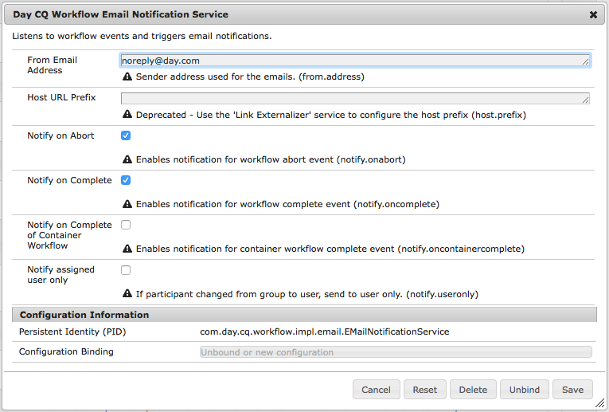

# 設定電子郵件通知{#configuring-email-notification}

AEM會傳送電子郵件通知給下列使用者：

* 已訂閱頁面事件，例如修改或複製。 「通 [知收件箱](/help/sites-classic-ui-authoring/author-env-inbox.md#subscribing-to-notifications) 」部分介紹如何訂閱此類事件。

* 已訂閱論壇活動。
* 必須在工作流程中執行步驟。 「參 [與者步驟](/help/sites-developing/workflows-step-ref.md#participant-step) 」區段說明如何在工作流程中觸發電子郵件通知。

先決條件：

* 使用者必須在其個人檔案中定義有效的電子郵件地址。
* The **Day CQ Mail Service** needs to be propery configured.

當使用者收到通知時，他會收到電子郵件，其語言為其個人檔案中定義。 每種語言都有自己的範本可自訂。 新的電子郵件範本可以針對新語言新增。

>[!NOTE]
>
>使用AEM時，有幾種方法可管理此類服務的組態設定；如需詳 [細資訊](/help/sites-deploying/configuring-osgi.md) ，請參閱設定OSGi。

## 配置郵件服務 {#configuring-the-mail-service}

AEM若要能夠傳送電子郵件， **Day CQ Mail Service** 需要正確設定。 您可以在Web控制台中查看配置。 使用AEM時，有幾種方法可管理此類服務的組態設定；如需詳 [細資訊](/help/sites-deploying/configuring-osgi.md) ，請參閱設定OSGi。

適用下列限制：

* SMTP服 **務器埠** 必須為25或更高。

* SMTP服 **務器主機名** ，不能為空。
* 「 **寄件者** 」位址不得空白。

為協助您除錯 **Day CQ Mail Service**，您可以監看服務記錄：

`com.day.cq.mailer.DefaultMailService`

配置在Web控制台中的外觀如下：


## 設定電子郵件通知渠道 {#configuring-the-email-notification-channel}

當您訂閱頁面或論壇事件通知時，預設會將寄件者電子郵件位址 `no-reply@acme.com` 設為。 您可以在Web主控台中設定 **通知電子郵件渠道** ，以變更此值。

要配置寄件者電子郵件地址，請將節 `sling:OsgiConfig` 點添加到儲存庫。 使用以下過程直接使用CRXDE Lite添加節點：

1. 在CRXDE Lite中，新增應用程式資料夾 `config` 下方的資料夾。
1. 在config資料夾中，添加名為：

   `com.day.cq.wcm.notification.email.impl.EmailChannel` 類型 `sling:OsgiConfig`

1. 將屬性 `String` 添加到名為的節點] `email.from`。 請為值指定您要使用的電子郵件地址。

1. 按一下「 **全部儲存**」。

請按下列步驟在內容包源資料夾中定義節點：

1. 在您的 `jcr_root/apps/*app_name*/config folder`檔案中，建立名為 `com.day.cq.wcm.notification.email.impl.EmailChannel.xml`

1. 添加以下XML以表示節點：

   `<?xml version="1.0" encoding="UTF-8"?> <jcr:root xmlns:sling="https://sling.apache.org/jcr/sling/1.0" xmlns:jcr="https://www.jcp.org/jcr/1.0" jcr:primaryType="sling:OsgiConfig" email.from="name@server.com"/>`
1. 將屬性()的 `email.from` 值取 `name@server.com`代為您的電子郵件地址。

1. 儲存檔案。

## 配置工作流電子郵件通知服務 {#configuring-the-workflow-email-notification-service}

當您收到工作流程電子郵件通知時，寄件者電子郵件地址和主機URL首碼都會設為預設值。 您可以在Web主控台中設定 **Day CQ Workflow Email Notification Service** ，以變更這些值。 如果您這樣做，建議將更改保存在儲存庫中。

預設配置在Web控制台中的外觀如下：



### 頁面通知的電子郵件範本 {#email-templates-for-page-notification}

頁面通知的電子郵件範本位於以下：

`/etc/notification/email/default/com.day.cq.wcm.core.page`

預設英文模板( `en.txt`)的定義如下：

```xml
subject=[CQ Page Event Notification]: Page Event

header=-------------------------------------------------------------------------------------\n \
Time: ${time}\n \
User: ${userFullName} (${userId})\n \
-------------------------------------------------------------------------------------\n\n

message=The following pages were affected by the event: \n \
 \n \
${modifications} \n \
 \n\n
footer=\n \
-------------------------------------------------------------------------------------\n \
This is an automatically generated message. Please do not reply.
```

#### 自訂頁面通知的電子郵件範本 {#customizing-email-templates-for-page-notification}

若要自訂頁面通知的英文電子郵件範本：

1. 在CRXDE中，開啟檔案：

   `/etc/notification/email/default/com.day.cq.wcm.core.page/en.txt`

1. 根據您的需求修改檔案。
1. 儲存變更。

範本必須具備下列格式：

```
 subject=<text_1>
 header=<text_2>
 message=<text_3>
 footer=<text_4>
```

其中，&lt;text_x>可混合使用靜態文字和動態字串變數。 以下變數可用於電子郵件範本中的頁面通知：

* `${time}`，事件日期和時間。

* `${userFullName}`，則觸發事件之使用者的完整名稱。

* `${userId}`，則觸發事件之使用者的ID。
* `${modifications}`，以下列格式說明頁面事件和頁面路徑的類型：

   &lt;page event type> => &lt;page path>

   例如：

   PageModified => /content/geometrixx/tw/products

### 論壇通知的電子郵件範本 {#email-templates-for-forum-notification}

論壇通知的電子郵件範本位於：

`/etc/notification/email/default/com.day.cq.collab.forum`

預設英文模板( `en.txt`)的定義如下：

```xml
subject=[CQ Forum Notification]

header=-------------------------------------------------------------------------------------\n \
Time: Time: ${time}\n \
Forum Page Path: ${forum.path}\n \
-------------------------------------------------------------------------------------\n\n

message=Page: ${host.prefix}${forum.path}.html\n

footer=\n \
-------------------------------------------------------------------------------------\n \
This is an automatically generated message. Please do not reply.
```

#### 自訂論壇通知的電子郵件範本 {#customizing-email-templates-for-forum-notification}

若要自訂論壇通知的英文電子郵件範本：

1. 在CRXDE中，開啟檔案：

   `/etc/notification/email/default/com.day.cq.collab.forum/en.txt`

1. 根據您的需求修改檔案。
1. 儲存變更。

範本必須具備下列格式：

```
 subject=<text_1>
 header=<text_2>
 message=<text_3>
 footer=<text_4>
```

其中 `<text_x>` 可混合使用靜態文字和動態字串變數。

在論壇通知的電子郵件範本中可使用下列變數：

* `${time}`，事件日期和時間。

* `${forum.path}`，則為論壇頁面的路徑。

### 工作流程通知的電子郵件範本 {#email-templates-for-workflow-notification}

工作流程通知的電子郵件範本（英文）位於：

`/etc/workflow/notification/email/default/en.txt`

定義如下：

```xml
subject=Workflow notification: ${event.EventType}

header=-------------------------------------------------------------------------------------\n \
Time: ${event.TimeStamp}\n \
Step: ${item.node.title}\n \
User: ${participant.name} (${participant.id})\n \
Workflow: ${model.title}\n \
-------------------------------------------------------------------------------------\n\n

message=Content: ${host.prefix}${payload.path.open}\n

footer=\n \
-------------------------------------------------------------------------------------\n \
View the overview in your ${host.prefix}/aem/inbox\n \
-------------------------------------------------------------------------------------\n \
This is an automatically generated message. Please do not reply.
```

#### 自訂工作流程通知的電子郵件範本 {#customizing-email-templates-for-workflow-notification}

要為工作流事件通知自定義英文電子郵件模板：

1. 在CRXDE中，開啟檔案：

   `/etc/workflow/notification/email/default/en.txt`

1. 根據您的需求修改檔案。
1. 儲存變更。

範本必須具備下列格式：

```
subject=<text_1>
 header=<text_2>
 message=<text_3>
 footer=<text_4>
```

>[!NOTE]
>
>其中 `<text_x>` 可混合使用靜態文字和動態字串變數。 項目的每 `<text_x>` 行都需要以反斜線( `\`)結尾，但最後一個例項除外，因為沒有反斜線表示字串變數的 `<text_x>` 結尾。
>
>有關範本格式的詳細資訊，請參 [閱Properties.load()方法的javadoc](https://docs.oracle.com/javase/8/docs/api/java/util/Properties.html#load-java.io.InputStream-) 。

該方 `${payload.path.open}` 法顯示工作項目裝載的路徑。 例如，若是網站中的頁面，則 `payload.path.open` 會類似 `/bin/wcmcommand?cmd=open&path=…`。;這沒有伺服器名稱，因此範本會以此為前提 `${host.prefix}`。

下列變數可用於電子郵件範本中：

* `${event.EventType}`，事件類型
* `${event.TimeStamp}`、事件的日期和時間
* `${event.User}`，觸發事件的使用者
* `${initiator.home}`，啟動器節點路徑

* `${initiator.name}`，啟動器名稱

* `${initiator.email}`，啟動器的電子郵件地址
* `${item.id}`，工作項目的ID
* `${item.node.id}`，與此工作項目關聯的工作流模型中節點的ID
* `${item.node.title}`，工作項目標題
* `${participant.email}`、參與者的電子郵件地址
* `${participant.name}`，參與者名稱
* `${participant.familyName}`，參與者的姓氏
* `${participant.id}`，參與者的id
* `${participant.language}`，參與者語言
* `${instance.id}`, the workflow id
* `${instance.state}`，則工作流狀態
* `${model.title}`，工作流模型的標題
* `${model.id}`，工作流模型的ID

* `${model.version}`，工作流模型的版本
* `${payload.data}`、裝載

* `${payload.type}`、裝載類型
* `${payload.path}`，裝載路徑
* `${host.prefix}`，主機首碼，例如：http://localhost:4502

### 新增新語言的電子郵件範本 {#adding-an-email-template-for-a-new-language}

要添加新語言的模板，請執行以下操作：

1. 在CRXDE中，新增下列檔 `<language-code>.txt` 案：

   * `/etc/notification/email/default/com.day.cq.wcm.core.page` :頁面通知
   * `/etc/notification/email/default/com.day.cq.collab.forum` :論壇通知
   * `/etc/workflow/notification/email/default` :工作流通知

1. 將檔案調整為語言。
1. 儲存變更。

>[!NOTE]
>
>電 `<language-code>` 子郵件範本的檔案名稱必須是由AEM識別的二字母小寫語言代碼。 對於語言代碼，AEM需仰賴ISO-639-1。

## 設定AEM Assets電子郵件通知 {#assetsconfig}

當「AEM資產」中的「系列」是共用或取消共用時，使用者可以從AEM接收電子郵件通知。 若要設定電子郵件通知，請依照下列步驟進行。

1. 按照上述配置郵件服務中的 [說明配置電子郵件服務](/help/sites-administering/notification.md#configuring-the-mail-service)。
1. 以管理員身分登入AEM。 按一 **下「工具** > **作業** > **Web Console** 」以開啟「Web Console設定」。
1. 編輯 **日CQ DAM資源收集Servlet**。 選擇 **傳送電子郵件**。 按一下&#x200B;**「儲存」**。

