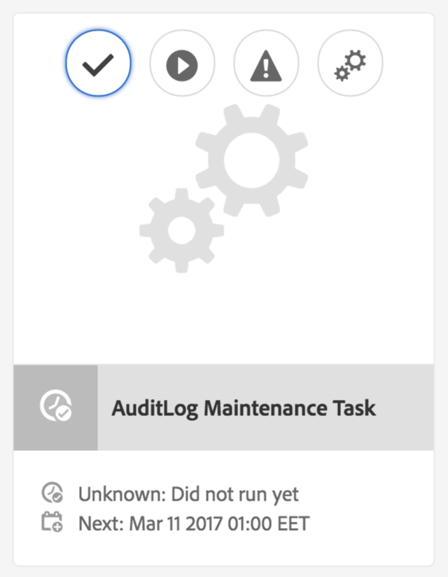

# AEM 6中的稽核記錄維護{#audit-log-maintenance-in-aem}

符合稽核記錄資格的AEM事件會產生大量封存資料。 由於複製、資產上傳和其他系統活動，這些資料會隨著時間快速成長。

「稽核記錄維護」包含了數項功能，可讓您根據特定原則自動進行稽核記錄維護。

這是作為可設定的每週維護任務實作，並可透過操作儀表板監視控制檯存取。

如需詳細資訊，請參閱 [操作控制面板檔案](/help/sites-administering/operations-dashboard.md).

「稽核日誌永久刪除」選項有三種型別：

1. [頁面稽核記錄清除](/help/sites-administering/operations-audit-log.md#configure-page-audit-log-purging)
1. [DAM稽核記錄清除](/help/sites-administering/operations-audit-log.md#configure-dam-audit-log-purging)
1. [復寫稽核記錄檔期間](/help/sites-administering/operations-audit-log.md#configure-replication-audit-log-purging)

每一個都可透過在AEM Web主控台中建立規則來設定。 設定完成後，您可以前往 **工具 — 作業 — 維護 — 每週維護期間** 並執行 **AuditLog維護任務**.

## 設定頁面稽核記錄清除 {#configure-page-audit-log-purging}

請依照下列步驟設定「稽核記錄清除」：

1. 將瀏覽器指向，前往Web主控台管理員 `http://localhost:4502/system/console/configMgr/`

1. 搜尋名為的專案 **頁面稽核記錄清除規則** 並按一下。

   

1. 接下來，根據您的需求設定清除排程器。 可使用的選項包括：

   * **規則名稱：** 稽核策略規則的名稱；
   * **內容路徑：** 要套用規則之內容的路徑；
   * **最小年齡：** 稽核記錄需要保留的時間（以天為單位）；
   * **稽核記錄型別：** 應清除的稽核記錄型別。

   >[!NOTE]
   >
   >內容路徑僅適用於 `/var/audit/com.day.cq.wcm.core.page` 存放庫中的節點。

1. 儲存規則。
1. 您建立的規則必須顯示在「操作控制面板」中，才能執行。 若要這麼做，請前往 **工具 — 作業 — 維護** 從AEM歡迎畫面。

1. 按下 **每週維護期間** 卡片。

1. 您會發現維護任務已存在於下方 **AuditLog維護任務** 卡片。

   

1. 您可以檢查下一次執行的日期、進行設定，或按播放按鈕手動執行。

在AEM 6.3中，如果排定的維護視窗在「稽核日誌永久刪除」作業完成之前關閉，作業會自動停止。 當下一個維護視窗開啟時，它會繼續。

**使用AEM 6.5**，您可以按一下「 」以手動停止執行中的「稽核記錄清除任務」 **停止** 圖示。 在下次執行時，工作將安全地繼續。

>[!NOTE]
>
>若要停止維護任務，表示要暫停其執行，而不會失去已進行中工作的追蹤。

## 設定DAM稽核記錄清除 {#configure-dam-audit-log-purging}

1. 瀏覽至「系統主控台」，網址為 *https://&lt;serveraddress>：&lt;serverport>/system/console/configMgr*
1. 搜尋 **DAM稽核記錄清除** 規則並按一下結果。
1. 在下一個視窗中，適當地設定您的規則。 選項包括：

   * **規則名稱：** 稽核策略規則的名稱；
   * **內容路徑：** 規則將套用到的內容路徑
   * **最小年齡：** 需要保留稽核記錄的時間（以天為單位）
   * **稽核記錄Dam事件型別：** 應清除的DAM稽核事件型別。

1. 按一下 **儲存** 儲存設定

## 設定復寫稽核記錄清除  {#configure-replication-audit-log-purging}

1. 瀏覽至「系統主控台」，網址為 *https://&lt;serveraddress>：&lt;serverport>/system/console/configMgr*
1. 搜尋 **復寫稽核記錄清除排程器** 並按一下結果
1. 在下一個視窗中，適當地設定您的規則。 選項包括：

   * **規則名稱：** 稽核策略規則的名稱
   * **內容路徑：** 規則將套用到的內容路徑
   * **最小年齡：** 需要保留稽核記錄的時間（以天為單位）
   * **稽核記錄復寫事件型別：** 應清除的復寫稽核事件型別

1. 按一下 **儲存** 以儲存您的設定。
