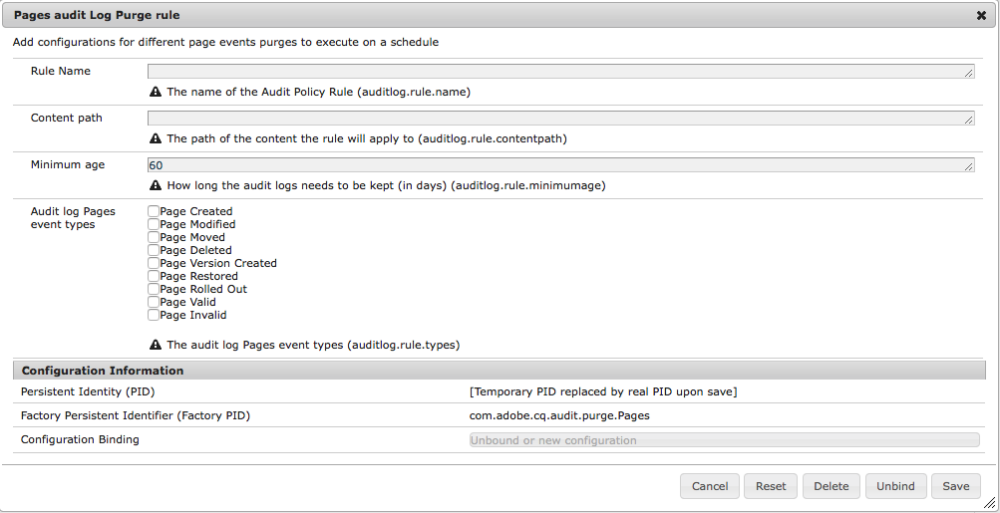

# AEM 6{#audit-log-maintenance-in-aem}中的稽核記錄維護

符合稽核記錄資格的AEM事件會產生大量封存資料。 由於複製、資產上傳和其他系統活動，此資料可能會隨著時間而快速增長。

「審核日誌維護」包括幾個功能部分，這些功能允許在特定策略下自動執行審核日誌維護。

它作為可配置的每週維護任務實施，並可通過Operations Dashboard監視控制台訪問。

如需詳細資訊，請參閱[操作控制面板檔案](/help/sites-administering/operations-dashboard.md)。

審核日誌清除選項有三種類型：

1. [頁面稽核記錄清除](/help/sites-administering/operations-audit-log.md#configure-page-audit-log-purging)
1. [DAM稽核記錄清除](/help/sites-administering/operations-audit-log.md#configure-dam-audit-log-purging)
1. [複製審核日誌更新](/help/sites-administering/operations-audit-log.md#configure-replication-audit-log-purging)

每個選項都可在AEM Web Console中建立規則來設定。 配置完這些檔案後，您可以轉到&#x200B;**工具 — 操作 — 維護 — 每週維護窗口**&#x200B;並運行&#x200B;**審核日誌維護任務**&#x200B;來觸發它們。

## 配置頁審核日誌清除{#configure-page-audit-log-purging}

請依照下列步驟來設定稽核記錄清除：

1. 將瀏覽器指向`http://localhost:4502/system/console/configMgr/`，前往「Web主控台管理」

1. 搜索名為&#x200B;**頁面審核日誌清除規則**&#x200B;的項目，然後按一下它。

   

1. 接下來，根據您的需求配置清除計畫程式。 可用選項包括：

   * **規則名稱：** 稽核原則規則的名稱；
   * **內容路徑：** 套用規則的內容路徑；
   * **最低年齡：** 需要保留稽核記錄的時間（以天為單位）;
   * **稽核記錄類型：** 應清除的稽核記錄類型。

   >[!NOTE]
   >
   >內容路徑僅適用於儲存庫中`/var/audit/com.day.cq.wcm.core.page`節點的子項。

1. 儲存規則。
1. 您剛建立的規則必須公開在「操作控制面板」中，才能執行。 要執行此操作，請從「AEM歡迎」螢幕轉到&#x200B;**Tools - Operations - Maintenance**。

1. 按&#x200B;**每週維護窗口**&#x200B;卡。

1. 您會在&#x200B;**AuditLog Maintenance Task**&#x200B;卡下找到已存在的維護任務。

   

1. 您可以檢查下次執行的日期、進行設定，或按播放按鈕手動執行。

在AEM 6.3中，如果計畫維護窗口在「審核日誌清除」任務完成之前關閉，則任務將自動停止。 下次維護視窗開啟時，就會繼續。

**使用AEM 6.5**&#x200B;時，您可以按一下停止圖示，手動停止執行中的稽核記錄清除 **** 任務。在下次執行時，該任務將安全地恢復。

>[!NOTE]
>
>停止維護任務意味著暫停其執行，而不丟失已在進行中的作業的跟蹤。

## 配置DAM審核日誌清除{#configure-dam-audit-log-purging}

1. 導覽至&#x200B;*https://&lt;serveraddress>:&lt;serverport>/system/console/configMgr*&#x200B;的系統控制台
1. 搜尋&#x200B;**DAM稽核記錄清除**&#x200B;規則，然後按一下結果。
1. 在下一個視窗中，依此設定您的規則。 選項為：

   * **規則名稱：** 稽核原則規則的名稱；
   * **內容路徑：** 規則要套用的內容路徑
   * **最低年齡：** 需要保留稽核記錄的時間（以天為單位）
   * **稽核記錄Dam事件類型：** 應清除的DAM稽核事件類型。

1. 按一下&#x200B;**Save**&#x200B;以保存配置

## 配置複製審核日誌清除{#configure-replication-audit-log-purging}

1. 導覽至&#x200B;*https://&lt;serveraddress>:&lt;serverport>/system/console/configMgr*&#x200B;的系統控制台
1. 搜索&#x200B;**複製審核日誌清除調度程式**，然後按一下結果
1. 在下一個視窗中，依此設定您的規則。 選項為：

   * **規則名稱：** 稽核原則規則的名稱
   * **內容路徑：** 規則要套用的內容路徑
   * **最低年齡：** 需要保留稽核記錄的時間（以天為單位）
   * **審核日誌複製事件類型：** 應清除的複製審核事件類型

1. 按一下&#x200B;**Save**&#x200B;以保存配置。
