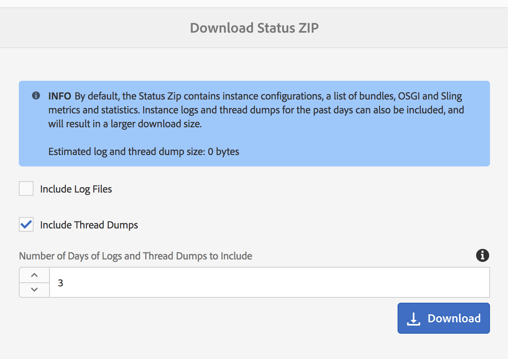

# 操作儀表板 {#operations-dashboard}

## 簡介 {#introduction}

AEM 6中的Operations Dashboard可協助系統營運商監控AEM系統狀況。 它還提供有關AEM相關方面的自動產生的診斷資訊，並可設定和執行獨立的維護自動化，以大幅減少專案作業和支援案例。 The Operations Dashboard can be extended with custom health checks and maintenance tasks. 此外，您也可透過JMX從外部監控工具存取「作業控制面板」資料。

**操作儀表板：**

* 是單鍵系統狀態，可協助營運部門提高效率
* 在單一集中位置提供系統運行狀況概述
* 縮短尋找、分析和修正問題的時間
* 提供獨立的維護自動化功能，協助大幅降低專案作業成本

您可從「AEM歡迎」畫面 **前往「工具** - **作業** 」來存取它。

>[!NOTE]
>
>為了能夠存取「作業控制面板」，登入的使用者必須是「營運商」使用者群組的一部分。 如需詳細資訊，請參閱「使用者、群 [組和存取權限管理」相關檔案](/help/sites-administering/user-group-ac-admin.md)。

## 健康狀況報告 {#health-reports}

The Health Report system provides on the health of an AEM instance through Sling Health Checks. 這可以透過OSGI、JMX、HTTP要求（透過JSON）或Touch UI來完成。 它提供特定可設定計數器的度量和臨界值，在某些情況下，將提供如何解決問題的資訊。

它具有多項功能，說明如下。

## 健康狀態檢查 {#health-checks}

The **Health Reports** are a system of cards indication good or bad health for a specific product area. 這些卡片是Sling Health Checks的視覺化，可匯整來自JMX和其他來源的資料，並將處理的資訊再次公開為MBeans。 這些MBeans也可在 [JMX網頁主控台](/help/sites-administering/jmx-console.md), **org.apache.sling.healthcheck網域下進行檢查** 。

The Health Reports interface can be accessed by the **Tools** - **Operations** - **** Health Reports menu on the AEM Welcome screen, or directly the following URL:

`https://<serveraddress>:port/libs/granite/operations/content/healthreports/healthreportlist.html`


卡系統會顯示三種可能的狀態：好 **的**, **警告** , **嚴重**。 狀態是規則和臨界值的結果，可將滑鼠暫留在卡片上，然後按一下動作列中的齒輪圖示來設定：


### 運行狀況檢查類型 {#health-check-types}

AEM 6中有兩種類型的健康檢查：

1. Individual Health Checks
1. Composite Health Checks

An **Individual Health Check** is a single health check that corresponds to a status card. Individual Health Checks can be configured with rules or thresholds and they can provide one or more hints and links to solve indited health issues. 讓我們以「記錄錯誤」檢查為例：如果實例日誌中有ERROR條目，您將在運行狀況檢查的詳細資訊頁面上找到它們。 在頁面頂部，您將在「診斷工具」部分看到指向「日誌消息」分析器的連結，該連結將使您能夠更詳細地分析這些錯誤並重新配置記錄器。

A **Composite Health Check** is a check that aggregates information from endividual checks.

Composite health checks are configured with the aid of **filter tags**. 在實質中，所有具有相同篩選標籤的單一檢查都將分組為複合健康檢查。 A Composite Health Check will an OK status only if all the single checks it aggregates as OK statuses ass.

### How to create Health Checks {#how-to-create-health-checks}

在「操作儀表板」中，您可以直觀地顯示單個和複合健康檢查的結果。

### Creating an individual Health Check {#creating-an-individual-health-check}

Creating an individual Health Check inverted two steps:實作a Sling Health Check，並新增Dashboard設定節點中Health Check的項目。

1. 若要建立Sling Health Check，您必須建立實作Sling HealthCheck介面的OSGI元件。 您會將此元件新增至套件中。 元件的屬性將完全標識Health Check。 在安裝此元件後，將自動為Health Check（運行狀況檢查）建立JMX MBean。 如需詳細資 [訊，請參閱Sling Health Check Documentation](https://sling.apache.org/documentation/bundles/sling-health-check-tool.html) 。

   Example of a Sling Health Check component, writted with OSGI service component annotations:

   ```java
   @Component(service = HealthCheck.class,
   property = {
       HealthCheck.NAME + "=Example Check",
       HealthCheck.TAGS + "=example",
       HealthCheck.TAGS + "=test",
       HealthCheck.MBEAN_NAME + "=exampleHealthCheckMBean"
   })
    public class ExampleHealthCheck implements HealthCheck {
       @Override
       public Result execute() {
           // health check code
       }
    }
   ```

   >[!NOTE]
   >
   >該 `MBEAN_NAME` 屬性定義將為此運行狀況檢查生成的mbean的名稱。

1. 建立Health Check後，需要建立新的配置節點，以便在Operations Dashboard介面中訪問該節點。 對於此步驟，必須知道Health Check（屬性）的JMX Mbean `MBEAN_NAME` 名稱。 要為Health Check建立配置，請開啟CRXDE並在以下路徑下添加新節點(類型為 **nt:unstructured**): `/apps/settings/granite/operations/hc`

   在新節點上應設定以下屬性：

   * **** 名稱： `sling:resourceType`

      * **** 類型： `String`
      * **** 值： `granite/operations/components/mbean`
   * **** 名稱： `resource`

      * **** 類型： `String`
      * **** 值： `/system/sling/monitoring/mbeans/org/apache/sling/healthcheck/HealthCheck/exampleHealthCheck`
   >[!NOTE]
   >
   >上面的資源路徑建立如下：如果Health Check的mbean名稱為&quot;test&quot;，請將&quot;test&quot;新增至路徑的結尾 `/system/sling/monitoring/mbeans/org/apache/sling/healthcheck/HealthCheck`
   >
   >因此，最終的路徑是：
   >
   >`/system/sling/monitoring/mbeans/org/apache/sling/healthcheck/HealthCheck/test`

   >[!NOTE]
   >
   >請確定路 `/apps/settings/granite/operations/hc` 徑的下列屬性設為true:
   >
   >
   >`sling:configCollectionInherit`
   >
   >`sling:configPropertyInherit`
   >
   >
   >這將通知配置管理器將新配置與現有配置合併 `/libs`。

### 建立複合健康檢查 {#creating-a-composite-health-check}

A Composite Health Check&#39;s role is to aggregate a number of individual Health Checks sharing a set of common features. 例如， Security Composite Health Check將所有個別的健康狀況檢查組一起執行安全相關驗證。 建立複合檢查的第一步是添加新的OSGI配置。 要在「操作儀表板」中顯示該節點，需要添加新的配置節點，這與我們對簡單檢查的方式相同。

1. 前往OSGI主控台的Web組態管理器。 您可以透過存取 `https://serveraddress:port/system/console/configMgr`
1. 搜尋名為 **Apache Sling Composite Health Check的項目**。 在找到它後，請注意已有兩種配置可供使用：一個代表系統檢查，另一個代表安全檢查。
1. 按配置右側的「+」按鈕，建立新配置。 將會出現新視窗，如下所示：

   

1. 建立設定並儲存。 將使用新配置建立一個Mbean。

   每個配置屬性的用途如下：

   * **** 名稱(hc.name):The name of the Composite Health Check. 建議使用有意義的名稱。
   * **** 標籤(hc.tags):此Health Check的標籤。 如果此複合健康狀況檢查是另一個複合健康狀況檢查的一部分（例如，在健康狀況檢查的層次中），請添加與此複合相關的標籤。
   * **** MBean名稱(hc.mbean.name):The name of the Mbean that will be gived to the JMX MBean of this composite health check.
   * **** 篩選標籤(filter.tags):This is a property specific to composite health checks. 這些是複合應該聚合的標籤。 The composite health check will aggregate under its group all the health checks that have any tag matching any of the filter tags of this composite. 例如，具有filter **test** and **check** 的Health check will aggregate all the individual and composite health checks that have any of the **test and******`hc.tags`checkComposite tags in their tags property(chomposite)。
   >[!NOTE]
   >
   >A new JMX Mbean is created for each new configuration of the Apache Sling Composite Health Check.**

1. 最後，剛建立的複合健康檢查項需要添加到「操作儀表板」配置節點中。 此過程與使用單個健康檢查的過程相同：需要在下 **建立nt:unstructured** 類型的節點 `/apps/settings/granite/operations/hc`。 節點的資源屬性將由OSGI配置中的 **hc.mean.name** 值定義。

   例如，如果您建立了配置並將 **hc.mbean.name** 值設定為 **diskusage**，則配置節點將如下所示：

   * **** 名稱： `Composite Health Check`

      * **** 類型： `nt:unstructured`
   使用下列屬性：

   * **** 名稱： `sling:resourceType`

      * **** 類型： `String`
      * **** 值： `granite/operations/components/mbean`
   * **** 名稱： `resource`

      * **** 類型： `String`
      * **** 值： `/system/sling/monitoring/mbeans/org/apache/sling/healthcheck/HealthCheck/diskusage`
   >[!NOTE]
   >
   >如果您建立邏輯上屬於複合檢查的個別健康檢查（預設情況下，該複合檢查已存在於儀表板中），則它們將自動被捕獲並分組到相應的複合檢查下。 因此，無需為這些檢查建立新的配置節點。
   >
   >例如，如果您建立個別的安全性健康狀況檢查，您只需要將&quot;**security**&quot;標籤指派給它，它就會安裝，它就會自動出現在Operations Dashboard中的Security Checks複合檢查下。

### AEM提供的Health Checks {#health-checks-provided-with-aem}

<table>
 <tbody>
  <tr>
   <td><strong>zHealthcheck名稱</strong></td>
   <td><strong>說明</strong></td>
  </tr>
  <tr>
   <td>查詢效能</td>
   <td><p>AEM 6.4中已簡 <strong>化此健康狀況檢查</strong>，現在會檢查最近重構的 <code>Oak QueryStats</code> MBean，尤其是屬 <code>SlowQueries </code>性。 如果統計資訊包含任何慢速查詢，則健康檢查返回警告。 否則，它返回「確定」狀態。<br /> </p> <p>The MBean for this health check is <a href="http://localhost:4502/system/console/jmx/org.apache.sling.healthcheck%3Aname%3DqueriesStatus%2Ctype%3DHealthCheck">org.apache.sling.healthcheck:name=querysStatus,type=HealthCheck</a>。</p> </td>
  </tr>
  <tr>
   <td>觀察佇列長度</td>
   <td><p>觀察佇列長度會重複所有事件聆聽器和背景觀察器，並將其與 <code>queueSize </code>其和 <code>maxQueueSize</code> 比較：</p>
    <ul>
     <li>如果值超過值(即 <code>queueSize</code> 事件將被 <code>maxQueueSize</code> 丟棄時)，則返回嚴重狀態</li>
     <li>如果值超過 <code>queueSize</code> (預設值 <code>maxQueueSize * WARN_THRESHOLD</code> 為0.75)，則傳回警告 </li>
    </ul> <p>每個佇列的最大長度來自個別設定（Oak和AEM），且無法透過此健康狀況檢查進行設定。 此健康檢查的MBean是 <a href="http://localhost:4502/system/console/jmx/org.apache.sling.healthcheck%3Aname%3DObservationQueueLengthHealthCheck%2Ctype%3DHealthCheck">org.apache.sling.healthcheck:name=ObservationQueueLengthHealthCheck,type=HealthCheck</a>。</p> </td>
  </tr>
  <tr>
   <td>查詢周遊限制</td>
   <td><p>查詢遍歷限制會檢 <code>QueryEngineSettings</code> 查MBean，更確切地說 <code>LimitInMemory</code> 是 <code>LimitReads</code> MBean和屬性，並返回以下狀態：</p>
    <ul>
     <li>如果其中一個限制等於或高於 <code>Integer.MAX_VALUE</code></li>
     <li>如果其中一個限制低於10000（Oak的建議設定），則傳回「警告」狀態</li>
     <li>如果無法檢索或任何限 <code>QueryEngineSettings</code> 制，則返回「嚴重」狀態</li>
    </ul> <p>The Mbean for this health check is <a href="http://localhost:4502/system/console/jmx/org.apache.sling.healthcheck%3Aname%3DqueryTraversalLimitsBundle%2Ctype%3DHealthCheck">org.apache.sling.healthcheck:name=queryTraversalLimitsBundle,type=HealthCheck</a>。</p> </td>
  </tr>
  <tr>
   <td>已同步時鐘</td>
   <td><p>此檢查僅與文檔節點 <a href="https://github.com/apache/sling-old-svn-mirror/blob/4df9ab2d6592422889c71fa13afd453a10a5a626/bundles/extensions/discovery/oak/src/main/java/org/apache/sling/discovery/oak/SynchronizedClocksHealthCheck.java">儲存群集相關</a>。 它返回以下狀態：</p>
    <ul>
     <li>當實例時鐘不同步並超過預先定義的低閾值時，返回「警告」狀態</li>
     <li>當實例時鐘不同步並超過預定義的高閾值時，返回「嚴重」狀態</li>
    </ul> <p>The Mbean for this health check is <a href="http://localhost:4502/system/console/jmx/org.apache.sling.healthcheck%3Aname%3DslingDiscoveryOakSynchronizedClocks%2Ctype%3DHealthCheck">org.apache.sling.healthcheck:name=slingDiscoveryOakSynchronizedClocks,type=HealthCheck</a>。</p> </td>
  </tr>
  <tr>
   <td>非同步處理索引</td>
   <td><p>Asynchronous Indexes檢查：</p>
    <ul>
     <li>如果至少有一個索引通道出現故障，則返回嚴重狀態</li>
     <li>檢查所 <code>lastIndexedTime</code> 有索引通道和：
      <ul>
       <li>如果超過2小時前，傳回嚴重狀態 </li>
       <li>傳回2小時至45分鐘前的警告狀態 </li>
       <li>如果45分鐘前狀態不到，則返回「正常」狀態 </li>
      </ul> </li>
     <li>如果未滿足這些條件，則返回「確定」狀態</li>
    </ul> <p>「嚴重」和「警告」狀態閾值都可配置。 The Mbean for this health check is <a href="http://localhost:4502/system/console/jmx/org.apache.sling.healthcheck%3Aname%3DasyncIndexHealthCheck%2Ctype%3DHealthCheck">org.apache.sling.healthcheck:name=asyncIndexHealthCheck,type=HealthCheck</a>。</p> <p><strong>注意：此 </strong>健康狀態檢查適用於AEM 6.4，並已備份至AEM 6.3.0.1。</p> </td>
  </tr>
  <tr>
   <td>大型 Lucene 索引</td>
   <td><p>此檢查使用MBean公開的資料來 <code>Lucene Index Statistics</code> 標識大型索引並返回：</p>
    <ul>
     <li>a警告狀態（如果有索引包含超過10億份檔案）</li>
     <li>a如果索引包含超過15億份檔案，則處於關鍵狀態</li>
    </ul> <p>The thresholds are configurable and the MBean for the health check is <a href="http://localhost:4502/system/console/jmx/org.apache.sling.healthcheck%3Aname%3DlargeIndexHealthCheck%2Ctype%3DHealthCheck">org.apache.sling.healthcheck:name=largeIndexHealthCheck,type=HealthCheck。</a></p> <p><strong>注意：此 </strong>檢查適用於AEM 6.4，並已備份至AEM 6.3.2.0。</p> </td>
  </tr>
  <tr>
   <td>系統維護</td>
   <td><p>System Maintenance（系統維護）是一種複合檢查，如果所有維護任務都按配置運行，則返回OK（確定）。 請記住：</p>
    <ul>
     <li>每個維護任務都伴有關聯的運行狀況檢查</li>
     <li>如果未將任務添加到維護窗口，其運行狀況檢查將返回「關鍵」</li>
     <li>您需要配置「審核日誌」和「工作流清除」維護任務，或者從維護窗口中刪除這些任務。 如果未配置，這些任務將在第一次嘗試運行時失敗，因此系統維護檢查將返回嚴重狀態。</li>
     <li><strong>在AEM 6.4中</strong>，也會檢查 <a href="/help/sites-administering/operations-dashboard.md#automated-maintenance-tasks">Lucene Binaries Maintenance</a> task</li>
     <li>在AEM 6.2和更低版本中，系統維護檢查會在啟動後立即傳回警告狀態，因為工作從未執行。 從6.3開始，如果尚未到達第一個維護窗口，則返回「OK（正常）」。</li>
    </ul> <p>The MBean for this health check is <a href="http://localhost:4502/system/console/jmx/org.apache.sling.healthcheck%3Aname%3Dsystemchecks%2Ctype%3DHealthCheck">org.apache.sling.healthcheck:name=systemchecks,type=HealthCheck</a>。</p> </td>
  </tr>
  <tr>
   <td>複製隊列</td>
   <td><p>此檢查會重複複製代理並查看其隊列。 對於隊列頂部的項目，檢查將查看代理重試複製的次數。 如果代理重試的複製次數超過參數 <code>numberOfRetriesAllowed</code> 的值，則返回警告。 參數 <code>numberOfRetriesAllowed</code> 是可配置的。 </p> <p>The MBean for this health check is <a href="http://localhost:4502/system/console/jmx/org.apache.sling.healthcheck%3Aname%3DreplicationQueue%2Ctype%3DHealthCheck" target="_blank">org.apache.sling.healthcheck:name=replicationQueue,type=HealthCheck</a>。</p> </td>
  </tr>
  <tr>
   <td>Sling 工作</td>
   <td>
    <div>
      Sling Jobs會檢查JobManager中佇列的工作數目，並將它與臨界值 <code>maxNumQueueJobs</code> 比較，以及：
    </div>
    <ul>
     <li>如果佇列中的數量超過， <code>maxNumQueueJobs</code> 則傳回嚴重</li>
     <li>如果有長時間運行的活動作業超過1小時，則返回嚴重</li>
     <li>如果有佇列中的工作，且上次完成的工作時間超過1小時，則傳回嚴重</li>
    </ul> <p>只有佇列作業參數的最大數目是可設定的，且其預設值為1000。</p> <p>The MBean for this health check is <a href="http://localhost:4502/system/console/jmx/org.apache.sling.healthcheck%3Aname%3DslingJobs%2Ctype%3DHealthCheck" target="_blank">org.apache.sling.healthcheck:name=slingJobs,type=HealthCheck</a>。</p> </td>
  </tr>
  <tr>
   <td>要求效能</td>
   <td><p>此檢查會查看 <code>granite.request.metrics.timer</code> Sling <a href="http://localhost:4502/system/console/slingmetrics" target="_blank">量度 </a>和：</p>
    <ul>
     <li>如果第75個百分位數值超過臨界臨界臨界值（預設值為500毫秒），則傳回臨界值</li>
     <li>如果第75個百分位數值超過警告臨界值（預設值為200毫秒），則傳回警告</li>
    </ul> <p>The MBean for this health check is<em> </em><a href="http://localhost:4502/system/console/jmx/org.apache.sling.healthcheck%3Aname%3DrequestsStatus%2Ctype%3DHealthCheck" target="_blank">org.apache.sling.healthcheck:name=requestsStatus,type=HealthCheck</a>。</p> </td>
  </tr>
  <tr>
   <td>日誌錯誤</td>
   <td><p>如果日誌中有錯誤，此檢查將返回「警告」狀態。</p> <p>The MBean for this health check is <a href="http://localhost:4502/system/console/jmx/org.apache.sling.healthcheck%3Aname%3DlogErrorHealthCheck%2Ctype%3DHealthCheck" target="_blank">org.apache.sling.healthcheck:name=logErrorHealthCheck,type=HealthCheck</a>。</p> </td>
  </tr>
  <tr>
   <td>磁碟空間</td>
   <td><p>「磁碟空間」檢查查看 <code>FileStoreStats</code> MBean，檢索節點儲存的大小和節點儲存分區上的可用磁碟空間量，以及：</p>
    <ul>
     <li>如果可用磁碟空間與儲存庫大小比小於警告閾值（預設值為10），則返回警告</li>
     <li>如果可用磁碟空間與儲存庫大小比小於關鍵閾值（預設值為2），則返回關鍵值</li>
    </ul> <p>這兩個臨界值皆可設定。 此檢查僅適用於區段存放區的例項。</p> <p>The MBean for this health check is <a href="http://localhost:4502/system/console/jmx/org.apache.sling.healthcheck%3Aname%3DDiskSpaceHealthCheck%2Ctype%3DHealthCheck" target="_blank">org.apache.sling.healthcheck:name=DiskSpaceHealthCheck,type=HealthCheck</a>。</p> </td>
  </tr>
  <tr>
   <td>排程器健康情況檢查</td>
   <td><p>如果實例的Quartz作業運行超過60秒，此檢查將返回警告。 可接受的持續時間閾值是可配置的。</p> <p>The MBean for this health check is <a href="http://localhost:4502/system/console/jmx/org.apache.sling.healthcheck%3Aname%3DslingCommonsSchedulerHealthCheck%2Ctype%3DHealthCheck" target="_blank">org.apache.sling.healthcheck:name=slingCommonsSchedulerHealthCheck,type=HealthCheck</a><em>。</em></p> </td>
  </tr>
  <tr>
   <td>安全性檢查</td>
   <td><p>Security check is a composite which aggregates the results of multiple security-related checks. 這些個別的健康狀況檢查可解決與「安全檢查清單」檔案頁面上的安全檢查清 <a href="/help/sites-administering/security-checklist.md">單不同的問題。</a> 當啟動實例時，此檢查作為安全煙霧測試非常有用。 </p> <p>The MBean for this health check is <a href="http://localhost:4502/system/console/jmx/org.apache.sling.healthcheck%3Aname%3Dsecuritychecks%2Ctype%3DHealthCheck" target="_blank">org.apache.sling.healthcheck:name=</a><a href="http://localhost:4502/system/console/jmx/org.apache.sling.healthcheck%3Aname%3Dsecuritychecks%2Ctype%3DHealthCheck" target="_blank"></a><a href="http://localhost:4502/system/console/jmx/org.apache.sling.healthcheck%3Aname%3Dsecuritychecks%2Ctype%3DHealthCheck" target="_blank"></a><a href="http://localhost:4502/system/console/jmx/org.apache.sling.healthcheck%3Aname%3Dsecuritychecks%2Ctype%3DHealthCheck" target="_blank">securitychecks,type=HealthCheck</a></p> </td>
  </tr>
  <tr>
   <td>作用中組合</td>
   <td><p>Active Bundles會檢查所有捆綁的狀態，並：</p>
    <ul>
     <li>如果任何捆綁包未激活或（啟動，啟動時啟動），則返回「警告」狀態</li>
     <li>它忽略忽略忽略清單中捆綁的狀態</li>
    </ul> <p>忽略清單參數是可配置的。</p> <p>此健康檢查的MBean是 <a href="http://localhost:4502/system/console/jmx/org.apache.sling.healthcheck%3Aname%3DinactiveBundles%2Ctype%3DHealthCheck" target="_blank">org.apache.sling.healthcheck:name=inactiveBundles,type=HealthCheck</a>。</p> </td>
  </tr>
  <tr>
   <td>程式碼快取檢查</td>
   <td><p>This is a Health Check that verifies forme JVM conditions that can trigger a codeCache bug present in Java 7:</p>
    <ul>
     <li>在啟用「程式碼快取」清除的情況下，如果執行個體在Java 7上執行，則傳回警告</li>
     <li>如果實例在Java 7上運行，且保留代碼快取大小小於最小閾值（預設值為90MB），則返回警告</li>
    </ul> <p>閾值 <code>minimum.code.cache.size</code> 是可配置的。 如需此錯誤的詳細資訊，請 <a href="https://bugs.java.com/bugdatabase/view_bug.do?bug_id=8012547">查看</a><a href="https://bugs.java.com/bugdatabase/view_bug.do?bug_id=8012547"></a><a href="https://bugs.java.com/bugdatabase/view_bug.do?bug_id=8012547"></a><a href="https://bugs.java.com/bugdatabase/view_bug.do?bug_id=8012547"> 本頁</a>。</p> <p>The MBean for this health check is <a href="http://localhost:4502/system/console/jmx/org.apache.sling.healthcheck%3Aname%3DcodeCacheHealthCheck%2Ctype%3DHealthCheck" target="_blank">org.apache.sling.healthcheck:name=codeCacheHealthCheck,type=HealthCheck</a>。</p> </td>
  </tr>
  <tr>
   <td>資源搜尋路徑錯誤</td>
   <td><p>檢查路徑中是否有任何資源， <code>/apps/foundation/components/primary</code> 並：</p>
    <ul>
     <li>返回警告：如果子節點位於 <code>/apps/foundation/components/primary</code></li>
    </ul> <p>此健康檢查的MBean是 <a href="http://localhost:4502/system/console/jmx/org.apache.sling.healthcheck%3Aname%3DresourceSearchPathErrorHealthCheck%2Ctype%3DHealthCheck" target="_blank">org.apache.sling.healthcheck:name=resourceSearchPathErrorHealthCheck,type=HealthCheck</a>。</p> </td>
  </tr>
 </tbody>
</table>

## 使用Nagios進行監控 {#monitoring-with-nagios}

Health Check Dashboard可透過Granite JMX Mbeans與Nagios整合。 下列範例說明如何新增檢查，以顯示執行AEM之伺服器上已使用的記憶體。

1. 在監控伺服器上安裝和安裝Nagios。
1. 接著，安裝Nagios Remote Plugin Executor(NRPE)。

   >[!NOTE]
   >
   >有關如何在您的系統上安裝Nagios和NRPE的更多資訊，請參閱 [Nagios檔案](https://library.nagios.com/library/products/nagioscore/manuals/)。

1. 新增AEM伺服器的主機定義。 這可以透過Nagios XI web介面，使用Configuration Manager:

   1. 開啟瀏覽器並指向Nagios伺服器。
   1. 按頂 **部菜單** 中的「配置」按鈕。
   1. 在左窗格中，按「Advanced Configuration（高級配置）」下 **的「Core Config Manager** (核心配 **置管理器)」**。
   1. 按「監 **視** 」部分下的 **Hosts** 連結。
   1. 添加主機定義：
   

   以下是主機配置檔案的示例，以防您使用Nagios Core:

   ```xml
   define host {
      address 192.168.0.5
      max_check_attempts 3
      check_period 24x7
      check-command check-host-alive
      contacts admin
      notification_interval 60
      notification_period 24x7
   }
   ```

1. 在AEM伺服器上安裝Nagios和NRPE。
1. 在兩 [部伺服器上安裝check_http_json](https://github.com/phrawzty/check_http_json) 外掛程式。
1. 在兩部伺服器上定義一般JSON檢查命令：

   ```xml
   define command{
   
       command_name    check_http_json-int
   
       command_line    /usr/lib/nagios/plugins/check_http_json --user "$ARG1$" --pass "$ARG2$" -u 'https://$HOSTNAME$:$ARG3$/$ARG4$' -e '$ARG5$' -w '$ARG6$' -c '$ARG7$'
   
   }
   ```

1. 在AEM伺服器上新增已用記憶體的服務：

   ```xml
   define service {
   
       use generic-service
   
       host_name my.remote.host
   
       service_description AEM Author Used Memory
   
       check_command  check_http_json-int!<cq-user>!<cq-password>!<cq-port>!system/sling/monitoring/mbeans/java/lang/Memory.infinity.json!{noname}.mbean:attributes.HeapMemoryUsage.mbean:attributes.used.mbean:value!<warn-threshold-in-bytes>!<critical-threshold-in-bytes>
   
       }
   ```

1. 檢查您的Nagios儀表板中是否有新建立的服務：

   

## Diagnosis tools {#diagnosis-tools}

「操作儀表板」還提供對診斷工具的訪問，這些工具有助於查找和排除來自健康檢查儀表板的警告的根本原因，並為系統操作員提供重要的調試資訊。

其最重要的功能包括：

* 日誌消息分析器
* 能夠訪問堆和線程轉儲
* 請求和查詢效能分析器

您可從「AEM歡迎」畫面前往「工具- **作業——診斷」** ，即可進入「診斷工具」畫面。 您也可以直接存取下列URL，以存取畫面： `https://serveraddress:port/libs/granite/operations/content/diagnosis.html`


### 日誌消息 {#log-messages}

預設情況下，日誌消息用戶介面將顯示所有ERROR消息。 如果要顯示更多日誌消息，則需要使用相應的日誌級別配置日誌程式。

日誌消息使用記憶體日誌附加器，因此與日誌檔案無關。 另一個結果是，更改此UI中的日誌級別不會更改在傳統日誌檔案中記錄的資訊。 在此UI中添加和刪除記錄程式將僅影響in memory記錄程式。 此外，請注意，更改記錄器配置將反映在in memory logger的未來中——已記錄且不再相關的條目不會刪除，但類似條目將不會在將來記錄。

您可從UI的左上角齒輪按鈕提供記錄器設定，以設定記錄的記錄內容。 您可以在此處添加、刪除或更新記錄程式配置。 記錄器配置由日誌 **級別** (WARN / INFO / DEBUG)和過濾器 **名稱組成**。 篩 **選器名稱** ，其角色是過濾日誌消息的源。 或者，如果記錄器應捕獲指定級別的所有日誌消息，則過濾器名稱應為&quot;**root**&quot;。 設定記錄器的級別將觸發所有級別等於或高於指定級別的消息的捕獲。

範例：

* 如果您計畫捕獲所有 **ERROR** 消息，則無需配置。 預設情況下，將捕獲所有ERROR消息。
* 如果計畫捕獲所有 **ERROR**、 **WARN** 和 **INFO** messages - the logger name should be set to:&quot;**root**&quot;，和the logger level to:資 **訊**。

* 如果您計畫擷取來自特定封裝的所有訊息（例如com.adobe.granite）-記錄器名稱應設為：&quot;com.adobe.granite&quot;和logger level to: **DEBUG** (這將捕獲所有 **ERROR**、 **WARN**、DEBUG Messages中的INFO和 ******** DEBUG消息)，如下圖所示。


>[!NOTE]
>
>您無法將記錄器名稱設定為通過指定的過濾器僅捕獲ERROR消息。 預設情況下，將捕獲所有ERROR消息。

>[!NOTE]
>
>日誌消息用戶介面不反映實際錯誤日誌。 除非您在UI中設定其他類型的記錄訊息，否則您只會看到ERROR訊息。 有關如何顯示特定日誌消息的資訊，請參閱上述說明。

>[!NOTE]
>
>診斷頁面中的設定不會影響記錄到日誌檔案的內容，反之亦然。 因此，雖然錯誤日誌可能會捕獲INFO消息，但您可能無法在日誌消息UI中看到這些消息。 此外，透過UI，可從特定套件擷取DEBUG訊息，而不會影響錯誤記錄。 有關如何配置日誌檔案的詳細資訊，請參 [閱Logging](/help/sites-deploying/configure-logging.md)。

>[!NOTE]
>
>**在AEM 6.4中**，維護工作會以INFO層級的豐富資訊格式從方塊中登出。 這樣可以更好地查看維護任務的狀態。
>
>如果您使用第三方工具（如Splunk）監視維護任務活動並對其做出反應，則可使用以下日誌語句：

```
Log level: INFO
DATE+TIME [MaintanceLogger] Name=<MT_NAME>, Status=<MT_STATUS>, Time=<MT_TIME>, Error=<MT_ERROR>, Details=<MT_DETAILS>
```

### 要求效能 {#request-performance}

「請求效能」頁面可讓您分析處理的最慢頁面請求。 此頁面上僅會註冊內容要求。 更具體而言，將會擷取下列請求：

1. 請求訪問 `/content`
1. 請求訪問 `/etc/design`
1. 具有副檔名的請 `".html"` 求


頁面會顯示：

* 提出請求的時間
* URL與請求方法
* 持續時間（以毫秒為單位）

依預設，會擷取最慢的20個頁面請求，但可在設定管理員中修改限制。

### 查詢效能 {#query-performance}

「查詢效能」頁允許分析系統執行的最慢查詢。 此資訊由JMX Mbean中的儲存庫提供。 在Jackrabbit中， `com.adobe.granite.QueryStat` JMX Mbean會提供此資訊，而在Oak儲存庫中，則由 `org.apache.jackrabbit.oak.QueryStats.`

頁面會顯示：

* 進行查詢的時間
* 查詢語言
* 發出查詢的次數
* 查詢語句
* 持續時間（以毫秒為單位）


### 說明查詢 {#explain-query}

對於任何給定查詢，Oak會嘗試根據在 **oak:index節點下的資料庫中定義的Oak索引，找出執行的最佳方式** 。 根據查詢，Oak可以選擇不同的索引。 瞭解Oak如何執行查詢是最佳化查詢的第一步。

Explain Query是一種工具，可說明Oak如何執行查詢。 您可從「AEM歡迎畫面」前往「 **Tools - Operations - Diagnosis** 」（工具——作業——診斷），然後按一下「 **Query Performance** 」（查詢效能），然後切換至「Explain Query **」(解** 釋查詢)標籤來存取它。

**功能**

* 支援Xpath、JCR-SQL和JCR-SQL2查詢語言
* 報告提供查詢的實際執行時間
* 檢測慢速查詢並警告可能慢速的查詢
* 報告用於執行查詢的Oak索引
* 顯示實際的Oak查詢引擎說明
* 提供「慢速」和「熱門」查詢的點按載入清單

在「解釋查詢」UI中後，您只需輸入查詢並按「說明」按鈕即可 **使用** :


「查詢解釋」部分中的第一個條目是實際解釋。 說明將顯示用於執行查詢的索引類型。

第二個條目是執行計畫。

在執行查 **詢之前，按一下「包含執行時間** 」方塊，也會顯示查詢在中執行的時間量，以取得可用於最佳化應用程式或部署索引的詳細資訊。


### 索引管理器 {#the-index-manager}

「索引管理器」的作用是幫助進行索引管理，如維護索引或查看其狀態。

您可從「歡迎使用」螢幕轉到「**工具——操作——診斷」**，然後按一下「索引管理器」 **按鈕** 。

您也可以直接在此URL存取它： `https://serveraddress:port/libs/granite/operations/content/diagnosistools/indexManager.html`


UI可用來篩選表格中的索引，方法是在螢幕左上角的搜尋方塊中輸入篩選條件。

### 下載狀態ZIP {#download-status-zip}

這將觸發下載包含系統狀態和配置有用資訊的zip。 封存包含例項設定、組合清單、OSGI、Sling度量和統計資料，這可能會產生大型檔案。 您可以使用「下載狀態ZIP」視窗來降低大型狀 **態檔案的**&#x200B;影響。 **您可從以下網址訪問該窗口：AEM >工具>作業>診斷>下載狀態ZIP。**

在此窗口中，您可以選擇要導出的內容（日誌檔案和線程轉儲）以及下載中包含的日誌相對於當前日期的天數。



### 下載線程轉儲 {#download-thread-dump}

這將觸發下載包含系統中線程資訊的zip。 提供了有關每個線程的資訊，如其狀態、類載入器和堆棧跟蹤。

### 下載堆轉儲 {#download-heap-dump}

您也可以下載堆的快照，以便稍後分析它。 請注意，這將觸發以數百兆位元組為順序的大檔案下載。

## 自動維護任務 {#automated-maintenance-tasks}

「自動維護任務」頁是一個位置，可以在該位置查看和跟蹤計畫定期執行的建議維護任務。 這些任務與Health Check系統整合。 也可以從介面手動執行這些任務。

若要前往「作業控制面板」中的「維護」頁面，您必須從「AEM歡迎」畫面移至「工具——作業——控制面板——維護」 **** ，或直接遵循此連結：

`https://serveraddress:port/libs/granite/operations/content/maintenance.html`

「操作儀表板」中提供以下任務：

1. The **Revision Clean** Uptask, located under the **Daily Maintenance Window** menu.
1. Lucene Binaries **Cleanup** task(Lucene Binaries Cleanup **)，位於** Daily Maintenance Window（每日維護窗口）菜單下。
1. The **Workflow purge** task, loced under the **Weekly Maintenance Window** menu.
1. Data **Store Garbage Collection** task位於「Weekly Maintenance Window **** 」（每週維護窗口）菜單下。
1. The **Audit Log Maintenance** task, located under the **Weekly Maintenance Window** menu.
1. The **Version Purge Maintenance** task, located under **Weekly Maintenance Window** menu.

每日維護視窗的預設時間為2到5 AM。 在週六的上午1點到2點之間，配置為在每週維護窗口中運行的任務將執行。

您也可以按下兩張維護卡上的齒輪圖示來設定計時：


>[!NOTE]
>
>自從AEM 6.1起，現有的維護視窗也可設定為每月執行。

### 修訂清理 {#revision-clean-up}

如需執行修訂清除的詳細資訊，請參 [閱此專屬文章](/help/sites-deploying/revision-cleanup.md)。

### Lucene 二進位清理 {#lucene-binaries-cleanup}

通過使用Lucene二進位檔案清除任務，可以清除lucene二進位檔案並降低運行中的資料儲存大小要求。 這是因為Lucene的二進位錯誤會每天重新要求，而不是先前對成功執行資料儲存廢棄項目 [收集的依賴](/help/sites-administering/data-store-garbage-collection.md) 。

雖然維護任務是為了減少與Lucene相關的修訂垃圾，但在運行任務時，總體效率有所提高：

* 每週執行資料儲存廢棄項目收集工作會更快完成
* 它也可以略微改善整體AEM效能

您可以從以下位置訪問Lucene二進位檔案清除任務： **AEM >工具>作業>維護>每日維護視窗> Lucene Binaries Cleanup**。

### 資料存放庫廢棄項目收集 {#data-store-garbage-collection}

如需Data Store廢棄項目收集的詳細資訊，請參閱專用的 [檔案頁面](/help/sites-administering/data-store-garbage-collection.md)。

### Workflow purge {#workflow-purge}

您也可以從維護控制面板清除工作流程。 要運行「工作流清除」任務，您需要：

1. 按一下「每週 **維護窗口** 」頁。
1. 在下一頁中，按一下「工 **作流程** 」清除卡 **中的「播放** 」按鈕。

>[!NOTE]
>
> 有關「工作流維護」的詳細資訊，請參 [閱此頁](/help/sites-administering/workflows-administering.md#regular-purging-of-workflow-instances)。

### 審計日誌維護 {#audit-log-maintenance}

如需「稽核記錄維護」，請參閱 [個別檔案頁面。](/help/sites-administering/operations-audit-log.md)

### 版本清除 {#version-purge}

您可以計畫「版本清除」維護任務，以自動刪除舊版。 因此，這將手動使用「版本清除」工具的需 [求降至最低](/help/sites-deploying/version-purging.md)。 通過訪問「工具」>「工序」>「維護」>「每週維護窗口」 **並遵循以下步驟** ，可以計畫和配置「版本清除」任務：

1. 按一下「 **新增** 」按鈕。
1. 從下 **拉菜單中選擇** 「版本清除」。

   

1. 要配置「版本清除」任務，請按一下新建立的「版 **本清除** 」維護卡上的「齒輪」表徵圖。

   

**有了AEM 6.4**，您可以按如下方式停止「版本清除」維護任務：

* 自動——如果計畫維護窗口在任務完成之前關閉，則任務將自動停止。 下次維護視窗開啟時，它會繼續。
* 手動——要手動停止任務，請在「版本清除」維護卡上按一下「停 **止** 」表徵圖。 在下次執行時，任務將安全恢復。

>[!NOTE]
>
>停止維護任務意味著暫停其執行，而不丟失對已在進行中的作業的跟蹤。

>[!CAUTION]
>
>為了優化儲存庫大小，您應經常運行版本清除任務。 當流量有限時，應排程工作在營業時間以外的時間。

## 自訂維護工作 {#custom-maintenance-tasks}

自訂維護工作可以實作為OSGi服務。 由於維護任務基礎架構是以Apache Sling的作業處理為基礎，因此維護任務必須實作java介面 ` [org.apache.sling.event.jobs.consumer.JobExecutor](https://sling.apache.org/apidocs/sling7/org/apache/sling/event/jobs/consumer/JobExecutor.html)`。 此外，它必須聲明多個服務註冊屬性以作為維護任務被檢測，如下所列：

<table>
 <tbody>
  <tr>
   <td><strong>服務屬性名稱</strong><br /> </td>
   <td><strong>說明</strong></td>
   <td><strong>範例</strong><br /> </td>
   <td><strong>類型</strong></td>
  </tr>
  <tr>
   <td>granite.maintenance.isStoppable</td>
   <td>布林屬性，定義用戶是否可以停止任務。 如果任務聲明其可停止，則必須在其執行過程中檢查其是否已停止，然後採取相應行動。 預設值為false。</td>
   <td>true</td>
   <td>可選</td>
  </tr>
  <tr>
   <td>granite.maintenance.mandatory</td>
   <td>布林屬性，定義任務是否為強制任務，且必須定期運行。 如果任務是強制性的，但當前不在任何活動的計畫窗口中，Health Check會將其報告為錯誤。 預設值為false。</td>
   <td>true</td>
   <td>可選</td>
  </tr>
  <tr>
   <td>granite.maintenance.name</td>
   <td>任務的唯一名稱——此名稱用於引用任務。 這通常是一個簡單的名稱。</td>
   <td>MyMaintenanceTask</td>
   <td>必要</td>
  </tr>
  <tr>
   <td>granite.maintenance.title</td>
   <td>此任務顯示的標題</td>
   <td>我的特殊維護任務</td>
   <td>必要</td>
  </tr>
  <tr>
   <td>job.topics</td>
   <td>這是維護任務的唯一主題。<br /> Apache Sling作業處理會啟動具有此主題的作業，以執行維護工作，並在為此主題註冊工作時，就會執行該工作。<br /> 主題必須以 <i>com/adobe/granite/maintenance/job/開頭</i></td>
   <td>com/adobe/granite/maintenance/job/MyMaintenanceTask</td>
   <td>必要</td>
  </tr>
 </tbody>
</table>

除了上述服務屬性外，還 `process()` 需要通 `JobConsumer` 過添加應為維護任務執行的代碼來實現介面的方法。 提供的 `JobExecutionContext` 功能可用於輸出狀態資訊、檢查作業是否由用戶停止並建立結果（成功或失敗）。

如果維護任務不應在所有安裝上運行（例如，僅在發佈實例上運行），則可以通過添加使服務需要配置才能處於活動狀態 `@Component(policy=ConfigurationPolicy.REQUIRE)`。 然後，您可以將相應的配置標籤為從屬於儲存庫中的運行模式。 如需詳細資訊，請參 [閱設定OSGi](/help/sites-deploying/configuring-osgi.md#creating-the-configuration-in-the-repository)。

以下是自訂維護工作的範例，從可設定的臨時目錄中刪除檔案（過去24小時內已修改）:

src/main/java/com/adobe/granite/samples/maintenance/impl/DeleteTempFilesTask.java

<table>
 <tbody>
  <tr>
   <td><p> </p> <p><code>/*</code></p> <p><code> * #%L</code></p> <p><code> * sample-maintenance-task</code></p> <p><code> * %%</code></p> <p><code> * Copyright (C) 2014 Adobe</code></p> <p><code> * %%</code></p> <p><code> * Licensed under the Apache License, Version 2.0 (the "License");</code></p> <p><code> * you may not use this file except in compliance with the License.</code></p> <p><code> * You may obtain a copy of the License at</code></p> <p><code> * </code></p> <p><code> * <a href="https://www.apache.org/licenses/LICENSE-2.0">https://www.apache.org/licenses/LICENSE-2.0</a></code></p> <p><code> * </code></p> <p><code> * Unless required by applicable law or agreed to in writing, software</code></p> <p><code> * distributed under the License is distributed on an "AS IS" BASIS,</code></p> <p><code> * WITHOUT WARRANTIES OR CONDITIONS OF ANY KIND, either express or implied.</code></p> <p><code> * See the License for the specific language governing permissions and</code></p> <p><code> * limitations under the License.</code></p> <p><code> * #L%</code></p> <p><code> */</code></p> <p><code> </code></p> <p><code>package com.adobe.granite.samples.maintenance.impl;</code></p> <p><code> </code></p> <p><code>import java.io.File;</code></p> <p><code>import java.util.Calendar;</code></p> <p><code>import java.util.Collection;</code></p> <p><code>import java.util.Map;</code></p> <p><code> </code></p> <p><code>import org.apache.commons.io.FileUtils;</code></p> <p><code>import org.apache.commons.io.filefilter.IOFileFilter;</code></p> <p><code>import org.apache.commons.io.filefilter.TrueFileFilter;</code></p> <p><code>import org.apache.felix.scr.annotations.Activate;</code></p> <p><code>import org.apache.felix.scr.annotations.Component;</code></p> <p><code>import org.apache.felix.scr.annotations.Properties;</code></p> <p><code>import org.apache.felix.scr.annotations.Property;</code></p> <p><code>import org.apache.felix.scr.annotations.Service;</code></p> <p><code>import org.apache.sling.commons.osgi.PropertiesUtil;</code></p> <p><code>import org.apache.sling.event.jobs.Job;</code></p> <p><code>import org.apache.sling.event.jobs.consumer.JobConsumer;</code></p> <p><code>import org.apache.sling.event.jobs.consumer.JobExecutionContext;</code></p> <p><code>import org.apache.sling.event.jobs.consumer.JobExecutionResult;</code></p> <p><code>import org.apache.sling.event.jobs.consumer.JobExecutor;</code></p> <p><code>import org.slf4j.Logger;</code></p> <p><code>import org.slf4j.LoggerFactory;</code></p> <p><code> </code></p> <p><code>import com.adobe.granite.maintenance.MaintenanceConstants;</code></p> <p><code> </code></p> <p><code>@Component(metatype = true,</code></p> <p><code> label = "Delete Temp Files Maintenance Task",</code></p> <p><code> description = "Maintatence Task which deletes files from a configurable temporary directory which have been modified in the last 24 hours.")</code></p> <p><code>@Service</code></p> <p><code>@Properties({</code></p> <p><code> @Property(name = MaintenanceConstants.PROPERTY_TASK_NAME, value = "DeleteTempFilesTask", propertyPrivate = true),</code></p> <p><code> @Property(name = MaintenanceConstants.PROPERTY_TASK_TITLE, value = "Delete Temp Files", propertyPrivate = true),</code></p> <p><code> @Property(name = JobConsumer.PROPERTY_TOPICS, value = MaintenanceConstants.TASK_TOPIC_PREFIX</code></p> <p><code> + "DeleteTempFilesTask", propertyPrivate = true) })</code></p> <p><code>public class DeleteTempFilesTask implements JobExecutor {</code></p> <p><code> </code></p> <p><code> private static final Logger log = LoggerFactory.getLogger(DeleteTempFilesTask.class);</code></p> <p><code> </code></p> <p><code> @Property(label = "Temporary Directory", description="Temporary Directory. Defaults to the java.io.tmpdir system property.")</code></p> <p><code> private static final String PROP_TEMP_DIR = "temp.dir";</code></p> <p><code> </code></p> <p><code> private File tempDir;</code></p> <p><code> </code></p> <p><code> @Activate</code></p> <p><code> private void activate(Map&lt;string, object=""&gt; properties) {</code></p> <p><code> this.tempDir = new File(PropertiesUtil.toString(properties.get(PROP_TEMP_DIR),</code></p> <p><code> System.getProperty("java.io.tmpdir")));</code></p> <p><code> }</code></p> <p><code> </code></p> <p><code> @Override</code></p> <p><code> public JobExecutionResult process(Job job, JobExecutionContext context) {</code></p> <p><code> log.info("Deleting old temp files from {}.", tempDir.getAbsolutePath());</code></p> <p><code> Collection&lt;file&gt; files = FileUtils.listFiles(tempDir, new LastModifiedBeforeYesterdayFilter(),</code></p> <p><code> TrueFileFilter.INSTANCE);</code></p> <p><code> int counter = 0;</code></p> <p><code> for (File file : files) {</code></p> <p><code> log.debug("Deleting file {}.", file.getAbsolutePath());</code></p> <p><code> counter++;</code></p> <p><code> file.delete();</code></p> <p><code> // TODO - capture the output of delete() and do something useful with it</code></p> <p><code> }</code></p> <p><code> return context.result().message(String.format("Deleted %s files.", counter)).succeeded();</code></p> <p><code> }</code></p> <p><code> </code></p> <p><code> /**</code></p> <p><code> * IOFileFilter which filters out files which have been modified in the last 24 hours.</code></p> <p><code> *</code></p> <p><code> */</code></p> <p><code> private static class LastModifiedBeforeYesterdayFilter implements IOFileFilter {</code></p> <p><code> </code></p> <p><code> private final long minTime;</code></p> <p><code> </code></p> <p><code> private LastModifiedBeforeYesterdayFilter() {</code></p> <p><code> Calendar cal = Calendar.getInstance();</code></p> <p><code> cal.add(Calendar.DATE, -1);</code></p> <p><code> this.minTime = cal.getTimeInMillis();</code></p> <p><code> }</code></p> <p><code> </code></p> <p><code> @Override</code></p> <p><code> public boolean accept(File dir, String name) {</code></p> <p><code> // this method is never actually called.</code></p> <p><code> return false;</code></p> <p><code> }</code></p> <p><code> </code></p> <p><code> @Override</code></p> <p><code> public boolean accept(File file) {</code></p> <p><code> return file.lastModified() <= this.minTime;</code></p> <p><code> }</code></p> <p><code> }</code></p> <p><code> </code></p> <p><code>}</code></p> <p><code>&lt;file&gt;&lt;/string,&gt;</code></p> <p> </p> </td>
  </tr>
 </tbody>
</table>

[experiencemanager-java-maintenancetask-sample](https://github.com/Adobe-Marketing-Cloud/experiencemanager-java-maintenancetask-sample)- [src/main/java/com/adobe/granite/samples/maintenance/impl/DeleteTempFilesTask.java](https://github.com/Adobe-Marketing-Cloud/experiencemanager-java-maintenancetask-sample/blob/master/src/main/java/com/adobe/granite/samples/maintenance/impl/DeleteTempFilesTask.java)

在部署服務後，它會公開至「作業控制面板」UI。 您可以將其添加到其中一個可用的維護計畫：


這將在/apps/granite/operations/config/maintenance/`schedule`//中新增對應的資源`taskname`。 如果任務與運行模式相關，則需要在該節點上設定granite.operations.conditions.runmode屬性，其中需要為此維護任務激活的運行模式值。

## 系統綜覽 {#system-overview}

「 **系統概述儀表板** 」會顯示AEM例項的設定、硬體和健全性的高階概述。 這表示系統健康狀態是透明的，所有資訊都會匯總在單一儀表板中。

>[!NOTE]
>
>您也可以觀 [看此影片](https://video.tv.adobe.com/v/21340?captions=chi_hant) ，以取得「系統概述控制面板」的簡介。

### 如何存取 {#how-to-access}

要訪問「系統概述儀表板」，請導航至「工 **具」>「操作」>「系統概述**」。


### 系統概述控制面板說明 {#system-overview-dashboard-explained}

下表說明「系統概述控制面板」中顯示的所有資訊。 請記住，當沒有要顯示的相關資訊（例如，備份未進行，沒有重要的運行狀況檢查）時，各節將顯示「無條目」消息。

您也可以按一 `JSON` 下控制面板右上角的「下載」按鈕，下載匯總控制面板資訊的檔案。端點是 **,** 可用於外部監 `JSON``/libs/granite/operations/content/systemoverview/export.json``curl` 控的指令碼。

<table>
 <tbody>
  <tr>
   <td><strong>章節</strong></td>
   <td><strong>顯示哪些資訊</strong></td>
   <td><strong>何時至關重要</strong></td>
   <td><strong>連結至</strong></td>
  </tr>
  <tr>
   <td>健康狀態檢查</td>
   <td>
    <ul>
     <li>處於關鍵狀態的檢查清單</li>
     <li>處於警告狀態的檢查清單</li>
    </ul> </td>
   <td>以視覺化方式指出：<br />
    <ul>
     <li>嚴重檢查的紅色標籤</li>
     <li>警告檢查的橙色標籤</li>
    </ul> </td>
   <td>
    <ul>
     <li>「運行狀況報告」頁</li>
    </ul> </td>
  </tr>
  <tr>
   <td>維護任務</td>
   <td>
    <ul>
     <li>失敗的任務清單</li>
     <li>當前正在運行的任務清單</li>
     <li>上次運行中成功的任務清單</li>
     <li>從未運行的任務清單</li>
     <li>未排程的任務清單</li>
    </ul> </td>
   <td><p>以視覺化方式指出：</p>
    <ul>
     <li>失敗任務的紅色標籤</li>
     <li>用於運行任務的橙色標籤（可能影響效能）</li>
     <li>其他所有狀態的灰色標籤</li>
    </ul> </td>
   <td>
    <ul>
     <li>「維護任務」頁</li>
    </ul> </td>
  </tr>
  <tr>
   <td>系統</td>
   <td>
    <ul>
     <li>作業系統與作業系統版本（例如Mac OS X）</li>
     <li>系統負載平均值，從OperatingSystemMXBeanusable中檢 <a href="https://docs.oracle.com/javase/8/docs/api/java/lang/management/OperatingSystemMXBean.html#getSystemLoadAverage--">索</a></li>
     <li>磁碟空間（位於主目錄所在的分區上）</li>
     <li>最大堆，由 <a href="https://docs.oracle.com/javase/8/docs/api/java/lang/management/MemoryMXBean.html#getHeapMemoryUsage--">MemoryMXBean返回</a></li>
    </ul> </td>
   <td>N/A</td>
   <td>N/A</td>
  </tr>
  <tr>
   <td>實例</td>
   <td>
    <ul>
     <li>AEM版本</li>
     <li>運行模式清單</li>
     <li>啟動實例的日期</li>
    </ul> </td>
   <td>N/A</td>
   <td>N/A</td>
  </tr>
  <tr>
   <td>存放庫</td>
   <td>
    <ul>
     <li>橡樹版</li>
     <li>節點儲存類型（區段Tar或檔案）
      <ul>
       <li>如果類型是文檔，則顯示文檔儲存的類型（RDB或Mongo）</li>
      </ul> </li>
     <li>如果有自訂資料存放區：
      <ul>
       <li>對於檔案資料儲存，將顯示路徑</li>
       <li>對於S3資料儲存區，會顯示S3儲存貯體的名稱</li>
       <li>對於共用S3資料儲存區，會顯示S3儲存貯體的名稱</li>
       <li>若是Azure資料存放區，則會顯示容器</li>
      </ul> </li>
     <li>如果沒有自訂外部資料存放區，則會顯示一則訊息，指出此情況</li>
    </ul> </td>
   <td>N/A</td>
   <td>N/A</td>
  </tr>
  <tr>
   <td>發佈代理程式</td>
   <td>
    <ul>
     <li>具有被阻止隊列的代理清單</li>
     <li>配置錯誤的代理清單（「配置錯誤」）</li>
     <li>暫停隊列處理的代理清單</li>
     <li>空閒代理清單</li>
     <li>運行代理的清單（當前正在處理條目）</li>
    </ul> </td>
   <td><p>以視覺化方式指出：</p>
    <ul>
     <li>被阻止的代理或配置錯誤的紅色標籤</li>
     <li>暫停的座席的橙色標籤</li>
     <li>暫停、空閒或正在運行的代理的灰色標籤<br /> </li>
    </ul> </td>
   <td>散發頁面<br /> </td>
  </tr>
  <tr>
   <td>複寫代理程式</td>
   <td>
    <ul>
     <li>具有被阻止隊列的代理清單</li>
     <li>空閒代理清單</li>
     <li>運行代理的清單（當前正在處理條目）</li>
    </ul> </td>
   <td><p>以視覺化方式指出：<br /> </p>
    <ul>
     <li>被阻止的代理的紅色標籤</li>
     <li>暫停的代理的灰色標籤</li>
    </ul> </td>
   <td>「複製」頁</td>
  </tr>
  <tr>
   <td>工作流程</td>
   <td>
    <ul>
     <li>工作流程工作：
      <ul>
       <li>失敗的工作流作業數（如果有）</li>
       <li>已取消的工作流作業數（如果有）</li>
      </ul> </li>
    </ul>
    <ul>
     <li>Workflow Counts —給定狀態（如果有）的工作流數：
      <ul>
       <li>運行</li>
       <li>失敗</li>
       <li>暫停</li>
       <li>已中止</li>
      </ul> </li>
    </ul> <p>對於上述顯示的每個狀態，都執行查詢，限制為400毫秒。 在400毫秒時，將顯示到該點為止獲取的條目數。</p> </td>
   <td><p>未解釋：</p>
    <ul>
     <li>當有工作流程和工作處於非預期狀態時，使用者應進行調查。</li>
    </ul> </td>
   <td>「工作流失敗」頁</td>
  </tr>
  <tr>
   <td>Sling 工作</td>
   <td><p>Sling job counts —— 指定狀態的作業數（如果有）:</p>
    <ul>
     <li>失敗</li>
     <li>已排隊</li>
     <li>已取消</li>
     <li>作用中</li>
    </ul> </td>
   <td><p>未解釋：</p>
    <ul>
     <li>使用者應調查哪些工作處於非預期狀態或計數較高。</li>
    </ul> </td>
   <td>N/A</td>
  </tr>
  <tr>
   <td>預估節點計數</td>
   <td><p>估計數目：</p>
    <ul>
     <li>頁面</li>
     <li>資產</li>
     <li>標記</li>
     <li>可授權</li>
     <li>節點總數<br /> </li>
    </ul> <p>節點總數是從nodeCounterMBean獲得的，而其餘的統計資訊是從IndexInfoService獲得的。</p> </td>
   <td>N/A</td>
   <td>N/A</td>
  </tr>
  <tr>
   <td>備份</td>
   <td>如果是，則顯示「正在進行聯機備份」。</td>
   <td>N/A</td>
   <td>N/A</td>
  </tr>
  <tr>
   <td>索引</td>
   <td><p>顯示:</p>
    <ul>
     <li>"正在編制索引"</li>
     <li>"正在進行查詢"</li>
    </ul> <p>如果線上程轉儲中存在索引或查詢線程。</p> </td>
   <td>N/A</td>
   <td>N/A</td>
  </tr>
 </tbody>
</table>

