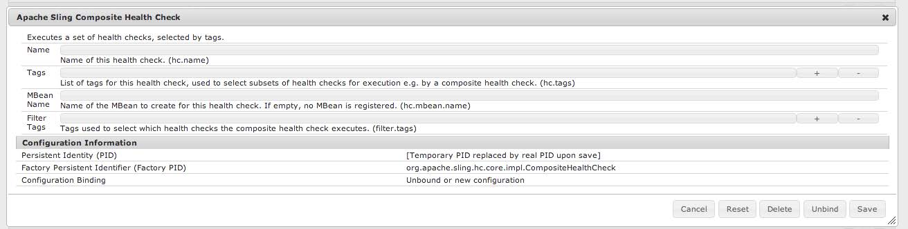
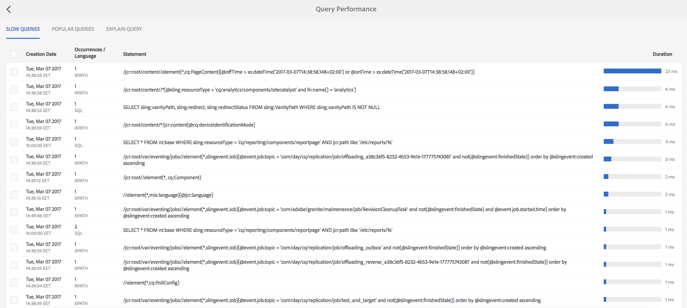

# 操作儀表板 {#operations-dashboard}

## 簡介 {#introduction}

AEM 6中的Operations Dashboard可協助系統運算子監控AEM系統運作狀況。 它還提供有關AEM相關方面的自動生成的診斷資訊，並讓您配置和運行自包含的維護自動化，以顯著減少項目操作和支援案例。 Operations Dashboard可以使用自訂的運行狀況檢查和維護任務進行擴展。 此外，Operations Dashboard資料可通過JMX從外部監控工具訪問。

**操作控制面板：**

* 是一鍵式系統狀態，可幫助運營部門提高效率
* 在單個集中位置提供系統運行狀況概觀
* 縮短尋找、分析和修正問題的時間
* 提供獨立的維護自動化，幫助顯著降低項目操作成本

您可以前往 **工具** - **操作** 從AEM歡迎畫面。

>[!NOTE]
>
>若要存取「操作控制面板」，登入的使用者必須是「運算子」使用者群組的一員。 如需詳細資訊，請參閱 [使用者、群組和存取權限管理](/help/sites-administering/user-group-ac-admin.md).

## 健全狀態報表 {#health-reports}

Health Report系統可透過Sling Health Check提供AEM例項健康狀況的相關資訊。 您需透過OSGI、JMX、HTTP要求（透過JSON）或觸控式UI來完成此作業。 它提供某些可設定計數器的測量值和臨界值，有時還提供如何解決問題的資訊。

它有幾項功能，如下所述。

## 健康狀態檢查 {#health-checks}

此 **運行狀況報告** 是指特定產品區域健康狀況良好或不良的卡片系統。 這些卡片是Sling健康狀態檢查的視覺效果，可匯總來自JMX和其他來源的資料，並再次以MBean形式公開處理的資訊。 這些MBean也可以在 [JMX Web控制台](/help/sites-administering/jmx-console.md)，在 **org.apache.sling.healthcheck** 網域。

健康狀態報告介面可透過 **工具** - **操作** - **運行狀況報告** ，或直接透過下列URL:

`https://<serveraddress>:port/libs/granite/operations/content/healthreports/healthreportlist.html`


卡系統顯示三種可能狀態： **確定**, **警告** 和 **關鍵**. 狀態是規則和臨界值的結果，您可將滑鼠游標暫留在卡片上，然後按一下動作列中的齒輪圖示來設定：


### 運行狀況檢查類型 {#health-check-types}

AEM 6中有兩種健康狀況檢查：

1. 個別健康狀況檢查
1. 複合運行狀況檢查

安 **個別健康狀況檢查** 是與狀態卡對應的單一健康狀況檢查。 可以使用規則或閾值配置單個運行狀況檢查，它們可以提供一個或多個提示和連結，以解決已識別的運行狀況問題。 以「記錄錯誤」檢查為例：如果執行個體記錄中有「錯誤」項目，請在健康狀況檢查的詳細資訊頁面上尋找。 在頁面頂端，您可以在診斷工具區段中看到「記錄訊息」分析器的連結，該連結可讓您更詳細地分析這些錯誤並重新設定記錄器。

A **複合運行狀況檢查** 是一項檢查，會從數個個別檢查中匯總資訊。

複合運行狀況檢查是使用 **篩選標籤**. 本質上，所有具有相同篩選器標籤的單一檢查都會分組為複合健康狀態檢查。 只有當聚合的所有單個檢查也具有OK狀態時，複合運行狀況檢查才會具有OK狀態。

### 如何建立運行狀況檢查 {#how-to-create-health-checks}

在「操作儀表板」中，可以直觀地顯示單個和複合運行狀況檢查的結果。

### 建立個別健康狀況檢查 {#creating-an-individual-health-check}

建立個別健康檢查涉及兩個步驟：實作Sling健康狀況檢查，並在控制面板的設定節點中新增健康狀況檢查項目。

1. 若要建立Sling健康狀況檢查，請建立實作Sling HealthCheck介面的OSGI元件。 將此元件新增至套件組合中。 元件的屬性完全標識運行狀況檢查。 安裝元件後，將自動為運行狀況檢查建立JMX MBean。 請參閱 [Sling健康狀況檢查檔案](https://sling.apache.org/documentation/bundles/sling-health-check-tool.html) 以取得更多資訊。

   以OSGI服務元件註解撰寫的Sling健康狀態檢查元件範例：

   ```java
   @Component(service = HealthCheck.class,
   property = {
       HealthCheck.NAME + "=Example Check",
       HealthCheck.TAGS + "=example",
       HealthCheck.TAGS + "=test",
       HealthCheck.MBEAN_NAME + "=exampleHealthCheckMBean"
   })
    public class ExampleHealthCheck implements HealthCheck {
       @Override
       public Result execute() {
           // health check code
       }
    }
   ```

   >[!NOTE]
   >
   >此 `MBEAN_NAME` 屬性定義為此運行狀況檢查生成的mbean的名稱。

1. 建立運行狀況檢查後，必須建立新的配置節點，以便在Operations Dashboard介面中訪問該節點。 在此步驟中，必須知道運行狀況檢查的JMX Mbean名稱( `MBEAN_NAME` 屬性)。 要建立健康檢查的配置，請開啟CRXDE並添加節點(類型 **nt：非結構化**)下方： `/apps/settings/granite/operations/hc`

   新節點上應設定下列屬性：

   * **名稱:** `sling:resourceType`

      * **類型：** `String`
      * **值:** `granite/operations/components/mbean`
   * **名稱:** `resource`

      * **類型：** `String`
      * **值:** `/system/sling/monitoring/mbeans/org/apache/sling/healthcheck/HealthCheck/exampleHealthCheck`

   >[!NOTE]
   >
   >以上資源路徑的建立方式如下：如果運行狀況檢查的mbean名稱為「test」，請將「test」添加到路徑的結尾 `/system/sling/monitoring/mbeans/org/apache/sling/healthcheck/HealthCheck`
   >
   >最後一條路是：
   >
   >`/system/sling/monitoring/mbeans/org/apache/sling/healthcheck/HealthCheck/test`

   >[!NOTE]
   >
   >請確定 `/apps/settings/granite/operations/hc` 路徑的下列屬性已設為true:
   >
   >
   >`sling:configCollectionInherit`
   >
   >`sling:configPropertyInherit`
   >
   >
   >此程式會告訴設定管理員，將新設定與現有設定合併，來自 `/libs`.

### 建立複合運行狀況檢查 {#creating-a-composite-health-check}

複合運行狀況檢查的角色是聚合多個共用一組常見功能的單個運行狀況檢查。 例如，安全複合運行狀況檢查將執行安全相關驗證的所有單個運行狀況檢查分組。 建立複合檢查的第一步是新增OSGI設定。 若要在「操作控制面板」中顯示該節點，必須以與簡單檢查相同的方式添加新配置節點。

1. 前往OSGI主控台中的Web設定管理器。 存取 `https://serveraddress:port/system/console/configMgr`
1. 搜尋名為 **Apache Sling Composite Health Check**. 找到後，請注意已有兩種設定可用：一個用於系統檢查，另一個用於安全檢查。
1. 按配置右側的「+」按鈕建立配置。 隨即出現新視窗，如下所示：

   

1. 建立設定並儲存。 使用新配置建立Mbean。

   每個設定屬性的用途如下：

   * **名稱(hc.name):** 複合運行狀況檢查的名稱。 建議使用有意義的名稱。
   * **標籤(hc.tags):** 此運行狀況檢查的標籤。 如果此複合運行狀況檢查打算成為另一個複合運行狀況檢查的一部分（例如，在運行狀況檢查的層次結構中），請添加與此複合相關的標籤。
   * **MBean名稱(hc.mbean.name):** 此複合運行狀況檢查的JMX MBean所指定的Mbean的名稱。
   * **篩選標籤(filter.tags):** 複合運行狀況檢查的特定屬性。 這些標籤會由複合項目匯總。 複合健康狀況檢查在其組下匯總所有具有任何標籤匹配此複合的任何過濾器標籤的健康狀況檢查。 例如，具有篩選標籤的複合運行狀況檢查 **測試** 和 **check**，會匯總具有任何 **測試** 和 **check** 其標籤屬性中的標籤( `hc.tags`)。

   >[!NOTE]
   >
   >系統會為Apache Sling Composite Health Check的每個新設定建立新的JMX Mbean。**

1. 最後，必須在Operations Dashboard配置節點中添加已建立的複合運行狀況檢查項。 此程式與個別健康狀況檢查相同：類型的節點 **nt：非結構化** 必須在下建立 `/apps/settings/granite/operations/hc`. 節點的資源屬性由 **hc.mean.name** （在OSGI設定中）。

   例如，如果您建立設定，並設定 **hc.mbean.name** 值 **磁碟使用情況**，則設定節點如下所示：

   * **名稱:** `Composite Health Check`

      * **類型：** `nt:unstructured`

   具有下列屬性：

   * **名稱:** `sling:resourceType`

      * **類型：** `String`
      * **值:** `granite/operations/components/mbean`
   * **名稱:** `resource`

      * **類型：** `String`
      * **值:** `/system/sling/monitoring/mbeans/org/apache/sling/healthcheck/HealthCheck/diskusage`

   >[!NOTE]
   >
   >如果您建立邏輯上屬於預設已存在於控制面板中的複合檢查下的個別健康狀況檢查，則會在相應的複合檢查下自動捕獲和分組這些檢查。 因此，不需要為這些檢查建立配置節點。
   >
   >例如，如果您建立個別安全性狀況檢查，請將「**安全**」標籤，且已安裝。 它會自動顯示在「操作控制面板」的「安全檢查」複合檢查下。

### 隨AEM提供的運行狀況檢查 {#health-checks-provided-with-aem}

<table>
 <tbody>
  <tr>
   <td><strong>zHealthcheck名稱</strong></td>
   <td><strong>說明</strong></td>
  </tr>
  <tr>
   <td>查詢效能</td>
   <td><p>此運行狀況檢查已簡化 <strong>在AEM 6.4中</strong>，現在會檢查最近重構的 <code>Oak QueryStats</code> MBean，更具體地說是 <code>SlowQueries </code>屬性。 如果統計資訊包含任何慢速查詢，則運行狀況檢查將返回警告。 否則，它會傳回OK狀態。<br /> </p> <p>此運行狀況檢查的MBean為 <a href="http://localhost:4502/system/console/jmx/org.apache.sling.healthcheck%3Aname%3DqueriesStatus%2Ctype%3DHealthCheck">org.apache.sling.healthcheck:name=querysStatus,type=HealthCheck</a>.</p> </td>
  </tr>
  <tr>
   <td>觀測佇列長度</td>
   <td><p>觀察佇列長度會反覆顯示所有事件接聽器和背景觀察器，比較它們 <code>queueSize </code>敬 <code>maxQueueSize</code> 和：</p>
    <ul>
     <li>若 <code>queueSize</code> 值超過 <code>maxQueueSize</code> 值（即捨棄事件時）</li>
     <li>若 <code>queueSize</code> 值超過 <code>maxQueueSize * WARN_THRESHOLD</code> （預設值為0.75） </li>
    </ul> <p>每個佇列的最大長度來自個別設定(Oak和AEM)，且無法透過此健康狀況檢查設定。 此運行狀況檢查的MBean為 <a href="http://localhost:4502/system/console/jmx/org.apache.sling.healthcheck%3Aname%3DObservationQueueLengthHealthCheck%2Ctype%3DHealthCheck">org.apache.sling.healthcheck:name=ObservationQueueLengthHealthCheck,type=HealthCheck</a>.</p> </td>
  </tr>
  <tr>
   <td>查詢周遊限制</td>
   <td><p>查詢遍歷限制檢查 <code>QueryEngineSettings</code> MBean，更具體地說是 <code>LimitInMemory</code> 和 <code>LimitReads</code> 屬性，並傳回下列狀態：</p>
    <ul>
     <li>如果其中一個限制等於或高於 <code>Integer.MAX_VALUE</code></li>
     <li>如果其中一個限制低於10000（來自Oak的建議設定），則會傳回「警告」狀態</li>
     <li>若 <code>QueryEngineSettings</code> 或無法擷取任何限制</li>
    </ul> <p>此運行狀況檢查的Mbean為 <a href="http://localhost:4502/system/console/jmx/org.apache.sling.healthcheck%3Aname%3DqueryTraversalLimitsBundle%2Ctype%3DHealthCheck">org.apache.sling.healthcheck:name=queryTraversalLimitsBundle,type=HealthCheck</a>.</p> </td>
  </tr>
  <tr>
   <td>已同步時鐘</td>
   <td><p>此檢查僅與 <a href="https://github.com/apache/sling-old-svn-mirror/blob/4df9ab2d6592422889c71fa13afd453a10a5a626/bundles/extensions/discovery/oak/src/main/java/org/apache/sling/discovery/oak/SynchronizedClocksHealthCheck.java">nodestore叢集</a>. 它會傳回下列狀態：</p>
    <ul>
     <li>當執行個體時鐘不同步，並超過預先定義的低臨界值時，會傳回「警告」狀態</li>
     <li>當實例時鐘不同步並超過預定義的高閾值時，返回「關鍵」狀態</li>
    </ul> <p>此運行狀況檢查的Mbean為 <a href="http://localhost:4502/system/console/jmx/org.apache.sling.healthcheck%3Aname%3DslingDiscoveryOakSynchronizedClocks%2Ctype%3DHealthCheck">org.apache.sling.healthcheck:name=slingDiscoveryOakSynchronizedClocks,type=HealthCheck</a>.</p> </td>
  </tr>
  <tr>
   <td>非同步處理索引</td>
   <td><p>非同步索引檢查：</p>
    <ul>
     <li>如果至少有一個索引通道失敗，則返回關鍵狀態</li>
     <li>檢查 <code>lastIndexedTime</code> 對於所有索引通道，
      <ul>
       <li>如果超過2小時前，則返回關鍵狀態 </li>
       <li>如果介於2小時到45分鐘前，則傳回警告狀態 </li>
       <li>如果小於45分鐘前，則返回「確定」狀態 </li>
      </ul> </li>
     <li>如果未滿足這些條件，則返回「確定」狀態</li>
    </ul> <p>「嚴重」和「警告」狀態閾值均可配置。 此運行狀況檢查的Mbean為 <a href="http://localhost:4502/system/console/jmx/org.apache.sling.healthcheck%3Aname%3DasyncIndexHealthCheck%2Ctype%3DHealthCheck">org.apache.sling.healthcheck:name=asyncIndexHealthCheck,type=HealthCheck</a>.</p> <p><strong>注意： </strong>此健康狀況檢查適用於AEM 6.4，並已支援至AEM 6.3.0.1。</p> </td>
  </tr>
  <tr>
   <td>大型 Lucene 索引</td>
   <td><p>此檢查會使用 <code>Lucene Index Statistics</code> MBean用於標識大索引並返回：</p>
    <ul>
     <li>a如果索引包含超過10億個文檔，則警告狀態</li>
     <li>a如果有15億多份檔案的索引，則處於關鍵狀態</li>
    </ul> <p>可配置閾值，健康檢查的MBean為 <a href="http://localhost:4502/system/console/jmx/org.apache.sling.healthcheck%3Aname%3DlargeIndexHealthCheck%2Ctype%3DHealthCheck">org.apache.sling.healthcheck:name=largeIndexHealthCheck,type=HealthCheck。</a></p> <p><strong>注意： </strong>此檢查適用於AEM 6.4，並已支援至AEM 6.3.2.0。</p> </td>
  </tr>
  <tr>
   <td>系統維護</td>
   <td><p>如果所有維護任務都按配置運行，則系統維護是一種複合檢查，返回「確定」。 請記住：</p>
    <ul>
     <li>每個維護任務都伴有相關的健康檢查</li>
     <li>如果未將任務添加到維護窗口，其運行狀況檢查將返回「關鍵」</li>
     <li>配置「審核日誌」和「工作流清除」維護任務，或從維護窗口中刪除它們。 如果未配置，則這些任務在第一次嘗試運行時失敗，因此系統維護檢查返回「關鍵」狀態。</li>
     <li><strong>使用AEM 6.4</strong>，也會提供 <a href="/help/sites-administering/operations-dashboard.md#automated-maintenance-tasks">Lucene二進位檔維護</a> 任務</li>
     <li>在AEM 6.2及更低版本中，系統維護檢查會在啟動後立即傳回警告狀態，因為任務從未執行。 從6.3開始，如果尚未到達第一個維護窗口，則返回OK。</li>
    </ul> <p>此運行狀況檢查的MBean為 <a href="http://localhost:4502/system/console/jmx/org.apache.sling.healthcheck%3Aname%3Dsystemchecks%2Ctype%3DHealthCheck">org.apache.sling.healthcheck:name=systemchecks,type=HealthCheck</a>.</p> </td>
  </tr>
  <tr>
   <td>復寫佇列</td>
   <td><p>此檢查會反覆執行復寫代理，並查看其佇列。 對於隊列頂端的項目，檢查會查看代理重試複製的次數。 如果代理重試的複製次數超過 <code>numberOfRetriesAllowed</code> 參數，會傳回警告。 此 <code>numberOfRetriesAllowed</code> 參數可設定。 </p> <p>此運行狀況檢查的MBean為 <a href="http://localhost:4502/system/console/jmx/org.apache.sling.healthcheck%3Aname%3DreplicationQueue%2Ctype%3DHealthCheck" target="_blank">org.apache.sling.healthcheck:name=replicationQueue,type=HealthCheck</a>.</p> </td>
  </tr>
  <tr>
   <td>Sling 工作</td>
   <td>
    <div>
      Sling作業會檢查JobManager中排入佇列的作業數，並與
     <code>maxNumQueueJobs</code> 閾值和：
    </div>
    <ul>
     <li>如果超過 <code>maxNumQueueJobs</code> 在佇列中</li>
     <li>如果運行時間長於1小時的活動作業已過，則返回關鍵</li>
     <li>如果有已排入佇列的作業，且上次完成的作業時間超過1小時，則傳回關鍵</li>
    </ul> <p>只能配置隊列作業參數的最大數，其預設值為1000。</p> <p>此運行狀況檢查的MBean為 <a href="http://localhost:4502/system/console/jmx/org.apache.sling.healthcheck%3Aname%3DslingJobs%2Ctype%3DHealthCheck" target="_blank">org.apache.sling.healthcheck:name=slingJobs,type=HealthCheck</a>.</p> </td>
  </tr>
  <tr>
   <td>請求效能</td>
   <td><p>此檢查會查看 <code>granite.request.metrics.timer</code> <a href="http://localhost:4502/system/console/slingmetrics" target="_blank">Sling量度 </a>和：</p>
    <ul>
     <li>如果第75個百分位數值超過臨界臨界臨界值（預設值為500毫秒），則傳回臨界值</li>
     <li>如果第75個百分位數值超過警告臨界值（預設值為200毫秒），則傳回警告</li>
    </ul> <p>此運行狀況檢查的MBean為<em> </em><a href="http://localhost:4502/system/console/jmx/org.apache.sling.healthcheck%3Aname%3DrequestsStatus%2Ctype%3DHealthCheck" target="_blank">org.apache.sling.healthcheck:name=requestsStatus,type=HealthCheck</a>.</p> </td>
  </tr>
  <tr>
   <td>日誌錯誤</td>
   <td><p>如果日誌中存在錯誤，此檢查將返回「警告」狀態。</p> <p>此運行狀況檢查的MBean為 <a href="http://localhost:4502/system/console/jmx/org.apache.sling.healthcheck%3Aname%3DlogErrorHealthCheck%2Ctype%3DHealthCheck" target="_blank">org.apache.sling.healthcheck:name=logErrorHealthCheck,type=HealthCheck</a>.</p> </td>
  </tr>
  <tr>
   <td>磁碟空間</td>
   <td><p>磁碟空間檢查將查看 <code>FileStoreStats</code> MBean，檢索節點儲存區的大小和節點儲存區分區上的可用磁碟空間量，並：</p>
    <ul>
     <li>如果可用磁碟空間與儲存庫大小比小於警告閾值（預設值為10），則返回警告</li>
     <li>如果可用磁碟空間與儲存庫大小比小於臨界閾值（預設值為2），則返回臨界值</li>
    </ul> <p>兩個閾值都可配置。 此檢查僅適用於區段存放區的例項。</p> <p>此運行狀況檢查的MBean為 <a href="http://localhost:4502/system/console/jmx/org.apache.sling.healthcheck%3Aname%3DDiskSpaceHealthCheck%2Ctype%3DHealthCheck" target="_blank">org.apache.sling.healthcheck:name=DiskSpaceHealthCheck,type=HealthCheck</a>.</p> </td>
  </tr>
  <tr>
   <td>排程器健康情況檢查</td>
   <td><p>如果執行個體的Quartz作業執行超過60秒，此檢查會傳回警告。 可接受的持續時間臨界值是可設定的。</p> <p>此運行狀況檢查的MBean為 <a href="http://localhost:4502/system/console/jmx/org.apache.sling.healthcheck%3Aname%3DslingCommonsSchedulerHealthCheck%2Ctype%3DHealthCheck" target="_blank">org.apache.sling.healthcheck:name=slingCommonsSchedulerHealthCheck,type=HealthCheck</a><em>.</em></p> </td>
  </tr>
  <tr>
   <td>安全性檢查</td>
   <td><p>安全性檢查是組合，可匯總多個安全性相關檢查的結果。 這些個別健康狀況檢查可解決與 <a href="/help/sites-administering/security-checklist.md">安全性檢查清單檔案頁面。</a> 該檢查在啟動實例時作為安全煙霧測試很有用。 </p> <p>此運行狀況檢查的MBean為 <a href="http://localhost:4502/system/console/jmx/org.apache.sling.healthcheck%3Aname%3Dsecuritychecks%2Ctype%3DHealthCheck" target="_blank">org.apache.sling.healthcheck:name=securitychecks,type=HealthCheck</a></p> </td>
  </tr>
  <tr>
   <td>作用中組合</td>
   <td><p>活動包檢查所有包的狀態，並：</p>
    <ul>
     <li>如果任何套件組合不活動或（開始時為延遲啟動），則會傳回「警告」狀態</li>
     <li>它會忽略忽略清單中包的狀態</li>
    </ul> <p>可配置忽略清單參數。</p> <p>此運行狀況檢查的MBean為 <a href="http://localhost:4502/system/console/jmx/org.apache.sling.healthcheck%3Aname%3DinactiveBundles%2Ctype%3DHealthCheck" target="_blank">org.apache.sling.healthcheck:name=inactiveBundles,type=HealthCheck</a>.</p> </td>
  </tr>
  <tr>
   <td>代碼快取檢查</td>
   <td><p>「運行狀況檢查」將驗證多個JVM條件，這些條件可以觸發Java™ 7中存在的CodeCache錯誤：</p>
    <ul>
     <li>如果執行個體在Java™ 7上執行，且已啟用程式碼快取排清，則會傳回警告</li>
     <li>如果執行個體在Java™ 7上執行，且保留程式碼快取大小小於最小臨界值（預設值為90 MB），則會傳回警告</li>
    </ul> <p>此 <code>minimum.code.cache.size</code> 可設定臨界值。 如需有關錯誤的詳細資訊，請參閱 <a href="https://bugs.java.com/bugdatabase/"> 然後搜尋錯誤ID 8012547</a>.</p> <p>此運行狀況檢查的MBean為 <a href="http://localhost:4502/system/console/jmx/org.apache.sling.healthcheck%3Aname%3DcodeCacheHealthCheck%2Ctype%3DHealthCheck" target="_blank">org.apache.sling.healthcheck:name=codeCacheHealthCheck,type=HealthCheck</a>.</p> </td>
  </tr>
  <tr>
   <td>資源搜尋路徑錯誤</td>
   <td><p>檢查路徑中是否有任何資源 <code>/apps/foundation/components/primary</code> 和：</p>
    <ul>
     <li>傳回警告，如果有子節點在下 <code>/apps/foundation/components/primary</code></li>
    </ul> <p>此運行狀況檢查的MBean為 <a href="http://localhost:4502/system/console/jmx/org.apache.sling.healthcheck%3Aname%3DresourceSearchPathErrorHealthCheck%2Ctype%3DHealthCheck" target="_blank">org.apache.sling.healthcheck:name=resourceSearchPathErrorHealthCheck,type=HealthCheck</a>.</p> </td>
  </tr>
 </tbody>
</table>

### 運行狀況檢查配置 {#health-check-configuration}

依預設，對於現成的AEM例項，健康狀態檢查每60秒執行一次。

您可以設定 **時段** 和 [OSGi配置](/help/sites-deploying/configuring-osgi.md) **查詢運行狀況檢查配置** (com.adobe.granite.queries.impl.hc.QueryHealthCheckMetrics)。

## 使用Nagios進行監控 {#monitoring-with-nagios}

健康狀況檢查控制面板可以透過Granite JMX Mbeans與Nagios整合。 以下範例說明如何新增檢查，以顯示執行AEM之伺服器上已使用的記憶體。

1. 在監控伺服器上設定和安裝Nagios。
1. 接下來，安裝Nagios Remote Plugin Executor(NRPE)。

   >[!NOTE]
   >
   >有關如何在系統上安裝Nagios和NRPE的詳細資訊，請參閱 [Nagios檔案](https://library.nagios.com/library/products/nagios-core/manuals//).

1. 為AEM伺服器新增主機定義。 您可以透過Nagios XI Web介面，使用Configuration Manager來完成此工作：

   1. 開啟瀏覽器並指向Nagios伺服器。
   1. 按下 **設定** 按鈕。
   1. 在左窗格中，按 **核心設定管理員** 在 **進階設定**.
   1. 按下 **主機** 連結 **監控** 區段。
   1. 添加主機定義：

   

   以下是主機設定檔案的範例，若您使用Nagios Core:

   ```xml
   define host {
      address 192.168.0.5
      max_check_attempts 3
      check_period 24x7
      check-command check-host-alive
      contacts admin
      notification_interval 60
      notification_period 24x7
   }
   ```

1. 在AEM伺服器上安裝Nagios和NRPE。
1. 安裝 [check_http_json](https://github.com/phrawzty/check_http_json) 外掛程式。
1. 在兩台伺服器上定義一般JSON檢查命令：

   ```xml
   define command{
   
       command_name    check_http_json-int
   
       command_line    /usr/lib/nagios/plugins/check_http_json --user "$ARG1$" --pass "$ARG2$" -u 'https://$HOSTNAME$:$ARG3$/$ARG4$' -e '$ARG5$' -w '$ARG6$' -c '$ARG7$'
   
   }
   ```

1. 為AEM伺服器上的已用記憶體新增服務：

   ```xml
   define service {
   
       use generic-service
   
       host_name my.remote.host
   
       service_description AEM Author Used Memory
   
       check_command  check_http_json-int!<cq-user>!<cq-password>!<cq-port>!system/sling/monitoring/mbeans/java/lang/Memory.infinity.json!{noname}.mbean:attributes.HeapMemoryUsage.mbean:attributes.used.mbean:value!<warn-threshold-in-bytes>!<critical-threshold-in-bytes>
   
       }
   ```

1. 檢查Nagios控制面板，以取得新建立的服務：

   

## 診斷工具 {#diagnosis-tools}

操作儀表板還提供對診斷工具的訪問，這些工具可以幫助查找和排除來自運行狀況檢查儀表板的警告的根本原因，並為系統操作員提供重要的調試資訊。

其最重要的功能包括：

* 日誌消息分析器
* 訪問堆和線程轉儲的功能
* 請求和查詢效能分析器

前往「 **工具 — 操作 — 診斷** 從AEM歡迎畫面。 您也可以直接存取下列URL來存取畫面： `https://serveraddress:port/libs/granite/operations/content/diagnosis.html`


### 記錄訊息 {#log-messages}

日誌消息用戶介面預設顯示所有ERROR消息。 如果要顯示更多日誌消息，請使用相應的日誌級別配置記錄器。

記錄訊息會使用記憶體記錄中的附加程式，因此與記錄檔無關。 另一個結果是，更改此UI中的日誌級別不會更改傳統日誌檔案中記錄的資訊。 在此UI中新增和移除記錄器只會影響記憶體記錄器。 此外，更改記錄器配置將反映在記憶體記錄器的未來。 已記錄且不再相關的項目不會刪除，但類似的項目將來不會記錄。

您可以從UI的左上角齒輪按鈕提供記錄器設定，以設定記錄內容。 您可以在此添加、刪除或更新記錄器配置。 記錄器配置由 **記錄層級** （警告/資訊/除錯）和 **篩選器名稱**. 此 **篩選器名稱** 具有篩選日誌消息源的角色。 或者，如果記錄器應捕獲指定級別的所有日誌消息，則篩選器名稱應為「**根**」。 設定記錄器的級別會觸發所有消息的捕獲，級別等於或高於指定的級別。

範例：

* 如果您打算擷取 **錯誤** messages — 不需要設定。 預設會擷取所有ERROR訊息。
* 如果您打算擷取 **錯誤**, **警告** 和 **資訊** messages — 記錄器名稱應設為：&quot;**根**「」，並將記錄器級別設定為： **資訊**.

* 如果您打算擷取來自特定套件（例如com.adobe.granite）的所有訊息，記錄器名稱應設為：&quot;com.adobe.granite&quot;。 而記錄器層級則設為： **除錯** (這樣會擷取 **錯誤**, **警告**, **資訊**，和 **除錯** 訊息)，如下圖所示。


>[!NOTE]
>
>您無法設定記錄器名稱以透過指定的篩選器僅擷取ERROR訊息。 預設情況下，將捕獲所有ERROR消息。

>[!NOTE]
>
>日誌消息用戶介面未反映實際錯誤日誌。 除非您在UI中設定其他類型的記錄訊息，否則只會看到錯誤訊息。 有關如何顯示特定日誌消息的資訊，請參閱上述說明。

>[!NOTE]
>
>診斷頁面中的設定不會影響記錄到記錄檔的內容，反之亦然。 因此，雖然錯誤記錄可能會擷取INFO訊息，但您可能不會在記錄訊息UI中看見。 此外，透過UI，可從特定套件擷取DEBUG訊息，而不會影響錯誤記錄。 如需如何設定記錄檔的詳細資訊，請參閱 [記錄](/help/sites-deploying/configure-logging.md).

>[!NOTE]
>
>**使用AEM 6.4**，則維護工作會以「資訊」層級的更豐富格式，立即登出。 此工作流程可讓您更清楚掌握維護任務的狀態。
>
>如果您使用第三方工具（如Splunk）來監視和響應維護任務活動，則可以使用以下日誌陳述式：

```
Log level: INFO
DATE+TIME [MaintanceLogger] Name=<MT_NAME>, Status=<MT_STATUS>, Time=<MT_TIME>, Error=<MT_ERROR>, Details=<MT_DETAILS>
```

### 請求效能 {#request-performance}

「請求效能」頁面可讓您分析處理的最慢頁面請求。 本頁面僅註冊內容請求。 更具體來說，會擷取下列請求：

1. 請求訪問 `/content`
1. 請求訪問 `/etc/design`
1. 請求具有 `".html"` 擴充功能


頁面隨即顯示：

* 提出請求的時間
* URL和要求方法
* 持續時間（毫秒）

依預設，系統會擷取最慢的20個頁面請求，但您可以在Configuration Manager中修改限制。

### 查詢效能 {#query-performance}

「查詢效能」頁允許分析系統執行的最慢查詢。 此資訊由JMX Mbean中的儲存庫提供。 在傑克拉布比， `com.adobe.granite.QueryStat` JMX Mbean提供此資訊，而在Oak存放庫中則提供 `org.apache.jackrabbit.oak.QueryStats.`

頁面隨即顯示：

* 進行查詢的時間
* 查詢的語言
* 發出查詢的次數
* 查詢的語句
* 持續時間（毫秒）



### 說明查詢 {#explain-query}

針對任何指定查詢，Oak會根據存放庫底下的Oak索引，嘗試找出執行的最佳方式 **oak:index** 節點。 Oak可能會根據查詢選擇不同的索引。 了解Oak如何執行查詢，是最佳化查詢的第一步。

Explain Query是說明Oak如何執行查詢的工具。 您可以前往 **工具 — 操作 — 診斷** 從AEM歡迎畫面。 然後，按一下 **查詢效能** 然後切換到 **說明查詢** 標籤。

**功能**

* 支援Xpath、JCR-SQL和JCR-SQL2查詢語言
* 報告提供的查詢的實際執行時間
* 檢測慢速查詢並警告可能慢速的查詢
* 報告用來執行查詢的Oak索引
* 顯示實際Oak查詢引擎說明
* 提供「慢速」和「熱門」查詢的點按載入清單

在「說明查詢」UI中後，輸入查詢，然後按 **說明** 按鈕：


「查詢說明」部分中的第一個條目是實際說明。 說明顯示用於執行查詢的索引類型。

第二項是執行計畫。

滴答聲 **包括執行時間** 框，則運行查詢時還會顯示查詢的運行時間。 此 **包含節點計數** 選項會報告節點計數。 報表可讓您取得可用來最佳化應用程式或部署之索引的詳細資訊。


### 索引管理器 {#the-index-manager}

「索引管理器」的目的是促進索引管理，例如維護索引或查看其狀態。

可從歡迎螢幕前**Tools - Operations - Diagnosis **訪問它，然後按一下 **索引管理器** 按鈕。

您也可以直接透過此URL存取： `https://serveraddress:port/libs/granite/operations/content/diagnosistools/indexManager.html`


UI可用來篩選表格中的索引，方法是在螢幕左上角的搜尋方塊中輸入篩選條件。

### 下載狀態ZIP {#download-status-zip}

此動作會觸發下載包含系統狀態和設定之實用資訊的zip。 封存包含執行個體設定、套件組合清單、OSGI、Sling量度和統計資料，可能會產生大型檔案。 您可以使用 **下載狀態ZIP**&#x200B;窗口。 該窗口可從以下位置訪問：**AEM >工具>操作>診斷>下載狀態ZIP。**

在此窗口中，您可以選擇要導出的內容（日誌檔案和線程轉儲）以及下載中包含的相對於當前日期的日誌天數。


### 下載線程轉儲 {#download-thread-dump}

此動作會觸發下載包含系統中執行緒相關資訊的zip。 提供了有關每個線程的資訊，如其狀態、類載入器和堆棧跟蹤。

### 下載堆轉儲 {#download-heap-dump}

您可以下載堆的快照，以便稍後進行分析。 此動作會觸發下載大型（數百兆位元組）檔案。

## 自動維護任務 {#automated-maintenance-tasks}

「自動維護任務」頁是一個位置，您可以在其中查看和跟蹤計畫定期執行的建議維護任務。 這些任務與運行狀況檢查系統整合。 也可以從介面手動執行任務。

若要前往Operations Dashboard中的維護頁面，請從AEM歡迎畫面，前往 **工具 — 操作 — 儀表板 — 維護**，或直接遵循此連結：

`https://serveraddress:port/libs/granite/operations/content/maintenance.html`

操作儀表板中提供以下任務：

1. 此 **修訂清除**&#x200B;任務，位於 **每日維護窗口** 功能表。
1. 此 **Lucene二進位檔清除** 任務，位於 **每日維護窗口** 功能表。
1. 此 **工作流清除** 任務，位於 **每週維護窗口** 功能表。
1. 此 **資料儲存垃圾收集** 任務，位於 **每週維護窗口** 功能表。
1. 此 **審核日誌維護** 任務，位於 **每週維護窗口** 功能表。
1. 此 **版本清除維護** 任務，位於 **每週維護窗口** 功能表。

每日維護窗口的預設時間是凌晨2:00到凌晨5:00。在星期六的早上1:00到凌晨2:00之間，配置為在每週維護窗口中運行的任務將運行在每週維護窗口中。

您也可以按兩張維護卡上的齒輪圖示來設定計時：


>[!NOTE]
>
>自AEM 6.1起，現有的維護視窗也可設定為每月執行。

### 修訂清理 {#revision-clean-up}

有關執行修訂清除的詳細資訊， [請參閱這篇專屬文章](/help/sites-deploying/revision-cleanup.md).

### Lucene 二進位清理 {#lucene-binaries-cleanup}

使用Lucene二進位檔清除任務，可以清除lucene二進位檔，並降低執行中的資料存放區大小需求。 Lucene的二進位流失率會每天回收，而非先前依賴成功 [資料儲存垃圾收集](/help/sites-administering/data-store-garbage-collection.md) 執行。

雖然維護任務是為了減少Lucene相關修訂垃圾，但在運行任務時，總體效率有所提高：

* 資料儲存垃圾收集任務的每週運行可以更快完成。
* 這也可能會稍微改善整體AEM效能。

您可以從以下位置訪問Lucene二進位檔清除任務： **「AEM >工具>操作>維護>每日維護視窗> Lucene二進位檔清除」**.

### 資料存放庫廢棄項目收集 {#data-store-garbage-collection}

有關資料儲存垃圾收集的詳細資訊，請參閱 [檔案頁面](/help/sites-administering/data-store-garbage-collection.md).

### 工作流清除 {#workflow-purge}

您也可以從維護控制面板清除工作流程。 要運行「工作流清除」任務，請執行以下操作：

1. 按一下 **每週維護窗口** 頁面。
1. 在下一頁，按一下 **播放** 在 **工作流清除** 卡片。

>[!NOTE]
>
>如需有關工作流程維護的詳細資訊，請參閱 [本頁](/help/sites-administering/workflows-administering.md#regular-purging-of-workflow-instances).

### 審核日誌維護 {#audit-log-maintenance}

如需稽核記錄維護，請參閱 [獨立的檔案頁面。](/help/sites-administering/operations-audit-log.md)

### 版本清除 {#version-purge}

您可以安排「版本清除」維護任務以自動刪除舊版本。 此動作可將手動使用 [版本清除工具](/help/sites-deploying/version-purging.md). 您可以通過訪問 **「工具」>「操作」>「維護」>「每週維護」窗口** 並遵循下列步驟：

1. 按一下 **新增**.
1. 選擇 **版本清除** 從下拉式功能表。

   

1. 要配置「版本清除」任務，請按一下 **齒輪** 表徵圖。

   

**使用AEM 6.4**，您可以按如下方式停止「版本清除」維護任務：

* 自動 — 如果計畫維護窗口在任務完成之前關閉，則任務會自動停止。 下次維護視窗開啟時，就會繼續。
* 手動 — 要手動停止任務，請在「版本清除」維護卡上按一下 **停止** 表徵圖。 在下次執行時，該任務將安全地恢復。

>[!NOTE]
>
>停止維護任務意味著掛起其運行，並且不丟失已在進行中的作業的跟蹤。

>[!CAUTION]
>
>要優化應經常運行版本清除任務的儲存庫大小。 當流量有限時，應在工作時間之外排程該任務。

## 自定義維護任務 {#custom-maintenance-tasks}

自訂維護任務可以作為OSGi服務實施。 由於維護任務基礎架構以Apache Sling的作業處理為基礎，因此維護任務必須實作Java™介面 ` [org.apache.sling.event.jobs.consumer.JobExecutor](https://sling.apache.org/apidocs/sling7/org/apache/sling/event/jobs/consumer/JobExecutor.html)`. 此外，它必須聲明要檢測為維護任務的多個服務註冊屬性，如下所示：

<table>
 <tbody>
  <tr>
   <td><strong>服務屬性名稱</strong><br /> </td>
   <td><strong>說明</strong></td>
   <td><strong>範例</strong><br /> </td>
   <td><strong>類型</strong></td>
  </tr>
  <tr>
   <td>granite.maintenance.isStoppable</td>
   <td>布林屬性，定義用戶是否可以停止任務。 如果任務聲明其可停止，則必須在運行期間檢查其是否已停止，然後採取相應行動。 預設值為false。</td>
   <td>true</td>
   <td>選用</td>
  </tr>
  <tr>
   <td>granite.maintenance.mandatory</td>
   <td>布林屬性，定義任務是否為強制任務且必須定期運行。 如果任務是強制任務，但當前不在任何活動計畫窗口中，運行狀況檢查將報告此錯誤。 預設值為false。</td>
   <td>true</td>
   <td>選用</td>
  </tr>
  <tr>
   <td>granite.maintenance.name</td>
   <td>任務的唯一名稱 — 該名稱用於引用任務，而且只是一個簡單名稱。</td>
   <td>MyMaintenanceTask</td>
   <td>必要</td>
  </tr>
  <tr>
   <td>granite.maintenance.title</td>
   <td>為此任務顯示的標題</td>
   <td>我的特殊維護任務</td>
   <td>必要</td>
  </tr>
  <tr>
   <td>job.topics</td>
   <td>維護任務的唯一主題。<br /> Apache Sling作業處理會啟動一個與此主題完全相同的作業，以執行維護任務，並在為此主題註冊任務時，就會執行該任務。<br /> 主題的開頭必須為 <i>com/adobe/granite/maintenance/job/</i></td>
   <td>com/adobe/granite/maintenance/job/MyMaintenanceTask</td>
   <td>必要</td>
  </tr>
 </tbody>
</table>

除上述服務屬性外， `process()` 方法 `JobConsumer` 必須新增應為維護任務執行的程式碼來實作介面。 提供的 `JobExecutionContext` 可用於輸出狀態資訊、檢查用戶是否停止了作業並建立結果（成功或失敗）。

對於維護任務不應在所有安裝上運行的情況（例如，僅在發佈實例上運行），可以通過添加使服務需要配置處於活動狀態 `@Component(policy=ConfigurationPolicy.REQUIRE)`. 然後，您可以根據儲存庫中的設定，將標示為執行模式。 如需詳細資訊，請參閱 [配置OSGi](/help/sites-deploying/configuring-osgi.md#creating-the-configuration-in-the-repository).

以下是自定義維護任務的示例，該任務從過去24小時內修改的可配置臨時目錄中刪除檔案：

src/main/java/com/adobe/granite/samples/maintenance/impl/DeleteTempFilesTask.java

<table>
 <tbody>
  <tr>
   <td><p> </p> <p><code>/*</code></p> <p><code> * #%L</code></p> <p><code> * sample-maintenance-task</code></p> <p><code> * %%</code></p> <p><code> * Copyright (C) 2014 Adobe</code></p> <p><code> * %%</code></p> <p><code> * Licensed under the Apache License, Version 2.0 (the "License");</code></p> <p><code> * you may not use this file except in compliance with the License.</code></p> <p><code> * You may obtain a copy of the License at</code></p> <p><code> * </code></p> <p><code> * <a href="https://www.apache.org/licenses/LICENSE-2.0">https://www.apache.org/licenses/LICENSE-2.0</a></code></p> <p><code> * </code></p> <p><code> * Unless required by applicable law or agreed to in writing, software</code></p> <p><code> * distributed under the License is distributed on an "AS IS" BASIS,</code></p> <p><code> * WITHOUT WARRANTIES OR CONDITIONS OF ANY KIND, either express or implied.</code></p> <p><code> * See the License for the specific language governing permissions and</code></p> <p><code> * limitations under the License.</code></p> <p><code> * #L%</code></p> <p><code> */</code></p> <p><code> </code></p> <p><code>package com.adobe.granite.samples.maintenance.impl;</code></p> <p><code> </code></p> <p><code>import java.io.File;</code></p> <p><code>import java.util.Calendar;</code></p> <p><code>import java.util.Collection;</code></p> <p><code>import java.util.Map;</code></p> <p><code> </code></p> <p><code>import org.apache.commons.io.FileUtils;</code></p> <p><code>import org.apache.commons.io.filefilter.IOFileFilter;</code></p> <p><code>import org.apache.commons.io.filefilter.TrueFileFilter;</code></p> <p><code>import org.apache.felix.scr.annotations.Activate;</code></p> <p><code>import org.apache.felix.scr.annotations.Component;</code></p> <p><code>import org.apache.felix.scr.annotations.Properties;</code></p> <p><code>import org.apache.felix.scr.annotations.Property;</code></p> <p><code>import org.apache.felix.scr.annotations.Service;</code></p> <p><code>import org.apache.sling.commons.osgi.PropertiesUtil;</code></p> <p><code>import org.apache.sling.event.jobs.Job;</code></p> <p><code>import org.apache.sling.event.jobs.consumer.JobConsumer;</code></p> <p><code>import org.apache.sling.event.jobs.consumer.JobExecutionContext;</code></p> <p><code>import org.apache.sling.event.jobs.consumer.JobExecutionResult;</code></p> <p><code>import org.apache.sling.event.jobs.consumer.JobExecutor;</code></p> <p><code>import org.slf4j.Logger;</code></p> <p><code>import org.slf4j.LoggerFactory;</code></p> <p><code> </code></p> <p><code>import com.adobe.granite.maintenance.MaintenanceConstants;</code></p> <p><code> </code></p> <p><code>@Component(metatype = true,</code></p> <p><code> label = "Delete Temp Files Maintenance Task",</code></p> <p><code> description = "Maintatence Task which deletes files from a configurable temporary directory which have been modified in the last 24 hours.")</code></p> <p><code>@Service</code></p> <p><code>@Properties({</code></p> <p><code> @Property(name = MaintenanceConstants.PROPERTY_TASK_NAME, value = "DeleteTempFilesTask", propertyPrivate = true),</code></p> <p><code> @Property(name = MaintenanceConstants.PROPERTY_TASK_TITLE, value = "Delete Temp Files", propertyPrivate = true),</code></p> <p><code> @Property(name = JobConsumer.PROPERTY_TOPICS, value = MaintenanceConstants.TASK_TOPIC_PREFIX</code></p> <p><code> + "DeleteTempFilesTask", propertyPrivate = true) })</code></p> <p><code>public class DeleteTempFilesTask implements JobExecutor {</code></p> <p><code> </code></p> <p><code> private static final Logger log = LoggerFactory.getLogger(DeleteTempFilesTask.class);</code></p> <p><code> </code></p> <p><code> @Property(label = "Temporary Directory", description="Temporary Directory. Defaults to the java.io.tmpdir system property.")</code></p> <p><code> private static final String PROP_TEMP_DIR = "temp.dir";</code></p> <p><code> </code></p> <p><code> private File tempDir;</code></p> <p><code> </code></p> <p><code> @Activate</code></p> <p><code> private void activate(Map&lt;string, object=""&gt; properties) {</code></p> <p><code> this.tempDir = new File(PropertiesUtil.toString(properties.get(PROP_TEMP_DIR),</code></p> <p><code> System.getProperty("java.io.tmpdir")));</code></p> <p><code> }</code></p> <p><code> </code></p> <p><code> @Override</code></p> <p><code> public JobExecutionResult process(Job job, JobExecutionContext context) {</code></p> <p><code> log.info("Deleting old temp files from {}.", tempDir.getAbsolutePath());</code></p> <p><code> Collection&lt;file&gt; files = FileUtils.listFiles(tempDir, new LastModifiedBeforeYesterdayFilter(),</code></p> <p><code> TrueFileFilter.INSTANCE);</code></p> <p><code> int counter = 0;</code></p> <p><code> for (File file : files) {</code></p> <p><code> log.debug("Deleting file {}.", file.getAbsolutePath());</code></p> <p><code> counter++;</code></p> <p><code> file.delete();</code></p> <p><code> // TODO - capture the output of delete() and do something useful with it</code></p> <p><code> }</code></p> <p><code> return context.result().message(String.format("Deleted %s files.", counter)).succeeded();</code></p> <p><code> }</code></p> <p><code> </code></p> <p><code> /**</code></p> <p><code> * IOFileFilter which filters out files which have been modified in the last 24 hours.</code></p> <p><code> *</code></p> <p><code> */</code></p> <p><code> private static class LastModifiedBeforeYesterdayFilter implements IOFileFilter {</code></p> <p><code> </code></p> <p><code> private final long minTime;</code></p> <p><code> </code></p> <p><code> private LastModifiedBeforeYesterdayFilter() {</code></p> <p><code> Calendar cal = Calendar.getInstance();</code></p> <p><code> cal.add(Calendar.DATE, -1);</code></p> <p><code> this.minTime = cal.getTimeInMillis();</code></p> <p><code> }</code></p> <p><code> </code></p> <p><code> @Override</code></p> <p><code> public boolean accept(File dir, String name) {</code></p> <p><code> // this method is never actually called.</code></p> <p><code> return false;</code></p> <p><code> }</code></p> <p><code> </code></p> <p><code> @Override</code></p> <p><code> public boolean accept(File file) {</code></p> <p><code> return file.lastModified() <= this.minTime;</code></p> <p><code> }</code></p> <p><code> }</code></p> <p><code> </code></p> <p><code>}</code></p> <p><code>&lt;file&gt;&lt;/string,&gt;</code></p> <p> </p> </td>
  </tr>
 </tbody>
</table>

[experiencemanager-java-maintenancetask-sample](https://github.com/Adobe-Marketing-Cloud/experiencemanager-java-maintenancetask-sample)- [src/main/java/com/adobe/granite/samples/maintenance/impl/DeleteTempFilesTask.java](https://github.com/Adobe-Marketing-Cloud/experiencemanager-java-maintenancetask-sample/blob/master/src/main/java/com/adobe/granite/samples/maintenance/impl/DeleteTempFilesTask.java)

服務部署後，會公開給Operations Dashboard UI。 您可以將其新增至其中一個可用的維護排程：


此動作會在/apps/granite/operations/config/maintenance/新增對應的資源`schedule`/`taskname`. 如果任務與運行模式相關，則必須在該節點上設定granite.operations.conditions.runmode屬性，且運行模式的值必須對此維護任務處於活動狀態。

## 系統綜覽 {#system-overview}

此 **系統概述控制面板** 顯示AEM例項的設定、硬體和運作狀況的概觀。 系統運行狀況狀態是透明的，並且所有資訊都匯總到單個儀表板中。

>[!NOTE]
>
>您也可以 [觀看此視頻](https://video.tv.adobe.com/v/21340) 以了解「系統概述控制面板」的簡介。

### 如何存取 {#how-to-access}

若要存取「系統概述控制面板」，請導覽至 **「工具」>「操作」>「系統概述」**.


### 系統概述儀表板說明 {#system-overview-dashboard-explained}

下表說明了「系統概述控制面板」中顯示的所有資訊。 當沒有要顯示的相關資訊時（例如，備份未進行，沒有重要的運行狀況檢查），相應的部分將顯示「無條目」消息。

您也可以下載 `JSON` 檔案，按一下 **下載** 按鈕。 此 `JSON` 端點為 `/libs/granite/operations/content/systemoverview/export.json` 它可用於 `curl` 外部監視的指令碼。

<table>
 <tbody>
  <tr>
   <td><strong>章節</strong></td>
   <td><strong>顯示的資訊</strong></td>
   <td><strong>什麼時候重要</strong></td>
   <td><strong>連結至</strong></td>
  </tr>
  <tr>
   <td>健康狀態檢查</td>
   <td>
    <ul>
     <li>處於「關鍵」狀態的檢查清單</li>
     <li>處於「警告」狀態的檢查清單</li>
    </ul> </td>
   <td>視覺上表示：<br />
    <ul>
     <li>關鍵檢查的紅色標籤</li>
     <li>警告檢查的橙色標籤</li>
    </ul> </td>
   <td>
    <ul>
     <li>運行狀況報告頁</li>
    </ul> </td>
  </tr>
  <tr>
   <td>維護任務</td>
   <td>
    <ul>
     <li>失敗的任務清單</li>
     <li>當前正在運行的任務清單</li>
     <li>上次運行成功的任務清單</li>
     <li>從未運行的任務清單</li>
     <li>未排程的任務清單</li>
    </ul> </td>
   <td><p>視覺上表示：</p>
    <ul>
     <li>失敗任務的紅色標籤</li>
     <li>橘色標籤，用於執行任務（因可能影響效能）</li>
     <li>其他每個狀態的灰色標籤</li>
    </ul> </td>
   <td>
    <ul>
     <li>維護任務頁</li>
    </ul> </td>
  </tr>
  <tr>
   <td>系統</td>
   <td>
    <ul>
     <li>作業系統和作業系統版本(例如macOS X)</li>
     <li>系統負載平均，從 <a href="https://docs.oracle.com/javase/8/docs/api/java/lang/management/OperatingSystemMXBean.html#getSystemLoadAverage--">作業系統MXBeanusable</a></li>
     <li>磁碟空間（位於主目錄所在的分區上）</li>
     <li>最大堆，由返回 <a href="https://docs.oracle.com/javase/8/docs/api/java/lang/management/MemoryMXBean.html#getHeapMemoryUsage--">MemoryMXBean</a></li>
    </ul> </td>
   <td>N/A</td>
   <td>N/A</td>
  </tr>
  <tr>
   <td>執行個體</td>
   <td>
    <ul>
     <li>AEM版本</li>
     <li>運行模式清單</li>
     <li>執行個體的啟動日期</li>
    </ul> </td>
   <td>N/A</td>
   <td>N/A</td>
  </tr>
  <tr>
   <td>存放庫</td>
   <td>
    <ul>
     <li>oak版本</li>
     <li>節點儲存的類型（段Tar或文檔）
      <ul>
       <li>如果類型為文檔，則顯示文檔儲存的類型（RDB或Mongo）</li>
      </ul> </li>
     <li>如果有自訂資料存放區：
      <ul>
       <li>對於檔案資料儲存，會顯示路徑</li>
       <li>對於S3資料存放區，會顯示S3儲存貯體的名稱</li>
       <li>對於共用的S3資料存放區，會顯示S3儲存貯體的名稱</li>
       <li>對於Azure資料儲存區，會顯示容器</li>
      </ul> </li>
     <li>如果沒有自訂外部資料存放區，則會顯示指出此事實的訊息</li>
    </ul> </td>
   <td>N/A</td>
   <td>N/A</td>
  </tr>
  <tr>
   <td>發佈代理程式</td>
   <td>
    <ul>
     <li>具有被阻止隊列的代理清單</li>
     <li>未配置代理的清單（「配置錯誤」）</li>
     <li>已暫停隊列處理的代理清單</li>
     <li>空閒代理的清單</li>
     <li>運行代理的清單（當前正在處理條目）</li>
    </ul> </td>
   <td><p>視覺上表示：</p>
    <ul>
     <li>被阻止的代理或配置錯誤的紅色標籤</li>
     <li>已暫停的代理的橙色標籤</li>
     <li>已暫停、空閒或正在運行的代理的灰色標籤<br /> </li>
    </ul> </td>
   <td>分送頁面<br /> </td>
  </tr>
  <tr>
   <td>複寫代理程式</td>
   <td>
    <ul>
     <li>具有被阻止隊列的代理清單</li>
     <li>空閒代理的清單</li>
     <li>運行代理的清單（當前正在處理條目）</li>
    </ul> </td>
   <td><p>視覺上表示：<br /> </p>
    <ul>
     <li>被阻止代理的紅色標籤</li>
     <li>已暫停代理的灰色標籤</li>
    </ul> </td>
   <td>復寫頁面</td>
  </tr>
  <tr>
   <td>工作流程</td>
   <td>
    <ul>
     <li>工作流作業：
      <ul>
       <li>失敗的工作流作業數（如果有）</li>
       <li>已取消的工作流作業數（如果有）</li>
      </ul> </li>
    </ul>
    <ul>
     <li>工作流計數 — 處於指定狀態的工作流數（如果有）:
      <ul>
       <li>執行</li>
       <li>失敗</li>
       <li>暫停</li>
       <li>已中止</li>
      </ul> </li>
    </ul> <p>對於上述呈現的每個狀態，會執行查詢，限制為400毫秒。 在400毫秒時，將顯示截至該點為止獲得的條目數。</p> </td>
   <td><p>未解釋：</p>
    <ul>
     <li>使用者應調查何時有工作流程和工作處於非預期狀態。</li>
    </ul> </td>
   <td>「工作流失敗」頁</td>
  </tr>
  <tr>
   <td>Sling 工作</td>
   <td><p>Sling作業計數 — 處於指定狀態的作業數（如果有）:</p>
    <ul>
     <li>失敗</li>
     <li>佇列</li>
     <li>已取消</li>
     <li>作用中</li>
    </ul> </td>
   <td><p>未解釋：</p>
    <ul>
     <li>使用者應調查何時有未預期狀態或計數較高的作業。</li>
    </ul> </td>
   <td>N/A</td>
  </tr>
  <tr>
   <td>預估節點計數</td>
   <td><p>估計數量：</p>
    <ul>
     <li>頁面</li>
     <li>資產</li>
     <li>標記</li>
     <li>可授權</li>
     <li>節點總數<br /> </li>
    </ul> <p>從nodeCounterMBean獲取節點總數，其餘統計資訊從IndexInfoService獲取。</p> </td>
   <td>N/A</td>
   <td>N/A</td>
  </tr>
  <tr>
   <td>備份</td>
   <td>顯示「Online Backup in Progress（聯機備份正在進行）」（如果有）。</td>
   <td>N/A</td>
   <td>N/A</td>
  </tr>
  <tr>
   <td>索引</td>
   <td><p>顯示:</p>
    <ul>
     <li>"正在編制索引"</li>
     <li>"正在進行查詢"</li>
    </ul> <p>如果線程轉儲中存在索引或查詢線程。</p> </td>
   <td>N/A</td>
   <td>N/A</td>
  </tr>
 </tbody>
</table>
