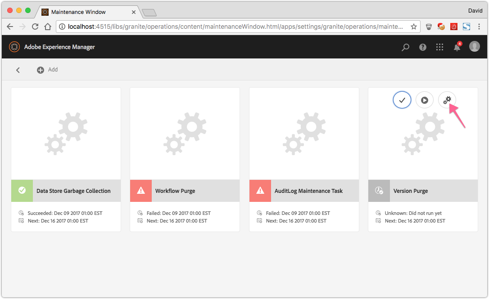

# 操作儀表板 {#operations-dashboard}

## 簡介 {#introduction}

6中的「操作控制板」AEM可幫助系統操作員一AEM目瞭然地監視系統運行狀況。 它還提供了有關相關方面的自動生成的診斷資訊AEM，讓您能夠配置並運行自帶的維護自動化，從而顯著減少項目操作和支援案例。 操作儀表板可以通過自定義運行狀況檢查和維護任務進行擴展。 此外，可以通過JMX從外部監控工具訪問操作儀表板資料。

**操作儀表板：**

* 是一鍵式系統狀態，以幫助運營部門提高效率
* 在單個集中的位置提供系統運行狀況概述
* 減少查找、分析和解決問題的時間
* 提供自帶的維護自動化功能，可顯著降低項目運營成本

可通過訪問 **工具** - **操作** 的上AEM界。

>[!NOTE]
>
>要能夠訪問操作儀表板，登錄的用戶必須是「操作員」用戶組的一部分。 有關詳細資訊，請參閱 [用戶、組和訪問權限管理](/help/sites-administering/user-group-ac-admin.md)。

## 健全狀態報表 {#health-reports}

運行狀況報告系統通過Sling Health Checks提AEM供實例的運行狀況資訊。 通過OSGI、JMX、HTTP請求（通過JSON）或通過Touch UI完成此操作。 它提供了某些可配置計數器的度量值和閾值，有時還提供了有關如何解決問題的資訊。

它具有以下幾個功能。

## 健康狀態檢查 {#health-checks}

的 **運行狀況報告** 是一種卡系統，用於指示特定產品區域的健康狀況是否良好。 這些卡是Sling Health Checks的可視化，它聚合來自JMX和其他源的資料，並再次將已處理的資訊作為MBean公開。 也可以在 [JMX Web控制台](/help/sites-administering/jmx-console.md)，也請參見Wiki頁。 **org.apache.sling.healthcheck** 。

可通過 **工具** - **操作** - **運行狀況報告** 的子菜AEM單，或直接通過以下URL:

`https://<serveraddress>:port/libs/granite/operations/content/healthreports/healthreportlist.html`


卡系統顯示三種可能的狀態： **確定**。 **警告** 和 **關鍵**。 這些狀態是規則和閾值的結果，可通過將滑鼠懸停在卡上，然後按一下操作欄中的齒輪表徵圖來配置：


### 運行狀況檢查類型 {#health-check-types}

6中有兩種類型的運行狀況檢AEM查：

1. 單個運行狀況檢查
1. 複合運行狀況檢查

安 **單個運行狀況檢查** 是與狀態卡對應的單個運行狀況檢查。 單個運行狀況檢查可以配置規則或閾值，並且可以提供一個或多個提示和連結來解決已識別的運行狀況問題。 讓我們以「日誌錯誤」檢查為例：如果實例日誌中有ERROR項，請在運行狀況檢查的詳細資訊頁面上查找。 在頁面頂部，您可以在「診斷工具」部分中看到指向「日誌消息」分析器的連結，該連結使您能夠更詳細地分析這些錯誤並重新配置日誌程式。

A **複合運行狀況檢查** 是一個檢查，它從多個單獨的檢查中聚合資訊。

複合健康檢查通過 **篩選標籤**。 實際上，所有具有相同篩選器標籤的單個檢查都會被分組為複合運行狀況檢查。 僅當組合運行狀況檢查聚合的所有單個檢查都具有OK狀態時，它才具有OK狀態。

### 如何建立運行狀況檢查 {#how-to-create-health-checks}

在「操作」操控板中，可以將單個和複合健康檢查的結果可視化。

### 建立單個運行狀況檢查 {#creating-an-individual-health-check}

建立單個運行狀況檢查涉及兩個步驟：在儀表板的配置節點中實施Sling Health Check並添加健康檢查項。

1. 要建立Sling Health Check，請建立實現Sling HealthCheck介面的OSGI元件。 將此元件添加到包中。 元件的屬性可完全標識運行狀況檢查。 安裝該元件後，將自動為運行狀況檢查建立JMX MBean。 查看 [Sling運行狀況檢查文檔](https://sling.apache.org/documentation/bundles/sling-health-check-tool.html) 的子菜單。

   使用OSGI服務元件注釋編寫的Sling Health Check元件示例：

   ```java
   @Component(service = HealthCheck.class,
   property = {
       HealthCheck.NAME + "=Example Check",
       HealthCheck.TAGS + "=example",
       HealthCheck.TAGS + "=test",
       HealthCheck.MBEAN_NAME + "=exampleHealthCheckMBean"
   })
    public class ExampleHealthCheck implements HealthCheck {
       @Override
       public Result execute() {
           // health check code
       }
    }
   ```

   >[!NOTE]
   >
   >的 `MBEAN_NAME` 屬性定義為此運行狀況檢查生成的mbean的名稱。

1. 建立「運行狀況檢查」後，必須建立新的配置節點，以便在「操作儀表板」介面中訪問該節點。 對於此步驟，必須知道運行狀況檢查的JMX Mbean名稱( `MBEAN_NAME` 屬性)。 要為運行狀況檢查建立配置，請開啟CRXDE並添加節點（類型） **nt：非結構化**)的路徑： `/apps/settings/granite/operations/hc`

   應在新節點上設定以下屬性：

   * **名稱:** `sling:resourceType`

      * **類型：** `String`
      * **值:** `granite/operations/components/mbean`
   * **名稱:** `resource`

      * **類型：** `String`
      * **值:** `/system/sling/monitoring/mbeans/org/apache/sling/healthcheck/HealthCheck/exampleHealthCheck`

   >[!NOTE]
   >
   >上面的資源路徑如下建立：如果運行狀況檢查的mbean名稱為「test」，請在路徑的末尾添加「test」 `/system/sling/monitoring/mbeans/org/apache/sling/healthcheck/HealthCheck`
   >
   >最後一條路是：
   >
   >`/system/sling/monitoring/mbeans/org/apache/sling/healthcheck/HealthCheck/test`

   >[!NOTE]
   >
   >確保 `/apps/settings/granite/operations/hc` 路徑的以下屬性設定為true:
   >
   >
   >`sling:configCollectionInherit`
   >
   >`sling:configPropertyInherit`
   >
   >
   >此過程通知配置管理器將新配置與現有配置合併 `/libs`。

### 建立複合運行狀況檢查 {#creating-a-composite-health-check}

複合運行狀況檢查的角色是聚合多個共用一組常見功能的單個運行狀況檢查。 例如，安全複合健康檢查將執行與安全相關的驗證的所有單個健康檢查分組。 建立複合檢查的第一步是添加OSGI配置。 要將其顯示在「操作面板」中，必須以與簡單檢查相同的方式添加新配置節點。

1. 轉到OSGI控制台中的Web Configuration Manager。 存取 `https://serveraddress:port/system/console/configMgr`
1. 搜索名為 **Apache Sling複合健康檢查**。 找到後，請注意已有兩種配置可用：一個用於系統檢查，另一個用於安全檢查。
1. 通過按配置右側的「+」按鈕建立配置。 此時將出現一個新窗口，如下所示：

   

1. 建立配置並保存。 使用新配置建立Mbean。

   每個配置屬性的用途如下：

   * **名稱(hc.name):** 複合健康檢查的名稱。 建議使用有意義的名稱。
   * **標籤(hc.tags):** 此運行狀況檢查的標籤。 如果此複合健康檢查旨在成為另一個複合健康檢查的一部分（例如，在健康檢查的層次結構中），請添加此複合所關聯的標籤。
   * **MBean名稱(hc.mbean.name):** 指定給此複合運行狀況檢查的JMX MBean的Mbean的名稱。
   * **篩選標籤(filter.tags):** 特定於複合運行狀況檢查的屬性。 這些標籤由組合聚合。 複合健康檢查將聚合其組下所有具有與此複合的任何篩選器標籤匹配的任何標籤的健康檢查。 例如，具有過濾器標籤的複合健康檢查 **test** 和 **檢查**，聚合所有具有以下任意 **test** 和 **檢查** 標籤屬性( `hc.tags`)。

   >[!NOTE]
   >
   >為Apache Sling複合健康檢查的每個新配置建立新的JMX Mbean。**

1. 最後，必須在「操作儀表板」配置節點中添加已建立的複合運行狀況檢查項。 該過程與單個運行狀況檢查的過程相同：類型的節點 **nt：非結構化** 必須在 `/apps/settings/granite/operations/hc`。 節點的資源屬性由 **hc.mean.name** 在OSGI配置中。

   例如，如果建立了配置並設定 **hc.mbean.name** 值 **磁碟使用**，配置節點如下所示：

   * **名稱:** `Composite Health Check`

      * **類型：** `nt:unstructured`

   具有以下屬性：

   * **名稱:** `sling:resourceType`

      * **類型：** `String`
      * **值:** `granite/operations/components/mbean`
   * **名稱:** `resource`

      * **類型：** `String`
      * **值:** `/system/sling/monitoring/mbeans/org/apache/sling/healthcheck/HealthCheck/diskusage`

   >[!NOTE]
   >
   >如果建立邏輯上屬於複合檢查的單個運行狀況檢查，預設情況下，這些檢查已存在於儀表板中，則它們將自動捕獲並分組在相應的複合檢查下。 因此，無需為這些檢查建立配置節點。
   >
   >例如，如果建立單個安全運行狀況檢查，請將「」**安全**&quot;標籤，並且已安裝。 它會自動顯示在「操作」操控板中的「安全檢查」(Security Checks)複合檢查下。

### 提供的運行狀況檢AEM查 {#health-checks-provided-with-aem}

<table>
 <tbody>
  <tr>
   <td><strong>zHealthcheck名稱</strong></td>
   <td><strong>說明</strong></td>
  </tr>
  <tr>
   <td>查詢效能</td>
   <td><p>此運行狀況檢查已簡化 <strong>在AEM6.4中</strong>，現在檢查最近重新分解的 <code>Oak QueryStats</code> MBean，更具體地說是 <code>SlowQueries </code>屬性。 如果統計資訊包含任何慢速查詢，則運行狀況檢查將返回警告。 否則，它返回「確定」狀態。<br /> </p> <p>此運行狀況檢查的MBean為 <a href="http://localhost:4502/system/console/jmx/org.apache.sling.healthcheck%3Aname%3DqueriesStatus%2Ctype%3DHealthCheck">org.apache.sling.healthcheck:name=queriesStatus,type=HealthCheck</a>。</p> </td>
  </tr>
  <tr>
   <td>觀測佇列長度</td>
   <td><p>所有事件偵聽器和後台觀察器上的觀察隊列長度迭代，比較它們 <code>queueSize </code>到 <code>maxQueueSize</code> 及：</p>
    <ul>
     <li>返回關鍵狀態(如果 <code>queueSize</code> 值超過 <code>maxQueueSize</code> 值（即刪除事件的時間）</li>
     <li>返回警告，如果 <code>queueSize</code> 值超過 <code>maxQueueSize * WARN_THRESHOLD</code> （預設值為0.75） </li>
    </ul> <p>每個隊列的最大長度來自不同的配置(Oak和AEM)，不能通過此運行狀況檢查進行配置。 此運行狀況檢查的MBean為 <a href="http://localhost:4502/system/console/jmx/org.apache.sling.healthcheck%3Aname%3DObservationQueueLengthHealthCheck%2Ctype%3DHealthCheck">org.apache.sling.healthcheck:name=ObservationQueueLengthHealthCheck,type=HealthCheck</a>。</p> </td>
  </tr>
  <tr>
   <td>查詢周遊限制</td>
   <td><p>查詢遍歷限制檢查 <code>QueryEngineSettings</code> MBean，更具體地說是 <code>LimitInMemory</code> 和 <code>LimitReads</code> 屬性，並返回以下狀態：</p>
    <ul>
     <li>如果其中一個限制等於或高於 <code>Integer.MAX_VALUE</code></li>
     <li>如果其中一個限制低於10000（Oak推薦的設定），則返回「警告」狀態</li>
     <li>返回「關鍵」狀態(如果 <code>QueryEngineSettings</code> 或無法檢索任何限制</li>
    </ul> <p>此運行狀況檢查的Mbean是 <a href="http://localhost:4502/system/console/jmx/org.apache.sling.healthcheck%3Aname%3DqueryTraversalLimitsBundle%2Ctype%3DHealthCheck">org.apache.sling.healthcheck:name=queryTraversalLimitsBundle,type=HealthCheck</a>。</p> </td>
  </tr>
  <tr>
   <td>已同步時鐘</td>
   <td><p>此支票僅與 <a href="https://github.com/apache/sling-old-svn-mirror/blob/4df9ab2d6592422889c71fa13afd453a10a5a626/bundles/extensions/discovery/oak/src/main/java/org/apache/sling/discovery/oak/SynchronizedClocksHealthCheck.java">文檔節點儲存集</a>。 它返回以下狀態：</p>
    <ul>
     <li>當實例時鐘不同步並超過預定義的低閾值時，返回「警告」狀態</li>
     <li>當實例時鐘不同步並超過預定義的高閾值時返回「嚴重」狀態</li>
    </ul> <p>此運行狀況檢查的Mbean是 <a href="http://localhost:4502/system/console/jmx/org.apache.sling.healthcheck%3Aname%3DslingDiscoveryOakSynchronizedClocks%2Ctype%3DHealthCheck">org.apache.sling.healthcheck:name=slingDiscoveryOakSynchronizedClocks,type=HealthCheck</a>。</p> </td>
  </tr>
  <tr>
   <td>非同步處理索引</td>
   <td><p>非同步索引檢查：</p>
    <ul>
     <li>如果至少有一個索引通道失敗，則返回關鍵狀態</li>
     <li>檢查 <code>lastIndexedTime</code> 對於所有索引通道和：
      <ul>
       <li>如果超過2小時前，返回關鍵狀態 </li>
       <li>返回警告狀態（如果2小時到45分鐘前） </li>
       <li>如果少於45分鐘前，則返回OK狀態 </li>
      </ul> </li>
     <li>如果未滿足這些條件，則返回「確定」狀態</li>
    </ul> <p>「嚴重」和「警告」狀態閾值都可配置。 此運行狀況檢查的Mbean是 <a href="http://localhost:4502/system/console/jmx/org.apache.sling.healthcheck%3Aname%3DasyncIndexHealthCheck%2Ctype%3DHealthCheck">org.apache.sling.healthcheck:name=asyncIndexHealthCheck,type=HealthCheck</a>。</p> <p><strong>注： </strong>此運行狀況檢AEM查隨6.4提供，並已支援AEM6.3.0.1。</p> </td>
  </tr>
  <tr>
   <td>大型 Lucene 索引</td>
   <td><p>此檢查使用 <code>Lucene Index Statistics</code> MBean用於標識大索引並返回：</p>
    <ul>
     <li>a警告狀態（如果有包含超過10億份文檔的索引）</li>
     <li>a如果存在包含超過15億份文檔的索引，則關鍵狀態</li>
    </ul> <p>閾值是可配置的，運行狀況檢查的MBean是 <a href="http://localhost:4502/system/console/jmx/org.apache.sling.healthcheck%3Aname%3DlargeIndexHealthCheck%2Ctype%3DHealthCheck">org.apache.sling.healthcheck:name=largeIndexHealthCheck,type=HealthCheck。</a></p> <p><strong>注： </strong>此檢查在6.AEM4中提供，已備份到AEM6.3.2.0。</p> </td>
  </tr>
  <tr>
   <td>系統維護</td>
   <td><p>系統維護是一個複合檢查，如果所有維護任務都按配置運行，則返回「確定」。 請記住：</p>
    <ul>
     <li>每項維護任務都伴有關聯的運行狀況檢查</li>
     <li>如果未將任務添加到維護窗口，其運行狀況檢查將返回「關鍵」</li>
     <li>配置「審核日誌」和「工作流清除」維護任務，或從維護窗口中刪除這些任務。 如果未配置，則這些任務在首次嘗試運行時失敗，因此系統維護檢查將返回「嚴重」狀態。</li>
     <li><strong>帶AEM6.4</strong>還有一張支票 <a href="/help/sites-administering/operations-dashboard.md#automated-maintenance-tasks">Lucene二進位檔案維護</a> 任務</li>
     <li>在AEM6.2和更低版本上，系統維護檢查會在啟動後立即返回「警告」狀態，因為任務從未運行。 從6.3開始，如果尚未到達第一個維護窗口，則返回「OK（正常）」。</li>
    </ul> <p>此運行狀況檢查的MBean為 <a href="http://localhost:4502/system/console/jmx/org.apache.sling.healthcheck%3Aname%3Dsystemchecks%2Ctype%3DHealthCheck">org.apache.sling.healthcheck:name=systemchecks,type=HealthCheck</a>。</p> </td>
  </tr>
  <tr>
   <td>複製隊列</td>
   <td><p>此檢查會迭代複製代理並查看其隊列。 對於位於隊列頂部的項目，檢查將查看代理重試複製的次數。 如果代理重試的複製超過 <code>numberOfRetriesAllowed</code> 參數，它返回警告。 的 <code>numberOfRetriesAllowed</code> 參數是可配置的。 </p> <p>此運行狀況檢查的MBean為 <a href="http://localhost:4502/system/console/jmx/org.apache.sling.healthcheck%3Aname%3DreplicationQueue%2Ctype%3DHealthCheck" target="_blank">org.apache.sling.healthcheck:name=replicationQueue,type=HealthCheck</a>。</p> </td>
  </tr>
  <tr>
   <td>Sling 工作</td>
   <td>
    <div>
      Sling Jobs檢查JobManager中排隊的作業數，並將其與
     <code>maxNumQueueJobs</code> 閾值，和：
    </div>
    <ul>
     <li>如果超過 <code>maxNumQueueJobs</code> 在隊列中</li>
     <li>如果有長時間運行的活動作業超過1小時，則返回「嚴重」</li>
     <li>如果存在已排隊的作業，並且上次完成的作業時間超過1小時，則返回「嚴重」</li>
    </ul> <p>只有隊列作業參數的最大數目是可配置的，其預設值為1000。</p> <p>此運行狀況檢查的MBean為 <a href="http://localhost:4502/system/console/jmx/org.apache.sling.healthcheck%3Aname%3DslingJobs%2Ctype%3DHealthCheck" target="_blank">org.apache.sling.healthcheck:name=slingJobs,type=HealthCheck</a>。</p> </td>
  </tr>
  <tr>
   <td>請求效能</td>
   <td><p>這張支票會 <code>granite.request.metrics.timer</code> <a href="http://localhost:4502/system/console/slingmetrics" target="_blank">吊索度量 </a>及：</p>
    <ul>
     <li>如果第75個百分點值超過關鍵閾值（預設值為500毫秒），則返回關鍵值</li>
     <li>如果第75個百分點值超過警告閾值，則返回警告（預設值為200毫秒）</li>
    </ul> <p>此運行狀況檢查的MBean為<em> </em><a href="http://localhost:4502/system/console/jmx/org.apache.sling.healthcheck%3Aname%3DrequestsStatus%2Ctype%3DHealthCheck" target="_blank">org.apache.sling.healthcheck:name=requestsStatus,type=HealthCheck</a>。</p> </td>
  </tr>
  <tr>
   <td>日誌錯誤</td>
   <td><p>如果日誌中有錯誤，此檢查將返回「警告」狀態。</p> <p>此運行狀況檢查的MBean為 <a href="http://localhost:4502/system/console/jmx/org.apache.sling.healthcheck%3Aname%3DlogErrorHealthCheck%2Ctype%3DHealthCheck" target="_blank">org.apache.sling.healthcheck:name=logErrorHealthCheck,type=HealthCheck</a>。</p> </td>
  </tr>
  <tr>
   <td>磁碟空間</td>
   <td><p>磁碟空間檢查將查看 <code>FileStoreStats</code> MBean，檢索節點儲存的大小和節點儲存分區上的可用磁碟空間量，並：</p>
    <ul>
     <li>如果可用磁碟空間與儲存庫大小之比小於警告閾值（預設值為10），則返回警告</li>
     <li>如果可用磁碟空間與儲存庫大小之比小於關鍵閾值（預設值為2），則返回關鍵值</li>
    </ul> <p>兩個閾值都可配置。 該檢查僅用於段儲存的實例。</p> <p>此運行狀況檢查的MBean為 <a href="http://localhost:4502/system/console/jmx/org.apache.sling.healthcheck%3Aname%3DDiskSpaceHealthCheck%2Ctype%3DHealthCheck" target="_blank">org.apache.sling.healthcheck:name=DiskSpaceHealthCheck,type=HealthCheck</a>。</p> </td>
  </tr>
  <tr>
   <td>排程器健康情況檢查</td>
   <td><p>如果實例的Quartz作業運行時間超過60秒，此檢查將返回警告。 可接受持續時間閾值是可配置的。</p> <p>此運行狀況檢查的MBean為 <a href="http://localhost:4502/system/console/jmx/org.apache.sling.healthcheck%3Aname%3DslingCommonsSchedulerHealthCheck%2Ctype%3DHealthCheck" target="_blank">org.apache.sling.healthcheck:name=slingCommonsSchedulerHealthCheck,type=HealthCheck</a><em>。</em></p> </td>
  </tr>
  <tr>
   <td>安全性檢查</td>
   <td><p>安全檢查是一個組合，它聚合多個與安全相關的檢查的結果。 這些單獨的運行狀況檢查可解決與安全檢查清單不同的問題。 <a href="/help/sites-administering/security-checklist.md">「安全檢查清單文檔」頁。</a> 當實例啟動時，該檢查作為安全煙霧test很有用。 </p> <p>此運行狀況檢查的MBean為 <a href="http://localhost:4502/system/console/jmx/org.apache.sling.healthcheck%3Aname%3Dsecuritychecks%2Ctype%3DHealthCheck" target="_blank">org.apache.sling.healthcheck:name=securitychecks,type=HealthCheck</a></p> </td>
  </tr>
  <tr>
   <td>作用中組合</td>
   <td><p>活動束檢查所有束的狀態，並：</p>
    <ul>
     <li>返回「警告」狀態（如果其中任何綁定未處於活動狀態）或（開始時，以延遲激活狀態）</li>
     <li>它忽略忽略忽略清單中束的狀態</li>
    </ul> <p>忽略清單參數是可配置的。</p> <p>此運行狀況檢查的MBean為 <a href="http://localhost:4502/system/console/jmx/org.apache.sling.healthcheck%3Aname%3DinactiveBundles%2Ctype%3DHealthCheck" target="_blank">org.apache.sling.healthcheck:name=inactiveBundles,type=HealthCheck</a>。</p> </td>
  </tr>
  <tr>
   <td>代碼快取檢查</td>
   <td><p>運行狀況檢查，它驗證可觸發Java™ 7中存在的CodeCache錯誤的多個JVM條件：</p>
    <ul>
     <li>如果實例在啟用「代碼快取刷新」的Java™ 7上運行，則返回警告</li>
     <li>如果實例在Java™ 7上運行，且保留代碼快取大小小於最小閾值（預設值為90 MB），則返回警告</li>
    </ul> <p>的 <code>minimum.code.cache.size</code> 閾值是可配置的。 有關Bug的詳細資訊，請參見 <a href="https://bugs.java.com/bugdatabase/"> 然後搜索Bug ID 8012547</a>。</p> <p>此運行狀況檢查的MBean為 <a href="http://localhost:4502/system/console/jmx/org.apache.sling.healthcheck%3Aname%3DcodeCacheHealthCheck%2Ctype%3DHealthCheck" target="_blank">org.apache.sling.healthcheck:name=codeCacheHealthCheck,type=HealthCheck</a>。</p> </td>
  </tr>
  <tr>
   <td>資源搜尋路徑錯誤</td>
   <td><p>檢查路徑中是否有資源 <code>/apps/foundation/components/primary</code> 及：</p>
    <ul>
     <li>返回警告，如果子節點位於 <code>/apps/foundation/components/primary</code></li>
    </ul> <p>此運行狀況檢查的MBean為 <a href="http://localhost:4502/system/console/jmx/org.apache.sling.healthcheck%3Aname%3DresourceSearchPathErrorHealthCheck%2Ctype%3DHealthCheck" target="_blank">org.apache.sling.healthcheck:name=resourceSearchPathErrorHealthCheck,type=HealthCheck</a>。</p> </td>
  </tr>
 </tbody>
</table>

### 運行狀況檢查配置 {#health-check-configuration}

預設情況下，對於出廠設定實例，AEM運行狀況檢查每60秒運行一次。

您可以配置 **期間** 和 [OSGi配置](/help/sites-deploying/configuring-osgi.md) **查詢運行狀況檢查配置** (com.adobe.granite.queries.impl.hc.QueryHealthCheckMetrics)。

## 使用Nagios進行監視 {#monitoring-with-nagios}

健康檢查儀表板可以通過Granite JMX Mbeans與Nagios整合。 以下示例說明如何添加一個檢查，該檢查顯示運行的伺服器上已用內AEM存。

1. 在監控伺服器上設定和安裝Nagios。
1. 接下來，安裝Nagios遠程插件執行器(NRPE)。

   >[!NOTE]
   >
   >有關如何在系統上安裝Nagios和NRPE的詳細資訊，請參考 [Nagios文檔](https://library.nagios.com/library/products/nagios-core/manuals//)。

1. 為伺服器添加主機AEM定義。 通過Nagios XI Web介面，使用Configuration Manager可完成此任務：

   1. 開啟瀏覽器並指向Nagios伺服器。
   1. 按 **配置** 按鈕。
   1. 在左窗格中，按 **核心配置管理器** 在 **高級配置**。
   1. 按 **主機** 連結 **監視** 的子菜單。
   1. 添加主機定義：

   

   以下是主機配置檔案的示例，如果您使用Nagios Core:

   ```xml
   define host {
      address 192.168.0.5
      max_check_attempts 3
      check_period 24x7
      check-command check-host-alive
      contacts admin
      notification_interval 60
      notification_period 24x7
   }
   ```

1. 在伺服器上安裝Nagios和AEMNRPE。
1. 安裝 [check_http_json](https://github.com/phrawzty/check_http_json) 兩台伺服器上的插件。
1. 在兩台伺服器上定義通用JSON check命令：

   ```xml
   define command{
   
       command_name    check_http_json-int
   
       command_line    /usr/lib/nagios/plugins/check_http_json --user "$ARG1$" --pass "$ARG2$" -u 'https://$HOSTNAME$:$ARG3$/$ARG4$' -e '$ARG5$' -w '$ARG6$' -c '$ARG7$'
   
   }
   ```

1. 在伺服器上為已用記憶體添加AEM服務：

   ```xml
   define service {
   
       use generic-service
   
       host_name my.remote.host
   
       service_description AEM Author Used Memory
   
       check_command  check_http_json-int!<cq-user>!<cq-password>!<cq-port>!system/sling/monitoring/mbeans/java/lang/Memory.infinity.json!{noname}.mbean:attributes.HeapMemoryUsage.mbean:attributes.used.mbean:value!<warn-threshold-in-bytes>!<critical-threshold-in-bytes>
   
       }
   ```

1. 檢查Nagios儀表板以瞭解新建立的服務：

   

## 診斷工具 {#diagnosis-tools}

操作面板還提供對診斷工具的訪問，這些工具可以幫助查找和排除運行狀況檢查面板中出現警告的根本原因，並為系統操作員提供重要的調試資訊。

其最重要的特點包括：

* 日誌消息分析器
* 訪問堆和線程轉儲的能力
* 請求和查詢效能分析器

通過轉到 **工具 — 操作 — 診斷** 的上AEM界。 也可以通過直接訪問以下URL來訪問螢幕： `https://serveraddress:port/libs/granite/operations/content/diagnosis.html`


### 日誌消息 {#log-messages}

預設情況下，日誌消息用戶介面顯示所有ERROR消息。 如果希望顯示更多日誌消息，請配置具有相應日誌級別的記錄器。

日誌消息使用記憶體日誌附加器，因此與日誌檔案無關。 另一個結果是，更改此UI中的日誌級別不會更改傳統日誌檔案中記錄的資訊。 在此UI中添加和刪除記錄程式只影響記憶體記錄程式。 此外，更改記錄器配置會反映在記憶體記錄器的將來。 已記錄且不再相關的條目不會被刪除，但類似條目將來不會記錄。

您可以通過從用戶介面的左上齒輪按鈕提供記錄器配置來配置記錄器。 在此，可以添加、刪除或更新記錄器配置。 記錄器配置由 **日誌級別** （警告/資訊/調試）和 **篩選器名稱**。 的 **篩選器名稱** 具有篩選日誌消息源的角色。 或者，如果記錄器應捕獲指定級別的所有日誌消息，則篩選器名稱應為「」**根**。 設定記錄器級別會觸發所有消息的捕獲，其級別等於或高於指定的級別。

範例：

* 如果計畫捕獲 **錯誤** 消息 — 不需要配置。 預設情況下，將捕獲所有ERROR消息。
* 如果計畫捕獲 **錯誤**。 **警告** 和 **資訊** messages — 記錄器名稱應設定為：&quot;**根**&#x200B;和記錄器級別： **資訊**。

* 如果計畫捕獲來自某個包（例如com.adobe.granite）的所有消息，記錄器名稱應設定為：&quot;com.adobe.granite&quot;。 記錄器級別設定為： **調試** (這樣可捕獲所有 **錯誤**。 **警告**。 **資訊**, **調試** 消息)，如下圖所示。


>[!NOTE]
>
>不能將記錄器名稱設定為通過指定的篩選器僅捕獲ERROR消息。 預設情況下，將捕獲所有ERROR消息。

>[!NOTE]
>
>日誌消息用戶介面不反映實際錯誤日誌。 除非您在UI中配置其他類型的日誌消息，否則您只能看到錯誤消息。 有關如何顯示特定日誌消息的資訊，請參閱上面的說明。

>[!NOTE]
>
>診斷頁中的設定不會影響記錄到日誌檔案中的內容，反之也不影響記錄到的內容。 因此，儘管錯誤日誌可能會捕獲INFO消息，但您可能在日誌消息UI中看不到它們。 此外，通過UI，可以捕獲某些包中的DEBUG消息，而不影響錯誤日誌。 有關如何配置日誌檔案的詳細資訊，請參見 [記錄](/help/sites-deploying/configure-logging.md)。

>[!NOTE]
>
>**帶AEM6.4**，維護任務將以INFO級別的更豐富資訊格式從框中註銷。 此工作流允許更好地查看維護任務的狀態。
>
>如果您使用第三方工具（如Splunk）監視維護任務活動並對其做出響應，則可以使用以下日誌語句：

```
Log level: INFO
DATE+TIME [MaintanceLogger] Name=<MT_NAME>, Status=<MT_STATUS>, Time=<MT_TIME>, Error=<MT_ERROR>, Details=<MT_DETAILS>
```

### 請求效能 {#request-performance}

「請求效能」頁允許分析處理的最慢頁請求。 此頁上僅註冊內容請求。 更具體地說，將捕獲以下請求：

1. 請求訪問 `/content`
1. 請求訪問 `/etc/design`
1. 請求 `".html"` 擴展


該頁顯示：

* 發出請求的時間
* URL和請求方法
* 持續時間（毫秒）

預設情況下，將捕獲最慢的20個頁面請求，但可以在Configuration Manager中修改該限制。

### 查詢效能 {#query-performance}

「查詢效能」頁允許分析系統執行的最慢查詢。 此資訊由JMX Mbean中的儲存庫提供。 《野兔》 `com.adobe.granite.QueryStat` JMX Mbean提供此資訊，而在Oak儲存庫中，它由 `org.apache.jackrabbit.oak.QueryStats.`

該頁顯示：

* 進行查詢的時間
* 查詢的語言
* 發出查詢的次數
* 查詢的語句
* 持續時間（毫秒）


### 說明查詢 {#explain-query}

對於任何給定查詢，Oak都會嘗試根據儲存庫中在以下位置定義的Oak索引找出最佳執行方法 **橡樹：索引** 的下界。 根據查詢，Oak可以選擇不同的索引。 瞭解Oak如何執行查詢是優化查詢的第一步。

Explain Query是一種工具，用於說明Oak如何執行查詢。 可通過訪問 **工具 — 操作 — 診斷** 的上AEM界。 然後，按一下 **查詢效能** 然後切換到 **解釋查詢** 頁籤。

**功能**

* 支援Xpath、JCR-SQL和JCR-SQL2查詢語言
* 報告提供查詢的實際執行時間
* 檢測慢速查詢並警告可能慢速的查詢
* 報告用於執行查詢的Oak索引
* 顯示實際Oak查詢引擎說明
* 提供慢速查詢和常用查詢的點擊載入清單

在「解釋查詢」UI中後，輸入查詢，然後按 **解釋** 按鈕：


「查詢解釋」部分中的第一個條目是實際解釋。 說明顯示了用於執行查詢的索引類型。

第二個條目是執行計畫。

滴答聲 **包括執行時間** 框中顯示運行查詢的時間。 的 **包括節點計數** 選項報告節點計數。 該報告提供了可用於優化應用程式或部署的索引的詳細資訊。


### 索引管理器 {#the-index-manager}

「索引管理器」的目的是促進索引管理，如維護索引或查看索引的狀態。

可通過從「歡迎使用」螢幕轉到**工具 — 操作 — 診斷**，然後按一下 **索引管理器** 按鈕

也可以通過以下URL直接訪問它： `https://serveraddress:port/libs/granite/operations/content/diagnosistools/indexManager.html`


通過在螢幕左上角的搜索框中鍵入篩選條件，UI可用於篩選表中的索引。

### 下載狀態ZIP {#download-status-zip}

此操作將觸發包含有關係統狀態和配置的有用資訊的zip的下載。 存檔包含實例配置、捆綁包清單、 OSGI、Sling度量和統計資訊，這可能導致大檔案。 您可以使用 **下載狀態ZIP**&#x200B;的子菜單。 可從以下位置訪問該窗口：**>AEM工具>操作>診斷>下載狀態ZIP。**

在此窗口中，您可以選擇要導出的內容（日誌檔案和線程轉儲）以及下載中包含的相對於當前日期的日誌天數。


### 下載線程轉儲 {#download-thread-dump}

此操作將觸發包含系統中存在的線程資訊的zip的下載。 提供了有關每個線程的資訊，如其狀態、類載入器和棧跟蹤。

### 下載堆轉儲 {#download-heap-dump}

您可以下載堆的快照，以便以後分析它。 此操作將觸發下載大（數百兆位元組）檔案。

## 自動維護任務 {#automated-maintenance-tasks}

「自動維護任務」頁是您可以查看和跟蹤計畫定期執行的建議維護任務的位置。 這些任務與運行狀況檢查系統整合。 還可以從介面手動執行任務。

要訪問「操作控制板」中的「維護」頁，請從「AEM歡迎」螢幕轉到 **工具 — 操作 — 儀表板 — 維護**，或直接遵循此連結：

`https://serveraddress:port/libs/granite/operations/content/maintenance.html`

「操作控制板」(Operations Dashboard)中提供了以下任務：

1. 的 **修訂清除**&#x200B;任務，位於 **每日維護窗口** 的子菜單。
1. 的 **Lucene二進位檔案清理** 任務，位於 **每日維護窗口** 的子菜單。
1. 的 **工作流清除** 任務，位於 **每週維護窗口** 的子菜單。
1. 的 **資料儲存垃圾收集** 任務，位於 **每週維護窗口** 的子菜單。
1. 的 **審核日誌維護** 任務，位於 **每週維護窗口** 的子菜單。
1. 的 **版本清除維護** 任務，位於 **每週維護窗口** 的子菜單。

每日維護窗口的預設時間是凌晨2:00。直到清晨5點。配置為在每週維護窗口中運行的任務在凌晨1:00到凌晨2:00之間運行。星期六。

您還可以通過按下兩個維護卡中的任意一個上的齒輪表徵圖來配置計時：


>[!NOTE]
>
>自AEM6.1以來，還可以將現有維護窗口配置為每月運行一次。

### 修訂清理 {#revision-clean-up}

有關執行修訂清除的詳細資訊， [查看專門文章](/help/sites-deploying/revision-cleanup.md)。

### Lucene 二進位清理 {#lucene-binaries-cleanup}

通過使用Lucene二進位檔案清理任務，可以清除lucene二進位檔案並減少正在運行的資料儲存大小要求。 Lucene的二進位攪局每天都被重新利用，而不是以前對成功的依賴 [資料儲存垃圾收集](/help/sites-administering/data-store-garbage-collection.md) 跑。

雖然維護任務是為減少Lucene相關的修訂垃圾而開發的，但在運行任務時，總體效率有所提高：

* 資料儲存垃圾收集任務的每週運行可以更快地完成。
* 也可以稍微提AEM高整體

您可以從以下位置訪問Lucene二進位檔案清除任務： **>工AEM具>操作>維護>每日維護窗口> Lucene二進位檔案清理**。

### 資料存放庫廢棄項目收集 {#data-store-garbage-collection}

有關資料儲存垃圾收集的詳細資訊，請參閱專用 [文檔頁](/help/sites-administering/data-store-garbage-collection.md)。

### 工作流清除 {#workflow-purge}

也可以從維護控制板中清除工作流。 要運行「工作流清除」任務，請執行以下操作：

1. 按一下 **每週維護窗口** 的子菜單。
1. 在以下頁中，按一下 **播放** 的 **工作流清除** 卡。

>[!NOTE]
>
>有關工作流維護的詳細資訊，請參閱 [此頁](/help/sites-administering/workflows-administering.md#regular-purging-of-workflow-instances)。

### 審核日誌維護 {#audit-log-maintenance}

有關審核日誌維護，請參見 [單獨的文檔頁面。](/help/sites-administering/operations-audit-log.md)

### 版本清除 {#version-purge}

您可以計畫「版本清除」維護任務以自動刪除舊版本。 此操作將手動使用 [版本清除工具](/help/sites-deploying/version-purging.md)。 您可以通過訪問 **「工具」>「操作」>「維護」>「每週維護」窗口** 並執行以下步驟：

1. 按一下 **添加**。
1. 選擇 **版本清除** 的下界。

   

1. 要配置「版本清除」任務，請按一下 **齒輪** 表徵圖。

   

**帶AEM6.4**，您可以按如下方式停止「版本清除」維護任務：

* 自動 — 如果計畫維護窗口在任務完成之前關閉，則任務將自動停止。 下次維護窗口開啟時，它將恢復。
* 手動 — 要手動停止任務，請在「版本清除」維護卡上按一下 **停止** 表徵圖 下次執行時，任務將安全恢復。

>[!NOTE]
>
>停止維護任務意味著暫停其運行，而不丟失已在進行中的作業的跟蹤。

>[!CAUTION]
>
>要優化應經常運行版本清除任務的儲存庫大小。 當流量有限時，應將任務安排在工作時間之外。

## 自定義維護任務 {#custom-maintenance-tasks}

自定義維護任務可以作為OSGi服務來實施。 由於維護任務基礎架構基於Apache Sling的作業處理，因此維護任務必須實現Java™介面 ` [org.apache.sling.event.jobs.consumer.JobExecutor](https://sling.apache.org/apidocs/sling7/org/apache/sling/event/jobs/consumer/JobExecutor.html)`。 此外，它必須聲明若要檢測為維護任務的多個服務註冊屬性，如下所示：

<table>
 <tbody>
  <tr>
   <td><strong>服務屬性名稱</strong><br /> </td>
   <td><strong>說明</strong></td>
   <td><strong>範例</strong><br /> </td>
   <td><strong>類型</strong></td>
  </tr>
  <tr>
   <td>granite.maintenance.isStoppable</td>
   <td>布爾屬性，定義用戶是否可以停止任務。 如果任務聲明它是可停止的，則它必須在運行期間檢查它是否已停止，然後採取相應行動。 預設值為false。</td>
   <td>true</td>
   <td>選用</td>
  </tr>
  <tr>
   <td>granite.maintenance.mandatory</td>
   <td>布爾屬性，定義任務是否是必需的且必須定期運行。 如果任務是必需的，但當前未在任何活動的計畫窗口中，運行狀況檢查將報告此錯誤。 預設值為false。</td>
   <td>true</td>
   <td>選用</td>
  </tr>
  <tr>
   <td>granite.maintenance.name</td>
   <td>任務的唯一名稱 — 該名稱用於引用該任務，而只是一個簡單名稱。</td>
   <td>我的維護任務</td>
   <td>必要</td>
  </tr>
  <tr>
   <td>granite.maintenance.title</td>
   <td>為此任務顯示的標題</td>
   <td>我的特殊維護任務</td>
   <td>必要</td>
  </tr>
  <tr>
   <td>job.topics</td>
   <td>維護任務的唯一主題。<br /> Apache Sling作業處理將啟動一個與此主題完全相同的作業以運行維護任務，並且當為此主題註冊任務時，它將運行。<br /> 主題必須以開頭 <i>com/adobe/granite/maintenance/job</i></td>
   <td>com/adobe/granite/maintenance/job/MyMaintenanceTask</td>
   <td>必要</td>
  </tr>
 </tbody>
</table>

除上述服務物業外，本 `process()` 方法 `JobConsumer` 介面必須通過添加應為維護任務執行的代碼來實現。 提供的 `JobExecutionContext` 可用於輸出狀態資訊，檢查用戶是否停止作業並建立結果（成功或失敗）。

如果維護任務不應在所有安裝上運行（例如，僅在發佈實例上運行），則可以通過添加來使服務要求配置處於活動狀態 `@Component(policy=ConfigurationPolicy.REQUIRE)`。 然後，可以將相應的配置標籤為與儲存庫中的運行模式相關。 有關詳細資訊，請參見 [配置OSGi](/help/sites-deploying/configuring-osgi.md#creating-the-configuration-in-the-repository)。

下面是一個自定義維護任務的示例，該任務從一個可配置的臨時目錄中刪除了過去24小時內已修改的檔案：

src/main/java/com/adobe/granite/samples/maintenance/impl/DeleteTempFilesTask.java

<table>
 <tbody>
  <tr>
   <td><p> </p> <p><code>/*</code></p> <p><code> * #%L</code></p> <p><code> * sample-maintenance-task</code></p> <p><code> * %%</code></p> <p><code> * Copyright (C) 2014 Adobe</code></p> <p><code> * %%</code></p> <p><code> * Licensed under the Apache License, Version 2.0 (the "License");</code></p> <p><code> * you may not use this file except in compliance with the License.</code></p> <p><code> * You may obtain a copy of the License at</code></p> <p><code> * </code></p> <p><code> * <a href="https://www.apache.org/licenses/LICENSE-2.0">https://www.apache.org/licenses/LICENSE-2.0</a></code></p> <p><code> * </code></p> <p><code> * Unless required by applicable law or agreed to in writing, software</code></p> <p><code> * distributed under the License is distributed on an "AS IS" BASIS,</code></p> <p><code> * WITHOUT WARRANTIES OR CONDITIONS OF ANY KIND, either express or implied.</code></p> <p><code> * See the License for the specific language governing permissions and</code></p> <p><code> * limitations under the License.</code></p> <p><code> * #L%</code></p> <p><code> */</code></p> <p><code> </code></p> <p><code>package com.adobe.granite.samples.maintenance.impl;</code></p> <p><code> </code></p> <p><code>import java.io.File;</code></p> <p><code>import java.util.Calendar;</code></p> <p><code>import java.util.Collection;</code></p> <p><code>import java.util.Map;</code></p> <p><code> </code></p> <p><code>import org.apache.commons.io.FileUtils;</code></p> <p><code>import org.apache.commons.io.filefilter.IOFileFilter;</code></p> <p><code>import org.apache.commons.io.filefilter.TrueFileFilter;</code></p> <p><code>import org.apache.felix.scr.annotations.Activate;</code></p> <p><code>import org.apache.felix.scr.annotations.Component;</code></p> <p><code>import org.apache.felix.scr.annotations.Properties;</code></p> <p><code>import org.apache.felix.scr.annotations.Property;</code></p> <p><code>import org.apache.felix.scr.annotations.Service;</code></p> <p><code>import org.apache.sling.commons.osgi.PropertiesUtil;</code></p> <p><code>import org.apache.sling.event.jobs.Job;</code></p> <p><code>import org.apache.sling.event.jobs.consumer.JobConsumer;</code></p> <p><code>import org.apache.sling.event.jobs.consumer.JobExecutionContext;</code></p> <p><code>import org.apache.sling.event.jobs.consumer.JobExecutionResult;</code></p> <p><code>import org.apache.sling.event.jobs.consumer.JobExecutor;</code></p> <p><code>import org.slf4j.Logger;</code></p> <p><code>import org.slf4j.LoggerFactory;</code></p> <p><code> </code></p> <p><code>import com.adobe.granite.maintenance.MaintenanceConstants;</code></p> <p><code> </code></p> <p><code>@Component(metatype = true,</code></p> <p><code> label = "Delete Temp Files Maintenance Task",</code></p> <p><code> description = "Maintatence Task which deletes files from a configurable temporary directory which have been modified in the last 24 hours.")</code></p> <p><code>@Service</code></p> <p><code>@Properties({</code></p> <p><code> @Property(name = MaintenanceConstants.PROPERTY_TASK_NAME, value = "DeleteTempFilesTask", propertyPrivate = true),</code></p> <p><code> @Property(name = MaintenanceConstants.PROPERTY_TASK_TITLE, value = "Delete Temp Files", propertyPrivate = true),</code></p> <p><code> @Property(name = JobConsumer.PROPERTY_TOPICS, value = MaintenanceConstants.TASK_TOPIC_PREFIX</code></p> <p><code> + "DeleteTempFilesTask", propertyPrivate = true) })</code></p> <p><code>public class DeleteTempFilesTask implements JobExecutor {</code></p> <p><code> </code></p> <p><code> private static final Logger log = LoggerFactory.getLogger(DeleteTempFilesTask.class);</code></p> <p><code> </code></p> <p><code> @Property(label = "Temporary Directory", description="Temporary Directory. Defaults to the java.io.tmpdir system property.")</code></p> <p><code> private static final String PROP_TEMP_DIR = "temp.dir";</code></p> <p><code> </code></p> <p><code> private File tempDir;</code></p> <p><code> </code></p> <p><code> @Activate</code></p> <p><code> private void activate(Map&lt;string, object=""&gt; properties) {</code></p> <p><code> this.tempDir = new File(PropertiesUtil.toString(properties.get(PROP_TEMP_DIR),</code></p> <p><code> System.getProperty("java.io.tmpdir")));</code></p> <p><code> }</code></p> <p><code> </code></p> <p><code> @Override</code></p> <p><code> public JobExecutionResult process(Job job, JobExecutionContext context) {</code></p> <p><code> log.info("Deleting old temp files from {}.", tempDir.getAbsolutePath());</code></p> <p><code> Collection&lt;file&gt; files = FileUtils.listFiles(tempDir, new LastModifiedBeforeYesterdayFilter(),</code></p> <p><code> TrueFileFilter.INSTANCE);</code></p> <p><code> int counter = 0;</code></p> <p><code> for (File file : files) {</code></p> <p><code> log.debug("Deleting file {}.", file.getAbsolutePath());</code></p> <p><code> counter++;</code></p> <p><code> file.delete();</code></p> <p><code> // TODO - capture the output of delete() and do something useful with it</code></p> <p><code> }</code></p> <p><code> return context.result().message(String.format("Deleted %s files.", counter)).succeeded();</code></p> <p><code> }</code></p> <p><code> </code></p> <p><code> /**</code></p> <p><code> * IOFileFilter which filters out files which have been modified in the last 24 hours.</code></p> <p><code> *</code></p> <p><code> */</code></p> <p><code> private static class LastModifiedBeforeYesterdayFilter implements IOFileFilter {</code></p> <p><code> </code></p> <p><code> private final long minTime;</code></p> <p><code> </code></p> <p><code> private LastModifiedBeforeYesterdayFilter() {</code></p> <p><code> Calendar cal = Calendar.getInstance();</code></p> <p><code> cal.add(Calendar.DATE, -1);</code></p> <p><code> this.minTime = cal.getTimeInMillis();</code></p> <p><code> }</code></p> <p><code> </code></p> <p><code> @Override</code></p> <p><code> public boolean accept(File dir, String name) {</code></p> <p><code> // this method is never actually called.</code></p> <p><code> return false;</code></p> <p><code> }</code></p> <p><code> </code></p> <p><code> @Override</code></p> <p><code> public boolean accept(File file) {</code></p> <p><code> return file.lastModified() <= this.minTime;</code></p> <p><code> }</code></p> <p><code> }</code></p> <p><code> </code></p> <p><code>}</code></p> <p><code>&lt;file&gt;&lt;/string,&gt;</code></p> <p> </p> </td>
  </tr>
 </tbody>
</table>

[體驗管理器 — java維護任務示例](https://github.com/Adobe-Marketing-Cloud/experiencemanager-java-maintenancetask-sample)- [src/main/java/com/adobe/granite/samples/maintenance/impl/DeleteTempFilesTask.java](https://github.com/Adobe-Marketing-Cloud/experiencemanager-java-maintenancetask-sample/blob/master/src/main/java/com/adobe/granite/samples/maintenance/impl/DeleteTempFilesTask.java)

部署服務後，它將暴露在操作儀表板UI中。 您可以將其添加到可用維護計畫之一：


此操作將在/apps/granite/operations/config/maintenance/添加相應的資源`schedule`/`taskname`。 如果任務與運行模式相關，則必須在該節點上設定granite.operations.conditions.runmode屬性，並設定運行模式的值，這些值必須對此維護任務處於活動狀態。

## 系統綜覽 {#system-overview}

的 **系統概述儀表板** 顯示實例的配置、硬體和運行狀況的高級概AEM述。 系統運行狀況狀態是透明的，所有資訊都集合在一個儀表板中。

>[!NOTE]
>
>您也可以 [觀看視頻](https://video.tv.adobe.com/v/21340) 的子菜單。

### 如何訪問 {#how-to-access}

要訪問「系統概述」儀表板，請導航至 **工具>操作>系統概述**。


### 系統概述儀表板說明 {#system-overview-dashboard-explained}

下表說明了「系統概述」儀表板中顯示的所有資訊。 當沒有要顯示的相關資訊（例如，備份未進行，沒有重要的運行狀況檢查）時，相應部分將顯示「無條目」消息。

您還可以下載 `JSON` 通過按一下 **下載** 按鈕。 的 `JSON` 終結點 `/libs/granite/operations/content/systemoverview/export.json` 它可以用在 `curl` 用於外部監視的指令碼。

<table>
 <tbody>
  <tr>
   <td><strong>章節</strong></td>
   <td><strong>顯示哪些資訊</strong></td>
   <td><strong>什麼時候是關鍵</strong></td>
   <td><strong>連結至</strong></td>
  </tr>
  <tr>
   <td>健康狀態檢查</td>
   <td>
    <ul>
     <li>處於「關鍵」狀態的檢查清單</li>
     <li>處於「警告」狀態的檢查清單</li>
    </ul> </td>
   <td>直觀顯示：<br />
    <ul>
     <li>關鍵檢查的紅色標籤</li>
     <li>警告支票的橙色標籤</li>
    </ul> </td>
   <td>
    <ul>
     <li>「運行狀況報告」頁</li>
    </ul> </td>
  </tr>
  <tr>
   <td>維護任務</td>
   <td>
    <ul>
     <li>失敗的任務清單</li>
     <li>當前正在運行的任務清單</li>
     <li>上次運行中成功的任務清單</li>
     <li>從未運行的任務清單</li>
     <li>未計畫的任務清單</li>
    </ul> </td>
   <td><p>直觀顯示：</p>
    <ul>
     <li>失敗任務的紅色標籤</li>
     <li>用於運行任務的橙色標籤（因為這些標籤可能會影響效能）</li>
     <li>其它所有狀態的灰色標籤</li>
    </ul> </td>
   <td>
    <ul>
     <li>「維護任務」頁</li>
    </ul> </td>
  </tr>
  <tr>
   <td>系統</td>
   <td>
    <ul>
     <li>作業系統和作業系統版本(例如，macOSX)</li>
     <li>系統負載平均值，從 <a href="https://docs.oracle.com/javase/8/docs/api/java/lang/management/OperatingSystemMXBean.html#getSystemLoadAverage--">作業系統MXBeanusable</a></li>
     <li>磁碟空間（位於主目錄所在的分區上）</li>
     <li>最大堆，由返回 <a href="https://docs.oracle.com/javase/8/docs/api/java/lang/management/MemoryMXBean.html#getHeapMemoryUsage--">記憶體MXBean</a></li>
    </ul> </td>
   <td>N/A</td>
   <td>N/A</td>
  </tr>
  <tr>
   <td>執行個體</td>
   <td>
    <ul>
     <li>版AEM本</li>
     <li>運行模式清單</li>
     <li>實例啟動的日期</li>
    </ul> </td>
   <td>N/A</td>
   <td>N/A</td>
  </tr>
  <tr>
   <td>存放庫</td>
   <td>
    <ul>
     <li>橡樹版</li>
     <li>節點儲存的類型（段Tar或文檔）
      <ul>
       <li>如果類型是文檔，則顯示文檔儲存的類型（RDB或Mongo）</li>
      </ul> </li>
     <li>如果存在自定義資料儲存：
      <ul>
       <li>對於檔案資料儲存區，將顯示路徑</li>
       <li>對於S3資料儲存，將顯示S3儲存段的名稱</li>
       <li>對於共用S3資料儲存，將顯示S3儲存桶的名稱</li>
       <li>對於Azure資料儲存，將顯示容器</li>
      </ul> </li>
     <li>如果沒有自定義外部資料儲存，則會顯示一條消息，指示此事實</li>
    </ul> </td>
   <td>N/A</td>
   <td>N/A</td>
  </tr>
  <tr>
   <td>發佈代理程式</td>
   <td>
    <ul>
     <li>具有被阻止隊列的代理清單</li>
     <li>配置錯誤的代理的清單（「配置錯誤」）</li>
     <li>暫停隊列處理的代理清單</li>
     <li>空閒代理清單</li>
     <li>正在運行的代理的清單（當前正在處理條目）</li>
    </ul> </td>
   <td><p>直觀顯示：</p>
    <ul>
     <li>阻止的代理或配置錯誤的紅色標籤</li>
     <li>暫停的特工的橙色標籤</li>
     <li>已暫停、空閒或正在運行的代理的灰色標籤<br /> </li>
    </ul> </td>
   <td>分發頁<br /> </td>
  </tr>
  <tr>
   <td>複寫代理程式</td>
   <td>
    <ul>
     <li>具有被阻止隊列的代理清單</li>
     <li>空閒代理清單</li>
     <li>正在運行的代理的清單（當前正在處理條目）</li>
    </ul> </td>
   <td><p>直觀顯示：<br /> </p>
    <ul>
     <li>被阻止代理的紅色標籤</li>
     <li>暫停的代理的灰色標籤</li>
    </ul> </td>
   <td>複製頁</td>
  </tr>
  <tr>
   <td>工作流程</td>
   <td>
    <ul>
     <li>工作流作業：
      <ul>
       <li>失敗的工作流作業數（如果有）</li>
       <li>已取消的工作流作業數（如果有）</li>
      </ul> </li>
    </ul>
    <ul>
     <li>工作流計數 — 處於給定狀態（如果有）的工作流數：
      <ul>
       <li>運行</li>
       <li>失敗</li>
       <li>暫停</li>
       <li>中止</li>
      </ul> </li>
    </ul> <p>對於上述每個狀態，執行查詢，限制為400毫秒。 在400毫秒時，顯示到該點為止獲取的條目數。</p> </td>
   <td><p>未解釋：</p>
    <ul>
     <li>當工作流和作業處於意外狀態時，用戶應調查。</li>
    </ul> </td>
   <td>「工作流失敗」頁</td>
  </tr>
  <tr>
   <td>Sling 工作</td>
   <td><p>Sling作業計數 — 處於給定狀態的作業數（如果有）:</p>
    <ul>
     <li>失敗</li>
     <li>排隊</li>
     <li>取消</li>
     <li>作用中</li>
    </ul> </td>
   <td><p>未解釋：</p>
    <ul>
     <li>用戶應調查是否存在處於意外狀態或計數較高的作業。</li>
    </ul> </td>
   <td>N/A</td>
  </tr>
  <tr>
   <td>預估節點計數</td>
   <td><p>估計數：</p>
    <ul>
     <li>頁面</li>
     <li>資產</li>
     <li>標記</li>
     <li>授權</li>
     <li>節點總數<br /> </li>
    </ul> <p>節點總數從nodeCounterMBean獲取，其餘統計資訊則從IndexInfoService獲取。</p> </td>
   <td>N/A</td>
   <td>N/A</td>
  </tr>
  <tr>
   <td>備份</td>
   <td>如果顯示，則顯示「正在進行的聯機備份」。</td>
   <td>N/A</td>
   <td>N/A</td>
  </tr>
  <tr>
   <td>索引</td>
   <td><p>顯示:</p>
    <ul>
     <li>"正在編制索引"</li>
     <li>"正在進行查詢"</li>
    </ul> <p>如果線程轉儲中存在索引或查詢線程。</p> </td>
   <td>N/A</td>
   <td>N/A</td>
  </tr>
 </tbody>
</table>
