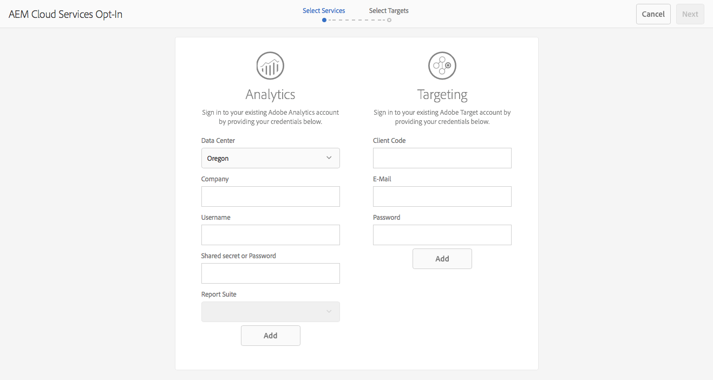

# 選擇使用Adobe Analytics和Adobe Target{#opting-into-adobe-analytics-and-adobe-target}

AEM有選擇加入程式，可協助您整合Adobe Analytics和Adobe Target。 這是現成可用的，作為指派給管理員使用者群組的預先載入任務。

當您以管理員身分登入時，[收件匣](/help/sites-authoring/inbox.md#out-of-the-box-administrative-tasks)中會提供此工作（**設定分析與鎖定目標**）。 它會根據您提供的憑證，協助您設定和整合這些服務。

設定整合時，您有下列選項：

* 透過任務設定整合。

   這可以立即執行，也可以稍後執行，任務將保留在收件箱中，直到執行某些操作。 無論是哪種情況，都可直接在UI中完成設定，或使用預先定義的`.properties`檔案完成設定。

* 選擇退出整合。

   如果您偏好[手動設定整合](/help/sites-administering/marketing-cloud.md)，請考慮此選項。 另請參閱[使用DTM](https://helpx.adobe.com/experience-manager/using/integrate-digital-marketing-solutions.html)將AEM與Adobe Target和Adobe Analytics整合。

* 使用指令碼來配置設定和布建。

## 配置整合{#configuring-the-integration}

選擇加入與的整合：

* Analytics，以啟用其頁面追蹤和分析功能。
* Target可啟用其個人化功能的使用。

對於任一選項，您都需要提供使用者帳戶資訊並指定要追蹤的頁面。

>[!NOTE]
>
>您可以選擇使用伺服器啟動時讀取的屬性檔案來提供Analytics和Target帳戶資訊。 請參閱[使用屬性檔案](/help/sites-administering/opt-in.md#providing-account-information-using-a-properties-file)提供帳戶資訊。

當您選擇加入整合時，AEM會執行下列工作：

* 建立雲端設定，以啟用與Analytics和Target的連線。
* 建立可判斷所追蹤資料的架構。
* 配置網頁以使用這些服務。

>[!NOTE]
>
>AT.js是預設的用戶端程式庫。 這是在您的[target雲端服務設定](/help/sites-administering/target-configuring.md#creating-a-target-cloud-configuration)下設定。
>
>Adobe建議您使用AT.js作為用戶端程式庫。

若要退出預先載入、現成可用的工作：

1. 從[收件匣中，選取並&#x200B;**開啟**&#x200B;設定Analytics和鎖定目標](/help/sites-authoring/inbox.md#taking-action-on-an-item)任務。

   

1. 針對Analytics:

   1. 輸入Analytics的使用者帳戶資訊，然後按一下對應的&#x200B;**Add**&#x200B;按鈕。
   1. 會驗證適當的憑證。
   1. 驗證Analytics帳戶時，請選取要使用的Analytics報表套裝。 AEM會擷取這些Analytics報表套裝。 狀態會更新為&#x200B;**Added**。

1. 針對Target:

   1. 輸入Target的使用者帳戶資訊，然後按一下對應的&#x200B;**Add**&#x200B;按鈕。
   1. 會驗證適當的憑證。 狀態會更新為&#x200B;**Added**。

1. 選擇&#x200B;**Next**。
1. 選取應使用Analytics和/或Target的網站。

1. 選擇&#x200B;**Done**&#x200B;以完成。

   >[!CAUTION]
   >
   >選擇加入設定後，您需要發佈受影響的網站/頁面，將這些變更複製到您的發佈執行個體。

## 退出整合{#opting-out-of-the-integration}

當您執行下列動作時，選擇退出與Analytics和Target的整合：

* 不想與這些產品整合。
* 偏好手動配置整合。

   如需手動設定整合的詳細資訊，請參閱[與Adobe Analytics整合](/help/sites-administering/adobeanalytics.md)和[與Adobe Target整合](/help/sites-administering/target.md)。

若要退出，您必須完成預先載入的工作：

* 從[收件匣中，選取並&#x200B;**完成**&#x200B;設定Analytics和鎖定目標](/help/sites-authoring/inbox.md#taking-action-on-an-item)任務。

## 使用屬性檔案{#providing-account-information-using-a-properties-file}提供帳戶資訊

安裝AEM在伺服器啟動時讀取的屬性檔案，以設定與Analytics和Target整合的帳戶屬性。 當您使用屬性檔案時，選擇加入精靈會自動使用檔案中的屬性，並據此建立雲端設定。

屬性檔案是名為marketingcloud.properties的文字檔案，您會儲存在AEM程式所使用的工作目錄中（通常與JAR檔案相同的目錄）。 檔案包含下列屬性：

* analytics.server:您使用的Analytics資料中心的URL。
* analytics.company:與您的Analytics使用者帳戶相關聯的公司。
* analytics.username:您的Analytics使用者名稱。
* analytics.secret:與您的Analytics使用者名稱相關聯的機密。
* analytics.reportsuite:要使用的Analytics報表套裝名稱。
* target.clientcode:與您的Target帳戶相關聯的用戶端代碼。
* target.email:用於驗證Target帳戶的電子郵件地址。
* target.password:與您的電子郵件地址相關聯的密碼。

屬性和值以等號(=)分隔。 Analytics屬性會加上前置詞`analytics`，而Target屬性會加上前置詞`target`。 若要設定服務，請提供該服務的所有屬性的值。 如果您不想設定服務，請不提供該服務的值。

下列範例`.properties`檔案包含用於為Analytics建立雲端設定的屬性值：

```xml
analytics.server=https://test.omniture.com/login/
analytics.company=MyCompany
analytics.username=sbroders
analytics.secret=12345678
analytics.reportsuite=myreportsuite
target.clientcode=
target.email=
target.password=
```

下列程式說明如何使用屬性檔案選擇加入整合。

1. 在AEM程式所使用的工作目錄（製作例項）中建立`marketingcloud.properties`檔案。

   >[!NOTE]
   >
   >工作目錄通常是保存jar或`license.properties`檔案的目錄。
   >
   >但是，它也可以由系統屬性定義為絕對路徑：
   >
   >`mac.provisioning.file.container`

1. 根據您的Analytics和/或Target帳戶新增屬性值。
1. 啟動或重新啟動伺服器，然後使用管理員帳戶登入。
1. 開啟「設定Analytics與鎖定目標」任務，如「設定整合」[所述。 ](/help/sites-administering/opt-in.md#configuring-the-integration)嚮導不使用您的帳戶資訊，而是使用`.properties`檔案中的值。

   選擇&#x200B;**添加**&#x200B;以獲取相應的服務，然後繼續執行嚮導。

   

## 關於雲配置{#about-the-cloud-configurations}

當您設定與Analytics和Target的整合時，AEM會自動建立必要的雲端設定和架構。 例如，Analytics雲端設定稱為布建的Analytics帳戶。

您不需要更改雲配置。 不過，您可以視需要設定架構。 (請參閱[使用Adobe Analytics屬性對應元件資料](/help/sites-administering/adobeanalytics-mapping.md)和[新增Target架構](/help/sites-administering/target.md)。)

>[!NOTE]
>
>依預設，當您選擇加入Adobe Target設定精靈時，會啟用「精確鎖定目標」。
>
>準確鎖定目標表示雲端服務設定會在載入內容前等待內容載入。 因此，就效能而言，精確鎖定目標可能會在載入內容前造成毫秒的延遲。
>
>一律會在製作例項上啟用正確鎖定目標。 不過，在發佈執行個體上，您可以清除雲端服務設定中「精確鎖定目標」旁的勾號(**http://localhost:4502/etc/cloudservices.html**)，以選擇全域關閉精確鎖定目標。 無論您在雲端服務設定中進行什麼設定，您仍可開啟或關閉個別元件的精確鎖定目標。
>
>如果您已經&#x200B;***建立了目標元件，並且您更改了此設定，則您所做的更改不會影響這些元件。***&#x200B;您必須直接對這些元件進行任何變更。

>[!CAUTION]
>
>當您選擇加入Analytics設定，並選取特定`reportsuite`時，架構會限制為發佈執行模式。 這表示追蹤只適用於發佈例項。
>
>如果製作例項需要追蹤，則值應變更為`all`。

## 通過指令碼{#configuring-the-setup-and-provisioning-via-script}配置設定和配置

作為管理員，您可能希望使用指令碼觸發設定和布建，而不是手動逐步執行精靈。 您可以透過下列方式執行此作業：

* 使用所需參數將POST請求傳送至&#x200B;**/libs/cq/cloudservicesprovisioning/content/autoprovisioning.json**。

您傳送的參數取決於下列項目：

* 如果您想使用填入所有必要憑證的&#x200B;**marketingcloud.properties**&#x200B;檔案，則必須傳送下列參數：

   * `automaticProvisioning`= `true`
   * `servicename`=  `analytics|target`
   * `path`=連結至AEM頁面以附加已建立的雲端服務設定的路徑

   例如，同時建立Analytics和Target設定並將其附加至we.retail頁面的curl請求將是：

   ```shell
   curl -v -u admin:admin -X POST -d"automaticProvisioning=true&servicename=target&servicename=analytics&path=/content/we-retail" http://localhost:4502/libs/cq/cloudservicesprovisioning/content/autoprovisioning.json
   ```

* 如果您不想使用&#x200B;**marketingcloud.properties**&#x200B;檔案，則必須傳送憑證及參數；例如：

   * automaticProvisioning= `true`
   * servicename= `analytics|target`
   * path=path至AEM頁面以附加已建立的雲端服務設定；可定義多個路徑
   * analytics.server= `https://servername`
   * analytics.company= `Name of company`
   * analytics.username= `me`
   * analytics.secret= `secret`
   * analytics.reportsuite= `we-retail`
   * target.clientcode= `mycompany`
   * target.email= `me@adobe.com`
   * target.password= `password`

   在此情況下，同時建立Analytics和Target設定並將其附加至we-retail頁面的curl請求將是：

   ```shell
   curl -v -u admin:admin -X POST -d"automaticProvisioning=false&servicename=target&servicename=analytics&path=/content/we-retail&analytics.server=https://servername/&analytics.company=Name of company&analytics.username=me&analytics.secret=secret&analytics.reportsuite=weretail&target.clientcode=mycompany&target.email=me@adobe.com&target.password=password" http://localhost:4502/libs/cq/cloudservicesprovisioning/content/autoprovisioning.json
   ```
