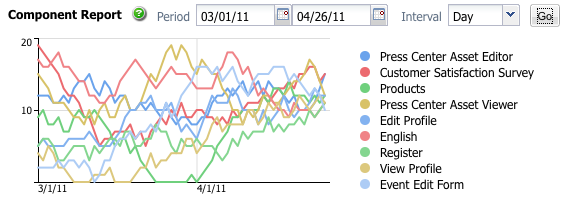

# 報告 {#reporting}

為協助您監控和分析執行個體的狀態，AEM提供一組預設報表，可針對個別需求進行設定：

* [元件報表](#component-report)
* [磁碟使用情況](#disk-usage)
* [運行狀況檢查](#health-check)
* [頁面活動報表](#page-activity-report)
* [使用者產生的內容報表](#user-generated-content-report)
* [使用者報表](#user-report)
* [工作流程例項報表](#workflow-instance-report)
* [工作流程報表](#workflow-report)

所有報表皆可從「工具」控 **制台存** 取。 在左 **側窗格中選取** 「報表」，然後按兩下右側窗格中的必要報表，以開啟報表供檢視和／或設定。

您也可以從「工具」主控台建立新的報 **表例項** 。 **在左**&#x200B;側窗格&#x200B;**中選擇報表，然後選**&#x200B;擇新建……從工具列中。 定義標 **題** 和名 **稱**，選取您需要的報表類型，然後按一下「 **建立」**。 您的新報表例項會出現在清單中。 按兩下此按鈕以開啟，然後從sidekick拖曳元件以建立第一欄並啟動報表定義。

>[!NOTE]
>
>除了現成可用的標準AEM報表外，您還可以開 [發自己的（全新）報表](/help/sites-developing/dev-reports.md)。

## 報表自訂的基本概念 {#the-basics-of-report-customization}

報表有多種格式。 下列報表都使用可自訂的欄，如下列各節所述：

* [元件報表](#component-report)
* [頁面活動報表](#page-activity-report)
* [使用者產生的內容報表](#user-generated-content-report)
* [使用者報表](#user-report)
* [工作流程例項報表](#workflow-instance-report)

>[!NOTE]
>
>下列各報表有其專屬的格式和自訂功能：
>
>
>* [Health Check](#health-check) uses selection fields to specify the data you want to report on.
>* [Disk Usage](#disk-usage) （磁碟使用）使用連結深入查看儲存庫結構。
>* [「工作流程](/help/sites-administering/reporting.md#workflow-report) 」報表提供執行個體上執行之工作流程的概述。
>
>
因此，列配置的下列過程不適用。 如需詳細資訊，請參閱個別報表的說明。

### 選擇和定位資料列 {#selecting-and-positioning-the-data-columns}

欄可以新增至標準或自訂的任何報表、重新放置在報表上或從報表中移除。

側 **點的** 「元件」索引標籤（可在報表頁面上使用）會列出所有可選為欄的資料類別。

要更改資料選擇：

* 若要新增欄，請將必要元件從sidekick拖放至您要的位置

   * 綠色勾號會指出位置有效的時間，而一對箭頭會指出位置的確切位置
   * 紅色的no-go符號會指出位置無效

* 若要移動欄，請按一下標題，按住並拖曳至新位置
* 若要移除欄，請按一下欄標題，按住並拖曳至報表標題區域（紅色減號會指出位置無效）;釋放滑鼠按鈕，「刪除元件」對話框將請求確認您確實要刪除該列。

### 欄下拉式功能表 {#column-drop-down-menu}

報表中的每一欄都有下拉式功能表。 當滑鼠游標移動至欄標題儲存格時，這會變為可見。

箭頭標題將出現在標題儲存格的最右側(不要與標題文字右側的箭頭標題混淆，箭頭標題會指出目前的排 [序機制](#sorting-the-data))。

功能表上可用的選項將視欄的設定而定（如在專案開發期間所做），任何無效的選項都會變灰。

### 排序資料 {#sorting-the-data}

資料可依特定欄來排序：

* 按一下適當的欄標題；排序將在遞增和遞減之間切換，在標題文字旁的箭頭標題指示
* 使用 [欄的下拉式選單](#column-drop-down-menu) ，特別選取「 **升序排序** 」或「 **降序排序」**;此外，標題文字旁的箭頭將會指出

### 群組與目前的資料圖表 {#groups-and-the-current-data-chart}

在適當的欄上，您可 **以從欄的下拉式選單中**[選取「依此欄分組」](#column-drop-down-menu)。 這會根據該欄內的每個不同值來分組資料。 您可以選取多個要分組的欄。 當欄中的資料不適當時，此選項會變灰；例如，每個項目都是不同且唯一的，因此不能形成任何群組，例如使用者報表的「使用者ID」欄。

至少將一欄分組後，會根據此分組 **產生「目前** 」資料的圓形圖。 如果將多欄分組，圖表上也會指出此點。

將游標移到圓形圖上方，將顯示適當區段的匯總值。 這使用當前為列定義的聚合；例如，計數、最小值、平均值等。

### 篩選和匯總 {#filters-and-aggregates}

在適當的欄上，您也可以從 **欄的下拉式選單** 中設定篩選設定和／或匯總 ****。

#### 濾鏡 {#filters}

「篩選設定」可讓您指定要顯示的項目標準。 可用的運算子有：

* `contains`
* `equals`

若要設定篩選：

1. 從下拉式清單中選取您要的運算子。
1. 輸入要篩選的文本。
1. 按一 **下套用**。

停用篩選：

1. 移除篩選文字。
1. 按一 **下套用**。

#### 聚合 {#aggregates}

您也可以選擇聚合方法（這些方法可能因所選列而異）:

### 欄屬性 {#column-properties}

只有在「使用者報表」中 [已使用「一般](#generic-column) 」欄時， [此選項才可用](#user-report)。

### 歷史資料 {#historic-data}

您可在「歷史資料」下方查看資料隨時間變 **更的圖表**。 這是從以常規間隔拍攝的快照派生的。

資料如下：

* 收集者（若有）是第一個排序的欄，否則是第一個（非分組）欄
* 依適當欄分組

可產生報表：

1. 在必 **要欄上** ，設定分組。
1. **編輯** 配置以定義快照的製作頻率；每小時或每日。
1. **** 完成……啟動快照集合的定義。

   左上角的紅色／綠色滑桿按鈕會指示正在收集快照。

結果圖表顯示在右下角：

資料收集開始後，您可以選取：

* **時段**

   您可以選取要顯示之報表資料的開始和結束日期。

* **間隔**

   可以選取月、周、日、小時作為報表的比例和匯總。

   例如，如果每日快照可用於2011年2月：

   * 如果間隔設定為 `Day`，則每個快照在圖表中顯示為單個值。
   * 如果間隔設定為， `Month`則二月的所有快照都將聚合到單個值中（在圖表中顯示為單個「點」）。

選取您的需求，然後按一 **下「執行** 」，將需求套用至報表。 要在建立更多快照後更新顯示，請再次單 **擊Go** 。

正在收集快照時，您可以：

* **使**&#x200B;用完成……重新初始化系列。

   **完成** 「凍結」報表的結構（即指派給報表的欄，以及分組、排序、篩選等欄）和啟動快照。

* 開啟「編 **輯** 」對話方塊，以選 **取「無資料快照** 」以終止收集，直到需要為止。

   **Edit** only switches the taking of snapshots on or off. 如果拍攝快照再次被開啟，則會使用報告上次完成時的狀態來拍攝更多快照。

>[!NOTE]
>
>快照儲存在路徑 `/var/reports/...` 的其餘部分鏡像各自報告的路徑和報告完成時建立的ID下。
>
>
>如果完全確定不再需要這些實例，則可以手動清除舊快照。

>[!NOTE]
>
>預先設定的報表不需要耗費大量的效能，但仍建議您在生產環境中使用每日快照。 如果可能，請在您網站上活動不多時，於一天中的某一時間執行這些每日快照；此參數可定義為 `Daily snapshots (repconf.hourofday)` Day CQ Reporting **Configuration的參數**;如需 [如何設定OSGI](/help/sites-deploying/configuring-osgi.md) 的詳細資訊，請參閱OSGI設定。

#### 顯示限制 {#display-limits}

歷史資料報表也可能因可設定的限制而在外觀上稍有變更，因為可根據所選時段的結果數目進行設定。

每條水準線都稱為系列（並對應於圖表圖例中的條目），每條垂直點列代表聚合快照。

要在較長的時間段內保持圖表清潔，可以設定限制。 對於標準報表，這些報表包括：

* 水準系列——預設和系統最大為 `9`

* 垂直聚合快照——預設為 `35` （每個水準系列）

因此，當超過（適當）限制時：

* 點不會顯示
* 歷史資料圖表的圖例可能顯示與當前資料圖表不同的條目數

自訂報表也可顯示所 **有系列** 的「總計」值。 這會顯示為系列（圖例中的水準線和條目）。

>[!NOTE]
>
>對於自訂報表，可以以不同方式設定限制。

### Edit (Report) {#edit-report}

「編 **輯** 」按鈕會開啟「編 **輯報表** 」對話方塊。

這是定義收集歷史資料快照的時段的 [位置](#historic-data) ，但也可以定義各種其它設定：

* **標題**

   您可以定義自己的標題。

* **說明**

   您可以定義自己的說明。

* **根路徑** (*僅對特定報表啟用*)

   使用此選項可將報告限制在儲存庫的（子）部分。

* **報表處理**

   * **自動重新整理資料**

      每次您更新報表定義時，報表資料都會重新整理。

   * **手動重新整理資料**

      此選項可用於防止當有大量資料時由自動刷新操作引起的延遲。

      選取此選項表示報表設定的任何方面變更時，必須手動重新整理報表資料。 這也表示，當您變更設定的任何方面時，報表表格都會被遮蔽掉。

      選取此選項時，將 **[會顯示](#load-data)**「載入資料」按鈕(在報&#x200B;**表的「編輯**」旁)。**載入資料**，將載入資料並重新整理顯示的報表資料。

* **Snapshots** You can define how fecury snapshots are to be made;每日、每小時或完全不是。

### 載入資料 {#load-data}

只有在 **從「編輯」中選** 取手動重新整理資料 **，才會顯示「載入資** 料」按鈕 ****。

按一下「 **載入資料** 」會重新載入資料並更新顯示的報表。

選擇手動刷新資料表示：

1. 一旦變更報表設定，報表資料的表格就會被遮蔽掉。

   例如，如果更改列的排序機制，則不會顯示資料。

1. 如果您想要再次顯示報表資料，您必須按一下「載入 **資料** 」以重新載入資料。

### Finish (report) {#finish-report}

完成報 **表** :

* 截至該時 *間點的報告定義將用於建立快照* （隨後，您可以繼續處理報告定義，因為它與快照分開）。
* 將刪除任何現有快照。
* 會收集新快照以用於歷史 [資料](#historic-data)。

使用此對話方塊，您可以定義或更新產生報表的標題和說明。

## 報表類型 {#report-types}

### 元件報表 {#component-report}

元件報表會提供您網站使用元件的相關資訊。

[有關](#selecting-and-positioning-the-data-columns) :

* 作者
* 元件路徑
* 元件類型
* 上次修改時間
* 頁面

這表示您可以看到，例如：

* 哪些元件用在何處。

   例如，在測試時很實用。

* 特定元件的例項分佈方式。

   如果特定頁面(即&quot;heavy pages&quot;)遇到效能問題。

* 識別網站中頻繁／較不頻繁的變更。
* 瞭解頁面內容如何隨著時間發展。

所有元件均隨附於產品標準和專案。 使用「 **編輯** 」對話框，用戶還可以設定定義報表起點的根路徑 **** -該根目錄下的所有元件均被考慮用於報表。

### 磁碟使用情況 {#disk-usage}

磁碟使用情況報告顯示有關儲存在儲存庫中的資料的資訊。

報告在儲存庫的根(/)中啟動；通過按一下特定的分支，您可以在儲存庫內深入查看（當前路徑將反映在報告標題中）。

### Health Check {#health-check}

此報表會分析目前的請求記錄：

`<cq-installation-dir>/crx-quickstart/logs/request.log`
以協助您識別指定時段內最昂貴的請求。

若要產生報表，您可以指定：

* **期間（小時）**

   要分析的小時數（過去）。

   預設: `24`

* **最大值. 結果**

   輸出行數上限。

   預設: `50`

* **最大值. 請求**

   要分析的最大請求數。

   預設值： `-1` （全部）

* **電子郵件地址**

   傳送結果至電子郵件地址。

   可選；預設值：空白

* **每日運行於(hh:mm)**

   指定報表每日自動執行的時間。

   可選；預設值：空白

### 頁面活動報表 {#page-activity-report}

頁面活動報表會列出頁面及其上所執行的動作。

[有關](#selecting-and-positioning-the-data-columns) :

* 頁面
* 時間
* 類型
* 使用者

表示您可以監控：

* 最新修改。
* 在特定頁面上工作的作者。
* 最近未修改的頁面，因此可能需要採取行動。
* 最常／最不常變更的頁面。
* 最多／最不活躍的使用者。

頁面活動報表會從稽核記錄檔中擷取其所有資訊。 預設情況下，根路徑配置為審計日誌的位置 `/var/audit/com.day.cq.wcm.core.page`。

### 使用者產生的內容報表 {#user-generated-content-report}

本報告提供使用者產生內容的相關資訊；無論是評論、評分還是論壇。

[以下列資訊](#selecting-and-positioning-the-data-columns) :

* 日期
* IP 位址
* 頁面
* 反向連結
* 類型
* 使用者識別碼

允許您：

* 瞭解哪些頁面收到的留言最多。
* 取得特定網站訪客離開的所有留言的概述，可能是問題相關的。
* 判斷新內容是否在頁面上發表意見時，透過監控來引發意見。

### 使用者報表 {#user-report}

此報告提供所有已註冊帳戶及／或設定檔的使用者的相關資訊；這可包括組織內的作者和外部訪客。

[關於](#selecting-and-positioning-the-data-columns) :

* 年齡
* 國家/地區
* 網域
* 電子郵件
* 姓氏
* 性別
* [通用](#generic-column)
* 名字
* 資訊
* 興趣
* 語言
* NTLM 雜湊碼
* 使用者 ID

允許您：

* 查看您使用者的人口分佈。
* 報告您已新增至描述檔的自訂欄位。

#### Generic Column {#generic-column}

「使 **用者報表** 」中有「一般」欄位，讓您可以存取自訂資訊，通常是從使用者 [資料中存取](/help/sites-administering/identity-management.md#profiles-and-user-accounts);例如，「 [收藏色」，如「將欄位添加到配置檔案定義」下詳述](/help/sites-administering/identity-management.md#adding-fields-to-the-profile-definition)。

當您執行下列任一操作時，「一般」(Generic)欄對話方塊將會開啟：

* 將「一般」元件從側腳拖曳至報表。
* 為現有的「通用」列選擇「列屬性」。

在「定 **義** 」標籤中，您可以定義：

* **標題**

   您自己的一般欄標題。

* **屬性**

   儲存在儲存庫中的屬性名稱，通常位於用戶的配置檔案中。

* **路徑**

   通常屬性取自 `profile`。

* **類型**

   從、、、、中選 `String`擇字 `Number`段 `Integer`類型 `Date`。

* **預設聚合**

   如果列在至少具有一個分組列的報告中取消分組，則預設情況下會定義所使用的聚合。 從、、、、、中選 `Count`擇所需 `Minimum`的聚合 `Average``Maximum``Sum`。

   例如，字 *段的計數* ，表示在聚合狀態中，會顯 `String``String` 示列的不同值數。

在「延 **伸** 」索引標籤中，您也可以定義可用的匯總和篩選：

### 工作流程例項報表 {#workflow-instance-report}

這可提供您簡明的概觀，提供有關執行和完成的個別工作流程例項的資訊。

[有關](#selecting-and-positioning-the-data-columns) :

* 完成
* 持續時間
* 發起人
* 模型
* 裝載
* 已開始
* 狀態

意思是您可以：

* 監控工作流程的平均持續時間；如果這種情況經常發生，則會反白顯示工作流程的問題。

### 工作流程報表 {#workflow-report}

這可提供執行個體上執行之工作流程的主要統計資料。

## 在發佈環境中使用報表 {#using-reports-in-a-publish-environment}

在您根據特定需求設定報表後，您就可以啟動報表，將組態傳輸至發佈環境。

>[!CAUTION]
>
>如果您想要 **發佈環境的歷史資料** ，請先在 **啟動頁面之前** ，先完成作者環境的報表。

然後，您就可在

`/etc/reports`

例如，「使用者產生的內容」報表可在下列位置找到：

`http://localhost:4503/etc/reports/ugcreport.html`

現在會報告從發佈環境收集到的資料。

由於發佈環境不允許任何報表設定，因此「編 **輯** 」和「 **完成** 」按鈕不可用。 不過，如果要收集快照， **則可以為「歷** 史資料」報表選擇「時段 **」和「間隔****** 」。

>[!CAUTION]
>
>存取這些報告可能是安全問題；因此，我們建議您配置Dispatcher，以便 `/etc/reports` 外部訪客無法使用。 如需詳細 [資訊，請參閱安全性檢查清單](security-checklist.md) 。

## 執行報表所需的權限 {#permissions-needed-for-running-reports}

所需的權限取決於操作：

* 報表資料基本上是使用目前使用者的權限來收集。
* 歷史資料會使用完成報表的使用者權限來收集。

在標準AEM安裝中，報表的下列權限是預設的：

* **使用者報表**

   `user administrators` -讀取和寫入

* **頁面活動報表**

   `contributors` -讀取和寫入

* **元件報表**

   `contributors` -讀取和寫入

* **使用者產生的內容報表**

   `contributors` -讀取和寫入

* **工作流程例項報表**

   `workflow-users` -讀取和寫入

群組的所有成員 `administrators` 都擁有建立新報表的必要權限。
