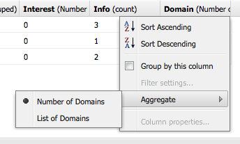
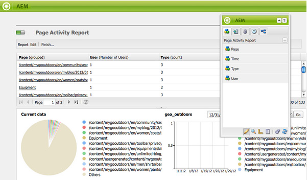
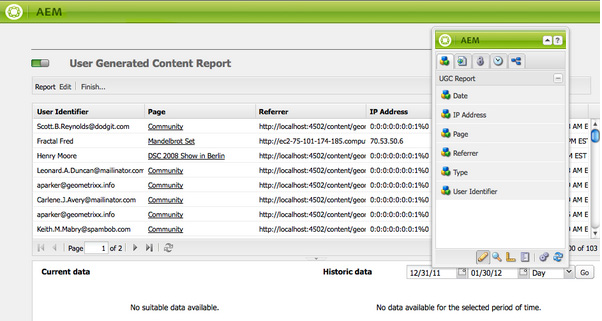

# 報告 {#reporting}

為幫助您監視和分析實例的狀態，AEM提供了選擇的預設報告，這些報告可根據您的個別要求進行配置：

* [元件報表](#component-report)
* [磁碟使用情況](#disk-usage)
* [運行狀況檢查](#health-check)
* [頁面活動報表](#page-activity-report)
* [使用者產生的內容報表](#user-generated-content-report)
* [使用者報表](#user-report)
* [工作流程例項報表](#workflow-instance-report)
* [工作流報告](#workflow-report)

>[!NOTE]
>
>這些報告僅在經典用戶介面中可用。 有關現代UI中的系統監視和報告，請參見 [操作儀表板。](/help/sites-administering/operations-dashboard.md)

所有報告都可以從 **工具** 控制台。 選擇 **報告** 在左窗格中，然後按兩下右窗格中所需的報告以將其開啟，以便查看和/或配置。

也可以從 **工具** 控制台。 選擇 **報告** 在左窗格中， **新建……** 的子菜單。 定義 **標題** 和 **名稱**，選擇所需的報告類型，然後按一下 **建立**。 您的新報告實例將出現在清單中。 按兩下此按鈕以開啟，然後從邊框拖動元件以建立第一列並啟動報告定義。

>[!NOTE]
>
>除了現成的AEM標準報告外，您還可以 [編寫您自己（完全新的）報告](/help/sites-developing/dev-reports.md)。

## 報表定製的基礎 {#the-basics-of-report-customization}

有各種報告格式。 以下報告都使用可自定義的列，如以下各節所詳述：

* [元件報表](#component-report)
* [頁面活動報表](#page-activity-report)
* [使用者產生的內容報表](#user-generated-content-report)
* [使用者報表](#user-report)
* [工作流程例項報表](#workflow-instance-report)

>[!NOTE]
>
>以下各報告都有各自的格式和自定義：
>
>
>* [運行狀況檢查](#health-check) 使用選擇欄位指定要報告的資料。
>* [磁碟使用情況](#disk-usage) 使用連結可深入查看儲存庫結構。
>* [工作流報告](/help/sites-administering/reporting.md#workflow-report) 概述了在實例上運行的工作流。
>
>因此，列配置的以下過程不適用。 有關各個報表的詳細資訊，請參閱其說明。

### 選擇和定位資料列 {#selecting-and-positioning-the-data-columns}

列可以添加到任何報表（標準報表或自定義報表）、在其中重新定位列或從其中刪除列。

的 **元件** 頁籤（可在報告頁上使用）中列出可選為列的所有類別的資料。

要更改資料選擇：

* 要添加新列，請將所需元件從旁邊拖動，然後放到您想要的位置

   * 綠色勾選將指示位置何時有效，一對箭頭將指明位置的確切位置
   * 紅色的nogo符號將指示位置無效的時間

* 要移動列，請按一下標題，按住並拖動到新位置
* 要刪除列，請按一下列標題，按住並拖到報表標題區域（紅色減號表示該位置無效）;釋放滑鼠按鈕，「刪除元件」對話框將請求確認您確實要刪除該列。

### 列下拉菜單 {#column-drop-down-menu}

報告中的每列都有一個下拉菜單。 當滑鼠游標移動到列標題單元格上時，此選項將變為可見。

箭頭將出現在標題單元格的最右側(不要與標題文本右側的箭頭頭混淆，該箭頭指示 [當前排序機制](#sorting-the-data))。

菜單上可用的選項將取決於列的配置（如項目開發期間所做的），任何無效的選項都將灰顯。

### 對資料排序 {#sorting-the-data}

資料可以按以下任一方式按特定列排序：

* 按一下相應的列標題；排序將在升序和降序之間切換，標題文本旁邊的箭頭指示
* 使用 [列的下拉菜單](#column-drop-down-menu) 具體選擇 **升序排序** 或 **降序排序**;再次，標題文本旁邊的箭頭將指示此項

### 組和當前資料圖表 {#groups-and-the-current-data-chart}

在適當的列上，可以選擇 **按此列分組** 從 [列的下拉菜單](#column-drop-down-menu)。 這將根據該列中的每個不同值對資料進行分組。 可以選擇多個要分組的列。 當列中的資料不適當時，該選項將呈灰色顯示；即，每個條目都是獨特和唯一的，因此不能形成任何組，例如用戶報告的「用戶ID」列。

至少已將一列分組後，將餅圖 **當前資料** 將基於此分組生成。 如果對多個列進行分組，則圖表上也會指明此情況。

將游標移到餅圖上將顯示相應段的聚合值。 這使用當前為列定義的聚合；例如，計數、最小值、平均值等。

### 篩選器和聚合 {#filters-and-aggregates}

在相應的列上，您還可以配置 **篩選器設定** 和/或 **聚合** 從 [列的下拉菜單](#column-drop-down-menu)。

#### 篩選條件 {#filters}

「篩選器設定」允許您指定要顯示的條目的條件。 可用的運算子包括：

* `contains`
* `equals`

設定篩選器：

1. 從下拉清單中選擇所需的運算子。
1. 輸入要篩選的文本。
1. 按一下 **應用**。

要停用篩選器：

1. 刪除篩選器文本。
1. 按一下 **應用**。

#### 聚合 {#aggregates}

您還可以選擇聚合方法（這些方法可能因所選列而異）:

### 欄屬性 {#column-properties}

此選項僅在 [泛型列](#generic-column) 已用於 [用戶報告](#user-report)。

### 歷史資料 {#historic-data}

您的資料隨時間變化的圖表可在以下 **歷史資料**。 這是從按常規間隔拍攝的快照中派生的。

資料是：

* 收集者（如果可用）第一個已排序列，否則是第一個（非分組）列
* 按相應列分組

可以生成報告：

1. 設定 **分組** 的子菜單。
1. **編輯** 定義快照的製作頻率的配置；每小時或每天。
1. **完成……** 啟動快照集合的定義。

   左上角的紅色/綠色滑塊按鈕指示正在收集快照的時間。

結果圖表顯示在右下角：

開始資料收集後，您可以選擇：

* **時段**

   您可以為要顯示的報表資料選擇起始日期和終止日期。

* **間隔**

   可以為報表的規模和聚合選擇月、周、日、小時。

   例如，如果2011年2月提供每日快照：

   * 如果間隔設定為 `Day`，每個快照在圖表中顯示為單個值。
   * 如果間隔設定為 `Month`，二月份的所有快照都聚合為一個值（在圖表中顯示為一個「點」）。

選擇您的要求，然後按一下 **開始** 將其應用到報表。 要在建立更多快照後更新顯示，請按一下 **開始** 的雙曲餘切值。

收集快照時，您可以：

* 使用 **完成……** 重新初始化集合。

   **完成** 「凍結」報表的結構（即分配給報表的列，這些列被分組、排序、篩選等） 開始拍快照。

* 開啟 **編輯** 對話框，選擇 **無資料快照** 終止收集，直到需要。

   **編輯** 只切換快照的拍攝。 如果重新開啟快照，則使用上次完成時報告的狀態來拍攝更多快照。

>[!NOTE]
>
>快照儲存在 `/var/reports/...` 其中，路徑的其餘部分鏡像了報告完成時建立的相應報告的路徑和ID。
>
>
>如果您完全確定不再需要這些實例，則可以手動清除舊快照。

>[!NOTE]
>
>預配置的報告不會佔用大量的效能，但仍建議在生產環境中使用每日快照。 如果可能，在您的網站上沒有多少活動時運行這些每日快照；可以用 `Daily snapshots (repconf.hourofday)` 參數 **第CQ天報告配置**;見 [OSGI配置](/help/sites-deploying/configuring-osgi.md) 的子菜單。

#### 顯示限制 {#display-limits}

歷史資料報告還可能由於可以根據所選期間的結果數設定限制而在外觀上略有變化。

每條水準線都稱為系列（與圖表圖例中的條目對應），每個垂直點清單示聚合的快照。

要使圖表在較長的時間段內保持乾淨，可以設定限制。 對於標準報表，這些報告包括：

* 水準系列 — 預設和系統最大值 `9`

* 垂直聚合快照 — 預設 `35` （每水準系列）

因此，當超過（適當）限制時：

* 點不會顯示
* 歷史資料圖表的圖例可能顯示與當前資料圖表不同的條目數

自定義報告還可以顯示 **合計** 值。 這顯示為系列（圖例中的水準線和條目）。

>[!NOTE]
>
>對於自定義報告，可以不同地設定限制。

### 編輯（報表） {#edit-report}

的 **編輯** 按鈕 **編輯報告** 對話框。

這是收集快照的期間所在的一個位置 [歷史資料](#historic-data) 定義，但還可以定義各種其他設定：

* **標題**

   您可以定義自己的標題。

* **說明**

   您可以定義自己的描述。

* **根路徑** (*僅對某些報告處於活動狀態*)

   使用此選項可將報告限制在儲存庫的（子）部分。

* **報表處理**

   * **自動重新整理資料**

      每次更新報表定義時，都會刷新報表資料。

   * **手動重新整理資料**

      此選項可用於防止在有大量資料時自動刷新操作導致的延遲。

      選擇此選項表示在報告配置的任何方面發生更改時必須手動刷新報告資料。 這還意味著，一旦更改了配置的任何方面，報告表將被遮蔽。

      選擇此選項時， **[載入資料](#load-data)** 按鈕(位於 **編輯** )。 **載入資料** 將載入資料並刷新顯示的報告資料。

* **快照**
您可以定義建立快照的頻率；每天、每小時或根本不是。

### 載入資料 {#load-data}

的 **載入資料** 按鈕僅在 **手動刷新資料** 已從 **[編輯](#edit-report)**。

按一下 **載入資料** 將重新載入資料並更新顯示的報告。

選擇手動刷新資料意味著：

1. 一旦更改了報告配置，報告資料表將被遮蔽。

   例如，如果更改列的排序機制，則不會顯示資料。

1. 如果希望再次顯示報告資料，則需要按一下 **載入資料** 重新載入資料。

### 完成（報告） {#finish-report}

當你 **完成** 報告：

* 報表定義 *在那個時刻* 將用於拍攝快照（然後，您可以繼續處理報告定義，因為報告定義與快照分開）。
* 將刪除任何現有快照。
* 為 [歷史資料](#historic-data)。

通過此對話框，您可以定義或更新生成報告的標題和說明。

## 報告類型 {#report-types}

### 元件報表 {#component-report}

元件報告提供有關網站如何使用這些元件的資訊。

[資訊列](#selecting-and-positioning-the-data-columns) 關於：

* 作者
* 元件路徑
* 元件類型
* 上次修改時間
* Page

表示您可以看到，例如：

* 哪些元件在何處使用。

   例如，在測試時非常有用。

* 特定元件實例的分佈方式。

   如果特定頁面(即「繁頁」)遇到效能問題。

* 確定站點中頻繁/較少更改的部分。
* 查看頁面內容如何隨時間推移而發展。

包括所有元件，產品標準和項目特定。 使用 **編輯** 對話框用戶還可以設定 **根路徑** 定義報告起始點的元件 — 該根下的所有元件均被考慮用於報告。

 

### 磁碟使用情況 {#disk-usage}

磁碟使用情況報告顯示有關儲存在儲存庫中的資料的資訊。

報告從儲存庫的根(/)開始；通過按一下某個特定分支，您可以在儲存庫內進行向下鑽取（當前路徑將反映在報表標題中）。

### 運行狀況檢查 {#health-check}

此報表分析當前請求日誌：

`<cq-installation-dir>/crx-quickstart/logs/request.log`
幫助您確定給定期間內最昂貴的請求。

要生成報表，您可以指定：

* **期間（小時）**

   要分析的小時數（過去）。

   預設: `24`

* **最大值. 結果**

   輸出行的最大數。

   預設: `50`

* **最大值. 請求**

   要分析的請求的最大數量。

   預設值： `-1` （全部）

* **電子郵件地址**

   將結果發送到電子郵件地址。

   可選；預設值：空白

* **每日運行時間(hh:mm)**

   指定報告每天自動運行的時間。

   可選；預設值：空白

### 頁面活動報表 {#page-activity-report}

頁面活動報告列出頁面以及對頁面執行的操作。

[資訊列](#selecting-and-positioning-the-data-columns) 關於：

* Page
* 時間
* 類型
* 使用者

表示您可以監視：

* 最新修改。
* 在特定頁面上工作的作者。
* 最近未修改的頁面，因此可能需要執行操作。
* 更改次數最多/最少的頁面。
* 最/最少活動用戶。

頁面活動報告從審核日誌中獲取其所有資訊。 預設情況下，根路徑配置為位於的審核日誌 `/var/audit/com.day.cq.wcm.core.page`。

### 使用者產生的內容報表 {#user-generated-content-report}

本報告提供有關用戶生成內容的資訊；評論、評級或論壇。

[資訊列](#selecting-and-positioning-the-data-columns) 上：

* 日期
* IP 位址
* Page
* 反向連結
* 類型
* 使用者識別碼

允許您：

* 查看哪些頁面接收的評論最多。
* 獲取特定站點訪問者要離開的所有評論的概述，可能是相關問題。
* 通過監視在頁面上發表評論時是否正在激發評論來判斷新內容。

### 使用者報表 {#user-report}

此報告提供有關已註冊帳戶和/或配置檔案的所有用戶的資訊；這可以包括您組織內的作者和外部訪問者。

[資訊列](#selecting-and-positioning-the-data-columns) （如果可用）關於：

* 年齡
* 國家/地區
* 網域
* 電子郵件
* 姓氏
* 性別
* [通用](#generic-column)
* 名字
* 資訊
* 興趣
* 語言
* NTLM 雜湊碼
* 使用者 ID

允許您：

* 查看用戶的人口分佈。
* 報告已添加到配置檔案的自定義欄位。

#### 泛型列 {#generic-column}

的 **泛型** 列在「用戶報表」中可用，以便您可以訪問自定義資訊(通常從 [用戶配置檔案](/help/sites-administering/identity-management.md#profiles-and-user-accounts);比如說， [將欄位添加到配置檔案定義下詳細列出的收藏夾顏色](/help/sites-administering/identity-management.md#adding-fields-to-the-profile-definition)。

在以下情況下，將開啟「泛型」(Generic)列對話框：

* 將「一般」元件從旁邊拖到報表。
* 選擇現有「一般」列的「列屬性」。

從 **定義** 頁籤：

* **標題**

   您自己的泛型列標題。

* **屬性**

   儲存在儲存庫中的屬性名稱，通常位於用戶的配置檔案中。

* **路徑**

   通常，屬性取自 `profile`。

* **類型**

   從中選擇欄位類型 `String`。 `Number`。 `Integer`。 `Date`。

* **預設聚合**

   如果列在至少包含一個分組列的報告中取消分組，則預設定義使用的聚合。 從中選擇所需的聚合 `Count`。 `Minimum`。 `Average`。 `Maximum`。 `Sum`。

   比如說， *計數* 為 `String` 欄位表示不同的 `String` 將為處於聚合狀態的列顯示值。

在 **擴展** 頁籤，您還可以定義可用的聚合和篩選器：

### 工作流程例項報表 {#workflow-instance-report}

這將為您提供一個簡潔的概述，提供有關運行和完成的工作流的各個實例的資訊。

[資訊列](#selecting-and-positioning-the-data-columns) 關於：

* 完成
* 持續時間
* 發起人
* 模型
* 裝載
* 已開始
* 狀態

意思是你可以：

* 監控工作流的平均持續時間；如果經常發生這種情況，則可能會突出顯示工作流的問題。

### 工作流報告 {#workflow-report}

這提供了有關在實例上運行的工作流的關鍵統計資訊。

## 在發佈環境中使用報表 {#using-reports-in-a-publish-environment}

將報告配置為符合您的特定要求後，您就可以將其激活以將配置傳輸到發佈環境。

>[!CAUTION]
>
>如果你想 **歷史資料** 為發佈環境，然後 **完成** 在激活頁面之前有關作者環境的報告。

然後，可在以下網站訪問相應報告：

`/etc/reports`

例如，「User Generated Content（用戶生成的內容）」報告可在以下位置找到：

`http://localhost:4503/etc/reports/ugcreport.html`

現在，它將報告從發佈環境收集的資料。

由於發佈環境中不允許進行任何報表配置，因此 **編輯** 和 **完成** 按鈕不可用。 但是，您可以選擇 **期間** 和 **間隔** 為 **歷史資料** 報告是否正在收集快照。

>[!CAUTION]
>
>訪問這些報告可能是一個安全問題；因此，我們建議您配置Dispatcher以便 `/etc/reports` 外部訪問者不能訪問。 查看 [安全核對表](security-checklist.md) 的子菜單。

## 運行報告所需的權限 {#permissions-needed-for-running-reports}

所需權限取決於操作：

* 基本上使用當前用戶的權限收集報表資料。
* 使用完成報告的用戶的權限收集歷史資料。

在標準安AEM裝中，預設了以下報告權限：

* **使用者報表**

   `user administrators`  — 讀寫

* **頁面活動報表**

   `contributors`  — 讀寫

* **元件報表**

   `contributors`  — 讀寫

* **使用者產生的內容報表**

   `contributors`  — 讀寫

* **工作流程例項報表**

   `workflow-users`  — 讀寫

所有成員 `administrators` 組具有建立新報告所需的權限。
