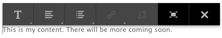

# 設定Rich Text Editor {#configure-the-rich-text-editor}

富格文本編輯器(RTE)為作者提供了多種編輯其文本內容的功能。 提供圖示、選擇方塊、工具列和選單，以提供WYSIWYG文字編輯體驗。

RTE可以配置為啟用、禁用和擴展編寫元件中可用的功能。 要瞭解如何使用RTE功能進行編寫，請參 [閱Use Rich Text Editor for authoring](/help/sites-authoring/rich-text-editor.md)。

以下工作流說明了完成RTE配置任務的建議順序。

*Figure的步驟順序：學習如何配置RTE的步驟順序*

## 瞭解可觸控的UI和傳統UI {#understand-touch-enabled-ui-and-classic-ui}

Touch-enabled UI是AEM的標準使用者介面。 Adobe針對製作環境推出具 [互動式設計](/help/sites-authoring/responsive-layout.md) 的Touch UI。 Touch UI是專為觸控和桌上型裝置所設計。 UI與原始的傳統UI有很大不同。

*圖：啟用觸控的UI中的豐富型文字編輯器工具列*

*具列：Classic UI中的Rich Text Editor工具列*

>[!MORELIKETHIS]
>
>* [UI建議](/help/sites-deploying/ui-recommendations.md)
>* 關於取代Classic UI，請參 [閱AEM 6.5發行說明](/help/release-notes/deprecated-removed-features.md)
>* 如需UI之間的差異，請參 [閱Touch UI和Classic UI](https://aemcq5pedia.wordpress.com/2018/01/05/touch-enabled-ui-aem6-3/)
>* 若要詳細瞭解啟用觸控的UI，請參閱「AEM Touch UI [的概念」](/help/sites-developing/touch-ui-concepts.md)


## 各種編輯模式 {#editingmodes}

作者可以使用不同的元件模式，在AEM中建立和編輯文字內容。 用於編寫和格式化內容的工具欄選項以及不同編輯模式下啟用RTE的元件的用戶體驗會因RTE配置而異。

| 編輯模式 | 編輯區域 | 建議啟用的功能 | Touch UI | 傳統 UI |
|--- |--- |--- |--- |--- |
| 內嵌 | 就地編輯，以快速進行小幅編輯；格式，不開啟對話方塊 | 最低RTE功能 | Y | Y |
| RTE全螢幕 | 涵蓋整個頁面 | 所有必要的RTE功能 | Y | N |
| 對話方塊 | 對話框，但不涵蓋整個頁面 | Classic UI中所有必需的RTE功能；審慎地啟用Touch UI中的功能 | Y | Y |
| 全螢幕對話方塊 | 與全螢幕模式相同；包含RTE旁邊對話框的欄位 | 所有必要的RTE功能 | Y | N |

>[!NOTE]
>
>在啟用觸控的UI中，內嵌編輯模式中無法使用來源編輯功能。 您無法以全螢幕模式拖曳影像。 所有其他功能都適用於所有模式。

### 內嵌編輯 {#inline-editing}

開啟時（點選／按一下速度緩慢），您可在頁面內編輯內容。 給出了一個具有非常基本選項的緊湊的工具欄。

*圖：使用觸控式UI中的基本工具列進行內嵌編輯*

在Classic UI中，按兩下元件時速度緩慢，可進行內嵌編輯，而橘色的外框會反白顯示內容。 如果Content Finder已開啟，則窗口頂部將顯示一個帶有可用RTE格式設定選項的工具欄。 如果未開啟「內容搜尋器」，則不會顯示格式選項，您只能進行基本文字編輯。

### 全螢幕編輯 {#full-screen-editing}

AEM元件可在全螢幕檢視中開啟，隱藏頁面內容並佔據可用螢幕。 請考慮使用全螢幕編輯功能來編輯內嵌編輯的詳細版本，因為它提供最多的編輯選項。 使用內嵌編輯模式時，可 ，以開啟它。

在對話框全屏模式中，以及詳細的RTE工具欄中，還提供了對話框中可用的選項和元件。 它僅適用於包含RTE和其他元件的對話框。

*欄：在啟用觸摸屏的UI中以全屏模式編輯時的詳細RTE工具欄*

### 對話框編輯 {#dialog-editing}

當元件按兩下時，會開啟對話方塊以編輯內容。 對話框在現有頁面的頂部開啟。 在某些特定情況下，對話方塊會以快顯視窗的形式開啟。 例如，當「文字」元件是多欄頁面版面中欄的一部分，而對話方塊的可用區域較少時。

*模式：啟用觸控的UI中的對話編輯模式*

*圖：Classic UI中包含編輯詳細工具列的對話框*

## 關於RTE插件和相關功能 {#aboutplugins}

此功能可透過一系列外掛程式提供，每個外掛程式都包含：

* 屬 `features` 性：

   * 用於啟用或停用該外掛程式的基本功能
   * 可使用標準化程式進行設定

* 視情況需要額外的屬性和選項，需要特殊配置。

RTE的基本功能是由相應插件專用節點上 `features` 的屬性值激活或停用的。

下表列出目前的外掛程式，其中顯示：

* 具有API檔案連結的外掛程式ID。 啟用外掛程式時，ID會 [用作節點名稱](/help/sites-administering/configure-rich-text-editor-plug-ins.md#activateplugin)。
* 屬性的允許 `features` 值。
* 外掛程式提供的功能說明。


| 外掛程式ID | 功能 | 說明 |
|--- |--- |--- |
| 編輯 | 剪下複製貼上——預設貼上-plaintext paste-wordhtml | [剪下、複製和三種貼上模式](/help/sites-administering/configure-rich-text-editor-plug-ins.md#textstyles)。 |
| [findreplace](https://helpx.adobe.com/experience-manager/6-5/sites/developing/using/reference-materials/widgets-api/index.html?class=CQ.form.rte.plugins.FindReplacePlugin) | 尋找取代 | 尋找和取代。 |
| [格式](https://helpx.adobe.com/experience-manager/6-5/sites/developing/using/reference-materials/widgets-api/index.html?class=CQ.form.rte.plugins.FormatPlugin) | 粗斜體下划線 | [基本文字格式](/help/sites-administering/configure-rich-text-editor-plug-ins.md#textstyles)。 |
| [影像](https://helpx.adobe.com/experience-manager/6-5/sites/developing/using/reference-materials/widgets-api/index.html?class=CQ.form.rte.plugins.ImagePlugin) | 影像 | 基本影像支援（從內容或內容搜尋器拖曳）。 根據瀏覽器，支援對作者有不同的行為 |
| [鍵](https://helpx.adobe.com/experience-manager/6-5/sites/developing/using/reference-materials/widgets-api/index.html?class=CQ.form.rte.plugins.KeyPlugin) |  | 要定義此值，請參 [閱標籤大小](/help/sites-administering/configure-rich-text-editor-plug-ins.md#tabsize)。 |
| [證明](https://helpx.adobe.com/experience-manager/6-5/sites/developing/using/reference-materials/widgets-api/index.html?class=CQ.form.rte.plugins.JustifyPlugin) | justifleft justifcenter justifyright | 段落對齊。 |
| [連結](https://helpx.adobe.com/experience-manager/6-5/sites/developing/using/reference-materials/widgets-api/index.html?class=CQ.form.rte.plugins.LinkPlugin) | modifylink unlink andlock | [超連結和錨點](/help/sites-administering/configure-rich-text-editor-plug-ins.md#linkstyles)。 |
| [清單](https://helpx.adobe.com/experience-manager/6-5/sites/developing/using/reference-materials/widgets-api/index.html?class=CQ.form.rte.plugins.ListPlugin) | 有序無序縮進 | 此外掛程式可控制縮 [排和清單](/help/sites-administering/configure-rich-text-editor-plug-ins.md#indentmargin);包括巢狀清單。 |
| [misctools](https://helpx.adobe.com/experience-manager/6-5/sites/developing/using/reference-materials/widgets-api/index.html?class=CQ.form.rte.plugins.MiscToolsPlugin) | specialchars sourceedit | 其他工具可讓作者輸入 [特殊字元](/help/sites-administering/configure-rich-text-editor-plug-ins.md#spchar) ，或編輯HTML來源。 此外，如果您想要定義 [自己的清單](/help/sites-administering/configure-rich-text-editor-plug-ins.md#definerangechar) ，也可以新增一整組特殊字元。 |
| Paraformat | paraformat | 預設段落格式為段落、標題1、標題2和標題3(`<p>`、 `<h1>`、 `<h2>`和 `<h3>`)。 您可以 [新增更多段落格式](/help/sites-administering/configure-rich-text-editor-plug-ins.md#paraformats) ，或擴充清單。 |
| 拼字檢查 | checktext | [語言感應拼字檢查程式](/help/sites-administering/configure-rich-text-editor-plug-ins.md#adddict)。 |
| 樣式 | 樣式 | 支援使用CSS類別的樣式。 [如果您想要新增](/help/sites-administering/configure-rich-text-editor-plug-ins.md#textstyles) （或擴充）您自己的樣式範圍，以便搭配文字使用，請新增文字樣式。 |
| 上標 | 下標上標 | 基本格式的擴充功能，新增子和超指令碼。 |
| 表 | 表removetable insertrow removerow insertcolumn removecolumn cellprops mergecells splitcell selectrow selectcolumns | 如果 [要為整個表格或個別儲存格新增自己的樣式](/help/sites-administering/configure-rich-text-editor-plug-ins.md#tablestyles)，請參閱設定表格樣式。 |
| 復原 | 撤消重做 | 還原和重做 [操作的歷史](/help/sites-administering/configure-rich-text-editor-plug-ins.md#undohistory) 大小。 |

>[!NOTE]
>
>全螢幕外掛程式在對話模式中不受支援。 使用設 `dialogFullScreen` 定來設定全螢幕模式的工具列。

## 瞭解配置路徑和位置 {#understand-the-configuration-paths-and-locations}

您 [為作者提供的RTE編輯模式（和UI）](#editingmodes) ，在激活RTE插件時，將決定配置詳細 [資訊的位置](/help/sites-administering/configure-rich-text-editor-plug-ins.md#activateplugin):

| 編輯模式 | Touch UI的位置 | Classic UI的位置 |
|---|---|---|
| 內嵌 | `cq:editConfig/cq:inplaceEditing` | `cq:editConfig/cq:inplaceEditing` |
| 全螢幕 | `cq:editConfig/cq:inplaceEditing` | 不適用 |
| 對話方塊 | `cq:dialog` | `dialog` |
| 全螢幕對話方塊 | `cq:dialog` | 不適用 |

>[!NOTE]
>
>請勿將節點命名為 `cq:inplaceEditing` 「 `config`」。 在節 `cq:inplaceEditing` 點上，定義以下屬性：
>* **名稱**: `configPath`
>* **類型**: `String`
>* **值**:包含實際配置的節點的路徑
>
>
不要將RTE配置節點命名為 `config`。 否則，RTE配置只對管理員有效，對組中的用戶無效 `content-author`。

僅在Touch UI的「對話」編輯模式中設定下列適用的屬性：

* `useFixedInlineToolbar`:將在RTE節點上定義的此Boolean屬性(一個帶有sling:resourceType= `cq/gui/components/authoring/dialog/richtext`)設定為 `True`，使RTE工具欄固定而非浮動。

   如果此屬性為true，則Richtext編輯預設會從&quot;foundation-contentloaded&quot;事件開始。

   要防止這種情況，請將屬 `customStart` 性設 `True`置為並觸發&#39;rte-start&#39;事件以啟動RTE編輯。 當此屬性為&#39;true&#39;時，預設行為（點按時啟動rte）將無法運作。

* `customStart`:將在RTE節點上定義的此布爾屬性設定為 `True`，以通過觸發事件控制啟動RTE的時間 `rte-start`。

* `rte-start`:在開始編輯RTE `contenteditable-div` 時觸發此事件。 只有在已設 `customStart` 為true時，才能運作。

在啟用觸控的對話框中使用RTE時，必須將屬性 `useFixedInlineToolbar` 設定為true才能避免問題。

## 通過激活插件啟用RTE功能 {#enable-rte-functionalities-by-activating-plug-ins}

RTE功能可透過一系列外掛程式提供，每個外掛程式都包含features屬性。 您可以設定features屬性，以啟用或停用每個外掛程式的各種功能。

有關RTE插件的詳細配置，請參見 [如何激活和配置RTE插件](/help/sites-administering/configure-rich-text-editor-plug-ins.md)。

**範例**:下載 [此示例配置](/help/sites-administering/assets/rte-sample-all-features-enabled-10.zip) ，說明如何配置RTE。 在此套件中，所有功能都已啟用。

>[!NOTE]
>
>Core [Components文本元件允許模板編輯器將GUI中的許多RTE插件配置為內容策略](https://docs.adobe.com/content/help/en/experience-manager-core-components/using/components/text.html#the-text-component-and-the-rich-text-editor) ，從而無需進行技術配置。 內容策略可以如本文所述使用RTE UI配置。
>
>如需詳細資訊，請參閱本檔案的 [RTE UI設定和內容政策](/help/sites-administering/rich-text-editor.md) ，以及建立頁面範本 [和核心元](/help/sites-authoring/templates.md) 件開發人員檔案 [](https://docs.adobe.com/content/help/en/experience-manager-core-components/using/developing/developing.html)。

>[!NOTE]
>
>為方便參考，您可在以下網址找到預設文字元件（作為標準安裝的一部分提供）:
>
>* `/libs/wcm/foundation/components/text`
>* `/libs/foundation/components/text`
>
>
若要建立您自己的文字元件，請複製上述元件，而非編輯這些元件。

## 配置RTE工具欄 {#dialogfullscreen}

AEM可讓您針對不同的編輯模式，以不同的方式設定Rich Text Editor的介面。 預設設定如下。 您可以根據需求覆寫這些預設值。 您只自訂要提供給作者的工具列功能。 您不需要指定所有工具列組態。

要為配置工具欄， `dialogFullScreen`請使用以下示例配置。

```java
<uiSettings jcr:primaryType="nt:unstructured">
  <cui jcr:primaryType="nt:unstructured">
    <inline
      jcr:primaryType="nt:unstructured"
      toolbar="[format#bold,format#italic,format#underline,#justify,#lists,links#modifylink,links#unlink,#paraformat]">
      <popovers jcr:primaryType="nt:unstructured">
        <justify
          jcr:primaryType="nt:unstructured"
          items="[justify#justifyleft,justify#justifycenter,justify#justifyright,justify#justifyjustify]"
          ref="justify"/>
        <lists
          jcr:primaryType="nt:unstructured"
          items="[lists#unordered,lists#ordered,lists#outdent,lists#indent]"
          ref="lists"/>
        <paraformat
          jcr:primaryType="nt:unstructured"
          items="paraformat:getFormats:paraformat-pulldown"
          ref="paraformat"/>
      </popovers>
    </inline>
    <dialogFullScreen
      jcr:primaryType="nt:unstructured"
      toolbar="[format#bold,format#italic,format#underline,justify#justifyleft,justify#justifycenter,justify#justifyright,justify#justifyjustify,lists#unordered,lists#ordered,lists#outdent,lists#indent,links#modifylink,links#unlink,table#createoredit,#paraformat,image#imageProps]">
      <popovers jcr:primaryType="nt:unstructured">
        <paraformat
          jcr:primaryType="nt:unstructured"
          items="paraformat:getFormats:paraformat-pulldown"
          ref="paraformat"/>
      </popovers>
    </dialogFullScreen>
    <tableEditOptions
      jcr:primaryType="nt:unstructured"
      toolbar="[table#insertcolumn-before,table#insertcolumn-after,table#removecolumn,-,table#insertrow-before,table#insertrow-after,table#removerow,-,table#mergecells-right,table#mergecells-down,table#mergecells,table#splitcell-horizontal,table#splitcell-vertical,-,table#selectrow,table#selectcolumn,-,table#ensureparagraph,-,table#modifytableandcell,table#removetable,-,undo#undo,undo#redo,-,table#exitTableEditing,-]">
    </tableEditOptions>
  </cui>
</uiSettings>
```

內嵌模式和全螢幕模式會使用不同的UI設定。 工具列屬性用於指定工具列的按鈕。

例如，如果按鈕本身是功能(例如 `Bold`)，則會指定 `PluginName#FeatureName` 為(例如 `links#modifylink`)。

如果按鈕是快顯視窗（包含外掛程式的某些功能），則會指定 `#PluginName` 為(例如 `#format`)。

可以使`|`用指定一組按鈕之間的分隔符() `-`。

內嵌或全螢幕模式下的快顯節點包含使用的快顯器清單。 「popovers」節點下的每個子節點都以插件（例如，格式）命名。 它有一個屬性&#39;items&#39;，包含外掛程式的功能清單（例如format#bold）。

## RTE用戶介面設定和內容策略 {#rtecontentpolicies}

管理員可以使用內容策略來控制RTE選項，例如，而不是按照上述說明進行配置。 內容原則可定義元件在做為可編輯範本的一部分時的設 [計屬性](/help/sites-authoring/templates.md)。 例如，如果使用RTE的文本元件與可編輯的模板一起使用，內容策略可以定義粗體選項可用，而有一些段落格式選項可用。 內容原則可重複使用，並可套用至多個範本。

RTE中的可用選項從用戶介面配置到內容策略的下游。

* 用戶介面配置設定定義哪些選項可用於內容策略。
* 如果RTE的用戶介面配置已刪除或未啟用項目，則內容策略無法對其進行配置。
* 作者只能存取使用者介面組態和內容原則所提供的功能。

例如，您可以看到「文字核 [心元件」檔案](https://docs.adobe.com/help/en/experience-manager-core-components/using/components/text.html#the-text-component-and-the-rich-text-editor)。

## 自訂工具列圖示和指令之間的對應 {#iconstoolbar}

您可以自定義RTE工具欄上顯示的珊瑚表徵圖和可用命令之間的映射。 除了珊瑚圖示以外，您無法使用其他任何圖示。

1. 建立名為的節 `icons` 點 `uiSettings/cui`。

1. 為下方的個別圖示建立節點。
1. 在每個個別圖示節點上，指定Coral圖示和對應至圖示的命令。

以下是將命令Bold對應至名為的Coral圖示的范常式式碼片段 `textItalic`。

```java
<text jcr:primaryType="nt:unstructured" sling:resourceType="cq/gui/components/authoring/dialog/richtext" name="./text" useFixedInlineToolbar="{Boolean}true">
    <rtePlugins jcr:primaryType="nt:unstructured">
        <format jcr:primaryType="nt:unstructured" features="bold,italic"/>
    </rtePlugins>
    <uiSettings jcr:primaryType="nt:unstructured">
        <cui jcr:primaryType="nt:unstructured">
            <inline jcr:primaryType="nt:unstructured"
                toolbar="[format#bold,format#italic,format#underline,links#modifylink,links#unlink]">
            </inline>
            <icons jcr:primaryType="nt:unstructured">
                <bold jcr:primaryType="nt:unstructured"
                    command="format#bold"
                    icon="textItalic"/>
            </icons>
        </cui>
    </uiSettings>
</text>
```

## 切換至CoralUI 2 Rich Text Editor {#switch-to-coralui-rich-text-editor}

在頁面上，您可以包含CoralUI 2 RTE clientlib或CoralUI 3 RTE clientlib。 依預設，Rich Text Editor會包含CoralUI 3 RTE clientlib。 要切換到CoralUI 2 RTE，請執行以下步驟。

>[!NOTE]
>
>Adobe不建議將它當做最佳實務。 切換至CoralUI 2 RTE做為最後選擇。 如果外掛程式不依賴RTE內部檔案（例如類別）,CoralUI 2 RTE的自訂外掛程式可與CoralUI 3 RTE搭配使用。
>
>如果您使用CoralUI3 RTE的自訂外掛程式，請使用程 `rte.coralui3` 式庫。


1. 將節點覆 `/libs/cq/gui/components/authoring/editors/clientlibs/core` 蓋在 `/apps`下方，並執行下列動作：

   * 對於相 `rte.coralui3` 依性 `rte.coralui2` 屬性，請用替換。
   * 將 `cq.authoring.editor.core.inlineediting.rte.coralui3` 內嵌 `cq.authoring.editor.core.inlineediting.rte.coralui2` 屬性取代為。
   * 將 `cq.authoring.rte.coralui3` 內嵌 `cq.authoring.rte.coralui2` 屬性取代為。

1. 覆蓋節點 `/libs/cq/gui/components/authoring/dialog/richtext/clientlibs/rte/coralui3` 和 `/libs/cq/gui/components/authoring/dialog/richtext/clientlibs/rte/coralui2` 下方 `/apps`。

   將類別從 `cq.authoring.dialog` 中移 `/apps/cq/gui/components/authoring/dialog/richtext/clientlibs/rte/coralui3` 除並將其添加到 `/apps/cq/gui/components/authoring/dialog/richtext/clientlibs/rte/coralui2`。

1. 將頁面上包含的任何其他相依性從更改為 `rte.coralui3` 所有 `rte.coralui2`。 例如，在下面覆蓋節 `/libs/mcm/campaign/components/touch-ui/clientlibs/rte` 點 `/apps`後，將對它的任何依賴從更改 `rte.coralui3` 為 `rte.coralui2`。

1. 在下面覆蓋節 `cq/ui/widgets` 點 `/apps`。 將節點上的相 `cq.rte` 依性替換 `/apps/cq/ui/widgets` 為 `cq.coralui2.rte`。

>[!NOTE]
>
>CoralUI 2 RTE使用手把範本建立外掛程式對話方塊。 因此，CoralUI 2 RTE clientlib對handlebar clientlib有依賴性。 CoralUI 3 RTE不使用手把範本，也沒有任何相關的依存關係。 如果您的自訂增效模組使用手把範本，請在您的網頁中加入手把clientlib。

## 更多資訊 {#further-information}

如需設定RTE的詳細資訊，請參閱 [AEM Widget API參考](https://helpx.adobe.com/experience-manager/6-5/sites/developing/using/reference-materials/widgets-api/index.html?class=CQ.form.RichText) 。

尤其是，若要查看可用的增效模組和相關選項：

* [CQ.form.RichText](https://helpx.adobe.com/experience-manager/6-5/sites/developing/using/reference-materials/widgets-api/index.html?class=CQ.form.rte.plugins.Plugin) 元件提供表單欄位，以編輯樣式化文字資訊(rich text)。 要瞭解富格文本表單的所有可用參數，請參閱配置選項。
* RichText元件使用 [CQ.form.rte.plugins.Plugins下所列的外掛程式，提供多種功能](https://helpx.adobe.com/experience-manager/6-5/sites/developing/using/reference-materials/widgets-api/index.html?class=CQ.form.rte.plugins.Plugin)。 針對每個外掛程式：

   * 如需可啟用（或停用）功能的詳細資訊，請參閱「功能」
   * 如需適當外掛程式的詳細設定，請參閱所有可用參數的設定選項

* 也提供連結的HTML規則相關詳細資訊。

這些功能可用於擴展和自定義您自己的RTE。 例如，若要在建立連結時列出頁面中可用的定位點，您可以提供您自己的實作 `LinkPlugin`。

## 已知限制 {#known-limitations}

AEM RTE功能有下列限制：

* RTE功能僅在AEM元件對話方塊中受支援。 RTE不支援精靈或基礎表單，例如啟用觸控功能 [的UI上](/help/sites-developing/page-properties-views.md)[的「頁面屬性」和「腳手架](/help/sites-authoring/scaffolding.md) 」。

* AEM無法在 [Hybrid裝置上運作](/help/release-notes/known-issues.md)。

* 不要為RTE配置節點命名 `config`。 否則，RTE配置只對管理員有效，對組中的用戶無效 `content-author`。

* RTE不支援內嵌影格或iframe以內嵌內容。

## Best practices and tips {#best-practices-and-tips}

* 只啟用外掛程式，而不要彈出浮動對話方塊。 不含快顯視窗的增效模組大小較小，最適合浮動對話方塊。
* 只有在全螢幕對話模式或全螢幕模式下，才能使用大型快顯 `Paste` 視窗（例如外掛程式）來啟用外掛程式。 具有大型快顯功能的增效模組需要更多螢幕空間，以提供良好的製作體驗。
* 如果您使用CoralUI3 RTE的自訂外掛程式，請使用程 `rte.coralui3` 式庫。

## 疑難排解RTE的常見問題 {#troubleshoot-issues-with-aem-rich-text-editor}

**如何選擇多個表格儲存格？**

要選擇表中的多個單元格，請按 `Ctrl` 或鍵 `Cmd` ，然後按一下表單元格逐個。

現在，對選取範圍執行操作，例如設定選取儲存格的屬性。

**使用「設定」按鈕編輯元件時，超連結會遺失**

使用「設定」按鈕編輯文字元件，以新增超連結。 再次編輯超連結並第二次驗證超連結時，可能會丟失該超連結。

因應措施是在第二次顯示編輯對話方塊時，在文字元件中按一下，然後執行連結驗證。

此問題已在AEM 6.3和更新版本中解決。

**在原始碼編輯模式中新增的HTML內容會遺失**

請勿新增XSS易用的HTML。 AEM（而非RTE）可能會移除某些HTML內容，以符合XSS防滑規則。

若要確認貼上的HTML已儲存，請檢查CRXDE（在內容節點中）中儲存的內容。

如果未保存，HTML必須已被RTE刪除，因為它不符合RTE的規則。

如果儲存在CRXDE中，但未在「頁面」上呈現(若要檢查轉譯，請參閱頁面的 [預覽](/help/sites-authoring/editing-content.md#preview-mode),AEM XSS規則會移除它。

**多欄位元件無法如預期般運作**

若要建立多欄位元件，請只使用CoralUI 3。 請勿使用CoralUI 2元件對話方塊。

此外，請確認您的多欄位實作程式碼和節點結構是否正確。

**作者無法使用管理員可用的設定**

如果介面配置更新反映給管理員，但不反映給作者帳戶，請確保未命名配置節點 `config`。 使用屬 [`configPath` 性](/help/sites-developing/components-basics.md#cq-inplaceediting)。

>[!MORELIKETHIS]
>
>* [配置RTE插件](configure-rich-text-editor-plug-ins.md)
>* [使用Rich Text Editor進行編寫](../sites-authoring/rich-text-editor.md)
>* [為可訪問站點配置RTE](rte-accessible-content.md)
>* [Touch UI和Classic UI功能奇偶校驗](../release-notes/touch-ui-features-status.md)
>* [建立複合多欄位元件的教學課程範例](https://experience-aem.blogspot.com/2019/05/aem-65-touchui-composite-multifield-with-coral3-rte-rich-text.html)

