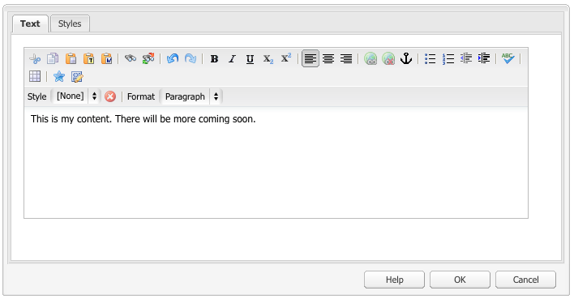

# 配置RTF編輯器 {#configure-the-rich-text-editor}

富格文本編輯器(RTE)為作者提供了編輯其文本內容的多種功能。 為WYSIWYG文本編輯體驗提供表徵圖、選擇框、工具欄和菜單。

要瞭解如何使用RTE功能進行創作，請參閱 [使用RTF編輯器進行創作](/help/sites-authoring/rich-text-editor.md)。 RTE可以配置為啟用、禁用和擴展創作元件中可用的功能。 以下工作流說明了在Experience Manager中完成RTE配置任務的建議順序。


*圖：學習如何配置RTE的步驟序列*

## 瞭解啟用觸摸的UI和經典UI {#understand-touch-enabled-ui-and-classic-ui}

啟用觸摸的UI是標準的用戶介面，用於Experience Manager。 Adobe引入了支援觸摸的UI, [響應設計](/help/sites-authoring/responsive-layout.md) 創作環境。 支援觸摸的UI專為觸摸和台式機設備而設計。 介面與原始的Classic UI有很大不同。


*圖：啟用觸摸的UI中的富格文本編輯器工具欄*


*圖：標準用戶介面中的富格文本編輯器工具欄*

>[!MORELIKETHIS]
>
>* [UI建議](/help/sites-deploying/ui-recommendations.md)
>* 有關棄用經典用戶介面，請參見 [Experience Manager6.5發行說明](/help/release-notes/deprecated-removed-features.md)
>* 有關UI之間的差異，請參見 [觸摸UI和經典UI](https://aemcq5pedia.wordpress.com/2018/01/05/touch-enabled-ui-aem6-3/)
>* 要詳細瞭解啟用觸摸的UI，請參見 [Experience Manager觸摸UI概念](/help/sites-developing/touch-ui-concepts.md)


## 各種編輯模式 {#editingmodes}

作者可以使用不同的元件模式在Experience Manager中建立和編輯文本內容。 用於創作和格式化內容的工具欄選項以及在不同編輯模式下啟用RTE的元件的用戶體驗會因RTE配置而異。

| 編輯模式 | 編輯區域 | 建議啟用的功能 | 觸控式 UI | 傳統 UI |
|--- |--- |--- |--- |--- |
| 內嵌 | 就地編輯，以快速、次要地編輯；不開啟對話框的格式 | 最小RTE功能 | Y | Y |
| RTE全屏 | 覆蓋整個頁面 | 所有必需的RTE功能 | Y | N |
| 對話方塊 | 對話框，但不覆蓋整個頁面 | Classic UI中所有必需的RTE功能；明智地啟用Touch UI中的功能 | Y | Y |
| 對話框全屏 | 與全屏模式相同；包含對話框的欄位和RTE | 所有必需的RTE功能 | Y | N |

>[!NOTE]
>
>在啟用觸摸的UI中，源編輯功能在串聯編輯模式下不可用。 不能在全屏模式下拖動影像。 所有其它功能在所有模式下都工作。

### 內聯編輯 {#inline-editing}

開啟（按兩下/按一下速度慢）後，可以在頁面中編輯內容。 提出了一種具有非常基本選項的緊湊型工具欄。


*圖：在啟用觸摸的UI中使用基本工具欄進行內聯編輯*

在Classic UI中，慢速按兩下元件可進行內聯編輯，橙色輪廓將突出顯示內容。 如果「內容查找器」處於開啟狀態，則窗口頂部將顯示一個帶有可用RTE格式設定選項的工具欄。 如果未開啟內容查找器，則不顯示格式選項，您只能進行基本文本編輯。

### 全屏編輯 {#full-screen-editing}

Experience Manager元件可以在全屏視圖中開啟，以隱藏頁面內容並佔用可用螢幕。 考慮對內聯編輯的詳細版本進行全屏編輯，因為它提供的編輯選項最多。 可通過按一下 ，在使用內嵌編輯模式時從壓縮工具欄中刪除。

在對話框的全屏模式以及詳細的RTE工具欄中，對話框中可用的選項和元件也可用。 它僅適用於包含RTE和其他元件的對話框。


*圖：在啟用觸摸的UI中以全屏模式編輯時的詳細RTE工具欄*

### 對話框編輯 {#dialog-editing}

按兩下元件時，將開啟一個對話框以編輯內容。 該對話框在現有頁面頂部開啟。 在某些特定情況下，該對話框會作為彈出窗口開啟。 例如，當文本元件是多列頁面佈局中列的一部分，且該對話框的可用區域較小時。


*圖：啟用觸摸的UI中的對話框編輯模式*



*圖：包含用於編輯的詳細工具欄的標準用戶介面中的對話框*

## 關於RTE插件和相關功能 {#aboutplugins}

此功能可通過一系列插件提供，每個插件都具有：

* A `features` 屬性：

   * 用於激活或停用該插件的基本功能
   * 可以使用標準化程式配置

* 在適當情況下，需要專門配置的其他屬性和選項。

RTE的基本特徵將通過 `features` 特定於相應插件的節點上的屬性。

下表列出了當前插件，如下所示：

* 帶有指向API文檔的連結的插件ID。 ID在 [激活插件](/help/sites-administering/configure-rich-text-editor-plug-ins.md#activateplugin)。
* 允許的值 `features` 屬性。
* 插件提供的功能的說明。

| 插件ID | 特徵 | 說明 |
|--- |--- |--- |
| 編輯 | 剪切複製貼上 — 預設貼上 — 明文貼上 — wordhtml | [剪切、複製和，三種貼上模式](/help/sites-administering/configure-rich-text-editor-plug-ins.md#textstyles)。 |
| 芬德萊 | 查找替換 | 查找和替換。 |
| 格式 | 粗斜下划線 | [基本文本格式](/help/sites-administering/configure-rich-text-editor-plug-ins.md#textstyles)。 |
| 影像 | 影像 | 基本影像支援（從內容或Content Finder中拖動）。 根據瀏覽器的不同，支援對作者有不同的行為 |
| 鍵 |  | 要定義此值，請參閱 [頁籤大小](/help/sites-administering/configure-rich-text-editor-plug-ins.md#tabsize)。 |
| 證明 | 正當性左正當性中正當性右 | 段落對齊。 |
| 連結 | modifylink取消連結錨定 | [超連結和錨點](/help/sites-administering/configure-rich-text-editor-plug-ins.md#linkstyles)。 |
| 清單 | 訂購的未排序縮進 | 此插件控制 [縮進和清單](/help/sites-administering/configure-rich-text-editor-plug-ins.md#indentmargin);包括嵌套清單。 |
| 錯誤工具 | 特殊字元源編輯 | 其他工具允許作者輸入 [特殊字元](/help/sites-administering/configure-rich-text-editor-plug-ins.md#spchar) 或編輯HTML源。 另外，您可以 [特殊字元範圍](/help/sites-administering/configure-rich-text-editor-plug-ins.md#definerangechar) 來修改標籤元素的屬性。 |
| 參數格式 | 副格式 | 預設段落格式為段落、標題1、標題2和標題3(`<p>`。 `<h1>`。 `<h2>`, `<h3>`)。 你可以 [添加更多段落格式](/help/sites-administering/configure-rich-text-editor-plug-ins.md#paraformats) 或擴展清單。 |
| 拼寫檢查 | 檢查文本 | [語言感知拼寫檢查器](/help/sites-administering/configure-rich-text-editor-plug-ins.md#adddict)。 |
| 樣式 | 樣式 | 支援使用CSS類的樣式。 [添加新文本樣式](/help/sites-administering/configure-rich-text-editor-plug-ins.md#textstyles) 如果要添加（或擴展）您自己的樣式範圍，以便與文本一起使用。 |
| 上標 | 下標上標 | 基本格式的擴展，添加子和超級指令碼。 |
| 表 | 表可移動插入遠程插入列刪除列柱子屬性mergecells拆分單元選擇列 | 請參閱 [配置表樣式](/help/sites-administering/configure-rich-text-editor-plug-ins.md#tablestyles)，也請參見Wiki頁。 |
| 復原 | 撤消重做 | 歷史記錄大小 [撤消和重做](/help/sites-administering/configure-rich-text-editor-plug-ins.md#undohistory) 操作。 |

>[!NOTE]
>
>對話框模式下不支援全屏插件。 使用 `dialogFullScreen` 設定為配置工具欄以進行全屏模式。

## 瞭解配置路徑和位置 {#understand-the-configuration-paths-and-locations}

的 [RTE編輯模式（和UI）](#editingmodes) 您為作者提供的配置詳細資訊在您 [激活RTE插件](/help/sites-administering/configure-rich-text-editor-plug-ins.md#activateplugin):

| 編輯模式 | 觸摸UI的位置 | 經典UI的位置 |
|---|---|---|
| 內嵌 | `cq:editConfig/cq:inplaceEditing` | `cq:editConfig/cq:inplaceEditing` |
| 全屏 | `cq:editConfig/cq:inplaceEditing` | 不適用 |
| 對話方塊 | `cq:dialog` | `dialog` |
| 全屏對話框 | `cq:dialog` | 不適用 |

>[!NOTE]
>
>不將節點命名為 `cq:inplaceEditing` 如 `config`。 開 `cq:inplaceEditing` 節點，定義以下屬性：
>* **名稱**: `configPath`
>* **類型**: `String`
>* **值**:包含實際配置的節點的路徑
>
>不要將RTE配置節點命名為 `config`。 否則，RTE配置只對管理員生效，對組中的用戶無效 `content-author`。

配置以下屬性，這些屬性僅在Touch UI的「對話」編輯模式下應用：

* `useFixedInlineToolbar`:設定在RTE節點上定義的此布爾屬性(一個屬性帶有sling:resourceType= `cq/gui/components/authoring/dialog/richtext`) `True`，以使RTE工具欄固定而不是浮動。

   如果此屬性為true，則預設情況下，Richtext編輯是在&quot;foundation-contentloaded&quot;事件上啟動的。

   要阻止此情況，請設定屬性 `customStart` 至 `True`並觸發「rte-start」事件以啟動RTE編輯。 如果此屬性為「true」，則預設行為（rte開始按一下）將不起作用。

* `customStart`:將RTE節點上定義的此布爾屬性設定為 `True`，通過觸發事件控制何時啟動RTE `rte-start`。

* `rte-start`:在 `contenteditable-div` 開始編輯RTE。 僅當 `customStart` 已設定為true。

在啟用觸摸的對話框中使用RTE時，設定屬性 `useFixedInlineToolbar` 為避免問題，必須為true。

## 定制就地編輯 {#customizing-in-place-editing}

通過配置以下屬性，可以定義文本編輯器在哪個HTML選擇器上啟動：

* **`editElementQuery`**  — 定義於 `cq:InplaceEditingConfig`，此屬性用於指定HTML元素的選擇器，在該選擇器上將啟動文本元件的內聯編輯。 如果未指定，則直接在文本元件HTML上啟動內聯編輯。
* **`textPropertyName`**  — 定義於 `cq:InplaceEditingConfig`，此屬性用於指定將保存在內容節點上的屬性的名稱，在內聯編輯後，文本元件的HTML值將保留在該節點上。

對話框模式的相應屬性為 `name`。

## 通過激活插件啟用RTE功能 {#enable-rte-functionalities-by-activating-plug-ins}

RTE功能可通過一系列插件提供，每個插件都具有features屬性。 可以配置features屬性以啟用或禁用每個插件的各種功能。

有關RTE插件的詳細配置，請參見 [如何激活和配置RTE插件](/help/sites-administering/configure-rich-text-editor-plug-ins.md)。

**示例**:下載 [此示例配置](/help/sites-administering/assets/rte-sample-all-features-enabled-10.zip) 說明如何配置RTE。 在此包中，所有功能都已啟用。

>[!NOTE]
>
>的 [核心元件文本元件](https://experienceleague.adobe.com/docs/experience-manager-core-components/using/components/text.html?lang=en#the-text-component-and-the-rich-text-editor) 允許模板編輯器將GUI中的許多RTE插件配置為內容策略，從而無需進行技術配置。 內容策略可以使用RTE UI配置，如本文檔所述。
>
>有關詳細資訊，請參見 [RTE UI設定和內容策略](/help/sites-administering/rich-text-editor.md) 以及 [建立頁面模板](/help/sites-authoring/templates.md) 和 [核心元件開發人員文檔](https://experienceleague.adobe.com/docs/experience-manager-core-components/using/developing/developing.html)。

>[!NOTE]
>
>為便於參考，預設文本元件（作為標準安裝的一部分提供）可在以下位置找到：
>
>* `/libs/wcm/foundation/components/text`
>* `/libs/foundation/components/text`
>
>要建立您自己的文本元件，請複製上述元件，而不是編輯這些元件。

## 配置RTE工具欄 {#dialogfullscreen}

允許AEM您針對不同的編輯模式以不同方式配置富格文本編輯器的介面。 下面提供了預設設定。 您可以根據您的要求改寫這些預設值。 您只定制要提供給作者的工具欄功能。 無需指定所有工具欄配置。

配置工具欄 `dialogFullScreen`，使用以下示例配置。

```java
<uiSettings jcr:primaryType="nt:unstructured">
  <cui jcr:primaryType="nt:unstructured">
    <inline
      jcr:primaryType="nt:unstructured"
      toolbar="[format#bold,format#italic,format#underline,#justify,#lists,links#modifylink,links#unlink,#paraformat]">
      <popovers jcr:primaryType="nt:unstructured">
        <justify
          jcr:primaryType="nt:unstructured"
          items="[justify#justifyleft,justify#justifycenter,justify#justifyright,justify#justifyjustify]"
          ref="justify"/>
        <lists
          jcr:primaryType="nt:unstructured"
          items="[lists#unordered,lists#ordered,lists#outdent,lists#indent]"
          ref="lists"/>
        <paraformat
          jcr:primaryType="nt:unstructured"
          items="paraformat:getFormats:paraformat-pulldown"
          ref="paraformat"/>
      </popovers>
    </inline>
    <dialogFullScreen
      jcr:primaryType="nt:unstructured"
      toolbar="[format#bold,format#italic,format#underline,justify#justifyleft,justify#justifycenter,justify#justifyright,justify#justifyjustify,lists#unordered,lists#ordered,lists#outdent,lists#indent,links#modifylink,links#unlink,table#createoredit,#paraformat,image#imageProps]">
      <popovers jcr:primaryType="nt:unstructured">
        <paraformat
          jcr:primaryType="nt:unstructured"
          items="paraformat:getFormats:paraformat-pulldown"
          ref="paraformat"/>
      </popovers>
    </dialogFullScreen>
    <tableEditOptions
      jcr:primaryType="nt:unstructured"
      toolbar="[table#insertcolumn-before,table#insertcolumn-after,table#removecolumn,-,table#insertrow-before,table#insertrow-after,table#removerow,-,table#mergecells-right,table#mergecells-down,table#mergecells,table#splitcell-horizontal,table#splitcell-vertical,-,table#selectrow,table#selectcolumn,-,table#ensureparagraph,-,table#modifytableandcell,table#removetable,-,undo#undo,undo#redo,-,table#exitTableEditing,-]">
    </tableEditOptions>
  </cui>
</uiSettings>
```

串聯模式和全屏模式使用不同的UI設定。 工具欄屬性用於指定工具欄的按鈕。

例如，如果按鈕本身是特徵(例如， `Bold`)，它指定為 `PluginName#FeatureName` (例如， `links#modifylink`)。

如果按鈕是跨距（包含插件的某些功能），則指定為 `#PluginName` (例如， `#format`)。

分隔符(`|`) `-`。

串聯或全屏模式下的彈出節點包含正在使用的彈出窗口的清單。 「popvers」節點下的每個子節點都以插件（例如，格式）命名。 它具有一個屬性「items」，其中包含插件的功能清單（例如，format#bold）。

## RTE用戶介面設定和內容策略 {#rtecontentpolicies}

管理員可以使用內容策略來控制RTE選項，例如，不要執行上述配置。 內容策略在用作元件的一部分時定義元件的設計屬性 [可編輯模板](/help/sites-authoring/templates.md)。 例如，如果使用RTE的文本元件與可編輯的模板一起使用，則內容策略可以定義粗體選項可用，以及幾個段落格式選項可用。 內容策略可重用，可跨多個模板應用。

RTE中的可用選項從用戶介面配置到內容策略的下游。

* 用戶介面配置設定定義了哪些選項可用於內容策略。
* 如果刪除了RTE的用戶介面配置或未啟用項目，則內容策略無法配置它。
* 作者只能訪問用戶介面配置和內容策略提供的功能。

例如，您可以看到 [文本核心元件文檔](https://experienceleague.adobe.com/docs/experience-manager-core-components/using/wcm-components/text.html?lang=en#the-text-component-and-the-rich-text-editor)。

## 自定義工具欄表徵圖和命令之間的映射 {#iconstoolbar}

可以定制RTE工具欄上顯示的珊瑚表徵圖和可用命令之間的映射。 除珊瑚表徵圖外，不能使用任何其他表徵圖。

1. 建立名為 `icons` 在 `uiSettings/cui`。

1. 為下面的單個表徵圖建立節點。
1. 在每個單個表徵圖節點上，指定一個珊瑚表徵圖和一個要映射到該表徵圖的命令。

下面是將命令Bold映射到名為的Coral表徵圖的示例代碼段 `textItalic`。

```java
<text jcr:primaryType="nt:unstructured" sling:resourceType="cq/gui/components/authoring/dialog/richtext" name="./text" useFixedInlineToolbar="{Boolean}true">
    <rtePlugins jcr:primaryType="nt:unstructured">
        <format jcr:primaryType="nt:unstructured" features="bold,italic"/>
    </rtePlugins>
    <uiSettings jcr:primaryType="nt:unstructured">
        <cui jcr:primaryType="nt:unstructured">
            <inline jcr:primaryType="nt:unstructured"
                toolbar="[format#bold,format#italic,format#underline,links#modifylink,links#unlink]">
            </inline>
            <icons jcr:primaryType="nt:unstructured">
                <bold jcr:primaryType="nt:unstructured"
                    command="format#bold"
                    icon="textItalic"/>
            </icons>
        </cui>
    </uiSettings>
</text>
```

## 切換到CoralUI 2富格文本編輯器 {#switch-to-coralui-rich-text-editor}

在頁面上，您可以包括CoralUI 2 RTE客戶端庫或CoralUI 3 RTE客戶端庫。 預設情況下，富格文本編輯器包含CoralUI 3 RTE客戶端庫。 要切換到CoralUI 2 RTE，請執行以下步驟。

>[!NOTE]
>
>Adobe不建議將其作為最佳做法。 切換到CoralUI 2 RTE作為最後手段。 如果插件不依賴於RTE內部件（如類），則CoralUI 2 RTE的自定義插件可與CoralUI 3 RTE一起使用。
>
>如果正在為CoralUI3 RTE使用自定義插件，請使用 `rte.coralui3` 的下界。


1. 覆蓋節點 `/libs/cq/gui/components/authoring/editors/clientlibs/core` 在 `/apps`，並執行以下操作：

   * 替換 `rte.coralui3` 與 `rte.coralui2` 屬性。
   * 替換 `cq.authoring.editor.core.inlineediting.rte.coralui3` 與 `cq.authoring.editor.core.inlineediting.rte.coralui2` 的子菜單。
   * 替換 `cq.authoring.rte.coralui3` 與 `cq.authoring.rte.coralui2` 的子菜單。

1. 覆蓋節點 `/libs/cq/gui/components/authoring/dialog/richtext/clientlibs/rte/coralui3` 和 `/libs/cq/gui/components/authoring/dialog/richtext/clientlibs/rte/coralui2` 在 `/apps`。

   刪除類別 `cq.authoring.dialog` 從 `/apps/cq/gui/components/authoring/dialog/richtext/clientlibs/rte/coralui3` 並添加到 `/apps/cq/gui/components/authoring/dialog/richtext/clientlibs/rte/coralui2`。

1. 更改頁面中包含的任何其他依賴項 `rte.coralui3` 至 `rte.coralui2`。 例如，在覆蓋節點後 `/libs/mcm/campaign/components/touch-ui/clientlibs/rte` 在 `/apps`，從中更改對它的任何依賴 `rte.coralui3` 至 `rte.coralui2`。

1. 覆蓋節點 `cq/ui/widgets` 在 `/apps`。 替換依賴項 `cq.rte` 節點 `/apps/cq/ui/widgets` 與 `cq.coralui2.rte`。

>[!NOTE]
>
>CoralUI 2 RTE使用句柄模板進行插件對話框。 因此，CoralUI 2 RTE客戶端庫依賴於操縱器客戶端庫。 CoralUI 3 RTE不使用句柄模板，也沒有任何關聯的依賴關係。 如果您的自定義插件使用車把模板，請在網頁中包括車把客戶端庫。

## 更多資訊 {#further-information}

有關配置RTE的詳細資訊，請參見 [小部AEM件API](https://developer.adobe.com/experience-manager/reference-materials/6-5/widgets-api/index.html?class=CQ.form.RichText) 的下界。

特別是，要查看可用的插件和相關選項：

* 的 [CQ.form.RichText](https://developer.adobe.com/experience-manager/reference-materials/6-5/widgets-api/index.html?class=CQ.form.RichText) 元件提供用於編輯樣式文本資訊(RTF)的表單域。 要瞭解RTF表單的所有可用參數，請參閱Config Options。
* RichText元件使用下面列出的插件提供多種功能 [CQ.form.rte.plugins.插件](https://developer.adobe.com/experience-manager/reference-materials/6-5/widgets-api/index.html?class=CQ.form.rte.plugins.Plugin)。 對於每個插件：

   * 有關可啟用（或禁用）的功能的詳細資訊，請參閱功能
   * 請參閱Config Options（配置選項），瞭解可用於詳細配置相應插件的所有參數

* 有關連結的HTML規則的詳細資訊也可用。

這些功能可用於擴展和定制您自己的RTE。 例如，要在建立連結時列出頁面中可用的錨點，您可以提供您自己對 `LinkPlugin`。

## 已知限制 {#known-limitations}

AEMRTE功能具有以下限制：

* RTE功能僅在元件對話AEM框中受支援。 嚮導或基礎表單(如 [頁面屬性](/help/sites-developing/page-properties-views.md) 和 [腳手架](/help/sites-authoring/scaffolding.md) 啟用觸摸的UI上。

* AEM不能 [混合設備](/help/release-notes/release-notes.md)。

* 不命名RTE配置節點 `config`。 否則，RTE配置將僅對管理員生效，對組中的用戶無效 `content-author`。

* RTE不支援嵌入內容的內聯幀或iframe。

## 最佳實踐和提示 {#best-practices-and-tips}

* 僅啟用浮動對話框的插件，而不啟用彈出窗口。 沒有彈出窗口的插件尺寸較小，最適合浮動對話框。
* 使用較大的彈出窗口啟用插件，如 `Paste` 插件，僅在全屏對話框模式或全屏模式下。 具有大型彈出窗口的插件需要更多的螢幕空間來提供良好的創作體驗。
* 如果正在為CoralUI3 RTE使用自定義插件，請使用 `rte.coralui3` 的下界。

## 解決RTE的常見問題 {#troubleshoot-issues-with-aem-rich-text-editor}

**如何選擇多個表單元格？**

要選擇表中的多個單元格，請按 `Ctrl` 或 `Cmd` 鍵，然後逐個按一下表單元格。

現在，對所選內容執行操作，例如設定所選單元格的屬性。

**使用「配置」按鈕編輯元件時，超連結將丟失**

通過使用「配置」按鈕編輯文本元件來添加超連結。 再次編輯超連結並第二次驗證超連結時，可能會丟失該超連結。

一種解決方法是，在第二次顯示編輯對話框時按一下文本元件，然後運行連結驗證。

此問題在6.AEM3及更高版本中解決。

**HTML在源編輯模式下添加的內容丟失**

不要添加易於XSS的HTML。 而AEM不是RTE，可能會刪除一些HTML內容，以遵守XSS防滑規則。

要驗證已貼上的HTML是否已保存，請檢查CRXDE（在內容節點中）中保存的內容。

如果不保存，HTML必須被RTE刪除，因為它不遵守RTE的規則。

如果保存在CRXDE中，但未在頁面上呈現(要檢查呈現，請參閱頁面 [預覽](/help/sites-authoring/editing-content.md#preview-mode)，將被XSSAEM規則刪除。

**多欄位元件未按預期工作**

要建立多欄位元件，請只使用CoralUI 3。 請勿使用CoralUI 2元件對話框。

另外，驗證您的多欄位實現代碼和節點結構是否正確。

**可供管理員使用的配置對作者不可用**

如果介面配置更新反映給管理員，但不反映給作者帳戶，請確保未命名配置節點 `config`。 使用 [`configPath` 屬性](/help/sites-developing/components-basics.md#cq-inplaceediting)。

>[!MORELIKETHIS]
>
>* [配置RTE插件](configure-rich-text-editor-plug-ins.md)
>* [使用RTF編輯器進行創作](../sites-authoring/rich-text-editor.md)
>* [為可訪問站點配置RTE](rte-accessible-content.md)
>* [觸摸UI和經典UI功能奇偶校驗](../release-notes/touch-ui-features-status.md)
>* [建立複合多欄位元件的教程示例](https://experience-aem.blogspot.com/2019/05/aem-65-touchui-composite-multifield-with-coral3-rte-rich-text.html)

