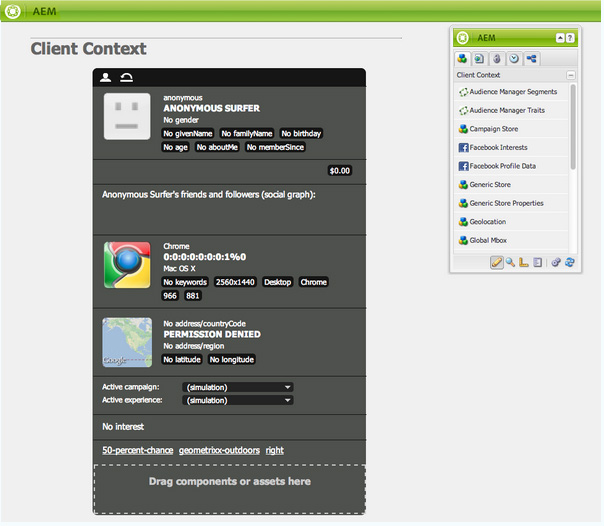

# 與Salesforce整合 {#integrating-with-salesforce}

將Salesforce與AEM整合可提供銷售機會管理功能，並運用Salesforce現成可用的功能。 您可以設定AEM，將銷售機會張貼至Salesforce，並建立可直接從Salesforce存取資料的元件。

AEM和Salesforce之間雙向且可擴充的整合可讓您：

* 組織可充分使用和更新資料，以增強客戶體驗。
* 從行銷到銷售活動的參與度。
* 組織可自動從Salesforce資料儲存區傳輸和接收資料。

本檔案說明下列內容：

* 如何設定Salesforce Cloud Services（設定AEM以與Salesforce整合）。
* 如何在「客戶內容」和「個人化」中使用Salesforce銷售線索／聯絡資訊。
* 如何使用Salesforce工作流程模型，將AEM使用者貼文為salesforce的潛在客源。
* 如何建立顯示Salesforce資料的元件。

## 設定AEM以與Salesforce整合 {#configuring-aem-to-integrate-with-salesforce}

若要設定AEM以與Salesforce整合，您必須先在Salesforce中設定遠端存取應用程式。 然後，您會設定salesforce雲端服務，以指向此遠端存取應用程式。

>[!NOTE]
>
>您可以在Salesforce中建立免費的開發人員帳戶。

若要設定AEM以與Salesforce整合：

>[!CAUTION]
>
>您必須先安裝 [Salesforce Force API整合套件](https://www.adobeaemcloud.com/content/marketplace/marketplaceProxy.html?packagePath=/content/companies/public/adobe/packages/cq650/featurepack/com.adobe.cq.mcm.salesforce.content#) ，才能繼續執行程式。 有關如何使用包的詳細資訊，請參 [閱How to Work with Packages](/help/sites-administering/package-manager.md#package-share) 頁。

1. 在AEM中，導覽至 **Cloud Services**。 在「協力廠商服務」中，按一 **下「在****Salesforce中設定」**。

   

1. 建立新的設定，例如開發 **人員**。

   >[!NOTE]
   >
   >新設定會重新導向至新頁面： **http://localhost:4502/etc/cloudservices/salesforce/developer.html**。 這與您在Salesforce中建立遠端存取應用程式時，在回呼URL中所需指定的值完全相同。 這些值必須相符。

1. 登入您的salesforce帳戶(或如果您沒有帳戶，請在https://developer.force.com建立 [帳戶](https://developer.force.com))。
1. 在Salesforce中，導覽至「 **Create** > **Apps** 」以取得「 **Connected Apps」(在舊版Force中，工作流程是「********** Deploy Deploy > Remote Access Apps」（遠端存取）。
1. 按一 **下「新增** 」，將AEM與Salesforce連線。

   

1. 輸入「已 **連線的應用程式名稱**」、「 **API名稱**」和「連 **絡人電子郵件**」。 選取「 **啟用OAuth設定** 」核取方塊，然後輸入「 **回呼URL** 」並新增OAuth範圍（例如完全存取）。 回呼URL的外觀類似下列： `http://localhost:4502/etc/cloudservices/salesforce/developer.html`

   變更伺服器名稱／埠號和頁面名稱，以符合您的設定。

   

1. 按一 **下「儲存** 」以儲存salesforce設定。 Salesforce會建立 **消費者金鑰****和消費者機密**，您需要這些資訊才能進行AEM設定。

   

   >[!NOTE]
   >
   >您可能需要等候幾分鐘（最長15分鐘），才能啟動Salesforce中的遠端存取應用程式。

1. 在AEM中，導覽至 **Cloud Services** ，並導覽至您先前建立的salesforce設定(例如， **開發人員**)。 按一 **下「編輯** 」，然後從salesforce.com輸入客戶金鑰和客戶機密。

   

   | 登入 URL | 這是Salesforce授權端點。 它的值已預先填入，適用於大部分情況。 |
   |---|---|
   | 客戶金鑰 | 輸入從salesforce.com的「遠程訪問應用程式註冊」頁獲得的值 |
   | 客戶機密 | 輸入從salesforce.com的「遠程訪問應用程式註冊」頁獲得的值 |

1. 按一 **下「連線至Salesforce** 」以連線。 Salesforce要求您允許您的設定連線至salesforce。

   

   在AEM中，會開啟確認對話方塊，告知您已成功連線。

1. 導覽至您網站的根頁面，然後按一下「頁 **面屬性」**。 然後選 **取「雲端服務** 」並新增 **Salesforce** ，然後選取正確的設定(例如， **開發人員**)。

   

   現在，您可以使用工作流程模型，將銷售機會張貼至Salesforce，並建立可從Salesforce存取資料的元件。

## 將AEM使用者匯出為Salesforce銷售機會 {#exporting-aem-users-as-salesforce-leads}

如果您想將AEM使用者匯出為salesforce銷售線索，則需要設定工作流程，將銷售線索張貼至salesforce。

若要將AEM使用者匯出為Salesforce銷售機會：

1. 以滑鼠右鍵按一下工作 `http://localhost:4502/workflow` 流程「 **Salesforce.com Export」，然後按一下「開始」，導覽至Salesforce** 工作 **流程**。

   

1. 選取您要建立做為銷售線索的AEM使用者，作為此工作流程的 **Payload** （首頁->使用者）。 請務必選擇用戶的配置檔案節點，因為該節點包含映射到Salesforce潛在客戶的 **FirstName**&#x200B;和 **LastNameApplist欄位的資訊，如** givenName **、familyName****** 等。

   

   >[!NOTE]
   >
   >在開始此工作流程之前，AEM中的銷售機會節點必須具備某些必要欄位，才能發佈至Salesforce。 這些是 **給定的Name**、 **familyName**、 **** company和 **電子郵件**。 若要查看AEM使用者與Salesforce銷售線索之間對應的完整清單，請參閱「AEM使用者與Slaesforce銷售 [線索之間對應設定」。](#mapping-configuration-between-aem-user-and-salesforce-lead)

1. 按一下 **確定**。 使用者資訊會匯出至salesforce.com。 您可在salesforce.com驗證。

   >[!NOTE]
   >
   >錯誤日誌將顯示是否導入了銷售線索。 請查看錯誤日誌以瞭解詳細資訊。

### 設定Salesforce.com匯出工作流程 {#configuring-the-salesforce-com-export-workflow}

您可能需要設定Salesforce.com匯出工作流程，使其符合正確的Salesforce.com設定，或進行其他變更。

若要設定Salesforce.com匯出工作流程：

1. 導航到 `http://localhost:4502/cf#/etc/workflow/models/salesforce-com-export.html.`

   

1. 開啟「Salesforce.com匯出」步驟，選取「引數」 **標籤** ，然後選取正確的設定，然後按一下「 **確定」**。 此外，如果您希望工作流重新建立在Salesforce中刪除的銷售線索，請選中該複選框。

   

1. 按一 **下「儲存** 」以儲存變更。

   

### AEM使用者與Salesforce Lead之間的對應設定 {#mapping-configuration-between-aem-user-and-salesforce-lead}

若要檢視或編輯AEM使用者與Salesforce銷售線索之間的目前對應設定，請開啟「設定管理員」:並 `https://<hostname>:<port>/system/console/configMgr` 搜尋 **Salesforce銷售線索對應設定**。

1. 按一下「網頁控制台」 **或直接前往** 「設定管理員」 `https://<hostname>:<port>/system/console/configMgr.`
1. 搜尋 **Salesforce銷售線索對應設定**。

   

1. 視需要變更對應。 預設映射遵循模式 **aemUserAttribute=sfLeadAttribute**。 按一 **下「儲存** 」以儲存變更。

## 設定Salesforce用戶端內容商店 {#configuring-salesforce-client-context-store}

salesforce用戶端內容儲存區會顯示目前登入使用者的其他資訊，而非AEM中已有的資訊。 它會根據使用者與Salesforce的連線，從Salesforce提取此額外資訊。

若要這麼做，您必須設定下列項目：

1. 透過Salesforce connect元件，將AEM使用者連結至Salesforce ID。
1. 將Salesforce描述檔資料新增至用戶端內容頁面，以設定您要查看的屬性。
1. （可選）建立使用Salesforce Client內容商店資料的區段。

### 將AEM使用者連結至Salesforce ID {#linking-an-aem-user-with-a-salesforce-id}

您必須使用Salesforce ID對應AEM使用者，才能將其載入用戶端內容。 在實際案例中，您會根據已知使用者資料與驗證進行連結。 為了示範，在此程式中，您使用 **Salesforce connect元件** 。

1. 導覽至AEM中的網站、登入，並從側腳拖放 **Salesforce Connect** 元件。

   >[!NOTE]
   >
   >如果 **Salesforce Connect** 元件不可用，請前往「設計」檢視並選取它，以便在「編輯」檢視中 **使用****** 。

   

   將元件拖曳至頁面時，會顯示「 **連結至Salesforce=Off」**。

   

   >[!NOTE]
   >
   >此元件僅供展示之用。 對於實際案例，將有另一個程式來連結／比對使用者與潛在客源。

1. 在頁面上拖曳元件後，請開啟它以進行設定。 選擇設定、連絡人類型，以及Salesforce潛在客戶或連絡人，然後按一下「確 **定」**。

   

   AEM會將使用者連結至Salesforce連絡人或潛在客戶。

   

### 將Salesforce資料新增至用戶端內容 {#adding-salesforce-data-to-client-context}

您可以從Salesforce在Client Context中載入使用者資料，以用於個人化：

1. 在此處導覽以開啟您要延伸的用戶端內容，例如， `http://localhost:4502/etc/clientcontext/default/content.html.`

   

1. 將 **** Salesforce Profile Data元件拖曳至客戶上下文。

   

1. 連按兩下元件以開啟它。 選擇 **「新增項目** 」並從下拉式清單中選取屬性。 添加任意數量的屬性，然後選擇「確 **定」**。

   

1. 現在，您會在用戶端內容中看到Salesforce中特定於Salesforce的屬性。

   

### 使用Salesforce Client Context Store中的資料建立區段 {#building-a-segment-using-data-from-salesforce-client-context-store}

您可以建立使用Salesforce Client Context Store資料的區段。 要執行此操作：

1. 在AEM中導覽至區段，方法是前往「工 **具** > **區段** 」或 [http://localhost:4502/miscadmin#/etc/segmentation](http://localhost:4502/miscadmin#/etc/segmentation)。
1. 建立或更新區段以包含來自Salesforce的資料。 如需詳細資訊，請參 [閱區段](/help/sites-administering/campaign-segmentation.md)。

## 搜索銷售線索 {#searching-leads}

AEM隨附範例搜尋元件，可根據指定的條件在Salesforce中搜尋銷售機會。 此元件顯示如何使用Salesforce REST API來搜尋salesforce物件。 您需要將頁面連結至Salesforce設定，以追蹤對salesforce.com的呼叫。

>[!NOTE]
>
>此為範例元件，說明如何使用Salesforce REST API來查詢Salesforce物件。 以它為範例，根據您的需求建立更複雜的元件。

要使用此元件：

1. 導覽至您要使用此設定的頁面。 開啟頁面屬性並選取「 **雲端服務」。** 按一 **下「新增服務** 」，並選 **取Salesforce** 和適當的設定，然後按一下「 **確定**」。

   

1. 將Salesforce搜尋元件拖曳至頁面（前提是已啟用它）。 若要啟用它，請移至「設計」模式，並將它新增至適當的區域)。

   

1. 開啟「搜尋」元件並指定搜尋參數，然後按一下「 **確定」。**

   

1. AEM會顯示在您的搜尋元件中指定符合指定標準的潛在客戶。

   

