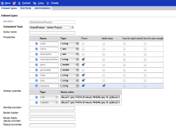

# SAP Commerce Cloud{#sap-commerce-cloud}

安裝後，您可以設定您的例項：

1. [設定Faceted Search for Geometrixx Outdoors](#configure-the-facetted-search-for-geometrixx-outdoors)。
1. [設定目錄版本](#configure-the-catalog-version)。
1. [配置導入結構](#configure-the-import-structure)。
1. [設定要載入的產品屬性](#configure-the-product-attributes-to-load)。
1. [匯入產品資料](#importing-the-product-data)。
1. [設定目錄匯入工具](#configure-the-catalog-importer)。
1. 使用匯 [入工具將目錄匯入](#catalog-import) AEM中的特定位置。

## 設定Geometrixx Outdoors的Faceted搜尋 {#configure-the-facetted-search-for-geometrixx-outdoors}

>[!NOTE]
>
>hybris 5.3.0.1及更新版本不需要此功能。

1. 在您的瀏覽器中，導覽至 **Hybris管理主控台** :

   [http://localhost:9001/hmc/hybris](http://localhost:9001/hmc/hybris)

1. 在側欄中，依序選 **擇System**、 **Facet search**、 **Facet Search Config**。
1. **開啟Editor** for **Sample Solr Configuration for clothscatalog**。

1. 在「 **目錄版本** 」下，使 **用「添加目錄版本** 」(Add Catalog version `outdoors-Staged` ) `outdoors-Online` 來添加和添加到清單中。
1. **保存** 配置。
1. 開啟 **SOLR項目類型** ，將 **SOLR排序添加到**`ClothesVariantProduct`:

   * 相關性（「相關性」，分數）
   * name-asc(&quot;Name(ascending)&quot;, name)
   * name-desc(&quot;Name(descending)&quot;, name)
   * price-asc(&quot;Price(ascending)&quot;, priceValue)
   * price-desc(&quot;Price(descending)&quot;, priceValue)
   >[!NOTE]
   >
   >使用上下文選單（通常按一下右鍵）來選取 `Create Solr sort`。
   >
   >對於Hybris 5.0.0，請開啟標 `Indexed Types` 簽，按兩下 `ClothesVariantProduct`標籤，然後開啟標籤 `SOLR Sort`。

   

1. 在「索 **引類型** 」頁籤中，將「合 **成類型」設定為** :

   `Product - Product`

1. 在「索引 **類型** 」頁籤中，調 **整索引器查詢**`full`:

   ```shell
   SELECT {pk} FROM {Product} WHERE {pk} NOT IN ({{SELECT {baseProductpk} FROM {variantproduct}}})
   ```

1. 在「索引 **類型** 」頁籤中，調 **整索引器查詢**`incremental`:

   ```shell
   SELECT {pk} FROM {Product} WHERE {pk} NOT IN ({{SELECT {baseProductpk} FROM {variantproduct}}}) AND {modifiedtime} <= ?lastIndexTime
   ```

1. 在「索 **引類型** 」標籤中調整 `category` Facet。 連按兩下類別清單中最後一個項目，以開啟「已索引」 **屬性標籤** :

   >[!NOTE]
   >
   >對於hybris 5.2，請確定「屬 `Facet` 性」表格中的屬性是根據下列螢幕擷取選取的：

    

1. 開啟「 **Facet設定** 」標籤並調整欄位值：

   

1. **儲存變更。**
1. 再次從 **SOLR項目類型**，根據下 `price` 列螢幕擷取畫面調整Facet。 與一 `category`樣，按兩下以打 `price` 開「索引」 **屬性頁籤** :

   

1. 開啟「 **Facet設定** 」標籤並調整欄位值：

   

1. **儲存變更。**
1. 依序 **開啟System**、 **Facet搜尋**、 **索引器操作精靈**。 啟動cronjob:

   * **索引器操作**: `full`
   * **Solr配置**: `Sample Solr Config for Clothes`

## 配置目錄版本 {#configure-the-catalog-version}

可 **以為OSGi服務配置導入的目錄版本** ( `hybris.catalog.version`):

**Day CQ Commerce Hybris Configuration**( `com.adobe.cq.commerce.hybris.common.DefaultHybrisConfigurationService`)

**目錄版本** 通常設為 `Online` 或 `Staged` （預設值）。

>[!NOTE]
>
>使用AEM時，有幾種方法可管理此類服務的組態設定；如需 [完整詳細資訊](/help/sites-deploying/configuring-osgi.md) ，請參閱設定OSGi。 另請參見控制台以取得可設定參數及其預設值的完整清單。

記錄輸出會針對已建立的頁面和元件提供意見回應，並報告可能的錯誤。

## 配置導入結構 {#configure-the-import-structure}

下列清單顯示預設所建立的範例結構（資產、頁面和元件）:

```shell
+ /content/dam/path/to/images
  + 12345.jpg (dam:Asset)
    + ...
  + ...
+ /content/site/en
  - cq:commerceProvider = "hybris"
  - cq:hybrisBaseStore = "basestore"
  - cq:hybrisCatalogId = "catalog"
  + category1 (cq:Page)
    + jcr:content (cq:PageContent)
      - jcr:title = "Category 1"
    + category11 (cq:Page)
      + jcr:content (cq:PageContent)
        - jcr:title = "Category 1.1"
      + 12345 (cq:Page)
        + jcr:content (cq:PageContent)
          + par
            + product (nt:unstructured)
              - cq:hybrisProductId = "12345"
              - sling:resourceType = "commerce/components/product"
              + image (nt:unstructured)
                - sling:resourceType = "commerce/components/product/image"
                - fileReference = "/content/dam/path/to/images/12345.jpg"
              + 12345.1-S (nt:unstructured)
                - cq:hybrisProductId = "12345.1-S"
                - sling:resourceType = "commerce/components/product"
                + image (nt:unstructured)
                  - sling:resourceType = "commerce/components/product/image"
                  - fileReference = "/content/dam/path/to/images/12345.1-S.jpg"
              + ...
```

這種結構由實現該介面的OSGi `DefaultImportHandler` 服務創 `ImportHandler` 建。 實際匯入工具會呼叫匯入處理常式，以建立產品、產品變數、類別、資產等。

>[!NOTE]
>
>您可以實 [作自己的匯入處理常式來自訂此程式](#configure-the-import-structure)。

導入時要生成的結構可配置為：

&quot;**Day CQ Commerce Hybris Default Import Handler**`(com.adobe.cq.commerce.hybris.importer.DefaultImportHandler`)

使用AEM時，有幾種方法可管理此類服務的組態設定；如需 [完整詳細資訊](/help/sites-deploying/configuring-osgi.md) ，請參閱設定OSGi。 另請參見控制台以取得可設定參數及其預設值的完整清單。

## 設定要載入的產品屬性 {#configure-the-product-attributes-to-load}

可將響應解析器配置為定義要為（變型）產品載入的屬性和屬性：

1. 配置OSGi包：

   **Day CQ Commerce Hybris預設回應剖析器**(`com.adobe.cq.commerce.hybris.impl.importer.DefaultResponseParser`)

   您可以在這裡定義載入和對應所需的各種選項和屬性。

   >[!NOTE]
   >
   >使用AEM時，有幾種方法可管理此類服務的組態設定；如需 [完整詳細資訊](/help/sites-deploying/configuring-osgi.md) ，請參閱設定OSGi。 另請參見控制台以取得可設定參數及其預設值的完整清單。

## 匯入產品資料 {#importing-the-product-data}

匯入產品資料有多種方式。 產品資料可在初始設定環境時匯入，或在Hybris資料中進行變更後匯入：

* [完整匯入](#full-import)
* [增量匯入](#incremental-import)
* [快速更新](#express-update)

從Hybris匯入的實際產品資訊會保存在儲存庫中，網址為：

`/etc/commerce/products`

下列屬性會指出含有hybris的連結：

* `commerceProvider`
* `cq:hybrisCatalogId`
* `cq:hybrisProductID`

>[!NOTE]
>
>Hybris實施(即 `geometrixx-outdoors/en_US`)僅儲存產品ID和其他基本資訊 `/etc/commerce`。
>
>每次請求關於產品的資訊時都引用hybris伺服器。

### 完整匯入 {#full-import}

1. 如有需要，請使用CRXDE Lite刪除所有現有的產品資料。

   1. 導航到包含產品資料的子樹：

      `/etc/commerce/products`

      例如：

      [`http://localhost:4502/crx/de/index.jsp#/etc/commerce/products`](http://localhost:4502/crx/de/index.jsp#/etc/commerce/products)

   1. 刪除保存產品資料的節點；例如， `outdoors`。
   1. **「全部儲存** 」以持續保留變更。

1. 在AEM中開啟hybris匯入工具：

   `/etc/importers/hybris.html`

   例如：

   [http://localhost:4502/etc/importers/hybris.html](http://localhost:4502/etc/importers/hybris.html)

1. 配置所需參數；例如：

   

1. 按一 **下「匯入目錄** 」以開始匯入。

   完成後，您可以在以下位置驗證導入的資料：

   ```
       /etc/commerce/products/outdoors
   ```

   您可以在CRXDE Lite中開啟此功能；例如：

   `[http://localhost:4502/crx/de/index.jsp#/etc/commerce/products](http://localhost:4502/crx/de/index.jsp#/etc/commerce/products)`

### 增量匯入 {#incremental-import}

1. 請在AEM中的適當子樹狀結構下，檢查相關產品的相關資訊：

   `/etc/commerce/products`

   您可以在CRXDE Lite中開啟此功能；例如：

   [http://localhost:4502/crx/de/index.jsp#/etc/commerce/products](http://localhost:4502/crx/de/index.jsp#/etc/commerce/products)

1. 在hybris中，更新相關產品上的資訊。

1. 在AEM中開啟hybris匯入工具：

   `/etc/importers/hybris.html`

   例如：

   [http://localhost:4502/etc/importers/hybris.html](http://localhost:4502/etc/importers/hybris.html)

1. 選擇按一下框「增 **量導入」**。
1. 按一 **下「匯入目錄** 」以開始匯入。

   完成時，您可以在下列位置驗證AEM中更新的資料：

   ```
       /etc/commerce/products
   ```


### 快速更新 {#express-update}

匯入程式可能需要很長時間，因此作為產品同步的擴展，您可以選擇目錄的特定區域以進行手動觸發的快速更新。 這會搭配使用匯出摘要與標準屬性設定。

1. 請在AEM中的適當子樹狀結構下，檢查相關產品的相關資訊：

   `/etc/commerce/products`

   您可以在CRXDE Lite中開啟此功能；例如：

   [http://localhost:4502/crx/de/index.jsp#/etc/commerce/products](http://localhost:4502/crx/de/index.jsp#/etc/commerce/products)

1. 在hybris中，更新相關產品上的資訊。

1. 在hybris中，將產品新增至快遞佇列；例如：

   

1. 在AEM中開啟hybris匯入工具：

   `/etc/importers/hybris.html`

   例如：

   [http://localhost:4502/etc/importers/hybris.html](http://localhost:4502/etc/importers/hybris.html)

1. 選擇按一下框「快速 **更新」**。
1. 按一 **下「匯入目錄** 」以開始匯入。

   完成時，您可以在下列位置驗證AEM中更新的資料：

   ```
       /etc/commerce/products
   ```

   ` [](http://localhost:4502/crx/de/index.jsp#/etc/commerce/products)`

## 設定目錄匯入工具 {#configure-the-catalog-importer}

Hybris目錄可以匯入至AEM，並使用批次匯入工具匯入Hybris目錄、類別和產品。

匯入工具使用的參數可設定為：

**Day CQ Commerce Hybris Catalog Importer**( `com.adobe.cq.commerce.hybris.impl.importer.DefaultHybrisImporter`)

使用AEM時，有幾種方法可管理此類服務的組態設定；如需 [完整詳細資訊](/help/sites-deploying/configuring-osgi.md) ，請參閱設定OSGi。 另請參見控制台以取得可設定參數及其預設值的完整清單。

## 目錄匯入 {#catalog-import}

hybris套件隨附目錄匯入工具，以設定初始頁面結構。

這可從以下網址獲得：

`http://localhost:4502/etc/importers/hybris.html`


必須提供下列資訊：

* **基本商店**：基本商店的識別碼，以Hybris設定。

* **目錄**&#x200B;要導入的目錄的標識符。

* **根路**&#x200B;徑應導入目錄的路徑。

## 從目錄中刪除產品 {#removing-a-product-from-the-catalog}

要從目錄中刪除一個或多個產品：

1. [設定OSGi service](/help/sites-deploying/configuring-osgi.md) Day CQ **Commerce Hybris Catalog Importer的for**;另請參閱 [設定目錄匯入工具](#configure-the-catalog-importer)。

   啟用下列屬性：

   * **啟用產品移除**
   * **啟用產品資產移除**
   >[!NOTE]
   >
   >使用AEM時，有幾種方法可管理此類服務的組態設定；如需 [完整詳細資訊](/help/sites-deploying/configuring-osgi.md) ，請參閱設定OSGi。 另請參見控制台以取得可設定參數及其預設值的完整清單。

1. 透過執行兩個增量更新來初始化匯入工具(請參 [閱目錄匯入](#catalog-import)):

   * 第一次執行會產生一組變更的產品——在記錄清單中指出。
   * 第二次不應更新任何產品。
   >[!NOTE]
   >
   >第一個匯入是初始化產品資訊。 第二個導入將驗證所有操作都正常運行，並且產品集已就緒。

1. 勾選包含您要移除之產品的類別頁面。 產品詳細資訊應該會顯示。

   例如，以下類別顯示Cajamara產品的詳細資料：

   [http://localhost:4502/editor.html/content/geometrixx-outdoors/en_US/equipment/biking.html](http://localhost:4502/editor.html/content/geometrixx-outdoors/en_US/equipment/biking.html)

1. 在Hybris主控台中移除產品。 使用「變更 **核准狀態** 」選項，將狀態設為 `unapproved`。 產品將從即時動態消息中移除。

   例如：

   * 開啟頁面 [http://localhost:9001/productcockpit](http://localhost:9001/productcockpit)
   * 選擇目錄 `Outdoors Staged`
   * 搜尋 `Cajamara`
   * 選取此產品，並將核准狀態變更為 `unapproved`

1. 執行另一個增量更新(請參 [閱目錄導入](#catalog-import))。 日誌將列出已刪除的產品。
1. [轉出](/help/sites-administering/generic.md#rolling-out-a-catalog) ，適當的目錄。 產品和產品頁面將已從AEM中移除。

   例如：

   * 開啟:

      [http://localhost:4502/aem/catalogs.html/content/catalogs/geometrixx-outdoors-hybris](http://localhost:4502/aem/catalogs.html/content/catalogs/geometrixx-outdoors-hybris)

   * 推出目 `Hybris Base` 錄
   * 開啟:

      [http://localhost:4502/editor.html/content/geometrixx-outdoors/en_US/equipment/biking.html](http://localhost:4502/editor.html/content/geometrixx-outdoors/en_US/equipment/biking.html)

   * 產 `Cajamara` 品已從類別中移除 `Bike`

1. 要重新註冊產品，請執行以下操作：

   1. 在hybris中，將核准狀態設回已核准 **狀態**
   1. 在AEM中：

      1. 執行增量更新
      1. 再次推出適當的目錄
      1. 重新整理適當的類別頁面

## 新增訂單歷史記錄特徵至用戶端內容 {#add-order-history-trait-to-the-client-context}

要將訂單歷史記錄添加到客戶 [端上下文](/help/sites-developing/client-context.md):

1. 開啟用戶 [端內容設計頁面](/help/sites-administering/client-context.md)，方法為：

   * 開啟頁面進行編輯，然後使用 **Ctrl-Alt-c** (windows)或 **control-option-c** (Mac)開啟用戶端內容。 使用用戶端內容左上角的鉛筆圖示來開啟 **ClientContext設計頁面**。
   * 直接導覽至 [http://localhost:4502/etc/clientcontext/default/content.html](http://localhost:4502/etc/clientcontext/default/content.html)

1. [將「訂 **購記錄** 」元件新增至](/help/sites-administering/client-context.md#adding-a-property-component) 用戶 ****&#x200B;端內容的「購物車」元件。
1. 您可以確認用戶端內容顯示您的訂單記錄詳細資訊。 例如：

   1. 開啟用戶 [端內容](/help/sites-administering/client-context.md)。
   1. 新增項目至購物車。
   1. 完成結帳。
   1. 檢查客戶端上下文。
   1. 新增其他項目至購物車。
   1. 導覽至結帳頁面：

      * 用戶端內容會顯示訂單記錄的摘要。
      * 螢幕上將顯示「您是舊客戶」的消息。
   >[!NOTE]
   >
   >消息的實現方式為：
   >
   >* 導覽至 [http://localhost:4502/content/campaigns/geometrixx-outdoors/hybris-returning-customer.html](http://localhost:4502/content/campaigns/geometrixx-outdoors/hybris-returning-customer.html)
   >
   >  促銷活動包含一個體驗。
   >
   >* 按一下區段([http://localhost:4502/etc/segmentation/geometrixx-outdoors/returning-customer.html](http://localhost:4502/etc/segmentation/geometrixx-outdoors/returning-customer.html))
      >
      >
   * 區段是使用「訂單歷史記 **錄屬性** 」特徵建立。

