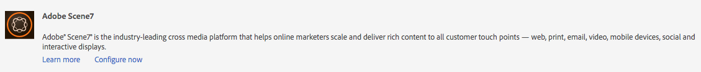

# 與Dynamic Media Classic整合(Scene7){#integrating-with-dynamic-media-classic-scene}

[Adobe Dynamic Media Classic](https://help.adobe.com/en_US/scene7/using/WS26AB0D9A-F51C-464e-88C8-580A5A82F810.html) 是代管解決方案，適用於管理、增強、發佈和提供多媒體資產至網路、行動裝置、電子郵件和網際網路連線的顯示和印刷品。

若要使用Dynamic Media Classic，您必須設定雲端設定，讓Dynamic Media Classic和AEM Assets能夠彼此互動。 本檔案說明如何設定AEM和Dynamic Media Classic。

如需在頁面上使用所有Dynamic Media Classic元件以及使用視訊的詳細資訊，請參 [閱使用Dynamic Media Classic](../assets/scene7.md)。

>[!NOTE]
>
>* Dynamic Media Classic的DHTML檢視器平台已於2014年1月31日正式停售。 如需詳細資訊，請 [參閱DHTML檢視器生命週期結束的常見問答集](../sites-administering/dhtml-viewer-endoflifefaqs.md)。
>* 在設定Dynamic Media Classic以搭配AEM運作之前，請參 [閱Best Practices](#best-practices-for-integrating-scene-with-aem) for integrating Dynamic Media Classic與AEM。
>* 如果您使用Dynamic Media Classic與自訂的Proxy設定，則需要設定兩個HTTP clientProxy設定，因為AEM的某些功能是使用3.x API，而其他部分則是使用4.x API。 3.x設定為http://localhost:4502/system/console/configMgr/com.day.commons.httpclient  ,4.x設定為 [http://localhost:4502/system/console/configMgr/org.apache.http.proxyconfigurator](http://localhost:4502/system/console/configMgr/org.apache.http.proxyconfigurator)。
>

## AEM/Dynamic Media Classic整合與Dynamic Media {#aem-scene-integration-versus-dynamic-media}

AEM使用者可以選擇兩種解決方案來搭配動態媒體：將其AEM實例與Dynamic Media Classic整合，或使用整合至AEM的Dynamic Media解決方案。

使用下列准則來判斷要選擇的解決方案：

* 如果您是現有的 **Dynamic** Media Classic客戶，其豐富型媒體資產位於Dynamic Media Classic中以進行發佈和傳送，但您想要將這些資產與Sites(WCM)製作和／或AEM Assets整合以進行管理，則請使用本檔案所述的  AEM/Dynamic Media Classic點對點整合。

* 如果您是新 **AEM客戶** ，有豐富式媒體傳送需求，請選取 [Dynamic Media選項](#aem-dynamic-media)。 如果您沒有現有的S7帳戶，且該系統中儲存了許多資產，這個選項最有意義。

* 在某些情況下，您可能想要同時使用這兩種解決方案。 雙 [用方案說明該方案](/help/sites-administering/scene7.md#dual-use-scenario) 。

### AEM/Dynamic Media Classic點對點整合 {#aem-scene-point-to-point-integration}

當您在此解決方案中使用資產時，請執行下列其中一項作業：

* 直接將資產上傳至Dynamic Media Classic，然後透過 **** Dynamic Media Classic內容瀏覽器存取，以製作頁面或
* 上傳至AEM Assets，然後啟用自動發佈至Dynamic Media Classic;您可透過 **Assets** 內容瀏覽器存取頁面製作

您用於此整合的元件位於 **Design模式中的Dynamic Media Classic** 元件 [區域。](/help/sites-authoring/author-environment-tools.md#page-modes)

### AEM Dynamic Media {#aem-dynamic-media}

AEM Dynamic media是直接在AEM平台中統一Dynamic Media Classic功能。

當您在此解決方案中使用資產時，請遵循下列工作流程：

1. 直接將單一影像和視訊資產上傳至AEM。
1. 直接在AEM中編碼視訊。
1. 直接在AEM中建立影像型集合。
1. 如果適用，請在影像或視訊中加入互動功能。

您用於「動態媒體」的元件位於「設計」模式 **[!UICONTROL 的「動態媒體]** 」元件 [區域中](/help/sites-authoring/author-environment-tools.md#page-modes)。 其中包括：

* **[!UICONTROL 動態媒體]** -動態媒 **** 體元件是智慧型的——視您新增影像或視訊而定，您有各種選項。 此元件支援影像預設集、影像檢視器，例如影像集、回轉集、混合媒體集和視訊。 此外，檢視器具有互動功能——螢幕大小會根據螢幕大小自動變更。 所有檢視器都是HTML5檢視器。

* **[!UICONTROL 互動式媒體]** -互動式媒體 **** 元件適用於這些資產，例如轉盤橫幅、互動式影像和互動式視訊，這些資產在熱點或影像地圖上具有互動性。 此元件是智慧型的——視您新增影像或視訊而定，您有各種選項。 此外，檢視器具有互動功能——螢幕大小會根據螢幕大小自動變更。 所有檢視器都是HTML5檢視器。

### 雙用方案 {#dual-use-scenario}

立即可用，您就可同時使用AEM的Dynamic Media和Dynamic Media Classic整合功能。 下表說明您開啟和關閉特定區域時的使用案例。

若要同時使用Dynamic Media和Dynamic Media Classic:

1. 在雲 [端服務中設定Dynamic Media](#creating-a-cloud-configuration-for-scene) Classic。
1. 請依照您使用案例的特定指示進行：

   <table>
    <tbody>
    <tr>
    <td> </td>
    <td> </td>
    <td><strong>動態媒體</strong></td>
    <td> </td>
    <td><strong>Dynamic Media Classic整合</strong></td>
    <td> </td>
    </tr>
    <tr>
    <td><strong>如果您是……</strong></td>
    <td><strong>使用案例工作流程</strong></td>
    <td><strong>影像／視訊</strong></td>
    <td><strong>動態媒體元件</strong></td>
    <td><strong>S7內容瀏覽器和元件</strong></td>
    <td><strong>自動從資產上傳至S7</strong></td>
    </tr>
    <tr>
    <td>網站與動態媒體新手</td>
    <td>將資產上傳至AEM並使用AEM Dynamic media元件在「網站」頁面上製作資產</td>
    <td>
開啟
 
（請參閱步驟3）
 </td>
    <td><a href="/help/assets/adding-dynamic-media-assets-to-pages.md">開啟</a></td>
    <td>關閉</td>
    <td>關閉</td>
    </tr>
    <tr>
    <td>零售業，是網站和動態媒體的新手</td>
    <td>將非產品資產上傳至AEM以進行管理和傳送。 將PRODUCT資產上傳至Dynamic Media Classic，並在AEM中使用Dynamic Media Classic內容瀏覽器和元件來製作網站上的產品詳細資訊頁面。</td>
    <td>
開啟
 
（請參閱步驟3）
 </td>
    <td><a href="/help/assets/adding-dynamic-media-assets-to-pages.md">開啟</a></td>
    <td><a href="/help/assets/scene7.md#scene-content-browser">開啟</a></td>
    <td>關閉</td>
    </tr>
    <tr>
    <td>資產與動態媒體新手</td>
    <td>將資產上傳至AEM Assets，並使用動態媒體中發佈的URL/內嵌代碼</td>
    <td>
開啟
 
（請參閱步驟3）
 </td>
    <td>關閉</td>
    <td>關閉</td>
    <td>關閉</td>
    </tr>
    <tr>
    <td>動態媒體與範本的新功能</td>
    <td>使用動態媒體進行影像和視訊處理。 在Dynamic Media Classic中編寫影像範本，並使用Dynamic Media Classic內容搜尋器，將範本加入「網站」頁面。</td>
    <td>
開啟
 
（請參閱步驟3）
 </td>
    <td><a href="/help/assets/adding-dynamic-media-assets-to-pages.md">開啟</a></td>
    <td><a href="/help/assets/scene7.md#scene-content-browser">開啟</a></td>
    <td>關閉</td>
    </tr>
    <tr>
    <td>Dynamic Media Classic現有客戶，是Sites的新手</td>
    <td>將資產上傳至Dynamic Media Classic，並使用AEM Dynamic Media Classic內容瀏覽器在「網站」頁面上搜尋及製作資產</td>
    <td>關閉</td>
    <td>關閉</td>
    <td><a href="/help/assets/scene7.md#scene-content-browser">開啟</a></td>
    <td>關閉</td>
    </tr>
    <tr>
    <td>現有的Dynamic Media Classic客戶，是網站和資產的新手</td>
    <td>將資產上傳至DAM並自動發佈至Dynamic Media Classic以進行發佈。 使用AEM Dynamic Media Classic內容瀏覽器，在「網站」頁面上搜尋及製作資產。</td>
    <td>關閉</td>
    <td>關閉</td>
    <td><a href="/help/assets/scene7.md#scene-content-browser">開啟</a></td>
    <td>
<a href="#configuringautouploadingfromaemassets">開啟</a>
 
（請參閱步驟4）
 </td>
    </tr>
    <tr>
    <td>既有的Dynamic Media Classic客戶，也是資產新手</td>
    <td>
將資產上傳至AEM，然後使用Dynamic Media產生轉譯以供下載／共用。 自動將AEM資產發佈至Dynamic Media Classic以進行傳送。
 
<strong></strong> 重要：在AEM中產生的重複處理和轉譯將無法同步至Dynamic Media Classic
 </td>
    <td>
開啟
 
（請參閱步驟3）
 </td>
    <td>關閉</td>
    <td>關閉</td>
    <td>
<a href="#configuringautouploadingfromaemassets">開啟</a>
 
（請參閱步驟4）
 </td>
    </tr>
    </tbody>
    </table>

1. (可選；請參閱使用案例表)-設定 [Dynamic Media雲端設定](/help/assets/config-dynamic.md) , [並啟用Dynamic Media伺服器](/help/assets/config-dynamic.md)。
1. (可選；請參閱使用案例表格)-如果您選擇啟用「從資產自動上傳至Dynamic Media Classic」，則需要新增下列項目：

   1. 設定自動上傳至Dynamic Media Classic。
   1. 在Dam更新 **資產工作流程結束時** ，在所有Dynamic Media工作流程步驟之 *後新增* Dynamic Media Classic上傳步 **** 驟( `https://<server>:<host>/cf#/etc/workflow/models/dam/update_asset.html)`
   1. （可選）依 [https://&lt;server>:&lt;port>/system/console/configMgr/com.day.cq.dam.scene7.impl.Scene7AssetMimeTypeServiceImpl中的MIME類型限制動態媒體經典資產上傳](http://localhost:4502/system/console/configMgr/com.day.cq.dam.scene7.impl.Scene7AssetMimeTypeServiceImpl)。 此清單中未包含的資產MIME類型將不會上傳至Dynamic Media Classic伺服器。
   1. （可選）在Dynamic Media Classic設定中設定視訊。 您可以同時啟用動態媒體和動態媒體經典的視訊編碼。 動態轉譯會用於在AEM例項中本機預覽和播放，而Dynamic Media Classic視訊轉譯則會產生並儲存在Dynamic Media Classic伺服器上。 為Dynamic Media和Dynamic Media Classic設定視訊編碼服務時，請將視訊處理設定檔 [套用至](/help/assets/video-profiles.md) Dynamic Media Classic資產資料夾。
   1. （選用）在 [Dynamic Media Classic中設定安全預覽](/help/sites-administering/scene7.md#configuring-the-state-published-unpublished-of-assets-pushed-to-scene)。

#### 限制 {#limitations}

當您同時啟用Dynamic Media Classic和Dynamic Media時，會有下列限制：

* 選取資產並拖曳至AEM頁面上的Dynamic Media Classic元件，手動上傳至Dynamic Media Classic無法運作。
* 即使在「資產」中編輯資產時，AEM-Dynamic Media Classic同步資產會自動更新至Dynamic Media Classic，回滾動作不會觸發新的上傳，因此回滾後Dynamic Media Classic無法立即取得最新版本。 因應措施是在回滾完成後再次編輯。
* 如果您需要將Dynamic Media用於某個使用案例，而將Dynamic Media Classic整合用於另一個使用案例，以便動態媒體資產不會與Dynamic Media Classic系統互動，則請勿將Dynamic Media Classic組態套用至Dynamic Media Classic資料夾，或將Dynamic Media組態（處理設定檔）套用至Classic Media Classic資料夾。

## 整合Dynamic Media Classic與AEM的最佳範例 {#best-practices-for-integrating-scene-with-aem}

在整合Dynamic Media Classic與AEM時，有一些重要的最佳實務需要在下列方面加以遵循：

* 測試推動整合
* 針對特定情況，建議直接從Dynamic Media Classic上傳資產

請參閱 [已知限制](#known-limitations-and-design-implications)。

### 測試推動整合 {#test-driving-your-integration}

Adobe建議您讓根資料夾僅指向子資料夾，而非整個公司，以測試整合。

>[!CAUTION]
>
>從現有的Dynamic Media Classic公司帳戶匯入資產可能需要很長時間才能顯示在AEM中。 請確定您在Dynamic Media Classic中指定的資料夾沒有太多資產（例如，根資料夾通常擁有太多資產，而且可能會造成系統當機）。

### 從AEM Assets與從Dynamic Media Classic上傳資產 {#uploading-assets-from-aem-assets-versus-from-scene}

您可以使用「資產」（數位資產管理）功能或透過Dynamic Media Classic內容瀏覽器直接在AEM中存取Dynamic Media Classic，來上傳資產。 您選擇哪一種取決於以下因素：

* AEM Assets尚未支援的Dynamic Media Classic資產類型，必須透過Dynamic Media Classic內容瀏覽器（例如影像範本），直接從Dynamic Media Classic新增至AEM網站。
* 對於AEM Assets和Dynamic Media Classic都支援的資產類型，請依下列項目決定如何上傳資產：

   * 資產現在位於何處
   * 在通用儲存庫中管理這些檔案的重要性

如果資產已在Dynamic Media Classic中，且在共用儲存庫中管理資產並不重要，則將資產匯出至AEM Assets，僅將資產同步回Dynamic Media Classic以進行傳送將是不必要的往返作業。 否則，最好將資產保留在單一儲存庫中，並僅同步至Dynamic Media Classic進行傳送。

## 設定Dynamic Media Classic整合 {#configuring-scene-integration}

您可以設定AEM，將資產上傳至Dynamic Media Classic。 CQ目標資料夾中的資產可從AEM上傳（自動或手動）至Dynamic Media Classic公司帳戶。

>[!NOTE]
>
>Adobe建議您只使用指定的目標資料夾來匯入Dynamic Media Classic資產。 位於目標資料夾以外的數位資產只能用於已啟用Dynamic Media Classic設定之頁面上的Dynamic Media Classic元件。 此外，它們會放在Dynamic Media Classic的臨機資料夾中。 臨機資料夾未與AEM同步（但資產可在Dynamic Media Classic內容瀏覽器中找到）。

若要設定Dynamic Media Classic以與AEM整合，您必須完成下列步驟：

1. [定義雲端設定](#creating-a-cloud-configuration-for-scene) -定義Dynamic Media Classic檔案夾和Assets檔案夾之間的對應。 即使您只想要單向(AEM Assets to Dynamic Media Classic)同步，您仍需要完成此步驟。
1. [在 **OSGi主控台中啟用Adobe CQ s7dam Dam Listener **](#enabling-the-adobe-cq-scene-dam-listener)- Done。
1. 如果您想要AEM資產自動上傳至Dynamic Media Classic，您必須開啟該選項，並將Dynamic Media Classic新增至DAM更新資產工作流程。 您也可以手動上傳資產。
1. 將Dynamic Media Classic元件新增至sidekick。 這可讓使用者在其AEM頁面上使用Dynamic Media Classic元件。
1. [將設定對應至AEM](#enabling-scene-for-wcm) —— 此步驟是檢視您在Dynamic Media Classic中建立的任何視訊預設集的必要步驟。 如果您需要從CQ目標資料夾外部執行資產發佈至Dynamic Media Classic，則此為必要項目。

本節介紹如何執行所有這些步驟，並列出重要限制。

### Dynamic Media Classic和AEM Assets之間的同步運作方式 {#how-synchronization-between-scene-and-aem-assets-works}

當設定AEM Assets和Dynamic Media Classic同步時，請務必瞭解下列事項：

#### 從AEM Assets上傳至Dynamic Media Classic {#uploading-to-scene-from-aem-assets}

* AEM中有指定的同步資料夾，可供Dynamic Media Classic上傳。
* 如果數位資產放在指定的同步資料夾中，上傳至Dynamic Media Classic可自動執行。
* AEM中的資料夾和子資料夾結構會複製至Dynamic Media Classic。

>[!NOTE]
>
>AEM會先將所有中繼資料內嵌為XMP，然後再上傳至Dynamic Media Classic，因此中繼資料節點上的所有屬性都可在Dynamic Media Classic中以XMP格式提供。

#### 已知限制與設計含義 {#known-limitations-and-design-implications}

AEM Assets和Dynamic Media Classic之間的同步化，目前有下列限制／設計含義：

<table>
 <tbody>
  <tr>
   <td><strong>限制／設計暗示</strong></td>
   <td><strong>說明</strong></td>
  </tr>
  <tr>
   <td>一個指定的同步（目標）資料夾</td>
   <td>在AEM for Dynamic Media Classic上傳中，每個公司只能有一個指定的資料夾。 如果您需要存取Dynamic Media Classic中的多個公司帳戶，可以建立多種設定。</td>
  </tr>
  <tr>
   <td>資料夾結構</td>
   <td>如果您刪除包含資產的同步資料夾，所有Dynamic Media Classic遠端資產都會被刪除，但資料夾仍會保留。</td>
  </tr>
  <tr>
   <td>臨機資料夾</td>
   <td>位於WCM中手動上傳至Dynamic Media Classic的目標資料夾外的資產，會自動置於Dynamic Media Classic的個別臨機資料夾中。 您可在AEM的雲端設定中設定此項。</td>
  </tr>
  <tr>
   <td>混合媒體</td>
   <td>混合媒體集會顯示在AEM中，但AEM不支援它們。</td>
  </tr>
  <tr>
   <td>PDF</td>
   <td>從Dynamic Media Classic的eCatalogs產生的PDF會匯入CQ目標檔案夾。</td>
  </tr>
  <tr>
   <td>UI重新整理</td>
   <td>在AEM和Dynamic Media Classic之間同步時，請務必重新整理使用者介面以檢視變更。 </td>
  </tr>
  <tr>
   <td>視訊縮圖</td>
   <td>如果上傳視訊至AEM Assets以透過Dynamic Media Classic進行編碼，視訊縮圖和編碼視訊可能需要一些時間才能在AEM Assets中使用，這取決於視訊處理時間。</td>
  </tr>
  <tr>
   <td>Target子檔案夾</td>
   <td>
如果您使用目標檔案夾中的子檔案夾，請確定您對每個資產使用唯一名稱（不論位置），或設定Dynamic Media Classic（在「設定」區域），以不覆寫資產，不論其位置。
 
否則，上傳到Dynamic Media Classic目標子資料夾的同名資產會上傳，但目標資料夾中的同名資產會刪除。 
 </td>
  </tr>
 </tbody>
</table>

### 配置Dynamic Media Classic伺服器 {#configuring-scene-servers}

如果您在Proxy後面執行AEM或有特殊的防火牆設定，則可能需要明確啟用不同地區的主機。 伺服器是以內容管理， `/etc/cloudservices/scene7/endpoints` 並可視需要自訂。 點選URL，然後視需要編輯以變更URL。 在舊版AEM中，這些值是硬式編碼。

如果您導覽至 `/etc/cloudservices/scene7/endpoints.html`，您會看到列出的伺服器（並可按一下URL加以編輯）:

### 建立Dynamic Media Classic的雲端設定 {#creating-a-cloud-configuration-for-scene}

雲端設定會定義Dynamic Media Classic檔案夾和AEM Assets檔案夾之間的對應。 它必須設定為將AEM Assets與Dynamic Media Classic同步。 有關詳細資訊，請參見同步如何工作。

>[!CAUTION]
>
>從現有的Dynamic Media Classic公司帳戶匯入資產可能需要很長時間才能顯示在AEM中。 請確定您在Dynamic Media Classic中指定的資料夾不太多資產（例如，根資料夾通常會有太多資產）。
>
>如果您想要測試整合，您可能希望根資料夾只指向子資料夾，而非整個公司。

>[!NOTE]
>
>您可以有多種配置：一個雲端組態代表Dynamic Media Classic公司的一位使用者。 如果您想要存取其他Dynamic Media Classic公司或使用者，則需要建立多種組態。

若要設定AEM以能夠發佈資產至Dynamic Media Classic:

1. 點選AEM圖示並導覽至「 **[!UICONTROL 部署>雲端服務]** 」以存取Adobe Dynamic Media Classic。

1. 點選「 **[!UICONTROL 立即設定]**」。

   

1. 在「標 **[!UICONTROL 題]** 」欄位中，或在「名稱」欄位 **[!UICONTROL 中]** ，輸入適當的資訊。 點選「 **[!UICONTROL 建立]**」。

   >[!NOTE]
   >
   >建立其他配置時，將顯 **[!UICONTROL 示父配置]** 欄位。
   >
   >不 **要更** 改父配置。 變更父配置會中斷整合。

1. 輸入Dynamic Media Classic帳戶的電子郵件地址、密碼和地區，然後點選「連 **[!UICONTROL 接至Dynamic Media Classic」]**。 您已連線至Dynamic Media Classic伺服器，對話方塊會展開，並提供更多選項。

1. 輸入公 **[!UICONTROL 司名稱和]** 根路徑 **** (這是發佈的伺服器名稱以及您要指定的任何路徑；如果您不知道已發佈的伺服器名稱，請在Dynamic Media Classic中，前往「設定>應 **[!UICONTROL 用程式設定]**」)。

   >[!NOTE]
   >
   >Dynamic Media Classic根路徑是Dynamic Media Classic資料夾AEM所連接的。 您可以將其縮小到特定的資料夾。

   >[!CAUTION]
   >
   >根據Dynamic Media Classic資料夾的大小，匯入根資料夾可能需要很長時間。 此外，Dynamic Media Classic資料可能會超過AEM儲存空間。 請確定您匯入的資料夾正確無誤。 匯入過多的資料會停止您的系統。

   

1. 按一下 **[!UICONTROL 確定]**。 AEM會儲存您的設定。

>[!NOTE]
>
>如果要重新連接：
>
>* 在發佈時重新連線至Dynamic Media Classic時，您可能需要在發佈時重設密碼，或重新連線將無法運作。 這不是作者例項的問題。
>* 如果您修改地區、公司名稱等值，您必須重新連線至Dynamic Media Classic。 如果設定選項已修改但未儲存，AEM仍會錯誤指出設定有效。 請務必重新連接。
>

### 啟用Adobe CQ Dynamic Media Classic Dam監聽器 {#enabling-the-adobe-cq-scene-dam-listener}

您必須啟用Adobe CQ Dynamic Media Classic Dam監聽器，此監聽器預設為停用。

若要啟用它：

1. 點選「工 [!UICONTROL 具] 」圖示，然後導覽至「 **[!UICONTROL 作業> Web Console]**」。 Web控制台隨即開啟。
1. 導覽至 **[!UICONTROL Adobe CQ Dynamic Media Classic Dam Listener]** ，並選取「已啟 **[!UICONTROL 用]** 」核取方塊。

   

1. 點選「 **[!UICONTROL 儲存]**」。

### 新增可設定的逾時至Dynamic Media Classic上傳工作流程 {#adding-configurable-timeout-to-scene-upload-workflow}

當AEM例項設定為透過Dynamic Media Classic(Scene7)處理視訊編碼時，任何上傳工作都會依預設有35分鐘逾時。 若要容納可能較長執行時間的視訊編碼工作，您可以設定此設定：

1. 導覽至 **http://localhost:4502/system/console/configMgr/com.day.cq.dam.scene7.impl.Scene7UploadServiceImpl**。

   

1. 視需要在「作業逾時」欄位 **[!UICONTROL 中變更數字]** 。 任何非負數皆以測量單位（以秒為單位）接受。 預設為2100。

   >[!NOTE]
   >
   >最佳實務：大部分資產最多在幾分鐘內收集（例如影像）。 但在某些情況下（例如較大的視訊），逾時值應增加至7200秒（2小時），以容納長的處理時間。 否則，此Dynamic Media Classic上傳工作在JCR中繼資料中 **[!UICONTROL 會標示為UploadFailed]** 。

1. 點選「 **[!UICONTROL 儲存]**」。

### 從AEM Assets自訂投影 {#autouploading-from-aem-assets}

從AEM 6.3.2開始，AEM Assets現在已為您設定，如此您上傳至數位資產管理員的任何數位資產，如果資產位於CQ目標資料夾中，就會自動更新為Dynamic Media Classic。

當資產新增至AEM Assets時，會自動上傳並發佈至Dynamic Media Classic。

>[!NOTE]
>
>自動從AEM Assets上傳至Dynamic Media Classic的檔案大小上限為500 MB。

若要從AEM Assets設定自動部署：

1. 點選AEM圖示並導覽至「 **[!UICONTROL 部署>雲端服務」]** ，然後在「動態媒體」標題下方的「可用設定」下，點選 **[!UICONTROL dms7(動態媒體]**)
1. 點選「 **[!UICONTROL 進階]** 」標籤，選取「 **[!UICONTROL 啟用自動上傳]** 」核取方塊，然後點選「 **[!UICONTROL 確定]**」。 您現在需要設定DAM資產工作流程，以包含上傳至Dynamic Media Classic。

   >[!NOTE]
   >
   >如需 [將資產推送至未發佈狀態之Dynamic Media Classic的詳細資訊，請參閱設定推送至Dynamic Media](#configuring-the-state-published-unpublished-of-assets-pushed-to-scene) Classic的資產狀態（已發佈／未發佈）。

   

1. 導覽回AEM歡迎頁面，然後點選「工 **[!UICONTROL 作流程]**」。 連按兩下「 **DAM更新資產」工作流程** ，以將其開啟。
1. 在sidekick中，導覽至 **[!UICONTROL Workflow元件]** ，然後選 **[!UICONTROL 取Dynamic Media Classic]**。 將 **[!UICONTROL Dynamic Media Classic拖曳至工作流程]** ，然後點選「 **[!UICONTROL 儲存」]**。 新增至目標資料夾中AEM Assets的資產會自動上傳至Dynamic Media Classic。

   

   >[!NOTE]
   >
   >* 在自動化後新增資產時，如果資產未放在CQ目標資料夾中，則不會上傳至Dynamic Media Classic。
   >* AEM會先將所有中繼資料內嵌為XMP，然後再上傳至Dynamic Media Classic，因此中繼資料節點上的所有屬性都可在Dynamic Media Classic中以XMP格式提供。

### 設定推送至Dynamic Media Classic之資產的狀態（已發佈／未發佈） {#configuring-the-state-published-unpublished-of-assets-pushed-to-scene}

如果您要將資產從AEM Assets推送至Dynamic Media Classic，您可以自動發佈資產（預設行為），或將資產推送至未發佈狀態的Dynamic Media Classic。

如果您想在測試環境中測試資產後再上線，則不想立即在Dynamic Media Classic上發佈資產。 您可以搭配使用AEM和Dynamic Media Classic的Secure Test環境，將資產直接從Assets推送至未發佈狀態的Dynamic Media Classic。

Dynamic Media Classic資產仍可透過安全的預覽取得。 只有在AEM中發佈資產時，Dynamic Media Classic資產才會上線生產。

如果您想在將資產推送至Dynamic Media Classic時立即發佈資產，則不需要設定任何選項。 這是預設行為。

不過，如果您不想將資產推送至Dynamic Media Classic以自動發佈，本節將說明如何設定AEM和Dynamic Media Classic。

#### 將資產推送至Dynamic Media Classic的先決條件已解除發佈 {#prerequisites-to-push-assets-to-scene-unpublished}

您必須先設定下列項目，才能將資產推送至Dynamic Media Classic而不發佈：

1. 請連絡Dynamic Media Classic客戶服務(s7support@adobe.com)，為您的Dynamic Media Classic帳戶啟用安全預覽。
1. 請依照指示， [為您的Dynamic Media Classic帳戶設定安全預覽。](https://help.adobe.com/en_US/scene7/using/WSd968ca97bf00cf72-5eeee3a113268dc80f5-8000.html)

這些步驟與您在Dynamic Media Classic中建立任何安全測試設定時所遵循的步驟相同。

>[!NOTE]
>
>如果您的安裝環境是Unix 64位作業系統，請參 [閱https://helpx.adobe.com/experience-manager/kb/enable-xmp-write-back-64-bit-redhat.html](https://helpx.adobe.com/experience-manager/kb/enable-xmp-write-back-64-bit-redhat.html) ，瞭解您需要設定的其他配置選項。

#### 在未發佈狀態推送資產的已知限制 {#known-limitations-for-pushing-assets-in-unpublished-state}

如果您使用此功能，請注意下列限制：

* 不支援版本控制。
* 如果資產已在AEM中發佈，且已建立後續版本，則新版本將立即即時發佈至生產環境。 啟動時發佈僅適用於資產的初始發佈。

>[!NOTE]
>
>如果您想要立即發佈資產，最佳實務是將「 **[!UICONTROL Enable Secure Preview]** 」(啟用安全預覽 **[!UICONTROL )設為「]** Immedially **[!UICONTROL 」（立即），並使用「Enable Automatic Upload]** 」（啟用自動上傳）功能。

### 將推送至Dynamic Media Classic的資產狀態設為未發佈 {#setting-the-state-of-assets-pushed-to-scene-as-unpublished}

>[!NOTE]
>
>如果使用者在AEM中發佈資產，會自動將S7資產觸發至生產／即時資產（資產將不再處於安全預覽／未發佈狀態）。

若要將推送至Dynamic Media Classic的資產狀態設定為未發佈：

1. 點選AEM圖示並導覽至「 **[!UICONTROL 部署>雲端服務」]**、點選 **[!UICONTROL Dynamic Media Classic]**，然後在Dynamic Media Classic中選取您的設定。
1. 點選「進 **[!UICONTROL 階]** 」標籤。 在「啟 **[!UICONTROL 用保全檢視]** 」下拉式選單中，選取「 **[!UICONTROL Apon AEM Publish Activation]** 」（在AEM發佈啟動時），將資產推送至Dynamic Media Classic，而不需發佈。 (依預設，此值會設為「立 **[!UICONTROL 即]**」,Dynamic Media Classic資產會立即發佈。)

   如需 [在公開前測試資產的詳細資訊](https://help.adobe.com/en_US/scene7/using/WSd968ca97bf00cf72-5eeee3a113268dc80f5-8000.html) ，請參閱Dynamic Media Classic檔案。

   

1. 點選「 **[!UICONTROL 確定]**」。

啟用「安全檢視」表示您的資產會未發佈推送至安全預覽伺服器。

您可以在AEM中導覽至頁面上的Dynamic Media Classic元件，然後點選「編輯」，以檢查此 **[!UICONTROL 項]**。 資產的URL中會列出安全預覽伺服器。 在AEM中發佈後，檔案參考中的伺服器網域會從預覽URL更新至生產URL。

### 啟用WCM的Dynamic Media Classic {#enabling-scene-for-wcm}

需要為WCM啟用Dynamic Media Classic，原因有二：

* 若要啟用頁面製作通用視訊設定檔的下拉式清單。 若沒有這個選項， **[!UICONTROL 「通用視訊預設集]** 」下拉式清單會是空的，且無法設定。
* 如果目標資料夾中未包含數位資產，如果您在頁面屬性中為該頁面啟用Dynamic Media Classic，並將資產拖放至Dynamic Media Classic元件上，則可將資產上傳至Dynamic Media Classic。 套用一般繼承規則（這表示子頁面將繼承父頁面的設定）。

在為WCM啟用Dynamic Media Classic時，請注意，與其他配置一樣，繼承規則也適用。 您可以在觸控最佳化或傳統使用者介面中，為WCM啟用Dynamic Media Classic。

#### 在觸控最佳化使用者介面中啟用WCM的Dynamic Media Classic {#enabling-scene-for-wcm-in-the-touch-optimized-user-interface}

若要在觸控最佳化的UI中啟用適用於WCM的Dynamic Media Classic:

1. 點選AEM圖示並導覽至 **[!UICONTROL Sites]** ，然後導覽至您網站的根頁面（非特定語言）。

1. 在工具列中，選取設定 [!UICONTROL 圖示] ，然後點選 **[!UICONTROL 「開啟屬性」]**。

1. 點選 **[!UICONTROL Cloud Services]** ，點選「 **[!UICONTROL 新增設定]** 」並選 **[!UICONTROL 取「動態媒體經典」]**。
1. 在 **[!UICONTROL Adobe Dynamic Media Classic]** 下拉式清單中，選取所需的設定並點選「 **[!UICONTROL 確定」]**。

   

   來自Dynamic Media Classic設定的視訊預設集可用於AEM中，並搭配該頁面和子頁面上的Dynamic Media Classic視訊元件使用。

#### 在Classic使用者介面中啟用WCM的Dynamic Media Classic {#enabling-scene-for-wcm-in-the-classic-user-interface}

若要在傳統UI中啟用Dynamic Media Classic for WCM:

1. 在AEM中，點選「 **[!UICONTROL 網站]** 」並導覽至您網站的根頁面（非特定語言）。

1. 在sidekick中，點選「頁 **[!UICONTROL 面]** 」圖示並點 **[!UICONTROL 選「頁面屬性」]**。

1. 點選「 **[!UICONTROL 雲端服務>新增服務>動態媒體經典」]**。
1. 在 **[!UICONTROL Adobe Dynamic Media Classic]** 下拉式清單中，選取所需的設定並點選「 **[!UICONTROL 確定」]**。

   來自Dynamic Media Classic設定的視訊預設集可用於AEM中，並搭配該頁面和子頁面上的Dynamic Media Classic視訊元件使用。

### 配置預設配置 {#configuring-a-default-configuration}

如果您有多個Dynamic Media Classic設定，您可以指定其中一個為Dynamic Media Classic內容瀏覽器的預設值。

在指定時刻，只能將一個Dynamic Media Classic配置標籤為預設配置。 預設組態是預設會顯示在動態媒體傳統內容瀏覽器中的公司資產。

要配置預設配置：

1. 點選AEM圖示並導覽至「 **[!UICONTROL 部署>雲端服務」]**、點選 **[!UICONTROL Dynamic Media Classic]**，然後在Dynamic Media Classic中選取您的設定。
1. 點選「 **[!UICONTROL 編輯]** 」以開啟設定。

1. 在「一 **[!UICONTROL 般]** 」標籤中，選取「預設設定 **** 」核取方塊，將其設為Dynamic Media Classic內容瀏覽器中顯示的預設公司和根路徑。

   

   >[!NOTE]
   >
   >如果只有一個配置，則選擇「預設配 **[!UICONTROL 置」(Default Configuration]** )複選框將無效。

### 設定臨機資料夾 {#configuring-the-ad-hoc-folder}

當資產未位於CQ目標資料夾時，您可以設定資產在Dynamic Media Classic中上傳至的資料夾。 請參閱「從CQ目標資料夾外部發佈資產」。

要配置臨機資料夾：

1. 點選AEM圖示並導覽至「 **[!UICONTROL 部署>雲端服務」]**、點選 **[!UICONTROL Dynamic Media Classic]**，然後在Dynamic Media Classic中選取您的設定。
1. 點選「 **[!UICONTROL 編輯]** 」以開啟設定。

1. 點選「進 **[!UICONTROL 階]** 」標籤。 在「臨 **[!UICONTROL 機資料夾」欄位中]** ，您可以修改 **臨機資料夾** 。 依預設，它是 **name_of_the_company/CQ5_adhoc**。

   

### 設定通用預設集 {#configuring-universal-presets}

若要設定視訊元件的「通用預設集」，請參 [閱視訊](/help/assets/s7-video.md)。

## 啟用MIME類型型資產／動態媒體經典上傳工作參數支援 {#enabling-mime-type-based-assets-scene-upload-job-parameter-support}

您可以啟用由同步Digital Asset Manager/Dynamic Media Classic資產所觸發的可設定Dynamic Media Classic上傳工作參數。

具體而言，您可以在AEM Web Console「設定」面板的OSGi(Open Service Gateway initiative)區域，依MIME類型設定接受的檔案格式。 然後，您可以自訂JCR（Java內容儲存庫）中每個MIME類型所使用的個別上傳工作參數。

**若要啟用MIME類型型資產：**

1. 點選AEM圖示並導覽至「工 **[!UICONTROL 具>作業> Web Console]**」。
1. 在Adobe Experience Manager Web Console的「設定」面板的「 **[!UICONTROL OSGi]** 」選單中，點選「 **[!UICONTROL 設定」]**。
1. 在「名稱」欄下，尋找並點選 **[!UICONTROL Adobe CQ Dynamic Media Classic Asset MIME類型服務]** ，以編輯設定。
1. 在「Mime類型映射」區域中，點選任何加號(+)以新增MIME類型。

   請參 [閱支援的MIME類型](/help/assets/assets-formats.md#supported-mime-types)。

1. 在文字欄位中，輸入新的MIME類型名稱。

   例如，您可鍵入 `<file_extension>=<mime_type>` as in `EPS=application/postscript` OR `PSD=image/vnd.adobe.photoshop`。

1. 在設定視窗的右下角，點選「儲存 **[!UICONTROL 」]**。
1. 返回AEM，在左側導軌中點選「CRXDE Lite」。
1. 在CRXDE Lite頁面的左側導軌中，導覽至 `/etc/cloudservices/scene7/<environment>` (取 `<environment>` 代實際名稱)。
1. 展開 `<environment>` (替 `<environment>` 換實際名稱)以顯示節 `mimeTypes` 點。
1. 點選您剛新增的mimeType。

   例如， `mimeTypes > application_postscript` OR `mimeTypes > image_vnd.adobe.photoshop`。

1. 在「CRXDE Lite」頁面的右側，點選「屬 **[!UICONTROL 性]** 」標籤。
1. 在jobParam值欄位中指定Dynamic Media Classic上傳工 **[!UICONTROL 作參數]** 。

   例如 `psprocess="rasterize"&psresolution=120` 。

   如需您 [可使用的其他上傳工作參數，請參閱Adobe Dynamic Media Classic Image Production System API](https://marketing.adobe.com/resources/help/en_US/s7/ips_api/) 。

   >[!NOTE]
   >
   >如果您要上傳PSD檔案，而您想要以圖層擷取的範本處理，請在 **[!UICONTROL jobParam值欄位中輸入]** :
   >
   >`process=MaintainLayers&createTemplate=true`
   >
   >請確定您的PSD檔案有「圖層」。如果它只是一張影像或具有遮色片的影像，則會視為影像處理，因為沒有要處理的圖層。

1. 在CRXDE Lite頁面的左上角，點選「全 **[!UICONTROL 部儲存」]**。

## 疑難排解Dynamic Media Classic和AEM整合 {#troubleshooting-scene-and-aem-integration}

如果您無法將AEM與Dynamic Media Classic整合，請參閱下列解決方案案例。

**如果您的數位資產發佈至Dynamic Media Classic失敗：**

* 檢查您嘗試上傳的資產是否位於 **[!UICONTROL CQ target]** 檔案夾中（您在Dynamic Media Classic雲端設定中指定此檔案夾）。
* 如果沒有，您必須在頁面屬性中設定該頁面的 **[!UICONTROL 雲端設定]** ，才能允許上傳至 **[!UICONTROL CQ臨機資料夾]** 。

* 檢查日誌中是否有任何資訊。

**如果您的視訊預設集未出現：**

* 請確定您已透過「頁面屬性」設定該頁面的雲 **[!UICONTROL 端設定]**。 Dynamic Media Classic視訊元件中提供視訊預設集。

**如果您的視訊資產未在AEM中播放：**

* 請確定您已使用正確的視訊元件。 Dynamic Media Classic視訊元件與基礎視訊元件不同。 請參 [閱Foundation Video Component與Dynamic Media Classic Video Component](/help/assets/s7-video.md)。

**如果AEM中的新資產或已修改的資產不會自動上傳至Dynamic Media Classic:**

* 請確定資產位於CQ目標資料夾中。 只會自動更新CQ目標檔案夾中的資產（前提是您已設定AEM Assets自動上傳資產）。
* 請確定您已將雲端服務組態設定為「啟用自動上傳」，且已更新並儲存DAM資產工作流程，以包含Dynamic Media Classic上傳。
* 將影像上傳至Dynamic Media Classic目標資料夾的子資料夾時，請確定您執行下列其中一項作業：

   * 請確定所有資產的名稱（不論位置）都是唯一的。 否則，主目標資料夾中的資產將被刪除，並且只保留子資料夾中的資產。
   * 變更Dynamic Media Classic帳戶「設定」區域中資產覆寫方式。 若您在子檔案夾中使用相同名稱的資產，請勿將Dynamic Media Classic設定為覆寫資產，不論其位置。

**如果您刪除的資產或資料夾未在Dynamic Media Classic和AEM之間同步：**

* 在AEM Assets中刪除的資產和檔案夾仍會顯示在Dynamic Media Classic的同步化檔案夾中。 您必須手動刪除它們。

**如果視訊上傳失敗**

* 如果您的視訊上傳失敗，而您正使用AEM透過Dynamic Media Classic整合來編碼視訊，請參閱「新增可設定逾時至 [Dynamic Media Classic上傳工作流程」](#adding-configurable-timeout-to-scene-upload-workflow)。

>[!CAUTION]
>
>從現有的Dynamic Media Classic公司帳戶匯入資產可能需要很長時間才能顯示在AEM中。 請確定您在Dynamic Media Classic中指定的資料夾不太多資產（例如，根資料夾通常會有太多資產）。
>
>如果您想要測試整合，您可能希望根資料夾只指向子資料夾，而非整個公司。

