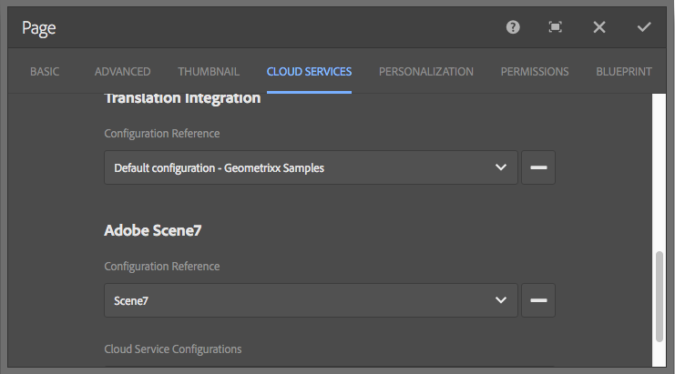

# 整合Adobe Experience Manager與Dynamic Media Classic {#integrating-with-dynamic-media-classic-scene}

Adobe Dynamic Media Classic是一個托管解決方案，用於管理、增強、發佈和將富媒體資產交付到Web、移動、電子郵件和網際網路連接的顯示和打印。

要使用Dynamic Media Classic，您必須配置雲配置，以便Dynamic Media Classic和Adobe Experience Manager資產能夠彼此交互。 本文檔介紹如何配置Experience Manager和Dynamic Media Classic。

有關在頁面上使用所有Dynamic Media Classic元件和處理視頻的資訊，請參見 [使用Dynamic Media Classic](../assets/scene7.md)。

>[!NOTE]
>
>* Dynamic Media Classic的DHTML觀看平台於2014年1月31日正式停工。 有關詳細資訊，請參見 [DHTML查看器生命週期結束常見問題](../sites-administering/dhtml-viewer-endoflifefaqs.md)。
>* 在配置Dynamic Media Classic以使用Experience Manager之前，請參見 [最佳做法](#best-practices-for-integrating-scene-with-aem) 把Dynamic Media Classic和Experience Manager融為一體。
>* 如果將Dynamic Media Classic與自定義代理配置一起使用，則必須同時配置兩個HTTP客戶端代理配置，因為Experience Manager的某些功能使用3.x API，而其他功能使用4.x API。 3.x配置 [http://localhost:4502/system/console/configMgr/com.day.commons.httpclient](http://localhost:4502/system/console/configMgr/com.day.commons.httpclient) 和4.x配置 [http://localhost:4502/system/console/configMgr/org.apache.http.proxyconfigurator](http://localhost:4502/system/console/configMgr/org.apache.http.proxyconfigurator)。
>

## Experience Manager/Dynamic Media Classic一體化與Dynamic Media {#aem-scene-integration-versus-dynamic-media}

Experience Manager用戶可以在兩種解決方案中做出選擇，以便與Dynamic Media合作。 可以使用下列選項之一：

* 將您的Experience Manager實例與Dynamic Media Classic整合。
* 使用整合到Experience Manager的Dynamic Media。

使用以下標準確定要選擇的解決方案：

* 你是 **現有** Dynamic Media Classic客戶的資產駐留在Dynamic Media Classic以進行發佈和交付，但您希望將這些資產與網站(WCM)創作或Experience Manager Assets或兩者整合？ 如果是，請使用 [Experience Manager/Dynamic Media Classic點對點整合](#aem-scene-point-to-point-integration) 中的說明。

* 如果你是 **新** Experience Manager具有富媒體傳輸需求的客戶，選擇 [Dynamic Media選項](#aem-dynamic-media)。 如果您沒有現有的S7帳戶，並且該系統中儲存了許多資產，則此選項最有意義。

* 在某些情況下，請同時使用這兩種解決方案。 的 [兩用方案](/help/sites-administering/scene7.md#dual-use-scenario) 描述該方案。

### Experience Manager/Dynamic Media Classic點對點整合 {#aem-scene-point-to-point-integration}

在此解決方案中處理資產時，您執行以下操作之一：

* 將資產直接上載到Dynamic Media Classic，然後通過 **Dynamic Media Classic** 頁面創作或
* 上傳到Experience Manager Assets，然後自動發佈到Dynamic Media Classic;通過 **資產** 頁面創作內容瀏覽器

用於此整合的元件位於 **Dynamic Media Classic** 元件區域 [設計模式](/help/sites-authoring/author-environment-tools.md#page-modes)。

### Experience ManagerDynamic Media {#aem-dynamic-media}

Experience ManagerDynamic Media是Dynamic Media Classic特色的統一，直接在Experience Manager平台內。

在此解決方案中處理資產時，請遵循以下工作流：

1. 將單個影像和視頻資產直接上載到Experience Manager。
1. 直接在Experience Manager中編碼視頻。
1. 直接在Experience Manager內構建基於映像的集。
1. 如果適用，請向影像或視頻添加交互性。

用於Dynamic Media的元件位於 **[!UICONTROL Dynamic Media]** 元件區域 [設計模式](/help/sites-authoring/author-environment-tools.md#page-modes)。 它們包括：

* **[!UICONTROL Dynamic Media]** - **[!UICONTROL Dynamic Media]** 元件是智慧的 — 根據您是添加影像還是添加視頻，您有各種選項。 該元件支援影像預設、基於影像的查看器，如影像集、旋轉集、混合媒體集和視頻。 此外，查看器會響應 — 螢幕大小會根據螢幕大小自動更改。 所有觀眾都是HTML五觀眾。

* **[!UICONTROL 互動式媒體]** - **[!UICONTROL 互動式媒體]** 元件用於資源，如旋轉木馬橫幅、互動式影像和互動式視頻。 這些資產在它們中具有交互性，例如熱點或影像映射。 此元件是智慧的。 即，根據您是添加影像還是添加視頻，您有各種選項。 此外，查看器會響應 — 螢幕大小會根據螢幕大小自動更改。 所有觀眾都是HTML五觀眾。

### 兩用方案 {#dual-use-scenario}

開箱即可同時使用Dynamic Media和Dynamic Media Classic的Experience Manager整合功能。 以下用例表說明了在開啟和關閉某些區域時的使用情況。

同時使用Dynamic Media和Dynamic Media Classic:

1. 配置 [Dynamic Media Classic](#creating-a-cloud-configuration-for-scene) Cloud Services。
1. 請按照您的使用案例特定的說明操作：

   <table>
    <tbody>
    <tr>
    <td> </td>
    <td> </td>
    <td><strong>Dynamic Media</strong></td>
    <td> </td>
    <td><strong>Dynamic Media Classic整合</strong></td>
    <td> </td>
    </tr>
    <tr>
    <td><strong>如果你……</strong></td>
    <td><strong>用例工作流</strong></td>
    <td><strong>成像/視頻</strong></td>
    <td><strong>動態媒體元件</strong></td>
    <td><strong>S7內容瀏覽器和元件</strong></td>
    <td><strong>自動從資產上載到S7</strong></td>
    </tr>
    <tr>
    <td>新建站點和Dynamic Media</td>
    <td>將資產上載到Experience Manager並使用Experience ManagerDynamic Media元件在「站點」頁上建立資產</td>
    <td>
開啟
 
（參見步驟3）
 </td>
    <td><a href="/help/assets/adding-dynamic-media-assets-to-pages.md">開啟</a></td>
    <td>關閉</td>
    <td>關閉</td>
    </tr>
    <tr>
    <td>在零售業，新到站點和Dynamic Media</td>
    <td>將非產品資產上載到Experience Manager以進行管理和交付。 將PRODUCT資產上載到Dynamic Media Classic，並在Experience Manager和元件中使用Dynamic Media Classic內容瀏覽器在站點上建立產品詳細資訊頁面。</td>
    <td>
開啟
 
（參見步驟3）
 </td>
    <td><a href="/help/assets/adding-dynamic-media-assets-to-pages.md">開啟</a></td>
    <td><a href="/help/assets/scene7.md#scene-content-browser">開啟</a></td>
    <td>關閉</td>
    </tr>
    <tr>
    <td>新資產和Dynamic Media</td>
    <td>將資產上載到Experience Manager Assets，並使用從Dynamic Media發佈的URL/嵌入代碼</td>
    <td>
開啟
 
（參見步驟3）
 </td>
    <td>關閉</td>
    <td>關閉</td>
    <td>關閉</td>
    </tr>
    <tr>
    <td>Dynamic Media和模板</td>
    <td>使用Dynamic Media進行成像和視頻。 在Dynamic Media Classic編寫影像模板，並使用Dynamic Media Classic內容查找器在「站點」頁面中包括模板。</td>
    <td>
開啟
 
（參見步驟3）
 </td>
    <td><a href="/help/assets/adding-dynamic-media-assets-to-pages.md">開啟</a></td>
    <td><a href="/help/assets/scene7.md#scene-content-browser">開啟</a></td>
    <td>關閉</td>
    </tr>
    <tr>
    <td>現有Dynamic Media Classic客戶，且是新客戶</td>
    <td>將資產上載到Dynamic Media Classic，並使用Experience ManagerDynamic Media Classic內容瀏覽器搜索和在網站頁面上建立資產</td>
    <td>關閉</td>
    <td>關閉</td>
    <td><a href="/help/assets/scene7.md#scene-content-browser">開啟</a></td>
    <td>關閉</td>
    </tr>
    <tr>
    <td>現有Dynamic Media Classic客戶，並且是新客戶</td>
    <td>將資產上載到DAM並自動發佈到Dynamic Media Classic以供交付。 使用Experience ManagerDynamic Media Classic內容瀏覽器搜索和在「站點」頁面上建立資產。</td>
    <td>關閉</td>
    <td>關閉</td>
    <td><a href="/help/assets/scene7.md#scene-content-browser">開啟</a></td>
    <td>
<a href="#configuringautouploadingfromaemassets">開啟</a>
 
（參見步驟4）
 </td>
    </tr>
    <tr>
    <td>現有Dynamic Media Classic客戶和新資產</td>
    <td>
將資產上載到Experience Manager並使用Dynamic Media生成格式副本以供下載/共用。 自動將Experience Manager資產發佈到Dynamic Media Classic以供交付。
 
<strong>重要提示：</strong> 在Experience Manager中生成的重複處理和格式副本與Dynamic Media Classic不同步
 </td>
    <td>
開啟
 
（參見步驟3）
 </td>
    <td>關閉</td>
    <td>關閉</td>
    <td>
<a href="#configuringautouploadingfromaemassets">開啟</a>
 
（參見步驟4）
 </td>
    </tr>
    </tbody>
    </table>

1. (可選；請參閱用例表) — 設定 [Dynamic Media雲配置](/help/assets/config-dynamic.md) 和 [啟用Dynamic Media伺服器](/help/assets/config-dynamic.md)。
1. (可選；請參閱用例表) — 如果選擇啟用「從資產自動上載到Dynamic Media Classic」，則必須添加以下內容：

   1. 設定自動上載到Dynamic Media Classic。
   1. 添加 **Dynamic Media Classic上傳** 在所有Dynamic Media工作流步驟之後 *在* **大壩更新資產** 工作流(W) `https://<server>:<host>/cf#/etc/workflow/models/dam/update_asset.html)`
   1. （可選）按MIME類型限制Dynamic Media Classic資產上載 [https://&lt;server>:&lt;port>/system/console/configMgr/com.day.cq.dam.scene7.impl.Scene7AssetMimeTypeServiceImpl](http://localhost:4502/system/console/configMgr/com.day.cq.dam.scene7.impl.Scene7AssetMimeTypeServiceImpl)。 未在此清單中的資產MIME類型未上載到Dynamic Media Classic伺服器。
   1. （可選）在Dynamic Media Classic配置中設定視頻。 可以同時為Dynamic Media和Dynamic Media Classic啟用視頻編碼。 在Experience Manager實例中，動態格式副本用於本地預覽和回放，而Dynamic Media Classic視頻格式副本則生成並儲存在Dynamic Media Classic伺服器上。 為Dynamic Media和Dynamic Media Classic設定視頻編碼服務時，應用 [視頻處理配置檔案](/help/assets/video-profiles.md) 到Dynamic Media Classic資產資料夾。
   1. （可選） [在Dynamic Media Classic配置安全預覽](/help/sites-administering/scene7.md#configuring-the-state-published-unpublished-of-assets-pushed-to-scene)。

#### 限制 {#limitations}

啟用Dynamic Media Classic和Dynamic Media後，將存在以下限制：

* 通過選擇資產並將其拖到Experience Manager頁面上的Dynamic Media Classic元件，手動上載到Dynamic Media Classic不起作用。
* 即使在「資產」中編輯資產時，Experience Manager-Dynamic Media Classic同步的資產將自動更新到Dynamic Media Classic，回滾操作也不會觸發新的上載。 因此，在回滾後，Dynamic Media Classic不會立即獲取最新版本。 解決方法是在回滾完成後再次編輯。
* 您是否有必要將Dynamic Media用於一個用例，將Dynamic Media Classic整合用於另一個用例，以便Dynamic Media資產不與Dynamic Media Classic系統互動？ 如果是，則不要將Dynamic Media Classic配置應用於Dynamic Media資料夾。 而且，不要將Dynamic Media配置（處理配置檔案）應用到Dynamic Media Classic資料夾。

## 將Dynamic Media Classic與Experience Manager結合的最佳做法 {#best-practices-for-integrating-scene-with-aem}

在將Dynamic Media Classic與Experience Manager結合起來時，必須在以下領域遵守一些重要的最佳做法：

* Test推動整合
* 直接從Dynamic Media Classic上傳資產，建議在某些情況下

請參閱 [已知限制](#known-limitations-and-design-implications)。

### Test — 推動整合 {#test-driving-your-integration}

Adobe建議您通過只將根資料夾指向子資料夾而不是整個公司來test驅動整合。

>[!CAUTION]
>
>從現有Dynamic Media Classic公司帳戶導入資產可能需要很長時間才能在Experience Manager中顯示。 確保在Dynamic Media Classic指定資產不太多的資料夾（例如，根資料夾通常資產太多，並且可能導致系統崩潰）。

### 從Experience Manager Assets上載資產與從Dynamic Media Classic上載資產 {#uploading-assets-from-aem-assets-versus-from-scene}

您可以使用資產（數字資產管理）功能或通過通過Dynamic Media Classic內容瀏覽器直接以Experience Manager方式訪問Dynamic Media Classic來上載資產。 您選擇哪個取決於以下因素：

* Dynamic Media Classic尚不支援的Experience Manager Assets資產類型必須通過Dynamic Media Classic內容瀏覽器從Dynamic Media Classic直接添加到Experience Manager網站。 例如，影像模板。
* 對於Experience Manager Assets和Dynamic Media Classic都支援的資產類型，決定如何上載這些資產類型取決於以下各項：

   * 當前資產所在位置
   * 在公用儲存庫中管理它們有多重要

假設資產已在Dynamic Media Classic，並且在公共儲存庫中管理這些資產並不重要。 如果情況如此，那麼將這些資產出口到Experience Manager Assets，只是為了將它們同步回Dynamic Media Classic交付，這是不必要的往返。 Adobe建議將資產保留在單個儲存庫中，並同步到Dynamic Media Classic以僅交付。

## 配置Dynamic Media Classic整合 {#configuring-scene-integration}

您可以配置Experience Manager以將資產上載到Dynamic Media Classic。 可以從CQ目標資料夾將資產從Experience Manager上載（自動或手動）到Dynamic Media Classic公司帳戶。

>[!NOTE]
>
>Adobe建議您只使用指定的目標資料夾來導入Dynamic Media Classic資產。 駐留在目標資料夾之外的數字資產只能用於啟用了Dynamic Media Classic配置的頁面上的Dynamic Media Classic元件。 此外，這些檔案還放在Dynamic Media Classic的按需資料夾中。 按需資料夾未與Experience Manager同步(但在Dynamic Media Classic內容瀏覽器中可發現資產)。

**要配置Dynamic Media Classic以與Experience Manager整合：**

1. [定義雲配置](#creating-a-cloud-configuration-for-scene)  — 定義Dynamic Media Classic資料夾和資產資料夾之間的映射。 即使您只想單向(從Experience Manager Assets到Dynamic Media Classic)同步，也可以完成此步驟。
1. [啟用 **Adobe CQ七壩大壩監聽器**](#enabling-the-adobe-cq-scene-dam-listener)  — 在 [!UICONTROL OSGi] 控制台。
1. 如果希望Experience Manager Assets自動上載到Dynamic Media Classic，必須開啟該選項並將Dynamic Media Classic添加到 [!UICONTROL DAM更新資產] 工作流。 您還可以手動上載資產。
1. 將Dynamic Media Classic元件添加到旁邊。 此功能允許用戶在其Experience Manager頁上使用Dynamic Media Classic元件。
1. [將配置映射到Experience Manager中的頁面](#enabling-scene-for-wcm)  — 查看您在Dynamic Media Classic建立的任何視頻預設時，需要此步驟。 如果必須從CQ目標資料夾外部執行將資產發佈到Dynamic Media Classic，則還需要此選項。

本節介紹如何執行所有這些步驟並列出重要限制。

### Dynamic Media Classic和Experience Manager Assets的同步工作 {#how-synchronization-between-scene-and-aem-assets-works}

在設定Experience Manager Assets和Dynamic Media Classic同步時，必須瞭解以下內容：

#### 從Experience Manager Assets上載到Dynamic Media Classic {#uploading-to-scene-from-aem-assets}

* 有一個指定的同步資料夾正在Experience Manager，用於Dynamic Media Classic上載。
* 如果將數字資產放在指定的同步資料夾中，則可以自動上載到Dynamic Media Classic。
* Experience Manager中的資料夾和子資料夾結構在Dynamic Media Classic複製。

>[!NOTE]
>
>Experience Manager在將元資料上XMP傳到Dynamic Media Classic之前就嵌入了所有元資料，因此元資料節點上的所有屬性在Dynamic Media Classic可XMP用。

#### 已知限制和設計含義 {#known-limitations-and-design-implications}

隨著Experience Manager Assets和Dynamic Media Classic的同步，目前存在以下限制/設計影響：

<table>
 <tbody>
  <tr>
   <td><strong>限制/設計含義</strong></td>
   <td><strong>說明</strong></td>
  </tr>
  <tr>
   <td>一個指定的同步（目標）資料夾</td>
   <td>每個公司只能有一個指定的資料夾，以Experience ManagerDynamic Media Classic上傳。 如果您必須能夠訪問Dynamic Media Classic的多個公司帳戶，則可以建立多個配置。</td>
  </tr>
  <tr>
   <td>資料夾結構</td>
   <td>如果刪除具有資產的同步資料夾，則所有Dynamic Media Classic遠程資產都將被刪除，但該資料夾仍然存在。</td>
  </tr>
  <tr>
   <td>按需資料夾</td>
   <td>位於WCM中手動上載到Dynamic Media Classic的目標資料夾外的資產將自動置於Dynamic Media Classic的單獨按需資料夾中。 您可以在雲配置中配置此資料夾，Experience Manager。</td>
  </tr>
  <tr>
   <td>混合介質</td>
   <td>混合媒體集在Experience Manager中顯示，但在Experience Manager中不支援。</td>
  </tr>
  <tr>
   <td>PDF</td>
   <td>從Dynamic Media Classic的eCatalogs生成的PDF將導入到CQ目標資料夾中。</td>
  </tr>
  <tr>
   <td>UI刷新</td>
   <td>在Experience Manager和Dynamic Media Classic之間同步時，請確保刷新用戶介面以查看更改。 </td>
  </tr>
  <tr>
   <td>視頻縮略圖</td>
   <td>如果通過Dynamic Media Classic將視頻上傳到Experience Manager Assets進行編碼，則視頻縮略圖和編碼視頻可能需要一些時間才能在Experience Manager Assets獲得，具體取決於視頻處理時間。</td>
  </tr>
  <tr>
   <td>目標子資料夾</td>
   <td>
如果在目標資料夾內使用子資料夾，請確保對每個資產使用唯一的名稱（不管位置）。 另外，確保將Dynamic Media Classic（在「設定」區域）配置為不覆蓋資產，而不考慮其位置。
 
否則，將上載與上載到Dynamic Media Classic目標子資料夾的同名資產，但刪除目標資料夾中的同名資產。 
 </td>
  </tr>
 </tbody>
</table>

### 配置Dynamic Media Classic伺服器 {#configuring-scene-servers}

如果在代理後運行Experience Manager或具有特殊的防火牆設定，則必須顯式啟用不同區域的主機。 在中的內容中管理伺服器 `/etc/cloudservices/scene7/endpoints` 可根據需要自定義。 選擇URL，然後編輯以更改URL（如有必要）。 在以前的Experience Manager版本中，這些值是硬編碼的。

如果導航到 `/etc/cloudservices/scene7/endpoints.html`，您可以看到列出的伺服器（並可以通過點擊URL來編輯它們）:

### 為Dynamic Media Classic建立雲配置 {#creating-a-cloud-configuration-for-scene}

雲配置定義Dynamic Media Classic資料夾和Experience Manager Assets資料夾之間的映射。 必須配置它使Experience Manager Assets與Dynamic Media Classic同步。 有關詳細資訊，請參閱同步工作方式。

>[!CAUTION]
>
>從現有Dynamic Media Classic公司帳戶導入資產可能需要很長時間才能在Experience Manager中顯示。 確保在Dynamic Media Classic指定資產不太多的資料夾。 例如，根資料夾的資產通常過多。
>
>如果要test驅動整合，請將根資料夾僅指向子資料夾，而不是整個公司。

>[!NOTE]
>
>您可以有多種配置：一個雲配置表示Dynamic Media Classic公司的一個用戶。 如果要訪問其他Dynamic Media Classic公司或用戶，必須建立多個配置。

**要為Dynamic Media Classic建立雲配置：**

1. 選擇Experience Manager表徵圖並導航至 **[!UICONTROL 部署]** > **[!UICONTROL Cloud Services]** 這樣你就能進入Adobe Dynamic Media Classic。

1. 選擇 **[!UICONTROL 立即配置]**。

   

1. 在 **[!UICONTROL 標題]** 欄位，或 **[!UICONTROL 名稱]** 欄位中，輸入相應的資訊。 選擇 **[!UICONTROL 建立]**。

   >[!NOTE]
   >
   >建立更多配置時， **[!UICONTROL 父配置]** 的下界。
   >
   >做 **不** 更改父配置。 更改父配置可能會中斷整合。

1. 輸入您的Dynamic Media Classic帳戶的電子郵件地址、密碼和區域，然後選擇 **[!UICONTROL 連接到Dynamic Media Classic]**。 您已連接到Dynamic Media Classic伺服器，該對話框將用更多選項展開。

1. 輸入 **[!UICONTROL 公司]** 名稱和 **[!UICONTROL 根路徑]**。 此資訊是發佈的伺服器名稱以及要指定的任何路徑。 如果您不知道已發佈的伺服器名，請在Dynamic Media Classic，轉到 **[!UICONTROL 設定>應用程式設定]**)。

   >[!NOTE]
   >
   >Dynamic Media Classic根路徑是連接到的Dynamic Media Classic資料夾Experience Manager。 可將其縮小到特定資料夾。

   >[!CAUTION]
   >
   >根據Dynamic Media Classic資料夾的大小，導入根資料夾可能需要很長時間。 此外，Dynamic Media Classic資料可能超過Experience Manager儲存。 確保導入的資料夾正確。 導入過多資料可以停止系統。

   

1. 選擇 **[!UICONTROL 確定]**。 Experience Manager保存配置。

>[!NOTE]
>
>如果要重新連接：
>
>* 在發佈時重新連接到Dynamic Media Classic時，在發佈時重置密碼或重新連接時無法工作（在「作者」實例上不是問題）。
>* 如果修改區域、公司名稱等值，則必須重新連接到Dynamic Media Classic。 如果配置選項已修改但未保存，則Experience Manager仍錯誤地表示配置有效。 確保重新連接。
>

### 啟用Adobe CQDynamic Media Classic大壩監聽器 {#enabling-the-adobe-cq-scene-dam-listener}

啟用預設禁用的Adobe CQDynamic Media Classic大壩偵聽器。

**要啟用Adobe CQDynamic Media Classic大壩監聽器，請執行以下操作：**

1. 選擇 [!UICONTROL 工具] 表徵圖，然後導航 **[!UICONTROL 操作]** > **[!UICONTROL Web控制台]**。
1. 在Web控制台中，導航到 **[!UICONTROL Adobe CQDynamic Media Classic大壩監聽器]** 的 **[!UICONTROL 已啟用]** 的子菜單。

   

1. 選取&#x200B;**[!UICONTROL 儲存]**。

### 向Dynamic Media Classic上載工作流添加可配置超時 {#adding-configurable-timeout-to-scene-upload-workflow}

當Experience Manager實例配置為通過Dynamic Media Classic處理視頻編碼時，預設情況下，任何上載作業都會超時35分鐘。 要容納可能運行時間更長的視頻編碼作業，可以配置此設定。

1. 導航到 **http://localhost:4502/system/console/configMgr/com.day.cq.dam.scene7.impl.Scene7UploadServiceImpl**。

   

1. 根據需要更改 **[!UICONTROL 活動作業超時]** 的子菜單。 任何非負數都以度量單位（以秒為單位）被接受。 預設情況下，此數字設定為2100。

   >[!NOTE]
   >
   >最佳做法：大多數資產最多在幾分鐘內被攝取（例如影像）。 但在某些情況下，將超時值增加到7200秒（兩小時），以適應較長的處理時間。 否則，此Dynamic Media Classic上載作業將標籤為 **[!UICONTROL 上載失敗]** JCR（Java™內容儲存庫）元資料。

1. 選取&#x200B;**[!UICONTROL 儲存]**。

### 奧圖普洛德來自Experience Manager Assets {#autouploading-from-aem-assets}

從Experience Manager6.3.2開始，配置Experience Manager Assets，以便將任何上載的數字資產更新到Dynamic Media Classic（如果這些資產位於CQ目標資料夾中）。

當資產被添加到Experience Manager Assets時，它會自動上傳並發佈到Dynamic Media Classic。

>[!NOTE]
>
>自動從Experience Manager Assets上載到Dynamic Media Classic的最大檔案大小為500 MB。

**從Experience Manager Assets寄來：**

1. 選擇Experience Manager表徵圖並導航至 **[!UICONTROL 部署]** > **[!UICONTROL Cloud Services]**。
1. 在「Dynamic Media」標題下的「可用配置」下，選擇 **[!UICONTROL dms7(Dynamic Media)]**)。
1. 選擇 **[!UICONTROL 高級]** 頁籤 **[!UICONTROL 啟用自動上載]** 複選框，然後選擇 **[!UICONTROL 確定]**。 您現在必須配置DAM資產工作流以包括上載到Dynamic Media Classic。

   >[!NOTE]
   >
   >請參閱 [配置推送到Dynamic Media Classic的資產的狀態（已發佈/未發佈）](#configuring-the-state-published-unpublished-of-assets-pushed-to-scene) 有關將資產推入未公開州的Dynamic Media Classic的資訊。

   

1. 導航回Experience Manager歡迎頁並選擇 **[!UICONTROL 工作流]**。 按兩下 **DAM更新資產** 工作流以便開啟。
1. 在旁邊，導航到 **[!UICONTROL 工作流]** 元件，然後選擇 **[!UICONTROL Dynamic Media Classic]**。 拖動 **[!UICONTROL Dynamic Media Classic]** 選擇 **[!UICONTROL 保存]**。 添加到目標資料夾中的Experience Manager Assets的資產將自動上載到Dynamic Media Classic。

   

   >[!NOTE]
   >
   >* 在自動化後添加資產時，如果資產未放在CQ目標資料夾中，則不會將其上載到Dynamic Media Classic。
   >* Experience Manager在將元資料上XMP傳到Dynamic Media Classic之前就嵌入了所有元資料，因此元資料節點上的所有屬性在Dynamic Media Classic可XMP用。

### 配置推送到Dynamic Media Classic的資產的狀態（已發佈/未發佈） {#configuring-the-state-published-unpublished-of-assets-pushed-to-scene}

如果將資產從Experience Manager Assets推送到Dynamic Media Classic，則可以自動發佈（預設行為）或將資產推送到未發佈狀態的Dynamic Media Classic。

如果您希望在運行前將資產test到分段環境中，則可能不希望立即在Dynamic Media Classic發佈資產。 您可以使用與Dynamic Media Classic的安全Test環境的Experience Manager，將資產直接從Assets以未公開的狀態推入Dynamic Media Classic。

Dynamic Media Classic資產仍可通過安全預覽獲得。 只有在Experience Manager內公佈資產，Dynamic Media Classic的資產才能投入生產。

如果要在將資產推送到Dynamic Media Classic時立即發佈資產，則無需配置任何選項。 此功能是預設行為。

但是，如果您不希望將資產推送到Dynamic Media Classic自動發佈，本節將介紹如何配置Experience Manager和Dynamic Media Classic以執行此功能。

#### 將資產推送到Dynamic Media Classic未發佈的先決條件 {#prerequisites-to-push-assets-to-scene-unpublished}

在將資產推送到Dynamic Media Classic而不發佈之前，必須設定以下內容：

1. [使用Admin Console建立支援案例](https://helpx.adobe.com/tw/enterprise/admin-guide.html/enterprise/using/support-for-experience-cloud.ug.html)。 在您的支援案例中，請為您的Dynamic Media Classic帳戶啟用安全預覽。
1. [為你的Dynamic Media Classic帳戶設定安全預覽](https://experienceleague.adobe.com/docs/dynamic-media-classic/using/upload-publish/testing-assets-making-them-public.html?lang=en)。

這些步驟與您在Dynamic Media Classic建立任何安全test設定時遵循的步驟相同。

>[!NOTE]
>
>如果安裝環境是UNIX® 64位作業系統，請參見 [https://helpx.adobe.com/experience-manager/kb/enable-xmp-write-back-64-bit-redhat.html](https://helpx.adobe.com/experience-manager/kb/enable-xmp-write-back-64-bit-redhat.html) 關於您必須設定的其他配置選項。

#### 將資產推入未發佈狀態的已知限制  {#known-limitations-for-pushing-assets-in-unpublished-state}

如果使用此功能，請注意以下限制：

* 不支援版本控制。
* 如果資產已在Experience Manager中發佈，並且建立了後續版本，則新版本將立即在生產現場發佈。 激活時發佈僅與資產的初始發佈配合使用。

>[!NOTE]
>
>如果您想立即發佈資產，最佳做法是 **[!UICONTROL 啟用安全預覽]** 設定為 **[!UICONTROL 立即]** 並使用 **[!UICONTROL 啟用自動上載]** 的子菜單。

### 將被推至Dynamic Media Classic的資產狀態設定為未發佈 {#setting-the-state-of-assets-pushed-to-scene-as-unpublished}

>[!NOTE]
>
>如果用戶發佈正在Experience Manager的資產，它會自動將S7資產觸發到生產/即時資產（該資產不再處於安全預覽/未發佈狀態）。

**將被推至Dynamic Media Classic的資產狀態設定為未公佈：**

1. 選擇Experience Manager表徵圖並導航至 **[!UICONTROL 部署]** > **[!UICONTROL Cloud Services]**。
1. 選擇 **[!UICONTROL Dynamic Media Classic]**。
1. 選擇您在Dynamic Media Classic的配置。
1. 選擇 **[!UICONTROL 高級]** 頁籤。
1. 在 **[!UICONTROL 啟用安全視圖]** 下拉菜單，選擇 **[!UICONTROL AEM發佈激活時]** 將資產轉移給Dynamic Media Classic，而不發佈。 (預設情況下，此值設定為 **[!UICONTROL 立即]**),Dynamic Media Classic資產將立即發佈。

   請參閱 [Dynamic Media Classic文檔](https://experienceleague.adobe.com/docs/dynamic-media-classic/using/upload-publish/testing-assets-making-them-public.html) 以獲取有關在資產公開前測試其的更多資訊。

   

1. 選擇 **[!UICONTROL 確定]**。

啟用「安全預覽」意味著您的資產被推送到未發佈的安全預覽伺服器。

查看 **[!UICONTROL 安全預覽]** 啟用，導航至Experience Manager中頁面上的Dynamic Media Classic元件。 選取&#x200B;**[!UICONTROL 編輯]**。資產在URL中列出了安全預覽伺服器。 在Experience Manager中發佈後，檔案引用中的伺服器域將從預覽URL更新到生產URL。

### 為WCM啟用Dynamic Media Classic {#enabling-scene-for-wcm}

為WCM啟用Dynamic Media Classic需要有兩個原因：

* 它啟用用於頁面創作的通用視頻配置檔案的下拉清單。 如果沒有這份名單， **[!UICONTROL 通用視頻預設]** 下拉清單為空，無法設定。
* 如果目標資料夾中沒有數字資產，則如果在頁面屬性中為該頁面啟用Dynamic Media Classic，則可以將該資產上載到Dynamic Media Classic。 然後將資產拖放到Dynamic Media Classic元件上。 適用普通繼承規則（表示子頁從父頁繼承配置）。

在為WCM啟用Dynamic Media Classic時，應用繼承規則。 您可以在觸摸優化或經典用戶介面中啟用Dynamic Media ClassicWCM。

#### 在觸控優化用戶介面中啟用Dynamic Media ClassicWCM {#enabling-scene-for-wcm-in-the-touch-optimized-user-interface}

1. 選擇Experience Manager表徵圖並導航至 **[!UICONTROL 站點]**，然後是網站的根頁（不是特定於語言的）。

1. 在工具欄中，選擇 [!UICONTROL 設定] 表徵圖 **[!UICONTROL 開啟屬性]**。

1. 選擇 **[!UICONTROL Cloud Services]** 選擇 **[!UICONTROL 添加配置]** 選擇 **[!UICONTROL Dynamic Media Classic]**。
1. 在 **[!UICONTROL Adobe Dynamic Media Classic]** 下拉清單，選擇所需的配置，然後選擇 **[!UICONTROL 確定]**。

   

   Dynamic Media Classic配置中的視頻預設可與該頁和子頁上的Dynamic Media Classic視頻元件Experience Manager使用。

#### 在Classic用戶介面中為WCM啟用Dynamic Media Classic {#enabling-scene-for-wcm-in-the-classic-user-interface}

1. 在Experience Manager中，選擇 **[!UICONTROL 網站]** 並導航到網站的根頁（不特定於語言）。

1. 在旁角中，選擇 **[!UICONTROL 頁面]** 表徵圖 **[!UICONTROL 頁面屬性]**。

1. 選擇 **[!UICONTROL Cloud Services]** > **[!UICONTROL 添加服務]** > **[!UICONTROL Dynamic Media Classic]**。
1. 在 **[!UICONTROL Adobe Dynamic Media Classic]** 下拉清單，選擇所需的配置，然後選擇 **[!UICONTROL 確定]**。

   Dynamic Media Classic配置中的視頻預設可與該頁和子頁上的Dynamic Media Classic視頻元件Experience Manager使用。

### 配置預設配置 {#configuring-a-default-configuration}

如果您有多個Dynamic Media Classic配置，則可以將其中一個配置指定為Dynamic Media Classic內容瀏覽器的預設配置。

在給定時刻，只能將一個Dynamic Media Classic配置標籤為預設。 預設配置是預設顯示在Dynamic Media Classic內容瀏覽器中的公司資產。

**配置預設配置：**

1. 選擇Experience Manager表徵圖並導航至 **[!UICONTROL 部署]** > **[!UICONTROL Cloud Services]**。
1. 選擇 **[!UICONTROL Dynamic Media Classic]**。
1. 選擇您在Dynamic Media Classic的配置。
1. 要開啟配置，請選擇 **[!UICONTROL 編輯]**。

1. 在 **[!UICONTROL 常規]** 頁籤 **[!UICONTROL 預設配置]** 複選框，使其成為顯示在Dynamic Media Classic內容瀏覽器中的預設公司和根路徑。

   

   >[!NOTE]
   >
   >如果只有一個配置，請選擇 **[!UICONTROL 預設配置]** 複選框無效。

### 配置即席資料夾 {#configuring-the-ad-hoc-folder}

當資產不在CQ目標資料夾中時，您可以配置將資產上載到Dynamic Media Classic的按需資料夾。 請參閱從CQ目標資料夾外部發佈資產。

**配置即席資料夾：**

1. 選擇Experience Manager表徵圖並導航至 **[!UICONTROL 部署]** > **[!UICONTROL Cloud Services]**。
1. 選擇 **[!UICONTROL Dynamic Media Classic]**。
1. 選擇您在Dynamic Media Classic的配置。
1. 要開啟配置，請選擇 **[!UICONTROL 編輯]**。

1. 選擇 **[!UICONTROL 高級]** 頁籤。 在 **[!UICONTROL 即席資料夾]** 欄位，您可以修改 **臨時** 的子菜單。 預設情況下， **名稱_of_the_company/CQ5_adhoc**。

   

### 配置通用視頻預設 {#configuring-universal-presets}

要為視頻元件配置通用視頻預設，請參見 [視頻](/help/assets/s7-video.md)。

## 啟用基於MIME類型的資產/Dynamic Media Classic上載作業參數支援 {#enabling-mime-type-based-assets-scene-upload-job-parameter-support}

您可以啟用可配置的Dynamic Media Classic上載作業參數，這些作業參數由Digital Asset Manager/Dynamic Media Classic資產的同步觸發。

具體來說，您可以在「Experience ManagerWeb控制台配置」面板的OSGi（開放服務網關方案）區域按MIME類型配置接受的檔案格式。 然後，可以自定義JCR（Java™內容儲存庫）中每個MIME類型使用的各個上載作業參數。

**要啟用基於MIME類型的資產，請執行以下操作：**

1. 選擇Experience Manager表徵圖並導航至 **[!UICONTROL 工具]** > **[!UICONTROL 操作]** > **[!UICONTROL Web控制台]**。
1. 在「Adobe Experience ManagerWeb控制台配置」面板中， **[!UICONTROL OSGi]** 菜單，選擇 **[!UICONTROL 配置]**。
1. 在「名稱」(Name)列下，查找並選擇 **[!UICONTROL Adobe CQDynamic Media Classic資產MIME類型服務]** 編輯配置。
1. 在Mime類型映射區域中，選擇任何加號(+)以添加MIME類型。

   請參閱 [支援的MIME類型](/help/assets/assets-formats.md#supported-mime-types)。

1. 在文本欄位中，鍵入新的MIME類型名稱。

   例如，您可以鍵入 `<file_extension>=<mime_type>` 在 `EPS=application/postscript` 或 `PSD=image/vnd.adobe.photoshop`。

1. 在配置窗口的右下角，選擇 **[!UICONTROL 保存]**。
1. 返回Experience Manager，在左滑軌中，選擇 **[!UICONTROL CRXDE Lite]**。
1. 在CRXDE Lite頁面的左欄中，導航到 `/etc/cloudservices/scene7/<environment>` （替代） `<environment>` )。
1. 展開 `<environment>` （替代） `<environment>` 以顯示 `mimeTypes` 的下界。
1. 選擇剛添加的mimeType。

   比如說， `mimeTypes > application_postscript` 或 `mimeTypes > image_vnd.adobe.photoshop`。

1. 在CRXDE Lite頁的右側，選擇 **[!UICONTROL 屬性]** 頁籤。
1. 在中指定Dynamic Media Classic上載作業參數 **[!UICONTROL jobParam]** 值。

   比如說， `psprocess="rasterize"&psresolution=120` 。

   查看 [Adobe Dynamic Media Classic映像製作系統API](https://experienceleague.adobe.com/docs/dynamic-media-developer-resources/image-production-api/c-overview.html) 可以使用的上載作業參數。

   >[!NOTE]
   >
   >如果要上載PSD檔案，並且要將其作為具有層提取的模板進行處理，請在 **[!UICONTROL jobParam]** 值欄位：
   >
   >`process=MaintainLayers&layerNaming=AppendName&createTemplate=true`
   >
   >確保PSD檔案有「層」。 如果它嚴格是一幅影像或帶有蒙版的影像，則它將作為影像處理，因為沒有要處理的圖層。

1. 在CRXDE Lite頁的左上角，選擇 **[!UICONTROL 全部保存]**。

## 排除Dynamic Media Classic和Experience Manager整合故障 {#troubleshooting-scene-and-aem-integration}

如果您在將Experience Manager與Dynamic Media Classic整合時遇到困難，請參閱以下解決方案方案。

**如果向Dynamic Media Classic發佈數字資產失敗：**

* 檢查您要上載的資產是否位於 **[!UICONTROL CQ目標]** 資料夾(在Dynamic Media Classic雲配置中指定此資料夾)。
* 否則，必須在 **[!UICONTROL 頁面屬性]** 允許上載到 **[!UICONTROL CQ即席]** 的子菜單。

* 檢查日誌以瞭解任何資訊。

**如果未顯示視頻預設：**

* 確保已通過配置該頁的雲配置 **[!UICONTROL 頁面屬性]**。 Dynamic Media Classic視頻元件中提供視頻預設。

**如果視頻資產不以Experience Manager播放：**

* 確保使用了正確的視頻元件。 Dynamic Media Classic視頻元件與基礎視頻元件不同。 請參閱 [基礎視頻元件與Dynamic Media Classic視頻元件](/help/assets/s7-video.md)。

**如果Experience Manager中的新資產或修改的資產不會自動上載到Dynamic Media Classic:**

* 確保資產位於CQ目標資料夾中。 只自動更新CQ目標資料夾中的資產(前提是您將Experience Manager Assets配置為自動上載資產)。
* 確保已將Cloud Services配置配置為啟用自動上載，並且已更新並保存DAM資產工作流以包括Dynamic Media Classic上載。
* 將影像上載到Dynamic Media Classic目標資料夾的子資料夾中時，請確保執行下列操作之一：

   * 確保所有資產的名稱（無論位置）都是唯一的。 否則，主目標資料夾中的資產將被刪除，並且只保留子資料夾中的資產。
   * 更改Dynamic Media Classic在Dynamic Media Classic帳戶的「設定」區域覆蓋資產的方式。 如果在子資料夾中使用同名的資產，請不要設定Dynamic Media Classic覆蓋資產，而不考慮其位置。

**如果已刪除的資產或資料夾未在Dynamic Media Classic和Experience Manager之間同步：**

* 在Experience Manager Assets刪除的資產和資料夾仍顯示在Dynamic Media Classic的同步資料夾中。 手動刪除它們。

**如果視頻上載失敗：**

* 如果視頻上載失敗，並且您正在使用Experience Manager通過Dynamic Media Classic整合對視頻進行編碼，請參閱 [向Dynamic Media Classic上載工作流添加可配置超時](#adding-configurable-timeout-to-scene-upload-workflow)。

>[!CAUTION]
>
>從現有Dynamic Media Classic公司帳戶導入資產可能需要很長時間才能在Experience Manager中顯示。 確保在Dynamic Media Classic指定資產不太多的資料夾。 例如，根資料夾的資產通常過多。
>
>如果要test整合，請將根資料夾僅指向子資料夾，而不是整個公司。
