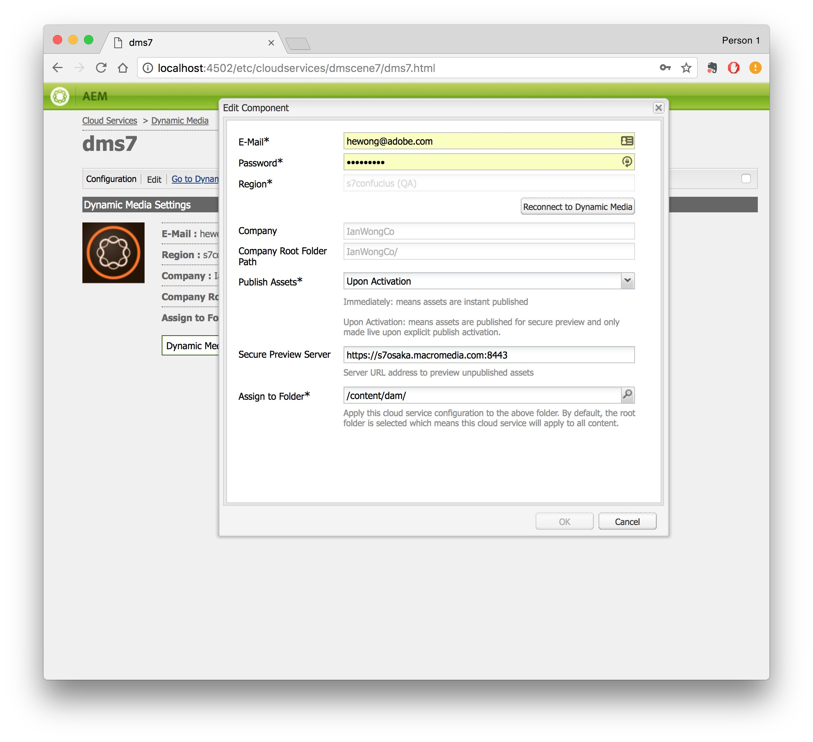

# 整合Adobe Experience Manager與Dynamic Media Classic {#integrating-with-dynamic-media-classic-scene}

Adobe Dynamic Media Classic是托管解決方案，可管理、增強、發佈和傳遞多媒體資產至網路、行動裝置、電子郵件及網際網路連線的顯示器及列印。

若要使用Dynamic Media Classic，您必須設定雲端設定，讓Dynamic Media Classic和Adobe Experience Manager資產可以互動。 本檔案說明如何設定Experience Manager和Dynamic Media Classic。

如需使用頁面上所有Dynamic Media Classic元件和處理影片的相關資訊，請參閱 [使用Dynamic Media Classic](../assets/scene7.md).

>[!NOTE]
>
>* Dynamic Media Classic的DHTML檢視器平台已於2014年1月31日正式終止服務。 如需詳細資訊，請參閱 [DHTML檢視器生命週期結束常見問題集](../sites-administering/dhtml-viewer-endoflifefaqs.md).
>* 在將Dynamic Media Classic設定為搭配Experience Manager使用之前，請參閱 [最佳實務](#best-practices-for-integrating-scene-with-aem) 將Dynamic Media Classic與Experience Manager整合。
>* 如果您使用Dynamic Media Classic搭配自訂的Proxy設定，則必須同時設定兩個HTTP Client Proxy設定，因為Experience Manager的某些功能使用3.x API，而其他功能則使用4.x API。 3.x的設定 [http://localhost:4502/system/console/configMgr/com.day.commons.httpclient](http://localhost:4502/system/console/configMgr/com.day.commons.httpclient) 和4.x [http://localhost:4502/system/console/configMgr/org.apache.http.proxyconfigurator](http://localhost:4502/system/console/configMgr/org.apache.http.proxyconfigurator).
>

## Experience Manager/Dynamic Media Classic整合與Dynamic Media {#aem-scene-integration-versus-dynamic-media}

Experience Manager使用者可以選擇使用Dynamic Media的兩種解決方案。 您可以使用下列其中一項：

* 將您的Experience Manager例項與Dynamic Media Classic整合。
* 使用已整合至Experience Manager的Dynamic Media。

請使用下列條件來決定要選擇的解決方案：

* 您是 **現有** Dynamic Media Classic客戶的資產位於Dynamic Media Classic以進行發佈和傳送，但您想要將這些資產與Sites(WCM)製作或Experience Manager Assets整合，還是兩者兼而有之？ 如果是，請使用 [Experience Manager/Dynamic Media Classic點對點整合](#aem-scene-point-to-point-integration) 本文檔中描述。

* 如果您是 **new** Experience Manager有多媒體傳送需求的客戶，請選取 [Dynamic Media選項](#aem-dynamic-media). 如果您沒有現有的S7帳戶，且該系統中儲存了許多資產，此選項最有意義。

* 在某些情況下，請同時使用這兩種解決方案。 此 [雙用方案](/help/sites-administering/scene7.md#dual-use-scenario) 說明該情況。

### Experience Manager/Dynamic Media Classic點對點整合 {#aem-scene-point-to-point-integration}

在此解決方案中使用資產時，您會執行下列其中一項作業：

* 將資產直接上傳至Dynamic Media Classic，然後透過 **Dynamic Media Classic** 頁面製作或
* 上傳至Experience Manager Assets，然後啟用自動發佈至Dynamic Media Classic;您可透過 **資產** 頁面製作內容瀏覽器

您用於這項整合的元件位於 **Dynamic Media Classic** 元件區域 [設計模式](/help/sites-authoring/author-environment-tools.md#page-modes).

### Experience ManagerDynamic Media {#aem-dynamic-media}

Experience ManagerDynamic Media是直接在Experience Manager平台中統一Dynamic Media Classic功能。

在此解決方案中使用資產時，請遵循此工作流程：

1. 直接上傳單一影像和視訊資產至Experience Manager。
1. 直接在Experience Manager中編碼視訊。
1. 直接在Experience Manager中建立影像型集。
1. 若適用，可為影像或影片增加互動功能。

您用於Dynamic Media的元件位於 **[!UICONTROL Dynamic Media]** 元件區域 [設計模式](/help/sites-authoring/author-environment-tools.md#page-modes). 包括下列項目：

* **[!UICONTROL Dynamic Media]** - **[!UICONTROL Dynamic Media]** 元件是智慧型的 — 視您新增影像或視訊而定，會有各種選項。 元件支援影像預設集、以影像為基礎的檢視器，例如影像集、回轉集、混合媒體集和視訊。 此外，檢視器回應速度快 — 螢幕大小會根據螢幕大小自動變更。 所有檢視器均為HTML5檢視器。

* **[!UICONTROL 互動式媒體]** - **[!UICONTROL 互動式媒體]** 元件適用於輪播橫幅、互動式影像和互動式視訊等資產。 這些資產在其中具有交互性，這些熱點或影像地圖。 此元件是智慧的。 也就是說，視您新增影像或影片而定，您有各種選項。 此外，檢視器回應速度快 — 螢幕大小會根據螢幕大小自動變更。 所有檢視器均為HTML5檢視器。

### 雙用方案 {#dual-use-scenario}

立即可用，您可以同時使用Dynamic Media和Dynamic Media Classic的Experience Manager整合功能。 下列使用案例表說明了何時開啟或關閉某些區域。

若要同時使用Dynamic Media和Dynamic Media Classic:

1. 設定 [Dynamic Media Classic](#creating-a-cloud-configuration-for-scene) 在Cloud Services中。
1. 請依照您使用案例的特定指示操作：

   <table>
    <tbody>
    <tr>
    <td> </td>
    <td> </td>
    <td><strong>Dynamic Media</strong></td>
    <td> </td>
    <td><strong>Dynamic Media Classic整合</strong></td>
    <td> </td>
    </tr>
    <tr>
    <td><strong>如果您……</strong></td>
    <td><strong>使用案例工作流程</strong></td>
    <td><strong>影像/影片</strong></td>
    <td><strong>動態媒體元件</strong></td>
    <td><strong>S7內容瀏覽器和元件</strong></td>
    <td><strong>從資產自動上傳至S7</strong></td>
    </tr>
    <tr>
    <td>網站與Dynamic Media新手</td>
    <td>上傳資產至Experience Manager，並使用Experience ManagerDynamic Media元件在Sites頁面上製作資產</td>
    <td>
開啟
 
（請參閱步驟3）
 </td>
    <td><a href="/help/assets/adding-dynamic-media-assets-to-pages.md">開啟</a></td>
    <td>關閉</td>
    <td>關閉</td>
    </tr>
    <tr>
    <td>零售、Sites和Dynamic Media新手</td>
    <td>上傳非產品資產至Experience Manager以進行管理和傳送。 將產品資產上傳至Dynamic Media Classic，並在Experience Manager和元件中使用Dynamic Media Classic內容瀏覽器，在Sites上製作產品詳細資料頁面。</td>
    <td>
開啟
 
（請參閱步驟3）
 </td>
    <td><a href="/help/assets/adding-dynamic-media-assets-to-pages.md">開啟</a></td>
    <td><a href="/help/assets/scene7.md#scene-content-browser">開啟</a></td>
    <td>關閉</td>
    </tr>
    <tr>
    <td>資產與Dynamic Media</td>
    <td>將資產上傳至Experience Manager Assets，並使用Dynamic Media中已發佈的URL/內嵌程式碼</td>
    <td>
開啟
 
（請參閱步驟3）
 </td>
    <td>關閉</td>
    <td>關閉</td>
    <td>關閉</td>
    </tr>
    <tr>
    <td>Dynamic Media和範本的新手</td>
    <td>使用Dynamic Media進行影像處理和影片處理。 在Dynamic Media Classic中製作影像範本，並使用Dynamic Media Classic內容尋找器在Sites頁面中納入範本。</td>
    <td>
開啟
 
（請參閱步驟3）
 </td>
    <td><a href="/help/assets/adding-dynamic-media-assets-to-pages.md">開啟</a></td>
    <td><a href="/help/assets/scene7.md#scene-content-browser">開啟</a></td>
    <td>關閉</td>
    </tr>
    <tr>
    <td>現有Dynamic Media Classic客戶，是Sites的新手</td>
    <td>將資產上傳至Dynamic Media Classic，並使用Experience ManagerDynamic Media Classic內容瀏覽器在Sites頁面上搜尋及撰寫資產</td>
    <td>關閉</td>
    <td>關閉</td>
    <td><a href="/help/assets/scene7.md#scene-content-browser">開啟</a></td>
    <td>關閉</td>
    </tr>
    <tr>
    <td>現有Dynamic Media Classic客戶，是Sites和Assets的新手</td>
    <td>上傳資產至DAM並自動發佈至Dynamic Media Classic以供傳送。 使用Experience ManagerDynamic Media Classic內容瀏覽器，在Sites頁面上搜尋和撰寫資產。</td>
    <td>關閉</td>
    <td>關閉</td>
    <td><a href="/help/assets/scene7.md#scene-content-browser">開啟</a></td>
    <td>
<a href="#configuringautouploadingfromaemassets">開啟</a>
 
（請參閱步驟4）
 </td>
    </tr>
    <tr>
    <td>現有Dynamic Media Classic客戶和新資產</td>
    <td>
上傳資產至Experience Manager，並使用Dynamic Media產生轉譯以供下載/共用。 自動將Experience Manager資產發佈至Dynamic Media Classic以供傳送。
 
<strong>重要：</strong> 在Experience Manager中產生的重複處理和轉譯不會同步到Dynamic Media Classic
 </td>
    <td>
開啟
 
（請參閱步驟3）
 </td>
    <td>關閉</td>
    <td>關閉</td>
    <td>
<a href="#configuringautouploadingfromaemassets">開啟</a>
 
（請參閱步驟4）
 </td>
    </tr>
    </tbody>
    </table>

1. (可選；請參閱使用案例表格) — 設定 [Dynamic Media雲端組態](/help/assets/config-dynamic.md) 和 [啟用Dynamic Media伺服器](/help/assets/config-dynamic.md).
1. (可選；請參閱使用案例表格) — 如果您選擇啟用「從資產自動上傳至Dynamic Media Classic」，則必須新增下列項目：

   1. 設定自動上傳至Dynamic Media Classic。
   1. 新增 **Dynamic Media Classic上傳** 在所有Dynamic Media工作流程步驟之後執行 *在* **Dam更新資產** 工作流程( `https://<server>:<host>/cf#/etc/workflow/models/dam/update_asset.html)`
   1. （選用）以MIME類型限制Dynamic Media Classic資產上傳，位於 [https://&lt;server>:&lt;port>/system/console/configMgr/com.day.cq.dam.scene7.impl.Scene7AssetMimeTypeServiceImpl](http://localhost:4502/system/console/configMgr/com.day.cq.dam.scene7.impl.Scene7AssetMimeTypeServiceImpl). 未在此清單中的資產MIME類型不會上傳至Dynamic Media Classic伺服器。
   1. （選用）在Dynamic Media Classic設定中設定視訊。 您可以同時為Dynamic Media和Dynamic Media Classic啟用視訊編碼，或兩者皆啟用。 動態轉譯會用於在Experience Manager例項中在本機預覽和播放，而Dynamic Media Classic視訊轉譯則會產生並儲存在Dynamic Media Classic伺服器上。 為Dynamic Media和Dynamic Media Classic設定視訊編碼服務時，請套用 [視訊處理設定檔](/help/assets/video-profiles.md) 至Dynamic Media Classic資產資料夾。
   1. （可選） [在Dynamic Media Classic中設定安全預覽](/help/sites-administering/scene7.md#configuring-the-state-published-unpublished-of-assets-pushed-to-scene).

#### 限制 {#limitations}

同時啟用Dynamic Media Classic和Dynamic Media時，有下列限制：

* 選取資產並將其拖曳至Dynamic Media Classic頁面上的Dynamic Media Classic元件後，手動上傳至Experience Manager無法運作。
* 即使在「資產」中編輯資產時，Experience Manager-Dynamic Media Classic同步的資產會自動更新至Dynamic Media Classic，回滾動作不會觸發新的上傳。 因此，Dynamic Media Classic在回復後不會立即取得最新版本。 解決方法是在回滾完成後重新編輯。
* 您是否需要將Dynamic Media用於某個使用案例，並將Dynamic Media Classic整合用於另一個使用案例，讓Dynamic Media資產不會與Dynamic Media Classic系統互動？ 如果是，請勿將Dynamic Media Classic設定套用至Dynamic Media資料夾。 此外，請勿將Dynamic Media設定（處理設定檔）套用至Dynamic Media Classic資料夾。

## 整合Dynamic Media Classic與Experience Manager的最佳作法 {#best-practices-for-integrating-scene-with-aem}

將Dynamic Media Classic與Experience Manager整合時，必須遵循下列重要最佳實務：

* 測試推動整合
* 若干案例建議直接從Dynamic Media Classic上傳資產

請參閱 [已知限制](#known-limitations-and-design-implications).

### 測試您的整合 {#test-driving-your-integration}

Adobe建議您只將根資料夾指向子資料夾，而非整個公司，以此測試整合。

>[!CAUTION]
>
>從現有Dynamic Media Classic公司帳戶匯入資產可能需要很長時間才會顯示在Experience Manager中。 請確定您在Dynamic Media Classic中指定的資料夾中的資產不太多（例如，根資料夾中的資產通常太多，而且可能會導致系統當機）。

### 從Experience Manager Assets上傳資產與從Dynamic Media Classic上傳資產 {#uploading-assets-from-aem-assets-versus-from-scene}

您可以使用「資產」（數位資產管理）功能，或透過Dynamic Media Classic內容瀏覽器直接以Experience Manager存取Dynamic Media Classic，即可上傳資產。 您選擇哪個取決於下列因素：

* Dynamic Media Classic尚未支援的Experience Manager Assets資產類型必須透過Dynamic Media Classic內容瀏覽器，直接從Dynamic Media Classic新增至Experience Manager網站。 例如，影像範本。
* 針對Experience Manager Assets和Dynamic Media Classic均支援的資產類型，決定如何上傳取決於下列項目：

   * 資產目前位於
   * 在通用儲存庫中管理這些檔案的重要性

假設資產已位於Dynamic Media Classic中，且在通用存放庫中管理這些資產並不重要。 如果是這種情況，將資產匯出至Experience Manager Assets只會將資產同步回Dynamic Media Classic以供傳送，便不必往返。 Adobe建議您將資產保留在單一存放庫，並僅同步至Dynamic Media Classic進行傳送。

## 設定Dynamic Media Classic整合 {#configuring-scene-integration}

您可以設定Experience Manager以將資產上傳至Dynamic Media Classic。 CQ Target資料夾中的Experience Manager可從Target上傳（自動或手動）至Dynamic Media Classic公司帳戶。

>[!NOTE]
>
>Adobe建議您只使用指定的目標資料夾來匯入Dynamic Media Classic資產。 位於目標資料夾外部的數位資產，只能在已啟用Dynamic Media Classic設定之頁面上用於Dynamic Media Classic元件。 此外，這些量度會放在Dynamic Media Classic的隨選資料夾中。 隨需資料夾不會與Experience Manager同步(但可在Dynamic Media Classic內容瀏覽器中找到資產)。

**若要設定Dynamic Media Classic以與Experience Manager整合：**

1. [定義雲端設定](#creating-a-cloud-configuration-for-scene)  — 定義Dynamic Media Classic資料夾和Assets資料夾之間的對應。 即使您只想進行單向(Experience Manager Assets到Dynamic Media Classic)同步，請完成此步驟。
1. [啟用 **Adobe CQ s7dam Dam接聽程式**](#enabling-the-adobe-cq-scene-dam-listener)  — 在 [!UICONTROL OSGi] 控制台。
1. 如果您想要讓Experience Manager Assets自動上傳至Dynamic Media Classic，您必須開啟該選項，並將Dynamic Media Classic新增至 [!UICONTROL DAM更新資產] 工作流程。 您也可以手動上傳資產。
1. 將Dynamic Media Classic元件新增至sidekick。 此功能可讓使用者在其Experience Manager頁面上使用Dynamic Media Classic元件。
1. [將設定對應至Experience Manager中的頁面](#enabling-scene-for-wcm)  — 若要檢視您在Dynamic Media Classic中建立的任何視訊預設集，必須執行此步驟。 如果您必須從CQ目標資料夾外部執行將資產發佈至Dynamic Media Classic，也需要用到ID。

本節說明如何執行所有這些步驟，並列出重要限制。

### Dynamic Media Classic與Experience Manager Assets的同步運作方式 {#how-synchronization-between-scene-and-aem-assets-works}

設定Experience Manager Assets和Dynamic Media Classic同步時，請務必了解下列事項：

#### 從Experience Manager Assets上傳至Dynamic Media Classic {#uploading-to-scene-from-aem-assets}

* Dynamic Media Classic上傳的Experience Manager中有指定的同步資料夾。
* 如果將數位資產放在指定的同步資料夾中，則可自動上傳至Dynamic Media Classic。
* Experience Manager中的資料夾和子資料夾結構會複製到Dynamic Media Classic。

>[!NOTE]
>
>Experience Manager會先將所有中繼資料內嵌為XMP，再將其上傳至Dynamic Media Classic，因此中繼資料節點上的所有屬性都可在Dynamic Media Classic XMP中使用。

#### 已知限制和設計意涵 {#known-limitations-and-design-implications}

隨著Experience Manager Assets和Dynamic Media Classic的同步，目前有下列限制/設計含義：

<table>
 <tbody>
  <tr>
   <td><strong>限制/設計暗示</strong></td>
   <td><strong>說明</strong></td>
  </tr>
  <tr>
   <td>一個指定的同步（目標）資料夾</td>
   <td>在Dynamic Media Classic上傳的Experience Manager中，每個公司只能有一個指定的資料夾。 如果您必須可存取Dynamic Media Classic中的多個公司帳戶，則可建立多個設定。</td>
  </tr>
  <tr>
   <td>資料夾結構</td>
   <td>如果您刪除包含資產的同步資料夾，所有Dynamic Media Classic遠端資產都會遭刪除，但資料夾仍會保留。</td>
  </tr>
  <tr>
   <td>隨選資料夾</td>
   <td>駐留在WCM中手動上傳至Dynamic Media Classic之目標資料夾外的資產，會自動放置在Dynamic Media Classic的個別隨需資料夾中。 您可以在雲端設定中以Experience Manager配置此資料夾。</td>
  </tr>
  <tr>
   <td>混合媒體</td>
   <td>混合媒體集會顯示在Experience Manager中，但不支援Experience Manager。</td>
  </tr>
  <tr>
   <td>PDF</td>
   <td>從Dynamic Media Classic中的eCatalog產生的PDF會匯入至CQ目標資料夾。</td>
  </tr>
  <tr>
   <td>重新整理UI</td>
   <td>在Experience Manager與Dynamic Media Classic之間同步時，請務必重新整理使用者介面以檢視變更。 </td>
  </tr>
  <tr>
   <td>視訊縮圖</td>
   <td>如果透過Dynamic Media Classic將視訊上傳至Experience Manager Assets進行編碼，視訊縮圖和編碼的視訊可能需要一些時間才能在Experience Manager Assets中使用，端視訊處理時間而定。</td>
  </tr>
  <tr>
   <td>Target子資料夾</td>
   <td>
如果您在目標資料夾內使用子資料夾，請務必為每個資產使用唯一的名稱（無論位置為何）。 此外，請確定您將Dynamic Media Classic設定為（在「設定」區域）不會覆寫資產，不論其位置為何。
 
否則，上傳至Dynamic Media Classic Target子資料夾的同名資產將會上傳，但目標資料夾中同名資產則會刪除。 
 </td>
  </tr>
 </tbody>
</table>

### 配置Dynamic Media Classic伺服器 {#configuring-scene-servers}

如果在代理後運行Experience Manager或具有特殊的防火牆設定，則必須顯式啟用不同區域的主機。 伺服器在 `/etc/cloudservices/scene7/endpoints` 和可視需要自訂。 選取URL，然後視需要編輯以變更URL。 在舊版Experience Manager中，這些值是硬式編碼。

如果您導覽至 `/etc/cloudservices/scene7/endpoints.html`，您會看到列出的伺服器（並點選URL即可編輯伺服器）:

### 建立Dynamic Media Classic的雲端設定 {#creating-a-cloud-configuration-for-scene}

雲端設定定義Dynamic Media Classic資料夾和Experience Manager Assets資料夾之間的對應。 必須將其設定為將Experience Manager Assets與Dynamic Media Classic同步。 如需詳細資訊，請參閱同步如何運作。

>[!CAUTION]
>
>從現有Dynamic Media Classic公司帳戶匯入資產可能需要很長時間才會顯示在Experience Manager中。 請確定您在Dynamic Media Classic中指定的資產不太多的資料夾。 例如，根資料夾通常包含太多資產。
>
>如果您想要測試整合，請讓根資料夾只指向子資料夾，而非整個公司。

>[!NOTE]
>
>您可以有多個設定：一個雲端設定代表Dynamic Media Classic公司的一名使用者。 如果您想要存取其他Dynamic Media Classic公司或使用者，必須建立多個設定。

**若要建立Dynamic Media Classic的雲端設定：**

1. 選取Experience Manager圖示並導覽至 **[!UICONTROL 部署]** > **[!UICONTROL Cloud Services]** 這樣你就可以訪問Adobe Dynamic Media Classic。

1. 選擇 **[!UICONTROL 立即配置]**.

   

1. 在 **[!UICONTROL 標題]** 欄位，並選填 **[!UICONTROL 名稱]** 欄位，輸入相應的資訊。 選擇 **[!UICONTROL 建立]**。

   >[!NOTE]
   >
   >建立更多設定時， **[!UICONTROL 上層配置]** 欄位。
   >
   >做 **not** 更改父配置。 變更上層組態可能會中斷整合。

1. 輸入Dynamic Media Classic帳戶的電子郵件地址、密碼和地區，然後選取 **[!UICONTROL 連線至Dynamic Media Classic]**. 您已連線至Dynamic Media Classic伺服器，對話方塊會展開並顯示更多選項。

1. 輸入 **[!UICONTROL 公司]** 名稱和 **[!UICONTROL 根路徑]**. 此資訊是已發佈的伺服器名稱以及您要指定的任何路徑。 如果您不知道已發佈的伺服器名稱，請前往Dynamic Media Classic **[!UICONTROL 設定>應用程式設定]**)。

   >[!NOTE]
   >
   >Dynamic Media Classic根路徑是連接的Dynamic Media Classic資料夾Experience Manager。 可縮小到特定資料夾。

   >[!CAUTION]
   >
   >視Dynamic Media Classic資料夾的大小而定，匯入根資料夾可能需要很長的時間。 此外，Dynamic Media Classic資料可能會超過Experience Manager儲存。 請確定您匯入的資料夾正確無誤。 導入太多資料可能會停止系統。

   

1. 選擇 **[!UICONTROL 確定]**. Experience Manager會儲存您的設定。

>[!NOTE]
>
>如果要重新連接：
>
>* 在發佈時重新連線至Dynamic Media Classic時，在發佈時重設密碼或重新連線無法運作（在製作執行個體上沒有問題）。
>* 如果您修改地區、公司名稱等值，必須重新連線至Dynamic Media Classic。 如果已修改但未儲存設定選項，Experience Manager仍錯誤指出設定有效。 請務必重新連線。
>

### 啟用Adobe CQ Dynamic Media Classic Dam監聽器 {#enabling-the-adobe-cq-scene-dam-listener}

啟用Adobe CQ Dynamic Media Classic Dam監聽器，預設會停用。

**若要啟用Adobe CQ Dynamic Media Classic Dam監聽器：**

1. 選取 [!UICONTROL 工具] 圖示，然後導覽至 **[!UICONTROL 操作]** > **[!UICONTROL Web主控台]**.
1. 在Web主控台中，導覽至 **[!UICONTROL Adobe CQ Dynamic Media Classic Dam監聽器]** ，然後選取 **[!UICONTROL 已啟用]** 框。

   

1. 選取&#x200B;**[!UICONTROL 儲存]**。

### 將可設定的逾時新增至Dynamic Media Classic上傳工作流程 {#adding-configurable-timeout-to-scene-upload-workflow}

如果Experience Manager例項設定為透過Dynamic Media Classic處理視訊編碼，依預設，任何上傳工作都會有35分鐘的逾時。 若要容納可能執行時間較長的視訊編碼工作，您可以設定此設定。

1. 導覽至 **http://localhost:4502/system/console/configMgr/com.day.cq.dam.scene7.impl.Scene7UploadServiceImpl**.

   

1. 視需要在 **[!UICONTROL 活動作業超時]** 欄位。 以秒為單位接受任何非負數。 此數字預設為2100。

   >[!NOTE]
   >
   >最佳實務：大部分資產最多會在數分鐘內擷取（例如影像）。 但在某些情況下（例如較大的視訊），會將逾時值增加至7200秒（2小時），以容納長的處理時間。 否則，此Dynamic Media Classic上傳工作會標示為 **[!UICONTROL 上傳失敗]** (在JCR(Java™ Content Repository)中繼資料中)。

1. 選取&#x200B;**[!UICONTROL 儲存]**。

### 從Experience Manager Assets {#autouploading-from-aem-assets}

從Experience Manager6.3.2開始，系統會設定Experience Manager Assets，如果資產位於CQ Target資料夾中，則所有上傳的數位資產都會更新至Dynamic Media Classic。

資產新增至Experience Manager Assets時，就會自動上傳並發佈至Dynamic Media Classic。

>[!NOTE]
>
>自動從Experience Manager Assets上傳至Dynamic Media Classic的檔案大小上限為500 MB。

**從Experience Manager Assets自動上傳：**

1. 選取Experience Manager圖示並導覽至 **[!UICONTROL 部署]** > **[!UICONTROL Cloud Services]**.
1. 在Dynamic Media標題下的「可用配置」下，選擇 **[!UICONTROL dms7(Dynamic Media)]**)。
1. 選取 **[!UICONTROL 進階]** 頁簽，選擇 **[!UICONTROL 啟用自動上傳]** 核取方塊，然後選取 **[!UICONTROL 確定]**. 您現在必須設定DAM Asset工作流程，以納入上傳至Dynamic Media Classic。

   >[!NOTE]
   >
   >請參閱 [設定推送至Dynamic Media Classic的資產狀態（已發佈/未發佈）](#configuring-the-state-published-unpublished-of-assets-pushed-to-scene) 以取得在未發佈狀態中推送資產至Dynamic Media Classic的資訊。

   

1. 導覽回「Experience Manager歡迎頁面」並選取 **[!UICONTROL 工作流程]**. 按兩下 **DAM更新資產** 工作流程以開啟。
1. 在sidekick中，導覽至 **[!UICONTROL 工作流程]** 元件，然後選取 **[!UICONTROL Dynamic Media Classic]**. 拖曳 **[!UICONTROL Dynamic Media Classic]** ，然後選取 **[!UICONTROL 儲存]**. 新增至目標資料夾中Experience Manager Assets的資產會自動上傳至Dynamic Media Classic。

   

   >[!NOTE]
   >
   >* 自動化後新增資產時，如果資產未放在CQ目標資料夾中，則不會上傳至Dynamic Media Classic。
   >* Experience Manager會先將所有中繼資料內嵌為XMP，再將其上傳至Dynamic Media Classic，因此中繼資料節點上的所有屬性都可在Dynamic Media Classic XMP中使用。

### 設定推送至Dynamic Media Classic的資產狀態（已發佈/未發佈） {#configuring-the-state-published-unpublished-of-assets-pushed-to-scene}

如果您要將資產從Experience Manager Assets推送至Dynamic Media Classic，可以自動發佈（預設行為），或以未發佈狀態將資產推送至Dynamic Media Classic。

如果您想在測試環境中測試資產，然後再上線，您可能不想在Dynamic Media Classic上立即發佈資產。 您可以透過Dynamic Media Classic的安全測試環境使用Experience Manager，將資產以未發佈的狀態直接從資產推送至Dynamic Media Classic。

Dynamic Media Classic資產仍可透過安全預覽使用。 只有在Experience Manager中發佈資產時，Dynamic Media Classic資產才會上線生產。

如果您想在將資產推送至Dynamic Media Classic時立即發佈資產，則不需要設定任何選項。 此功能為預設行為。

不過，如果您不想將資產推送至Dynamic Media Classic以自動發佈，本節將說明如何設定Experience Manager和Dynamic Media Classic以執行此功能。

#### 將資產推送至Dynamic Media Classic取消發佈的必要條件 {#prerequisites-to-push-assets-to-scene-unpublished}

您必須先設定下列項目，才能將資產推送至Dynamic Media Classic而不發佈：

1. [使用Admin Console建立支援案例](https://helpx.adobe.com/tw/enterprise/admin-guide.html/enterprise/using/support-for-experience-cloud.ug.html). 在您的支援案例中，請為您的Dynamic Media Classic帳戶啟用安全預覽功能。
1. [設定Dynamic Media Classic帳戶的安全預覽](https://experienceleague.adobe.com/docs/dynamic-media-classic/using/upload-publish/testing-assets-making-them-public.html?lang=en).

這些步驟與您在Dynamic Media Classic中建立任何安全測試設定時要遵循的步驟相同。

>[!NOTE]
>
>如果安裝環境是UNIX® 64位作業系統，請參見 [https://helpx.adobe.com/experience-manager/kb/enable-xmp-write-back-64-bit-redhat.html](https://helpx.adobe.com/experience-manager/kb/enable-xmp-write-back-64-bit-redhat.html) 關於其他配置選項，您必須設定。

#### 以未發佈狀態推送資產的已知限制  {#known-limitations-for-pushing-assets-in-unpublished-state}

如果您使用此功能，請注意下列限制：

* 不支援版本控制。
* 如果Experience Manager中已發佈資產，且已建立後續版本，則新版本會立即發佈至生產環境。 啟動時發佈僅適用於資產的初始發佈。

>[!NOTE]
>
>如果您想要立即發佈資產，最佳實務是 **[!UICONTROL 啟用安全預覽]** 設為 **[!UICONTROL 立即]** 並使用 **[!UICONTROL 啟用自動上傳]** 功能。

### 將推送至Dynamic Media Classic的資產狀態設為未發佈 {#setting-the-state-of-assets-pushed-to-scene-as-unpublished}

>[!NOTE]
>
>如果使用者以Experience Manager發佈資產，則會自動觸發S7資產至生產/即時資產（資產不再安全預覽/取消發佈）。

**若要將推送至Dynamic Media Classic的資產狀態設為未發佈：**

1. 選取Experience Manager圖示並導覽至 **[!UICONTROL 部署]** > **[!UICONTROL Cloud Services]**.
1. 選擇 **[!UICONTROL Dynamic Media Classic]**.
1. 在Dynamic Media Classic中選取您的設定。
1. 選取 **[!UICONTROL 進階]** 標籤。
1. 在 **[!UICONTROL 啟用安全視圖]** 下拉式功能表，選取 **[!UICONTROL AEM Publish啟動後]** 將資產推送至Dynamic Media Classic而不進行發佈。 (依預設，此值會設為 **[!UICONTROL 立即]**，會立即發佈Dynamic Media Classic資產。)

   請參閱 [Dynamic Media Classic檔案](https://experienceleague.adobe.com/docs/dynamic-media-classic/using/upload-publish/testing-assets-making-them-public.html) ，以取得在公開資產前測試資產的詳細資訊。

   

1. 選擇 **[!UICONTROL 確定]**.

啟用安全預覽表示資產已取消發佈並推送至安全預覽伺服器。

若 **[!UICONTROL 安全預覽]** 啟用後，請導覽至Dynamic Media Classic元件(位於Experience Manager中)。 選取&#x200B;**[!UICONTROL 編輯]**。資產的URL中列有安全預覽伺服器。 在Experience Manager中發佈後，檔案參考中的伺服器網域會從預覽URL更新至生產URL。

### 為WCM啟用Dynamic Media Classic {#enabling-scene-for-wcm}

需要為WCM啟用Dynamic Media Classic，原因有二：

* 它會啟用頁面編寫的通用視訊設定檔下拉式清單。 若沒有這份清單， **[!UICONTROL 通用視訊預設集]** 下拉式清單為空，無法設定。
* 如果數位資產不在目標資料夾中，如果您在頁面屬性中為該頁面啟用Dynamic Media Classic，則可將資產上傳至Dynamic Media Classic。 然後將資產拖放至Dynamic Media Classic元件。 套用一般繼承規則（亦即子頁面會繼承上層頁面的設定）。

為WCM啟用Dynamic Media Classic時（如同其他設定一樣），會套用繼承規則。 您可以在觸控最佳化或傳統使用者介面中啟用Dynamic Media Classic for WCM。

#### 在觸控最佳化使用者介面中啟用Dynamic Media Classic for WCM {#enabling-scene-for-wcm-in-the-touch-optimized-user-interface}

1. 選取Experience Manager圖示並導覽至 **[!UICONTROL 網站]**，則會是網站的根頁面（非語言特定）。

1. 在工具列中選取 [!UICONTROL 設定] 圖示並選取 **[!UICONTROL 開啟屬性]**.

1. 選擇 **[!UICONTROL Cloud Services]** 選取 **[!UICONTROL 新增設定]** 選取 **[!UICONTROL Dynamic Media Classic]**.
1. 在 **[!UICONTROL Adobe Dynamic Media Classic]** 下拉式清單，選取所需的設定，然後選取 **[!UICONTROL 確定]**.

   

   來自Dynamic Media Classic設定的視訊預設集可用於Experience Manager該頁面和子頁面上的Dynamic Media Classic視訊元件。

#### 在Classic使用者介面中啟用Dynamic Media Classic for WCM {#enabling-scene-for-wcm-in-the-classic-user-interface}

1. 在Experience Manager中，選取 **[!UICONTROL 網站]** 並導覽至您網站的根頁面（非語言特定）。

1. 在sidekick中，選取 **[!UICONTROL 頁面]** 圖示並選取 **[!UICONTROL 頁面屬性]**.

1. 選擇 **[!UICONTROL Cloud Services]** > **[!UICONTROL 新增服務]** > **[!UICONTROL Dynamic Media Classic]**.
1. 在 **[!UICONTROL Adobe Dynamic Media Classic]** 下拉式清單，選取所需的設定，然後選取 **[!UICONTROL 確定]**.

   來自Dynamic Media Classic設定的視訊預設集可用於Experience Manager該頁面和子頁面上的Dynamic Media Classic視訊元件。

### 設定預設設定 {#configuring-a-default-configuration}

如果您有多個Dynamic Media Classic設定，您可以指定其中一個作為Dynamic Media Classic內容瀏覽器的預設設定。

在指定時間，只能將一個Dynamic Media Classic設定標示為預設。 預設設定是預設顯示於Dynamic Media Classic內容瀏覽器的公司資產。

**要配置預設配置：**

1. 選取Experience Manager圖示並導覽至 **[!UICONTROL 部署]** > **[!UICONTROL Cloud Services]**.
1. 選擇 **[!UICONTROL Dynamic Media Classic]**.
1. 在Dynamic Media Classic中選取您的設定。
1. 若要開啟設定，請選取 **[!UICONTROL 編輯]**.

1. 在 **[!UICONTROL 一般]** 頁簽，選擇 **[!UICONTROL 預設配置]** 核取方塊，使其成為Dynamic Media Classic內容瀏覽器中顯示的預設公司和根路徑。

   

   >[!NOTE]
   >
   >如果只有一個設定，請選取 **[!UICONTROL 預設配置]** 複選框無效。

### 設定臨機資料夾 {#configuring-the-ad-hoc-folder}

當資產不在CQ Target資料夾中時，您可以設定要在Dynamic Media Classic中上傳資產的隨選資料夾。 請參閱從CQ目標資料夾外部發佈資產。

**設定臨機資料夾：**

1. 選取Experience Manager圖示並導覽至 **[!UICONTROL 部署]** > **[!UICONTROL Cloud Services]**.
1. 選擇 **[!UICONTROL Dynamic Media Classic]**.
1. 在Dynamic Media Classic中選取您的設定。
1. 若要開啟設定，請選取 **[!UICONTROL 編輯]**.

1. 選取 **[!UICONTROL 進階]** 標籤。 在 **[!UICONTROL 臨機資料夾]** 欄位，您可以修改 **臨機** 檔案夾。 依預設，它是 **name_of_the_company/CQ5_adhoc**.

   

### 設定通用視訊預設集 {#configuring-universal-presets}

若要設定視訊元件的通用視訊預設集，請參閱 [影片](/help/assets/s7-video.md).

## 啟用MIME類型型資產/Dynamic Media Classic上傳工作參數支援 {#enabling-mime-type-based-assets-scene-upload-job-parameter-support}

您可以啟用同步Digital Asset Manager/Dynamic Media Classic資產所觸發的可設定Dynamic Media Classic上傳作業參數。

具體來說，您可以在「Experience ManagerWeb控制台配置」面板的OSGi（開放服務網關計畫）區域中，按MIME類型配置接受的檔案格式。 然後，您可以自訂用於JCR(Java™ Content Repository)中每個MIME類型的個別上傳工作參數。

**若要啟用MIME類型型資產：**

1. 選取Experience Manager圖示並導覽至 **[!UICONTROL 工具]** > **[!UICONTROL 操作]** > **[!UICONTROL Web主控台]**.
1. 在「 Adobe Experience Manager Web Console設定」面板中， **[!UICONTROL OSGi]** 菜單，選擇 **[!UICONTROL 設定]**.
1. 在「名稱」(Name)列下，查找並選擇 **[!UICONTROL Adobe CQ Dynamic Media Classic資產MIME類型服務]** 來編輯配置。
1. 在「Mime類型映射」區域中，選擇任何加號(+)以添加MIME類型。

   請參閱 [支援的MIME類型](/help/assets/assets-formats.md#supported-mime-types).

1. 在文字欄位中，輸入新的MIME類型名稱。

   例如，您可以輸入 `<file_extension>=<mime_type>` 和 `EPS=application/postscript` 或 `PSD=image/vnd.adobe.photoshop`.

1. 在配置窗口的右下角，選擇 **[!UICONTROL 儲存]**.
1. 返回Experience Manager，然後在左側邊欄中選取 **[!UICONTROL CRXDE Lite]**.
1. 在CRXDE Lite頁面的左側邊欄中，導覽至 `/etc/cloudservices/scene7/<environment>` （替代） `<environment>` 實際名稱)。
1. 展開 `<environment>` （替代） `<environment>` )以顯示 `mimeTypes` 節點。
1. 選取您剛新增的mimeType。

   例如， `mimeTypes > application_postscript` 或 `mimeTypes > image_vnd.adobe.photoshop`.

1. 在CRXDE Lite頁面的右側，選取 **[!UICONTROL 屬性]** 標籤。
1. 在 **[!UICONTROL jobParam]** 值欄位。

   例如, `psprocess="rasterize"&psresolution=120` .

   請參閱 [Adobe Dynamic Media Classic Image Production System API](https://experienceleague.adobe.com/docs/dynamic-media-developer-resources/image-production-api/c-overview.html) 如需更多上傳工作參數，請使用。

   >[!NOTE]
   >
   >如果要上傳PSD檔案，並且要將它們作為模板進行圖層提取處理，請在 **[!UICONTROL jobParam]** 值欄位：
   >
   >`process=MaintainLayers&layerNaming=AppendName&createTemplate=true`
   >
   >請確定您的PSD檔案有「圖層」。 如果嚴格來說，它是一個影像或帶有遮罩的影像，則它將作為影像處理，因為沒有要處理的圖層。

1. 在CRXDE Lite頁面的左上角，選取 **[!UICONTROL 全部儲存]**.

## 疑難排解Dynamic Media Classic和Experience Manager整合 {#troubleshooting-scene-and-aem-integration}

如果您無法將Experience Manager與Dynamic Media Classic整合，請參閱下列解決方案案例。

**如果您發佈至Dynamic Media Classic的數位資產失敗：**

* 檢查您上傳的資產是否位於 **[!UICONTROL CQ目標]** 資料夾(可在Dynamic Media Classic雲端設定中指定此資料夾)。
* 若非如此，您必須在 **[!UICONTROL 頁面屬性]** 頁面上傳至 **[!UICONTROL CQ隨選]** 檔案夾。

* 檢查記錄以取得任何資訊。

**如果未顯示您的視訊預設集：**

* 請確定您已透過 **[!UICONTROL 頁面屬性]**. Dynamic Media Classic視訊元件中提供視訊預設集。

**如果您的視訊資產未以Experience Manager播放：**

* 請確定您使用正確的視訊元件。 Dynamic Media Classic視訊元件與foundation視訊元件不同。 請參閱 [Foundation視訊元件與Dynamic Media Classic視訊元件](/help/assets/s7-video.md).

**如果Experience Manager中的新資產或修改的資產沒有自動上傳至Dynamic Media Classic:**

* 確認資產位於CQ目標資料夾中。 系統只會自動更新CQ Target資料夾中的資產(前提是您將Experience Manager Assets設為自動上傳資產)。
* 確認您已將Cloud Services設定設為「啟用自動上傳」，且已更新並儲存DAM Asset工作流程，將Dynamic Media Classic上傳納入。
* 將影像上傳至Dynamic Media Classic目標資料夾的子資料夾時，請務必執行下列其中一項作業：

   * 請確定所有資產的名稱（無論位置為何）都是唯一的。 否則，主目標資料夾中的資產會遭刪除，且只會保留子資料夾中的資產。
   * 變更Dynamic Media Classic覆寫Dynamic Media Classic帳戶「設定」區域中資產的方式。 如果您在子檔案夾中使用名稱相同的資產，則不要設定Dynamic Media Classic覆寫資產（無論位置為何）。

**如果您刪除的資產或資料夾未在Dynamic Media Classic和Experience Manager之間同步：**

* 在Experience Manager Assets中刪除的資產和資料夾仍會顯示在Dynamic Media Classic中的同步資料夾中。 手動刪除。

**如果您的視訊上傳失敗：**

* 如果您的視訊上傳失敗，而您使用Experience Manager透過Dynamic Media Classic整合為視訊編碼，請參閱 [將可設定的逾時新增至Dynamic Media Classic上傳工作流程](#adding-configurable-timeout-to-scene-upload-workflow).

>[!CAUTION]
>
>從現有Dynamic Media Classic公司帳戶匯入資產可能需要很長時間才會顯示在Experience Manager中。 請確定您在Dynamic Media Classic中指定的資產不太多的資料夾。 例如，根資料夾通常包含太多資產。
>
>如果您想要測試整合，請將根資料夾只指向子資料夾，而非整個公司。
