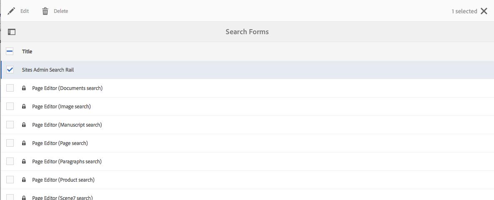

# 設定搜尋表單{#configuring-search-forms}

使用 **搜索Forms** 自定義在作者環境的各種控制台和/或面板中可AEM用的搜索面板中使用的搜索謂語的選擇。 定制這些面板使搜索功能根據您的特定需求而變得多用。

A [謂詞範圍](#predicates-and-their-settings)是現成的。 您可以添加多個謂詞，包括（其中包括）「屬性」謂詞以搜索與您指定的單個屬性匹配的資產，或「選項」謂詞以搜索與您為特定屬性指定的一個或多個值匹配的資產。

你可以 [配置搜索表單](#configuring-your-search-forms) 用於各種控制台和資產瀏覽器（編輯頁面時）。 的 [配置這些表單的對話框](#configuring-your-search-forms) 可通過以下方式訪問：

* **工具**

   * **一般**

      * **搜尋表單**

首次訪問此控制台時，您可以看到所有配置都具有掛鎖符號。 這表示相應的配置是預設（現成）配置 — 無法刪除。 自定義配置後，鎖將消失 — 除非 [刪除自定義配置](#deleting-a-configuration-to-reinstate-the-default)，在此情況下，將恢復預設值（和掛鎖指示器）。

## 設定 {#configurations}

可用的預設配置包括：

* **頁面編輯器 (文件搜尋):**

   此配置定義在資產瀏覽器中搜索文檔時（編輯頁面時）可用的選項。

* **頁面編輯器 (影像搜尋):**

   此配置定義在資產瀏覽器中搜索影像（編輯頁面時）時可用的選項。

* **頁面編輯器 (手稿搜尋):**

   此配置定義在資產瀏覽器中搜索手稿（編輯頁面時）時可用的選項。

* **頁面編輯器 (頁面搜尋):**

   此配置定義在資產瀏覽器中搜索頁面時（編輯頁面時）可用的選項。

* **頁面編輯器 (段落搜尋):**

   此配置定義在資產瀏覽器中搜索段落時（編輯頁面時）可用的選項。

* **頁面編輯器 (產品搜尋):**

   此配置定義在資產瀏覽器中搜索產品時（編輯頁面時）可用的選項。

* **頁面編輯(Dynamic Media Classic [原Scene7] 搜索)**:

   此配置定義在資產瀏覽器（編輯頁面）中搜索Scene7資源時可用的選項。

* **網站管理搜尋邊欄**:

   此配置定義了使用站點控制台的搜索欄時用戶可用的搜索選項。

* **頁面編輯器 (視訊搜尋):**

   此配置定義在資產瀏覽器中搜索視頻時（編輯頁面時）可用的選項。

* **資產管理搜尋邊欄:**

   此配置定義了使用Assets控制台時用戶可用的搜索選項。

* **目錄管理搜尋邊欄:**

   此配置定義了搜索商業目錄時用戶可用的搜索選項。

* **訂單管理搜尋邊欄:**

   此配置定義搜索商業訂單時用戶可用的搜索選項。

* **產品集合管理搜尋邊攔:**

   此配置定義搜索商業產品集合時用戶可用的搜索選項。

* **產品管理搜尋邊欄:**

   此配置定義搜索商業產品時用戶可用的搜索選項。

* **專案管理搜尋邊欄:**

   此配置定義搜索項目時用戶可用的搜索選項。

## 謂語及其設定 {#predicates-and-their-settings}

### 謂語 {#predicates}

以下謂詞可用，取決於配置：

<table>
 <tbody>
  <tr>
   <th>述詞</th>
   <th>用途</th>
   <th>設定</th>
  </tr>
  <tr>
   <td>分析 </td>
   <td>顯示分析支援的資料時，在「站點」瀏覽器中搜索/篩選功能。 分析搜索篩選器載入以匹配映射的自定義分析列。</td>
   <td>
    <ul>
     <li>欄位標籤</li>
     <li>說明</li>
    </ul> </td>
  </tr>
  <tr>
   <td>上次修改的資產 </td>
   <td>上次修改資產的日期。  </td>
   <td>基於日期謂語的自定義謂語。</td>
  </tr>
  <tr>
   <td>元件 </td>
   <td>允許作者搜索/篩選具有特定元件的頁面。 例如，影像庫。  </td>
   <td>
    <ul>
     <li>欄位標籤</li>
     <li>預留位置</li>
     <li>屬性名稱*</li>
     <li>屬性深度</li>
     <li>說明</li>
    </ul> </td>
  </tr>
  <tr>
   <td>日期 </td>
   <td>基於日期屬性的基於滑塊的資產搜索。</td>
   <td>
    <ul>
     <li>欄位標籤</li>
     <li>屬性名稱*</li>
     <li>說明</li>
    </ul> </td>
  </tr>
  <tr>
   <td>日期範圍 </td>
   <td>搜索在日期屬性的指定範圍內建立的資產。 在「搜索」面板中，可以指定「開始」和「結束日期」。</td>
   <td>
    <ul>
     <li>欄位標籤</li>
     <li>預留位置</li>
     <li>屬性名稱*</li>
     <li>範圍文本（自）*</li>
     <li>範圍文本（至）*</li>
     <li>說明</li>
    </ul> </td>
  </tr>
  <tr>
   <td>到期狀態 </td>
   <td>根據到期狀態搜索資產。</td>
   <td>
    <ul>
     <li>欄位標籤</li>
     <li>屬性名稱*</li>
     <li>說明</li>
    </ul> </td>
  </tr>
  <tr>
   <td>檔案大小 </td>
   <td>根據資產大小搜索資產。</td>
   <td>
    <ul>
     <li>欄位標籤</li>
     <li>屬性名稱*</li>
     <li>選項路徑</li>
     <li>說明</li>
    </ul> </td>
  </tr>
  <tr>
   <td>隱藏的篩選器</td>
   <td>屬性和值的篩選器，用戶不可見。</td>
   <td>
    <ul>
     <li>屬性名稱</li>
     <li>屬性值</li>
     <li>說明</li>
    </ul> </td>
  </tr>
  <tr>
   <td>選項 </td>
   <td>
這些選項是用戶建立的內容節點。
 
請參閱 <a href="#addinganoptionspredicate">添加選項謂詞</a> 的子菜單。
 </td>
   <td>
    <ul>
     <li>欄位標籤</li>
     <li>JSON 路徑</li>
     <li>屬性名稱*</li>
     <li>單選</li>
     <li>選項路徑</li>
     <li>說明</li>
    </ul> </td>
  </tr>
  <tr>
   <td>選項屬性 </td>
   <td>搜索選項的屬性。</td>
   <td>
    <ul>
     <li>欄位標籤</li>
     <li>屬性名稱*</li>
     <li>選項節點路徑  </li>
     <li>單選</li>
     <li>說明</li>
    </ul> </td>
  </tr>
  <tr>
   <td>頁面狀態 </td>
   <td>根據頁面的狀態搜索頁面。</td>
   <td>
    <ul>
     <li>欄位標籤</li>
     <li>發佈屬性名稱</li>
     <li>LiveCopy 屬性名稱</li>
     <li>說明</li>
    </ul> </td>
  </tr>
  <tr>
   <td>路徑 </td>
   <td>搜索位於特定路徑下的資產。</td>
   <td>
    <ul>
     <li>欄位標籤</li>
     <li>添加搜索路徑</li>
     <li>說明</li>
    </ul> </td>
  </tr>
  <tr>
   <td>屬性 </td>
   <td>搜索指定的屬性。</td>
   <td>無</td>
  </tr>
  <tr>
   <td>發佈狀態 </td>
   <td>根據資產的發佈狀態搜索資產</td>
   <td>
    <ul>
     <li>欄位標籤</li>
     <li>屬性名稱*</li>
     <li>說明</li>
    </ul> </td>
  </tr>
  <tr>
   <td>範圍 </td>
   <td>搜索位於指定範圍內的資源。 在「搜索」面板中，可以指定範圍的最小值和最大值。</td>
   <td>
    <ul>
     <li>欄位標籤</li>
     <li>屬性名稱</li>
     <li>說明</li>
    </ul> </td>
  </tr>
  <tr>
   <td>範圍選項 </td>
   <td>資產的特定搜索謂詞，與公用滑塊謂詞相同。 由於向後相容問題，仍然可用。</td>
   <td>
    <ul>
     <li>欄位標籤</li>
     <li>屬性名稱*</li>
     <li>選項路徑</li>
     <li>說明</li>
    </ul> </td>
  </tr>
  <tr>
   <td>評等 </td>
   <td>根據資產評級搜索資產。  </td>
   <td>
    <ul>
     <li>欄位標籤</li>
     <li>屬性名稱*</li>
     <li>選項路徑</li>
     <li>說明</li>
    </ul> </td>
  </tr>
  <tr>
   <td>相對日期 </td>
   <td>根據資產建立的相對日期搜索資產  </td>
   <td>
    <ul>
     <li>欄位標籤</li>
     <li>屬性名稱*</li>
     <li>相對日期</li>
     <li>說明</li>
    </ul> </td>
  </tr>
  <tr>
   <td>滑桿範圍 </td>
   <td>使用滑塊功能擴展範圍謂詞的通用搜索謂詞。 搜索的屬性的值必須介於滑塊限制之間。</td>
   <td>
    <ul>
     <li>欄位標籤</li>
     <li>屬性名稱*</li>
     <li>說明</li>
    </ul> </td>
  </tr>
  <tr>
   <td>標記 </td>
   <td>基於標籤搜索資產。 可以配置Path屬性以填充「標籤」清單中的各種標籤。</td>
   <td>
    <ul>
     <li>欄位標籤</li>
     <li>屬性名稱*</li>
     <li>選項路徑</li>
     <li>說明</li>
    </ul> </td>
  </tr>
  <tr>
   <td>標記 </td>
   <td>基於標籤進行搜索。</td>
   <td>
    <ul>
     <li>預留位置</li>
     <li>屬性名稱*</li>
     <li>說明</li>
    </ul> </td>
  </tr>
 </tbody>
</table>

>[!NOTE]
>
>* 常用搜索謂語在中定義：
   >  `/libs/cq/gui/components/common/admin/customsearch/searchpredicates`
>
>* 僅與siteadmin（經典UI）相關的搜索謂語位於以下位置：
   >  `/libs/cq/gui/components/siteadmin/admin/searchpanel/searchpredicates`
   >   * 這些建議已棄用，且僅可用於向後相容。
>
>此資訊僅供參考，您不得更改 `/libs`。

### 謂詞設定 {#predicate-settings}

根據謂語，可以選擇用於配置的設定：

* **欄位標籤**

   將顯示為可折疊標題或謂詞欄位標籤的標籤。

* **說明**

   用戶的描述性詳細資訊。

* **預留位置**

   空文本或謂語的佔位符（如果未輸入過濾文本）。

* **屬性名稱**

   要搜索的屬性。 它使用相對路徑和通配符 `*/*/*` 指定屬性相對於 `jcr:content` 節點（每個星號表示一個節點級別）。

   如果您只想在具有 `x` 屬性 `jcr:content` 節點使用 `*/jcr:content/x`

* **屬性深度**

   在資源中搜索該屬性的最大深度。 因此，可以對資源和遞歸子項執行對該屬性的搜索，直到子項的級別等於指定的深度。

* **屬性值**

   屬性值作為絕對字串或表達式語言；比如說， `cq:Page` 或

   `${empty requestPathInfo.suffix ? "/content" : requestPathInfo.suffix}`。

* **範圍文本**

   中範圍欄位的標籤 **日期範圍** 謂語。

* **選項路徑**

   用戶可以使用謂詞設定頁籤中的「路徑瀏覽器」選擇路徑。 選擇 **+** 表徵圖用於將所選內容添加到有效選項清單( **-** 表徵圖（如果需要）。

   這些選項是用戶建立的內容節點，具有以下結構：

   `(jcr:primaryType = nt:unstructured, value (String), jcr:title (String))`

* **選項節點路徑**
與 
**選項路徑**，僅此欄位位於公共謂語欄位中，另一個欄位特定於資產。

* **單選**
如果選中，則這些選項將呈現為僅允許單個選擇的複選框。 如果錯誤選中，則可取消選中複選框。

* **發佈和即時複製屬性名稱**
「站點」特定謂詞的發佈和即時複製複選框的標籤。

* &amp;ast;的 **設定** 頁籤表示欄位為必填欄位，如果留空，則會顯示錯誤消息

## 配置搜索Forms {#configuring-your-search-forms}

### 建立/開啟自定義配置 {#creating-opening-a-customized-configuration}

1. 導航到 **工具**。 **常規**。 **搜索Forms**。

1. 選擇要自定義的配置。
1. 使用 **編輯** 表徵圖以開啟要更新的配置。
1. 如果您想要新定制 [添加新謂詞欄位並定義設定](#add-edit-a-predicate-field-and-define-field-settings) 按需要。 如果是現有自定義項，則可以選擇現有欄位 [更新設定](#add-edit-a-predicate-field-and-define-field-settings)。
1. 選擇 **完成** 的子菜單。

   >[!NOTE]
   >
   >定制配置儲存（如適用）在以下位置：
   >
   >* `/apps/cq/gui/content/facets/<option>`
   >* `/apps/commerce/gui/content/facets/<option>`

### 添加/編輯謂詞欄位和定義欄位設定 {#add-edit-a-predicate-field-and-define-field-settings}

您可以添加或編輯欄位，並定義/更新其設定：

1. [開啟自定義配置](#creating-opening-a-customized-configuration) 的子菜單。
1. 如果要添加新欄位，請開啟 **選擇謂詞** 頁籤，並將所需謂詞拖到所需位置。 例如， **日期範圍謂詞**:

   

1. 取決於：

   * 您正在添加新欄位：

      添加謂詞後， **設定** 頁籤，並顯示可定義的屬性。

   * 要更新現有謂詞：

      選擇謂詞欄位（在右側），然後開啟 **設定** 頁籤。
   例如， **日期範圍謂詞**:

   

1. 根據需要進行更改並確認 **完成**。

### 預覽搜索配置 {#previewing-the-search-configuration}

1. 選擇「預覽」表徵圖：

   

1. 這將顯示搜索表單，如相應控制台的「搜索」列中將顯示（完全展開）的搜索表單。

   

1. **關閉** 返回並完成配置的預覽。

### 刪除謂詞欄位 {#deleting-a-predicate-field}

1. [開啟自定義配置](#creating-opening-a-customized-configuration) 的子菜單。
1. 選擇謂詞欄位（在右側），開啟 **設定** ，然後選擇 **刪除** 表徵圖（左下）。

   

1. 對話框將請求確認刪除操作。

1. 確認此更改和任何其他更改 **完成**。

### 刪除配置（恢復預設值） {#deleting-a-configuration-to-reinstate-the-default}

自定義配置後，這將覆蓋預設值。 您可以通過刪除自定義配置來重新聲明預設配置。

>[!NOTE]
>
>不能刪除任何一個預設配置。

從控制台刪除自定義配置：

1. 選擇所需的配置(例如， **頁面編輯器（段落搜索）**)，然後 **刪除** 表徵圖：

   

1. 將刪除自定義配置並恢復預設配置（這由掛鎖符號在控制台中的再現指示）。

### 添加選項謂詞 {#adding-options-predicates}

選項謂語（選項、選項屬性）允許您配置要搜索的項。 通常用來在頁面的正下面搜索，例如，頁節點上的屬性。

下面的示例（根據用於建立頁面的模板進行搜索）說明了涉及的步驟：

1. 建立定義要搜索的屬性的節點。

   您需要一個根節點，該根節點保存各個選項的定義，以便用戶可用。

   各個選項的節點需要以下屬性：

   * `jcr:title`  — 要在搜索欄中顯示的欄位標籤
   * `value`  — 要搜索的屬性值

   

   >[!NOTE]
   >
   >你 ***必須*** 沒有改變 `/libs` 路徑。
   >
   >這是因為 `/libs` 在下次升級實例時被覆蓋（在應用修補程式或功能包時很可能被覆蓋）。
   >
   >建議的配置和其他更改方法是：
   >
   >1. 重新建立所需項，因為它存在於 `/libs`下 `/apps`。 在本例中，來自：
   >1. `/libs/cq/gui/content/common/options/predicates`
   >1. 在 `/apps.`

1. 開啟 **搜索Forms** 並選擇要更新的配置。 比如說， **站點管理搜索欄**。

   然後按一下/點擊 **編輯搜索表單** 表徵圖

1. 根據配置，添加 **選項** 或 **選項屬性** 到配置。
1. 更新欄位，特別是：

   * **屬性名稱**

      在目標節點上指定要搜索的節點屬性。 例如：

      `jcr:content/cq:template`

   * **選項節點路徑**

      選擇保留選項的路徑。 例如：

      `/apps/cq/gui/content/common/options/predicates/templatetype`
   

1. 選擇 **完成** 保存配置。
1. 導航到相應的控制台(在本示例中， **站點**)並開啟 **搜索** 鐵軌。 新定義的搜索表單以及各種選項將可見。 選擇所需選項以查看搜索結果：

   

## 使用者權限 {#user-permissions}

下表列出了對搜索表單執行編輯、刪除和預覽操作所需的權限。

<table>
 <tbody>
  <tr>
   <td><strong>動作</strong></td>
   <td><strong>權限</strong></td>
  </tr>
  <tr>
   <td>編輯 </td>
   <td>讀取、寫入 <code>/apps </code>的下界。</td>
  </tr>
  <tr>
   <td>刪除</td>
   <td>讀取、寫入、刪除 <code>/apps</code> 節點</td>
  </tr>
  <tr>
   <td>預覽</td>
   <td>讀取、寫入、刪除 <code>/var/dam/content</code> 的下界。  讀取、寫入 <code>/apps</code> 的下界。</td>
  </tr>
 </tbody>
</table>
