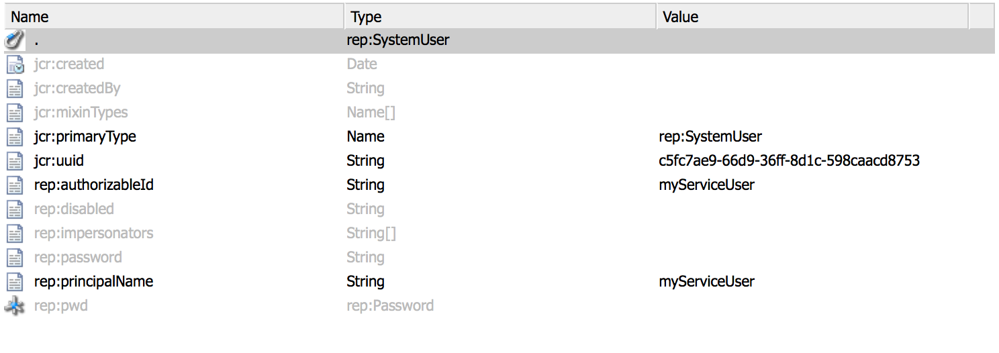

# AEM{#service-users-in-aem}中的服務使用者

## 概覽 {#overview}

在AEM中取得管理工作階段或資源解析程式的主要方式是使用Sling提供的`SlingRepository.loginAdministrative()`和`ResourceResolverFactory.getAdministrativeResourceResolver()`方法。

但是，這兩種方法都不是按照[最小權限原則](https://en.wikipedia.org/wiki/Principle_of_least_privilege)設計的，而且使得開發人員在早期不為其內容規劃適當的結構和相應的訪問控制級別(ACL)太容易了。 如果此類服務中存在漏洞，則通常會導致向`admin`用戶升級權限，即使代碼本身不需要管理權限才能工作。

## 如何淘汰管理員工作階段{#how-to-phase-out-admin-sessions}

### 優先順序0:該功能是活動的/需要的/廢棄的嗎？{#priority-is-the-feature-active-needed-derelict}

有時不會使用管理工作階段，或完全停用功能。 如果您的實作就是如此，請務必完全移除功能，或使用[NOP程式碼](https://en.wikipedia.org/wiki/NOP)加以配合。

### 優先順序1:使用請求會話{#priority-use-the-request-session}

盡可能重構您的功能，以便使用指定的已驗證請求工作階段來讀取或寫入內容。 如果這不可行，則通常可以通過以下優先事項來實現。

### 優先順序2:重構內容{#priority-restructure-content}

許多問題都可透過重新調整內容來解決。 進行重組時，請牢記以下簡單規則：

* **更改訪問控制**

   * 確保真正需要存取的使用者或群組實際擁有存取權；

* **調整內容結構**

   * 將其移至其他位置，例如存取控制與可用的請求工作階段相符之處；
   * 變更內容粒度；

* **將程式碼重構為適當的服務**

   * 將業務邏輯從JSP代碼移至服務。 這可允許不同的內容模型。

此外，請確定您開發的任何新功能都遵循下列原則：

* **安全要求應推動內容結構**

   * 管理存取控制應該是理所當然的
   * 存取控制必須由存放庫強制執行，而非由應用程式執行

* **使用nodetype**

   * 限制可設定的屬性集

* **遵守隱私權設定**

   * 若是私人設定檔，其中一個範例是不會公開在私人`/profile`節點上找到的設定檔圖片、電子郵件或完整名稱。

## 嚴格訪問控制{#strict-access-control}

無論您是在重組內容時應用訪問控制，還是為新服務用戶應用訪問控制時，都必須應用最嚴格的ACL。 使用所有可能的訪問控制設施：

* 例如，不應在`/apps`上套用`jcr:read`，而只將其套用至`/apps/*/components/*/analytics`

* 使用[restrictions](https://jackrabbit.apache.org/oak/docs/security/authorization/restriction.html)

* 為節點類型應用ACL
* 限制權限

   * 例如，當僅需要寫入屬性時，不要授予`jcr:write`權限；請改用`jcr:modifyProperties`

## 服務用戶和映射{#service-users-and-mappings}

如果上述方法失敗，Sling 7會提供服務使用者對應服務，可設定套件對使用者對應和兩種對應的API方法：` [SlingRepository.loginService()](https://sling.apache.org/apidocs/sling7/org/apache/sling/jcr/api/SlingRepository.html#loginService-java.lang.String-java.lang.String-)`和` [ResourceResolverFactory.getServiceResourceResolver()](https://sling.apache.org/apidocs/sling7/org/apache/sling/api/resource/ResourceResolverFactory.html#getServiceResourceResolver-java.util.Map-)`，它們只返回具有已配置用戶權限的會話/資源解析器。 這些方法具有以下特點：

* 它們允許將服務對應到用戶
* 他們讓子服務用戶定義
* 中央配置點是：`org.apache.sling.serviceusermapping.impl.ServiceUserMapperImpl`
* `service-id` =  `service-name` [ &quot;:&quot;subservice-name  ]


* `service-id` 對應至資源解析器和/或JCR存放庫使用者ID以進行驗證
* `service-name` 是提供服務的捆綁包的符號名稱

## 其他Recommendations {#other-recommendations}

### 使用service-user {#replacing-the-admin-session-with-a-service-user}替換admin-session

服務用戶是JCR用戶，沒有設定密碼和執行特定任務所需的最少權限集。 未設定密碼表示無法與服務使用者登入。

淘汰管理工作階段的方法，是將其取代為服務使用者工作階段。 如有需要，也可以由多個子服務使用者取代。

若要以服務使用者取代管理工作階段，您應執行下列步驟：

1. 識別服務的必要權限，並牢記最少權限的原則。
1. 檢查是否已有完全符合您所需權限設定的使用者可用。 如果沒有任何現有用戶符合您的需求，則建立新的系統服務用戶。 需要RTC來建立新的服務用戶。 有時，建立多個子服務用戶（例如，一個用於寫入，一個用於讀取）來劃分更多訪問是有意義的。
1. 設定並測試用戶的ACE。
1. 為服務和`user/sub-users`新增`service-user`對應

1. 讓服務使用者Sling功能可用於您的套件：更新至`org.apache.sling.api`的最新版本。

1. 將程式碼中的`admin-session`取代為`loginService`或`getServiceResourceResolver` API。

## 建立新服務用戶{#creating-a-new-service-user}

在您驗證AEM服務用戶清單中的任何用戶都不適用於您的使用案例且相應的RTC問題已獲得批准後，您可以繼續將新用戶添加到預設內容中。

建議的方法是建立服務用戶以使用位於&#x200B;*https://&lt;server>的儲存庫瀏覽器：&lt;port>/crx/explorer/index.jsp*

目標是要取得有效的`jcr:uuid`屬性，此屬性是必要屬性，才能透過安裝內容套件來建立使用者。

您可以通過以下方式建立服務用戶：

1. 前往&#x200B;*https://&lt;server>:&lt;port>/crx/explorer/index.jsp*&#x200B;的存放庫總管
1. 按螢幕左上角的&#x200B;**登入**&#x200B;連結以管理員身分登入。
1. 接下來，建立系統用戶並為其命名。 若要將使用者建立為系統使用者，請將中繼路徑設為`system`，並視您的需求新增選用的子資料夾：

   

1. 驗證您的系統用戶節點如下所示：

   

   >[!NOTE]
   >
   >請注意，沒有與服務使用者相關聯的混合類型。 這表示系統使用者將沒有存取控制原則。

將對應的.content.xml新增至套件內容時，請確定您已設定`rep:authorizableId`，且主要類型為`rep:SystemUser`。 應該如下所示：

```xml
<?xml version="1.0" encoding="UTF-8"?>
<jcr:root xmlns:jcr="https://www.jcp.org/jcr/1.0" xmlns:rep="internal"
    jcr:primaryType="rep:SystemUser"
    jcr:uuid="4917dd68-a0c1-3021-b5b7-435d0044b0dd"
    rep:principalName="authentication-service"
    rep:authorizableId="authentication-service"/>
```

## 將配置修正添加到ServiceUserMapper配置{#adding-a-configuration-amendment-to-the-serviceusermapper-configuration}

要將從服務到相應系統用戶的映射添加到相應的系統用戶，需要為` [ServiceUserMapper](https://sling.apache.org/apidocs/sling7/org/apache/sling/serviceusermapping/ServiceUserMapper.html)`服務建立工廠配置。 若要保留此模組，可使用[Sling修正機制](https://issues.apache.org/jira/browse/SLING-3578)提供此類設定。 若要搭配您的套件安裝這類設定，建議您使用[Sling Initial Content Loading](https://sling.apache.org/documentation/bundles/content-loading-jcr-contentloader.html):

1. 在套件的src/main/resources資料夾下方建立子資料夾SLING-INF/content
1. 在此資料夾中，建立名為org.apache.sling.serviceusermapping.impl.ServiceUserMapperImpl.refinded-&lt;工廠配置的某個唯一名稱>.xml的檔案，其中包含工廠配置的內容（包括所有子服務用戶映射）。 範例:

1. 在套件`src/main/resources`資料夾下方建立`SLING-INF/content`資料夾；
1. 在此資料夾中，建立檔案`named org.apache.sling.serviceusermapping.impl.ServiceUserMapperImpl.amended-<a unique name for your factory configuration>.xml`，其中包含工廠配置的內容，包括所有子服務用戶映射。

   為了便於說明，請取用名為`org.apache.sling.serviceusermapping.impl.ServiceUserMapperImpl.amended-com.adobe.granite.auth.saml.xml`的檔案：

   ```xml
   <?xml version="1.0" encoding="UTF-8"?>
   <node>
       <primaryNodeType>sling:OsgiConfig</primaryNodeType>
       <property>
           <name>user.default</name>
           <value></value>
       </property>
       <property>
           <name>user.mapping</name>
           <values>
               <value>com.adobe.granite.auth.saml=authentication-service</value>
           </values>
       </property>
   </node>
   ```

1. 在套件`pom.xml`的`maven-bundle-plugin`設定中參考Sling初始內容。 範例:

   ```xml
   <Sling-Initial-Content>
      SLING-INF/content;path:=/libs/system/config;overwrite:=true;
   </Sling-Initial-Content>
   ```

1. 安裝您的套件，並確認已安裝工廠設定。 您可以透過下列方式執行此作業：

   * 前往&#x200B;*https://serverhost:serveraddress/system/console/configMgr*&#x200B;的Web主控台
   * 搜尋&#x200B;**Apache Sling Service使用者對應程式服務修訂**
   * 按一下連結，查看是否有正確的設定。

## 處理服務中的共用會話{#dealing-with-shared-sessions-in-services}

對`loginAdministrative()`的呼叫通常會與共用的工作階段一起顯示。 這些會話在服務激活時獲得，並且僅在服務停止後註銷。 雖然這是常見的做法，但它導致了兩個問題：

* **安全性：** 此類管理工作階段可用來快取及傳回資源，或系結至共用工作階段的其他物件。在調用堆棧的稍後部分，這些對象可以適應具有提升權限的會話或資源解析器，而且調用方往往不清楚這是他們正在使用的管理會話。
* **效能：** 在Oak共用工作階段中可能會造成效能問題，目前不建議使用。

對於安全風險，最顯而易見的解決方案是簡單地將`loginAdministrative()`呼叫替換為具有受限權限的用戶的`loginService()`呼叫。 但是，這不會對任何潛在的效能降低產生任何影響。 緩解此問題的可能性是，將所有請求的資訊包裝在與會話沒有關聯的對象中。 然後，按需建立（或銷毀）會話。

建議的方法是重構服務的API，讓呼叫者控制工作階段的建立/毀滅。

## JSP {#administrative-sessions-in-jsps}中的管理會話

JSP無法使用`loginService()`，因為沒有關聯的服務。 但是，JSP中的管理會話通常是違反MVC范式的標誌。

這可透過兩種方式加以修正：

1. 以允許與用戶會話一起操作的方式重組內容；
1. 將邏輯提取到提供API的服務，該API隨後可供JSP使用。

第一種方法是慣用的。

## 處理事件、複製前置處理器和作業{#processing-events-replication-preprocessors-and-jobs}

處理事件或工作時（某些情況下為工作流程），觸發事件的對應工作階段通常會遺失。 這會導致事件處理程式和作業處理程式經常使用管理工作階段來執行其工作。 解決這個問題有不同的可想之法，每一種方法都有其優點和缺點：

1. 在事件裝載中傳遞`user-id`並使用模擬。

   **優點：** 易於使用。

   **缺點：** 仍使用 `loginAdministrative()`。它會重新驗證已驗證的請求。

1. 建立或重複使用可存取資料的服務使用者。

   **優點：** 與目前設計一致。需要最少的更改。

   **缺點：** 需要非常強大的服務用戶才能靈活，這很容易導致權限升級。繞過安全模型。

1. 在事件有效負載中傳遞`Subject`序列化，並根據該主題建立`ResourceResolver`。 例如，在`ResourceResolverFactory`中使用JAAS `doAsPrivileged`。

   **優點：** 從安全性的角度清除實作。它避免了重新認證，並且以原始權限運行。 安全相關程式碼對事件的使用者是透明的。

   **缺點：** 需要重構。安全性相關程式碼對事件的消費者而言是透明的，這可能也會導致問題。

第三種方法是目前首選的處理技術。

## 工作流進程{#workflow-processes}

在工作流程程式實施中，觸發工作流程的對應使用者工作階段通常會遺失。 這會導致工作流程程式經常使用管理工作階段來執行其工作。

為了修正這些問題，建議使用[處理事件、復寫前置處理器和作業](/help/sites-administering/security-service-users.md#processing-events-replication-preprocessors-and-jobs)中提及的相同方法。

## SlingPOST處理器和已刪除頁面{#sling-post-processors-and-deleted-pages}

SlingPOST處理器實作中會使用數個管理工作階段。 通常，管理工作階段用於存取處理POST內待刪除的節點。 因此，請求工作階段將無法再使用。 可以訪問待刪除的節點，以披露其他不可訪問的元資料。
