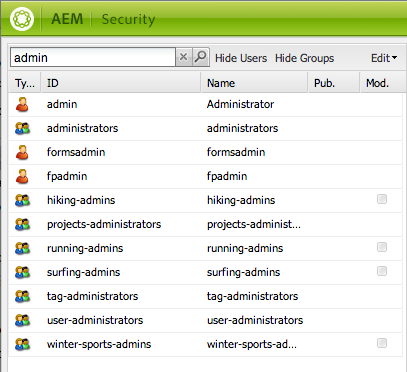
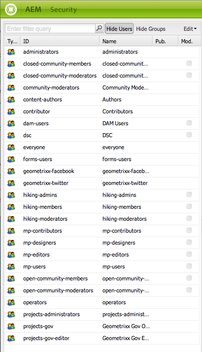

# 使用者管理與安全性{#user-administration-and-security}

本章說明如何設定和維護使用者授權，並說明驗證和授權在AEM中運作的原理。

## AEM中的使用者和群組 {#users-and-groups-in-aem}

本節將更詳細地介紹各種實體和相關概念，以幫助您配置易於維護的用戶管理概念。

### 使用者 {#users}

使用者將使用其帳戶登入AEM。 每個使用者帳戶都是唯一的，並包含基本帳戶詳細資訊以及指派的權限。

使用者通常是群組的成員，可簡化這些權限和／或權限的分配。

### 群組 {#groups}

群組是使用者和／或其他群組的集合；這些都稱為群組成員。

其主要目的是透過減少要更新的實體數目來簡化維護程式，因為對群組所做的變更會套用至群組的所有成員。 群組通常反映：

* 應用程式中的角色；例如，允許瀏覽內容的人，或允許提供內容的人。
* 您自己的組織；當內容樹狀結構中的貢獻者被限制在不同分支時，您可能想要擴充角色，以區分不同部門的貢獻者。

因此，群組往往保持穩定，而使用者來來回的頻率則更高。

透過規劃和簡潔的結構，群組的使用可以反映您的結構，提供清楚的概述和有效的更新機制。

### Built-in Users and Groups {#built-in-users-and-groups}

AEM WCM會安裝許多使用者和群組。 在安裝後首次存取Security Console時，就會看到這些。

下表列出每個項目，並列出：

* 簡短描述
* 任何關於必要變更的建議

*請變更所有預設密碼* （如果您未在特定情況下刪除帳戶本身）。

<table>
 <tbody>
  <tr>
   <td>使用者 ID</td>
   <td>類型</td>
   <td>說明</td>
   <td>建議</td>
  </tr>
  <tr>
   <td>
管理員
 
預設密碼：管理員
 </td>
   <td>使用者</td>
   <td>
具有完全訪問權限的系統管理帳戶。
 
此帳戶用於AEM WCM和CRX之間的連線。
 
如果意外刪除了此帳戶，系統將在資料庫重新啟動時（在預設設定中）重新建立該帳戶。
 
管理員帳戶是AEM平台的需求。 因此，此帳戶無法刪除。
 </td>
   <td>
Adobe強烈建議將此使用者帳戶的密碼從預設值變更。
 
優選地，在安裝時，儘管可以在安裝後完成。
 
注意：此帳戶不要與CQ Servlet引擎的管理員帳戶混淆。
 </td>
  </tr>
  <tr>
   <td>
匿名
 
 
 </td>
   <td>使用者</td>
   <td>
保留對實例的未驗證訪問的預設權限。 根據預設，這會保留最低存取權限。
 
如果您意外刪除此帳戶，系統會在啟動時重新建立此帳戶。 它無法永久刪除，但可以禁用。
 </td>
   <td>請避免刪除或停用此帳戶，因為這會對作者例項的運作造成負面影響。 如果有安全性要求您必須刪除它，請務必先正確測試它對系統的影響。</td>
  </tr>
  <tr>
   <td>
作者
 
預設密碼：作者
 </td>
   <td>使用者</td>
   <td>
允許寫入/content的作者帳戶。 涵蓋投稿人和衝浪者特權。
 
可以作為網站管理員使用，因為它可以訪問整個/content樹。
 
這不是內建使用者，而是其他geometrixx展示使用者
 </td>
   <td>
Adobe建議完全刪除帳戶，或從預設值變更密碼。
 
優選地，在安裝時，儘管可以在安裝後完成。
 </td>
  </tr>
  <tr>
   <td>管理員</td>
   <td>群組</td>
   <td>
授予其所有成員管理員權限的組。 只允許管理員編輯此群組。
 
擁有完整存取權。
 </td>
   <td>如果您在節點上設定「拒絕每個人」，則管理員只有在該群組再次啟用時才能擁有存取權。</td>
  </tr>
  <tr>
   <td>內容作者</td>
   <td>群組</td>
   <td>
負責內容編輯的群組。 需要讀取、修改、建立和刪除權限。
 </td>
   <td>只要您新增讀取、修改、建立和刪除權限，就可以使用專案特定存取權限建立您自己的內容作者群組。</td>
  </tr>
  <tr>
   <td>contributor</td>
   <td>群組</td>
   <td>
可讓使用者編寫內容的基本權限（僅限功能）。
 
不為/content樹分配任何權限——這些權限必須專門分配給各個組或用戶。
 </td>
   <td> </td>
  </tr>
  <tr>
   <td>dam-users</td>
   <td>群組</td>
   <td>一般AEM Assets使用者的現成可用參考群組。 此群組成員具有適當的權限，可啟用資產和系列的上傳／共用。</td>
   <td> </td>
  </tr>
  <tr>
   <td>every</td>
   <td>群組</td>
   <td>
AEM中的每個使用者都是群組的成員，即使您在所有工具中可能看不到群組或成員關係。
 
此群組可視為預設權限，因為它可用來套用每個人的權限，甚至是將來建立的使用者。
 </td>
   <td>
請勿修改或刪除此群組。
 
修改此帳戶會產生額外的安全性影響。
 </td>
  </tr>
  <tr>
   <td>tag-administrators</td>
   <td>群組</td>
   <td>允許編輯標籤的群組。</td>
   <td> </td>
  </tr>
  <tr>
   <td>user-administrators</td>
   <td>群組</td>
   <td>授權使用者管理，即建立使用者和群組的權利。</td>
   <td> </td>
  </tr>
  <tr>
   <td>工作流程編輯器</td>
   <td>群組</td>
   <td>允許建立和修改工作流模型的組。</td>
   <td> </td>
  </tr>
  <tr>
   <td>workflow-users</td>
   <td>群組</td>
   <td>
參與工作流程的使用者必須是群組工作流程使用者的成員。 這可讓他或她完全存取：/etc/workflow/instances，讓他／她可以更新工作流程例項。
 
此群組已包含在標準安裝中，但您必須手動將使用者新增至群組。
 </td>
  </tr>
 </tbody>
</table>

## AEM中的權限 {#permissions-in-aem}

AEM使用ACL來判斷使用者或群組可以執行哪些動作，以及可在何處執行這些動作。

### 權限和ACL {#permissions-and-acls}

權限定義允許誰對資源執行哪些操作。 權限是存取控制評 [估的結果](#access-control-lists-and-how-they-are-evaluated) 。

您可以選取或清除個別AEM動作的核取方塊，以變更授與／拒絕給定使用者的 [權限](security.md#actions)。 複選標籤表示允許執行動作。 無複選標籤表示動作被拒絕。

複選標籤位於格線中的位置也會指出使用者在AEM內的哪些位置（即哪些路徑）擁有哪些權限。

### 動作 {#actions}

可以在頁（資源）上執行操作。 對於階層中的每個頁面，您可以指定允許使用者對該頁面執行的動作。 [權限](#permissions-and-acls) ，可讓您允許或拒絕動作。

<table>
 <tbody>
  <tr>
   <td><strong>動作 </strong></td>
   <td><strong>說明 </strong></td>
  </tr>
  <tr>
   <td>讀取</td>
   <td>使用者可讀取頁面和任何子頁面。</td>
  </tr>
  <tr>
   <td>修改</td>
   <td>
使用者可以：

    <ul>
     <li>修改頁面上和任何子頁面上的現有內容。</li>
     <li>在頁面上或任何子頁面上建立新段落。</li>
    </ul> 
在JCR級別，用戶可以通過修改資源的屬性、鎖定、版本修訂和nt-modifications來修改資源，並且他們對定義jcr:content子節點的節點具有完全的寫權限，例如cq:Page、nt:file、cq:Asset。
 </td>
  </tr>
  <tr>
   <td>建立</td>
   <td>
使用者可以：

    <ul>
     <li>建立新頁面或子頁面。</li>
    </ul> 
如果 <strong>修改</strong> ，則會明確排除jcr:content下方的子樹，因為建立jcr:content及其子節點會被視為頁面修改。 這僅適用於定義jcr:content子節點的節點。
 </td>
  </tr>
  <tr>
   <td>刪除</td>
   <td>
使用者可以：

    <ul>
     <li>從頁面或任何子頁面刪除現有段落。</li>
     <li>刪除頁面或子頁面。</li>
    </ul> 
如果 <strong>修改被拒絕</strong> ，則會明確排除jcr:content下的任何子樹作為刪除jcr:content，其子節點將被視為頁面修改。 這僅適用於定義jcr:content子節點的節點。
 </td>
  </tr>
  <tr>
   <td>讀取 ACL</td>
   <td>用戶可以讀取頁面或子頁面的訪問控制清單。</td>
  </tr>
  <tr>
   <td>編輯 ACL</td>
   <td>用戶可以修改頁面或任何子頁面的訪問控制清單。</td>
  </tr>
  <tr>
   <td>複寫</td>
   <td>使用者可將內容複製至其他環境（例如發佈環境）。 此權限也適用於任何子頁面。</td>
  </tr>
 </tbody>
</table>

>[!NOTE]
>
>AEM會自動為Collections中的角色指派（擁有者、編輯者、檢視器）產生使用 [者群組](/help/assets/managing-collections-touch-ui.md)。 不過，手動新增此類群組的ACL可能會在AEM中造成安全性弱點。 Adobe建議您避免手動添加ACL。

### 訪問控制清單及其評估方式 {#access-control-lists-and-how-they-are-evaluated}

AEM WCM使用「存取控制清單」(ACL)來組織套用至各種頁面的權限。

「存取控制清單」是由個別權限所組成，用來決定實際套用這些權限的順序。 該清單根據所考慮的頁面的層次形成。 然後，會自底向上掃描此清單，直到找到套用至頁面的第一個適當權限為止。

>[!NOTE]
>
>示例中包含一些ACL。 建議您檢閱並判斷哪些應用程式適合您的應用程式。 要查看包含的ACL，請轉至**CRXDE **，並為以下節點選擇 **Access Control** （訪問控制）頁籤：
>
>`/etc/cloudservices/facebookconnect/geometrixx-outdoorsfacebookapp`:允許每個人讀取。
>`/etc/cloudservices/twitterconnect/geometrixx-outdoors-twitter-app`:允許每個人讀取。
>`/home/users/geometrixx-outdoors`:允許每個人讀取 `*/profile*` 和
>`*/social/relationships/following/*`.
>
>您的自訂應用程式可能會設定其他關係的存取權， `*/social/relationships/friend/*` 例如 `*/social/relationships/pending-following/*`或。
>
>當您建立特定於社區的ACL時，加入這些社區的成員可能會獲得額外的權限。 例如，當使用者在或加入社群時，可能會發生這 `/content/geometrixx-outdoors/en/community/hiking` 種情況 `/content/geometrixx-outdoors/en/community/winter-sports`。

### 權限狀態 {#permission-states}

>[!NOTE]
>
>針對CQ 5.3使用者：
>
>與舊版CQ相比，如 **果使用者只需修改頁面** ，就不應再授 **** 予建立和刪除權限。 請改為，僅在 **** 您希望使用者能夠在現有頁面上建立、修改或刪除元件時，才授與修改動作。
>
>由於向後相容性的原因，動作測試沒有考慮定義 **jcr:content** 的節點的特殊處理。

| **動作** | **說明** |
|---|---|
| 允許（複選標籤） | AEM WCM可讓使用者在此頁面或任何子頁面上執行動作。 |
| 拒絕（無複選標籤） | AEM WCM不允許使用者在此頁面或任何子頁面上執行動作。 |

權限也會套用至任何子頁面。

如果權限未繼承自父節點，但至少有一個本地條目，則會將下列符號附加到該複選框。 本地條目是在CRX 2.2介面中建立的條目（通配符ACL當前只能在CRX中建立）。

對於指定路徑上的操作：

<table>
 <tbody>
  <tr>
   <td>*（星號）</td>
   <td>至少有一個本地條目（有效或無效）。 這些通配符ACL在CRX中定義。</td>
  </tr>
  <tr>
   <td>! （驚嘆號）</td>
   <td>至少有一個條目目前沒有作用。</td>
  </tr>
 </tbody>
</table>

將滑鼠指標暫留在星號或驚嘆號上時，工具提示會提供有關已宣告項目的詳細資訊。 工具提示會分割為兩個部分：

<table>
 <tbody>
  <tr>
   <td>上部</td>
   <td>
列出有效條目。
 </td>
  </tr>
  <tr>
   <td>下部</td>
   <td>列出在樹中其他位置可能具有效果的非有效條目（由具有相應ACE的特殊屬性表示，該屬性限制條目的範圍）。 或者，這是一個條目，其效果已被在給定路徑或祖先節點上定義的另一個條目撤銷。</td>
  </tr>
 </tbody>
</table>

>[!NOTE]
>
>如果未定義頁面的權限，則會拒絕所有動作。

以下是有關管理訪問控制清單的建議：

* 請勿直接將權限指派給使用者。 僅將它們指派給群組。

   這將簡化維護作業，因為群組數目比使用者人數少得多，而且波動性也較小。

* 如果您希望群組／使用者只能修改頁面，請勿授與他們建立或拒絕權限。 僅授予他們修改和讀取權限。
* 謹慎使用「拒絕」。 請盡量僅使用「允許」。

   如果權限的套用順序與預期順序不同，則使用deny可能會造成非預期的效果。 如果用戶是多個組的成員，來自一個組的拒絕語句可以取消來自另一個組的允許語句，反之亦然。 發生此情況時，很難保留概述，並且很容易導致無法預見的結果，而「允許」分配不會造成此類衝突。

   Adobe建議您使用「允許」而非「拒絕」，查看「最 [佳實務」](#best-practices)。

在修改任一權限之前，請務必瞭解其運作方式及相互關聯。 請參閱CRX檔案，以說明AEM WCM如 [何評估存取權](/help/sites-administering/user-group-ac-admin.md#how-access-rights-are-evaluated) ，以及設定存取控制清單的範例。

### 權限 {#permissions}

權限可讓使用者和群組存取AEM頁面上的AEM功能。

通過展開／折疊節點，可以按路徑瀏覽權限，並且可以跟蹤到根節點的權限繼承。

您可以選擇或清除適當的核取方塊，以允許或拒絕權限。

### 查看詳細權限資訊 {#viewing-detailed-permission-information}

除了格線檢視外，AEM還提供特定路徑上所選使用者／群組權限的詳細檢視。 詳細資訊視圖提供了其他資訊。

除了檢視資訊外，您也可以將目前的使用者或群組納入或排除在群組之外。 請參 [閱新增權限時新增使用者或群組](#adding-users-or-groups-while-adding-permissions)。 此處所做的變更會立即反映在詳細檢視的上半部。

要訪問「詳細資訊」視圖，請在「權 **限** 」頁籤中，按一下 **任何選定組** /用戶和路徑的「詳細資訊」。

詳細資訊分為兩部分：

<table>
 <tbody>
  <tr>
   <td>上部</td>
   <td>
重複樹網格中顯示的資訊。 對於每個動作，都會顯示動作是否允許或拒絕：

    <ul>
     <li>no icon = no declared entry</li>
     <li>（勾選）=宣告的動作（允許）</li>
     <li>(-)=聲明的操作（拒絕）</li>
    </ul> </td>
  </tr>
  <tr>
   <td>下部</td>
   <td>
顯示執行下列作業的使用者和群組格線：

    <ul>
     <li>聲明給定路徑的條目AND</li>
     <li>指定的可授權OR是群組嗎</li>
    </ul> </td>
  </tr>
 </tbody>
</table>

### 模擬其他使用者 {#impersonating-another-user}

使用 [Impersonate功能](/help/sites-authoring/user-properties.md#user-settings) ，使用者可以代表其他使用者工作。

這表示使用者帳戶可以指定其他帳戶，以便與其帳戶一起運作。 換言之，如果允許user-B模擬使用者-A，則user-B可使用user-A的完整帳戶詳細資訊採取動作。

這可讓模擬帳戶完成工作，就像使用其模擬的帳戶；例如，在缺勤期間或在短期內共用過多負荷。

>[!NOTE]
>
>為了模擬為非管理員使用者所使用，模擬者（在上述情況下為user-B）必須在路徑中擁有READ權 `/home/users` 限。
>
>如需如何達成此目的的詳細資訊，請參閱「 [AEM中的權限」](/help/sites-administering/security.md#permissions-in-aem)。

>[!CAUTION]
>
>如果某個帳戶冒充另一個帳戶，就很難看到。 當冒充開始和結束時，在審計日誌中建立一個條目，但其他日誌檔案（如訪問日誌）不保存有關事件上發生冒充的事實的資訊。 因此，如果user-B模擬使用者- a所有事件看起來都像是使用者- a個人執行的。

>[!CAUTION]
>
>在模擬使用者時可以執行鎖定頁面。 不過，以此方式鎖定的頁面，只能以模擬使用者或具有管理員權限的使用者身分解除鎖定。
>
>無法模擬鎖定頁面的使用者來解除鎖定頁面。

### Best Practices {#best-practices}

以下說明使用權限和權限時的最佳實務：

| 規則 | 原因 |
|--- |--- |
| *使用群組* | 避免依使用者指派存取權限。 原因有幾：<ul><li>您的使用者比群組多，因此群組可簡化結構。</li><li>群組可協助提供所有帳戶的概觀。</li> <li>對於群組，繼承更簡單。</li><li>使用者來來去。 群體是長期的。</li></ul> |
| *積極* | 請務必使用「允許」陳述式來指定群組的權利（盡可能）。 避免使用Deny語句。 群組依順序評估，而順序的定義可能與使用者不同。 換句話說：您可能對語句的實施和評估順序幾乎沒有控制權。 如果您只使用「允許」陳述式，則訂單無關緊要。 |
| *保持簡單* | 在配置新安裝時投入一些時間和思考，將獲得很好的回報。 套用清楚的結構可簡化持續的維護與管理，確保您目前的同事和／或未來的繼任者都能輕鬆瞭解正在實施的內容。 |
| *測試* | 使用測試安裝來練習並確保您瞭解不同使用者和群組之間的關係。 |
| *預設使用者／群組* | 安裝後請立即更新預設使用者和群組，協助避免任何安全性問題。 |

## Managing Users and Groups {#managing-users-and-groups}

用戶包括使用系統的用戶和向系統發出請求的外國系統。

群組是一組使用者。

這兩者都可使用安全控制台中的用戶管理功能進行配置。

### 使用Security Console存取使用者管理 {#accessing-user-administration-with-the-security-console}

您可使用安全性主控台存取所有使用者、群組和相關權限。 本節中介紹的所有過程都在此窗口中執行。

若要存取AEM WCM安全性，請執行下列其中一項作業：

* 從「歡迎」畫面或AEM中的各種位置，按一下安全性圖示：

* 直接導覽至 `https://<server>:<port>/useradmin`。 請確定您以管理員身分登入AEM。

將顯示以下窗口：

左樹列出系統中當前的所有用戶和組。 您可以選取要顯示的欄、排序欄的內容，甚至將欄標題拖曳至新位置，以變更欄的顯示順序。

這些頁籤可訪問各種配置：

<!-- ??? in table below. -->

| 索引標籤 | 說明 |
|--- |--- |
| 篩選方塊 | 用於篩選列出的用戶和／或組的機制。 請參 [閱篩選使用者和群組](#filtering-users-and-groups)。 |
| 隱藏使用者 | 切換開關，將隱藏列出的所有使用者，僅保留群組。 請參 [閱隱藏使用者和群組](#hiding-users-and-groups)。 |
| 隱藏群組 | 切換開關，可隱藏所有列出的群組，僅保留使用者。 請參 [閱隱藏使用者和群組](#hiding-users-and-groups)。 |
| 編輯 | 可讓您建立和刪除以及啟用和停用使用者或群組的功能表。 請參 [閱建立使用者和群組](#creating-users-and-groups)[及刪除使用者和群組](#deleting-users-and-groups)。 |
| 屬性 | 列出有關可包含電子郵件資訊、說明和名稱資訊之使用者或群組的資訊。 也允許您更改用戶的密碼。 請參 [閱「建立用戶和組](#creating-users-and-groups)、 [修改用戶和組屬性](#modifying-user-and-group-properties)[和更改用戶密碼」](#changing-a-user-password)。 |
| 群組 | 列出選定用戶或組所屬的所有組。 您可以將選取的使用者或群組指派給其他群組，或從群組中移除。 請參閱 [群組](#adding-users-or-groups-to-a-group)。 |
| 成員 | 僅適用於群組。 列出特定群組的成員。 請參 [閱成員](#members-adding-users-or-groups-to-a-group)。 |
| 權限 | 您可以為使用者或群組分配權限。 可讓您控制下列項目：<ul><li>與特定頁面／節點相關的權限。 請參 [閱設定權限](#setting-permissions)。 </li><li>與建立和刪除頁面及階層修改相關的權限。???可讓您 [分配權限](#settingprivileges)，例如階層修改，讓您建立和刪除頁面，</li><li>與複製權 [限相關的權限](#setting-replication-privileges) （通常從作者到發佈），根據路徑。</li></ul> |
| Impersonator | 讓其他使用者模擬帳戶。 當您需要使用者代表其他使用者時，就很有用。 請參閱 [模擬使用者](#impersonating-another-user)。 |
| 偏好設定 | 設定 [組或用戶的首選項](#setting-user-and-group-preferences)。 例如，語言偏好設定。 |

### Filtering Users and Groups {#filtering-users-and-groups}

您可以輸入篩選運算式來篩選清單，此運算式會隱藏所有不符合運算式的使用者和群組。 您也可以使用「隱藏使用者」和「隱藏群組」按 [鈕來隱藏使用者和群組](#hiding-users-and-groups) 。

若要篩選使用者或群組：

1. 在左樹清單中，在提供的空格中輸入篩選運算式。 例如，輸入admin **** 會顯示包含此字串的所有使用者和群組。
1. 按一下放大鏡以篩選清單。

   

1. 若要移除 **所有篩選** ，請按一下x。

### Hiding Users and Groups {#hiding-users-and-groups}

隱藏使用者或群組是篩選系統中所有使用者和群組清單的另一種方式。 有兩種切換機制。 按一下「隱藏使用者」可隱藏所有使用者，然後按一下「隱藏群組」可隱藏所有群組（您無法同時隱藏使用者和群組）。 若要使用篩選運算式來篩選清單，請參 [閱篩選使用者和群組](#filtering-users-and-groups)。

要隱藏用戶和組：

1. 在「安全 **性** 」主控台中，按一 **下「隱藏使用者** 」或「 **隱藏群組」**。 選取的按鈕會反白顯示。

   

1. 若要重新顯示使用者或群組，請再次按一下對應的按鈕。

### Creating Users and Groups {#creating-users-and-groups}

要建立新用戶或組：

1. 在「安 **全性** 」控制台樹清單中，按一下「編輯 **」，然後按一下「建立用戶** 」或「創 ********&#x200B;建組」。

   

1. 根據您要建立使用者或群組，輸入所需的詳細資訊。

   * 如果選擇「 **建立用戶** 」，則輸入登錄ID、名字和姓氏、電子郵件地址和密碼。 依預設，AEM會根據姓氏的第一個字母建立路徑，但您可以選取其他路徑。
   

   * 如果您選取「 **建立群組**」，則可輸入群組ID和選用說明。
   

1. 按一下&#x200B;**「建立」**。您建立的用戶或組將顯示在樹清單中。

### Deleting Users and Groups {#deleting-users-and-groups}

要刪除用戶或組：

1. 在 **Security** Console中，選取您要刪除的使用者或群組。 如果要刪除多個項目，請按住Shift鍵並按一下或按住Control鍵並按一下以選擇這些項目。
1. 按一 **下「編輯** 」，然後選擇「刪除」。 AEM WCM會詢問您要刪除使用者或群組。
1. 按一 **下「確定** 」以確認，或按一下「取消」以取消您的動作。

### 修改用戶和組屬性 {#modifying-user-and-group-properties}

要修改用戶和組屬性：

1. 在安 **全控制** 台中，按兩下您要修改的使用者或群組名稱。

1. 按一下「 **屬性** 」標籤，進行必要的變更，然後按一下「 **儲存」**。

   

>[!NOTE]
>
>用戶的路徑顯示在用戶屬性的底部。 無法修改。

### 更改用戶密碼 {#changing-a-user-password}

請按下列步驟修改用戶的口令。

>[!NOTE]
>
>您無法使用安全控制台來變更管理員密碼。 若要變更管理員帳戶的密碼，請使用Granite Operations提供 [的「使用者](/help/sites-administering/granite-user-group-admin.md#changing-the-password-for-an-existing-user) 」主控台。

1. 在安 **全控制** 台中，按兩下要更改密碼的用戶名。
1. 按一下「 **屬性** 」標籤（如果尚未啟用）。

1. 按一 **下設定密碼**。 「Set Password（設定密碼）」視窗隨即開啟，您可在其中變更密碼。

   

1. 輸入新密碼兩次；由於它們未顯示在明文中，因此這是供確認的——如果它們不匹配，系統將顯示錯誤。
1. 按一 **下「設定** 」以啟用帳戶的新密碼。

### 新增使用者或群組至群組 {#adding-users-or-groups-to-a-group}

AEM提供三種將使用者或群組新增至現有群組的不同方式：

* 在群組中時，您可以新增成員（使用者或群組）。
* 在成員中時，可以向組添加成員。
* 當您使用「權限」時，可以將成員添加到組。

### 群組——新增使用者或群組至群組 {#groups-adding-users-or-groups-to-a-group}

「群 **組** 」標籤會顯示目前帳戶所屬的群組。 您可以使用它將所選帳戶新增至群組：

1. 連按兩下您要指派給群組的帳戶（使用者或群組）名稱。
1. 按一下「 **群組** 」標籤。 您會看到帳戶已屬於的群組清單。
1. 在樹狀清單中，按一下您要新增至帳戶的群組名稱，並拖曳至「群組」 **窗格** 。 （如果要添加多個用戶，請按住Shift鍵並按一下或按住Control鍵並按一下這些名稱並拖動它們。）

   

1. 按一 **下「儲存** 」以儲存變更。

### 成員——將用戶或組添加到組 {#members-adding-users-or-groups-to-a-group}

「成 **員** 」標籤僅適用於群組，並顯示哪些使用者和群組屬於目前群組。 您可以用它來新增帳戶至群組：

1. 按兩下要添加成員的組的名稱。
1. 按一下「成 **員** 」頁籤。 您會看到已屬於此群組的成員清單。
1. 在樹清單中，按一下要添加到組的成員的名稱，並將其拖動到「成 **員** 」窗格。 （如果要添加多個用戶，請按住Shift鍵並按一下或按住Control鍵並按一下這些名稱並拖動它們。）

   

1. 按一 **下「儲存** 」以儲存變更。

### 新增權限時新增使用者或群組 {#adding-users-or-groups-while-adding-permissions}

要在特定路徑中向組添加成員，請執行以下操作：

1. 連按兩下您要新增使用者之群組或使用者的名稱。

1. 按一下「權 **限** 」標籤。

1. 導覽至您要新增權限的路徑，然後按一下「詳細 **資訊」**。 詳細資訊視窗的下半部分提供有關誰擁有該頁面權限的資訊。

   

1. 在「成員」列中 **** ，為要具有該路徑權限的成員選擇該複選框。 清除要移除權限的成員的複選框。 在您所做變更的儲存格中，會出現紅色三角形。
1. 按一 **下「確定** 」以儲存變更。

### 從群組中移除使用者或群組 {#removing-users-or-groups-from-groups}

AEM提供三種從群組移除使用者或群組的不同方式：

* 在群組設定檔中時，您可以移除成員（使用者或群組）。
* 在成員配置檔案中時，可以從組中刪除成員。
* 當您使用「權限」時，可以從群組中移除成員。

### 組——從組中刪除用戶或組 {#groups-removing-users-or-groups-from-groups}

要從組中刪除用戶或組帳戶：

1. 連按兩下您要從群組移除的群組或使用者帳戶名稱。
1. 按一下「 **群組** 」標籤。 您可以看到所選帳戶所屬的群組。
1. 在「群 **組** 」窗格中，按一下您要從群組移除的使用者或群組名稱，然後按一下「 **移除」**。 (如果要刪除多個帳戶，請按住Shift鍵並按一下或按住Control鍵並按一下這些名稱，然後按一下「 **刪除**」。)

   

1. 按一 **下「儲存** 」以儲存變更。

### 成員——從組中刪除用戶或組 {#members-removing-users-or-groups-from-groups}

要從組中刪除帳戶，請執行以下操作：

1. 按兩下要從中刪除成員的組的名稱。
1. 按一下「成 **員** 」頁籤。 您會看到已屬於此群組的成員清單。
1. 在「成 **員** 」窗格中，按一下要從組中刪除的成員的名稱，然後按一下「 **刪除」**。 (如果要刪除多個用戶，請按住Shift鍵並按一下或按住Control鍵並按一下這些名稱，然後按一下「 **刪除**」。)

   

1. 按一 **下「儲存** 」以儲存變更。

### 新增權限時移除使用者或群組 {#removing-users-or-groups-while-adding-permissions}

要在特定路徑上從組中刪除成員：

1. 連按兩下您要移除使用者之群組或使用者的名稱。

1. 按一下「權 **限** 」標籤。

1. 導覽至您要移除權限的路徑，然後按一下「詳細資 **訊」**。 詳細資訊視窗的下半部分提供有關誰擁有該頁面權限的資訊。

   

1. 在「成員」列中 **** ，為要具有該路徑權限的成員選擇該複選框。 清除要移除權限的成員的複選框。 在您所做變更的儲存格中，會出現紅色三角形。
1. 按一 **下「確定** 」以儲存變更。

### 用戶同步 {#user-synchronization}

當部署為發佈群 [時](/help/sites-deploying/recommended-deploys.md#tarmk-farm)，所有發佈節點之間需要同步使用者和群組。

若要瞭解使用者同步及如何啟用它，請參 [閱使用者同步](/help/sites-administering/sync.md)。

## 管理權限 {#managing-permissions}

>[!NOTE]
>
>Adobe已推出新的以Touch UI為基礎的權限管理主要檢視。 如需如何使用它的詳細資訊，請參 [閱本頁](/help/sites-administering/touch-ui-principal-view.md)。

本節介紹如何設定權限，包括複製權限。

### 設定權限 {#setting-permissions}

權限可讓使用者在特定路徑上對資源執行特定動作。 它也包含建立或刪除頁面的功能。

要添加、修改或刪除權限：

1. 在 **Security** Console中，按兩下您要設定節點權限或搜尋節點之使用者或群 [組的名稱](#searching-for-nodes)。

1. 按一下「權 **限** 」標籤。

   

1. 在樹形網格中，選擇一個複選框以允許選定用戶或組執行操作，或清除一個複選框以拒絕選定用戶或組執行操作。 如需詳細資訊，請按一 **下詳細資訊**。

1. 完成後，按一下「 **儲存**」。

### 設定複製權限 {#setting-replication-privileges}

複製權限是發佈內容的權限，可為組和用戶設定。

>[!NOTE]
>
>* 應用到組的任何複製權限都應用於該組中的所有用戶。
>* 用戶的複製權限將取代組的複製權限。
>* 「允許複製」權限的優先順序高於「拒絕」複製權限。 如需詳 [細資訊，請參閱](#permissions-in-aem) 「AEM中的權限」。
>

要設定複製權限，請執行以下操作：

1. 從清單中選取使用者或群組，按兩下以開啟，然後按一下「權 **限**」。
1. 在網格中，導航到希望用戶具有複製權限或搜索節 [點的路徑。](#searching-for-nodes)

1. 在所選路 **徑的「複製** 」列中，選擇一個複選框以添加該用戶或組的複製權限，或清除該複選框以刪除複製權限。 AEM會在您所做變更尚未儲存的任何地方顯示紅色三角形。

   

1. 按一 **下「儲存** 」以儲存變更。

### 搜索節點 {#searching-for-nodes}

新增或移除權限時，您可以瀏覽或搜尋節點。

路徑搜尋有兩種不同類型：

* 路徑搜索——如果搜索字串以&quot;/&quot;開頭，則搜索將搜索給定路徑的直接子節點：

在搜尋方塊中，您可以執行下列動作：

| 動作 | 它的功能 |
|--- |--- |
| 向右鍵 | 在搜索結果中選擇子節點 |
| 向下鍵 | 再次啟動搜索。 |
| 輸入（返回）鍵 | 選擇子節點並將其載入到樹狀網格中 |

* 全文搜索——如果搜索字串不以&quot;/&quot;開頭，則對路徑&quot;/content&quot;下的所有節點執行全文搜索。

要對路徑或全文執行搜索，請執行以下操作：

1. 在安全控制台中，選擇用戶或組，然後按一下「權 **限** 」頁籤。

1. 在「搜尋」方塊中，輸入要搜尋的詞語。

### 模擬使用者 {#impersonating-users}

您可以指定一或多個允許模擬目前使用者的使用者。 這表示他們可以將帳戶設定切換為目前使用者的帳戶設定，並代表此使用者行事。

使用此函式時請小心謹慎，因為它可能允許使用者執行其使用者無法執行的動作。 在模擬使用者時，會通知使用者他們並未以自己的身分登入。

您可能想要使用此功能時，會出現多種情況，包括：

* 如果您不在辦公室，您可以讓其他人在您不在的時候冒充您。 使用此功能，您可以確保某人擁有您的存取權限，而您不需要修改使用者設定檔或提供密碼。
* 您可將其用於除錯用途。 例如，若要查看網站如何尋找具有限制存取權限的使用者。 此外，如果使用者抱怨技術問題，您可以模擬該使用者來診斷和修正問題。

要模擬現有用戶，請執行以下操作：

1. 在樹清單中，選擇要為其他用戶指派模擬的人員的名稱。 按兩下以開啟。
1. 按一下「 **模擬** 」標籤。
1. 按一下您要能夠模擬所選使用者的使用者。 將使用者（將模擬的使用者）從清單拖曳至「模擬」窗格。 名稱會出現在清單中。

   

1. 按一下&#x200B;**「儲存」**。

### 設定使用者和群組偏好設定 {#setting-user-and-group-preferences}

要設定用戶和組首選項，包括語言、窗口管理和工具欄首選項：

1. 在左側樹中選擇要更改其首選項的用戶或組。 要選擇多個用戶或組，請按住Ctrl鍵並按一下或按住Shift鍵並按一下您的選項。
1. 按一下「首 **選項** 」頁籤。

   

1. 視需要對群組或使用者偏好設定進行變更，然後在完成時按 **一下** 「儲存」。

### 將用戶或管理員設定為具有管理其他用戶的權限 {#setting-users-or-administrators-to-have-the-privilege-to-manage-other-users}

若要設定使用者或管理員擁有刪除／啟用／停用其他使用者的權限：

1. 將您要授予管理其他使用者權限的使用者新增至管理員群組，並儲存您所做的變更。

   

1. 在用戶的「權 **限** 」頁籤中，導航到「/」，在「複製」列中，選擇複選框以允許在「/」處複製，然後按一下「 **保存」**。

   

   選取的使用者現在可以停用、啟用、刪除和建立使用者。

### 擴充專案層級的權限 {#extending-privileges-on-a-project-level}

如果您打算實作應用程式特定權限，下列資訊將說明您實作自訂權限時需要瞭解的資訊，以及如何在整個CQ中實施自訂權限：

階層修改權限由jcr-privileges的組合所涵蓋。 複製權限名為 **crx:replicate** ，該權限與jcr儲存庫上的其他權限一起儲存／評估。 但是，它並未在jcr層級上執行。

自訂權限的定義和註冊是自2.4版起 [Jackrabbit API](https://jackrabbit.apache.org/api/2.8/org/apache/jackrabbit/api/security/authorization/PrivilegeManager.html) (另請參閱 [JCR-2887](https://issues.apache.org/jira/browse/JCR-2887))的正式一部份。 JCR存取控制管理(如 [JSR 283](https://jcp.org/en/jsr/detail?id=283) （第16節）所定義)將涵蓋進一步的使用。 此外，Jackrabbit API還定義了數個擴充功能。

權限註冊機制反映在「儲存庫配置」下的 **UI中**。

新（自定義）權限的註冊本身受到必須在儲存庫級別(在JCR中：將&#39;null&#39;傳入ac mgt api中作為&#39;absPath&#39;參數，如需詳細資訊，請參閱jsr 333)。 依預設，管 **理員** 和管理員的所有成員都具有該權限。

>[!NOTE]
>
>雖然實作會負責驗證和評估自訂權限，但除非它們是內建權限的匯總，否則無法強制執行這些權限。
