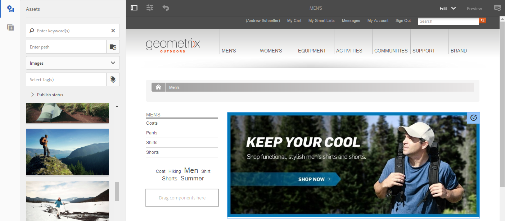

# 使用ContextHub設定區段{#configuring-segmentation-with-contexthub}

>[!NOTE]
>
>本節說明在使用ContextHub時設定區段。 如果您使用「用戶端內容」功能，請參閱相關檔案，以 [設定「用戶端內容」區段](/help/sites-administering/campaign-segmentation.md)。


區段是建立促銷活動時的主要考量。 如需細 [分運作方式和關鍵詞](/help/sites-authoring/managing-audiences.md) ，請參閱管理觀眾。

根據您已收集的網站訪客相關資訊以及您要達到的目標，您需要定義目標內容所需的區段和策略。

然後，這些區段會用來為訪客提供特定的目標內容。 此內容會保留在網 [站的](/help/sites-authoring/personalization.md) 「個人化」區段中。 [此處定義的](/help/sites-authoring/activitylib.md) 「活動」可包含在任何頁面上，並定義專業內容適用的訪客區段。

AEM可讓您輕鬆個人化使用者的體驗。 此外，還可讓您驗證區段定義的結果。

## 存取區段 {#accessing-segments}

Audiences [主控台](/help/sites-authoring/managing-audiences.md) ，用來管理ContextHub或Client Context的區段，以及Adobe target帳戶的觀眾。 本檔案涵蓋管理ContextHub的區段。 如需 [「用戶端內容](/help/sites-administering/campaign-segmentation.md) 」區段和Adobe Target區段，請參閱相關檔案。

若要存取您的區段，請在全域導覽中選取「導 **覽>個人化>觀眾」**。


## 區段編輯器 {#segment-editor}

「區 **段編輯器** 」可讓您輕鬆修改區段。 若要編輯區段，請在區段清單中選 [取區段](/help/sites-administering/segmentation.md#accessing-segments) ，然後按一 **下「編輯** 」按鈕。


使用元件瀏覽器，您可以新增 **AND** 和 **OR** 容器來定義區段邏輯，然後新增其他元件來比較屬性和值，或參考指令碼和其他區段來定義選擇標準(請參閱建立新區段 [](#creating-a-new-segment))，以定義確切的選擇區段藍本。

當整個陳述式評估為true時，區段即已解決。 若有多個區段適用，則也會使 **用Boost** factor。 如需 [提升系數的詳細資訊](#creating-a-new-segment) ，請參閱建立 [新區段。](/help/sites-administering/campaign-segmentation.md#boost-factor)

>[!CAUTION]
>
>段編輯器不檢查任何循環參照。 例如，區段A會參照另一個區段B，反過來參照區段A。您必須確定您的區段不包含任何循環反向連結。

### 容器 {#containers}

下列容器是現成可用的，可讓您將比較和參考分組，以便進行布林值評估。 它們可從元件瀏覽器拖曳至編輯器。 如需詳細資訊，請 [參閱以下使用AND和OR容器](/help/sites-administering/segmentation.md#using-and-and-or-containers) 一節。

<table>
 <tbody>
  <tr>
   <td>容器 AND<br /> </td>
   <td>布林AND運算子<br /> </td>
  </tr>
  <tr>
   <td>容器 OR<br /> </td>
   <td>布林OR運算子</td>
  </tr>
 </tbody>
</table>

### 比較 {#comparisons}

下列區段比較是現成可用的，可用來評估區段屬性。 它們可從元件瀏覽器拖曳至編輯器。

<table>
 <tbody>
  <tr>
   <td>屬性值<br /> </td>
   <td>將商店的屬性與定義的值比較<br /> </td>
  </tr>
  <tr>
   <td>屬性——屬性</td>
   <td>將商店的某個屬性與另一個屬性進行比較<br /> </td>
  </tr>
  <tr>
   <td>屬性區段參考</td>
   <td>將商店的屬性與其他參考的區段比較<br /> </td>
  </tr>
  <tr>
   <td>屬性——指令碼參考</td>
   <td>將商店的屬性與指令碼的結果比較<br /> </td>
  </tr>
  <tr>
   <td>區段參考指令碼參考</td>
   <td>將參考的區段與指令碼的結果比較<br /> </td>
  </tr>
 </tbody>
</table>

>[!NOTE]
>
>比較值時，如果未設定比較的資料類型（亦即設為自動偵測）,ContextHub的區段引擎將只會像javascript一樣比較值。 它不會將值轉換至其預期類型，而可能導致誤導結果。 例如：
>
>`null < 30 // will return true`
>
>因此， [建立區段時](/help/sites-administering/segmentation.md#creating-a-new-segment)，只要已知比較值 **的類型** ，您就應選取資料類型。 例如：
>
>比較屬性 `profile/age`時，您已知道比較的類型是 **number**，因此即使未設定， `profile/age` 小於30的比較也會傳回 `profile/age` false ****，如您預期。

### 引用 {#references}

以下參考是現成可用的，可直接連結至指令碼或其他區段。 它們可從元件瀏覽器拖曳至編輯器。

<table>
 <tbody>
  <tr>
   <td>區段引用<br /> </td>
   <td>評估參考的區段</td>
  </tr>
  <tr>
   <td>指令碼引用</td>
   <td>評估參考的指令碼。 如需詳細資訊，請 <a href="/help/sites-administering/segmentation.md#using-script-references">參閱以下使用指令碼</a> 參考章節。</td>
  </tr>
 </tbody>
</table>

## 建立新區段 {#creating-a-new-segment}

要定義新段，請執行以下操作：

1. 存 [取區段後](/help/sites-administering/segmentation.md#accessing-segments)，按一下或點選「建立」按鈕，然後選 **取「建立ContextHub區段」**。

   

1. 在「新 **建ContextHub區段**」中，視需要輸入區段的標題和提升值，然後點選或按一下「建 **立」**。

   

   每個區段都有提升參數，用作加權系數。 數字越高，表示在多個區段有效的例項中，會優先選擇數字較低的區段。

   * Minimum value: `0`
   * Maximum value: `1000000`

1. 將比較或參考拖曳至區段編輯器，它將會出現在預設的AND容器中。
1. 連按兩下或點選新參考或區段的設定選項，以編輯特定參數。 在這個範例中，我們測試的是聖荷西的人。

   

   請盡量設 **定「資料類型** 」，以確保正確評估您的比較。 如需詳 [細資訊](/help/sites-administering/segmentation.md#comparisons) ，請參閱比較。

1. 按一 **下「確定** 」以儲存定義：
1. 視需要新增更多元件。 您可以使用AND和OR比較的容器元件來建立布林運算式(請參 [閱下方的使用AND和Or](/help/sites-administering/segmentation.md#using-and-and-or-containers) Containers)。 使用區段編輯器，您可以刪除不再需要的元件，或將它們拖曳至陳述式中的新位置。

### 使用AND和OR容器 {#using-and-and-or-containers}

使用AND和OR容器元件，您可以在AEM中建構複雜的區段。 在執行此動作時，請注意以下幾個基本要點：

* 定義的頂層永遠是最初建立的AND容器。 這無法變更，但對您的其餘區段定義沒有影響。
* 確保容器巢狀結構合理。 容器可以視為布林運算式的括弧。

以下範例用於選取在我們的主要年齡群組中被視為訪客的訪客：

男，30至59歲

或

女性，30歲到59歲

首先，將OR容器元件放置在預設的AND容器中。 在OR容器中，您新增兩個AND容器，而在這兩個容器中，您可新增屬性或參考元件。


### 使用指令碼引用 {#using-script-references}

使用指令碼參考元件，可將區段屬性的評估委派給外部指令碼。 在正確設定指令碼後，它就可當成區段條件的任何其他元件。

#### 定義要引用的指令碼 {#defining-a-script-to-reference}

1. 將檔案新增至 `contexthub.segment-engine.scripts` clientlib。
1. 實作傳回值的函式。 例如：

   ```
   ContextHub.console.log(ContextHub.Shared.timestamp(), '[loading] contexthub.segment-engine.scripts - script.profile-info.js');
   
   (function() {
       'use strict';
   
       /**
        * Sample script returning profile information. Returns user info if data is available, false otherwise.
        *
        * @returns {Boolean}
        */
       var getProfileInfo = function() {
           /* let the SegmentEngine know when script should be re-run */
           this.dependOn(ContextHub.SegmentEngine.Property('profile/age'));
           this.dependOn(ContextHub.SegmentEngine.Property('profile/givenName'));
   
           /* variables */
           var name = ContextHub.get('profile/givenName');
           var age = ContextHub.get('profile/age');
   
           return name === 'Joe' && age === 123;
       };
   
       /* register function */
       ContextHub.SegmentEngine.ScriptManager.register('getProfileInfo', getProfileInfo);
   
   })();
   ```

1. 向註冊指令碼 `ContextHub.SegmentEngine.ScriptManager.register`。

如果指令檔依賴其他屬性，則指令檔應呼叫 `this.dependOn()`。 例如，如果指令檔依賴 `profile/age`:

```
this.dependOn(ContextHub.SegmentEngine.Property('profile/age'));
```

#### 引用指令碼 {#referencing-a-script}

1. 建立ContextHub區段。
1. 將 **Script Reference** （指令碼參考）元件新增至區段的所需位置。
1. 開啟「指令碼參考」元件 **的編輯對話** 方塊。 如果 [已正確設定](/help/sites-administering/segmentation.md#defining-a-script-to-reference)，則指令碼應可在「指令碼名稱 **** 」下拉式清單中使用。

## 測試區段的應用程式 {#testing-the-application-of-a-segment}

定義區段後，就可在 **[ContextHub的協助下測試潛在](/help/sites-authoring/ch-previewing.md)結果。**

1. 預覽頁面
1. 按一下ContextHub圖示以顯示ContextHub工具列
1. 選擇符合您建立之群體的角色
1. ContextHub將解析所選角色的適用區段

例如，我們用來識別我們主要年齡組使用者的簡單區段定義，是根據使用者的年齡和性別而定的簡單區段定義。 載入符合這些條件的特定角色時，會顯示區段已成功解決：


或者，如果未解決：


>[!NOTE]
>
>所有特徵都會立即解決，不過大部分只會在頁面重新載入時變更。

此類測試也可以在內容頁面上，並結合目標內容與相關活動 **與****體驗**。

如果您已使用上述主要年齡組區段範例設定活動和體驗，則可輕鬆使用活動測試區段。 如需設定活動的詳細資訊，請參閱製作目標 [內容的相關檔案](/help/sites-authoring/content-targeting-touch.md)。

1. 在您已設定目標內容之頁面的編輯模式中，您可以看到內容是透過內容上的箭頭圖示來定位。

   

1. 切換至預覽模式並使用內容中樞，切換至不符合體驗所設定之區段的個人。

   

1. 切換至符合為體驗設定之區段的人物角色，並查看體驗會隨之變更。

   

## 使用您的區段 {#using-your-segment}

區段可用來調整特定目標對象所檢視的實際內容。 如需 [觀眾和群體的詳細資訊](/help/sites-authoring/managing-audiences.md) ，請參閱管理觀眾，以及製作 [目標內容](/help/sites-authoring/content-targeting-touch.md) ，以瞭解如何使用觀眾和群體來定位內容。
