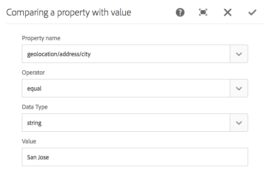

# 使用 ContextHub 設定分段{#configuring-segmentation-with-contexthub}

>[!NOTE]
>
>本節說明如何在使用ContextHub時設定分段。 如果您使用「使用者端內容」功能，請參閱的相關檔案 [為Client Context設定分段](/help/sites-administering/campaign-segmentation.md).
>

細分是建立行銷活動時的關鍵考量。 另請參閱 [管理對象](/help/sites-authoring/managing-audiences.md) 區段運作方式和主要術語的相關資訊。

根據您已收集到的網站訪客相關資訊以及您想要達成的目標，您必須定義目標內容所需的區段和策略。

接著，這些區段可用來向訪客提供明確鎖定的目標內容。 此內容維護於 [個人化](/help/sites-authoring/personalization.md) 網站區段。 [活動](/help/sites-authoring/activitylib.md) 此處定義可包含在任何頁面上，並定義專用內容適用於的訪客區段。

AEM可讓您輕鬆個人化使用者體驗。 它也可讓您驗證區段定義的結果。

## 存取區段 {#accessing-segments}

此 [受眾](/help/sites-authoring/managing-audiences.md) 主控台可用來管理ContextHub或Client Context的區段，以及Adobe Target帳戶的受眾。 本檔案說明如何管理ContextHub的區段。 的 [Client Context區段](/help/sites-administering/campaign-segmentation.md) 和Adobe Target區段，請參閱相關檔案。

若要存取區段，您必須選取設定。 在全域導覽中選取 **導覽>個人化>對象**. 您將會看到可用的設定：


選取您的設定以檢視區段，例如WKND Site：


## 區段編輯器 {#segment-editor}

此 **區段編輯器** 可讓您輕鬆修改區段。 若要編輯區段，請在 [區段清單](/help/sites-administering/segmentation.md#accessing-segments) 並按一下 **編輯** 按鈕。


使用元件瀏覽器即可新增 **和** 和 **或** 容器來定義區段邏輯，然後新增其他元件以比較屬性和值，或參考指令碼和其他區段以定義選取條件(請參閱 [建立新區段](#creating-a-new-segment))，以定義選取區段的確切案例。

當整個陳述式評估為true時，表示區段已解析。 如果有多個適用區段，則 **提升** 也會使用因數。 另請參閱 [建立新區段](#creating-a-new-segment) 以取得以下詳細資訊： [提升因數。](/help/sites-administering/campaign-segmentation.md#boost-factor)

>[!CAUTION]
>
>區段編輯器不會檢查任何循環參照。 例如，區段A參考另一個區段B，而後者又參考區段A。請確認您的區段不含任何循環參考。

### 容器 {#containers}

下列容器是現成可用的容器，可讓您將比較和參照群組在一起，以進行布林值評估。 它們可從元件瀏覽器拖曳至編輯器。 請參閱下節 [使用AND和OR容器](/help/sites-administering/segmentation.md#using-and-and-or-containers) 以取得詳細資訊。

<table>
 <tbody>
  <tr>
   <td>容器AND<br /> </td>
   <td>布林值AND運運算元<br /> </td>
  </tr>
  <tr>
   <td>容器OR<br /> </td>
   <td>布林值OR運運算元</td>
  </tr>
 </tbody>
</table>

### 比較 {#comparisons}

下列區段比較是現成可用的功能，可供評估區段屬性。 它們可從元件瀏覽器拖曳至編輯器。

<table>
 <tbody>
  <tr>
   <td>屬性 — 值<br /> </td>
   <td>將存放區的屬性與定義的值比較<br /> </td>
  </tr>
  <tr>
   <td>Property-Property</td>
   <td>比較存放區的一個屬性與另一個屬性<br /> </td>
  </tr>
  <tr>
   <td>Property-Segment參考</td>
   <td>將存放區的屬性與另一個參照的區段比較<br /> </td>
  </tr>
  <tr>
   <td>Property-Script參考</td>
   <td>比較存放區的屬性與指令碼的結果<br /> </td>
  </tr>
  <tr>
   <td>區段Reference指令碼引用</td>
   <td>將參照的區段與指令碼的結果進行比較<br /> </td>
  </tr>
 </tbody>
</table>

>[!NOTE]
>
>在比較值時，如果未設定比較的資料型別（亦即設為自動偵測），ContextHub的區段引擎會像javascript一樣簡單地比較值。 它不會將值轉換為預期型別，這可能導致誤導性的結果。 例如：
>
>`null < 30 // will return true`
>
>因此，當 [建立區段](/help/sites-administering/segmentation.md#creating-a-new-segment)，您應該選取 **資料型別** 當比較值的型別為已知時。 例如：
>
>比較屬性時 `profile/age`，您已知道比較的型別會是 **數字**，因此即使 `profile/age` 未設定，比較 `profile/age` 小於30將傳回 **false**，如您預期的那樣。

### 參考 {#references}

下列是現成可用的參考，可直接連結至指令碼或其他區段。 它們可從元件瀏覽器拖曳至編輯器。

<table>
 <tbody>
  <tr>
   <td>區段引用<br /> </td>
   <td>評估引用的區段</td>
  </tr>
  <tr>
   <td>指令碼引用</td>
   <td>評估參照的指令碼。 請參閱下節 <a href="/help/sites-administering/segmentation.md#using-script-references">使用指令碼參照</a> 以取得詳細資訊。</td>
  </tr>
 </tbody>
</table>

## 建立新區段 {#creating-a-new-segment}

若要定義新區段，請執行下列動作：

1. 晚於 [存取區段](/help/sites-administering/segmentation.md#accessing-segments)， [導覽至資料夾](#organizing-segments) 您想要建立區段的位置。

1. 按一下建立按鈕並選取 **建立ContextHub區段**.

   

1. 在 **新ContextHub區段**，輸入區段的標題及提升值（如有需要），然後按一下 **建立**.

   

   每個區段都有boost引數，可當作加權係數使用。 數字越高表示在有效使用多個區段的情況下，會優先選取數字較小的區段。

   * 最小值： `0`
   * 最大值： `1000000`

1. 將比較或參考拖曳至區段編輯器，該比較或參考會出現在預設的AND容器中。
1. 連按兩下新參照或區段的configure選項以編輯特定引數。 在此範例中，我們正在測試聖荷西的人員。

   

   一律設定 **資料型別** 儘可能確保比較結果正確無誤。 另請參閱 [比較](/help/sites-administering/segmentation.md#comparisons) 以取得詳細資訊。

1. 按一下 **確定** 若要儲存您的定義：
1. 視需要新增更多元件。 您可以使用容器元件來制定布林運算式，以進行AND和OR比較(請參閱 [使用AND和Or容器](/help/sites-administering/segmentation.md#using-and-and-or-containers) 下)。 使用區段編輯器，您可以刪除不再需要的元件，或將其拖曳至陳述式中的新位置。

### 使用AND和OR容器 {#using-and-and-or-containers}

您可以使用AND和OR容器元件，在AEM中建構複雜的區段。 在執行此操作時，瞭解一些基本要點會有所幫助：

* 定義的頂層一律為最初建立的AND容器。 這無法變更，但不會影響區段定義的其餘部分。
* 確定容器的巢狀內嵌有意義。 容器可視為布林運算式的括弧。

以下範例是用來選取主要年齡群組中的訪客：

男性及30至59歲之間

或者

女性及30至59歲

首先，請將OR容器元件放入預設的AND容器中。 在OR容器內，您可新增兩個AND容器，並在這兩個容器內新增屬性或參照元件。


### 使用指令碼參照 {#using-script-references}

透過使用指令碼參考元件，區段屬性的評估可委派給外部指令碼。 正確設定指令碼後，即可當成區段條件的任何其他元件使用。

#### 定義要參考的指令碼 {#defining-a-script-to-reference}

1. 將檔案新增至 `contexthub.segment-engine.scripts` clientlib。
1. 實作會傳回值的函式。 例如：

   ```
   ContextHub.console.log(ContextHub.Shared.timestamp(), '[loading] contexthub.segment-engine.scripts - script.profile-info.js');
   
   (function() {
       'use strict';
   
       /**
        * Sample script returning profile information. Returns user info if data is available, false otherwise.
        *
        * @returns {Boolean}
        */
       var getProfileInfo = function() {
           /* let the SegmentEngine know when script should be re-run */
           this.dependOn(ContextHub.SegmentEngine.Property('profile/age'));
           this.dependOn(ContextHub.SegmentEngine.Property('profile/givenName'));
   
           /* variables */
           var name = ContextHub.get('profile/givenName');
           var age = ContextHub.get('profile/age');
   
           return name === 'Joe' && age === 123;
       };
   
       /* register function */
       ContextHub.SegmentEngine.ScriptManager.register('getProfileInfo', getProfileInfo);
   
   })();
   ```

1. 向註冊指令碼 `ContextHub.SegmentEngine.ScriptManager.register`.

如果指令碼相依於其他屬性，則指令碼應呼叫 `this.dependOn()`. 例如，如果指令碼依賴 `profile/age`：

```
this.dependOn(ContextHub.SegmentEngine.Property('profile/age'));
```

#### 參照指令碼 {#referencing-a-script}

1. 建立ContextHub區段。
1. 新增 **指令碼引用** 元件放置在區段的所需位置。
1. 開啟的編輯對話方塊 **指令碼引用** 元件。 如果 [已正確設定](/help/sites-administering/segmentation.md#defining-a-script-to-reference)，則指令碼應可在 **指令碼名稱** 下拉式清單。

## 組織區段 {#organizing-segments}

如果您有許多區段，將很難以平面清單形式管理。 在這種情況下，建立資料夾來管理區段會很有用。

### 建立新資料夾 {#create-folder}

1. 晚於 [存取區段](#accessing-segments)，按一下 **建立** 按鈕並選取 **資料夾**.

   

1. 為您的資料夾提供 **標題**&#x200B;和&#x200B;**名稱**。
   * **標題** 應該是描述性的。
   * **名稱**&#x200B;將成為存放庫中的節點名稱。
      * 它會根據標題自動產生，並根據[AEM 命名慣例](/help/sites-developing/naming-conventions.md)進行調整
      * 如有需要，可加以調整。

   

1. 按一下&#x200B;**建立**。

   

1. 資料夾會出現在區段清單中。
   * 排序欄的方式將影響新資料夾在清單中的顯示位置。
   * 您可以按一下欄標題來調整您的排序。
     

### 修改現有資料夾 {#modify-folders}

1. 晚於 [存取區段](#accessing-segments)，按一下您要修改的資料夾以選取它。

   

1. 按一下 **重新命名** ，以重新命名資料夾。

1. 提供新的 **資料夾標題** 並按一下 **儲存**.

   

>[!NOTE]
>
>重新命名資料夾時，只能變更標題。 無法變更名稱。

### 刪除資料夾

1. 晚於 [存取區段](#accessing-segments)，按一下您要修改的資料夾以選取它。

   

1. 按一下 **刪除** 以刪除資料夾。

1. 對話方塊會顯示選取要刪除的資料夾清單。

   

   * 按一下 **刪除** 以確認。
   * 按一下 **取消** 以中止。

1. 如果任何選取的資料夾包含子資料夾或區段，則必須確認將其刪除。

   

   * 按一下 **強制刪除** 以確認。
   * 按一下 **取消** 以中止。

>[!NOTE]
>
>無法將區段從一個資料夾移至另一個資料夾。

## 測試區段的應用 {#testing-the-application-of-a-segment}

定義區段後，可透過測試潛在結果 **[ContextHub](/help/sites-authoring/ch-previewing.md).**

1. 預覽頁面
1. 按一下ContextHub圖示以顯示ContextHub工具列
1. 選取符合您建立之區段的角色
1. ContextHub將為所選角色解析適用的區段

例如，我們用來識別主要年齡群組中使用者的簡單區段定義，是根據使用者的年齡和性別來定義的簡單區段。 載入符合這些條件的特定角色會顯示是否成功解析該區段：


或者，如果未解析：


>[!NOTE]
>
>所有特徵會立即解析，但大多數只會隨著頁面重新載入而變更。

這類測試也可在內容頁面上執行，並與目標內容和相關內容相結合 **活動** 和 **體驗**.

如果您已使用上述主要年齡群組區段範例設定活動和體驗，即可使用活動輕鬆測試區段。 如需關於設定活動的詳細資訊，請參閱相關 [有關編寫目標內容的檔案](/help/sites-authoring/content-targeting-touch.md).

1. 在您設定目標內容的頁面的編輯模式中，您可以看到已透過內容上的箭頭圖示目標內容。

   

1. 切換到預覽模式並使用內容中樞，切換到與為體驗設定的分段不符的角色。

   

1. 切換至與為體驗設定的分段不符的角色，並檢視體驗的相應變更。

   

## 使用您的區段 {#using-your-segment}

區段是用來控制特定目標對象所看到的實際內容。 另請參閱 [管理對象](/help/sites-authoring/managing-audiences.md) 如需對象和區段的詳細資訊，請參閱： [製作目標內容](/help/sites-authoring/content-targeting-touch.md) 關於使用對象和區段來鎖定內容。
