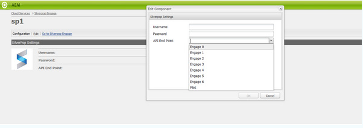

# 與Silverpop Engage整合{#integrating-with-silverpop-engage}

>[!NOTE]
>
>Silverpop整 **合不** 可立即使用。 您必須從Package Share下 [載Silverpop整合套件](https://www.adobeaemcloud.com/content/marketplace/marketplaceProxy.html?packagePath=/content/companies/public/adobe/packages/aem620/product/cq-mcm-integrations-silverpop-content) ，並將它安裝在您的例項上。 安裝軟體包後，可以按照本文檔中的說明進行配置。

將AEM與Silverpop Engage整合後，您就可以透過Silverpop管理並傳送在AEM中建立的電子郵件。 它也可讓您透過AEM頁面上的AEM表單，使用Silverpop的銷售機會管理功能。

整合提供下列功能：

* 在AEM中建立電子郵件並發佈至Silverpop以進行散發的功能。
* 設定AEM表單動作以建立Silverpop訂閱者的能力。

在設定Silverpop Engage後，您可以將電子報或電子郵件發佈至Silverpop Engage。

## 建立Silverpop設定 {#creating-a-silverpop-configuration}

Silverpop組態可透過 **Cloudservices**、 **Tools**&#x200B;或 **API端點新增**。 本節將介紹所有方法。

### 透過Cloudservices設定Silverpop {#configuring-silverpop-via-cloudservices}

若要在Cloud services中建立Silverpop設定：

1. 在AEM中，點選或按一 **下「工具** >部 **署** > **雲端服務**」。 (或直接存取位 `https://<hostname>:<port>/etc/cloudservices.html`置。)
1. 在協力廠商服務下方，按一下「 **Silverop Engage** 」，然後按 **一下「Configure**」。 「Silverpop」（銀色快顯）配置窗口隨即開啟。

   >[!NOTE]
   >
   >除非您從Package Share下載套件，否則Silverpop Engage不提供協力廠商服務下的選項。

1. 輸入標題和名稱（可選），然後按一下「 **建立**」。 將開啟** Silverpop Settings**配置窗口。
1. 輸入用戶名、密碼，然後從下拉清單中選擇API端點。
1. 按一 **下「連線至Silverpop」。** 成功連線後，您會看到成功對話方塊。 按一下 **確定** ，退出窗口。 按一下「跳至Silverpop參與」，即 **可前往Silverpop**。
1. 已設定Silverpop。 您可以按一下「編輯」來編輯 **設定**。
1. 此外，Silverpop Engage架構可透過提供標題和名稱（選用）來設定為個人化動作。 按一下「建立」將成功建立已設定之Silverpop連線的架構。

   匯入的資料擴充欄稍後可透過AEM元件- **Text and Personalization使用**。

### 透過工具設定Silverpop {#configuring-silverpop-via-tools}

要在「工具」中建立Silverpop配置：

1. 在AEM中，點選或按一 **下「工具** >部 **署** > **雲端服務**」。 或者，直接前往 `https://<hostname>:<port>/misadmin#/etc`。
1. 依序選 **擇「工具**」、「雲端服 **務設定」、** 「 **Silverpop參與」**。
1. 按一 **下「新增** 」以開啟「 **建立頁面** 」視窗。

   

1. 輸入「 **標題** 」(Title **)和（可選）**「名稱 **」(Name**)，然後按一下「建立」。
1. 按照上一步步驟4中的說明輸入配置資訊。 請依照該程式完成Silverpop的設定。

### 添加多個配置 {#adding-multiple-configurations}

要添加多個配置：

1. 在歡迎頁面上，按一下「 **雲端服務」** ，然後按 **一下「Silverpop參與」**。 按一下「 **Show Configurations** （顯示配置）」按鈕，如果有一個或多個Silverpop配置可用，則該按鈕將顯示。 列出所有可用的配置。
1. 按一下「 **可用** 」組態旁的+號。 這將開啟「創 **建配置** 」窗口。 請依照先前的設定程式來建立新的設定。

### 設定API端點以連線至Silverpop {#configuring-api-end-points-for-connecting-to-silverpop}

目前，AEM有6個不安全的端點（Engage 1到6）。 Silverpop現在提供兩個新端點，並變更現有端點的連接端點。

若要設定API端點：

1. 轉到 `/libs/mcm/silverpop/components/silverpoppage/dialog/items/general/items/apiendpoint/options node` 上 `https://<hostname>:<port>/crxde.`
1. 按一下右鍵並選擇 **建立**, **建立節點**。
1. 輸入「 **Name** as(名稱 `sp-e0` )」 **並選擇「Type** as( `cq:Widget`類型)」。
1. 向新添加的節點添加兩個屬性：

   1. **名稱**: `text`，類 **型**: `String`, **值**: `Engage 0`
   1. **名稱**: `value`，類 **型**: `String`, **值**: `https://api0.silverpop.com`
   

   按一下「全部儲存」按鈕。

1. 建立另一個節點， **其名稱**`sp-e7` 為 **,** 類型為 `cq:Widget`。

   向新添加的節點添加兩個屬性：

   1. **名稱**: `text`，類 **型**: `String`, **值**: `Pilot`
   1. **名稱**: `value`，類 **型**: `String`, **值**: `https://apipilot.silverpop.com/XMLAPI`

1. 若要變更現有的API端點（參與1到6），請按一下每個端點並取代下列值：

   | **節點名稱** | **現有端點值** | **新端點值** |
   |---|---|---|
   | sp-e1 | https://api.engage1.silverpop.com/XMLAPI | https://api1.silverpop.com |
   | sp-e2 | https://api.engage2.silverpop.com/XMLAPI | https://api2.silverpop.com |
   | sp-e3 | https://api.engage3.silverpop.com/XMLAPI | https://api3.silverpop.com |
   | sp-e4 | https://api.engage4.silverpop.com/XMLAPI | https://api4.silverpop.com |
   | sp-e5 | https://api.engage5.silverpop.com/XMLAPI | https://api5.silverpop.com |
   | sp-e6 | https://api.pilot.silverpop.com/XMLAPI | https://api6.silverpop.com |

1. 按一下「 **全部儲存**」。 AEM現在已準備好透過安全端點連線至Silverpop。

   

