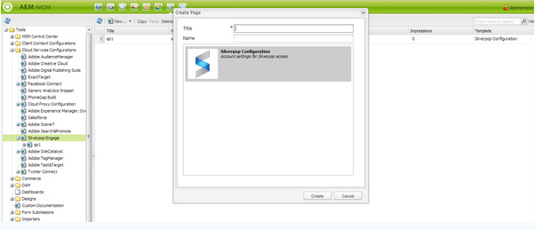

# 與Silverpop Engage整合{#integrating-with-silverpop-engage}

>[!NOTE]
>
>Silverpop整合是&#x200B;**不可立即使用**。 您必須從Package Share下載[Silverpop整合套件](https://www.adobeaemcloud.com/content/marketplace/marketplaceProxy.html?packagePath=/content/companies/public/adobe/packages/aem620/product/cq-mcm-integrations-silverpop-content)，並安裝在您的執行個體上。 安裝軟體包後，可以按本文檔中所述配置該軟體包。

將AEM與Silverpop Engage整合可讓您透過Silverpop管理並傳送在AEM中建立的電子郵件。 也可讓您透過AEM頁面上的AEM表單，使用Silverpop的銷售機會管理功能。

整合提供下列功能：

* 可在AEM中建立電子郵件，並發佈至Silverpop以供分發。
* 設定AEM表單動作以建立Silverpop訂閱者的功能。

設定Silverpop Engage後，您就可以將電子報或電子郵件發佈至Silverpop Engage。

## 建立Silverpop設定{#creating-a-silverpop-configuration}

可透過&#x200B;**Cloudservices**、**Tools**&#x200B;或&#x200B;**API端點**&#x200B;新增Silverpop設定。 本節將說明所有方法。

### 透過Cloudservices {#configuring-silverpop-via-cloudservices}設定Silverpop

若要在Cloud Services中建立Silverpop設定：

1. 在AEM中，點選或按一下「**工具** > **部署** > **Cloud Services**」。 （或直接訪問`https://<hostname>:<port>/etc/cloudservices.html`。）
1. 在協力廠商服務下方，按一下&#x200B;**Silverop Engage**，然後按一下&#x200B;**Configure**。 「Silverpop設定」視窗隨即開啟。

   >[!NOTE]
   >
   >除非您從Package Share下載套件，否則無法在協力廠商服務底下使用Silverpop Engage。

1. 輸入標題和名稱（可選），然後按一下「**Create**」。 ** Silverpop設定**設定視窗隨即開啟。
1. 輸入使用者名稱、密碼，然後從下拉式清單中選取API端點。
1. 按一下「**連線至Silverpop」。** 成功連線後，您會看到成功對話方塊。按一下&#x200B;**OK**&#x200B;退出窗口。 您可以按一下&#x200B;**前往Silverpop Engage**，前往Silverpop。
1. 已設定Silverpop。 您可以按一下「**編輯**」來編輯配置。
1. 此外，您也可以提供標題和名稱（選用），針對個人化動作設定Silverpop Engage架構。 按一下「建立」即可成功建立已設定之Silverpop連線的架構。

   匯入的資料擴充功能欄稍後可透過AEM元件 — **文字和個人化**&#x200B;使用。

### 透過工具{#configuring-silverpop-via-tools}設定Silverpop

若要在工具中建立Silverpop設定：

1. 在AEM中，點選或按一下「**工具** > **部署** > **Cloud Services**」。 或直接前往`https://<hostname>:<port>/misadmin#/etc`導覽至該處。
1. 依序選取&#x200B;**工具**、**Cloud Services設定、**&#x200B;及&#x200B;**Silverpop參與**。
1. 按一下&#x200B;**New**&#x200B;以開啟&#x200B;**Create Page**&#x200B;視窗。

   

1. 輸入&#x200B;**Title**&#x200B;和（可選）**Name**，然後按一下&#x200B;**Create**。
1. 按上一步步驟4所述輸入配置資訊。 請依照該程式完成Silverpop的設定。

### 添加多個配置{#adding-multiple-configurations}

若要新增多個設定：

1. 在歡迎頁面上，按一下&#x200B;**Cloud Services**，然後按一下&#x200B;**Silverpop Engage**。 按一下&#x200B;**顯示設定**&#x200B;按鈕，如果有一或多個Silverpop設定可用，按鈕便會顯示。 列出所有可用的配置。
1. 按一下「可用配置」旁的&#x200B;**+**&#x200B;符號。 這將開啟&#x200B;**建立配置**&#x200B;窗口。 請依照先前的配置過程建立新配置。

### 設定API端點以連線至Silverpop {#configuring-api-end-points-for-connecting-to-silverpop}

目前，AEM有6個不安全的端點（參與1到6）。 Silverpop現在提供兩個新端點，以及現有端點的已變更連線端點。

若要設定API端點：

1. 前往`https://<hostname>:<port>/crxde.`上的`/libs/mcm/silverpop/components/silverpoppage/dialog/items/general/items/apiendpoint/options node`
1. 按一下右鍵並選擇&#x200B;**Create**，然後選擇&#x200B;**Create Node**。
1. 輸入&#x200B;**Name**&#x200B;作為`sp-e0`，然後選擇&#x200B;**Type**&#x200B;作為`cq:Widget`。
1. 將兩個屬性新增至新新增的節點：

   1. **名稱**: `text`，類 **型**: `String`, **值**:  `Engage 0`
   1. **名稱**: `value`，類 **型**: `String`, **值**:  `https://api0.silverpop.com`

   

   按一下「全部保存」按鈕。

1. 再建立一個節點，其中&#x200B;**Name**&#x200B;為`sp-e7`,**Type**&#x200B;為`cq:Widget`。

   將兩個屬性新增至新新增的節點：

   1. **名稱**: `text`，類 **型**: `String`, **值**:  `Pilot`
   1. **名稱**: `value`，類 **型**: `String`, **值**:  `https://apipilot.silverpop.com/XMLAPI`

1. 若要變更現有的API端點（參與1到6），請逐一按一下每個端點，並依下列方式取代值：

   | **節點名稱** | **現有端點值** | **新端點值** |
   |---|---|---|
   | sp-e1 | https://api.engage1.silverpop.com/XMLAPI | https://api1.silverpop.com |
   | sp-e2 | https://api.engage2.silverpop.com/XMLAPI | https://api2.silverpop.com |
   | sp-e3 | https://api.engage3.silverpop.com/XMLAPI | https://api3.silverpop.com |
   | sp-e4 | https://api.engage4.silverpop.com/XMLAPI | https://api4.silverpop.com |
   | sp-e5 | https://api.engage5.silverpop.com/XMLAPI | https://api5.silverpop.com |
   | sp-e6 | https://api.pilot.silverpop.com/XMLAPI | https://api6.silverpop.com |

1. 按一下「**全部保存**」。 AEM現在已準備好透過安全端點連線至Silverpop。

   
