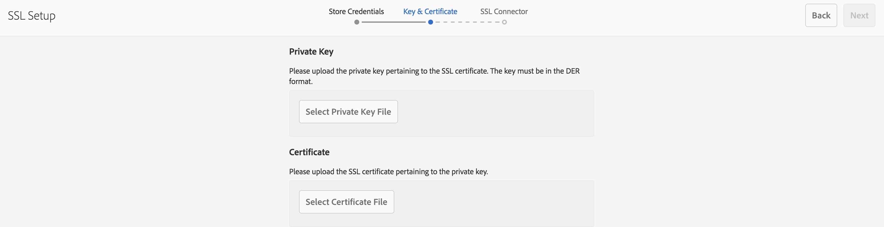

# 預設為SSL/TLS{#ssl-tls-by-default}

為了持續改善AEM的安全性，Adobe已推出SSL預設功能。 其目的是鼓勵使用HTTPS連線至AEM例項。

## 預設啟用SSL/TLS {#enabling-ssl-tls-by-default}

您可以按一下AEM主畫面中的相關收件匣訊息，以開始依預設設定SSL/TLS。 要進入收件箱，請按螢幕右上角的鈴聲表徵圖。 然後，按一下 **查看全部**. 這會顯示清單檢視中排序的所有警報清單。

在清單中，選取並開啟 **配置HTTPS** 警報：


>[!NOTE]
>
>若 **配置HTTPS** 警報不在收件匣中，您可以前往直接導覽至HTTPS精靈 *<http://serveraddress:serverport/libs/granite/security/content/sslConfig.html?item=configuration%2fconfiguressl&_charset_=utf-8>*

名為的服務用戶 **ssl-service** 已為此功能建立。 開啟警報後，系統會引導您執行下列設定精靈：

1. 首先，設定「儲存憑證」。 這些是 **ssl-service** 包含HTTPS偵聽器的私鑰和信任儲存的系統用戶密鑰儲存。

   

1. 輸入憑據後，按一下 **下一個** 在頁面的右上角。 然後，上傳SSL/TLS連線的相關私密金鑰和憑證。

   

   >[!NOTE]
   >
   >如需如何產生私密金鑰和憑證以與精靈搭配使用的詳細資訊，請參閱 [本程式](/help/sites-administering/ssl-by-default.md#generating-a-private-key-certificate-pair-to-use-with-the-wizard) 下方。

1. 最後，為HTTPS偵聽器指定HTTPS主機名和TCP埠。

   

## 預設自動化SSL/TLS {#automating-ssl-tls-by-default}

預設會自動化SSL/TLS有三種方式。

### 透過HTTPPOST {#via-http-post}

第一種方法涉及發佈到配置嚮導正在使用的SSLSetup伺服器：

```shell
POST /libs/granite/security/post/sslSetup.html
```

您可以在POST中使用下列裝載來自動設定：

```xml
------WebKitFormBoundaryyBO4ArmGlcfdGDbs
Content-Disposition: form-data; name="keystorePassword"

test
------WebKitFormBoundaryyBO4ArmGlcfdGDbs
Content-Disposition: form-data; name="keystorePasswordConfirm"
test
------WebKitFormBoundaryyBO4ArmGlcfdGDbs
Content-Disposition: form-data; name="truststorePassword"
test
------WebKitFormBoundaryyBO4ArmGlcfdGDbs
Content-Disposition: form-data; name="truststorePasswordConfirm"
test
------WebKitFormBoundaryyBO4ArmGlcfdGDbs
Content-Disposition: form-data; name="privatekeyFile"; filename="server.der"
Content-Type: application/x-x509-ca-cert

------WebKitFormBoundaryyBO4ArmGlcfdGDbs
Content-Disposition: form-data; name="certificateFile"; filename="server.crt"
Content-Type: application/x-x509-ca-cert

------WebKitFormBoundaryyBO4ArmGlcfdGDbs
Content-Disposition: form-data; name="httpsPort"
8443
```

Servlet和任何SlingPOSTServlet一樣，會以200 OK或錯誤HTTP狀態代碼回應。 您可以在回應的HTML內文中找到狀態的詳細資訊。

以下是成功回應和錯誤的範例。

**成功範例** （狀態= 200）:

```xml
<!DOCTYPE html>
<html lang='en'>
<head>
<title>OK</title>
</head>
<body>
<h1>OK</h1>
<dl>
<dt class='foundation-form-response-status-code'>Status</dt>
<dd>200</dd>
<dt class='foundation-form-response-status-message'>Message</dt>
<dd>SSL successfully configured</dd>
<dt class='foundation-form-response-title'>Title</dt>
<dd>OK</dd>
<dt class='foundation-form-response-description'>Description</dt>
<dd>HTTPS has been configured on port 8443. The private key and
certificate were stored in the key store of the user ssl-service.
Please take note of the key store password you provided. You will need
it for any subsequent updating of the private key or certificate.</dd>
</dl>
<h2>Links</h2>
<ul class='foundation-form-response-links'>
<li><a class='foundation-form-response-redirect' href='/'>Done</a></li>
</ul>
</body>
</html>
```

**錯誤範例** （狀態= 500）:

```xml
<!DOCTYPE html>
<html lang='en'>
<head>
<title>Error</title>
</head>
<body>
<h1>Error</h1>
<dl>
<dt class='foundation-form-response-status-code'>Status</dt>
<dd>500</dd>
<dt class='foundation-form-response-status-message'>Message</dt>
<dd>The provided file is not a valid key, DER format expected</dd>
<dt class='foundation-form-response-title'>Title</dt>
<dd>Error</dd>
</dl>
</body>
</html>
```

### 透過套件 {#via-package}

或者，您也可以上傳已包含下列必要項目的套件，以自動化SSL/TLS設定：

* ssl服務使用者的金鑰存放區。 此位置在 */home/users/system/security/ssl/service/keystore* 儲存庫中。
* 此 `GraniteSslConnectorFactory` 配置

### 產生要與精靈搭配使用的私密金鑰/憑證組 {#generating-a-private-key-certificate-pair-to-use-with-the-wizard}

以下是以DER格式建立自簽名憑證的範例，SSL/TLS精靈可使用此格式。 根據作業系統安裝OpenSSL，開啟OpenSSL命令提示符，並將目錄更改為要生成私鑰/證書的資料夾。

>[!NOTE]
>
>自簽名證書的使用僅用於實例，不應用於生產。

1. 首先，建立私密金鑰：

   ```shell
   openssl genrsa -aes256 -out localhostprivate.key 4096
   openssl rsa -in localhostprivate.key -out localhostprivate.key
   ```

1. 然後，使用私密金鑰產生憑證簽署要求(CSR):

   ```shell
   openssl req -sha256 -new -key localhostprivate.key -out localhost.csr -subj "/CN=localhost"
   ```

1. 產生SSL/TLS憑證並使用私密金鑰簽署。 在此範例中，將於一年後到期：

   ```shell
   openssl x509 -req -days 365 -in localhost.csr -signkey localhostprivate.key -out localhost.crt
   ```

將私密金鑰轉換為DER格式。 這是因為SSL精靈要求金鑰為DER格式：

```shell
openssl pkcs8 -topk8 -inform PEM -outform DER -in localhostprivate.key -out localhostprivate.der -nocrypt
```

最後，上傳 **localhostprivate.der** 作為私密金鑰和 **localhost.crt** 做為本頁開頭所述之圖形SSL/TLS精靈步驟2中的SSL/TLS憑證。

### 透過cURL更新SSL/TLS設定 {#updating-the-ssl-tls-configuration-via-curl}

>[!NOTE]
>
>請參閱 [搭配使用cURL與AEM](https://helpx.adobe.com/experience-manager/6-4/sites/administering/using/curl.html) 以取得AEM中實用cURL命令的集中清單。

您也可以使用cURL工具來自動化SSL/TLS設定。 您可以將設定參數發佈至此URL來執行此動作：

*https://&lt;serveraddress>:&lt;serverport>/libs/granite/security/post/sslSetup.html*

以下是您可用來變更設定精靈中各種設定的參數：

* `-F "keystorePassword=password"`  — 金鑰存放區密碼；

* `-F "keystorePasswordConfirm=password"`  — 確認金鑰存放區密碼；

* `-F "truststorePassword=password"`  — 信任儲存密碼；

* `-F "truststorePasswordConfirm=password"`  — 確認信任儲存密碼；

* `-F "privatekeyFile=@localhostprivate.der"`  — 指定私鑰；

* `-F "certificateFile=@localhost.crt"`  — 指定證書；

* `-F "httpsHostname=host.example.com"` — 指定主機名；
* `-F "httpsPort=8443"` - HTTPS偵聽器將使用的埠。

>[!NOTE]
>
>自動執行SSL/TLS設定的最快cURL執行方式，是從DER和CRT檔案所在的資料夾。 或者，您也可以在 `privatekeyFile` 和certificateFile引數。
>
>您也需要通過驗證才能執行更新，因此請務必將cURL命令附加至 `-u user:passeword` 參數。
>
>正確的cURL post命令應如下所示：

```shell
curl -u user:password -F "keystorePassword=password" -F "keystorePasswordConfirm=password" -F "truststorePassword=password" -F "truststorePasswordConfirm=password" -F "privatekeyFile=@localhostprivate.der" -F "certificateFile=@localhost.crt" -F "httpsHostname=host.example.com" -F "httpsPort=8443" https://host:port/libs/granite/security/post/sslSetup.html
```

#### 使用cURL的多個憑證 {#multiple-certificates-using-curl}

您可以重複certificateFile參數，將憑證鏈傳送給servlet，如下所示：

`-F "certificateFile=@root.crt" -F "certificateFile=@localhost.crt"..`

執行命令後，請驗證所有憑證是否已將其存入金鑰存放區。 從以下位置檢查金鑰存放區：
[http://localhost:4502/libs/granite/security/content/userEditor.html/home/users/system/security/ssl-service](http://localhost:4502/libs/granite/security/content/userEditor.html/home/users/system/security/ssl-service)

### 啟用TLS 1.3連線 {#enabling-tls-connection}

1. 前往Web主控台
1. 接著，導覽至 **OSGi** - **設定** - **AdobeGranite SSL連接器工廠**
1. 前往 **包含的密碼套件** 欄位並新增下列項目。 您可以按「**+**「 」按鈕，在中新增每個欄位後，顯示在欄位左側：

   * `TLS_AES_256_GCM_SHA384`
   * `TLS_AES_128_GCM_SHA256`
   * `TLS_CHACHA20_POLY1305_SHA256`
   * `TLS_AES_128_CCM_SHA256`
   * `TLS_AES_128_CCM_8_SHA256`