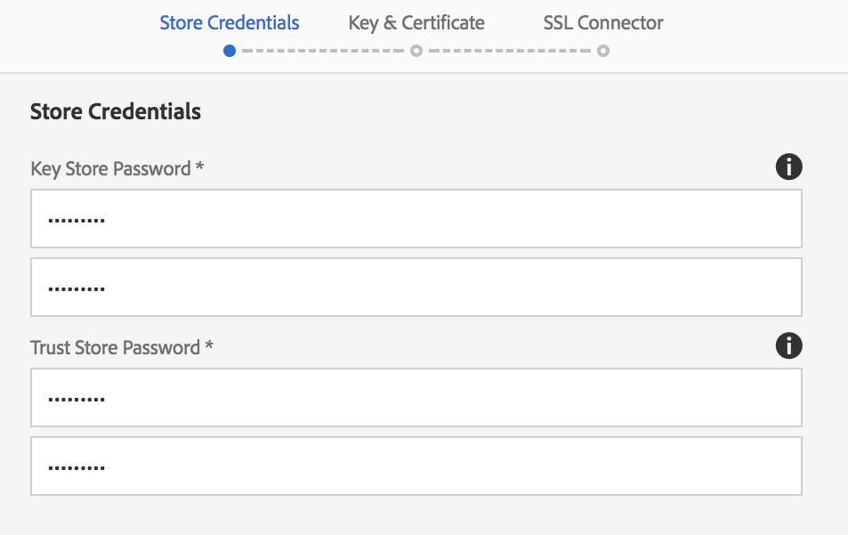

# SSL預設值{#ssl-by-default}

為了持續改善AEM的安全性，Adobe推出了稱為「SSL By Default」的功能。 其目的是鼓勵使用HTTPS來連線至AEM例項。

## 依預設啟用SSL {#enabling-ssl-by-default}

您可以按一下AEM首頁畫面中的相關「收件匣」訊息，開始依預設設定SSL。 要進入「收件箱」，請按螢幕右上角的鐘形表徵圖。 然後，按一下「全 **部檢視」**。 這會顯示清單檢視中排序的所有警報清單。

在清單中，選擇並開啟「 **Configure HTTPS** alert（配置HTTPS警報）」:


>[!NOTE]
>
>如果「收 **件匣」中未顯示「設定HTTPS** 」警報，您可以前往 *<http://serveraddress:serverport/libs/granite/security/content/sslConfig.html?item=configuration%2fconfiguressl&_charset_=utf-8>*

已為此功能 **建立了名為** ssl-service的服務用戶。 開啟警報後，將引導您執行以下配置嚮導：

1. 首先，設定「商店認證」。 這些是 **ssl-service系統用戶密鑰儲存的憑據** ，將包含HTTPS偵聽器的專用密鑰和信任儲存。

   

1. 在輸入認證後，按一 **下頁** 右上角的「下一步」。 然後，上傳SSL連線的相關私密金鑰和憑證。

   

   >[!NOTE]
   >
   >有關如何生成私鑰和用於嚮導的證書的資訊，請參 [閱](/help/sites-administering/ssl-by-default.md#generating-a-private-key-certificate-pair-to-use-with-the-wizard) 。

1. 最後，為HTTPS偵聽器指定HTTPS主機名和TCP埠。

   

## 預設自動化SSL {#automating-ssl-by-default}

SSL的預設自動化方式有三種。

### 透過HTTP POST {#via-http-post}

第一種方法包括張貼到配置嚮導使用的SSLSetup伺服器：

```shell
POST /libs/granite/security/post/sslSetup.html
```

您可以在POST中使用下列裝載來自動化配置：

```xml
------WebKitFormBoundaryyBO4ArmGlcfdGDbs
Content-Disposition: form-data; name="keystorePassword"

test
------WebKitFormBoundaryyBO4ArmGlcfdGDbs
Content-Disposition: form-data; name="keystorePasswordConfirm"
test
------WebKitFormBoundaryyBO4ArmGlcfdGDbs
Content-Disposition: form-data; name="truststorePassword"
test
------WebKitFormBoundaryyBO4ArmGlcfdGDbs
Content-Disposition: form-data; name="truststorePasswordConfirm"
test
------WebKitFormBoundaryyBO4ArmGlcfdGDbs
Content-Disposition: form-data; name="privatekeyFile"; filename="server.der"
Content-Type: application/x-x509-ca-cert

------WebKitFormBoundaryyBO4ArmGlcfdGDbs
Content-Disposition: form-data; name="certificateFile"; filename="server.crt"
Content-Type: application/x-x509-ca-cert

------WebKitFormBoundaryyBO4ArmGlcfdGDbs
Content-Disposition: form-data; name="httpsPort"
8443
```

Servlet和任何sling POST servlet一樣，會以200 OK或錯誤HTTP狀態碼回應。 您可以在回應的HTML內文中找到狀態的詳細資訊。

以下是成功回應和錯誤的範例。

**成功範例** （狀態= 200）:

```xml
<!DOCTYPE html>
<html lang='en'>
<head>
<title>OK</title>
</head>
<body>
<h1>OK</h1>
<dl>
<dt class='foundation-form-response-status-code'>Status</dt>
<dd>200</dd>
<dt class='foundation-form-response-status-message'>Message</dt>
<dd>SSL successfully configured</dd>
<dt class='foundation-form-response-title'>Title</dt>
<dd>OK</dd>
<dt class='foundation-form-response-description'>Description</dt>
<dd>HTTPS has been configured on port 8443. The private key and
certificate were stored in the key store of the user ssl-service.
Please take note of the key store password you provided. You will need
it for any subsequent updating of the private key or certificate.</dd>
</dl>
<h2>Links</h2>
<ul class='foundation-form-response-links'>
<li><a class='foundation-form-response-redirect' href='/'>Done</a></li>
</ul>
</body>
</html>
```

**錯誤示例** （狀態= 500）:

```xml
<!DOCTYPE html>
<html lang='en'>
<head>
<title>Error</title>
</head>
<body>
<h1>Error</h1>
<dl>
<dt class='foundation-form-response-status-code'>Status</dt>
<dd>500</dd>
<dt class='foundation-form-response-status-message'>Message</dt>
<dd>The provided file is not a valid key, DER format expected</dd>
<dt class='foundation-form-response-title'>Title</dt>
<dd>Error</dd>
</dl>
</body>
</html>
```

### 透過套件 {#via-package}

或者，您也可以上傳已包含下列必要項目的套件，以自動化SSL設定：

* ssl-service使用者的金鑰庫。 它位於儲存庫 *中/home/users/system/security/ssl-service/keystore* 。
* 配 `GraniteSslConnectorFactory` 置

### 生成要與嚮導一起使用的私鑰／證書對 {#generating-a-private-key-certificate-pair-to-use-with-the-wizard}

在下面，您將找到一個示例，用於建立DER格式的自簽名證書，SSL嚮導可以使用該證書。

>[!NOTE]
>
>使用自簽名憑證僅供範例使用，不應用於生產。

1. 首先，建立私鑰：

   ```shell
   openssl genrsa -aes256 -out localhostprivate.key 4096
   openssl rsa -in localhostprivate.key -out localhostprivate.key
   ```

1. 然後，使用私密金鑰產生憑證簽署要求(CSR):

   ```shell
   openssl req -sha256 -new -key localhostprivate.key -out localhost.csr -subj '/CN=localhost'
   ```

1. 產生SSL憑證並使用私密金鑰加以簽署。 在此範例中，將於一年後到期：

   ```shell
   openssl x509 -req -days 365 -in localhost.csr -signkey localhostprivate.key -out localhost.crt
   ```

將私密金鑰轉換為DER格式。 這是因為SSL精靈要求金鑰採用DER格式：

```shell
openssl pkcs8 -topk8 -inform PEM -outform DER -in localhostprivate.key -out localhostprivate.der -nocrypt
```

最後，在本頁開頭所述的圖形SSL嚮導的步驟2中，將 **localhostprivate.der上載為專用密鑰，** localhost.crt **** 上載為SSL證書。

### 透過cURL更新SSL設定 {#updating-the-ssl-configuration-via-curl}

>[!NOTE]
>
>如需 [AEM中實用cURL指令的集中清單，請參閱「搭配使用cURL](https://helpx.adobe.com/experience-manager/6-4/sites/administering/using/curl.html) 與AEM」。

您也可以使用cURL工具，將SSL設定自動化。 您可以將設定參數張貼至此URL來執行此動作：

*https://&lt;serveraddress>:&lt;serverport>/libs/granite/security/post/sslSetup.html*

以下是可用來更改配置嚮導中各種設定的參數：

* `-F "keystorePassword=password"` -密鑰庫密碼；

* `-F "keystorePasswordConfirm=password"` -確認密鑰庫密碼；

* `-F "truststorePassword=password"` -信任庫密碼；

* `-F "truststorePasswordConfirm=password"` -確認信任庫密碼；

* `-F "privatekeyFile=@localhostprivate.der"` -指定私密金鑰；

* `-F "certificateFile=@localhost.crt"` -指定證書；

* `-F "httpsHostname=host.example.com"`-指定主機名；
* `-F "httpsPort=8443"` - HTTPS偵聽器將使用的埠。

>[!NOTE]
>
>執行cURL以自動化SSL設定的最快速方式，是從DER和CRT檔案所在的資料夾。 或者，您也可以在和certificateFile參數中指 `privatekeyFile` 定完整路徑。
>
>您也需要經過驗證才能執行更新，因此請務必在參數中附加cURL命 `-u user:passeword` 令。
>
>正確的cURL post命令應如下所示：

```shell
curl -u user:password -F "keystorePassword=password" -F "keystorePasswordConfirm=password" -F "truststorePassword=password" -F "truststorePasswordConfirm=password" -F "privatekeyFile=@localhostprivate.der" -F "certificateFile=@localhost.crt" -F "httpsHostname=host.example.com" -F "httpsPort=8443" https://host:port/libs/granite/security/post/sslSetup.html
```

#### 使用cURL的多個憑證 {#multiple-certificates-using-curl}

通過重複certificateFile參數，可以向servlet發送證書鏈，如下所示：

`-F "certificateFile=@root.crt" -F "certificateFile=@localhost.crt"..`

執行命令後，請確認所有證書都已到密鑰庫。 從以下位置檢查密鑰庫：[http://localhost:4502/libs/granite/security/content/userEditor.html/home/users/system/security/ssl-service](http://localhost:4502/libs/granite/security/content/userEditor.html/home/users/system/security/ssl-service)
