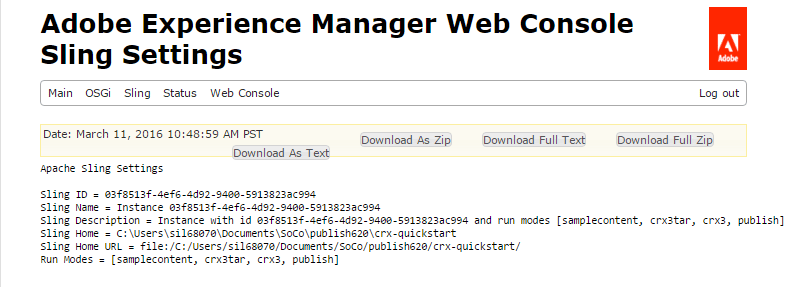

# 用戶同步{#user-synchronization}

## 簡介 {#introduction}

當部署為發 [布群](/help/sites-deploying/recommended-deploys.md#tarmk-farm)，成員必須能夠登入並查看其任何發佈節點上的資料。

作者環境不需要在發佈環境中建立的使用者和使用者群組（使用者資料）。

在作者環境中建立的大部分使用者資料都會保留在作者環境中，而不會複製至發佈例項。

在一個發佈實例上進行的註冊和修改必須與其他發佈實例同步，以便它們能夠訪問相同的用戶資料。

自AEM 6.1起，當啟用使用者同步時，使用者資料會自動在群組中的發佈例項間同步，而不會在作者上建立。

## Sling Distribution {#sling-distribution}

使用者資料及其 [ACL](/help/sites-administering/security.md)，會儲存在 [Oak Core](/help/sites-deploying/platform.md)（Oak JCR下方的圖層）中，並使用 [Oak API存取](https://helpx.adobe.com/experience-manager/6-5/sites/developing/using/reference-materials/javadoc/org/apache/jackrabbit/oak/api/package-tree.html)。 對於不頻繁的更新，使用 [Sling Content Distribution](https://github.com/apache/sling/blob/trunk/contrib/extensions/distribution/README.md) (Sling distribution)將使用者資料與其他發佈例項同步是合理的。

使用Sling散發的使用者同步的優點，與傳統複製相比有：

* *使用者*、使 *用者設定檔* ，以及在發佈時 *建立的使用者群組* ，不會在作者上建立

* Sling distribution會在jcr事件中設定屬性，讓您在發佈端事件接聽程式中運作成為可能，而不需擔心無限的複製回圈
* Sling散發只會傳送使用者資料至非原始發佈例項，以消除不必要的流量
* [同步中](/help/sites-administering/security.md) ，用戶節點中設定的ACL包括在內

>[!NOTE]
>
>如果需要作業，建議您使用SSO解決方案或使用嚴格作業，並讓客戶在切換至其他發佈者時登入。

>[!CAUTION]
>
>即使啟用了 ***用戶同步*** ，也不支援管理員組的同步。 相反，錯誤日誌中將記錄「導入差異」失敗。
>
>因此，當部署為發佈群時，如果將用戶添加到***administrators** group或從中刪除用戶，則必須在每個發佈實例上手動進行修改。

## 啟用用戶同步 {#enable-user-sync}

>[!NOTE]
>
>依預設，使用者同步為 `disabled`。
>
>啟用用戶同步涉及修改 *現有* OSGi配置。
>
>啟用使用者同步後，不應新增任何新的設定。

使用者同步需仰賴作者環境來管理使用者資料分發，即使使用者資料並非由作者建立。 許多（但並非全部）配置都發生在作者環境中，每個步驟都清楚地識別要在作者或發佈上執行。

以下是啟用用戶同步的必要步驟，後面是「疑難排 [解](#troubleshooting) 」部分：

### 必備條件 {#prerequisites}

1. 如果使用者和使用者群組已在一個發佈者上建立，建議在設定並啟用使用者同步 [前](#manually-syncing-users-and-user-groups) ，手動將使用者資料同步至所有發佈者。

啟用使用者同步後，僅會同步新建立的使用者和群組。

1. 請確定已安裝最新的代碼：

* [AEM平台更新](https://helpx.adobe.com/experience-manager/kb/aem62-available-hotfixes.html)
* [AEM Communities更新](/help/communities/deploy-communities.md#latestfeaturepack)

### 1.Apache Sling Distribution Agent —— 同步代理工廠 {#apache-sling-distribution-agent-sync-agents-factory}

**啟用使用者同步**

* **在作者上**

   * 以管理員權限登入
   * 訪問 [Web控制台](/help/sites-deploying/configuring-osgi.md)

      * 例如， [https://localhost:4502/system/console/configMgr](https://localhost:4502/system/console/configMgr)
   * 定位 `Apache Sling Distribution Agent - Sync Agents Factory`

      * 選取要開啟以進行編輯的現有設定（鉛筆圖示）確認 `name`: **`socialpubsync`**

      * 選中複選 `Enabled` 框
      * select `Save`


### 2.建立授權使用者 {#createauthuser}

**設定權限**&#x200B;此授權使用者將用於步驟3中，以設定Sling散發給作者。

* **每個發佈例項**

   * 以管理員權限登入
   * 訪問安 [全控制台](/help/sites-administering/security.md)

      * 例如， [https://localhost:4503/useradmin](https://localhost:4503/useradmin)
   * 建立新使用者

      * for example, `usersync-admin`
   * 將此用戶添加到用 **`administrators`** 戶組
   * [將此用戶的ACL添加到/home](#howtoaddacl)

      * `Allow jcr:all` 限制 `rep:glob=*/activities/*`


>[!CAUTION]
>
>必須建立新用戶。
>
>* 指派的預設使用者為 **`admin`**。
>* 請勿使用 `communities-user-admin user.`
>


#### 如何添加ACL {#addacls}

* 存取CRXDE Lite

   * 例如， [https://localhost:4503/crx/de](https://localhost:4503/crx/de)

* 選擇節 `/home` 點
* 在右窗格中，選擇選 `Access Control` 項卡
* 選擇 `+` 按鈕以添加ACL條目

   * **負責人**:搜索 *為用戶同步建立的用戶*
   * **類型**: `Allow`
   * **權限**: `jcr:all`
   * **限制** rep:glob: `*/activities/*`
   * 選擇確 **定**

* 選擇「 **全部保存」**


另請參閱

* [存取權限管理](/help/sites-administering/user-group-ac-admin.md#access-right-management)
* 疑難排解部 [分在響應處理過程中修改操作異常](#modify-operation-exception-during-response-processing)。

### 3.Apache Sling Distribution Transport憑證——以使用者憑證為基礎的DistributionTransportSecretProvider {#adobegraniteencpasswrd}

**設定權限**

一旦在所有發佈實例上建立了已授權用戶(**`administrators`**用戶組的成員)，則必須在作者上將該授權用戶標識為具有從作者同步用戶資料以進行發佈的權限。

* **在作者上**

   * 以管理員權限登入
   * 訪問 [Web控制台](/help/sites-deploying/configuring-osgi.md)

      * 例如， [https://localhost:4502/system/console/configMgr](https://localhost:4502/system/console/configMgr)
   * 定位 `Apache Sling Distribution Transport Credentials - User Credentials based DistributionTransportSecretProvider`
   * 選取要開啟以進行編輯的現有設定（鉛筆圖示）確認 `property name`: **`socialpubsync-publishUser`**

   * 在步驟2中，將使用者名稱 [和密碼設為](#createauthorizeduser) 「發佈時建立的授權使用者」

      * for example, `usersync-admin`


### 4.Apache Sling Distribution Agent - Queue Agents Factory {#apache-sling-distribution-agent-queue-agents-factory}

**啟用使用者同步**

* **發佈時**:

   * 以管理員權限登入
   * 訪問 [Web控制台](/help/sites-deploying/configuring-osgi.md)

      * 例如， [https://localhost:4503/system/console/configMgr](https://localhost:4503/system/console/configMgr)
   * 定位 `Apache Sling Distribution Agent - Queue Agents Factory`

      * 選取要開啟以進行編輯的現有設定（鉛筆圖示）確認 `Name`: `socialpubsync-reverse`

      * 選中複選 `Enabled` 框
      * select `Save`
   * **對每個發佈例項重複**


### 5.Adobe Social Sync —— 比較觀察器工廠 {#diffobserver}

**啟用群組同步**

* **在每個發佈例項上**:

   * 以管理員權限登入
   * 訪問 [Web控制台](/help/sites-deploying/configuring-osgi.md)

      * 例如， [https://localhost:4503/system/console/configMgr](https://localhost:4503/system/console/configMgr)
   * 定位 **`Adobe Social Sync - Diff Observer Factory`**

      * 選取要開啟以進行編輯的現有設定（鉛筆圖示）

         驗證 `agent name`: `socialpubsync-reverse`

      * 選中複選 `Enabled` 框
      * select `Save`


### 6.Apache Sling Distribution Trigger —— 計畫觸發器工廠 {#apache-sling-distribution-trigger-scheduled-triggers-factory}

**（可選）修改輪詢間隔**

依預設，作者每30秒就會對變更進行民調問答。 要更改此間隔：

* **在作者上**

   * 以管理員權限登入
   * 訪問 [Web控制台](/help/sites-deploying/configuring-osgi.md)

      * 例如， [https://localhost:4502/system/console/configMgr](https://localhost:4502/system/console/configMgr)
   * 定位 `Apache Sling Distribution Trigger - Scheduled Triggers Factory`

      * 選取要開啟以進行編輯的現有設定（鉛筆圖示）

         * 驗證 `Name`: `socialpubsync-scheduled-trigger`
      * 將設定 `Interval in Seconds` 為所需間隔
      * select `Save`


## 設定多個發佈例項 {#configure-for-multiple-publish-instances}

預設組態是針對單一發佈例項。 由於啟用用戶同步的原因是同步多個發佈實例（例如對於發佈群），因此需要將其他發佈實例添加到同步代理工廠。

### 7.Apache Sling Distribution Agent —— 同步代理工廠 {#apache-sling-distribution-agent-sync-agents-factory-1}

**新增發佈例項：**

* **在作者上**

   * 以管理員權限登入
   * 訪問 [Web控制台](/help/sites-deploying/configuring-osgi.md)

      * 例如， [https://localhost:4502/system/console/configMgr](https://localhost:4502/system/console/configMgr)
   * 定位 `Apache Sling Distribution Agent - Sync Agents Factory`

      * 選取要開啟以進行編輯的現有設定（鉛筆圖示）確認 `Name`: `socialpubsync`


* **導出器端**&#x200B;點：每個發佈器都應有一個導出器端點。 例如，如果有2個發佈者，localhost:4503和4504，則應有2個項目：

   * `https://localhost:4503/libs/sling/distribution/services/exporters/socialpubsync-reverse`
   * `https://localhost:4504/libs/sling/distribution/services/exporters/socialpubsync-reverse`

* **匯入工具端**&#x200B;點每個發佈工具應有匯入工具端點。 例如，如果有2個發佈者，localhost:4503和4504，則應有2個項目：

   * `https://localhost:4503/libs/sling/distribution/services/importers/socialpubsync`
   * `https://localhost:4504/libs/sling/distribution/services/importers/socialpubsync`

* select `Save`

### 8.AEM Communities使用者同步接聽程式 {#aem-communities-user-sync-listener}

**（可選）同步其他JCR節點**

如果有自訂資料需要在多個發佈例項間同步，則：

* **在每個發佈例項上**:

   * 以管理員權限登入
   * 訪問 [Web控制台](/help/sites-deploying/configuring-osgi.md)

      * for example, `https://localhost:4503/system/console/configMgr`
   * 定位 `AEM Communities User Sync Listener`
   * 選取要開啟以進行編輯的現有設定（鉛筆圖示）確認 `Name`: `socialpubsync-scheduled-trigger`


* **節點類**型這是要同步的節點類型清單。 除了sling:Folder以外的任何節點類型都必須列在此處（sling:folder需另外處理）。
要同步的節點類型的預設清單：

   * rep：用戶
   * nt:unstructured
   * nt：資源

* **可忽略的**屬性：這是在檢測到任何更改時將忽略的屬性清單。 對這些屬性的更改可能會作為其他更改的副作用而得到同步（因為同步始終在節點級別），但對這些屬性的更改本身不會觸發同步。
要忽略的預設屬性：

   * cq:lastModified

* **可忽略節**點同步期間將完全忽略的子路徑。 這些子路徑下的任何內容將隨時同步。
要忽略的預設節點：

   * .token
   * 系統

* **Distributed Folders**Most sling:Folders are ingored are noted synchronization is not need. 此處列出了少數例外。
要同步的預設資料夾

   * 區段／計分
   * 社交／關係
   * 活動

### 9.唯一Sling ID {#unique-sling-id}

>[!CAUTION]
>
>如果Sling ID在兩個或多個發佈例項之間相符，則使用者群組同步將失敗。

如果Sling ID對於發佈群中的多個發佈例項是相同的，則使用者群組將不會同步。

若要驗證所有Sling ID值都不同，請在每個發佈例項上：

1. 瀏覽至 `http://<host>:<port>/system/console/status-slingsettings`
1. 檢查 **Sling ID的值**



如果發佈例項的Sling ID符合任何其他發佈例項的Sling ID，則：

1. 停止其中一個具有相符Sling ID的發佈例項
1. 在crx-quickstart/launchpad/felix目錄中

   * 搜索並刪除名為sling.id.file的文 *件*

      * 例如，在Linux系統上：
         `rm -i $(find . -type f -name sling.id.file)`

      * 例如，在Windows系統上：
         `use windows explorer and search for *sling.id.file*`

1. 啟動發佈例項

   * 啟動時，會指派新的Sling ID

1. 驗證 **Sling ID現在是唯一** 的

重複這些步驟，直到所有發佈例項都有唯一的Sling ID。

## Vault Package Builder Factory {#vault-package-builder-factory}

要使更新正確同步，必須修改儲存庫包生成器以用於用戶同步：

* 在每個AEM發佈例項上
* 訪問 [Web控制台](/help/sites-deploying/configuring-osgi.md)

   * 例如， [https://localhost:4503/system/console/configMgr](https://localhost:4503/system/console/configMgr)

* 找到 `Apache Sling Distribution Packaging - Vault Package Builder Factory`

   * `Builder name: socialpubsync-vlt`

* 選擇編輯表徵圖
* 新增兩個 `Package Node Filters`:

   * `/home/users|-.*/.tokens`
   * `/home/users|-.*/rep:cache`

* 策略處理：

   * 要用新節點覆蓋現有rep:policy節點，請添加第三個包過濾器：

      * `/home/users|+.*/rep:policy`
   * 要防止策略被分發，請設定

      * `Acl Handling:` `IGNORE`


## 當…… {#what-happens-when}

### 使用者在發佈時自行註冊或編輯描述檔 {#user-self-registers-or-edits-profile-on-publish}

根據設計，在發佈環境中建立的使用者和設定檔（自行註冊）不會出現在作者環境中。

當拓撲是發佈群 [，且使用者同步已正確設定時，*user *和](/help/sites-deploying/recommended-deploys.md#tarmk-farm) user profile ** is synchronized using Sling distribution.

### 使用者或使用者群組是使用Security Console建立的 {#users-or-user-groups-are-created-using-security-console}

根據設計，在發佈環境中建立的使用者資料不會出現在作者環境中，反之亦然。

當使用 [User Administration and Security](/help/sites-administering/security.md) Console在發佈環境中新增使用者時，使用者同步會視需要將新使用者及其群組成員資格同步到其他發佈執行個體。 使用者同步也會同步透過安全性主控台建立的使用者群組。

## 疑難排解 {#troubleshooting}

### 如何讓使用者同步離線 {#how-to-take-user-sync-offline}

若要讓使用者同步離線，若要移 [除發佈者](#how-to-remove-a-publisher)[或手動同步資料](#manually-syncing-users-and-user-groups)，散發佇列必須空白且安靜。

要檢查分發隊列的狀態，請執行以下操作：

* 作者：

   * 使用 [CRXDE Lite](/help/sites-developing/developing-with-crxde-lite.md)

      * 在 `/var/sling/distribution/packages`

         * 以模式命名的資料夾節點 `distrpackage_*`
   * 使用包 [管理器](/help/sites-administering/package-manager.md)

      * 查找待定軟體包（尚未安裝）

         * 以模式命名 `socialpubsync-vlt*`
         * created by `communities-user-admin`


當分發隊列為空時，禁用用戶同步：

* 在作者上

   * *取消勾選* `Enabled` Apache Sling Distribution Agent - Sync Agents Factory的核取方 [塊](#apache-sling-distribution-agent-sync-agents-factory)

任務完成後，要重新啟用用戶同步：

* 在作者上

   * 勾選 `Enabled` Apache Sling Distribution Agent - Sync Agents Factory的核取 [方塊](#apache-sling-distribution-agent-sync-agents-factory)

### 使用者同步診斷 {#user-sync-diagnostics}

用戶同步診斷是一種檢查配置並嘗試識別任何問題的工具。

在作者上，只需從主控台導覽至「工具」、「 **作業」、「診斷」、「使用者同步診斷」。**

只要進入「User Sync Diagnostics（用戶同步診斷）」控制台，就會顯示結果。

未啟用用戶同步時將顯示以下內容：


#### 如何為發佈者運行診斷程式 {#how-to-run-diagnostics-for-publishers}

當從作者環境運行診斷程式時，通過／失敗結果將包含 [INFO] （資訊）部分，其中顯示已配置的發佈實例清單供確認。

清單中包含每個發佈例項的URL，該例項將執行該例項的診斷。 url參數 `syncUser` 會附加至診斷URL，其值會設定至步驟2中 *建立的授權同步使* 用者 [](/help/sites-administering/sync.md#2createauthorizeduser)。

**注意**:啟動URL之前，授 *權的同步使用者* ，必須已登入該發佈例項。


### 未正確添加配置 {#configuration-improperly-added}

當使用者同步無法運作時，最常見的問題是新增了其他 *組態*。 而應該已編輯*existing *default配 *置*。

以下是編輯後預設組態在Web主控台中的顯示方式檢視。 如果出現多個實例，應刪除添加的配置。

#### (author)One Apache Sling Distribution Agent - Sync Agents Factory {#author-one-apache-sling-distribution-agent-sync-agents-factory}


#### (author)一個Apache Sling Distribution Transport憑證——以使用者憑證為基礎的DistributionTransportSecretProvider {#author-one-apache-sling-distribution-transport-credentials-user-credentials-based-distributiontransportsecretprovider}


#### (publish)One Apache Sling Distribution Agent - Queue Agents Factory {#publish-one-apache-sling-distribution-agent-queue-agents-factory}


#### (publish)一個Adobe Social同步——比較觀察者工廠 {#publish-one-adobe-social-sync-diff-observer-factory}


#### (author)One Apache Sling Distribution Trigger - Scheduled Triggers Factory {#author-one-apache-sling-distribution-trigger-scheduled-triggers-factory}


### 在響應處理過程中修改工序例外 {#modify-operation-exception-during-response-processing}

如果日誌中顯示以下內容：

`org.apache.sling.servlets.post.impl.operations.ModifyOperation Exception during response processing.`

`java.lang.IllegalStateException: This tree does not exist`

然後確認第 [2節。 建立授權使用者](/content/docs/en/aem/6-1/administer/security/security/sync.md#2。 已正確遵循)。

本節說明如何建立已授權的使用者（存在於所有發佈例項上），並在作者的「機密提供者」OSGi設定中識別這些使用者。 依預設，使用者為 `admin`。

授權使用者應成為使用者群組的成 **`administrators`** 員，且該群組的權限不應變更。

授權使用者應明確擁有下列所有發佈例項的權限和限制：

| **路徑** | **jcr:all** | **rep:glob** |
|---|---|---|
| /home | X | */活動/* |
| /home/users | X | */活動/* |
| /home/groups | X | */活動/* |

身為群組的成 `administrators` 員，授權使用者應對所有發佈例項擁有下列權限：

| **路徑** | **jcr:all** | **jcr:read** | **rep:write** |
|---|---|---|---|
| /etc/packages/sling/distribution |  |  | X |
| /libs/sling/distribution |  | X |  |
| /var |  |  | X |
| /var/eventing |  | X | X |
| /var/sling/distribution |  | X | X |

### 用戶組同步失敗 {#user-group-sync-failed}

如果Sling ID在兩個或多個發佈例項之間相符，則使用者群組同步將失敗。

請參閱第 [9節。 唯一Sling ID](#unique-sling-id)

### 手動同步使用者和使用者群組 {#manually-syncing-users-and-user-groups}

* 在具有用戶和組的發佈商上：

   * [如果啟用，請禁用用戶同步](#how-to-take-user-sync-offline)
   * [建立包](/help/sites-administering/package-manager.md#creating-a-new-package) : `/home`

      * 編輯包時

         * 「篩選器」頁籤：新增篩選：根路徑： `/home`
         * 進階標籤：交流處理： `Overwrite`
   * [導出包](/help/sites-administering/package-manager.md#downloading-packages-to-your-file-system)


* 在其他發佈例項上：

   * [導入包](/help/sites-administering/package-manager.md#installing-packages)

要配置或啟用用戶同步，請轉至步驟1: [Apache Sling Distribution Agent —— 同步代理工廠](#apache-sling-distribution-agent-sync-agents-factory)

### 當發行者變為不可用時 {#when-a-publisher-becomes-unavailable}

當發佈例項無法使用時，如果它日後會重新連線，就不應移除它。 變更會排入發佈者佇列，一旦變更重新上線，就會處理變更。

如果發佈例項永遠不會回線，如果它已永久離線，則必須移除它，因為佇列累積會導致作者環境中的磁碟空間使用量明顯增加。

當發佈者關閉時，作者記錄檔會有類似下列的例外：

```
28.01.2016 15:57:48.475 ERROR
 [pool-12-thread-34-org_apache_sling_distribution_queue_socialpubsync_endpoint1
 (org/apache/sling/distribution/queue/socialpubsync/endpoint1)]
 org.apache.sling.distribution.agent.impl.SimpleDistributionAgent [agent][socialpubsync] could not deliver package distrpackage_1454014575838_a2b45ec8-0400-42f3-bed8-ae09b66381cb
 org.apache.sling.distribution.packaging.DistributionPackageImportException: failed in importing package ...
```

### 如何移除發佈者 {#how-to-remove-a-publisher}

若要從 [Apache Sling Distribution Agent - Sync Agents Factory移除發佈者](#apache-sling-distribution-agent-sync-agents-factory)，散發佇列必須是空的和安靜的。

* 作者：

   * [讓使用者離線同步](#how-to-take-user-sync-offline)
   * 請遵 [循步驟](#apache-sling-distribution-agent-sync-agents-factory) 7，將發佈者從兩個伺服器清單中移除：

      * `Exporter Endpoints`
      * `Importer Endpoints`
   * 重新啟用用戶同步

      * 勾選 `Enabled` Apache Sling Distribution Agent - Sync Agents Factory的核取 [方塊](#apache-sling-distribution-agent-sync-agents-factory)
