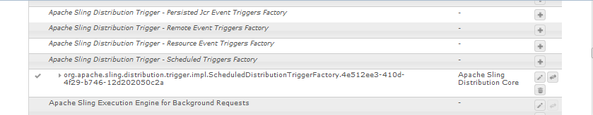

# 用戶同步{#user-synchronization}

## 簡介 {#introduction}

當部署為 [發佈場](/help/sites-deploying/recommended-deploys.md#tarmk-farm)，成員需要能夠登錄並查看其任何發佈節點上的資料。

在發佈環境中建立的用戶和用戶組（用戶資料）在作者環境中不需要。

在作者環境中建立的大多數用戶資料都打算保留在作者環境中，而不會複製到發佈實例。

對一個發佈實例進行的註冊和修改需要與其他發佈實例同步，以便它們能夠訪問相同的用戶資料。

從AEM6.1開始，啟用用戶同步後，用戶資料將自動在伺服器場中的發佈實例之間同步，而不是在作者中建立。

## Sling分佈 {#sling-distribution}

用戶資料及其 [ACL](/help/sites-administering/security.md)，儲存在 [橡樹](/help/sites-deploying/platform.md), Oak JCR下的層，並使用 [橡樹API](https://helpx.adobe.com/experience-manager/6-5/sites/developing/using/reference-materials/javadoc/org/apache/jackrabbit/oak/api/package-tree.html)。 在不頻繁更新的情況下，使用 [Sling內容分發](https://github.com/apache/sling/blob/trunk/contrib/extensions/distribution/README.md) （Sling分發）。

與傳統複製相比，使用Sling分發的用戶同步的好處有：

* *用戶*。 *用戶配置檔案* 和 *用戶組* 在發佈時建立，而不是在作者上建立

* Sling分發設定jcr事件中的屬性，使在發佈端事件偵聽器中執行操作成為可能，而無需考慮無限複製循環
* Sling分發僅向非發起發佈實例發送用戶資料，消除了不必要的流量
* [ACL](/help/sites-administering/security.md) 在用戶節點中設定的內容包含在同步中

>[!NOTE]
>
>如果需要會話，建議使用SSO解決方案或使用粘滯會話，並在客戶切換到其他發佈實例時讓其登錄。

>[!CAUTION]
>
>同步 **管理員** 不支援組，即使啟用了用戶同步。 相反，錯誤日誌中將記錄「導入差異」失敗。
>
>因此，當部署是發佈場時，如果將用戶添加到 **管理員** 組，必須在每個發佈實例上手動進行修改。

## 啟用用戶同步 {#enable-user-sync}

>[!NOTE]
>
>預設情況下，用戶同步為 `disabled`。
>
>啟用用戶同步涉及修改 *現有* OSGi配置。
>
>啟用用戶同步後，不應添加任何新配置。

用戶同步依賴作者環境來管理用戶資料分發，即使用戶資料不是由作者建立的。 許多配置（但並非全部）都發生在作者環境中，每個步驟都清楚地確定是在作者上還是發佈上執行配置。

以下是啟用用戶同步所需的步驟，後面是 [故障排除](#troubleshooting) 部分：

### 必備條件 {#prerequisites}

1. 如果用戶和用戶組已在一個發佈實例上建立，建議 [手動同步](#manually-syncing-users-and-user-groups) 在配置和啟用用戶同步之前，將用戶資料發送到所有發佈實例。

啟用用戶同步後，只同步新建立的用戶和組。

1. 確保已安裝最新代碼：

* [AEM平台更新](https://helpx.adobe.com/tw/experience-manager/kb/aem62-available-hotfixes.html)
* [AEM Communities更新](/help/communities/deploy-communities.md#latestfeaturepack)

### 1。Apache Sling分發代理 — 同步代理工廠 {#apache-sling-distribution-agent-sync-agents-factory}

**啟用用戶同步**

* **作者**

   * 使用管理員權限登錄
   * 訪問 [Web控制台](/help/sites-deploying/configuring-osgi.md)

      * 比如說， [https://localhost:4502/system/console/configMgr](https://localhost:4502/system/console/configMgr)
   * 定位 `Apache Sling Distribution Agent - Sync Agents Factory`

      * 選擇要開啟的現有配置進行編輯（鉛筆表徵圖）驗證 `name`: **`socialpubsync`**

      * 選擇 `Enabled` 複選框
      * 選擇 `Save`


### 2.建立授權用戶 {#createauthuser}

**配置權限**
此授權用戶將在步驟3中用於配置作者的Sling分發。

* **每個發佈實例**

   * 使用管理員權限登錄
   * 訪問 [安全控制台](/help/sites-administering/security.md)

      * 比如說， [https://localhost:4503/useradmin](https://localhost:4503/useradmin)
   * 建立新用戶

      * 比如說， `usersync-admin`
   * 將此用戶添加到 **`administrators`** 用戶組
   * [將此用戶的ACL添加到/home](#howtoaddacl)

      * `Allow jcr:all` 限制 `rep:glob=*/activities/*`


>[!CAUTION]
>
>必須建立新用戶。
>
>* 分配的預設用戶為 **`admin`**。
>* 不使用 `communities-user-admin user.`
>


#### 如何添加ACL {#addacls}

* 訪問CRXDE Lite

   * 比如說， [https://localhost:4503/crx/de](https://localhost:4503/crx/de)

* 選擇 `/home` 節點
* 在右窗格中，選擇 `Access Control` 頁籤
* 選擇 `+` 按鈕添加ACL條目

   * **主**: *搜索為用戶同步建立的用戶*
   * **類型**: `Allow`
   * **權限**: `jcr:all`
   * **限制** 代表:glob: `*/activities/*`
   * 選擇 **確定**

* 選擇 **全部保存**


另請參閱

* [訪問權限管理](/help/sites-administering/user-group-ac-admin.md#access-right-management)
* 「疑難解答」部分 [在響應處理期間修改工序異常](#modify-operation-exception-during-response-processing)。

### 3.Adobe花崗岩分佈 — 加密密碼傳輸機密提供程式 {#adobegraniteencpasswrd}

**配置權限**

一旦授權用戶， **`administrators`** 用戶組，已在所有發佈實例上建立，該授權用戶必須在作者上被標識為具有從作者同步用戶資料到發佈的權限。

* **作者**

   * 使用管理員權限登錄
   * 訪問 [Web控制台](/help/sites-deploying/configuring-osgi.md)

      * 比如說， [https://localhost:4502/system/console/configMgr](https://localhost:4502/system/console/configMgr)
   * 定位 `com.adobe.granite.distribution.core.impl.CryptoDistributionTransportSecretProvider.name`
   * 選擇要開啟的現有配置進行編輯（鉛筆表徵圖）驗證 `property name`: **`socialpubsync-publishUser`**

   * 將用戶名和密碼設定為 [授權用戶](#createauthuser) 在步驟2中建立

      * 比如說， `usersync-admin`


### 4.Apache Sling分發代理 — 隊列代理工廠 {#apache-sling-distribution-agent-queue-agents-factory}

**啟用用戶同步**

* **每個發佈實例**:

   * 使用管理員權限登錄
   * 訪問 [Web控制台](/help/sites-deploying/configuring-osgi.md)

      * 比如說， [https://localhost:4503/system/console/configMgr](https://localhost:4503/system/console/configMgr)
   * 定位 `Apache Sling Distribution Agent - Queue Agents Factory`

      * 選擇要開啟的現有配置進行編輯（鉛筆表徵圖）驗證 `Name`: `socialpubsync-reverse`

      * 選擇 `Enabled` 複選框
      * 選擇 `Save`
   * **重複** 每個發佈實例


### 5.Adobe Social同步 — 差異觀察器工廠 {#diffobserver}

**啟用組同步**

* **每個發佈實例**:

   * 使用管理員權限登錄
   * 訪問 [Web控制台](/help/sites-deploying/configuring-osgi.md)

      * 比如說， [https://localhost:4503/system/console/configMgr](https://localhost:4503/system/console/configMgr)
   * 定位 **`Adobe Social Sync - Diff Observer Factory`**

      * 選擇要開啟以進行編輯的現有配置（鉛筆表徵圖）

         驗證 `agent name`: `socialpubsync-reverse`

      * 選擇 `Enabled` 複選框
      * 選擇 `Save`


### 6。Apache Sling分發觸發器 — 計畫觸發器工廠 {#apache-sling-distribution-trigger-scheduled-triggers-factory}

**（可選）修改輪詢間隔**

預設情況下，作者每30秒輪詢一次更改。 要更改此間隔：

* **作者**

   * 使用管理員權限登錄
   * 訪問 [Web控制台](/help/sites-deploying/configuring-osgi.md)

      * 比如說， [https://localhost:4502/system/console/configMgr](https://localhost:4502/system/console/configMgr)
   * 定位 `Apache Sling Distribution Trigger - Scheduled Triggers Factory`

      * 選擇要開啟以進行編輯的現有配置（鉛筆表徵圖）

         * 驗證 `Name`: `socialpubsync-scheduled-trigger`
      * 設定 `Interval in Seconds` 到所需間隔
      * 選擇 `Save`


## 配置多個發佈實例 {#configure-for-multiple-publish-instances}

預設配置用於單個發佈實例。 由於啟用用戶同步的原因是同步多個發佈實例，因此需要將附加的發佈實例添加到同步代理工廠。

### 7。Apache Sling分發代理 — 同步代理工廠 {#apache-sling-distribution-agent-sync-agents-factory-1}

**添加發佈實例：**

* **作者**

   * 使用管理員權限登錄
   * 訪問 [Web控制台](/help/sites-deploying/configuring-osgi.md)

      * 比如說， [https://localhost:4502/system/console/configMgr](https://localhost:4502/system/console/configMgr)
   * 定位 `Apache Sling Distribution Agent - Sync Agents Factory`

      * 選擇要開啟的現有配置進行編輯（鉛筆表徵圖）驗證 `Name`: `socialpubsync`


* **導出器終結點**
每個發佈實例應有一個導出器終結點。 例如，如果有2個發佈實例，localhost:4503和4504，則應有2個條目：

   * `https://localhost:4503/libs/sling/distribution/services/exporters/socialpubsync-reverse`
   * `https://localhost:4504/libs/sling/distribution/services/exporters/socialpubsync-reverse`

* **導入程式終結點**
每個發佈實例應有一個導入程式終結點。 例如，如果有2個發佈實例，localhost:4503和4504，則應有2個條目：

   * `https://localhost:4503/libs/sling/distribution/services/importers/socialpubsync`
   * `https://localhost:4504/libs/sling/distribution/services/importers/socialpubsync`

* 選擇 `Save`

### 8.AEM Communities用戶同步偵聽器 {#aem-communities-user-sync-listener}

**（可選）同步其他JCR節點**

如果希望在多個發佈實例之間同步的自定義資料，則：

* **每個發佈實例**:

   * 使用管理員權限登錄
   * 訪問 [Web控制台](/help/sites-deploying/configuring-osgi.md)

      * 比如說， `https://localhost:4503/system/console/configMgr`
   * 定位 `AEM Communities User Sync Listener`
   * 選擇要開啟的現有配置進行編輯（鉛筆表徵圖）驗證 `Name`: `socialpubsync-scheduled-trigger`


* **節點類型**
這是將同步的節點類型清單。 此處需要列出sling:Folder以外的任何節點類型（sling:folder單獨處理）。
要同步的節點類型的預設清單：

   * rep:User
   * nt:unstructured
   * nt：資源

* **可忽略的屬性**
這是在檢測到任何更改時將忽略的屬性清單。 對這些屬性的更改可能會作為其他更改的副作用而同步（因為同步始終在節點級別），但對這些屬性所做的更改本身不會觸發同步。
要忽略的預設屬性：

   * cq:lastModified

* **可忽略的節點**
同步期間將完全忽略的子路徑。 這些子路徑下的任何內容都將隨時同步。
要忽略的預設節點：

   * .標籤
   * 系統

* **分佈式資料夾**
大多數sling：資料夾被忽略，因為不需要同步。 此處列出了少數例外。
要同步的預設資料夾

   * 段/計分
   * 社交/關係
   * 活動

### 9。唯一吊帶ID {#unique-sling-id}

>[!CAUTION]
>
>如果Sling ID在兩個或多個發佈實例之間匹配，則用戶組同步將失敗。

如果發佈場中多個發佈實例的Sling ID相同，則不會同步用戶組。

要驗證每個發佈實例上的所有Sling ID值是否不同，請執行以下操作：

1. 瀏覽 `http://<host>:<port>/system/console/status-slingsettings`
1. 檢查 **吊帶ID**


如果發佈實例的Sling ID與任何其他發佈實例的Sling ID匹配，則：

1. 停止一個具有匹配Sling ID的發佈實例
1. crx-quickstart/launchpad/felix目錄中

   * 搜索並刪除名為 *sling.id.file*

      * 例如，在Linux系統上：
         `rm -i $(find . -type f -name sling.id.file)`

      * 例如，在Windows系統上：
         `use windows explorer and search for *sling.id.file*`

1. 啟動發佈實例

   * 啟動時，將為其分配新的Sling ID

1. 驗證 **吊帶ID** 現在是唯一的

重複這些步驟，直到所有發佈實例都具有唯一的Sling ID。

## 保管庫包生成器工廠 {#vault-package-builder-factory}

為了使更新正確同步，必須修改用於用戶同步的保管庫包生成器：

* 每個發佈AEM實例
* 訪問 [Web控制台](/help/sites-deploying/configuring-osgi.md)

   * 比如說， [https://localhost:4503/system/console/configMgr](https://localhost:4503/system/console/configMgr)

* 查找 `Apache Sling Distribution Packaging - Vault Package Builder Factory`

   * `Builder name: socialpubsync-vlt`

* 選擇「編輯」表徵圖
* 添加 `Package Node Filters`:

   * `/home/users|-.*/.tokens`
   * `/home/users|-.*/rep:cache`

* 策略處理：

   * 要用新節點覆蓋現有rep:policy節點，請添加第三個包過濾器：

      * `/home/users|+.*/rep:policy`
   * 防止策略被分發，

      * `Acl Handling:` `IGNORE`


## 當…… {#what-happens-when}

### 用戶在發佈時自註冊或編輯配置檔案 {#user-self-registers-or-edits-profile-on-publish}

按照設計，在發佈環境中建立的用戶和配置檔案（自註冊）不會出現在作者環境中。

當拓撲為 [發佈場](/help/sites-deploying/recommended-deploys.md#tarmk-farm) 和用戶同步已正確配置， *用戶* 和 *用戶配置檔案* 使用Sling分發在發佈場中同步。

### 使用安全控制台建立用戶或用戶組 {#users-or-user-groups-are-created-using-security-console}

按照設計，在發佈環境中建立的用戶資料不會出現在作者環境中，反之亦然。

當 [用戶管理和安全](/help/sites-administering/security.md) 控制台用於在發佈環境中添加新用戶，用戶同步將根據需要將新用戶及其組成員身份與其他發佈實例同步。 用戶同步還將同步通過安全控制台建立的用戶組。

## 疑難排解 {#troubleshooting}

### 如何使用戶同步離線 {#how-to-take-user-sync-offline}

使用戶同步離線，以便 [刪除發佈實例](#how-to-remove-a-publish-instance) 或 [手動同步資料](#manually-syncing-users-and-user-groups)，分發隊列必須為空且安靜。

要檢查分發隊列的狀態，請執行以下操作：

* 作者：

   * 使用 [CRXDE Lite](/help/sites-developing/developing-with-crxde-lite.md)

      * 在中查找條目 `/var/sling/distribution/packages`

         * 使用模式命名的資料夾節點 `distrpackage_*`
   * 使用 [包管理器](/help/sites-administering/package-manager.md)

      * 查找掛起的包（尚未安裝）

         * 用模式命名 `socialpubsync-vlt*`
         * 建立者 `communities-user-admin`


分發隊列為空時，禁用用戶同步：

* 作者

   * *取消選中* `Enabled` 複選框 [Apache Sling分發代理 — 同步代理工廠](#apache-sling-distribution-agent-sync-agents-factory)

任務完成後，要重新啟用用戶同步：

* 作者

   * 檢查 `Enabled` 複選框 [Apache Sling分發代理 — 同步代理工廠](#apache-sling-distribution-agent-sync-agents-factory)

### 使用者同步診斷 {#user-sync-diagnostics}

用戶同步診斷是一種工具，用於檢查配置並嘗試識別任何問題。

作者只需從主控制台瀏覽 **工具、操作、診斷、用戶同步診斷。**

只需進入用戶同步診斷控制台即會顯示結果。

這是未啟用用戶同步時顯示的內容：


#### 如何為發佈實例運行診斷 {#how-to-run-diagnostics-for-publish-instances}

從作者環境運行診斷時，通過/失敗結果將包括 [資訊] 顯示已配置的發佈實例清單以供確認。

清單中包括每個發佈實例的URL，該實例將運行該實例的診斷。 url參數 `syncUser` 附加到診斷URL，其值設定為 *授權同步用戶* 建立 [步驟2](#createauthuser)。

**注釋**:在啟動URL之前， *授權同步用戶* 必須已登錄到該發佈實例。


### 配置添加不正確 {#configuration-improperly-added}

當用戶同步失敗時，最常見的問題是其他配置 *添加*。 相反，*現有*預設配置應 *編輯*。

以下是編輯後預設配置在Web控制台中的顯示方式。 如果出現多個實例，則應刪除添加的配置。

#### （作者）一個Apache Sling分發代理 — 同步代理工廠 {#author-one-apache-sling-distribution-agent-sync-agents-factory}


#### （作者）一個Apache Sling分發傳輸憑據 — 基於用戶憑據的DistributionTransportSecretProvider {#author-one-apache-sling-distribution-transport-credentials-user-credentials-based-distributiontransportsecretprovider}


#### （發佈）一個Apache Sling分發代理 — 隊列代理工廠 {#publish-one-apache-sling-distribution-agent-queue-agents-factory}


#### （發佈）一個Adobe Social同步 — 比較觀察器工廠 {#publish-one-adobe-social-sync-diff-observer-factory}


#### （作者）一個Apache Sling分發觸發器 — 計畫觸發器工廠 {#author-one-apache-sling-distribution-trigger-scheduled-triggers-factory}



### 在響應處理期間修改工序異常 {#modify-operation-exception-during-response-processing}

如果日誌中顯示以下內容：

`org.apache.sling.servlets.post.impl.operations.ModifyOperation Exception during response processing.`

`java.lang.IllegalStateException: This tree does not exist`

然後驗證該節 [2. 建立授權用戶](#createauthuser) 被恰當地跟蹤。

本節介紹如何建立在所有發佈實例上都存在的授權用戶，並在「機密提供程式」的OSGi配置中對作者進行標識。 預設情況下，用戶為 `admin`。

授權用戶應成為 **`administrators`** 不應更改用戶組和該組的權限。

授權用戶應對所有發佈實例明確具有以下權限和限制：

| **路徑** | **jcr：全部** | **rep:glob** |
|---|---|---|
| /home | X | &#42;/活動/&#42; |
| /home/users | X | &#42;/活動/&#42; |
| /home/groups | X | &#42;/活動/&#42; |

作為 `administrators` 組，授權用戶應對所有發佈實例具有以下權限：

| **路徑** | **jcr：全部** | **jcr：讀取** | **rep：寫入** |
|---|---|---|---|
| /etc/packages/sling/distribution |  |  | X |
| /libs/sling/distribution |  | X |  |
| /var |  |  | X |
| /var/事件 |  | X | X |
| /var/sling/distribution |  | X | X |

### 用戶組同步失敗 {#user-group-sync-failed}

如果Sling ID在兩個或多個發佈實例之間匹配，則用戶組同步將失敗。

請參閱節 [9。 唯一吊帶ID](#unique-sling-id)

### 手動同步用戶和用戶組 {#manually-syncing-users-and-user-groups}

* 在用戶和用戶組所在的發佈實例上：

   * [如果啟用，則禁用用戶同步](#how-to-take-user-sync-offline)
   * [建立包](/help/sites-administering/package-manager.md#creating-a-new-package) 共 `/home`

      * 編輯包時

         * 「篩選器」頁籤：添加篩選器：根路徑： `/home`
         * 高級頁籤：交流處理： `Overwrite`
   * [導出包](/help/sites-administering/package-manager.md#downloading-packages-to-your-file-system)


* 在其他發佈實例上：

   * [導入包](/help/sites-administering/package-manager.md#installing-packages)

要配置或啟用用戶同步，請轉至步驟1: [Apache Sling分發代理 — 同步代理工廠](#apache-sling-distribution-agent-sync-agents-factory)

### 當發佈實例不可用時 {#when-a-publish-instance-becomes-unavailable}

當發佈實例不可用時，如果將來將恢復聯機，則不應刪除它。 更改將排入發佈實例的隊列，一旦恢復聯機，將處理更改。

如果發佈實例永遠不會恢復聯機，如果它永久離線，則必須刪除它，因為隊列累積將導致作者環境中磁碟空間的使用量顯著。

當發佈實例關閉時，作者日誌將具有類似以下的異常：

```
28.01.2016 15:57:48.475 ERROR
 [pool-12-thread-34-org_apache_sling_distribution_queue_socialpubsync_endpoint1
 (org/apache/sling/distribution/queue/socialpubsync/endpoint1)]
 org.apache.sling.distribution.agent.impl.SimpleDistributionAgent [agent][socialpubsync] could not deliver package distrpackage_1454014575838_a2b45ec8-0400-42f3-bed8-ae09b66381cb
 org.apache.sling.distribution.packaging.DistributionPackageImportException: failed in importing package ...
```

### 如何刪除發佈實例 {#how-to-remove-a-publish-instance}

從中刪除發佈實例 [Apache Sling分發代理 — 同步代理工廠](#apache-sling-distribution-agent-sync-agents-factory)，分發隊列必須為空且安靜。

* 作者：

   * [使用戶同步離線](#how-to-take-user-sync-offline)
   * 跟 [步驟7](#apache-sling-distribution-agent-sync-agents-factory) 要從兩個伺服器清單中刪除發佈實例：

      * `Exporter Endpoints`
      * `Importer Endpoints`
   * 重新啟用用戶同步

      * 檢查 `Enabled` 複選框 [Apache Sling分發代理 — 同步代理工廠](#apache-sling-distribution-agent-sync-agents-factory)
