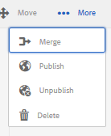

# 管理標籤 {#administering-tags}

標籤是對網站內的內容進行分類的一種快速而簡便的方法。 它們可以被視為關鍵字或標籤（元資料），允許在搜索結果中更快地找到內容。

在Adobe Experience ManagerAEM()中，標籤可以是

* 頁面的內容節點(請參見 [使用標籤](/help/sites-authoring/tags.md))

* 資產的元資料節點(請參見 [管理數字資產的元資料](/help/assets/metadata.md))

除頁面和資產外，標籤還用於AEM Communities功能

* 用戶生成的內容 [標籤UGC)](/help/communities/tag-ugc.md)

* 支援資源(請參見 [標籤支援資源](/help/communities/functions.md#catalog-function))

## 標籤功能 {#tag-features}

標籤的某些功能AEM包括：

* 標籤可以分為不同的命名空間。 這樣的層次結構允許構建分類。 這些分類學是全球性的AEM。
* 新建立標籤的主要限制是它們在特定命名空間中必須唯一。
* 標籤的標題不應包括標籤路徑分隔字元（如果存在，也不會顯示這些字元）

   * 冒號 `:`  — 限定命名空間標籤
   * 正斜線 `/`  — 限制子標籤

* 標籤可由作者和站點訪問者應用。 無論其建立者是誰，所有形式的標籤都可供選擇，無論是在分配給頁面時還是在搜索時。
* 「標籤 — 管理員」組的成員和具有修改權限的成員可以建立標籤並修改其分類 `/content/cq:tags`。

   * 包含子標籤的標籤稱為容器標籤
   * 不是容器標籤的標籤稱為葉標籤
   * 標籤命名空間是葉標籤或容器標籤

* 標籤由 [搜索元件](https://helpx.adobe.com/experience-manager/core-components/using/quick-search.html) 以便查找內容。
* 標籤由 [預偏器元件](https://helpx.adobe.com/experience-manager/core-components/using/teaser.html)，它監視用戶的標籤雲以提供目標內容。
* 如果標籤是內容的一個重要方面

   * 確保將標籤與使用它們的頁面打包
   * 確保 [標籤權限](#setting-tag-permissions) 啟用讀取訪問

## 標籤控制台 {#tagging-console}

「標籤」控制台用於建立和管理標籤及其分類。 一個目標是避免與基本相同的事物有許多類似的標籤：例如，頁面和頁面，鞋和鞋。

通過將標籤分組到命名空間、在建立新標籤之前查看現有標籤的使用情況，以及在不斷開標籤與當前引用內容的連接的情況下重新組織來管理標籤。

要訪問「標籤」控制台：

* 作者
* 以管理權限登錄
* 從全局導航

   * 選擇 **`Tools`**
   * 選擇 **`General`**
   * 選擇 **`Tagging`**

### 建立命名空間 {#creating-a-namespace}

要建立新命名空間，請選擇 **`Create Namespace`** 表徵圖

命名空間本身是標籤，不需要包含任何子標籤。 但是，要繼續建立分類， [建立子標籤](#creating-tags)，這又可以是葉標籤或容器標籤。

 

* **標題**

   *（必需）* 命名空間的顯示標題。

* **名稱**
   *（可選）* 命名空間的名稱。 如果未指定，則從標題建立有效的節點名稱。 請參閱 [標籤ID](/help/sites-developing/framework.md#tagid)。

* **說明**

   *（可選）* 命名空間的說明。

輸入所需資訊後

* 選擇 **建立**

### 標籤操作 {#operations-on-tags}

選擇命名空間或其他標籤可使以下操作可用：

* [檢視屬性](#viewing-tag-properties)
* [引用](#showing-tag-references)
* [建立標記](#creating-tags)
* [編輯](#editing-tags)
* [移動](#moving-tags)
* [合併](#merging-tags)
* [發佈](#publishing-tags)
* [未發佈](#unpublishing-tags)
* [刪除](#deleting-tags)

當瀏覽器窗口的寬度不足以顯示所有表徵圖時，最右邊的表徵圖將在 **`... More`** 表徵圖，當選中時將顯示隱藏操作表徵圖的下拉清單。

### 選擇命名空間標籤 {#selecting-a-namespace-tag}

當首次選中時，如果命名空間不包含任何標籤，則將在右側顯示屬性，否則顯示子標籤。 選定的每個標籤將顯示其包含的標籤或其屬性（如果它沒有子標籤）。

要為操作選擇標籤，並要進行多選，請僅選擇標題旁的表徵圖。 選擇標題將僅顯示屬性或開啟標籤以顯示其內容。

 

### 查看標籤屬性 {#viewing-tag-properties}

選擇命名空間或其他標籤時，選擇 **`View Properties`** 表徵圖將顯示與 `name`、上次編輯時間和引用數。 如果已發佈，則顯示上次發佈的時間和發佈者的ID。 此資訊將顯示在標籤列左側的列中。

### 顯示標籤引用 {#showing-tag-references}

選擇命名空間或其他標籤時，選擇 **引用** 表徵圖將標識已應用標籤的內容。

初始顯示是應用的標籤計數。

通過選擇計數右側的箭頭，將列出參照名稱。

當懸停在參照上時，參照的路徑將顯示為工具尖。

### 建立標籤 {#creating-tags}

當選擇命名空間或其他標籤時（通過選擇標題旁邊的表徵圖），可通過選擇 **`Create Tag`** 表徵圖

* **標題**
*（必需）*標籤的顯示標題。

* **名稱**
*（可選）*標籤的名稱。 如果未指定，則從標題建立有效的節點名稱。 請參閱 [標籤ID](/help/sites-developing/framework.md#tagid)。

* **說明**
*（可選）*標籤說明。

輸入所需資訊後

* 選擇 **建立**

### 編輯標籤 {#editing-tags}

選擇命名空間或其他標籤時，可以通過選擇**來更改標題、說明，並提供標題的本地化`Edit`**表徵圖。

編輯後，選擇 **保存**。

有關添加語言翻譯的詳細資訊，請參閱 [管理不同語言中的標籤](#managing-tags-in-different-languages)。

### 移動標籤 {#moving-tags}

選擇命名空間或其他標籤時，選擇 **`Move`** 表徵圖將允許標籤管理員和開發人員通過將標籤移動到新位置或更名來清除分類。 當所選標籤是容器標籤時，移動標籤也會移動所有子標籤。

>[!NOTE]
>
>建議僅允許作者 [編輯](#editing-tags) 標籤 `title`，不移動或更名標籤。

* **路徑**

   *（只讀）* 選定標籤的當前路徑。

* **移到**
瀏覽到要移動標籤的新路徑。

* **更名為**
初始顯示當前 
`name`標籤。 新 `name`的子菜單。

* 選擇 **保存**

### 合併標籤 {#merging-tags}

當分類具有重複項時，可以使用合併標籤。 當標籤A合併到標籤B中時，標籤A標籤的所有頁面都將用標籤B標籤，並且標籤A不再可供作者使用。

選擇命名空間或其他標籤時，選擇 **合併** 表徵圖將開啟一個面板，其中可以選擇要合併到的路徑。

* **路徑**

   *（只讀）* 選定要合併到另一個標籤的標籤的路徑。

* **合併到**
瀏覽以選擇要合併到的標籤的路徑。

>[!NOTE]
>
>合併後， **路徑** 最初選定的將（實際上）不再存在。
>
>當被引用的標籤被移動或合併時，該標籤不會物理地刪除，因此可以維護引用。

### 發佈標籤 {#publishing-tags}

選擇命名空間或其他標籤時，選擇 **發佈** 表徵圖以在發佈環境中激活標籤。 與頁面內容類似，只發佈所選標籤，而不管它是否是容器標籤。

要發佈分類（命名空間和子標籤），最佳做法是建立 [包](/help/sites-administering/package-manager.md) 命名空間(請參見 [分類根節點](/help/sites-developing/framework.md#taxonomy-root-node))。 一定要 [應用權限](#setting-tag-permissions) 建立包之前，將其添加到命名空間。

### 取消發佈標籤 {#unpublishing-tags}

選擇命名空間或其他標籤時，選擇 **取消發佈** 表徵圖將停用作者環境中的標籤並從發佈環境中將其刪除。 與 `Delete`操作，如果所選標籤是容器標籤，則其所有子標籤將在作者環境中停用並從發佈環境中刪除。

### 刪除標籤 {#deleting-tags}

選擇命名空間或其他標籤時，選擇 **刪除** 表徵圖將從作者環境中永久刪除標籤。 如果已發佈標籤，則也會從發佈環境中刪除該標籤。 如果所選標籤是容器標籤，則其所有子標籤也將被刪除。

## 設定標籤權限 {#setting-tag-permissions}

標籤權限為 [&#39;安全（預設）&#39;](/help/sites-administering/production-ready.md);發佈環境的最佳做法，要求明確允許對標籤具有讀取權限。 基本上，在對作者設定權限後建立標籤命名空間的包，並在所有發佈實例上安裝該包即可完成此操作。

* 關於作者實例

   * 以管理權限登錄
   * 訪問 [安全控制台](/help/sites-administering/security.md#accessing-user-administration-with-the-security-console)。

      * 例如，瀏覽http://localhost:4502/useradmin
   * 在左窗格中，選擇其 [讀取權限](/help/sites-administering/security.md#permissions) 是授予
   * 在右窗格中，找到**Path **到標籤命名空間

      * 比如說， `/content/cq:tags/mycommunity`
   * 選擇 `checkbox`的 **閱讀** 列
   * 選擇 **保存**

* 確保所有發佈實例具有相同的權限

   * 一種方法 [建立包](/help/sites-administering/package-manager.md#package-manager) 作者上命名空間的

      * 上 `Advanced` 的 `AC Handling` 選擇 `Overwrite`
   * 複製包

      * 選擇 `Replicate` 從包管理器

## 管理不同語言中的標籤 {#managing-tags-in-different-languages}

的 `title`標籤的屬性可以翻譯成多種語言。 翻譯後，相應的標籤 `title`可以根據用戶語言或頁面語言顯示。

### 定義多語言標籤標題 {#defining-tag-titles-in-multiple-languages}

下面介紹如何轉換 `title`標籤 **動物** 從英語到德語和法語。

從選擇 **股票攝影** 命名空間並選擇**`Edit`**表徵圖(請參閱 [編輯標籤](#editing-tags) )的正平方根。

「編輯標籤」面板提供了選擇標籤標題要本地化到的語言的功能。

在選擇每種語言時，將出現一個文本輸入框，可在其中輸入已翻譯的標題。

輸入所有翻譯後，選擇 **保存** 的子菜單。

通常，為標籤選擇的語言是從頁面語言（如果可用）中提取的。 當 [ `tag` 構件](/help/sites-developing/building.md#tagging-on-the-client-side) 在其它情況下（例如在窗體中或對話中）使用，標籤語言取決於上下文。

「標籤」控制台不使用頁面語言設定，而是使用用戶語言設定。 在「標籤」控制台中，對於「動物」標籤，在用戶屬性中將語言設定為法語的用戶將顯示「Animaux」。

要向對話框添加新語言，請參見 [向「編輯標籤」對話框添加新語言](/help/sites-developing/building.md#adding-a-new-language-to-the-edit-tag-dialog)。

>[!NOTE]
>
>標籤雲和標準頁面元件中的元關鍵字使用本地化標籤 `titles`基於頁面語言（如果可用）。

## 資源 {#resources}

* [為開發人員添加標籤](/help/sites-developing/tags.md)

   有關標籤框架以及在自定義應用程式中擴展和包括標籤的資訊。

* [經典UI標籤控制台](/help/sites-administering/classic-console.md)
