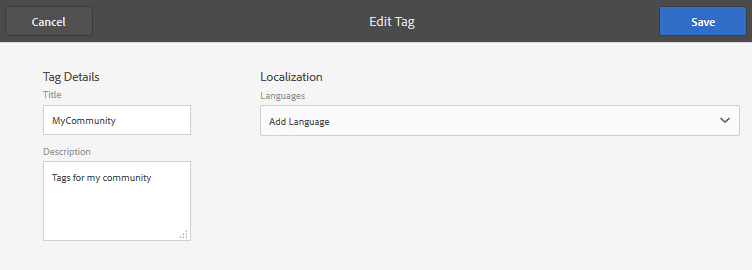
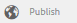

# 管理標籤{#administering-tags}

標籤是快速且簡單的網站內容分類方法。 可將它們視為關鍵字或標籤（中繼資料），讓內容在搜尋後更快速找到。

在Adobe Experience Manager(AEM)中，標籤可以是

* 頁面的內容節點（請參閱[使用標籤](/help/sites-authoring/tags.md)）

* 資產的中繼資料節點（請參閱[管理數位資產的中繼資料](/help/assets/metadata.md)）

除了頁面和資產外，標籤也用於AEM Communities功能

* 使用者產生的內容（請參閱[標籤UGC）](/help/communities/tag-ugc.md)

* 啟用資源（請參閱[標籤啟用資源](/help/communities/functions.md#catalog-function)）

## 標籤功能{#tag-features}

AEM中標籤的部分功能包括：

* 標籤可分組為各種命名空間。 這種層次結構允許建立分類。 這些分類在整個AEM中都是全球性的。
* 新建立標籤的主要限制是它們在特定命名空間內必須是唯一的。
* 標籤的標題不應包含標籤路徑分隔字元（如果有，也不會顯示）

   * 冒號`:` — 限定命名空間標籤
   * 正斜線`/` — 限定子標籤

* 標籤可由作者和網站訪客套用。 無論其建立者為何，所有形式的標籤都可供選擇，無論是指派給頁面時，還是搜索時。
* 「標籤 — 管理員」組的成員和具有`/content/cq:tags`修改權限的成員可以建立標籤並修改其分類法。

   * 包含子標籤的標籤稱為容器標籤
   * 非容器標籤的標籤稱為葉標籤
   * 標籤命名空間是葉標籤或容器標籤

* [搜尋元件](https://helpx.adobe.com/experience-manager/core-components/using/quick-search.html)會使用標籤來協助尋找內容。
* [Teaser元件](https://helpx.adobe.com/experience-manager/core-components/using/teaser.html)會使用標籤，監控使用者的標籤雲以提供目標內容。
* 如果標籤是內容的重要方面

   * 請務必使用標籤來封裝標籤
   * 確保[標籤權限](#setting-tag-permissions)啟用讀取存取

## 標籤控制台{#tagging-console}

「標籤」控制台用於建立和管理標籤及其分類。 一個目標是避免有許多類似標籤與基本相同的項目相關：例如頁面和頁面，鞋類和鞋類。

標籤的管理方式為將分組至命名空間、在建立新標籤前檢閱現有標籤的使用情形，以及重新組織而不會中斷標籤與目前參考內容的連線。

若要存取「標籤」主控台：

* 論作者
* 以管理權限登錄
* 從全局導航

   * 選擇&#x200B;**`Tools`**
   * 選擇&#x200B;**`General`**
   * 選擇&#x200B;**`Tagging`**

### 建立命名空間{#creating-a-namespace}

要建立新的命名空間，請選擇&#x200B;**`Create Namespace`**&#x200B;表徵圖。

命名空間本身就是標籤，不需要包含任何子標籤。 不過，若要繼續建立分類法，請[建立子標籤](#creating-tags)，這反過來可以是葉標籤或容器標籤。

 

* **標題**

   *（必要）* 命名空間的顯示標題。

* **名稱**
   *（選用）* 命名空間的名稱。如果未指定，則從標題中建立有效的節點名。 請參閱[TagID](/help/sites-developing/framework.md#tagid)。

* **說明**

   *（選用）* 命名空間的說明。

輸入所需資訊後

* 選擇&#x200B;**建立**

### 標籤{#operations-on-tags}上的操作

選取命名空間或其他標籤可執行下列操作：

* [檢視屬性](#viewing-tag-properties)
* [引用](#showing-tag-references)
* [建立標記](#creating-tags)
* [編輯](#editing-tags)
* [移動](#moving-tags)
* [合併](#merging-tags)
* [發佈](#publishing-tags)
* [未發佈](#unpublishing-tags)
* [刪除](#deleting-tags)

當瀏覽器視窗的寬度不足以顯示所有圖示時，最右邊的圖示會分組在&#x200B;**`... More`**&#x200B;圖示下，這會在選取時顯示隱藏操作圖示的下拉式清單。

### 選擇命名空間標籤{#selecting-a-namespace-tag}

首次選取時，如果命名空間不包含任何標籤，則屬性會顯示在右側，否則會顯示子標籤。 選取的每個標籤都會顯示其所包含的標籤，或如果沒有子標籤，則顯示其屬性。

要選擇操作的標籤，以及要多選，請僅選擇標題旁的表徵圖。 選取標題只會顯示屬性，或開啟標籤以顯示其內容。

 

### 查看標籤屬性{#viewing-tag-properties}

選取命名空間或其他標籤時，選取&#x200B;**`View Properties`**&#x200B;圖示會顯示`name`、上次編輯時間和參考數的相關資訊。 若已發佈，則會顯示上次發佈的時間和發佈者的ID。 此資訊會顯示在標籤欄左側的欄中。

### 顯示標籤引用{#showing-tag-references}

選取命名空間或其他標籤時，選取&#x200B;**參考**&#x200B;圖示即可識別已套用標籤的內容。

初始顯示是套用的標籤計數。

通過選擇計數右側的箭頭，將列出引用名稱。

將滑鼠游標暫留在參照上時，參照的路徑會顯示為工具提示。

### 建立標籤{#creating-tags}

當選取命名空間或其他標籤時（透過選取標題旁的圖示），可借由選取&#x200B;**`Create Tag`**&#x200B;圖示來建立目前標籤的子標籤。

* **標題**
*（必要）*標籤的顯示標題。

* **名稱**
*（選用）*標籤的名稱。如果未指定，則從標題中建立有效的節點名。 請參閱[TagID](/help/sites-developing/framework.md#tagid)。

* **說明**
*（選用）*標籤的說明。

輸入所需資訊後

* 選擇&#x200B;**建立**

### 編輯標籤{#editing-tags}

選取命名空間或其他標籤時，可以變更標題、說明，並選取**`Edit`**圖示來提供標題的本地化。

進行編輯後，選擇&#x200B;**Save**。

有關添加語言翻譯的詳細資訊，請參閱[管理不同語言中的標籤](#managing-tags-in-different-languages)上的部分。

### 移動標籤{#moving-tags}

選取命名空間或其他標籤時，選取&#x200B;**`Move`**&#x200B;圖示可讓「標籤管理員」和「開發人員」將標籤移至新位置或重新命名，以清除分類法。 當選取的標籤是容器標籤時，移動標籤也會移動所有子標籤。

>[!NOTE]
>
>建議僅允許作者編輯[標籤的`title`，而不要移動或重新命名標籤。](#editing-tags)

* **路徑**

   *（唯讀）* 所選標籤的目前路徑。

* **移**
至瀏覽至要移動標籤的新路徑。

* **將更**
名為初始顯示當前 
`name`標籤的。可輸入新的`name`。

* 選擇&#x200B;**保存**

### 正在合併標籤{#merging-tags}

分類法有重複項目時，可使用合併標籤。 當標籤A合併到標籤B時，所有標籤A的頁面都將被標籤B標籤，並且標籤A不再可供作者使用。

選取命名空間或其他標籤時，選取&#x200B;**Merge**&#x200B;圖示會開啟一個面板，供您選取要合併的路徑。

* **路徑**

   *（唯讀）* 選取要合併至其他標籤的標籤路徑。

* **合**
並到瀏覽，以選擇要合併到的標籤的路徑。

>[!NOTE]
>
>合併後，原本選取的&#x200B;**路徑**&#x200B;將（實際上）不再存在。
>
>移動或合併參考的標籤時，標籤不會實際刪除，因此可以維護參考。

### 發佈標籤{#publishing-tags}

選取命名空間或其他標籤時，選取&#x200B;**Publish**&#x200B;圖示以在發佈環境中啟用標籤。 與頁面內容類似，無論是否為容器標籤，都只會發佈選取的標籤。

若要發佈分類（命名空間和子標籤），最佳作法是建立命名空間的[套件](/help/sites-administering/package-manager.md)（請參閱[分類根節點](/help/sites-developing/framework.md#taxonomy-root-node)）。 建立套件之前，請務必將[權限](#setting-tag-permissions)套用至命名空間。

### 取消發佈標籤{#unpublishing-tags}

選取命名空間或其他標籤時，選取&#x200B;**取消發佈**&#x200B;圖示會停用製作環境中的標籤，並將其從發佈環境中移除。 與`Delete`操作類似，如果選取的標籤是容器標籤，則其所有子標籤將在製作環境中停用，並從發佈環境中移除。

### 刪除標籤{#deleting-tags}

選取命名空間或其他標籤時，選取&#x200B;**Delete**&#x200B;圖示會從製作環境中永久移除標籤。 如果標籤已發佈，也會從發佈環境中移除。 如果選取的標籤是容器標籤，其所有子標籤也將一併移除。

## 設定標籤權限{#setting-tag-permissions}

標籤權限為[&#39;secure（預設為）&#39;](/help/sites-administering/production-ready.md);發佈環境的最佳實務，需要明確允許標籤有讀取權限。 基本上，在對作者設定權限後，請建立標籤命名空間的套件，並在所有發佈執行個體上安裝套件即可。

* 在作者例項上

   * 以管理權限登錄
   * 訪問[安全控制台](/help/sites-administering/security.md#accessing-user-administration-with-the-security-console),

      * 例如，瀏覽至http://localhost:4502/useradmin
   * 在左窗格中，選擇要授予[讀取權限](/help/sites-administering/security.md#permissions)的組（或用戶）
   * 在右窗格中，找出**Path **至標籤命名空間

      * 例如， `/content/cq:tags/mycommunity`
   * 在&#x200B;**讀取**&#x200B;列中選擇`checkbox`
   * 選擇&#x200B;**保存**

* 確保所有發佈例項擁有相同的權限

   * 一種方法是在作者上建立命名空間的[套件](/help/sites-administering/package-manager.md#package-manager)

      * 在`Advanced`標籤上，對於`AC Handling`，選擇`Overwrite`
   * 複製包

      * 從包管理器中選擇`Replicate`

## 管理不同語言的標籤{#managing-tags-in-different-languages}

標籤的`title`屬性可以翻譯成多種語言。 翻譯後，可以根據用戶語言或頁面語言顯示相應的標籤`title`。

### 以多種語言定義標籤標題{#defining-tag-titles-in-multiple-languages}

以下說明如何將標籤&#x200B;**Animals**&#x200B;的`title`從英語翻譯成德語和法語。

首先，選取&#x200B;**Stock Photography**&#x200B;命名空間下的標籤，然後選取**`Edit`**圖示（請參閱[編輯標籤](#editing-tags)區段）。

「編輯標籤」面板提供選擇標籤標題要本地化的語言的功能。

當選擇每種語言時，將出現一個文本輸入框，可在其中輸入翻譯的標題。

輸入所有翻譯後，選擇&#x200B;**Save**&#x200B;退出編輯模式。

一般而言，為標籤選擇的語言會從頁面語言中取用（若有）。 當在其他情況下（例如在表單或對話方塊中）使用[ `tag`介面工具集](/help/sites-developing/building.md#tagging-on-the-client-side)時，標籤語言會依據內容而定。

「標籤」主控台不使用頁面語言設定，而是使用使用者語言設定。 在「標籤」控制台中，對於「動物」標籤，對於在其用戶屬性中將語言設定為法語的用戶，將顯示「動畫」。

要向對話框添加新語言，請參閱[向編輯標籤對話框添加新語言](/help/sites-developing/building.md#adding-a-new-language-to-the-edit-tag-dialog)。

>[!NOTE]
>
>標籤雲和標準頁面元件中的中繼關鍵字會根據頁面語言使用本地化標籤`titles`（如果可用）。

## 資源 {#resources}

* [為開發人員進行標籤](/help/sites-developing/tags.md)

   關於標籤架構以及在自訂應用程式中擴充和納入標籤的資訊。

* [傳統UI標籤控制台](/help/sites-administering/classic-console.md)
