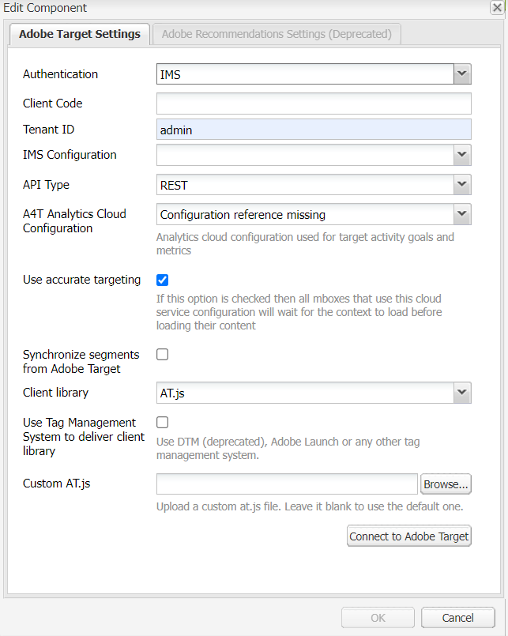
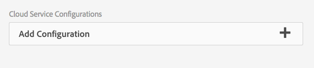

# 手動設定與Adobe Target的整合 {#manually-configuring-the-integration-with-adobe-target}

您可以修改使用精靈時進行的選擇加入精靈設定，或手動與Adobe Target整合，而不使用精靈。

## 修改選擇加入精靈設定 {#modifying-the-opt-in-wizard-configurations}

此 [選擇加入精靈](/help/sites-administering/opt-in.md) 該 [整合AEM與Adobe Target](/help/sites-administering/target.md) 自動建立名為「布建的目標設定」的Target雲端設定。 精靈也會針對名為「布建的目標架構」的雲端組態建立Target架構。 您可以視需要修改雲端設定和框架的屬性。

您也可以透過設定A4T Analytics Cloud設定，將Adobe Target設定為使用Adobe Target作為目標定位內容的報表來源。

若要找到雲端設定和架構，請導覽至 **Cloud Service** via **工具** > **部署** > **雲端**. ([http://localhost:4502/libs/cq/core/content/tools/cloudservices.html](http://localhost:4502/libs/cq/core/content/tools/cloudservices.html))在Adobe Target下方，按一下或點選 **顯示設定**.

### 布建的目標組態特性 {#provisioned-target-configuration-properties}

以下屬性值用於選擇加入精靈建立的布建目標設定雲端設定中：

* **使用者端代碼：** 在選擇加入精靈中輸入。
* **電子郵件：** 在選擇加入精靈中輸入。
* **密碼：** 在選擇加入精靈中輸入。
* **api型別：** REST
* **從Adobe Target同步區段：** 已選取。

* **使用者端資源庫：** mbox.js.
* **使用DTM來提供使用者端資源庫：** 未選取。 選取此選項，如果 [使用DTM](/help/sites-administering/dtm.md) 或其他標籤管理系統，以託管mbox.js或AT.js檔案。 Adobe建議您使用DTM來傳送程式庫，而非AEM。

* **自訂mbox.js：** 未指定任何專案，因此會使用預設的mbox.js檔案。 視需要指定要使用的自訂mbox.js檔案。 只有在您已選取mbox.js時才會顯示。
* **自訂AT.js：** 未指定以便使用預設的AT.js檔案。 視需要指定要使用的自訂AT.js檔案。 只有在您已選取AT.js時才會顯示。

>[!NOTE]
>
>在AEM 6.3中，您可以選取Target資料庫檔案， [AT.JS](https://developer.adobe.com/target/implement/client-side/atjs/atjs-functions/mboxcreate-atjs/)，此元件為新的Adobe Target實作程式庫，專為典型Web實作和單頁應用程式而設計。
>
>AT.js對mbox.js資料庫提供數項改善專案：
>
>* 改善Web實施的頁面載入時間
>* 提升安全性
>* 單頁應用程式的更佳實作選項
>* AT.js包含target.js所包含的元件，因此不再需要呼叫target。

<!-- OLD URL WHICH IS 404 https://experienceleague.adobe.com/docs/target/using/implement-target/client-side/mbox-implement/mbox-download.html -->

### 布建的目標框架特性 {#provisioned-target-framework-properties}

選擇加入精靈建立的布建目標架構已設定為從設定檔資料存放區傳送內容資料。 預設會將存放區的年齡和性別資料專案傳送至Target。 您的解決方案可能需要額外的引數才能傳送。


您可以設定架構以傳送其他內容資訊至Target，如所述 [新增Target框架](/help/sites-administering/target-configuring.md#adding-a-target-framework).

### 設定A4T Analytics Cloud設定 {#configuring-a-t-analytics-cloud-configuration}

您可以設定Adobe Target在鎖定目標內容時，使用Adobe Analytics作為報表來源。

>[!NOTE]
>
>使用者認證驗證（舊版）無法搭配A4T使用（適用於Target和Analytics）。 因此，客戶應使用IMS驗證，而非使用者認證驗證。

若要這麼做，您必須指定要將您的Adobe Target雲端設定連線到的A4T雲端設定：

1. 瀏覽至 **Cloud Service** 透過 **AEM標誌** > **工具** > **部署** > **Cloud Service**.
1. 在 **Adobe Target** 區段，按一下 **立即設定**.
1. 重新連線至您的Adobe Target設定。
1. 在 **A4T Analytics Cloud設定** 下拉式功能表，選取架構。

   >[!NOTE]
   >
   >只有啟用A4T的Analytics設定才可使用。
   >
   >使用AEM設定A4T時，您可能會看到遺漏專案的「設定」參照。 若要選取分析框架，請執行下列動作：
   >
   >1. 瀏覽至 **工具** > **一般** > **CRXDE Lite**.
   1. 導覽至 [A4T分析設定對話方塊](#a4t-analytics-config-dialog) （請參閱下文）
   1. 設定屬性 **disable** 至 **false**.
   1. 點選或按一下 **全部儲存**.

#### A4T分析設定對話方塊 {#a4t-analytics-config-dialog}

```xml
/libs/cq/analytics/components/testandtargetpage/dialog/items/tabs/items/tab1_general/items/a4tAnalyticsConfig
```



按一下&#x200B;**「確定」**。使用Adobe Target鎖定內容時，您可以 [選取您的報表來源](/help/sites-authoring/content-targeting-touch.md).

## 手動與Adobe Target整合 {#manually-integrating-with-adobe-target}

手動與Adobe Target整合，而不使用選擇加入精靈。

>[!NOTE]
>
Target程式庫檔案， [AT.JS](https://developer.adobe.com/target/implement/client-side/atjs/atjs-functions/mboxcreate-atjs/)是新的Adobe Target實作程式庫，專為典型Web實作和單頁應用程式而設計。 Adobe建議您使用AT.js而非mbox.js作為使用者端資料庫。
>
AT.js對mbox.js資料庫提供數項改善專案：
>
* 改善Web實施的頁面載入時間
* 提升安全性
* 單頁應用程式的更佳實作選項
* AT.js包含target.js所包含的元件，因此不再需要呼叫target.js
>
您可以選取「 」中的AT.js或mbox.js **客戶庫** 下拉式功能表。

<!-- OLD URL from above was 404 https://experienceleague.adobe.com/docs/target/using/implement-target/client-side/mbox-implement/mbox-download.html -->

### 建立Target雲端設定 {#creating-a-target-cloud-configuration}

若要讓AEM與Adobe Target互動，請建立Target雲端設定。 若要建立設定，您必須提供Adobe Target使用者端代碼和使用者認證。

您只會建立一次Target雲端設定，因為您可以將此設定與多個AEM行銷活動建立關聯。 如果您有多個Adobe Target使用者端代碼，請為每個使用者端代碼建立一個設定。

您可以設定雲端設定，以從Adobe Target同步區段。 如果啟用同步，則儲存雲端設定時，會在背景從Target匯入區段。

使用以下程式，在AEM中建立Target雲端設定：

1. 瀏覽至 **Cloud Service** 透過 **AEM標誌** > **工具** > **Cloud Service** > **舊版Cloud Service**. ([http://localhost:4502/libs/cq/core/content/tools/cloudservices.html](http://localhost:4502/libs/cq/core/content/tools/cloudservices.html))

   此 **Cloud Service** 概觀頁面隨即開啟。

1. 在 **Adobe Target** 區段，按一下 **立即設定**.
1. 在 **建立設定** 對話方塊：

   1. 為設定提供 **標題**.
   1. 選取 **Adobe Target設定** 範本。
   1. 按一下&#x200B;**建立**。

   編輯對話方塊隨即開啟。

   

   >[!NOTE]
   >
   使用AEM設定A4T時，您可能會看到遺漏專案的「設定」參照。 若要選取分析框架，請執行下列動作：
   >
   1. 瀏覽至 **工具** > **一般** > **CRXDE Lite**.
   1. 瀏覽至 **/libs/cq/analytics/components/testandtargetpage/dialog/items/tables/items/tab1_general/items/a4tAnalyticsConfig**
   1. 設定屬性 **disable** 至 **false**.
   1. 點選或按一下 **全部儲存**.

1. 在對話方塊中，提供這些屬性的值。

   * **使用者端代碼**：Target帳戶使用者端代碼
   * **電子郵件**：Target帳戶電子郵件。
   * **密碼**：Target帳戶密碼。
   * **API型別**：REST或XML
   * **A4T Analytics Cloud設定**：選取用於鎖定活動目標和量度的Analytics Cloud設定。 如果您在鎖定目標內容時使用Adobe Analytics作為報表來源，則需要此設定。 如果沒有看見您的雲端設定，請參閱中的注意事項。 [設定A4T Analytics Cloud設定](#configuring-a-t-analytics-cloud-configuration).

   * **使用準確定位：** 依預設，會選取此核取方塊。 如果選取，雲端服務設定會等待內容載入後再載入內容。 請參閱下列備註。
   * **從Adobe Target同步區段：** 選取此選項，您就可以下載Target中定義的區段，以便在AEM中使用它們。 當「API型別」屬性為REST時，選取此選項，因為內嵌區段不受支援，且您必須使用Target中的區段。 ( AEM術語「區段」等同於Target「對象」。)
   * **使用者端資源庫：** 選取您想要使用mbox.js或AT.js使用者端資料庫。
   * **使用DTM來提供使用者端資源庫**  — 選取此選項，以從DTM或其他標籤管理系統使用AT.js或mbox.js。 設定 [DTM整合](/help/sites-administering/dtm.md) 以使用此選項。 Adobe建議您使用DTM來傳送程式庫，而非AEM。
   * **自訂mbox.js**：如果您已勾選DTM方塊或使用預設的mbox.js，請留空。 或者上傳您的自訂mbox.js。 只有在您已選取mbox.js時才會顯示。
   * **自訂AT.js**：如果您已勾選DTM方塊或使用預設的AT.js，請留空。 或者上傳您的自訂AT.js。 只有在您已選取AT.js時才會顯示。

   >[!NOTE]
   >
   依預設，當您選擇加入Adobe Target設定精靈時，會啟用「準確定位」 。
   >
   準確定位表示雲端服務設定會等待內容載入後再載入內容。 因此，就效能而言，準確定位可能會在載入內容前造成幾毫秒的延遲。
   >
   作者例項上一律會啟用「準確定位」 。 不過在發佈執行個體上，您可以清除雲端服務設定中「準確定位」旁的核取記號，來選擇全域關閉準確定位(**http://localhost:4502/etc/cloudservices.html**)。 無論您在雲端服務設定中的設定為何，您仍可開啟和關閉個別元件的準確定位。
   >
   如果您有 ***已經*** 已建立目標元件，而您變更此設定，您的變更不會影響這些元件。 直接變更這些元件。

1. 按一下 **連線到目標** 以初始化與Target的連線。 如果連線成功，則訊息會顯示 **連線成功** 隨即顯示。 按一下 **確定** 在訊息上，然後 **確定** 在對話方塊上。

   如果您無法連線至Target，請參閱 [疑難排解](/help/sites-administering/target-configuring.md#troubleshooting-target-connection-problems) 區段。

### 新增Target框架 {#adding-a-target-framework}

設定Target雲端設定後，請新增Target框架。 此架構會識別從可用傳送至Adobe Target的預設引數 [使用者端內容](/help/sites-administering/client-context.md) 或 [ContextHub](/help/sites-developing/ch-configuring.md) 元件。 Target會使用引數來決定套用至目前內容的區段。

您可以為單一Target設定建立多個架構。 當您必須為網站的不同區段傳送一組不同的引數至Target時，多個架構會很有用。 為您傳送的每組引數建立框架。 將網站的每個區段與適當的架構建立關聯。 一個網頁一次只能使用一個框架。

1. 在Target設定頁面上，按一下 **+** （加號）並列於「可用架構」旁。
1. 在「建立架構」對話方塊中，指定 **標題**，選取 **Adobe Target框架**，然後按一下 **建立**.

   

   框架頁面隨即開啟。 Sidekick提供的元件代表來自 [使用者端內容](/help/sites-administering/client-context.md) 或 [ContextHub](/help/sites-developing/ch-configuring.md) 可以對映的專案。

   

1. 將代表您要用來對應之資料的「從屬端內容」元件拖曳至放置目標。 或者，拖曳&#x200B;**ContextHub存放區** 元件至框架。

   >[!NOTE]
   >
   對應時，引數會透過簡單字串傳遞至mbox。 您無法從ContextHub對應陣列。

   例如，若要使用 **設定檔資料** 關於控制您的Target促銷活動的網站訪客，請拖曳 **設定檔資料** 元件至頁面。 可用於對應至Target引數的設定檔資料變數隨即顯示。

   

1. 選取您要對Adobe Target系統可見的變數，方法是選取 **共用** 核取方塊。

   

   >[!NOTE]
   >
   同步引數是唯一方式 — 從AEM到Adobe Target。

您的框架隨即建立。 若要將框架復寫至發佈執行個體，請使用 **啟動框架** Sidekick中的選項。

### 將活動與Target雲端設定建立關聯  {#associating-activities-with-the-target-cloud-configuration}

建立您的關聯 [AEM活動](/help/sites-authoring/activitylib.md) 雲端設定，方便您映象活動 [Adobe Target](https://experienceleague.adobe.com/docs/target/using/experiences/offers/manage-content.html).

>[!NOTE]
>
可用的活動型別由以下因素決定：
>
>
* 如果 **xt_only** 在AEM端使用的Adobe Target租使用者(clientcode)上啟用選項以連線至Adobe Target，然後您可以建立 **僅限** AEM XT活動。
>
* 如果 **xt_only** 選項為 **非** 已在Adobe Target租使用者(clientcode)上啟用，然後您可以建立 **兩者** AEM中的XT和A/B活動。
>
**其他附註：** **xt_only** 選項是套用於特定Target租使用者(clientcode)的設定，且只能在Adobe Target中直接修改。 您無法在AEM中啟用或停用此選項。

### 將Target框架與您的網站建立關聯 {#associating-the-target-framework-with-your-site}

在AEM中建立Target架構後，請將您的網頁與該架構建立關聯。 頁面上的目標元件會將框架定義的資料傳送至Adobe Target進行追蹤。 (請參閱 [內容目標定位](/help/sites-authoring/content-targeting-touch.md).)

將頁面與框架建立關聯時，子頁面會繼承關聯。

1. 在 **網站** 主控台，導覽至您要設定的網站。
1. 使用 [快速動作](/help/sites-authoring/basic-handling.md#quick-actions) 或 [選擇模式](/help/sites-authoring/basic-handling.md)，選取 **檢視屬性。**
1. 選取 **Cloud Service** 標籤。
1. 點選/按一下 **編輯**.
1. 點選/按一下 **新增設定** 在 **Cloud Service設定** 並選取 **Adobe Target**.

   

1. 選取您想要的架構，在 **設定參考**.

   >[!NOTE]
   >
   請務必選取 **框架** 不是您建立的Target雲端設定，而是在其中建立雲端設定。

1. 點選/按一下 **完成**.
1. 啟動網站的根頁面，以便將其復寫至發佈伺服器。 (請參閱 [如何發佈頁面](/help/sites-authoring/publishing-pages.md).)

   >[!NOTE]
   >
   如果您附加至頁面的框架尚未啟動，則會開啟精靈，供您一併發佈。

## 疑難排解Target連線問題 {#troubleshooting-target-connection-problems}

若要疑難排解連線至Target時發生的問題，您可以執行下列工作：

* 請確定您提供的使用者認證正確無誤。
* 請確定AEM執行個體可以連線至Target伺服器。 例如，請確定防火牆規則未封鎖傳出AEM連線，或將AEM設定為使用必要的代理。
* 在AEM錯誤記錄檔中尋找有用的訊息。 error.log檔案位於 **crx-quickstart/logs** 安裝AEM的目錄。
* 在Adobe Target中編輯活動時，URL會指向localhost。 將AEM Externalizer設定為正確的URL，以解決此問題。
