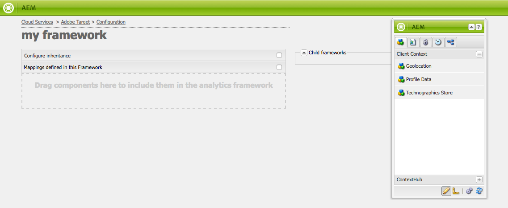

# 手動設定與Adobe Target的整合 {#manually-configuring-the-integration-with-adobe-target}

您可以修改使用精靈時所做的選擇加入精靈設定，或無需使用精靈即可手動與Adobe Target整合。

## 修改選擇加入精靈設定 {#modifying-the-opt-in-wizard-configurations}

此 [選擇加入精靈](/help/sites-administering/opt-in.md) the [整合AEM與Adobe Target](/help/sites-administering/target.md) 自動建立名為「已布建的目標設定」的Target雲端設定。 精靈也會為名為布建的目標架構的雲端設定建立Target架構。 如有必要，您可以修改雲配置和框架的屬性。

您也可以透過設定A4T Adobe Target設定，將Adobe Target設為目標定位內容時的報表來源。

若要找到雲端設定和架構，請導覽至 **Cloud Services** via **工具** > **部署** > **雲**. ([http://localhost:4502/libs/cq/core/content/tools/cloudservices.html](http://localhost:4502/libs/cq/core/content/tools/cloudservices.html))在Adobe Target下方，按一下或點選 **顯示配置**.

### 已布建的Target配置屬性 {#provisioned-target-configuration-properties}

下列屬性值用於「選擇加入」精靈建立的「已布建的目標設定」雲端設定中：

* **用戶端代碼：** 在選擇加入精靈中輸入。
* **電子郵件：** 在選擇加入精靈中輸入。
* **密碼：** 在選擇加入精靈中輸入。
* **API類型：** REST
* **從Adobe Target同步區段：** 已選取。

* **客戶端庫：** mbox.js。
* **使用DTM來傳送用戶端程式庫：** 未選取。 如果您 [使用DTM](/help/sites-administering/dtm.md) 或其他標籤管理系統來托管mbox.js或AT.js檔案。 Adobe建議您使用DTM(而非AEM)來傳送程式庫。

* **自訂mbox.js:** 未指定要使用預設mbox.js檔案。 視需要指定您要使用的自訂mbox.js檔案。 只有在您已選取mbox.js時才會顯示。
* **自訂AT.js:** 未指定以使用預設AT.js檔案。 視需要指定您要使用的自訂AT.js檔案。 只有在您已選取AT.js時才會顯示。

>[!NOTE]
>
>在AEM 6.3中，您可以選取Target資料庫檔案， [AT.JS](https://developer.adobe.com/target/implement/client-side/atjs/atjs-functions/mboxcreate-atjs/)，此元件為新的Adobe Target實作程式庫，專為典型Web實作和單頁應用程式而設計。
>
>AT.js提供幾項優於mbox.js資料庫的改善：
>
>* 改善Web實作的頁面載入時間
>* 提高安全性
>* 更適合單頁應用程式的實作選項
>* AT.js包含target.js中包含的元件，因此不再需要呼叫target。


<!-- OLD URL WHICH IS 404 https://experienceleague.adobe.com/docs/target/using/implement-target/client-side/mbox-implement/mbox-download.html -->

### 布建的Target框架屬性 {#provisioned-target-framework-properties}

選擇加入精靈建立的已布建Target架構已設定為從設定檔資料存放區傳送內容資料。 依預設，會將存放區的年齡和性別資料項目傳送至Target。 您的解決方案可能需要傳送其他參數。


您可以設定框架以傳送其他內容資訊至Target，如 [新增Target架構](/help/sites-administering/target-configuring.md#adding-a-target-framework).

### 設定A4T Analytics Cloud設定 {#configuring-a-t-analytics-cloud-configuration}

您可以設定Adobe Target，以在鎖定目標內容時使用Adobe Analytics作為報表來源。

>[!NOTE]
>
>使用者憑證驗證（舊版）無法用於A4T（適用於Target和Analytics）。 因此，客戶應使用IMS驗證，而非使用者憑證驗證。

若要這麼做，您需指定要使用下列項目連線Adobe Target雲端設定的A4T雲端設定：

1. 導覽至 **Cloud Services** 透過 **AEM標誌** > **工具** > **部署** > **Cloud Services**.
1. 在 **Adobe Target** ，按一下 **立即配置**.
1. 重新連線至您的Adobe Target設定。
1. 在 **A4T Analytics Cloud設定** 下拉式功能表中，選取架構。

   >[!NOTE]
   >
   >僅適用為A4T啟用的分析設定。
   >
   >使用AEM設定A4T時，您可能會看到「設定參考」遺失項目。 若要選取分析架構，請執行下列動作：
   >
   >1. 導覽至 **工具** > **一般** > **CRXDE Lite**.
   1. 導覽至 [A4T Analytics設定對話方塊](#a4t-analytics-config-dialog) （請參閱下文）
   1. 設定屬性 **disable** to **false**.
   1. 點選或按一下 **全部儲存**.


#### A4T Analytics設定對話方塊 {#a4t-analytics-config-dialog}

```xml
/libs/cq/analytics/components/testandtargetpage/dialog/items/tabs/items/tab1_general/items/a4tAnalyticsConfig
```


按一下&#x200B;**「確定」**。使用Adobe Target鎖定內容時，您可以 [選擇報表來源](/help/sites-authoring/content-targeting-touch.md).

## 手動與Adobe Target整合 {#manually-integrating-with-adobe-target}

手動與Adobe Target整合，而非使用選擇加入精靈。

>[!NOTE]
目標庫檔案， [AT.JS](https://developer.adobe.com/target/implement/client-side/atjs/atjs-functions/mboxcreate-atjs/)，是新的Adobe Target實作程式庫，專為典型Web實作和單頁應用程式而設計。 Adobe建議您使用AT.js（而非mbox.js）作為用戶端程式庫。
AT.js提供幾項優於mbox.js資料庫的改善：
* 改善Web實作的頁面載入時間
* 提高安全性
* 更適合單頁應用程式的實作選項
* AT.js包含target.js中包含的元件，因此不再需要呼叫target.js
>
您可以在 **用戶端程式庫** 下拉式功能表。

<!-- OLD URL from above was 404 https://experienceleague.adobe.com/docs/target/using/implement-target/client-side/mbox-implement/mbox-download.html -->

### 建立Target雲端設定 {#creating-a-target-cloud-configuration}

若要讓AEM與Adobe Target互動，請建立Target雲端設定。 若要建立設定，請提供Adobe Target用戶端代碼和使用者憑證。

您只需建立Target雲端設定一次，因為您可以將設定與多個AEM促銷活動建立關聯。 如果您有數個Adobe Target用戶端代碼，請為每個用戶端代碼建立一個設定。

您可以設定雲端設定，以從Adobe Target同步區段。 如果啟用同步，儲存雲端設定時，會從背景的Target匯入區段。

請依照下列步驟，在AEM中建立Target雲端設定：

1. 導覽至 **Cloud Services** 透過 **AEM標誌** > **工具** > **Cloud Services** > **舊版Cloud Services**. ([http://localhost:4502/libs/cq/core/content/tools/cloudservices.html](http://localhost:4502/libs/cq/core/content/tools/cloudservices.html))

   此 **Cloud Services** 概覽頁面隨即開啟。

1. 在 **Adobe Target** ，按一下 **立即配置**.
1. 在 **建立配置** 對話框：

   1. 為設定指定 **標題**.
   1. 選取 **Adobe Target設定** 範本。
   1. 按一下&#x200B;**建立**。

   編輯對話方塊隨即開啟。

   

   >[!NOTE]
   使用AEM設定A4T時，您可能會看到「設定參考」遺失項目。 若要選取分析架構，請執行下列動作：
   1. 導覽至 **工具** > **一般** > **CRXDE Lite**.
   1. 導覽至 **/libs/cq/analytics/components/testandtargetpage/dialog/items/tabs/items/tab1_general/items/a4tAnalyticsConfig**
   1. 設定屬性 **disable** to **false**.
   1. 點選或按一下 **全部儲存**.


1. 在對話方塊中，提供這些屬性的值。

   * **用戶端代碼**:目標帳戶客戶端代碼
   * **電子郵件**:目標帳戶電子郵件。
   * **密碼**:目標帳戶密碼。
   * **API類型**:REST或XML
   * **A4T Analytics Cloud設定**:選取用於目標活動目標和量度的Analytics Cloud設定。 如果您在鎖定目標內容時使用Adobe Analytics作為報表來源，則需要此設定。 如果您沒有看見雲端設定，請參閱 [設定A4T Analytics Cloud設定](#configuring-a-t-analytics-cloud-configuration).

   * **使用準確的定位：** 依預設，此核取方塊會選取。 如果選取此選項，雲端服務設定會在載入內容前等待內容載入。 請參閱以下備注。
   * **從Adobe Target同步區段：** 選取此選項，您就可以下載在Target中定義的區段，以在AEM中使用。 當API類型屬性為REST時，請選取此選項，因為不支援內嵌區段，且您必須從Target使用區段。 (「區段」的AEM詞語等同於Target「對象」。)
   * **客戶端庫：** 選取您要mbox.js或AT.js用戶端程式庫。
   * **使用DTM來傳送用戶端程式庫**  — 選取此選項，以使用來自DTM或其他標籤管理系統的AT.js或mbox.js。 設定 [DTM整合](/help/sites-administering/dtm.md) 來使用此選項。 Adobe建議您使用DTM(而非AEM)來傳送程式庫。
   * **自訂mbox.js**:如果您勾選DTM方塊或使用預設的mbox.js，請保留空白。 或者，也可上傳您的自訂mbox.js。 只有在您已選取mbox.js時才會顯示。
   * **自訂AT.js**:如果您勾選DTM方塊或使用預設AT.js，請保留空白。 或者上傳自訂AT.js。 只有在您已選取AT.js時才會顯示。

   >[!NOTE]
   依預設，當您選擇加入Adobe Target設定精靈時，會啟用「精確鎖定目標」。
   準確鎖定目標表示雲端服務設定會在載入內容前等待內容載入。 因此，就效能而言，精確鎖定目標可能會在載入內容前造成毫秒的延遲。
   一律會在製作例項上啟用正確鎖定目標。 不過，在發佈執行個體上，您可以在雲端服務設定中清除「精確鎖定目標」旁的勾號，選擇全域關閉精確鎖定目標(**http://localhost:4502/etc/cloudservices.html**)。 無論您在雲端服務設定中進行什麼設定，您仍可開啟或關閉個別元件的精確鎖定目標。
   若您有 ***已*** 已建立目標元件，而您變更此設定時，您所做的變更不會影響這些元件。 直接變更這些元件。

1. 按一下 **連線至Target** 初始化與Target的連線。 如果連線成功，則會顯示訊息 **連接成功** 的下界。 按一下 **確定** 在消息上，然後 **確定** 對話框。

   如果您無法連線至Target，請參閱 [疑難排解](/help/sites-administering/target-configuring.md#troubleshooting-target-connection-problems) 區段。

### 新增Target架構 {#adding-a-target-framework}

設定Target雲端設定後，新增Target架構。 此架構可識別從可用 [用戶端內容](/help/sites-administering/client-context.md) 或 [ContextHub](/help/sites-developing/ch-configuring.md) 元件。 Target使用參數來判斷要套用至目前內容的區段。

您可以為單一Target設定建立多個架構。 當您必須針對網站的不同區段傳送不同的一組參數至Target時，多個架構就十分實用。 為您傳送的每組參數建立架構。 將網站的每個區段與適當的架構建立關聯。 網頁一次只能使用一個架構。

1. 在您的Target設定頁面上，按一下 **+** 可用框架旁邊的（加號）。
1. 在「建立框架」對話框中，指定 **標題**，請選取 **Adobe Target架構**，然後按一下 **建立**.

   

   框架頁面隨即開啟。 Sidekick提供代表 [用戶端內容](/help/sites-administering/client-context.md) 或 [ContextHub](/help/sites-developing/ch-configuring.md) 你可以映射的。

   

1. 拖曳代表您要用於對應至放置目標的資料的用戶端內容元件。 或者，拖曳&#x200B;**ContextHub存放區** 構成部分。

   >[!NOTE]
   映射時，參數會透過簡單字串傳遞至mbox。 無法從ContextHub映射陣列。

   例如，若要使用 **設定檔資料** 關於您的網站訪客以控制您的Target促銷活動，請拖曳 **設定檔資料** 元件。 此時會顯示可用於對應至Target參數的設定檔資料變數。

   

1. 選取要讓Adobe Target系統可見的變數，方法是選取 **共用** 核取方塊。

   

   >[!NOTE]
   同步參數只是一種方式 — 從AEM到Adobe Target。

已建立您的架構。 若要將架構複製到發佈執行個體，請使用 **啟動框架** 選項。

### 將活動與Target雲端設定關聯  {#associating-activities-with-the-target-cloud-configuration}

關聯您的 [AEM活動](/help/sites-authoring/activitylib.md) 搭配您的Target雲端設定，以便鏡射 [Adobe Target](https://experienceleague.adobe.com/docs/target/using/experiences/offers/manage-content.html).

>[!NOTE]
可用的活動類型由下列項目決定：
* 若 **xt_only** 選項(在AEM端使用的Adobe Target租用戶(clientcode)上啟用)以連線至Adobe Target，然後您可以建立 **僅限** AEM中的XT活動。
* 若 **xt_only** 選項 **not** 在Adobe Target租用戶(clientcode)上啟用，則您可以建立 **both** AEM中的XT和A/B活動。
>
**其他附註：** **xt_only** 選項是套用於特定Target租用戶(clientcode)的設定，且只能在Adobe Target中直接修改。 您無法在AEM中啟用或停用此選項。

### 將Target架構與您的網站相關聯 {#associating-the-target-framework-with-your-site}

在AEM中建立Target架構後，請將網頁與架構建立關聯。 頁面上的目標元件會將架構定義的資料傳送至Adobe Target以進行追蹤。 (請參閱 [內容鎖定](/help/sites-authoring/content-targeting-touch.md).)

將頁面與框架關聯時，子頁面將繼承關聯。

1. 在 **網站** 控制台，導覽至您要設定的網站。
1. 使用 [快速動作](/help/sites-authoring/basic-handling.md#quick-actions) 或 [選擇模式](/help/sites-authoring/basic-handling.md)，選取 **查看屬性。**
1. 選取 **Cloud Services** 標籤。
1. 點選/按一下 **編輯**.
1. 點選/按一下 **新增設定** 在 **Cloud Service配置** 選取 **Adobe Target**.

   

1. 選取您要的架構 **配置參考**.

   >[!NOTE]
   請務必選取特定 **框架** 建立的Target雲端組態，而非建立該組態時所依據的Target雲端組態。

1. 點選/按一下 **完成**.
1. 啟動網站的根頁面，以便將其複製到發佈伺服器。 (請參閱 [如何發佈頁面](/help/sites-authoring/publishing-pages.md).)

   >[!NOTE]
   如果您附加至頁面的架構尚未啟動，便會開啟精靈，供您發佈。

## 疑難排解Target連線問題 {#troubleshooting-target-connection-problems}

若要疑難排解連線至Target時發生的問題，您可以執行下列工作：

* 請確定您提供的使用者憑證正確無誤。
* 請確定AEM例項可以連線至Target伺服器。 例如，請確定防火牆規則未封鎖傳出AEM連線，或AEM已設定為使用必要的proxy。
* 在AEM錯誤記錄中尋找實用的訊息。 error.log檔案位於 **crx-quickstart/logs** 安裝AEM的目錄。
* 在Adobe Target中編輯活動時，URL會指向localhost。 請將AEM Externalizer設為正確的URL，以解決這項了解。
