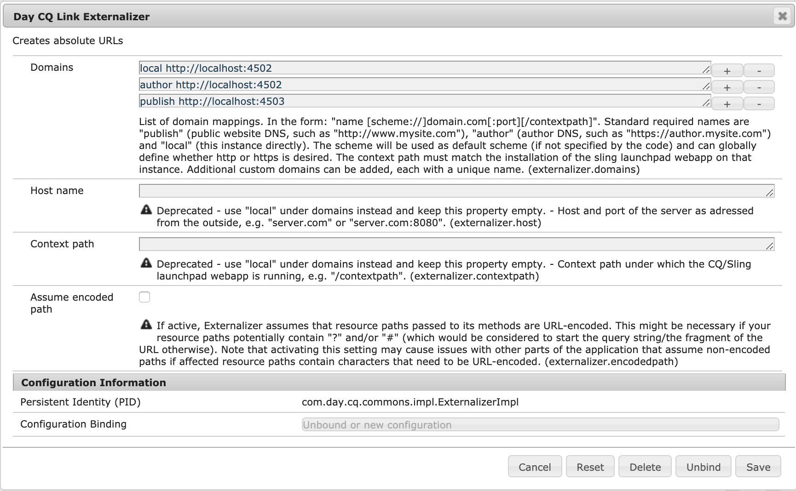

# 與Adobe target整合的先決條件{#prerequisites-for-integrating-with-adobe-target}

在整合AEM [和Adobe Target時](/help/sites-administering/target.md)，您必須向Adobe Target註冊、設定複製代理，以及在發佈節點上保護活動設定。

## 向Adobe Target註冊 {#registering-with-adobe-target}

若要將AEM與Adobe Target整合，您必須擁有有效的Adobe Target帳戶。 此帳戶至少必 **須具有** 核准者層級權限。 當您向Adobe Target註冊時，會收到用戶端代碼。 您需要用戶端程式碼和Adobe target登入名稱及密碼，才能將AEM連接至Adobe Target。

「用戶端代碼」會在呼叫Adobe target伺服器時識別Adobe target客戶帳戶。

>[!NOTE]
>
>您的帳戶也必須由Target團隊啟用，才能使用整合。
>
>
>如果不是這樣，請聯絡 [Adobe Target客戶服務](https://marketing.adobe.com/resources/help/en_US/target/target/r_problem.html)。

## 啟用目標複製代理 {#enabling-the-target-replication-agent}

必須在作者實 [例上啟用](/help/sites-deploying/replication.md) 「測試」和「目標」複製代理。 請注意，如果您使用nosamplecontent執行模式來安裝AEM, [此複製代理預設不會啟用](/help/sites-deploying/configure-runmodes.md#using-samplecontent-and-nosamplecontent) 。 如需有關保護生產環境的詳細資訊，請參閱安全性 [檢查清單](/help/sites-administering/security-checklist.md)。

1. 在AEM首頁上，按一下或點選「工 **具** >部 **署** > **複製**」。
1. 按一下或點選「 **Agents On Author」（作者上的代理）**。
1. 按一下或點選 **Test and Target(test and target)複製代理** ，然後按一下或點選 **編輯**。
1. 選擇「Enabled（啟用）」選項，然後按一下或點選「 **OK（確定）**」。

   >[!NOTE]
   >
   >配置Test和Target複製代理時，在 **Transport** （傳輸）頁籤中，URI預設設定為 **tnt:///**。 請勿將此URI取代為 **https://admin.testandtarget.omniture.com**。
   >
   >請注意，如果您嘗試使用tnt:///測試連 **線**，會擲回錯誤。 這是預期行為，因為此URI僅供內部使用，不應與測試連 **接一起使用**。

## 保護活動設定節點 {#securing-the-activity-settings-node}

您必須保護發佈例項上的活動設 **定節點cq:ActivitySettings** ，如此一般使用者便無法存取它。 處理Adobe Target活動同步的服務只能訪問活動設定節點。

**在** CRXDE lite中，活動jcr:content節點下的`/content/campaigns/*nameofbrand*` *下，可 **&#x200B;以使用cq:ActivitySettings節點；*例如 `/content/campaign/we-retail/master/myactivity/jcr:content/cq:ActivitySettings`。 此節點僅在您定位元件後建立。

活 **** 動jcr:content下方的cq:ActivitySettings節點受以下ACL的保護：

* 拒絕所有人
* 允許jcr:read,rep:write for &quot;target-activity-authors&quot;（author是此群組的成員，立即可用）
* 允許jcr:read,rep:write for &quot;targetservice&quot;

這些設定可確保普通用戶沒有對節點屬性的訪問權限。 對作者和發佈使用相同的ACL。 如需詳 [細資訊，請參閱使用者管理](/help/sites-administering/security.md) 與安全性。

## 設定AEM Link Externalizer {#configuring-the-aem-link-externalizer}

在Adobe target中編輯活動時，URL會指向 **localhost** ，除非您變更AEM作者節點上的URL。 如果您想要匯出的內容指向特定的發佈網域，可以設定「AEM Link Externalizer ** 」。

>[!NOTE]
>
>另請參閱 [新增雲端設定](/help/sites-administering/experience-fragments-target.md#add-the-cloud-configuration)。

若要設定AEM外部化：

>[!NOTE]
>
>如需詳細資訊，請參 [閱「外部化URL](/help/sites-developing/externalizer.md)」。

1. 導覽至OSGi web主控台(位 **於https://&lt;server>:&lt;port>/system/console/configMgr)。**
1. 尋找 **Day CQ Link Externalizer** ，然後輸入作者節點的網域。

   

