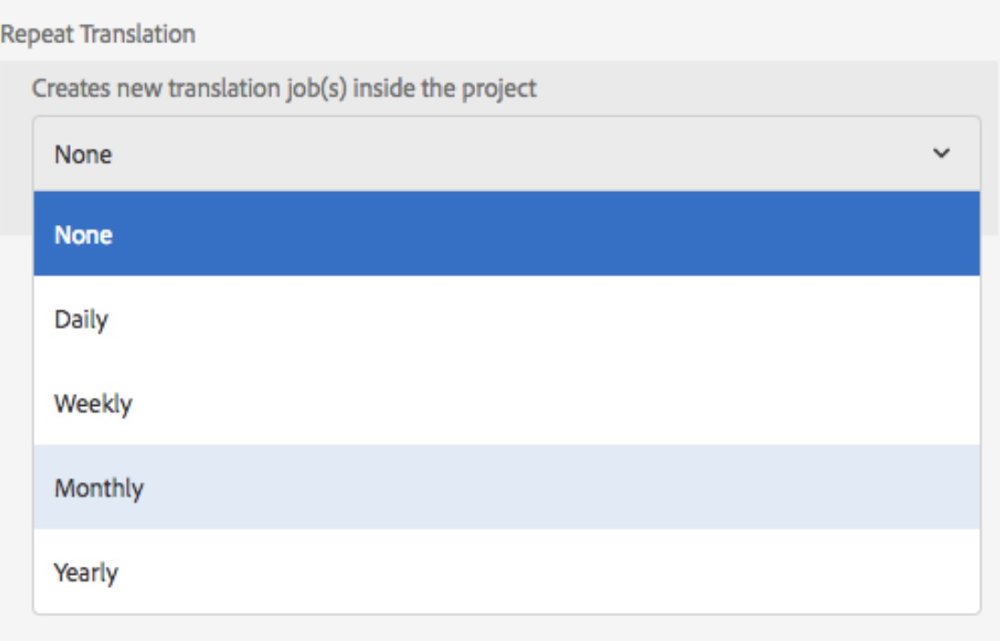
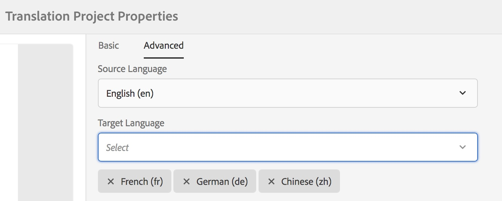

# 翻譯增強功能{#translation-enhancements}

本頁介紹AEM翻譯管理功能的增量增強和細分。

## 翻譯項目自動化{#translation-project-automation}

已新增可改善翻譯專案生產力的選項，例如自動提升和刪除翻譯啟動，以及排程翻譯專案的循環執行。

1. 在翻譯專案中，按一下或點選&#x200B;**翻譯摘要**&#x200B;圖磚底部的刪節號。

   

1. 切換至&#x200B;**Advanced**&#x200B;頁簽。 在底部，您可以選取&#x200B;**自動促銷翻譯啟動**。

   

1. 您可以選擇在收到翻譯內容後，是否應自動升級和刪除翻譯啟動。

   

1. 要選擇翻譯項目的循環執行，請在&#x200B;**Repeat Translation**&#x200B;下選擇帶下拉式清單的頻率。 循環項目執行將在指定時間間隔內自動建立和執行翻譯作業。

   

## 多語言翻譯專案{#multilingual-translation-projects}

可以在翻譯專案中設定多種目標語言，以減少建立的翻譯專案總數。

1. 在您的翻譯專案中，按一下或點選&#x200B;**翻譯摘要**&#x200B;方塊底部的點。

   

1. 切換至&#x200B;**Advanced**&#x200B;頁簽。 您可以在&#x200B;**目標語言**&#x200B;下新增多種語言。

   

1. 或者，如果要通過「站點」中的「參考」邊欄啟動翻譯，請添加語言並選擇&#x200B;**「建立多語言翻譯項目」**。

   

1. 系統會在專案中針對每種目標語言建立翻譯工作。 您可以在專案內逐一啟動，或透過在「專案管理員」中全域執行專案，一次一次啟動。

   

## 翻譯記憶體更新{#translation-memory-updates}

翻譯內容的手動編輯可以同步回翻譯管理系統(TMS)以訓練其翻譯記憶體。

1. 從Sites控制台中，在更新翻譯頁面中的文本內容後，選擇&#x200B;**更新翻譯記憶體**。

   

1. 清單視圖會並排顯示源的比較，以及已編輯的每個文本元件的翻譯。 選擇應同步到翻譯記憶體的翻譯更新，然後選擇&#x200B;**更新記憶體**。

   

   >[!NOTE]
   >
   >AEM會將選取的字串傳回翻譯管理系統。

## 多級語言副本{#language-copies-on-multiple-levels}

現在，語言根可以分組在節點下，例如按區域分組，同時仍被識別為語言副本的根。

>[!CAUTION]
>
>只允許一個級別。 例如，下列項目不允許「es」頁面解析為語言副本：
>
>* `/content/we-retail/language-masters/en`
>* `/content/we-retail/language-masters/americas/central-america/es`

>
>
此`es`語言副本將不被檢測，因為它是離`en`節點2個級別（美洲/中美洲）。

>[!NOTE]
>
>語言根可以有任何頁面名稱，而不只是語言的ISO代碼。 AEM一律會先檢查路徑和名稱，但如果頁面名稱未識別語言，AEM會檢查頁面的cq:language屬性以識別語言。

## 翻譯狀態報告{#translation-status-reporting}

現在可以在「網站」清單檢視中選取屬性，顯示頁面是已翻譯、正在翻譯或尚未翻譯。 若要顯示：

1. 在Sites中，切換到&#x200B;**清單視圖。**

   

1. 按一下或點選「**檢視設定**」。

   

1. 勾選&#x200B;**Translation**&#x200B;下方的「已翻譯&#x200B;**」核取方塊，然後點選/按一下** Update **。**

   

您現在可以看到&#x200B;**Translated**&#x200B;欄，其中顯示頁面的翻譯狀態。

