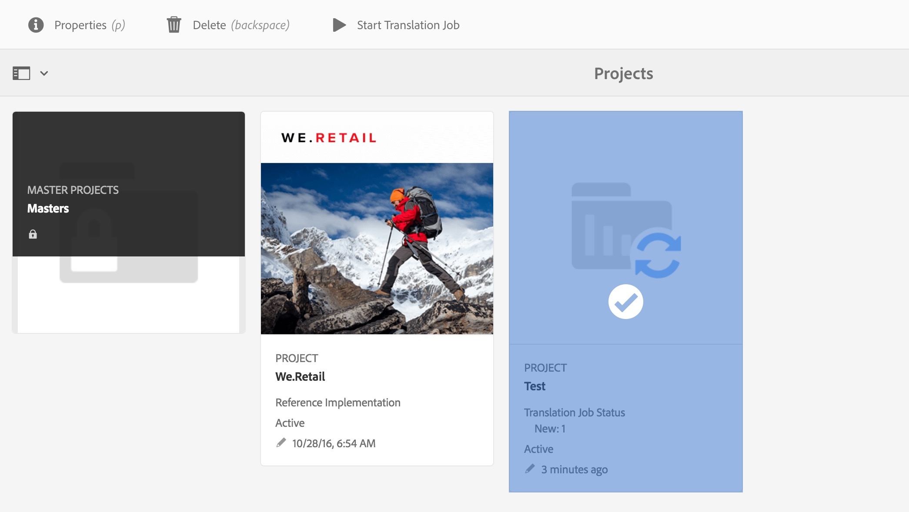
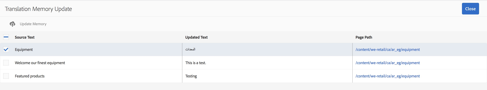

# 翻譯增強功能{#translation-enhancements}

本頁介紹翻譯管理功能的增量AEM增強和改進。

## 翻譯項目自動化{#translation-project-automation}

已添加了一些選項，用於提高翻譯項目的工作效率，例如自動升級和刪除翻譯啟動，以及計畫翻譯項目的循環執行。

1. 在翻譯項目中，按一下或點選&#x200B;**翻譯摘要**&#x200B;表徵圖底部的省略號。

   

1. 切換至&#x200B;**Advanced**&#x200B;標籤。 在底部，可以選擇&#x200B;**自動升級翻譯啟動**。

   

1. 或者，您可以選擇是否在收到翻譯內容後，翻譯啟動應該自動升級和刪除。

   

1. 要選擇翻譯項目的循環執行，請在&#x200B;**Repeat Translation**&#x200B;下選擇帶有下拉式菜單的頻率。 循環項目執行將自動在指定的時間間隔內建立和執行翻譯作業。

   

## 多語言翻譯項目{#multilingual-translation-projects}

可以在翻譯項目中配置多種目標語言，以減少建立的翻譯項目總數。

1. 在翻譯項目中，按一下或點選&#x200B;**翻譯摘要**&#x200B;表徵圖底部的點。

   

1. 切換至&#x200B;**Advanced**&#x200B;標籤。 您可以在&#x200B;**Target Language**&#x200B;下新增多種語言。

   

1. 或者，如果要通過Sites中的引用邊欄啟動翻譯，請添加語言並選擇&#x200B;**建立多語言翻譯項目**。

   

1. 將在項目中為每個目標語言建立翻譯作業。 您可以在專案中逐個啟動專案，或在專案管理員中全域執行專案，一次啟動專案。

   

## 翻譯庫更新{#translation-memory-updates}

翻譯內容的手動編輯可以同步回翻譯管理系統(TMS)以訓練其翻譯記憶庫。

1. 在站點控制台中，在更新翻譯頁面中的文本內容後，選擇&#x200B;**更新翻譯庫**。

   

1. 清單檢視會並排顯示所編輯之每個文字元件的來源與翻譯比較。 選擇哪些翻譯更新應與翻譯庫同步，然後選擇&#x200B;**更新記憶體**。

   

   >[!NOTE]
   >
   >將AEM選定的字串發回翻譯管理系統。

## 多級語言副本{#language-copies-on-multiple-levels}

現在，語言根可以分組到節點下，例如按區域分組，同時仍被識別為語言副本的根。

>[!CAUTION]
>
>僅允許一個級別。 例如，下列項目不允許「es」頁面解析為語言副本：
>
>* `/content/we-retail/language-masters/en`
>* `/content/we-retail/language-masters/americas/central-america/es`

>
>
此`es`語言副本將不會被檢測到，因為它是2級（美洲／中美洲），遠離`en`節點。

>[!NOTE]
>
>語言根目錄可以有任何頁面名稱，而不只是語言的ISO程式碼。 AEM一律會先檢查路徑和名稱，但如果頁面名稱未識別語言，AEM則會檢查頁面的cq:language屬性以識別語言。

## 翻譯狀態報告{#translation-status-reporting}

現在，您可以在「網站」清單檢視中選取屬性，顯示頁面是否已翻譯、正在翻譯或尚未翻譯。 若要顯示：

1. 在站點中，切換到&#x200B;**清單視圖。**

   

1. 按一下或點選&#x200B;**查看設定**。

   

1. 選中&#x200B;**Translation**&#x200B;下的&#x200B;**Translated**&#x200B;複選框，然後點選／按一下&#x200B;**Update**。

   

您現在可以看到&#x200B;**Translated**&#x200B;欄，顯示頁面的翻譯狀態。

