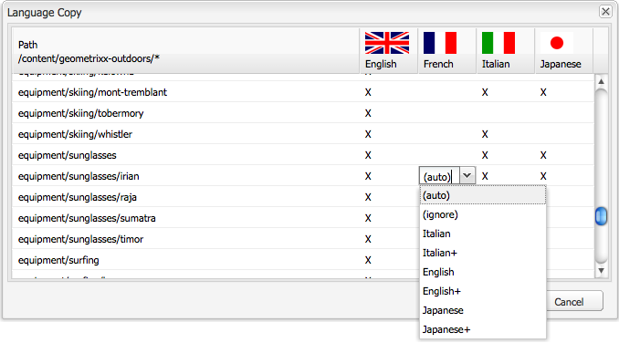

# 使用傳統UI建立語言根{#creating-a-language-root-using-the-classic-ui}

下列程式使用傳統UI來建立網站的語言根目錄。 如需詳細資訊，請參閱 [建立語言根](/help/sites-administering/tc-prep.md#creating-a-language-root).

1. 在網站控制台的網站樹中，選擇網站的根頁面。 ([http://localhost:4502/siteadmin#](http://localhost:4502/siteadmin#))
1. 新增代表網站語言版本的新子頁面：

   1. 按一下「新增>新增頁面」。
   1. 在對話方塊中，指定標題和名稱。 名稱的格式必須為 `<language-code>` 或 `<language-code>_<country-code>`，例如en_US、en_us、en_GB、en_gb。

      * 支援的語言代碼為小寫，由ISO-639-1定義的雙字母代碼
      * 支援的國家/地區代碼為小寫或大寫，由ISO 3166定義，為雙字母代碼
   1. 選取範本，然後按一下建立。

   

1. 在網站控制台的網站樹中，選擇網站的根頁面。
1. 在「工具」菜單中，選擇「語言副本」。

   

   「語言副本」對話框顯示可用語言版本和網頁的矩陣。 語言欄中的x表示該頁面可使用該語言。

   

1. 若要將現有頁面或頁面樹複製到語言版本，請在語言欄中為該頁面選取儲存格。 按一下箭頭並選取要建立的復本類型。

   在以下示例中，設備/太陽鏡/irian頁被複製到法文版本。

   

   | 語言副本的類型 | 說明 |
   |---|---|
   | auto | 使用上層頁面的行為 |
   | 忽略 | 不會建立此頁面及其子項的副本 |
   | `<language>+` （例如法文+） | 從該語言複製頁面及其所有子項 |
   | `<language>` （例如法文） | 僅複製該語言中的頁面 |

1. 按一下「確定」以關閉對話方塊。
1. 在下一個對話方塊中，按一下「是」以確認復本。
