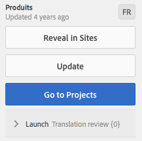

# 管理翻譯專案{#managing-translation-projects}

準備翻譯內容後，您需要通過建立缺少的語言副本來完成語言結構，並建立翻譯項目。

翻譯項目使您能夠管理內容的AEM翻譯。 翻譯項目是一AEM種 [項目](/help/sites-authoring/projects.md) 包含要翻譯成其他語言的資源。 這些資源是 [語言副本](/help/sites-administering/tc-prep.md) 從語言母版中建立。

將資源添加到翻譯項目時，將為其建立翻譯作業。 工作會提供相關命令和狀態資訊，您可用來管理在資源上執行的人工翻譯和機器翻譯工作流程。

>[!NOTE]
>
>翻譯項目可以包含多個翻譯作業。

翻譯項目是長期項目，由語言和翻譯方法/提供商定義，以與全球化的組織治理保持一致。 它們應在初始翻譯期間或手動啟動一次，並在整個內容和翻譯更新活動中保持有效。

翻譯項目和作業是使用翻譯準備工作流建立的。 這些工作流有三個選項，用於初始翻譯（建立和翻譯）和更新（更新翻譯）:

1. [建立新項目](#creating-translation-projects-using-the-references-panel)
1. [添加到現有項目](#adding-pages-to-a-translation-project)
1. [僅內容結構](#creating-the-structure-of-a-language-copy)

>[!NOTE]
>
>選項3與翻譯工作/項目無關。 它允許您將語言母版中的內容和結構更改複製到（未翻譯）語言副本。 您可以使用此功能保持語言主語的同步，即使不進行翻譯。

## 執行初始翻譯並更新現有翻譯 {#performing-initial-translations-and-updating-existing-translations}

檢測AEM是否正在為內容的初始翻譯建立翻譯項目，或是否更新已翻譯的語言副本。 當您為頁面建立翻譯項目並指明要翻譯的語言副本時，AEM將檢測源頁面是否已存在於目標語言副本中：

* **語言副本不包括頁面：** 將AEM此情況視為初始翻譯。 該頁面會立即複製到語言副本中，並包含在項目中。 將已翻譯的頁面導入AEM到AEM時，將其直接複製到語言副本。
* **語言副本已包含頁面：** 將AEM此情況視為更新的翻譯。 將建立啟動，並將頁面的副本添加到啟動中，並包括在項目中。 啟動使您能夠在將更新的翻譯提交到語言副本之前審閱該翻譯：

   * 將已翻譯的頁面導入AEM到時，會在啟動中覆蓋頁面。
   * 只有在升級啟動時，翻譯後的頁面才會覆蓋語言副本。

例如，為/content/geometrixx/en主語言的法文翻譯建立/content/geometrixx/fr語言根。 法文版中沒有其他頁面。

* 為/content/geometrixx/en/products頁面和所有子頁面建立翻譯項目，目標是法文語言副本。 由於語言副本不包括/content/geometrixx/fr/products頁，AEM因此會立即將/content/geometrixx/en/products頁和所有子頁複製到法語副本中。 這些副本也包含在翻譯項目中。
* 將為/content/geometrixx/en頁面和所有子頁面建立一個翻譯項目，目標是法文語言副本。 由於語言副本包含與/content/geometrixx/en頁（語言根）對應的頁，AEM因此會複製/content/geometrixx/en頁和所有子頁，並將它們添加到啟動中。 這些副本也包含在翻譯項目中。

## 使用「參照」面板建立翻譯項目 {#creating-translation-projects-using-the-references-panel}

建立翻譯項目，以便執行和管理翻譯語言母版資源的工作流。 在建立項目時，您可以在要翻譯的語言母版中指定頁面，以及要執行翻譯的語言副本：

* 與所選頁面關聯的翻譯整合框架的雲配置決定了翻譯項目的許多屬性，如要使用的翻譯工作流。
* 為所選的每個語言副本建立項目。
* 建立所選頁面和關聯資產的副本並將其添加到每個項目。 這些副本稍後將發送到翻譯提供商進行翻譯。

您可以指定所選頁面的子頁面也被選中。 在這種情況下，子頁面的副本也添加到每個項目中，以便翻譯。 當任何子頁都與不同的翻譯整合框架配置相關聯時，會創AEM建其他項目。

您也可以 [手動建立翻譯項目](#creating-a-translation-project-using-the-projects-console)。

>[!NOTE]
>
>要建立項目，您的帳戶必須是 `project-administrators` 組。

**初始翻譯和更新翻譯**

「引用」面板指示您是更新現有語言副本還是建立語言副本的第一版本。 當所選頁面存在語言副本時，「更新語言副本」頁籤將顯示為提供對與項目相關的命令的訪問權限。

翻譯後， [審閱翻譯](#reviewing-and-promoting-updated-content) 覆蓋語言副本。 如果所選頁面不存在語言副本，則「建立和翻譯」頁籤將顯示用於訪問與項目相關的命令。

### 為新語言副本建立翻譯項目 {#create-translation-projects-for-a-new-language-copy}

1. 使用「站點」控制台選擇要添加到翻譯項目的頁面。

   例如，要翻譯Geometrixx演示站點的英文頁面，請選擇Geometrixx演示站點>英文。

1. 在工具欄上，按一下或點擊「參照」(References)。

   

1. 選擇語言副本，然後選擇要翻譯其源頁的語言副本。
1. 按一下或點擊「建立和翻譯」，然後配置翻譯作業：

   * 使用「語言」下拉清單選擇要翻譯的語言副本。 根據需要選擇其他語言。 清單中顯示的語言與 [你建立的語言根](/help/sites-administering/tc-prep.md#creating-a-language-root)。
   * 要轉換所選頁面和所有子頁面，請選擇「選擇所有子頁面」。 要僅翻譯所選頁面，請清除該選項。
   * 對於項目，選擇建立新翻譯項目。
   * 鍵入項目的名稱。

   

1. 按一下或點擊「建立」。

### 為現有語言副本建立翻譯項目 {#create-translation-projects-for-an-existing-language-copy}

1. 使用「站點」控制台選擇要添加到翻譯項目的頁面。

   例如，要翻譯Geometrixx演示站點的英文頁面，請選擇Geometrixx演示站點>英文。

1. 在工具欄上，按一下或點擊「參照」(References)。

   

1. 選擇語言副本，然後選擇要翻譯其源頁的語言副本。
1. 按一下或點擊「更新語言副本」，然後配置翻譯作業：

   * 要轉換所選頁面和所有子頁面，請選擇「選擇所有子頁面」。 要僅翻譯所選頁面，請清除該選項。
   * 對於項目，選擇建立新翻譯項目。
   * 鍵入項目的名稱。

   

1. 按一下或點擊「Start（開始）」。

## 將頁面添加到翻譯項目 {#adding-pages-to-a-translation-project}

建立翻譯項目後，可以使用「資源」窗格向項目添加頁。 添加頁面對於包含來自同一項目中不同分支的頁面非常有用。

將頁面添加到翻譯項目時，這些頁面將包含在新的翻譯作業中。 您也可以 [將頁面添加到現有作業](#adding-pages-assets-to-a-translation-job)。

與建立新項目時一樣，在添加頁面時，頁面的副本會在需要時添加到啟動中，以避免覆蓋現有語言副本。 (請參閱 [為現有語言副本建立翻譯項目](#performing-initial-translations-and-updating-existing-translations)。)

1. 使用「站點」控制台選擇要添加到翻譯項目的頁面。

   例如，要翻譯Geometrixx演示站點的英文頁面，請選擇Geometrixx演示站點>英文。

1. 在工具欄上，按一下或點擊「參照」(References)。

   

1. 選擇語言副本，然後選擇要翻譯其源頁的語言副本。

   

1. 按一下或點擊「更新語言副本」，然後配置屬性：

   * 要轉換所選頁面和所有子頁面，請選擇「選擇所有子頁面」。 要僅翻譯所選頁面，請清除該選項。
   * 對於項目，選擇「添加到現有翻譯項目」。
   * 選擇項目。

   >[!NOTE]
   >
   >翻譯項目中設定的目標語言應與「參考面板」中所示的語言副本的路徑匹配。

   

1. 按一下或點擊「Start（開始）」。

## 將頁面/資產添加到翻譯作業 {#adding-pages-assets-to-a-translation-job}

您可以將頁面、資產、標籤或i18n詞典添加到翻譯項目的翻譯作業中。 要添加頁面或資產：

1. 在翻譯項目的「翻譯作業」磁貼底部，按一下或點擊省略號。

   

1. 按一下或點擊「添加」和「頁面/資產」。

   

1. 選擇要添加的分支的最頂部項目，然後按一下或點擊複選標籤表徵圖。 可進行多選。

   

1. 或者，您可以選擇搜索表徵圖，以輕鬆查找要添加到翻譯作業中的頁面或資產。

   

您的頁面和/或資產將添加到翻譯作業中。

## 將i18n詞典添加到翻譯作業 {#adding-i-n-dictionaries-to-a-translation-job}

您可以將頁面、資產、標籤或i18n詞典添加到翻譯項目的翻譯作業中。 要添加i18n詞典，請執行以下操作：

1. 在翻譯項目的「翻譯作業」磁貼底部，按一下或點擊省略號。

   

1. 按一下或點擊「Add and I18N-Dictionary（添加和I18N-Dictionary）」。

   

1. 選擇要添加的詞典，然後按一下或點擊「添加」按鈕。

   

你的字典現在在翻譯工作中。

>[!NOTE]
>
>有關i18n詞典的詳細資訊，請閱讀 [使用翻譯器管理詞典](/help/sites-developing/i18n-translator.md)。

## 向翻譯作業添加標籤 {#adding-tags-to-a-translation-job}

您可以將頁面、資產、標籤或i18n詞典添加到翻譯項目的翻譯作業中。 添加標籤：

1. 在翻譯項目的「翻譯作業」磁貼底部，按一下或點擊省略號。

   

1. 按一下或按一下「添加」，然後按一下「標籤」。

   

1. 選擇要添加的標籤，然後按一下或點擊複選標籤表徵圖。 可進行多選。

   

您的標籤現在已添加到翻譯作業中。

## 查看翻譯項目詳細資訊 {#seeing-translation-project-details}

「翻譯摘要」磁貼包含為翻譯項目配置的屬性。 除了泛型 [項目資訊](/help/sites-authoring/projects.md#project-info)，轉換頁籤包含特定於轉換的屬性：

* 源語言：正在翻譯的頁面的語言。
* 目標語言：正在翻譯頁面的語言。
* 翻譯方法：翻譯工作流。 支援人工翻譯或機器翻譯。
* 翻譯提供程式：正在執行翻譯的翻譯服務提供商。
* 內容類別：（機器翻譯）用於翻譯的內容類別。
* 雲配置：用於項目的翻譯服務連接器的雲配置。

使用頁面的「資源」窗格建立項目時，將根據源頁面的屬性自動配置這些屬性。

## 監視翻譯作業的狀態 {#monitoring-the-status-of-a-translation-job}

翻譯項目的翻譯作業磁貼提供翻譯作業的狀態以及作業中的頁數和資產數。

下表說明了作業或作業中的項目可以具有的每種狀態：

| 狀態 | 說明 |
|---|---|
| 份草稿 | 尚未啟動轉換作業。 建立翻譯作業時，它們處於「草稿」狀態。 |
| 已提交 | 翻譯作業中的檔案在成功發送到翻譯服務後具有此狀態。 在發出Request Scope命令或Start命令後，可能會出現此狀態。 |
| 已要求範圍 | 對於「人工翻譯」工作流，作業中的檔案已提交到翻譯供應商以進行範圍界定。 發出「請求範圍」命令後，此狀態將顯示。 |
| 範圍已完成 | 供應商已確定翻譯作業的範圍。 |
| 已提交翻譯 | 項目所有者已接受該範圍。 此狀態表示翻譯供應商應開始翻譯作業中的檔案。 |
| 正在翻譯 | 對於作業，該作業中一個或多個檔案的翻譯尚未完成。 對於作業中的項目，正在翻譯該項目。 |
| 已翻譯 | 對於作業，該作業中所有檔案的翻譯已完成。 對於作業中的項目，將翻譯該項目。 |
| 準備審閱 | 將轉換作業中的項，並將檔案導入AEM。 |
| 完成 | 項目所有者已指示翻譯合同已完成。 |
| 取消 | 指示翻譯供應商應停止處理翻譯作業。 |
| 更新錯誤 | 在與翻譯服務之間傳AEM輸檔案時出錯。 |
| 未知狀態 | 發生未知錯誤。 |

要查看作業中每個檔案的狀態，請按一下或點擊磁貼底部的省略號。

## 設定翻譯作業的到期日期 {#setting-the-due-date-of-translation-jobs}

指定翻譯供應商需要返回已翻譯檔案的日期。 您可以為項目或特定任務設定到期日期：

* **項目：** 項目中的轉換作業將繼承到期日。
* **作業：** 為作業設定的到期日期將覆蓋為項目設定的到期日期。

僅當您使用的翻譯供應商支援此功能時，才能正確設定到期日期。

以下過程設定項目的到期日期。

1. 按一下或點擊「翻譯摘要」磁貼底部的省略號。

   

1. 在「基本」(Basic)頁籤上，使用「到期日」(Due Date)屬性的日期選取器選擇到期日。

   

1. 按一下或點擊「完成」。

以下過程設定轉換作業的到期日期。

1. 在「Translation Job（翻譯作業）」磁貼上，按一下或點擊命令菜單，然後按一下或點擊「Due Date（到期日）」。

   

1. 在對話框中，按一下或點擊日曆表徵圖，然後選擇要用作到期日期的日期和時間，然後按一下保存。

   

## 規劃翻譯作業 {#scoping-a-translation-job}

確定翻譯作業的範圍，以從翻譯服務提供商獲取翻譯成本的估計值。 在您對作業進行作用域設定時，源檔案將提交給翻譯供應商，該供應商將文本與儲存的翻譯庫（翻譯記憶庫）進行比較。 通常，範圍是需要翻譯的詞數。

要獲取有關範圍界定結果的詳細資訊，請與翻譯供應商聯繫。

>[!NOTE]
>
>作用域是可選的。 您可以啟動翻譯作業而不進行作用域。

當您確定翻譯作業的範圍時，該作業的狀態為 `Scope Requested`。 當翻譯供應商返回範圍時，狀態將更改為 `Scope Completed`。 作用域完成後，可以使用「顯示作用域」(Show Scope)命令來查看作用域結果。

只有您使用的翻譯供應商支援此功能時，作用域才能正確運行。

1. 在「項目」控制台中，開啟翻譯項目。
1. 在「Translation Job（翻譯作業）」磁貼上，按一下或點擊命令菜單，然後按一下或點擊「Request Scope（請求作用域）」。

   

1. 當作業狀態更改為SCOPE_COMPLETED時，在「轉換作業」磁貼上按一下或點擊命令菜單，然後按一下或點擊「顯示範圍」。

## 啟動翻譯作業 {#starting-a-translation-job}

啟動翻譯作業以將源頁面翻譯為目標語言。 根據「轉換摘要」磁貼的屬性值執行轉換。

啟動翻譯作業後，「翻譯作業」磁貼將顯示「正在進行的翻譯」狀態。

1. 在「項目」控制台中，開啟轉換項目。
1. 在「Translation Job（翻譯作業）」磁貼上，按一下或點擊命令菜單，然後按一下或點擊「Start（開始）」。

   

1. 在確認轉換開始的「操作」對話框中，按一下或按一下「關閉」。

## 取消翻譯作業 {#canceling-a-translation-job}

取消翻譯作業以停止翻譯流程並防止翻譯供應商執行任何進一步的翻譯。 當作業具有 `Committed For Translation` 或 `Translation In Progress` 狀態。

1. 在「項目」控制台中，開啟轉換項目。
1. 在「Translation Job（翻譯作業）」磁貼上，按一下或點擊命令菜單，然後按一下或點擊「Cancel（取消）」。
1. 在確認取消翻譯的「操作」對話框中，按一下或點擊「確定」。

## 接受/拒絕工作流 {#accept-reject-workflow}

當內容在翻譯後返回且處於「準備審閱」狀態時，您可以進入翻譯作業並接受/拒絕內容。

如果選擇「拒絕翻譯」，則可以選擇添加註釋。

拒絕內容會將其發回翻譯供應商，他將能夠在該供應商中查看評論。

## 查看和升級更新的內容 {#reviewing-and-promoting-updated-content}

當為現有語言副本翻譯內容時，請查看翻譯，在必要時進行更改，然後升級翻譯以將其移動到語言副本。 當翻譯作業顯示「準備審閱」狀態時，可以審閱已翻譯的檔案。

1. 在語言母版中選擇頁面，按一下或點擊「引用」，然後按一下或點擊「語言副本」。
1. 按一下或點擊要查看的語言副本。

   

1. 按一下或點擊「啟動」以顯示與啟動相關的命令。

   

1. 要開啟頁面的啟動副本以查看和編輯內容，請按一下「開啟頁面」。
1. 在您查看內容並進行必要更改後，要升級啟動副本，請按一下「升級」。
1. 在「升級啟動」頁上，指定要升級的頁面，然後按一下或點擊「升級」。

## 比較語言副本 {#comparing-language-copies}

要將語言副本與語言母版進行比較，請執行以下操作：

1. 在 **站點** 控制台，導航到要比較的語言副本。
1. 開啟 **[引用](/help/sites-authoring/basic-handling.md#references)** 的子菜單。
1. 在 **副本** 標題選擇 **語言副本。**
1. 選擇您的特定語言副本，然後您可以按一下**「與母版比較」**或**「與前一版比較」**（如果適用）。

   

1. 兩個頁面（啟動和源）將並排開啟。

   有關使用此功能的完整資訊，請參見 [頁面差異](/help/sites-authoring/page-diff.md)。

## 完成和存檔翻譯作業 {#completing-and-archiving-translation-jobs}

在您查看供應商的已翻譯檔案後完成翻譯作業。 對於人工翻譯工作流，完成翻譯會向供應商表明翻譯合同已經履行，並且他們應將翻譯保存到翻譯記憶庫。

完成作業後，該作業具有「完成」狀態。

完成翻譯作業後存檔，您不再需要查看作業狀態詳細資訊。 存檔作業時，將從項目中刪除翻譯作業磁貼。

## 建立語言副本的結構 {#creating-the-structure-of-a-language-copy}

填充您的語言副本，以便包含您正在翻譯的主語言中的內容。 在填寫語言副本之前，必須 [建立語言根](/help/sites-administering/tc-prep.md#creating-a-language-root) 語言副本。

1. 使用「站點」控制台選擇用作源的主語言的語言根。 例如，要翻譯Geometrixx演示網站的英文頁面，請選擇「內容」>「Geometrixx演示網站」>「英文」。
1. 在工具欄上，按一下或點擊「參照」(References)。

   

1. 選擇語言副本，然後選擇要填充的語言副本。

   

1. 按一下或點擊「更新語言副本」以顯示翻譯工具，並配置屬性：

   * 選擇「選擇所有子頁」選項。
   * 對於「項目」，選擇「僅建立結構」。

   

1. 按一下或點擊「Start（開始）」。

## 移動或更名源頁 {#move-source}

如果需要翻譯的源頁 [更名或移動](/help/sites-authoring/managing-pages.md#moving-or-renaming-a-page)，移動後再次翻譯頁面將基於新頁面名稱/位置建立新語言副本。 基於以前名稱/位置的舊語言副本仍將存在。

此方案的最佳做法是遵循以下步驟：
1. 取消發佈與要移動的源頁面關聯的語言副本。
1. 刪除它們。
1. 從新移動的源頁面建立新語言副本。
1. 發佈新建立的語言副本。

## 使用「項目控制台」建立翻譯項目 {#creating-a-translation-project-using-the-projects-console}

如果希望使用「項目」控制台，可以手動建立翻譯項目。

>[!NOTE]
>
>要建立項目，您的帳戶必須是 `project-administrators` 組。

在手動建立翻譯項目時，除了 [基本屬性](/help/sites-authoring/touch-ui-managing-projects.md#creating-a-project):

* **名稱：** 項目名稱。
* **源語言：** 源內容的語言。
* **目標語言：** 正在翻譯內容的語言。
* **翻譯方法：** 選擇「人工翻譯」以指示要手動執行翻譯。

1. 在「項目」控制台的工具欄上，按一下或點擊「建立」。
1. 選擇「翻譯項目」模板，然後按一下或點擊「下一步」。
1. 輸入基本屬性的值。
1. 按一下或按一下「高級」(Advanced)，並提供與翻譯相關的屬性的值。
1. 按一下或點擊「建立」。 在確認框中，按一下或點擊「完成」以返回到「項目」控制台，或按一下或點擊「開啟項目」以開啟並開始管理項目。

## 導出翻譯作業 {#exporting-a-translation-job}

您可以下載翻譯作業的內容，例如，通過連接器發送到未與其整合的翻譯提供AEM商，或者審閱內容。

1. 在「翻譯作業」磁貼的下拉菜單中，按一下或點擊「導出」。
1. 在「導出」(Export)對話框中，按一下或點擊「下載導出的檔案」(Download Exported File)，並在必要時使用Web瀏覽器對話框保存檔案。
1. 在「導出」(Export)對話框中，按一下或按一下「關閉」(Close)。

## 導入翻譯作業 {#importing-a-translation-job}

您可以將翻譯內容導AEM入，例如，當翻譯提供商將翻譯內容發送給您時，因為這些內容未通過連接AEM器與整合。

1. 在「翻譯作業」磁貼的下拉菜單中，按一下或點擊「導入」。
1. 使用Web瀏覽器的對話框選擇要導入的檔案。
1. 在「導入」(Import)對話框中，按一下或點擊「關閉」(Close)。
