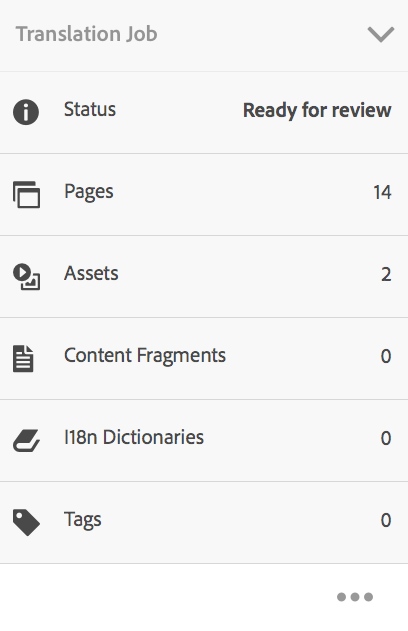

# 管理翻譯專案{#managing-translation-projects}

準備翻譯內容後，您需要建立遺漏的語言副本以完成語言結構，並建立翻譯專案。

翻譯專案可讓您管理AEM內容的翻譯。 翻譯專案是一種AEM [專案](/help/sites-authoring/projects.md) 包含要翻譯成其他語言的資源。 這些資源是 [語言副本](/help/sites-administering/tc-prep.md) 由語言主版建立。

將資源新增至翻譯專案時，會為資源建立翻譯工作。 作業提供命令和狀態資訊，用於管理在資源上執行的人工翻譯和機器翻譯工作流。

>[!NOTE]
>
>翻譯專案可包含多個翻譯工作。

翻譯專案是長期執行的項目，由語言和翻譯方法/提供者來定義，以符合全球化的組織治理。 應在初始翻譯期間或手動啟動一次，並在整個內容和翻譯更新活動中保持有效。

翻譯專案和工作是使用翻譯準備工作流程建立。 這些工作流程有三個選項，分別用於初始翻譯（建立和翻譯）和更新（更新翻譯）:

1. [建立新專案](#creating-translation-projects-using-the-references-panel)
1. [新增至現有專案](#adding-pages-to-a-translation-project)
1. [僅內容結構](#creating-the-structure-of-a-language-copy)

>[!NOTE]
>
>選項3與翻譯工作/項目無關。 它可讓您將語言主版中的內容和結構變更複製到（未翻譯）語言副本。 您可以使用這個功能來保持語言主版的同步，即使不需要翻譯。

## 執行初始翻譯並更新現有翻譯 {#performing-initial-translations-and-updating-existing-translations}

AEM會偵測正在為內容的初始翻譯建立翻譯專案，還是更新已翻譯的語言副本。 當您為頁面建立翻譯專案並指出要翻譯的語言副本時，AEM會偵測來源頁面是否已存在於目標語言副本中：

* **語言副本不包含頁面：** AEM會將此情況視為初始翻譯。 頁面會立即複製到語言副本中，並包含在專案中。 翻譯的頁面匯入至AEM時，AEM會直接複製到語言副本。
* **語言副本已包含頁面：** AEM會將此情況視為更新的翻譯。 系統會建立啟動，並將頁面復本新增至啟動中，並包含在專案中。 啟動可讓您在將更新的翻譯提交至語言副本之前先檢閱該翻譯：

   * 翻譯的頁面匯入至AEM時，會覆寫啟動中的頁面。
   * 翻譯的頁面只有在升級啟動時才會覆寫語言副本。

例如，會為/content/geometrixx/en主語言的法文翻譯建立/content/geometrixx/fr語言根。 法文副本中沒有其他頁。

* 系統會為/content/geometrixx/en/products頁面和所有子頁面建立翻譯專案，目標為法文語言副本。 由於語言副本不包含/content/geometrixx/fr/products頁面，AEM會立即將/content/geometrixx/en/products頁面和所有子頁面複製為法文語言副本。 翻譯專案中也包含這些副本。
* 系統會為/content/geometrixx/en頁面和所有子頁面建立翻譯專案，目標為法文語言副本。 因為語言副本包含與/content/geometrixx/en頁面（語言根）對應的頁面，AEM會複製/content/geometrixx/en頁面和所有子頁面，並將它們新增至launch。 翻譯專案中也包含這些副本。

## 使用「參考」面板建立翻譯專案 {#creating-translation-projects-using-the-references-panel}

建立翻譯專案，以便執行和管理翻譯語言主版資源的工作流程。 建立項目時，可以在要翻譯的語言主版中指定頁面，並指定要執行翻譯的語言副本：

* 與選定頁面關聯的翻譯整合框架的雲配置確定了翻譯項目的許多屬性，如要使用的翻譯工作流。
* 系統會為選取的每個語言副本建立專案。
* 系統會建立選取頁面的復本和相關資產，並新增至每個專案。 這些副本稍後將發送到翻譯提供程式進行翻譯。

您可以指定也選取所選頁面的子頁面。 在這種情況下，子頁面的副本也會新增至每個專案，以便翻譯。 當任何子頁面與不同的翻譯整合架構設定相關聯時，AEM會建立其他專案。

您也可以 [手動建立翻譯專案](#creating-a-translation-project-using-the-projects-console).

>[!NOTE]
>
>若要建立專案，您的帳戶必須是 `project-administrators` 群組。

**初始翻譯和更新翻譯**

「參考」面板指示您是更新現有語言副本，還是建立語言副本的第一版本。 當選定頁面的語言副本存在時，「更新語言副本」頁簽將顯示為提供對與項目相關的命令的訪問。

轉譯後，您可以 [查看翻譯](#reviewing-and-promoting-updated-content) 以覆寫語言副本。 當所選頁面不存在語言副本時，將顯示「建立和翻譯」頁簽，以提供對項目相關命令的訪問。

### 為新語言副本建立翻譯項目 {#create-translation-projects-for-a-new-language-copy}

1. 使用Sites Console來選取要新增至翻譯專案的頁面。

   例如，要翻譯Geometrixx演示網站的英文頁面，請選擇Geometrixx演示網站>英文。

1. 在工具列上，按一下或點選「參照」。

   

1. 選擇「語言副本」，然後選擇要翻譯源頁的語言副本。
1. 按一下或點選「建立和翻譯」，然後設定翻譯工作：

   * 使用「語言」下拉式清單來選取您要翻譯的語言副本。 視需要選取其他語言。 清單中顯示的語言與 [你創造的語言根](/help/sites-administering/tc-prep.md#creating-a-language-root).
   * 要轉換您選擇的頁面和所有子頁面，請選擇「選擇所有子頁面」。 若要僅翻譯您選取的頁面，請清除選項。
   * 對於項目，選擇建立新翻譯項目。
   * 輸入專案的名稱。

   

1. 按一下或點選「建立」。

### 為現有語言副本建立翻譯項目 {#create-translation-projects-for-an-existing-language-copy}

1. 使用Sites控制台來選擇要添加到翻譯項目的頁面。

   例如，要翻譯Geometrixx演示網站的英文頁面，請選擇Geometrixx演示網站>英文。

1. 在工具列上，按一下或點選「參照」。

   

1. 選擇「語言副本」，然後選擇要翻譯源頁的語言副本。
1. 按一下或點選「更新語言副本」，然後設定翻譯工作：

   * 要轉換您選擇的頁面和所有子頁面，請選擇「選擇所有子頁面」。 若要僅翻譯您選取的頁面，請清除選項。
   * 對於項目，選擇建立新翻譯項目。
   * 輸入專案的名稱。

   

1. 按一下或點選「開始」。

## 新增頁面至翻譯專案 {#adding-pages-to-a-translation-project}

建立翻譯專案後，您可以使用「資源」窗格將頁面新增至專案。 在相同專案中包含來自不同分支的頁面時，新增頁面很實用。

將頁面新增至翻譯專案時，這些頁面會包含在新的翻譯工作中。 您也可以 [將頁面新增至現有作業](#adding-pages-assets-to-a-translation-job).

和建立新專案時一樣，新增頁面時，必要時會將頁面的復本新增至啟動，以避免覆寫現有的語言復本。 (請參閱 [為現有語言副本建立翻譯項目](#performing-initial-translations-and-updating-existing-translations).)

1. 使用Sites控制台來選擇要添加到翻譯項目的頁面。

   例如，要翻譯Geometrixx演示網站的英文頁面，請選擇Geometrixx演示網站>英文。

1. 在工具列上，按一下或點選「參照」。

   

1. 選擇「語言副本」，然後選擇要翻譯源頁的語言副本。

   

1. 按一下或點選「更新語言副本」，然後設定屬性：

   * 要轉換您選擇的頁面和所有子頁面，請選擇「選擇所有子頁面」。 若要僅翻譯您選取的頁面，請清除選項。
   * 對於項目，選擇添加到現有翻譯項目。
   * 選取專案。

   >[!NOTE]
   >
   >翻譯專案中設定的目標語言應符合「參考」面板中所示的語言副本路徑。

   

1. 按一下或點選「開始」。

## 新增頁面/資產至翻譯工作 {#adding-pages-assets-to-a-translation-job}

您可以將頁面、資產、標籤或i18n字典新增至翻譯專案的翻譯工作。 若要新增頁面或資產：

1. 在翻譯專案的「翻譯工作」方塊底部，按一下或點選省略號。

   

1. 按一下或點選「新增及頁面/資產」。

   

1. 選取您要新增的分支最頂端的項目，然後按一下或點選核取標籤圖示。 您可以多選。

   

1. 或者，您也可以選取搜尋圖示，輕鬆尋找想要新增至翻譯工作的頁面或資產。

   

您的頁面和/或資產會新增至您的翻譯工作。

## 將i18n字典新增至翻譯工作 {#adding-i-n-dictionaries-to-a-translation-job}

您可以將頁面、資產、標籤或i18n字典新增至翻譯專案的翻譯工作。 若要新增i18n字典：

1. 在翻譯專案的「翻譯工作」方塊底部，按一下或點選省略號。

   

1. 按一下或點選「新增」和「I18N-Dictionary」。

   

1. 選取您要新增的字典，然後按一下或點選「新增」按鈕。

   

你的字典現在在翻譯工作。

>[!NOTE]
>
>如需i18n字典的詳細資訊，請閱讀 [使用翻譯工具管理字典](/help/sites-developing/i18n-translator.md).

## 為翻譯工作新增標籤 {#adding-tags-to-a-translation-job}

您可以將頁面、資產、標籤或i18n字典新增至翻譯專案的翻譯工作。 若要新增標籤：

1. 在翻譯專案的「翻譯工作」方塊底部，按一下或點選省略號。

   

1. 按一下或點選「新增」，然後點選「標籤」。

   

1. 選取您要新增的標籤，然後按一下或點選核取標籤圖示。 您可以多選。

   

您的標籤現在已新增至翻譯工作中。

## 查看翻譯項目詳細資訊 {#seeing-translation-project-details}

「翻譯摘要」表徵圖包含為翻譯項目配置的屬性。 除了通用 [項目資訊](/help/sites-authoring/projects.md#project-info)，翻譯標籤包含翻譯專屬屬性：

* 源語言：正在翻譯的頁面的語言。
* 目標語言：頁面翻譯的語言。
* 翻譯方法：翻譯工作流程。 支援人工翻譯或機器翻譯。
* 翻譯提供者：執行翻譯的翻譯服務提供商。
* 內容類別：（機器翻譯）用於翻譯的內容類別。
* 雲配置：用於專案的翻譯服務連接器雲端設定。

使用頁面的「資源」窗格建立項目時，系統會根據源頁面的屬性自動配置這些屬性。

## 監控翻譯工作的狀態 {#monitoring-the-status-of-a-translation-job}

翻譯專案的「翻譯工作」方塊會提供翻譯工作的狀態，以及工作中的頁面和資產數。

下表說明作業或作業中的項目可擁有的每個狀態：

| 狀態 | 說明 |
|---|---|
| 份草稿 | 尚未啟動翻譯工作。 翻譯工作建立後會處於「草稿」狀態。 |
| 已提交 | 翻譯工作中的檔案成功傳送至翻譯服務時，會具有此狀態。 在發出Request Scope命令或Start命令後，可能會出現此狀態。 |
| 已要求範圍 | 對於「人工翻譯」工作流，作業中的檔案已提交給翻譯供應商以進行範圍界定。 發出Request Scope命令後，此狀態將顯示。 |
| 範圍已完成 | 供應商已限定翻譯作業的範圍。 |
| 承諾翻譯 | 項目所有者已接受該範圍。 此狀態表示翻譯供應商應開始翻譯作業中的檔案。 |
| 正在進行的翻譯 | 對於作業，作業中一個或多個檔案的翻譯尚未完成。 對於作業中的項目，正在翻譯該項目。 |
| 已翻譯 | 對於作業，作業中的所有檔案的翻譯已完成。 對於作業中的項目，項目會被翻譯。 |
| 準備審核 | 作業中的項目會翻譯，且檔案已匯入AEM。 |
| 完成 | 項目所有者表示翻譯合同已完成。 |
| 取消 | 指示翻譯供應商應停止處理翻譯工作。 |
| 更新錯誤 | 在AEM和翻譯服務之間傳輸檔案時出錯。 |
| 未知狀態 | 發生未知錯誤。 |

若要查看工作中每個檔案的狀態，請按一下或點選圖磚底部的刪節號。

## 設定翻譯作業的到期日 {#setting-the-due-date-of-translation-jobs}

指定翻譯供應商需要返回翻譯檔案的日期。 您可以設定項目或特定作業的到期日：

* **專案：** 項目中的翻譯作業將繼承到期日。
* **工作：** 您為作業設定的到期日將覆蓋為項目設定的到期日。

只有當所使用的翻譯供應商支援此功能時，才能正確設定到期日。

以下過程設定項目的到期日。

1. 按一下或點選「翻譯摘要」圖磚底部的刪節號。

   

1. 在「基本」頁簽上，使用「到期日」屬性的日期選擇器來選擇到期日。

   

1. 按一下或點選「完成」。

以下過程設定翻譯作業的到期日。

1. 在「翻譯工作」圖磚上，按一下或點選「命令」功能表，然後按一下或點選「到期日」。

   

1. 在對話方塊中，按一下或點選日曆圖示，然後選取要用作到期日的日期和時間，然後按一下「儲存」。

   

## 規範翻譯工作 {#scoping-a-translation-job}

從翻譯服務提供商處獲取翻譯成本的估計值。 當您調整作業範圍時，會將源檔案提交給翻譯供應商，該供應商將文本與儲存的翻譯庫（翻譯記憶庫）進行比較。 範圍通常是需要翻譯的字詞數。

要獲取有關範圍界定結果的更多資訊，請與翻譯供應商聯繫。

>[!NOTE]
>
>範圍界定為選用。 您可以開始翻譯工作，而無須範圍界定。

當您調整翻譯作業的範圍時，該作業的狀態為 `Scope Requested`. 當翻譯供應商返回範圍時，狀態將更改為 `Scope Completed`. 完成範圍界定後，可以使用「顯示範圍」(Show Scope)命令來查看範圍界定結果。

只有使用的翻譯供應商支援此功能時，範圍界定功能才能正常運作。

1. 在專案主控台中，開啟您的翻譯專案。
1. 在「翻譯工作」方塊中，按一下或點選「命令」功能表，然後按一下或點選「請求範圍」。

   

1. 當作業狀態更改為SCOPE_COMPLETED時，在「翻譯作業」表徵圖上按一下或點選命令菜單，然後按一下或點選「顯示作用域」。

## 開始翻譯工作 {#starting-a-translation-job}

啟動翻譯工作，將源頁面翻譯為目標語言。 翻譯會根據「翻譯摘要」表徵圖的屬性值執行。

開始翻譯工作後，「翻譯工作」表徵圖將顯示「正在進行的翻譯」狀態。

1. 在專案主控台中，開啟翻譯專案。
1. 在「翻譯工作」表徵圖上，按一下或點選命令菜單，然後按一下或點選「開始」。

   

1. 在確認翻譯開始的「動作」對話方塊中，按一下或點選「關閉」。

## 取消翻譯工作 {#canceling-a-translation-job}

取消翻譯工作以停止翻譯過程並阻止翻譯供應商執行任何進一步的翻譯。 當作業具有 `Committed For Translation` 或 `Translation In Progress` 狀態。

1. 在專案主控台中，開啟翻譯專案。
1. 在「翻譯工作」表徵圖上，按一下或點選命令菜單，然後按一下或點選「取消」。
1. 在確認翻譯取消的「動作」對話方塊中，按一下或點選「確定」。

## 接受/拒絕工作流 {#accept-reject-workflow}

當內容在翻譯後返回且處於「已就緒以供審閱」狀態時，您可以進入翻譯工作並接受/拒絕內容。

如果選擇「拒絕翻譯」，則可以選擇添加註釋。

拒絕內容會將內容傳回給翻譯廠商，讓他可以在該廠看到評論。

## 檢閱和促銷更新的內容 {#reviewing-and-promoting-updated-content}

當針對現有語言副本翻譯內容時，請查看翻譯內容，視需要進行更改，然後升級翻譯以將其移到語言副本中。 當翻譯工作顯示「Ready For Review（就緒以供審閱）」狀態時，您可以審閱翻譯的檔案。

1. 在語言主版中選取頁面，按一下或點選「參考」，然後按一下或點選「語言復本」。
1. 按一下或點選要檢閱的語言副本。

   

1. 按一下或點選「啟動」，以顯示與啟動相關的命令。

   

1. 若要開啟頁面的啟動副本以檢閱及編輯內容，請按一下「開啟頁面」。
1. 檢閱內容並進行必要變更後，若要促銷啟動副本，請按一下「促銷」。
1. 在「促銷啟動」頁面上，指定要促銷的頁面，然後按一下或點選「促銷」。

## 比較語言副本 {#comparing-language-copies}

要比較語言副本與語言主版：

1. 在 **網站** 主控台，導覽至您要比較的語言副本。
1. 開啟 **[參考](/help/sites-authoring/basic-handling.md#references)** 中。
1. 在 **復本** 標題選取 **語言副本。**
1. 選取您的特定語言副本，然後您可以按一下**與主版比較**或**與上一版比較**（若適用）。

   

1. 兩個頁面（啟動和來源）將並排開啟。

   如需使用此功能的完整資訊，請參閱 [頁面差異](/help/sites-authoring/page-diff.md).

## 完成和歸檔翻譯工作 {#completing-and-archiving-translation-jobs}

審核供應商翻譯的檔案後，完成翻譯工作。 對於人工翻譯工作流，完成翻譯會向供應商表明翻譯合同已經履行，並且應將翻譯保存到其翻譯記憶庫。

完成作業後，該作業的狀態為「完成」。

翻譯工作完成後進行封存，您不再需要查看工作狀態詳細資訊。 封存工作時，「翻譯工作」方塊會從專案中移除。

## 建立語言副本的結構 {#creating-the-structure-of-a-language-copy}

填入您的語言副本，以便包含您正在翻譯之主語言的內容。 填入語言副本之前，您必須 [建立了語言根](/help/sites-administering/tc-prep.md#creating-a-language-root) 語言副本。

1. 使用Sites Console來選擇作為源的主語言的語言根目錄。 例如，要翻譯Geometrixx演示網站的英文頁面，請選擇「內容」>「Geometrixx演示網站」>「英文」。
1. 在工具列上，按一下或點選「參照」。

   

1. 選擇「語言副本」，然後選擇要填充的語言副本。

   

1. 按一下或點選「更新語言副本」以顯示翻譯工具，並設定屬性：

   * 選取「選取所有子頁面」選項。
   * 對於項目，選擇僅建立結構。

   

1. 按一下或點選「開始」。

## 移動或更名源頁 {#move-source}

如果需要翻譯的源頁面 [重新命名或移動](/help/sites-authoring/managing-pages.md#moving-or-renaming-a-page)，移動後重新轉譯頁面會根據新頁面名稱/位置建立新語言副本。 根據先前名稱/位置的舊語言副本仍會存在。

此情境的最佳實務是遵循此程式：
1. 取消發佈與要移動的源頁面關聯的語言副本。
1. 刪除它們。
1. 從新移動的源頁面建立新語言副本。
1. 發佈新建立的語言副本。

## 使用專案主控台建立翻譯專案 {#creating-a-translation-project-using-the-projects-console}

如果您偏好使用「專案」主控台，可以手動建立翻譯專案。

>[!NOTE]
>
>若要建立專案，您的帳戶必須是 `project-administrators` 群組。

手動建立翻譯專案時，除了 [基本屬性](/help/sites-authoring/touch-ui-managing-projects.md#creating-a-project):

* **名稱：** 專案名稱。
* **源語言：** 來源內容的語言。
* **目標語言：** 內容翻譯的語言。
* **翻譯方法：** 選擇「人工翻譯」以指示要手動執行翻譯。

1. 在「專案」控制台的工具列上，按一下或點選「建立」。
1. 選取「翻譯專案」範本，然後按一下或點選「下一步」。
1. 輸入基本屬性的值。
1. 按一下或點選「進階」，並提供與翻譯相關的屬性的值。
1. 按一下或點選「建立」。 在確認方塊中，按一下或點選「完成」以返回「專案」主控台，或按一下或點選「開啟專案」以開啟並開始管理專案。

## 匯出翻譯工作 {#exporting-a-translation-job}

您可以下載翻譯工作的內容，例如傳送至未透過連接器與AEM整合的翻譯提供者，或檢閱內容。

1. 從「翻譯工作」表徵圖的下拉菜單中，按一下或點選「導出」。
1. 在「匯出」對話方塊中，按一下或點選「下載匯出的檔案」，並視需要使用網頁瀏覽器對話方塊來儲存檔案。
1. 在「匯出」對話方塊中，按一下或點選「關閉」。

## 匯入翻譯工作 {#importing-a-translation-job}

您可以將翻譯的內容匯入AEM，例如當翻譯提供者將翻譯內容傳送給您時，因為這些內容並未透過連接器與AEM整合。

1. 從「翻譯工作」表徵圖的下拉菜單中，按一下或點選「導入」。
1. 使用Web瀏覽器的對話框選擇要導入的檔案。
1. 在「匯入」對話方塊中，按一下或點選「關閉」。
