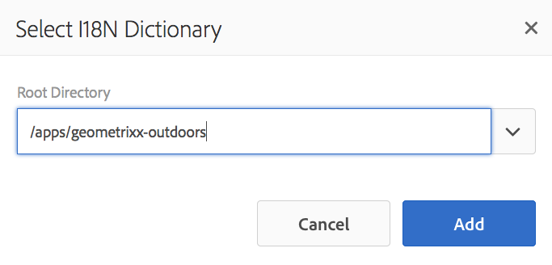
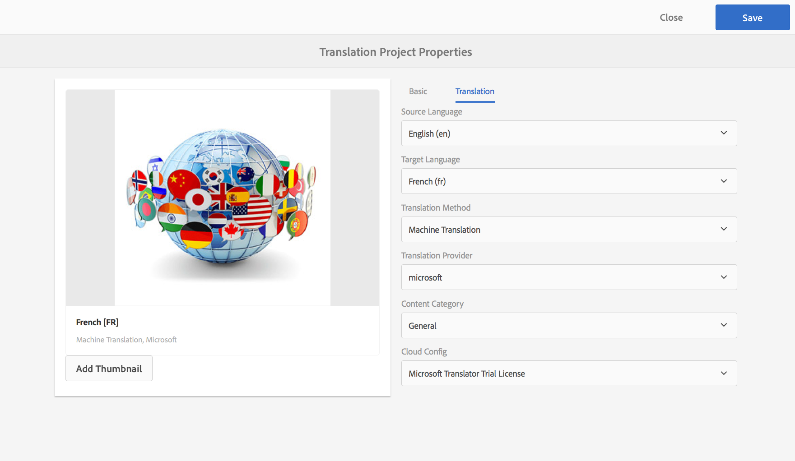
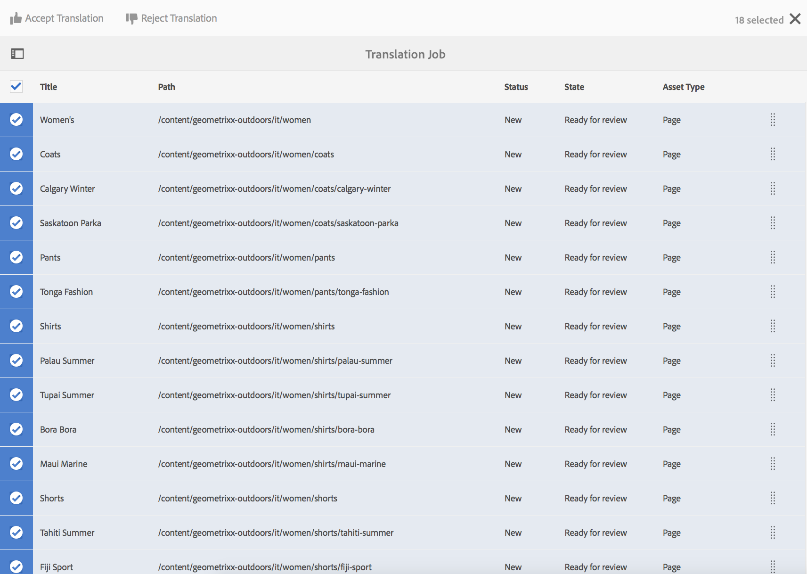

# 管理翻譯項目{#managing-translation-projects}

在準備翻譯內容後，您需要通過建立缺少的語言副本來完成語言結構，並建立翻譯項目。

翻譯專案可讓您管理AEM內容的翻譯。 翻譯專案是一種AEM專 [案](/help/sites-authoring/projects.md) ，其中包含將翻譯為其他語言的資源。 這些資源是從語言主版中 [建立的語言](/help/sites-administering/tc-prep.md) 拷貝的頁面和資產。

將資源添加到翻譯項目時，將為其建立翻譯作業。 作業提供命令和狀態資訊，用於管理在資源上執行的人工翻譯和機器翻譯工作流。

>[!NOTE]
>
>翻譯項目可以包含多個翻譯作業。

翻譯項目是長期執行的項目，由語言和翻譯方法／提供者定義，以便與全球化的組織治理保持一致。 應在初始翻譯期間或手動啟動一次，並在整個內容和翻譯更新活動中保持有效。

翻譯項目和作業是使用翻譯準備工作流建立的。 這些工作流程有三個選項，包括初始翻譯(Create&amp;Translate)和更新(Update Translation):

1. [建立新專案](#creating-translation-projects-using-the-references-panel)
1. [新增至現有專案](#adding-pages-to-a-translation-project)
1. [僅限內容結構](#creating-the-structure-of-a-language-copy)

>[!NOTE]
>
>選項3與翻譯工作／項目無關。 它可讓您將語言主版的內容和結構變更複製到（未翻譯）語言副本。 您可以使用這個功能，讓語言主控程式保持同步，即使不需要翻譯。

## 執行初始翻譯和更新現有翻譯 {#performing-initial-translations-and-updating-existing-translations}

AEM會偵測是否正在建立翻譯專案以進行內容的初始翻譯，或更新已翻譯的語言副本。 當您為頁面建立翻譯專案並指出您要翻譯的語言副本時，AEM會偵測來源頁面是否已存在於目標語言副本中：

* **** 語言副本不包含頁面：AEM將此情況視為初始翻譯。 頁面會立即複製到語言副本，並包含在專案中。 當翻譯的頁面匯入AEM時，AEM會直接將它複製至語言副本。
* **** 語言副本已包含頁面：AEM將此情況視為更新的翻譯。 會建立啟動，並將頁面副本新增至啟動，並包含在專案中。 啟動可讓您在將更新的翻譯提交至語言副本之前，先檢閱其翻譯：

   * 將翻譯的頁面匯入AEM時，會覆寫啟動中的頁面。
   * 只有在升級啟動時，翻譯的頁面才會覆寫語言副本。

例如， /content/geometrixx/fr語言根目錄是為/content/geometrixx/tw master語言的法文翻譯而建立的。 法文版中沒有其他頁面。

* 會針對/content/geometrixx/tw/products頁面和所有子頁面建立翻譯專案，以法文語言文案為目標。 由於語言副本不包含/content/geometrixx/fr/products頁面，AEM會立即將/content/geometrixx/tw/products頁面和所有子頁面複製為法文語言副本。 翻譯項目中也包含這些副本。
* 會針對/content/geometrixx/tw頁面和所有子頁面建立翻譯專案，以法文語言文案為目標。 由於語言副本包含與/content/geometrixx/tw頁面（語言根目錄）對應的頁面，AEM會複製/content/geometrixx/tw頁面和所有子頁面，並將它們新增至啟動中。 翻譯項目中也包含這些副本。

## 使用「參照」(References)面板建立翻譯項目 {#creating-translation-projects-using-the-references-panel}

建立翻譯項目，以便執行和管理翻譯語言首頁資源的工作流。 在建立項目時，您可以在要翻譯的語言主版中指定頁面，以及要執行翻譯的語言副本：

* 與選定頁面相關聯的翻譯整合框架的雲配置決定了翻譯項目的許多屬性，如要使用的翻譯工作流。
* 系統會為選取的每個語言副本建立專案。
* 系統會建立選定頁面及相關資產的副本，並新增至每個專案。 這些副本稍後將發送給翻譯提供者進行翻譯。

您可以指定也選取所選頁面的子頁面。 在這種情況下，子頁面的副本也會新增至每個專案，以便翻譯。 當任何子頁面都與不同的翻譯整合架構設定相關聯時，AEM會建立其他專案。

您也可以手 [動建立翻譯專案](#creating-a-translation-project-using-the-projects-console)。

**初譯與更新譯**

「參考」面板會指出您是要更新現有語言副本，還是要建立語言副本的第一版。 當選定頁面存在語言副本時，將顯示「更新語言副本」頁籤，以提供對項目相關命令的訪問。

翻譯後，您可以先 [查看翻譯](#reviewing-and-promoting-updated-content) ，然後再用它覆寫語言副本。 當選定頁面不存在語言副本時，將顯示「建立和翻譯」頁籤，以提供對項目相關命令的訪問。

### 為新語言副本建立翻譯項目 {#create-translation-projects-for-a-new-language-copy}

1. 使用Sites控制台選擇要添加到翻譯項目的頁。

   例如，若要翻譯Geometrixx Demo Site的英文頁面，請選取「Geometrixx Demo Site >英文」。

1. 在工具欄上，按一下或點選「參照」(References)。

   

1. 選擇「語言副本」，然後選擇要翻譯源頁面的語言副本。
1. 按一下或點選「建立和翻譯」，然後配置翻譯作業：

   * 使用「語言」下拉式清單來選取您要翻譯的語言副本。 視需要選擇其他語言。 出現在清單中的語言會與您所 [建立的語言根目錄對應](/help/sites-administering/tc-prep.md#creating-a-language-root)。
   * 要轉換所選頁面和所有子頁面，請選擇「選擇所有子頁面」。 要僅翻譯所選的頁面，請清除該選項。
   * 對於項目，選擇建立新翻譯項目。
   * 輸入專案的名稱。
   

1. 按一下或點選「建立」。

### 為現有語言副本建立翻譯項目 {#create-translation-projects-for-an-existing-language-copy}

1. 使用Sites控制台選擇要添加到翻譯項目的頁。

   例如，若要翻譯Geometrixx Demo Site的英文頁面，請選取「Geometrixx Demo Site >英文」。

1. 在工具欄上，按一下或點選「參照」(References)。

   

1. 選擇「語言副本」，然後選擇要翻譯源頁面的語言副本。
1. 按一下或點選「更新語言副本」，然後配置翻譯作業：

   * 要轉換所選頁面和所有子頁面，請選擇「選擇所有子頁面」。 要僅翻譯所選的頁面，請清除該選項。
   * 對於項目，選擇建立新翻譯項目。
   * 輸入專案的名稱。
   

1. 按一下或點選「開始」。

## 將頁面添加到翻譯項目 {#adding-pages-to-a-translation-project}

建立翻譯項目後，可以使用「資源」窗格向項目添加頁面。 在相同專案中包含來自不同分支的頁面時，新增頁面很有用。

將頁面添加到翻譯項目時，這些頁面將包含在新的翻譯作業中。 您也可以 [將頁面新增至現有工作](#adding-pages-assets-to-a-translation-job)。

如同建立新專案時，新增頁面時，頁面的副本會在需要時新增至啟動，以避免覆寫現有的語言副本。 (請參 [閱為現有語言副本建立翻譯項目](#performing-initial-translations-and-updating-existing-translations)。)

1. 使用Sites控制台選擇要添加到翻譯項目的頁。

   例如，若要翻譯Geometrixx Demo Site的英文頁面，請選取「Geometrixx Demo Site >英文」。

1. 在工具欄上，按一下或點選「參照」(References)。

   

1. 選擇「語言副本」，然後選擇要翻譯源頁面的語言副本。

   

1. 按一下或點選「更新語言副本」，然後設定屬性：

   * 要轉換所選頁面和所有子頁面，請選擇「選擇所有子頁面」。 要僅翻譯所選的頁面，請清除該選項。
   * 對於項目，選擇「添加到現有翻譯項目」。
   * 選取專案。
   >[!NOTE]
   >
   >翻譯項目中設定的目標語言應與語言副本的路徑匹配，如「參考」面板中所示。

   

1. 按一下或點選「開始」。

## 將頁面／資產新增至翻譯工作 {#adding-pages-assets-to-a-translation-job}

您可以將頁面、資產、標籤或i18n字典新增至翻譯專案的翻譯工作。 若要新增頁面或資產：

1. 在翻譯項目的「翻譯作業」表徵圖底部，按一下或點選省略號。

   

1. 按一下或點選「新增及頁面／資產」。

   

1. 選擇要添加的分支的最上方項目，然後按一下或點選複選標籤表徵圖。 您可以多選。

   

1. 或者，您也可以選取搜尋圖示，輕鬆尋找要新增至翻譯工作的頁面或資產。

   

您的頁面和／或資產會新增至您的翻譯工作。

## 將i18n字典添加到翻譯作業 {#adding-i-n-dictionaries-to-a-translation-job}

您可以將頁面、資產、標籤或i18n字典新增至翻譯專案的翻譯工作。 若要新增i18n字典：

1. 在翻譯項目的「翻譯作業」表徵圖底部，按一下或點選省略號。

   

1. 按一下或點選「新增與I18N字典」。

   

1. 選取您要新增的字典，然後按一下或點選「新增」按鈕。

   

你的字典現在在翻譯工作。

>[!NOTE]
>
>如需i18n字典的詳細資訊，請閱 [讀「使用翻譯工具管理字典」](/help/sites-developing/i18n-translator.md)。

## 向翻譯作業添加標籤 {#adding-tags-to-a-translation-job}

您可以將頁面、資產、標籤或i18n字典新增至翻譯專案的翻譯工作。 若要新增標籤：

1. 在翻譯項目的「翻譯作業」表徵圖底部，按一下或點選省略號。

   

1. 按一下或點選「新增」，然後點選「標籤」。

   

1. 選取您要新增的標籤，然後按一下或點選核取標籤圖示。 您可以多選。

   

您的標籤現在會新增到翻譯工作中。

## 查看翻譯項目詳細資訊 {#seeing-translation-project-details}

「翻譯摘要」表徵圖包含為翻譯項目配置的屬性。 除了一般項目信 [息外](/help/sites-authoring/projects.md#project-info),「翻譯」頁籤還包含翻譯特定屬性：

* 來源語言：正在翻譯的頁面語言。
* 目標語言：翻譯頁面的語言。
* 翻譯方法：翻譯工作流程。 支援人文翻譯或機器翻譯。
* 翻譯提供者：正在執行翻譯的翻譯服務提供商。
* 內容類別：（機器翻譯）用於翻譯的內容類別。
* 雲端設定：用於項目的翻譯服務連接器的雲配置。

使用頁面的「資源」窗格建立項目時，會根據源頁面的屬性自動配置這些屬性。

## 監視翻譯作業的狀態 {#monitoring-the-status-of-a-translation-job}

翻譯項目的「翻譯作業」表徵圖提供翻譯作業的狀態以及作業中的頁數和資產數。

下表說明作業或作業中的項目可以擁有的每個狀態：

| 狀態 | 說明 |
|---|---|
| 份草稿 | 尚未啟動翻譯作業。 翻譯作業建立時處於「草稿」狀態。 |
| 已提交 | 翻譯作業中的檔案在成功發送到翻譯服務後具有此狀態。 在發出Request Scope命令或Start命令後，可能會出現此狀態。 |
| 已要求範圍 | 在「人工翻譯」工作流中，作業中的檔案已提交給翻譯供應商進行範圍界定。 發出「請求範圍」命令後，此狀態將顯示。 |
| 範圍已完成 | 供應商已對翻譯作業進行了審查。 |
| 承諾翻譯 | 項目所有者已接受此範圍。 此狀態表示翻譯供應商應開始翻譯作業中的檔案。 |
| 正在進行翻譯 | 對於作業，作業中一個或多個檔案的翻譯尚未完成。 對於任務中的項目，正在翻譯該項目。 |
| 已翻譯 | 對於作業，作業中所有檔案的翻譯完成。 對於任務中的項目，將翻譯該項目。 |
| 可供審核 | 工作中的項目會轉譯，而且檔案已匯入AEM。 |
| 完成 | 項目所有者已表示翻譯合同已完成。 |
| 取消 | 指示翻譯供應商應停止處理翻譯作業。 |
| 錯誤更新 | 在AEM和轉譯服務之間傳輸檔案時發生錯誤。 |
| 未知狀態 | 發生未知錯誤。 |

要查看作業中每個檔案的狀態，請按一下或點選表徵圖底部的省略號。

## 設定翻譯作業的到期日期 {#setting-the-due-date-of-translation-jobs}

指定翻譯供應商需要返回翻譯檔案的日期。 您可以為項目或特定任務設定到期日：

* **** 專案：項目中的翻譯作業繼承到期日。
* **** 工作：您為任務設定的到期日將改寫為項目設定的到期日。

只有當您使用的翻譯供應商支援此功能時，才能正確設定到期日。

以下過程設定項目的到期日。

1. 按一下或點選「翻譯摘要」表徵圖底部的省略號。

   

1. 在「基本」標籤中，使用「到期日」屬性的日期選擇器來選擇到期日。

   

1. 按一下或點選「完成」。

以下過程設定翻譯作業的到期日期。

1. 在「翻譯作業」表徵圖上，按一下或點選命令菜單，然後按一下或點選「到期日」。

   

1. 在對話方塊中，按一下或點選日曆圖示，然後選取要用作到期日的日期和時間，然後按一下「儲存」。

   

## 範圍翻譯工作 {#scoping-a-translation-job}

調整翻譯作業範圍，以從翻譯服務提供商那裡獲得翻譯成本的估計值。 當您對作業進行範圍調整時，源檔案將提交給翻譯供應商，該供應商將文本與儲存的翻譯庫（翻譯記憶體）進行比較。 通常範圍是需要翻譯的字詞數。

要獲取有關範圍界定結果的更多資訊，請與翻譯供應商聯繫。

>[!NOTE]
>
>範圍界定是選用的。 您可以開始翻譯工作，而不需進行範圍界定。

當您調整翻譯作業的範圍時，該作業的狀態為 `Scope Requested`。 當翻譯供應商返回範圍時，狀態將更改為 `Scope Completed`。 完成範圍界定後，可以使用「顯示範圍」(Show Scope)命令來查看範圍界定結果。

只有當您使用的翻譯供應商支援此功能時，範圍界定才能正確運作。

1. 在「項目」控制台中，開啟翻譯項目。
1. 在「翻譯作業」表徵圖上，按一下或點選命令菜單，然後按一下或點選「請求範圍」。

   

1. 當作業狀態更改為SCOPE_COMPLETED時，在「Translation Job」（翻譯作業）表徵圖上按一下或點選命令菜單，然後按一下或點選「Show Scope」（顯示範圍）。

## 啟動翻譯作業 {#starting-a-translation-job}

啟動翻譯作業，將源頁面翻譯為目標語言。 根據「翻譯摘要」表徵圖的屬性值執行翻譯。

啟動翻譯作業後，「翻譯作業」表徵圖將顯示「正在進行的翻譯」狀態。

1. 在「項目」控制台中，開啟翻譯項目。
1. 在「翻譯作業」表徵圖上，按一下或點選命令菜單，然後按一下或點選「開始」。

   

1. 在確認翻譯開始的「動作」對話方塊中，按一下或點選「關閉」。

## 取消翻譯作業 {#canceling-a-translation-job}

取消翻譯作業以停止翻譯過程並阻止翻譯供應商執行任何進一步的翻譯。 當作業具有或狀態時，您可以取消 `Committed For Translation` 作 `Translation In Progress` 業。

1. 在「項目」控制台中，開啟翻譯項目。
1. 在「翻譯作業」表徵圖上，按一下或點選命令菜單，然後按一下或點選「取消」。
1. 在確認取消翻譯的「操作」對話框中，按一下或點選「確定」。

## 接受／拒絕工作流程 {#accept-reject-workflow}

當內容在翻譯後返回且處於「已準備審核」狀態時，您可以進入翻譯工作並接受／拒絕內容。

如果選擇「拒絕翻譯」，則可以選擇添加註釋。

拒絕內容會傳回給翻譯廠商，讓他可以在那裡看到評論。

## 檢閱和促銷更新內容 {#reviewing-and-promoting-updated-content}

當內容翻譯成現有語言副本時，請檢閱翻譯，視需要進行變更，然後將翻譯提升為語言副本。 當翻譯作業顯示「Ready For Review」（準備審核）狀態時，您可以審核翻譯的檔案。

1. 在語言主版中選取頁面，按一下或點選「參考」，然後按一下或點選「語言副本」。
1. 按一下或點選要檢閱的語言副本。

   

1. 按一下或點選「啟動」，以顯示與啟動相關的命令。

   

1. 若要開啟頁面的啟動副本以檢閱和編輯內容，請按一下「開啟頁面」。
1. 檢視內容並進行必要變更後，若要促銷啟動副本，請按一下「促銷」。
1. 在「促銷啟動」頁面上，指定要促銷的頁面，然後按一下或點選「促銷」。

## 比較語言副本 {#comparing-language-copies}

要比較語言副本與語言主版：

1. 在 **Sites** Console中，導覽至您要比較的語言副本。
1. 開啟「參 **[照](/help/sites-authoring/basic-handling.md#references)**」面板。
1. 在「複製 **」標題下** ，選擇「 **語言複製」。**
1. 選擇您的特定語言版本，然後按一下「**與主版比較**」或「**與舊版比較**」（如果適用）。

   

1. 兩個頁面（啟動和來源）將並排開啟。

   有關使用此功能的完整資訊，請參 [閱頁面差異](/help/sites-authoring/page-diff.md)。

## 完成和歸檔翻譯作業 {#completing-and-archiving-translation-jobs}

在審核了供應商翻譯的檔案後完成翻譯工作。 對於人工翻譯工作流，完成翻譯會向供應商表明翻譯合同已經履行，並且應將翻譯保存到其翻譯庫中。

完成作業後，該作業具有「完成」狀態。

在翻譯作業完成後存檔，您不再需要查看作業狀態詳細資訊。 當您存檔作業時，「翻譯作業」表徵圖將從項目中刪除。

## 建立語言副本的結構 {#creating-the-structure-of-a-language-copy}

填入您的語言副本，以便包含您要翻譯的主版語言的內容。 在填入語言副本之前，您必須已 [經建立語言副本的語言](/help/sites-administering/tc-prep.md#creating-a-language-root) 根目錄。

1. 使用Sites控制台來選擇您用作源的主語言的語言根目錄。 例如，若要翻譯Geometrixx展示網站的英文頁面，請選取「內容> Geometrixx展示網站>英文」。
1. 在工具欄上，按一下或點選「參照」(References)。

   

1. 選擇「語言副本」，然後選擇要填充的語言副本。

   

1. 按一下或點選「更新語言副本」以顯示翻譯工具，並設定屬性：

   * 選擇「選擇所有子頁」選項。
   * 對於「項目」，選擇「僅建立結構」。
   

1. 按一下或點選「開始」。

## 使用項目控制台建立翻譯項目 {#creating-a-translation-project-using-the-projects-console}

如果希望使用「項目」控制台，可以手動建立翻譯項目。

手動建立翻譯項目時，除了基本屬性外，還必須為下列與翻譯相關的屬性提供 [值](/help/sites-authoring/touch-ui-managing-projects.md#creating-a-project):

* **** 名稱：專案名稱。
* **** 來源語言：來源內容的語言。
* **** 目標語言：內容翻譯的語言。
* **** 翻譯方法：選擇「人工翻譯」以指示要手動執行翻譯。

1. 在「專案」主控台的工具列上，按一下或點選「建立」。
1. 選擇翻譯項目模板，然後按一下或點選「下一步」。
1. 輸入基本屬性的值。
1. 按一下或點選「高級」，並為與翻譯相關的屬性提供值。
1. 按一下或點選「建立」。 在確認方塊中，按一下或點選「完成」以返回「專案」主控台，或按一下或點選「開啟專案」以開啟並開始管理專案。

## 導出翻譯作業 {#exporting-a-translation-job}

您可以下載翻譯工作的內容，例如透過連接器傳送給未與AEM整合的翻譯提供者，或檢閱內容。

1. 從「翻譯作業」表徵圖的下拉菜單中，按一下或點選「導出」。
1. 在「匯出」對話方塊中，按一下或點選「下載匯出的檔案」，並視需要使用網頁瀏覽器對話方塊來儲存檔案。
1. 在「匯出」對話方塊中，按一下或點選「關閉」。

## 導入翻譯作業 {#importing-a-translation-job}

您可以將翻譯內容匯入AEM，例如，當您的翻譯提供者將翻譯內容傳送給您時，因為這些內容未透過連接器與AEM整合。

1. 從「翻譯作業」表徵圖的下拉菜單中，按一下或點選「導入」。
1. 使用網頁瀏覽器的對話框選擇要導入的檔案。
1. 在「匯入」對話方塊中，按一下或點選「關閉」。

