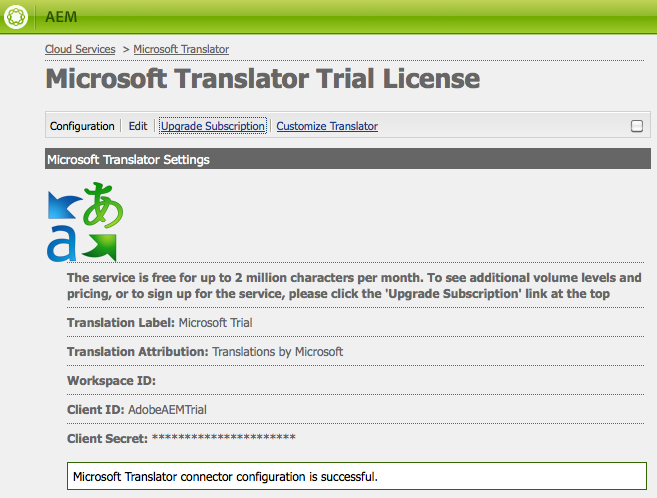

# 連接到Microsoft Translator{#connecting-to-microsoft-translator}

建立Microsoft Translator雲端服務的設定，以使用您的Microsoft Translation帳戶來轉譯AEM頁面內容、社群內容或資產。

| 屬性 | 說明 |
|---|---|
| 翻譯標籤 | 翻譯服務的顯示名稱。 |
| 翻譯歸因 | （選擇性）例如，針對使用者產生的內容，顯示在翻譯文字旁的歸因 `Translations by Microsoft`。 |
| 工作區ID | （可選）您要使用的自訂Microsoft Translator引擎ID。 |
| 訂閱金鑰 | 您的Microsoft Translator訂閱金鑰。 |

在建立設定後，您需要啟 [動它](/help/sites-administering/tc-msconf.md#activating-the-translator-service-configurations)。

以下過程使用最佳化觸控式UI來建立Microsoft Translator組態。

1. 在導軌上，按一下或點選「工具>雲端服務」。
1. 在「Microsoft Translator」區域中，按一下或點選「Show Configurations」（顯示配置）。
1. 按一下「Available Configurations（可用配置）」旁邊的+連結。

   

1. 輸入您設定的標題。 標題可識別雲端服務主控台以及頁面屬性下拉式清單中的設定。 預設名稱是以標題為基礎。 （可選）鍵入用於儲存配置的儲存庫節點的名稱。 您應使用「父配置」屬性的預設值，該屬性是儲存庫節點的路徑。
1. 按一下「建立」。
1. 在出現的對話方塊中，輸入屬性值，然後按一下「確定」。

## Microsoft Translator雲端服務配置示例 {#sample-microsoft-translator-cloud-service-configurations}

以下Microsoft Translator雲端服務組態會隨Geometrixx範例一起安裝。 某些配置示例使用試用版Microsoft Translation帳戶，該帳戶每月最多允許2 000 000個免費翻譯字元。

### Microsoft Translator 試用版授權 {#microsoft-translator-trial-license}

Microsoft Translator試用版授權組態是與Geometrixxx Outdoors範例套件一起安裝的範例組態。 此配置使用Microsoft Translator帳戶，該帳戶有免費訂閱，允許每月2 000 000個翻譯字元。

### Microsoft Translator Trial License - Geometrixx-outdoors {#microsoft-translator-trial-license-geometrixx-outdoors}

Microsoft Translator試用版授權- Geometrixx-outdoors組態是與Geometrixx Outdoors一起安裝的範例組態。 此配置使用與Microsoft Translator試用版許可證配置相同的免費Microsoft Translator帳戶。 該帳戶有免費訂閱，每月允許2 000 000個翻譯字元。

此Microsoft Translator配置已最佳化，可搭配Geometrixx Outdoors範例網站的內容類型使用。

### 升級Microsoft Translator試用版授權配置 {#upgrading-the-microsoft-translator-trial-license-configuration}

「Microsoft翻譯」配置頁提供了指向Microsoft網站的方便連結，以便獲得適合生產系統的帳戶訂閱。

1. 在導軌上，按一下或點選「工具>作業>雲端>雲端服務」。
1. 在「Microsoft Translator」區域，按一下或點選「Show Configurations」（顯示配置），然後按一下或點選「Microsoft Translator試用許可證」(Microsoft Translator Translation Configuration)。

   

1. 在設定頁面上，按一下「升級訂閱」。 使用開啟的Microsoft網頁來設定您的帳戶。

   

### 自訂您的Microsoft Translator引擎 {#customizing-your-microsoft-translator-engine}

「Microsoft翻譯配置」頁提供了指向Microsoft網站的方便連結，用於自定義Microsoft Translator引擎。 ([https://hub.microsofttranslator.com](https://hub.microsofttranslator.com/))

1. 在導軌上，按一下或點選「工具>作業>雲端>雲端服務」。
1. 在「Microsoft Translator」區域，按一下或點選「Show Configurations」（顯示配置），然後按一下或點選要自定義的配置。
1. 在配置頁上，按一下「自定義轉換器」。 使用開啟的Microsoft網頁自訂您的服務。

## 激活翻譯器服務配置 {#activating-the-translator-service-configurations}

您需要啟用雲端服務設定，以支援複製至發佈例項的翻譯內容。 使用激活完 [整部分（樹）](/help/sites-authoring/publishing-pages.md#publishing-and-unpublishing-a-tree) ，激活儲存Microsoft Translator或第三方雲服務配置的儲存庫節點。 節點位於以下父節點下：

* Microsoft翻譯服務：/etc/cloudservices/msft-translation
* 第三方翻譯：/etc/cloudservices/machine-translation

