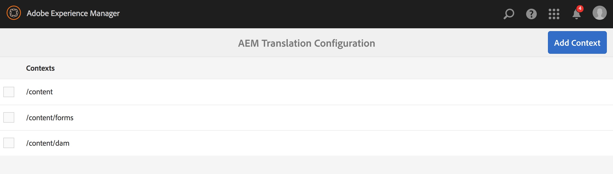
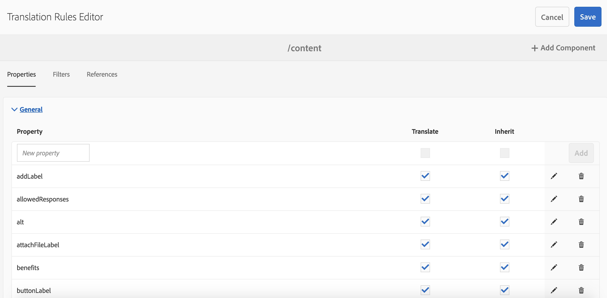
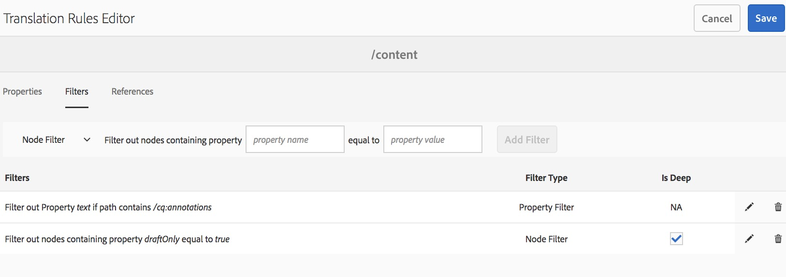
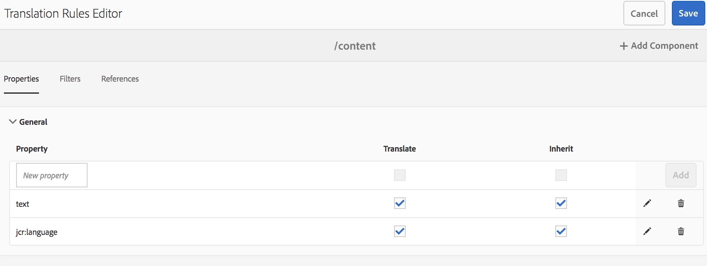

# 識別要翻譯的內容{#identifying-content-to-translate}

翻譯規則可識別翻譯專案中包含或排除的頁面、元件和資產的翻譯內容。 當要翻譯頁面或資產時，AEM會擷取此內容，以便將它傳送至翻譯服務。

頁面和資產在JCR儲存庫中以節點表示。 提取的內容是節點的一個或多個屬性值。 翻譯規則可識別包含要提取內容的屬性。

翻譯規則以XML格式表示，並儲存在以下可能的位置：

* `/libs/settings/translation/rules/translation_rules.xml`
* `/apps/settings/translation/rules/translation_rules.xml`
* `/conf/global/settings/translation/rules/translation_rules.xml`

該檔案適用於所有翻譯項目。

>[!NOTE]
>
>升級至6.4後，建議將檔案從/etc移動。 如需詳 [細資訊，請參閱AEM 6.5中的「通用資料庫重組](/help/sites-deploying/all-repository-restructuring-in-aem-6-5.md#translation-rules) 」。

規則包含下列資訊：

* 應用規則的節點的路徑。 該規則也適用於節點的後代。
* 包含要翻譯內容的節點屬性的名稱。 屬性可以特定於特定資源類型或所有資源類型。

例如，您可以建立規則，將作者新增的內容轉譯至您頁面上的所有AEM基礎文字元件。 該規則可以標識 `/content` 該元件的節 `text` 點和屬 `foundation/components/text` 性。

已添加一 [個控制台](#translation-rules-ui) ，用於配置翻譯規則。 UI中的定義將為您填入檔案。

如需AEM中內容轉譯功能的概觀，請參閱「多語 [言網站的轉譯內容」](/help/sites-administering/translation.md)。

>[!NOTE]
>
>AEM支援資源類型與參考屬性之間的一對一對應，以轉換頁面上的參考內容。

## 頁面、元件和資產的規則語法 {#rule-syntax-for-pages-components-and-assets}

規則是包含一 `node` 或多個子元素及零或 `property` 多個子元素的元 `node` 素：

```xml
<node path="content path">
          <property name="property name" [translate="false"]/>
          <node resourceType="component path" >
               <property name="property name" [translate="false"]/>
          </node>
</node>
```

這些元素 `node` 各有下列特點：

* 該 `path` 屬性包含規則所應用分支的根節點路徑。
* 子元 `property` 素標識要轉換所有資源類型的節點屬性：

   * 屬性 `name` 包含屬性名稱。
   * 如果屬 `translate` 性未轉 `false` 換，則可選屬性為等於。 預設值為 `true`。 此屬性在覆寫先前的規則時很有用。

* 子元 `node` 素標識要針對特定資源類型轉換的節點屬性：

   * 該 `resourceType` 屬性包含解析到實現資源類型的元件的路徑。
   * 子元 `property` 素標識要翻譯的節點屬性。 使用此節點的方式與節點規則的子 `property` 元素相同。

下列範例規則會針對節點下方的所 `text` 有頁面，轉換所有屬性的 `/content` 內容。 此規則對於任何將內容儲存在屬性中的元 `text` 件（例如基礎文字元件和基礎影像元件）都有效。

```xml
<node path="/content">
          <property name="text"/>
</node>
```

下列範例會轉譯所有屬性的 `text` 內容，也會轉譯基礎影像元件的其他屬性。 如果其他元件具有相同名稱的屬性，則規則不適用於這些元件。

```xml
<node path="/content">
      <property name="text"/>
      <node resourceType="foundation/components/textimage">
         <property name="image/alt"/>
         <property name="image/jcr:description"/>
         <property name="image/jcr:title"/>
      </node>
</node>
```

## 從頁面擷取資產的規則語法 {#rule-syntax-for-extracting-assets-from-pages}

使用下列規則語法，以包含內嵌在元件中或從元件參考的資產：

```xml
<assetNode resourceType="path to component" assetReferenceAttribute="property that stores asset"/>
```

每個 `assetNode` 元素都有下列特性：

* 一個 `resourceType` 屬性等於解析到元件的路徑。
* 一個 `assetReferenceAttribute` 屬性等於儲存資產二進位檔案（內嵌資產）或參考資產路徑的屬性名稱。

下列範例從基礎影像元件擷取影像：

```xml
<assetNode resourceType="foundation/components/image" assetReferenceAttribute="fileReference"/>
```

## 覆蓋規則 {#overriding-rules}

translation_rules.xml檔案由包含多個子 `nodelist` 元素的元素 `node` 組成。 AEM會從上到下讀取節點清單。 當多個規則指向相同節點時，會使用檔案中較低的規則。 例如，下列規則會導致屬性中除頁 `text` 面分支外的所有內容 `/content/mysite/en` 都被翻譯：

```xml
<nodelist>
     <node path="/content”>
           <property name="text" />
     </node>
     <node path=“/content/mysite/en”>
          <property name=“text” translate=“false" />
     </node>
<nodelist>
```

## 篩選屬性 {#filtering-properties}

您可以使用元素來篩選具有特定屬性的節 `filter` 點。

例如，下列規則會導致屬性中的所 `text` 有內容都被轉換，但屬性設定為的節點 `draft` 除外 `true`。

```xml
<nodelist>
    <node path="/content”>
     <filter>
   <node containsProperty="draft" propertyValue="true" />
     </filter>
        <property name="text" />
    </node>
<nodelist>
```

## 翻譯規則UI {#translation-rules-ui}

控制台也可用於配置翻譯規則。

若要存取：

1. 導覽至「工 **具** 」，然後 **導覽至「一般**」。

   

1. 選擇「 **翻譯配置**」。

   

從這裡，您可以 **新增內容**。 這可讓您新增路徑。


然後，您需要選取您的內容，然後按一下「編 **輯」**。 這將開啟翻譯規則編輯器。



您可透過UI變更4個屬性： `isDeep`、 `inherit``translate` 和 `updateDestinationLanguage`。

**isDeep** This attribute適用於節點篩選器，預設為true。 它會檢查節點（或其祖先）是否包含篩選器中具有指定屬性值的屬性。 如果為false，則只會檢查目前節點。

例如，即使父節點的屬性設定為true以標籤草稿內容，子節點仍將被添加到轉 `draftOnly` 譯作業中。 這 `isDeep` 里將開始播放，並檢查父節點是否具有屬 `draftOnly` 性為true並排除這些子節點。

在編輯器中，您可以勾選／取消勾選「 **篩選器** 」標 **簽中的「深度** 」。



以下是在UI中未勾選「深度 **」時產生的xml** 範例：

```xml
 <filter>
    <node containsProperty="draftOnly" isDeep="false" propertyValue="true"/>
</filter>
```

**inherit** This is appliable on properties. 依預設，會繼承每個屬性，但是如果您希望某些屬性不會繼承到子項上，則可將該屬性標示為false，以便只套用到該特定節點。

在UI中，您可以勾選／取消勾選「屬 **性** 」標 **簽中的「繼承** 」。


**translate** The translate attribute is used simply to specify wherth to translate a property.

在UI中，您可以勾選／取消勾選「屬 **性** 」標 **簽中的「轉譯** 」。

**updateDestinationLanguage** 此屬性用於沒有文本但沒有語言代碼的屬性，例如jcr:language。 用戶不是在翻譯文本，而是在從源到目標的語言區域設定。 這些屬性不會發送用於翻譯。

在UI中，您可以勾選／取消勾選「屬性 **」標籤中的****** 「翻譯」，但是對於具有語言代碼作為值的特定屬性。

為協助釐清和之 `updateDestinationLanguage` 間的差 `translate`異，以下是僅包含兩個規則的上下文的簡單範例：



xml的結果如下所示：

```xml
<property inherit="true" name="text" translate="true" updateDestinationLanguage="false"/>
<property inherit="true" name="jcr:language" translate="false" updateDestinationLanguage="true"/>
```

## 手動編輯規則檔案 {#editing-the-rules-file-manually}

隨AEM安裝的translation_rules.xml檔案包含一組預設的轉譯規則。 您可以編輯檔案以支援翻譯項目的要求。 例如，您可以新增規則，以便翻譯自訂元件的內容。

如果編輯translation_rules.xml檔案，請將備份副本保存在內容包中。 安裝AEM Service Pack或重新安裝某些AEM套件可以將目前的translation_rules.xml檔案取代為原始檔案。 要在這種情況下恢復規則，可以安裝包含備份副本的軟體包。

>[!NOTE]
>
>建立內容套件後，請在每次編輯檔案時重建該套件。

## 翻譯規則檔案示例 {#example-translation-rules-file}

```xml
<nodelist>
    <!-- translation rules for Geometrixx Demo site (example) -->
    <node path="/content/geometrixx">
        <!-- list all node properties that should be translated -->
        <property name="jcr:title" /> <!-- translation workflows running on content saved in /content/geometrixx, will extract jcr:title values independent of the component. -->
        <property name="jcr:description" />
        <node resourceType ="foundation/components/image"> <!-- translation workflows running on content saved in /content/geometrixx, will extract alternateText values only for Image component. -->
            <property name="alternateText"/>
        </node>
        <node resourceType ="geometrixx/components/title">
            <property name="richText"/>
            <property name="jcr:title" translate="false"/> <!-- translation workflows running on content saved in /content/geometrixx, will not extract jcr:title for Title component, but instead use richText. -->
        </node>
        <node pathContains="/cq:annotations">
            <property name="text" translate="false"/> <!-- translation workflows running on content saved in /content/geometrixx, will not extract text if part of cq:annotations node. -->
        </node>
    </node>
    <!-- translation rules for Geometrixx Outdoors site (example) -->
    <node path="/content/geometrixx-outdoors">
        <node resourceType ="foundation/components/image">
            <property name="alternateText"/>
            <property name="jcr:title" />
        </node>
        <node resourceType ="geometrixx-outdoors/components/title">
            <property name="richText"/>
        </node>
    </node>
    <!-- translation rules for ASSETS (example) -->
    <node path="/content/dam">
        <!-- configure list of metadata properties here -->
        <property name="dc:title" />
        <property name="dc:description" />
    </node>
    <!-- translation rules for extracting ASSETS from SITES content, configure all components that embed or reference assets -->
    <assetNode resourceType="foundation/components/image" assetReferenceAttribute="fileReference"/>
    <assetNode resourceType="foundation/components/video" assetReferenceAttribute="asset"/>
    <assetNode resourceType="foundation/components/download" assetReferenceAttribute="fileReference"/>
    <assetNode resourceType="foundation/components/mobileimage" assetReferenceAttribute="fileReference"/>
    <assetNode resourceType="wcm/foundation/components/image" assetReferenceAttribute="fileReference"/>
</nodelist>
```

