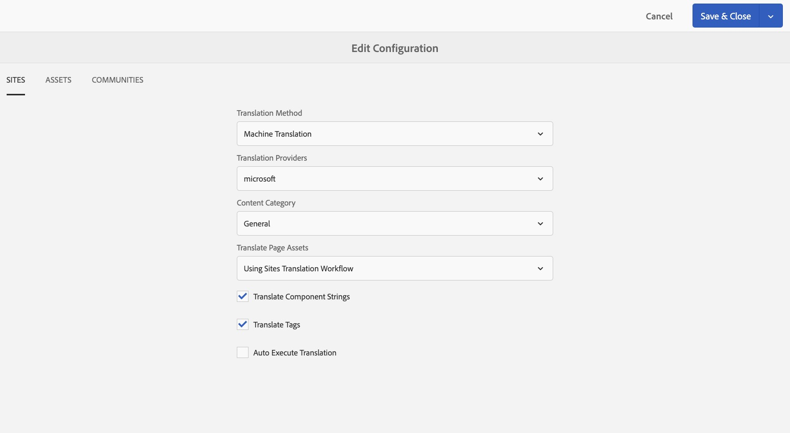

# 設定翻譯整合框架{#configuring-the-translation-integration-framework}

翻譯整合框架會與協力廠商翻譯服務整合，以協調AEM內容的翻譯。

* 連接到您的翻譯服務提供者。
* 建立翻譯整合框架設定。
* 將雲端設定與您的頁面建立關聯。

如需AEM內容翻譯功能的概述，請參閱[翻譯多語言網站的內容](/help/sites-administering/translation.md)。

## 連接到翻譯服務提供者 {#connecting-to-a-translation-service-provider}

建立雲端設定，將AEM連線至您的翻譯服務提供者。

AEM預設包含[連線至Microsoft® Translator](/help/sites-administering/tc-msconf.md)的功能。 其他擁有AEM聯結器且是Adobe Exchange合作夥伴計畫成員的翻譯技術廠商可在[這裡](https://exchange.adobe.com/apps/browse/ec?page=1&partnerLevel=All&product=AEM&q=experience+manager+translation&sort=RELEVANCE)找到。

安裝聯結器套件後，您可以為聯結器建立雲端設定。 通常您需要提供認證來向翻譯服務進行驗證。 如需有關為Microsoft Translator聯結器新增雲端設定的資訊，請參閱[與Microsoft Translator整合](/help/sites-administering/tc-msconf.md)。

您可以視需要為相同的聯結器建立多個雲端設定。 例如，為您在同一廠商的每個帳戶或專案建立一個設定。

設定連線後，您可以建立使用它的翻譯整合框架設定。

## 建立翻譯整合設定 {#creating-a-translation-integration-configuration}

建立翻譯整合框架設定，以指定如何翻譯您的內容。 設定包括以下資訊：

* 要使用的翻譯服務提供者。
* 是要執行人工翻譯還是機器翻譯。
* 是否要翻譯與頁面或資產相關聯的其他內容，例如標籤。

建立框架設定後，請將雲端設定與您要根據該設定翻譯的頁面建立關聯。 開始翻譯流程時，翻譯工作流程會根據關聯的框架設定進行。

若您網站的不同區段有不同的翻譯需求，請據以建立多個框架設定。 例如，多語言網站包含英文、西班牙文和日文版本。 網站擁有者使用兩家不同的翻譯服務提供者提供西班牙文和日文翻譯。 因此，已設定框架的兩個設定。 每個設定使用不同的翻譯服務提供者。

設定翻譯整合架構後，您可以[將其與使用它的頁面](/help/sites-administering/tc-prep.md)建立關聯。

**注意：**&#x200B;如需AEM內容翻譯功能的概述，請參閱[翻譯多語言網站的內容](/help/sites-administering/translation.md)。

此框架的單一設定可控制如何翻譯頁面內容、社群內容和資產。

### 網站組態屬性 {#sites-configuration-properties}

Sites屬性可控制執行頁面內容翻譯的方式。

<table>
 <tbody>
  <tr>
   <th>屬性</th>
   <th>說明</th>
  </tr>
  <tr>
   <td>轉換工作流程</td>
   <td>
選取框架為網站內容執行的翻譯方法：

    <ul>
     <li>機器翻譯：翻譯提供者會使用機器翻譯即時執行翻譯。</li>
     <li>人工翻譯：內容會傳送給翻譯提供者，以供譯者翻譯。 </li>
     <li>不翻譯：不會傳送內容以供翻譯。 這是為了略過某些不會翻譯但可以用最新內容更新的內容分支。</li>
    </ul> </td>
  </tr>
  <tr>
   <td>翻譯提供者</td>
   <td>選取要執行翻譯的翻譯提供者。 安裝提供者的對應聯結器後，清單中就會顯示提供者。</td>
  </tr>
  <tr>
   <td>內容類別</td>
   <td>（僅限機器翻譯）說明您要翻譯之內容的類別。 翻譯內容時，類別可能會影響術語和措辭的選擇。</td>
  </tr>
  <tr>
   <td>翻譯元件字串</td>
   <td>選取此選項可轉譯與頁面相關之元件的元件字串。</td>
  </tr>
  <tr>
   <td>翻譯標記</td>
   <td>選取以翻譯與頁面關聯的標籤。</td>
  </tr>
  <tr>
   <td>翻譯頁面資產</td>
   <td>
選取如何翻譯從檔案系統新增至元件或從Assets參照的資產：

    <ul>
     <li>不翻譯：頁面資產不翻譯。</li>
     <li>使用網站翻譯工作流程： Assets會根據網站標籤上的設定屬性處理。</li>
     <li>使用Assets翻譯工作流程： Assets會根據Assets標籤上的屬性設定來處理。</li>
    </ul> </td>
  </tr>
  <tr>
   <td>自動執行翻譯</td>
   <td>選取此選項可在建立翻譯專案後自動執行翻譯工作。 選擇此選項時，您沒有機會檢閱翻譯工作並設定其範圍。</td>
  </tr>
 </tbody>
</table>

### 社群組態屬性 {#communities-configuration-properties}

Communities屬性可控制如何執行使用者產生的內容翻譯。 翻譯使用者產生的內容一律會使用機器翻譯。 如需詳細資訊，請參閱[翻譯使用者產生的內容](/help/communities/translate-ugc.md)。

| 屬性 | 說明 |
|---|---|
| 翻譯提供者 | 選取要執行翻譯的翻譯提供者。 為其建立雲端設定的提供者會出現在清單中。 |
| 內容類別 | 說明您要翻譯之內容的類別。 翻譯內容時，類別可能會影響術語和措辭的選擇。 |
| 選擇要做為全域共用存放區的地區設定 | （選擇性）選取儲存UGC的語言環境，所有語言副本的貼文都會出現在同一個全域對話中。 依照慣例，為網站選擇[基本語言](/help/communities/sites-console.md#translation)的地區設定。 選擇「沒有通用存放區」會停用全域轉譯。 預設會停用全域翻譯。 |

### Assets設定屬性 {#assets-configuration-properties}

Assets屬性可控制如何設定資產。 如需有關翻譯資產的詳細資訊，請參閱[建立Assets的語言復本](/help/assets/translation-projects.md)。

<table>
 <tbody>
  <tr>
   <th>屬性</th>
   <th>說明</th>
  </tr>
  <tr>
   <td>轉換工作流程</td>
   <td>
選取框架為資產執行的翻譯型別：

    <ul>
     <li>機器翻譯：翻譯提供者會使用機器翻譯立即執行翻譯。</li>
     <li>人工翻譯：內容會自動傳送給翻譯提供者，以供手動翻譯。 </li>
     <li>不翻譯：不會傳送Assets以供翻譯。</li>
    </ul> </td>
  </tr>
  <tr>
   <td>翻譯提供者</td>
   <td>選取要執行翻譯的翻譯提供者。 安裝提供者的對應聯結器後，清單中就會顯示提供者。</td>
  </tr>
  <tr>
   <td>內容類別</td>
   <td>（僅限機器翻譯）說明您要翻譯之內容的類別。 翻譯內容時，類別可能會影響術語和措辭的選擇。</td>
  </tr>
  <tr>
   <td>翻譯資產</td>
   <td>選取以在翻譯專案中包含資產。 </td>
  </tr>
  <tr>
   <td>翻譯中繼資料</td>
   <td>選取以翻譯資產中繼資料。</td>
  </tr>
  <tr>
   <td>翻譯標記</td>
   <td>選取以翻譯與資產相關聯的標籤。</td>
  </tr>
  <tr>
   <td>自動執行翻譯</td>
   <td>選取此選項可在建立翻譯專案後自動執行翻譯工作。 選擇此選項時，您沒有機會檢閱翻譯工作或劃定其範圍。</td>
  </tr>
 </tbody>
</table>

1. 按一下側邊欄中的「工具>作業>雲端>Cloud Service」 。
1. 在「翻譯整合」區域中，是否已建立任何設定會決定要顯示的連結：

   * 如果尚未建立任何設定，請按一下「立即設定」。
   * 如果組態已經存在，請按一下[顯示組態]，然後按一下[可用組態]旁邊顯示的+連結。

1. 輸入組態名稱，然後按一下「建立」。
1. 在「網站」、「社群」和「Assets」標籤上設定屬性，然後按一下「確定」。

## 設定頁面以供翻譯 {#configuring-pages-for-translation}

若要設定將來源頁面翻譯成其他語言的功能，請將這些頁面與下列雲端設定建立關聯：

* 用於將AEM連線到您的翻譯提供商的雲端設定。
* 可設定翻譯詳細資訊的翻譯整合架構。

翻譯整合框架雲端設定會識別要用於連線至服務提供者的雲端設定。 將來源頁面與框架雲端設定建立關聯時，該頁面必須與框架雲端設定使用的服務提供者雲端設定建立關聯。

將頁面與雲端設定建立關聯時，該頁面的子系會繼承該關聯。 例如，如果您將/content/geometrixx/en/products頁面與翻譯整合框架建立關聯，產品頁面及其下方的所有頁面就會根據該框架進行翻譯。

必要時，您可以覆寫子代頁面上的關聯。 例如，網站的內容大多與服裝有關。 不過，其中一個頁面分支會說明公司。 網站的根頁面與指定使用「服飾」類別進行機器翻譯的翻譯整合架構相關聯。 說明公司的分支使用框架，該框架會使用「一般」類別執行機器翻譯。

此外，對於頁面上的任何社群[SCF元件](/help/communities/scf.md)，使用者產生的內容(UGC)將包含使用者翻譯內容的能力。 如需詳細資訊，請參閱[翻譯使用者產生的內容](/help/communities/translate-ugc.md)。

### 將頁面與翻譯提供者建立關聯 {#associating-a-page-with-a-translation-provider}

將頁面與您用來翻譯頁面和後代頁面的翻譯提供者建立關聯。

1. 在網站主控台中，選取要設定的頁面，然後按一下檢視屬性。
1. 按一下「編輯」 ，然後按一下「Cloud Service」標籤。
1. 按一下「新增設定>翻譯整合」 。
1. 選取要使用的翻譯提供者，然後按一下「完成」。

### 將頁面與翻譯整合框架建立關聯 {#associating-pages-with-a-translation-integration-framework}

將頁面與定義您要如何執行頁面和後代頁面翻譯的翻譯整合框架建立關聯。

1. 在網站主控台中，選取要設定的頁面，然後按一下檢視屬性。
1. 按一下「編輯」 ，然後按一下「Cloud Service」標籤。
1. 按一下「新增設定>翻譯整合」 。
1. 選取要使用的翻譯整合架構，然後按一下「完成」。
